# Analysis of Single-cell Gene Expression Data <span style="font-size:20px">(integration) v2.1.0</span>

## Bioinformatics Core Facility, University of Manchester

1. [Prepare workspace](#1---Prepare-workspace)
2. [Import data](#2---Import-data)
3. [Prepare data for integration](#3---Prepare-data-for-integration)
4. [Data integration](#4---Data-integration)
5. [Cell clustering](#5---Cell-clustering)
6. [Expression of manually selected genes](#6---Expression-of-manually-selected-genes)
7. [Define per-cluster cell types](#7---Define-per-cluster-cell-types)
8. [Marker gene detection](#8---Marker-gene-detection)
9. [DE analysis between conditions](#9---DE-analysis-between-conditions)
10. [DE analysis between conditions in each cluster/cell type](#10---DE-analysis-between-conditions-in-each-cluster/cell-type)
11. [Functional analysis using `enrichR`](#11---Functional-analysis-using-enrichR)

<span style="font-size:12px; font-style:italic">Workflow and Shiny App GitHub: https://github.com/fls-bioinformatics-core/sc-gex</span>

# Project summary

*Add experimental details here. For example:*

<div class="alert alert-info">
    <b>Kidney and Lung DTCs Matched PBMC MultiPro® Human Discovery Panel</b> <a href ="https://www.10xgenomics.com/datasets/160k_DTC_Matched_PBMC_MultiPro_Human_Discovery_Panel">Link</a>
    <br /><br />
    DTCs and matched PBMCs were obtained from Discovery Life Sciences, including Stage I kidney cancer DTCs, Stage I kidney cancer matched PBMCs, Stage III kidney cancer DTCs, Stage III kidney cancer matched PBMCs, Stage III lung cancer DTCs, and Stage III lung cancer matched PBMCs. Control PBMCs were obtained from AllCells.
    <br /><br />
    Samples were prepared in accordance with the Cell Preparation Guide Handbook (CG00053) for Tips & Best Practices on handling and counting cells. Consult Cell Thawing Protocols for Single Cell Assays (CG000447) for guidance on thawing dissociated tumor cells.
    <br /><br />
    Antibody staining was performed as described in Intracellular Protein Labeling Protocol section of the Demonstrated Protocol Cell Surface & Intracellular Protein Labeling for GEM-X Flex Gene Expression (CG000781, Rev A) and Flex assay was performed as described in the GEM-X Flex Gene Expression Reagent Kits for Multiplexed Samples with Feature Barcode technology for Protein using Barcode Oligo Capture User Guide (CG000789). Libraries were sequenced on an Illumina NovaSeq 6000 with approximately 40,000 paired end reads/cell for Gene Expression and 20,000 paired end reads/cell for Feature Barcode libraries.
    <br /><br />
    Dual indexing libraries were sequenced with the following scheme:
    <ul>
        <li>28 cycles Read 1</li>
        <li>10 cycles i7</li>
        <li>10 cycles i5</li>
        <li>90 cycles Read 2</li>
    </ul>
</div>

## Sample summary

<a href="#Show-run-info">See below</a>.

# 1 - Prepare workspace

**Tested on R version 4.5 and Bioconductor version 3.22**

- Set sample names and paths to the directories where the HDF5-based object were saved
- Load R libraries
- Set up colour palettes

## Define sample names and HDF5 paths


```R
# Set sample name
sample_names <- c("Control1",
                  "KidneyCancer",
                  "LungCancer")

# Set the paths to the directories where the HDF5-based object were saved, in the same order as sample names
h5_files <- c("../160k_Human_Control1_PBMC/Control1_h5_sce", 
              "../160k_Human_Kidney_Cancer_PBMC/KidneyCancer_h5_sce",
              "../160k_Human_Lung_Cancer_PBMC/LungCancer_h5_sce")

# Show info
h5_df <- data.frame(Sample = sample_names, Type = "Processed SingleCellExperiment", HDF5 = h5_files)
h5_df$Sample <- factor(h5_df$Sample, levels = sample_names)
h5_df
```


<table class="dataframe">
<caption>A data.frame: 3 × 3</caption>
<thead>
	<tr><th scope=col>Sample</th><th scope=col>Type</th><th scope=col>HDF5</th></tr>
	<tr><th scope=col>&lt;fct&gt;</th><th scope=col>&lt;chr&gt;</th><th scope=col>&lt;chr&gt;</th></tr>
</thead>
<tbody>
	<tr><td>Control1    </td><td>Processed SingleCellExperiment</td><td>../160k_Human_Control1_PBMC/Control1_h5_sce         </td></tr>
	<tr><td>KidneyCancer</td><td>Processed SingleCellExperiment</td><td>../160k_Human_Kidney_Cancer_PBMC/KidneyCancer_h5_sce</td></tr>
	<tr><td>LungCancer  </td><td>Processed SingleCellExperiment</td><td>../160k_Human_Lung_Cancer_PBMC/LungCancer_h5_sce    </td></tr>
</tbody>
</table>


## Load libraries

The required R packages are listed below. This workflow has been tested on **R version 4.5 (Bioconductor version 3.22)** and latest versions of the packages supported in this R environment (see <a href=#Session-Info>Session Info</a>).  

Commented line below are packages that are required but we are not loading and attaching them.

<div class="alert alert-info">
    The <strong>scRUtils</strong> R package is current available only on <a href="https://github.com/ycl6/scRUtils" target="_blank">GitHub</a>. It can be installed using <code>devtools::install_github("ycl6/scRUtils")</code>.
</div>


```R
suppressPackageStartupMessages({
    # R-4.5.2
    library(batchelor)     # Single-cell batch correction methods
    library(BiocNeighbors) # AnnoyParam
    library(BiocParallel)  # SerialParam, MulticoreParam
    library(bluster)       # clusterRows, NNGraphParam
    library(cowplot)       # theme_cowplot, plot_grid
    library(DESeq2)
    library(edgeR)
    library(enrichR)
    library(ggplot2)
    library(pheatmap)
    library(scales)
    library(scater)
    library(scran)
    library(viridis)

#    Access the exact function with "::" without load and attach package
#    library(BiocSingular)  # RandomParam, IrlbaParam
#    library(dplyr)         # select
#    library(ggplotify)     # as.ggplot
#    library(ggrepel)       # geom_text_repel
#    library(gtools)        # mixedsort
#    library(HDF5Array)     # loadHDF5SummarizedExperiment, saveHDF5SummarizedExperiment
#    library(limma)         # plotMDS
#    library(pals)          # cols25, kovesi.rainbow_bgyrm_35_85_c69
#    library(RColorBrewer)  # brewer.pal
#    library(stringi)       # stri_join_list
#    library(stringr)       # str_to_title

    library(scRUtils)       # with customised functions
    library(tidyverse)
})
```

## Set default options


```R
# Set output window width
options(width = 110) # default 80; getOption("width")

# Set figure size; width = 10, height = 7, res = 120
fig()
```

Choose a `BiocParallel` Interface:
- **SerialParam**: Supported on all platforms. Evaluate BiocParallel-enabled code with parallel evaluation disabled.
- **MulticoreParam**: Supported on Unix and Mac. Evaluate BiocParallel-enabled code using multiple cores on a single computer.
- **SnowParam**: Supported on all platforms. Evaluate BiocParallel-enabled code across several distinct instances, on one or several computers.
- **BatchtoolsParam**: Applicable to clusters with formal schedulers. Evaluate BiocParallel-enabled code by submitting to a cluster scheduler like SGE.

<div class="alert alert-info">
    HDF5-based arrays only allow serial reading within a process. Therefore, some of the processing steps in this workflow are using <code>dgCMatrix</code> class matrices to improve performance, while keeping the assays in the <code>SingleCellExperiment</code> object in <code>DelayedMatrix</code> class.
</div>


```R
# Set number of threads for parallelisation
nthreads <- 6

# Choose BiocParallel Interface
bpp <- MulticoreParam(nthreads)
```


```R
# Initialise c30() and c40() palettes
c30 <- c30()
c40 <- c40()

fig(width = 14, height = 7)
par(mfrow = c(1,2), mar=c(0,0,1,0))
pie(rep(1,30), col = c30, radius = 1.5, main = "c30")
pie(rep(1,40), col = c40, radius = 1.5, main = "c40")
reset.fig()
```


    
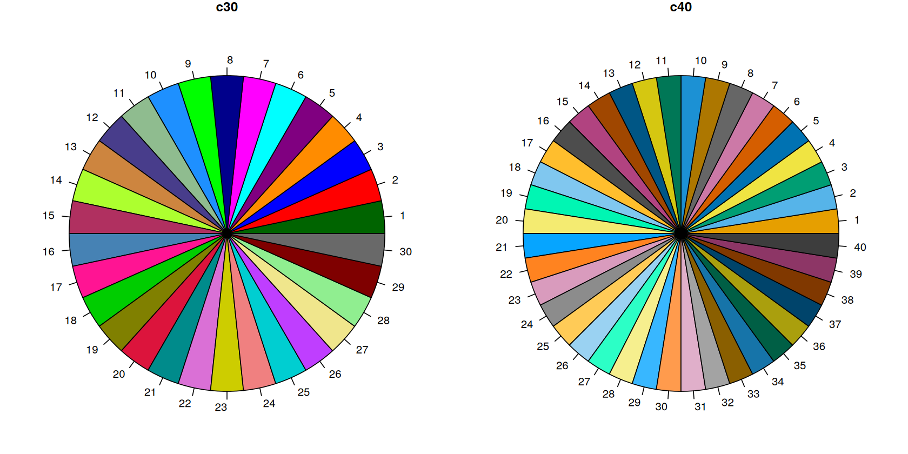
    


```R
# Set colours for samples
c_sample_col <- choosePalette(h5_df$Sample, c30[11:13])
c_sample_col

# Set colours for cell cycle phases
c_phase_col <- setNames(c30[c(20, 3, 9)], c("G1", "S", "G2M"))
c_phase_col

# Set colours for heatmaps
breaks <- seq(-3, 3, by = 0.05) # 121 breaks
c_heatmap_col1 <- plasma(length(breaks), direction = -1) # logcounts
c_heatmap_col2 <- colorRampPalette(rev(RColorBrewer::brewer.pal(11, "RdYlBu")))(length(breaks)) # scaled/z-score
```


<style>
.dl-inline {width: auto; margin:0; padding: 0}
.dl-inline>dt, .dl-inline>dd {float: none; width: auto; display: inline-block}
.dl-inline>dt::after {content: ":\0020"; padding-right: .5ex}
.dl-inline>dt:not(:first-of-type) {padding-left: .5ex}
</style><dl class=dl-inline><dt>Control1</dt><dd>'#8fbc8f'</dd><dt>KidneyCancer</dt><dd>'#483d8b'</dd><dt>LungCancer</dt><dd>'#cd853f'</dd></dl>


<style>
.dl-inline {width: auto; margin:0; padding: 0}
.dl-inline>dt, .dl-inline>dd {float: none; width: auto; display: inline-block}
.dl-inline>dt::after {content: ":\0020"; padding-right: .5ex}
.dl-inline>dt:not(:first-of-type) {padding-left: .5ex}
</style><dl class=dl-inline><dt>G1</dt><dd>'#dc143c'</dd><dt>S</dt><dd>'#0000ff'</dd><dt>G2M</dt><dd>'#00ff00'</dd></dl>


# 2 - Import data

## Load HDF5 objects

Here, we use the `loadHDF5SummarizedExperiment` function from the `HDF5Array` R package to import HDF5 files.


```R
all.sce <- list()
barcodes <- data.frame(Sample = NULL, Barcodes = NULL)
for(i in 1:length(h5_df$Sample)) {
    sample_name <- as.character(h5_df$Sample[i])
    message(paste("Read HDF5 files:", sample_name))
    sce <- HDF5Array::loadHDF5SummarizedExperiment(h5_df$HDF5[i])
    levels(sce$Sample) <- sample_name

    # Add Sample ID to Barcode as prefix to make cell barcodes unique
    colnames(sce) <- paste0(sce$Sample, "_", sce$Barcode)
    sce$Barcode <- colnames(sce)

    print(sce)
    flush.console()

    all.sce[[sample_name]] <- sce
}
```

    Read HDF5 files: Control1
    


    class: SingleCellExperiment 
    dim: 18129 18460 
    metadata(7): Samples cyclone ... enrichR_findMarkers_Cluster_up runInfo
    assays(2): counts logcounts
    rownames(18129): SAMD11 NOC2L ... MT-ND6 MT-CYB
    rowData names(12): ID Symbol ... pct_dropout is_hvg
    colnames(18460): Control1_AAACAAGCAACAAGTTACTTTAGG-1 Control1_AAACAAGCAACTAGTGACTTTAGG-1 ...
      Control1_TTTGTGAGTGGCGTAGACTTTAGG-1 Control1_TTTGTGAGTTAATTCGACTTTAGG-1
    colData names(24): Sample Barcode ... log10Sum DoubletDensity
    reducedDimNames(3): PCA TSNE UMAP
    mainExpName: Gene Expression
    altExpNames(1): Antibody Capture


    Read HDF5 files: KidneyCancer
    


    class: SingleCellExperiment 
    dim: 18129 17168 
    metadata(7): Samples cyclone ... enrichR_findMarkers_Cluster_up runInfo
    assays(2): counts logcounts
    rownames(18129): SAMD11 NOC2L ... MT-ND6 MT-CYB
    rowData names(12): ID Symbol ... pct_dropout is_hvg
    colnames(17168): KidneyCancer_AAACAAGCAAATACCGATGTTGAC-1 KidneyCancer_AAACAAGCAACAGATTATGTTGAC-1
      ... KidneyCancer_TTTGTGAGTGTCCTTCATGTTGAC-1 KidneyCancer_TTTGTGAGTTGGATGAATGTTGAC-1
    colData names(24): Sample Barcode ... log10Sum DoubletDensity
    reducedDimNames(3): PCA TSNE UMAP
    mainExpName: Gene Expression
    altExpNames(1): Antibody Capture


    Read HDF5 files: LungCancer
    


    class: SingleCellExperiment 
    dim: 18129 14037 
    metadata(7): Samples cyclone ... enrichR_findMarkers_Cluster_up runInfo
    assays(2): counts logcounts
    rownames(18129): SAMD11 NOC2L ... MT-ND6 MT-CYB
    rowData names(12): ID Symbol ... pct_dropout is_hvg
    colnames(14037): LungCancer_AAACAAGCAAGGCCTGAGCTGTGA-1 LungCancer_AAACAAGCACCTTTGGAGCTGTGA-1 ...
      LungCancer_TTTGTGAGTTGAGTCTAGCTGTGA-1 LungCancer_TTTGTGAGTTTACGACAGCTGTGA-1
    colData names(24): Sample Barcode ... log10Sum DoubletDensity
    reducedDimNames(3): PCA TSNE UMAP
    mainExpName: Gene Expression
    altExpNames(1): Antibody Capture


## Show run info


```R
rI <- metadata(all.sce[[1]])[["runInfo"]]
df1 <- data.frame(matrix(ncol = length(rI[[1]]), nrow = 0))
df2 <- data.frame(matrix(ncol = length(rI[[2]]), nrow = 0))

for(i in 1:length(all.sce))
{
    rI <- metadata(all.sce[[i]])[["runInfo"]]
    df1 <- rbind(df1, as.data.frame(t(matrix(rI[[1]]))))
    df2 <- rbind(df2, as.data.frame(t(matrix(rI[[2]]))))
}
colnames(df1) <- names(rI[[1]])
colnames(df2) <- names(rI[[2]])
df2 <- cbind(df1[, 1, drop = FALSE], df2) # Add Sample ID

# Add runInfo
runInfo <- list("Sample" = df1, "Data" = df2)

if (suppressPackageStartupMessages(requireNamespace("kableExtra")) && requireNamespace("IRdisplay")) {
    suppressPackageStartupMessages(library(kableExtra))
    df1 %>% kable("html") %>% kable_styling(font_size = 12, position = "left", full_width = FALSE) %>% 
    column_spec(1:ncol(df1), extra_css = "vertical-align: middle !important;") %>%
    add_header_above(c("Single-cell Sample Summary" = ncol(df1)), bold = TRUE, background = "blue", 
                     color = "white") %>% as.character() %>% IRdisplay::display_html()
    
    df2 %>% kable("html") %>% kable_styling(font_size = 12, position = "left", full_width = FALSE) %>% 
    column_spec(1:ncol(df2), extra_css = 'vertical-align: middle !important;') %>%
    add_header_above(c("Data Processing Summary" = ncol(df2)), bold = TRUE, background = "blue", 
                     color = "white") %>% as.character() %>% IRdisplay::display_html()    
} else {
    message("Single-cell Sample Summary")
    data.frame(df1)
    message("Data Processing Summary")
    data.frame(df2)
}
```


<table class="table" style="font-size: 12px; width: auto !important; ">
 <thead>
<tr><th style="border-bottom:hidden;padding-bottom:0; padding-left:3px;padding-right:3px;text-align: center; font-weight: bold; color: white !important;padding-right: 4px; padding-left: 4px; background-color: blue !important;" colspan="7"><div style="border-bottom: 1px solid #ddd; padding-bottom: 5px; ">Single-cell Sample Summary</div></th></tr>
  <tr>
   <th style="text-align:left;"> Sample ID </th>
   <th style="text-align:left;"> Platform </th>
   <th style="text-align:left;"> Chemistry </th>
   <th style="text-align:left;"> Reference </th>
   <th style="text-align:left;"> Transcriptome </th>
   <th style="text-align:left;"> Probe Set Name </th>
   <th style="text-align:left;"> Pipeline Version </th>
  </tr>
 </thead>
<tbody>
  <tr>
   <td style="text-align:left;vertical-align: middle !important;"> Control1 </td>
   <td style="text-align:left;vertical-align: middle !important;"> 10x Genomics </td>
   <td style="text-align:left;vertical-align: middle !important;"> Flex Gene Expression </td>
   <td style="text-align:left;vertical-align: middle !important;"> GRCh38-2024-A </td>
   <td style="text-align:left;vertical-align: middle !important;"> GRCh38-2024-A </td>
   <td style="text-align:left;vertical-align: middle !important;"> Chromium Human Transcriptome Probe Set v1.1.0 </td>
   <td style="text-align:left;vertical-align: middle !important;"> cellranger-9.0.0 </td>
  </tr>
  <tr>
   <td style="text-align:left;vertical-align: middle !important;"> KidneyCancer </td>
   <td style="text-align:left;vertical-align: middle !important;"> 10x Genomics </td>
   <td style="text-align:left;vertical-align: middle !important;"> Flex Gene Expression </td>
   <td style="text-align:left;vertical-align: middle !important;"> GRCh38-2024-A </td>
   <td style="text-align:left;vertical-align: middle !important;"> GRCh38-2024-A </td>
   <td style="text-align:left;vertical-align: middle !important;"> Chromium Human Transcriptome Probe Set v1.1.0 </td>
   <td style="text-align:left;vertical-align: middle !important;"> cellranger-9.0.0 </td>
  </tr>
  <tr>
   <td style="text-align:left;vertical-align: middle !important;"> LungCancer </td>
   <td style="text-align:left;vertical-align: middle !important;"> 10x Genomics </td>
   <td style="text-align:left;vertical-align: middle !important;"> Flex Gene Expression </td>
   <td style="text-align:left;vertical-align: middle !important;"> GRCh38-2024-A </td>
   <td style="text-align:left;vertical-align: middle !important;"> GRCh38-2024-A </td>
   <td style="text-align:left;vertical-align: middle !important;"> Chromium Human Transcriptome Probe Set v1.1.0 </td>
   <td style="text-align:left;vertical-align: middle !important;"> cellranger-9.0.0 </td>
  </tr>
</tbody>
</table>


<table class="table" style="font-size: 12px; width: auto !important; ">
 <thead>
<tr><th style="border-bottom:hidden;padding-bottom:0; padding-left:3px;padding-right:3px;text-align: center; font-weight: bold; color: white !important;padding-right: 4px; padding-left: 4px; background-color: blue !important;" colspan="9"><div style="border-bottom: 1px solid #ddd; padding-bottom: 5px; ">Data Processing Summary</div></th></tr>
  <tr>
   <th style="text-align:left;"> Sample ID </th>
   <th style="text-align:left;"> Lab/Facility </th>
   <th style="text-align:left;"> Analyst </th>
   <th style="text-align:left;"> Run ID </th>
   <th style="text-align:left;"> Run Name </th>
   <th style="text-align:left;"> Sequencer </th>
   <th style="text-align:left;"> User </th>
   <th style="text-align:left;"> PI </th>
   <th style="text-align:left;"> Organism </th>
  </tr>
 </thead>
<tbody>
  <tr>
   <td style="text-align:left;vertical-align: middle !important;"> Control1 </td>
   <td style="text-align:left;vertical-align: middle !important;"> UoM BCF </td>
   <td style="text-align:left;vertical-align: middle !important;"> I-Hsuan Lin </td>
   <td style="text-align:left;vertical-align: middle !important;"> SOME_RUN_ID </td>
   <td style="text-align:left;vertical-align: middle !important;"> SOME_RUN_NAME </td>
   <td style="text-align:left;vertical-align: middle !important;"> NovaSeq 6000 </td>
   <td style="text-align:left;vertical-align: middle !important;"> SOME_USER </td>
   <td style="text-align:left;vertical-align: middle !important;"> SOME_PI </td>
   <td style="text-align:left;vertical-align: middle !important;"> Human </td>
  </tr>
  <tr>
   <td style="text-align:left;vertical-align: middle !important;"> KidneyCancer </td>
   <td style="text-align:left;vertical-align: middle !important;"> UoM BCF </td>
   <td style="text-align:left;vertical-align: middle !important;"> I-Hsuan Lin </td>
   <td style="text-align:left;vertical-align: middle !important;"> SOME_RUN_ID </td>
   <td style="text-align:left;vertical-align: middle !important;"> SOME_RUN_NAME </td>
   <td style="text-align:left;vertical-align: middle !important;"> NovaSeq 6000 </td>
   <td style="text-align:left;vertical-align: middle !important;"> SOME_USER </td>
   <td style="text-align:left;vertical-align: middle !important;"> SOME_PI </td>
   <td style="text-align:left;vertical-align: middle !important;"> Human </td>
  </tr>
  <tr>
   <td style="text-align:left;vertical-align: middle !important;"> LungCancer </td>
   <td style="text-align:left;vertical-align: middle !important;"> UoM BCF </td>
   <td style="text-align:left;vertical-align: middle !important;"> I-Hsuan Lin </td>
   <td style="text-align:left;vertical-align: middle !important;"> SOME_RUN_ID </td>
   <td style="text-align:left;vertical-align: middle !important;"> SOME_RUN_NAME </td>
   <td style="text-align:left;vertical-align: middle !important;"> NovaSeq 6000 </td>
   <td style="text-align:left;vertical-align: middle !important;"> SOME_USER </td>
   <td style="text-align:left;vertical-align: middle !important;"> SOME_PI </td>
   <td style="text-align:left;vertical-align: middle !important;"> Human </td>
  </tr>
</tbody>
</table>


## Visualising with t-SNE and UMAP


```R
p <- list()
for(i in 1:length(all.sce)) {
    p[[i]] <- plotProjections(all.sce[[i]], "Sample", dimnames = c("TSNE", "UMAP"), point_alpha = 0.01, 
                              feat_color = c_sample_col, text_by = "label", text_size = 7, 
                              legend_pos = "none", show_subtitle = FALSE, theme_size = 14, 
                              titles = sprintf("%s (%s)", names(all.sce[i]), c("TSNE","UMAP")))
}

fig(width = 16, height = 8)
plot_grid(plotlist = p, ncol = 2, align = "h")
reset.fig()
```


    
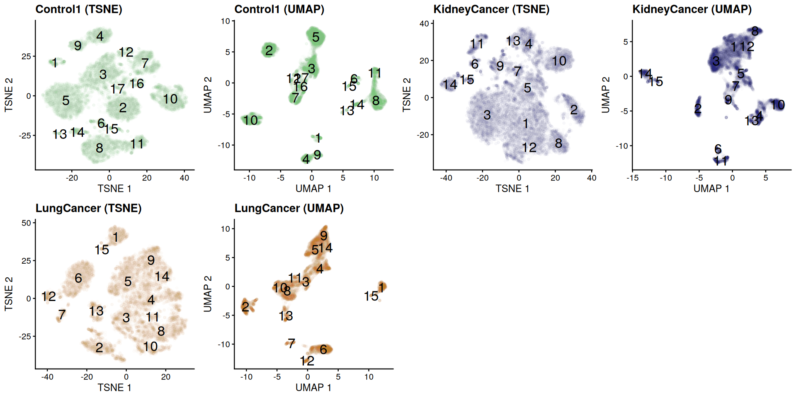
    


# 3 - Prepare data for integration

## Find common genes

Reduce the genes in each dataset to those common genes only


```R
universe1 <- Reduce(intersect, lapply(all.sce, rownames))
cat(sprintf("Common genes: %d\n", length(universe1)))

all.common <- list()
for(i in 1:length(all.sce)) {
    all.common[[names(all.sce)[i]]] <- all.sce[[i]][match(universe1, rownames(all.sce[[i]])),]
}
all.common
```

    Common genes: 18129


    $Control1
    class: SingleCellExperiment 
    dim: 18129 18460 
    metadata(7): Samples cyclone ... enrichR_findMarkers_Cluster_up runInfo
    assays(2): counts logcounts
    rownames(18129): SAMD11 NOC2L ... MT-ND6 MT-CYB
    rowData names(12): ID Symbol ... pct_dropout is_hvg
    colnames(18460): Control1_AAACAAGCAACAAGTTACTTTAGG-1 Control1_AAACAAGCAACTAGTGACTTTAGG-1 ...
      Control1_TTTGTGAGTGGCGTAGACTTTAGG-1 Control1_TTTGTGAGTTAATTCGACTTTAGG-1
    colData names(24): Sample Barcode ... log10Sum DoubletDensity
    reducedDimNames(3): PCA TSNE UMAP
    mainExpName: Gene Expression
    altExpNames(1): Antibody Capture
    
    $KidneyCancer
    class: SingleCellExperiment 
    dim: 18129 17168 
    metadata(7): Samples cyclone ... enrichR_findMarkers_Cluster_up runInfo
    assays(2): counts logcounts
    rownames(18129): SAMD11 NOC2L ... MT-ND6 MT-CYB
    rowData names(12): ID Symbol ... pct_dropout is_hvg
    colnames(17168): KidneyCancer_AAACAAGCAAATACCGATGTTGAC-1 KidneyCancer_AAACAAGCAACAGATTATGTTGAC-1
      ... KidneyCancer_TTTGTGAGTGTCCTTCATGTTGAC-1 KidneyCancer_TTTGTGAGTTGGATGAATGTTGAC-1
    colData names(24): Sample Barcode ... log10Sum DoubletDensity
    reducedDimNames(3): PCA TSNE UMAP
    mainExpName: Gene Expression
    altExpNames(1): Antibody Capture
    
    $LungCancer
    class: SingleCellExperiment 
    dim: 18129 14037 
    metadata(7): Samples cyclone ... enrichR_findMarkers_Cluster_up runInfo
    assays(2): counts logcounts
    rownames(18129): SAMD11 NOC2L ... MT-ND6 MT-CYB
    rowData names(12): ID Symbol ... pct_dropout is_hvg
    colnames(14037): LungCancer_AAACAAGCAAGGCCTGAGCTGTGA-1 LungCancer_AAACAAGCACCTTTGGAGCTGTGA-1 ...
      LungCancer_TTTGTGAGTTGAGTCTAGCTGTGA-1 LungCancer_TTTGTGAGTTTACGACAGCTGTGA-1
    colData names(24): Sample Barcode ... log10Sum DoubletDensity
    reducedDimNames(3): PCA TSNE UMAP
    mainExpName: Gene Expression
    altExpNames(1): Antibody Capture


## Organise data structure

Make all `sce` objects have identical `rowData` and `colData` column names and order.

<div class="alert alert-info">
    <strong>Note!</strong> You may add more columns to show additional features in the integrated object if the columns are present in <u>all the samples</u>.
</div>


```R
# Select rowData columns to keep
rowData_colnames <- c("ID","Symbol","Type","SEQNAME","is_mito")

# Select colData columns to keep
# Add 'coarse_cell_type' and 'fine_cell_type' if using Cell Ranger's Cell Annotation prediction
colData_colnames <- c("Sample","Barcode","sum","detected","subsets_Mt_percent",
                      "log10Sum","sizeFactor","CellCycle","DoubletDensity",
                      #"coarse_cell_type","fine_cell_type",
                      "CellType","label")

# Make all sce have identical rowData and colData column names and order
for(i in 1:length(all.common)) {
    rowData(all.common[[i]]) <- rowData(all.common[[i]])[, rowData_colnames]
    colData(all.common[[i]]) <- colData(all.common[[i]])[, colData_colnames]

    # Clear old reducedDims
    reducedDims(all.common[[i]]) <- list()
}
```


```R
all.common
```


    $Control1
    class: SingleCellExperiment 
    dim: 18129 18460 
    metadata(7): Samples cyclone ... enrichR_findMarkers_Cluster_up runInfo
    assays(2): counts logcounts
    rownames(18129): SAMD11 NOC2L ... MT-ND6 MT-CYB
    rowData names(5): ID Symbol Type SEQNAME is_mito
    colnames(18460): Control1_AAACAAGCAACAAGTTACTTTAGG-1 Control1_AAACAAGCAACTAGTGACTTTAGG-1 ...
      Control1_TTTGTGAGTGGCGTAGACTTTAGG-1 Control1_TTTGTGAGTTAATTCGACTTTAGG-1
    colData names(11): Sample Barcode ... CellType label
    reducedDimNames(0):
    mainExpName: Gene Expression
    altExpNames(1): Antibody Capture
    
    $KidneyCancer
    class: SingleCellExperiment 
    dim: 18129 17168 
    metadata(7): Samples cyclone ... enrichR_findMarkers_Cluster_up runInfo
    assays(2): counts logcounts
    rownames(18129): SAMD11 NOC2L ... MT-ND6 MT-CYB
    rowData names(5): ID Symbol Type SEQNAME is_mito
    colnames(17168): KidneyCancer_AAACAAGCAAATACCGATGTTGAC-1 KidneyCancer_AAACAAGCAACAGATTATGTTGAC-1
      ... KidneyCancer_TTTGTGAGTGTCCTTCATGTTGAC-1 KidneyCancer_TTTGTGAGTTGGATGAATGTTGAC-1
    colData names(11): Sample Barcode ... CellType label
    reducedDimNames(0):
    mainExpName: Gene Expression
    altExpNames(1): Antibody Capture
    
    $LungCancer
    class: SingleCellExperiment 
    dim: 18129 14037 
    metadata(7): Samples cyclone ... enrichR_findMarkers_Cluster_up runInfo
    assays(2): counts logcounts
    rownames(18129): SAMD11 NOC2L ... MT-ND6 MT-CYB
    rowData names(5): ID Symbol Type SEQNAME is_mito
    colnames(14037): LungCancer_AAACAAGCAAGGCCTGAGCTGTGA-1 LungCancer_AAACAAGCACCTTTGGAGCTGTGA-1 ...
      LungCancer_TTTGTGAGTTGAGTCTAGCTGTGA-1 LungCancer_TTTGTGAGTTTACGACAGCTGTGA-1
    colData names(11): Sample Barcode ... CellType label
    reducedDimNames(0):
    mainExpName: Gene Expression
    altExpNames(1): Antibody Capture


## Recomputes log-normalized expression values

The `multiBatchNorm` function recomputes log-normalized expression values (using `logNormCounts`) after adjusting the size factors for systematic differences in coverage between `SingleCellExperiment` objects.


```R
set.seed(12345)
all.common.normed <- do.call(multiBatchNorm, all.common)
all.common.normed
```


    $Control1
    class: SingleCellExperiment 
    dim: 18129 18460 
    metadata(7): Samples cyclone ... enrichR_findMarkers_Cluster_up runInfo
    assays(2): counts logcounts
    rownames(18129): SAMD11 NOC2L ... MT-ND6 MT-CYB
    rowData names(5): ID Symbol Type SEQNAME is_mito
    colnames(18460): Control1_AAACAAGCAACAAGTTACTTTAGG-1 Control1_AAACAAGCAACTAGTGACTTTAGG-1 ...
      Control1_TTTGTGAGTGGCGTAGACTTTAGG-1 Control1_TTTGTGAGTTAATTCGACTTTAGG-1
    colData names(11): Sample Barcode ... CellType label
    reducedDimNames(0):
    mainExpName: Gene Expression
    altExpNames(1): Antibody Capture
    
    $KidneyCancer
    class: SingleCellExperiment 
    dim: 18129 17168 
    metadata(7): Samples cyclone ... enrichR_findMarkers_Cluster_up runInfo
    assays(2): counts logcounts
    rownames(18129): SAMD11 NOC2L ... MT-ND6 MT-CYB
    rowData names(5): ID Symbol Type SEQNAME is_mito
    colnames(17168): KidneyCancer_AAACAAGCAAATACCGATGTTGAC-1 KidneyCancer_AAACAAGCAACAGATTATGTTGAC-1
      ... KidneyCancer_TTTGTGAGTGTCCTTCATGTTGAC-1 KidneyCancer_TTTGTGAGTTGGATGAATGTTGAC-1
    colData names(11): Sample Barcode ... CellType label
    reducedDimNames(0):
    mainExpName: Gene Expression
    altExpNames(1): Antibody Capture
    
    $LungCancer
    class: SingleCellExperiment 
    dim: 18129 14037 
    metadata(7): Samples cyclone ... enrichR_findMarkers_Cluster_up runInfo
    assays(2): counts logcounts
    rownames(18129): SAMD11 NOC2L ... MT-ND6 MT-CYB
    rowData names(5): ID Symbol Type SEQNAME is_mito
    colnames(14037): LungCancer_AAACAAGCAAGGCCTGAGCTGTGA-1 LungCancer_AAACAAGCACCTTTGGAGCTGTGA-1 ...
      LungCancer_TTTGTGAGTTGAGTCTAGCTGTGA-1 LungCancer_TTTGTGAGTTTACGACAGCTGTGA-1
    colData names(11): Sample Barcode ... CellType label
    reducedDimNames(0):
    mainExpName: Gene Expression
    altExpNames(1): Antibody Capture


```R
p <- list()
for(i in 1:length(all.common)) {
    p[[i]] <- ggplot(data.frame(Original = all.common[[i]]$sizeFactor, Normed = all.common.normed[[i]]$sizeFactor),
                     aes(x = Original, y = Normed)) + geom_point(size = 0.5) + 
    geom_abline(intercept = 0, slope = 1, color = "red", linetype = 2, linewidth = 1) +
    theme_bw(base_size = 16) + ggtitle(paste(names(all.common[i]), "sf"))
}

fig(width = 16, height = 4)
plot_grid(plotlist = p, ncol = 4, align = "h")
reset.fig()
```


    
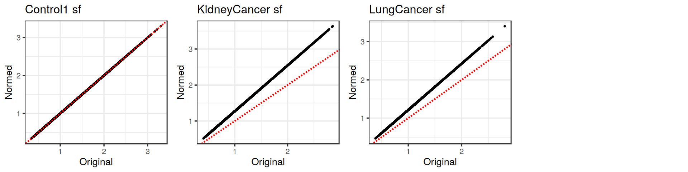
    


Create `dgCMatrix` counts and logcounts matrices for faster computation in some steps.


```R
normed_c <- list()
normed_l <- list()

for(i in names(all.common.normed)) {
    normed_c[[i]] <-  as(counts(all.common.normed[[i]], withDimnames = TRUE), "dgCMatrix")
    normed_l[[i]] <-  as(logcounts(all.common.normed[[i]], withDimnames = TRUE), "dgCMatrix")
}
```

## Feature selection

Identifying HVG based on common genes using re-normalised `SingleCellExperiment` objects.

### Quantifying per-gene variation

Choose to model the variance of the log-expression profiles for each gene (`modelGeneVar`) or model the per-gene count variance with Poisson noise (`modelGeneVarByPoisson`).


```R
# Choose variance modelling method to use
hvg_model <- "modelGeneVarByPoisson" # Or modelGeneVar
all.var <- list()

message(paste0("Using '", hvg_model, "' method"))

for(i in names(all.common.normed)) {
    to_keep <- TRUE # Include all genes
    # Optional
    # Not is_mito and not ribosomal protein-coding genes (Human & Mouse)
    #to_keep <- !rowData(all.common.normed[[i]])$is_mito & 
    #            !grepl("^RPL|^RPS|^Rpl|^Rps", rownames(all.common.normed[[i]]))
    
    if(hvg_model == "modelGeneVar") {
        set.seed(12345)
        all.var[[i]] <- modelGeneVar(normed_l[[i]][to_keep,], BPPARAM = bpp)
    } else {
        set.seed(12345)
        all.var[[i]] <- modelGeneVarByPoisson(normed_c[[i]][to_keep,], 
                                              size.factors = sizeFactors(all.common.normed[[i]]), BPPARAM = bpp)
    }
}

# Print DataFrame
for(i in 1:length(all.common.normed)) {
    cat(paste0("\n", names(all.common.normed)[i], ":\n"))
    all.var[[i]] %>% as.data.frame %>% arrange(FDR, desc(bio)) %>% dplyr::select(1:6) %>% DataFrame %>% print
}
```

    Using 'modelGeneVarByPoisson' method
    


    
    Control1:
    DataFrame with 18129 rows and 6 columns
                 mean     total      tech       bio   p.value       FDR
            <numeric> <numeric> <numeric> <numeric> <numeric> <numeric>
    LYZ       1.45634   4.59072  0.632304   3.95841         0         0
    CD74      3.76971   4.04530  0.178336   3.86697         0         0
    GNLY      1.20764   4.16534  0.640817   3.52452         0         0
    NKG7      1.49643   3.89281  0.627994   3.26482         0         0
    S100A9    1.12832   3.82526  0.634779   3.19048         0         0
    ...           ...       ...       ...       ...       ...       ...
    TGIF2LY         0         0         0         0       NaN       NaN
    PCDH11Y         0         0         0         0       NaN       NaN
    AMELY           0         0         0         0       NaN       NaN
    TSPY1           0         0         0         0       NaN       NaN
    DAZ2            0         0         0         0       NaN       NaN
    
    KidneyCancer:
    DataFrame with 18129 rows and 6 columns
                 mean     total      tech       bio   p.value       FDR
            <numeric> <numeric> <numeric> <numeric> <numeric> <numeric>
    GNLY     1.138577   3.42077  0.485806   2.93496         0         0
    FOS      2.051771   2.70202  0.379939   2.32208         0         0
    CCL5     1.212722   2.68365  0.486043   2.19761         0         0
    CD74     1.797954   2.55010  0.423862   2.12624         0         0
    NKG7     0.993822   2.47213  0.475705   1.99642         0         0
    ...           ...       ...       ...       ...       ...       ...
    PCDH11Y         0         0         0         0       NaN       NaN
    AMELY           0         0         0         0       NaN       NaN
    TBL1Y           0         0         0         0       NaN       NaN
    TSPY1           0         0         0         0       NaN       NaN
    DAZ2            0         0         0         0       NaN       NaN
    
    LungCancer:
    DataFrame with 18129 rows and 6 columns
                 mean     total      tech       bio   p.value       FDR
            <numeric> <numeric> <numeric> <numeric> <numeric> <numeric>
    GNLY     1.720334   5.00735  0.452335   4.55502         0         0
    CD74     2.968303   4.47523  0.231769   4.24346         0         0
    CCL5     2.221786   4.47919  0.362671   4.11652         0         0
    IGHM     0.940615   4.10908  0.481994   3.62709         0         0
    NKG7     1.662264   3.66641  0.461079   3.20533         0         0
    ...           ...       ...       ...       ...       ...       ...
    PCDH11Y         0         0         0         0       NaN       NaN
    AMELY           0         0         0         0       NaN       NaN
    TBL1Y           0         0         0         0       NaN       NaN
    TSPY1           0         0         0         0       NaN       NaN
    DAZ2            0         0         0         0       NaN       NaN


### Selecting HVGs

We perform feature selection by averaging the variance components across all batches with the `combineVar` function. We compute the average as it is responsive to batch-specific HVGs while still preserving the within-batch ranking of genes. In contrast, approaches based on taking the **intersection** or **union** of HVGs across batches become increasingly conservative or liberal, respectively, with an increasing number of batches.


```R
# Select the top N genes with the highest biological components
#hvg_genes <- Reduce(intersect, lapply(all.var, getTopHVGs, n = 5000, var.field = "bio", var.threshold = 0))

# Select the top N% genes with the highest biological components
#hvg_genes <- Reduce(intersect, lapply(all.var, getTopHVGs, prop = 0.20, var.field = "bio", var.threshold = 0))
```

When integrating datasets of variable composition, it is generally safer to err on the side of **including more genes** than are used in a single dataset analysis, to ensure that markers are retained for any dataset-specific subpopulations that might be present. 


```R
combined.var <- do.call(combineVar, all.var)

# Select the top N genes with the highest biological components
hvg_genes <- getTopHVGs(combined.var, n = 3500, var.field = "bio", var.threshold = 0)

# Select genes with positive average biological components
#hvg_genes <- rownames(combined.var)[combined.var$bio > 0]

# Select the top N% genes with the highest biological components
#hvg_genes <- getTopHVGs(combined.var, prop = 0.20, var.field = "bio", var.threshold = 0)
```


```R
message(sprintf("Top %d HVGs selected (%s):", length(hvg_genes), hvg_model))
head(hvg_genes, 20)
```

    Top 3500 HVGs selected (modelGeneVarByPoisson):
    


<style>
.list-inline {list-style: none; margin:0; padding: 0}
.list-inline>li {display: inline-block}
.list-inline>li:not(:last-child)::after {content: "\00b7"; padding: 0 .5ex}
</style>
<ol class=list-inline><li>'GNLY'</li><li>'CD74'</li><li>'NKG7'</li><li>'FOS'</li><li>'CCL5'</li><li>'IGHM'</li><li>'LYZ'</li><li>'TRBC2'</li><li>'S100A9'</li><li>'DUSP1'</li><li>'H1-10'</li><li>'IL32'</li><li>'EFHD2'</li><li>'VIM'</li><li>'JUN'</li><li>'IL7R'</li><li>'SRGN'</li><li>'TCF7'</li><li>'IFI30'</li><li>'SPI1'</li></ol>


<div class="alert alert-info">
    <strong>Tip!</strong> In the accompanied Shiny App, top N HVGs are used as example genes in multi-gene expression visualisation.
</div>


```R
# Add to runInfo
runInfo <- c(runInfo, list(
    "HVG" = list(
        "Method" = hvg_model, 
        "Estimates" = combined.var, 
        "Genes" = hvg_genes)
    )
)
```

# 4 - Data integration

Large single-cell RNA sequencing (scRNA-seq) projects usually need to generate data across multiple batches due to logistical constraints. However, the processing of different batches is often subject to uncontrollable differences, and results in systematic differences in the observed expression in cells from different batches. We also often observe a strong donor effect in integrated datasets. This might be due to differences in cell type composition between donors, but the more likely explanation is that of a technical difference in sample preparation processing or uninteresting genotypic differences.

Computational correction of batch effects is critical for eliminating batch-to-batch variation, allowing data across multiple batches to be combined for common downstream analysis. See [OSCA reference](https://bioconductor.org/books/3.22/OSCA.multisample/integrating-datasets.html)

## Diagnosing batch effects

Before performing any correction, we check that there actually is a batch effect across these datasets by checking that they cluster separately.

### Create a single `SingleCellExperiment` object

Here, we use the `cbind` function to combine `SingleCellExperiment` objects in the list without applying any correction, and we informally verify that cells from different batches are separated using a t-SNE plot.

It is also possible to combine `SingleCellExperiment` objects with the `correctExperiments` function, and without applying any correction using the `NoCorrectParam` flag. However, data stored in `metadata` and `altExps` is not retained.

<div class="alert alert-warning">
    <strong>Warning!</strong>
    <br />
    If it takes longer than 1 minute for the merging to complete, it means there is a problem with <code>cbind()</code> concerning the columns in either <code>rowData()</code> and/or <code>colData()</code>. Interrupt the kernel and check for consistency of the columns of the objects stored in <code>all.common.normed</code>. Alternatively, use <code>correctExperiments()</code> to merge data and it'll throw out warning messages if there's a problem with the data structure.
</div>


```R
#set.seed(12345)
#combined <- correctExperiments(all.common.normed, PARAM = NoCorrectParam())
# Use `cbind` to combine SingleCellExperiment to retain "metadata" and altExps"
combined <- do.call(cbind, all.common.normed)

# Sort meta data
combined$Sample <- factor(combined$Sample, levels = gtools::mixedsort(levels(combined$Sample)))
combined$CellType <- factor(combined$CellType, levels = gtools::mixedsort(levels(combined$CellType)))

# Remove "merged" matrix in the assays slot, as it is identical to the "logcounts" matrix
assay(combined, "merged") <- NULL
combined
```


    class: SingleCellExperiment 
    dim: 18129 49665 
    metadata(21): Samples cyclone ... enrichR_findMarkers_Cluster_up runInfo
    assays(2): counts logcounts
    rownames(18129): SAMD11 NOC2L ... MT-ND6 MT-CYB
    rowData names(5): ID Symbol Type SEQNAME is_mito
    colnames(49665): Control1_AAACAAGCAACAAGTTACTTTAGG-1 Control1_AAACAAGCAACTAGTGACTTTAGG-1 ...
      LungCancer_TTTGTGAGTTGAGTCTAGCTGTGA-1 LungCancer_TTTGTGAGTTTACGACAGCTGTGA-1
    colData names(11): Sample Barcode ... CellType label
    reducedDimNames(0):
    mainExpName: Gene Expression
    altExpNames(1): Antibody Capture


Fix duplicate `metadata` names after combining datasets


```R
# If metadata in single-sample data is identical
if(length(metadata(combined)) %% length(names(all.common.normed)) == 0) {
    n_meta <- length(metadata(combined)) / length(names(all.common.normed))
    for(i in 1:length(names(all.common.normed))) {
        name <- names(all.common.normed)[i]
#        print(name)
        to <- i * n_meta
        from <- to - n_meta + 1
        names(metadata(combined))[from:to] <- paste0(name, "_", names(metadata(combined))[from:to])
    }
} else {
    stop("Not fixed automatically!")
}
```


```R
# Set colours for cell types
c_celltype_col <- choosePalette(combined$CellType, c40)
#c_celltype_col
```


```R
# Add HVG to rowData
rowData(combined)$is_hvg <- FALSE
rowData(combined)[rownames(combined) %in% hvg_genes,]$is_hvg <- TRUE
table("Is HVG" = rowData(combined)$is_hvg)
```


    Is HVG
    FALSE  TRUE 
    14629  3500 


### Add additional variables that describes the samples  to `colData`

<div class="alert alert-warning">
    <strong>Warning!</strong> Need to add additional information about your samples here.
</div>


```R
combined$condition <- combined$Sample
levels(combined$condition) <- c("Control","Cancer","Cancer","Cancer")

# Set colours for condition
c_cond_col <- setNames(c("cyan", "magenta"), c("Control", "Cancer"))
c_cond_col
```


<style>
.dl-inline {width: auto; margin:0; padding: 0}
.dl-inline>dt, .dl-inline>dd {float: none; width: auto; display: inline-block}
.dl-inline>dt::after {content: ":\0020"; padding-right: .5ex}
.dl-inline>dt:not(:first-of-type) {padding-left: .5ex}
</style><dl class=dl-inline><dt>Control</dt><dd>'cyan'</dd><dt>Cancer</dt><dd>'magenta'</dd></dl>


### Run `multiBatchPCA` on the *uncorrected* `logcounts` matrix

The `multiBatchPCA` function perform a principal components analysis across multiple gene expression matrices (i.e. batches) to project all cells to a common low-dimensional space. Default to `d = 50` dimensions.

**weights**: A numeric vector, logical scalar or list specifying the weighting scheme to use. See `?multiBatchPCA` for more details.

<div class="alert alert-warning">
    <strong>Warning!</strong> The PCA, TSNE, UMAP and clustering results will <strong>NOT</strong> be identical between different R versions. Make sure to use the same environment/versions to process (or re-process) data from the same project.
</div>


```R
set.seed(12345)

# Use Randomized SVD algorithm, faster for file-backed matrices
#pca <- multiBatchPCA(normed_l, subset.row = hvg_genes, get.variance = TRUE, 
#                     weights = rep(1, length(normed_l)), 
#                     BSPARAM = BiocSingular::RandomParam(), BPPARAM = bpp)

# Use IRLBA algorithm, default behavior is more accurate
pca <- multiBatchPCA(normed_l, subset.row = hvg_genes, get.variance = TRUE, 
                     #weights = rep(1, length(normed_l)), 
                     BSPARAM = BiocSingular::IrlbaParam(), BPPARAM = bpp)
```


```R
# Re-construct pca object and attributes
rotation <- metadata(pca)$rotation
colnames(rotation) <- paste0("PC", seq_len(ncol(rotation)))
varExplained <- metadata(pca)$var.explained
percentVar <- varExplained/metadata(pca)$var.total*100

pca <- unlist(pca, use.names = FALSE)
colnames(pca) <- paste0("PC", seq_len(ncol(pca)))
attr(pca, "varExplained") <- varExplained
attr(pca, "percentVar") <- percentVar
attr(pca, "rotation") <- rotation
str(pca)

# Store PCA results
reducedDim(combined, "PCA") <- pca
```

     num [1:49665, 1:50] 5.5259 -0.8486 -0.0831 -3.2809 6.8182 ...
     - attr(*, "dimnames")=List of 2
      ..$ : chr [1:49665] "Control1_AAACAAGCAACAAGTTACTTTAGG-1" "Control1_AAACAAGCAACTAGTGACTTTAGG-1" "Control1_AAACAAGCAGTTATCCACTTTAGG-1" "Control1_AAACAAGCATAGCCGGACTTTAGG-1" ...
      ..$ : chr [1:50] "PC1" "PC2" "PC3" "PC4" ...
     - attr(*, "varExplained")= num [1:50] 158.3 89 67.1 52 32.7 ...
     - attr(*, "percentVar")= num [1:50] 8.64 4.85 3.66 2.84 1.78 ...
     - attr(*, "rotation")= num [1:3500, 1:50] 0.00311 0.10852 0.01265 0.07427 -0.01582 ...
      ..- attr(*, "dimnames")=List of 2
      .. ..$ : chr [1:3500] "GNLY" "CD74" "NKG7" "FOS" ...
      .. ..$ : chr [1:50] "PC1" "PC2" "PC3" "PC4" ...


```R
show <- 20 # Show first N PCs

# Scree plot
as.data.frame(percentVar) %>% rownames_to_column("PC") %>% mutate(PC = as.numeric(PC)) %>% head(show) %>%
    ggplot(aes(x = PC, y = percentVar)) + geom_point(size = 3) +
    scale_x_continuous(breaks = seq(0, 50, by = 5)) + theme_cowplot(20) + 
    guides(color = guide_legend(title = "Method")) + theme(legend.position = "top") + 
    labs(x = "PC", y = "Variance explained (%)")
```


    
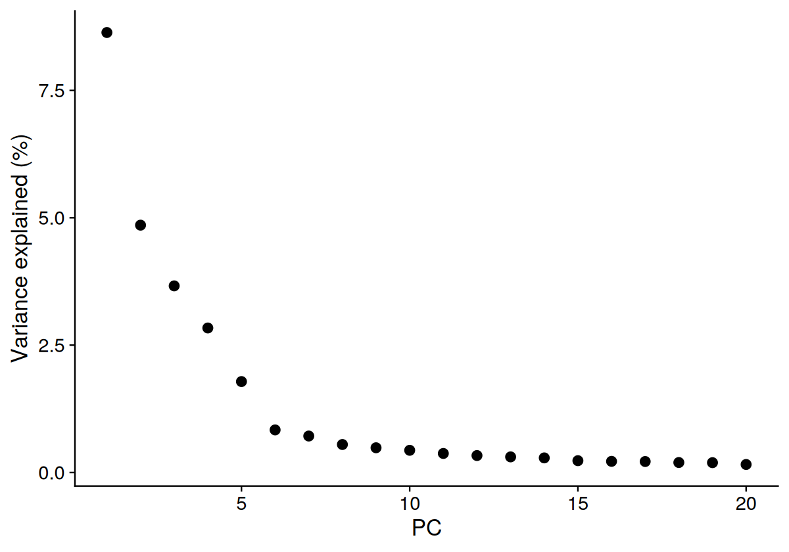
    


### Run `runTSNE` and `runUMAP` to find low-dimensional representations of the *uncorrected* data

For `n_dimred`, better to include more PCs in integrated dataset than that used in a single dataset analysis. The default is 50, i.e. all dimensions.


```R
set.seed(12345)
combined <- runTSNE(combined, dimred = "PCA", name = "TSNE", n_dimred = 30, n_threads = nthreads, BPPARAM = bpp)
```


```R
set.seed(12345)
combined <- runUMAP(combined, dimred = "PCA", name = "UMAP", n_dimred = 30,
                    n_neighbors = 30, spread = 1, min_dist = 0.3, n_threads = nthreads, BPPARAM = bpp)
```


```R
# Added PCA, TSNE, UMAP reducedDims
combined
```


    class: SingleCellExperiment 
    dim: 18129 49665 
    metadata(21): Control1_Samples Control1_cyclone ... LungCancer_enrichR_findMarkers_Cluster_up
      LungCancer_runInfo
    assays(2): counts logcounts
    rownames(18129): SAMD11 NOC2L ... MT-ND6 MT-CYB
    rowData names(6): ID Symbol ... is_mito is_hvg
    colnames(49665): Control1_AAACAAGCAACAAGTTACTTTAGG-1 Control1_AAACAAGCAACTAGTGACTTTAGG-1 ...
      LungCancer_TTTGTGAGTTGAGTCTAGCTGTGA-1 LungCancer_TTTGTGAGTTTACGACAGCTGTGA-1
    colData names(12): Sample Barcode ... label condition
    reducedDimNames(3): PCA TSNE UMAP
    mainExpName: Gene Expression
    altExpNames(1): Antibody Capture


### Visualise the *uncorrected* data in t-SNE and UMAP


```R
fig(width = 16, height = 9)
plotProjections(combined, "Sample", dimnames = c("TSNE", "UMAP"), feat_desc = "Sample", 
                feat_color = c_sample_col, guides_size = 4, point_size = 0.1, point_alpha = 0.1,
                legend_pos = "bottom", guides_nrow = 1, titles = c("TSNE, no correction","UMAP, no correction"))
reset.fig()
```


    
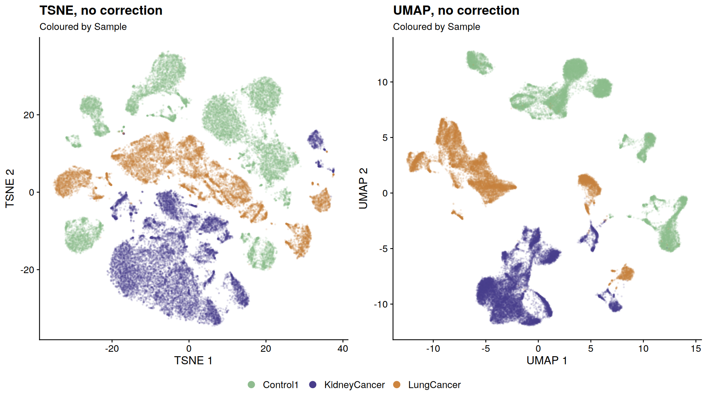
    


```R
fig(width = 16, height = 9)
plotProjections(combined, "CellType", dimnames = c("TSNE", "UMAP"), feat_desc = "Cell Type", 
                feat_color = c_celltype_col, guides_size = 4, point_size = 0.1, point_alpha = 0.1,
                legend_pos = "bottom", guides_nrow = 1, titles = c("TSNE, no correction","UMAP, no correction"))
reset.fig()
```


    
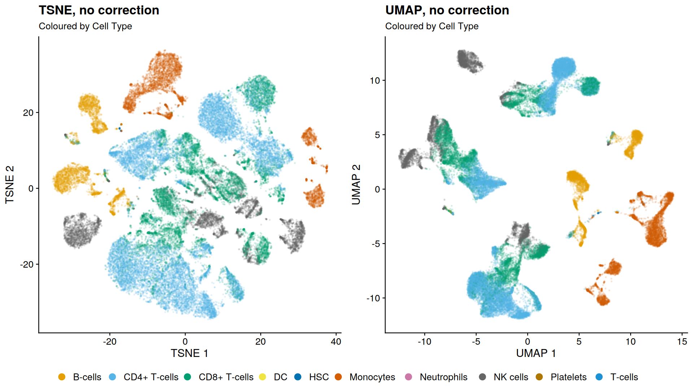
    


<div class="alert alert-info">
    <strong>About this dataset: </strong> (edits required)
    <ul>
        <li>Looks like the batch effect is very significant.</li>
        <li>We will perform correction and see how the corrected data looks like.</li>
    </ul>
</div>

## Performing MNN correction

We use a fast version of the mutual nearest neighbors (MNN) method, `fastMNN`, in the `batchelor` package to correct for batch effects in single-cell expression data. The batch correction functions in batchelor are organized into three levels:

1. At the lowest level, we have the functions that implement a single type of correction, e.g., `fastMNN`.
2. At the next level, we have the `batchCorrect` function that wraps the single-correction function into a common interface.
3. At the highest level, we have the `correctExperiments` function that wraps the `batchCorrect` function.

Here, we run the `batchCorrect` function with the `FastMnnParam` flag to apply the `fastMNN` correction. 

The `multiBatchPCA` function is called when applying `fastMNN` to perform a PCA across multiple batches to project all cells to a common low-dimensional space.

### Controlling the merge order

By default, batches are merged in the user-supplied order in the input `SingleCellExperiment` objects or list. The merge order may occasionally be important as it determines the number of MNN pairs available at each merge step. MNN pairs results in greater stability of the batch vectors and increased likelihood of identifying shared subpopulations, which are important to the precision and accuracy of the MNN-based correction, respectively. The order can be changed by setting the `merge.order` or `auto.merge` arguments. See `?fastMNN` for more details.

**merge.order**: An integer vector containing the linear merge order of batches. Alternatively, a list of lists representing a tree structure specifying a hierarchical merge order. For example, a hierarchical merge to first merge together replicates with the same genotype, and then merge samples across different genotypes. See [Example](https://bioconductor.org/books/3.22/OSCA.multisample/chimeric-mouse-embryo-10x-genomics.html#merging)

**auto.merge**: Use `auto.merge=TRUE` to instruct `fastMNN` automatically identify the “best” merge order (i.e. largest number of MNNs). The aim is to improve the stability of the correction by first merging more similar batches with more MNN pairs. This can be somewhat time-consuming as MNN pairs need to be iteratively recomputed for all possible batch pairings.

Option 1: Use below code to use `auto.merge = TRUE`.


```R
set.seed(12345)
corrected <- batchCorrect(normed_l, subset.row = hvg_genes, 
                          PARAM = FastMnnParam(auto.merge = TRUE, 
                                               #weights = rep(1, length(normed_l)), # 1:1
                                               # use Randomized SVD or IRLBA for PCA
                                               #BSPARAM = BiocSingular::RandomParam(), # Use RandomParam
                                               BSPARAM = BiocSingular::IrlbaParam(),   # Or IrlbaParam
                                               BNPARAM = AnnoyParam(), BPPARAM = bpp))
```

Option 2: Use below code and use `merge.order` to set the merge order if your choice.


```R
#set.seed(12345)
#corrected <- batchCorrect(normed_l, subset.row = hvg_genes, 
#                          PARAM = FastMnnParam(merge.order = list(1, list(2, 3)), 
#                                               weights = rep(1, length(normed_l)), # 1:1
#                                               # use Randomized SVD or IRLBA for PCA
#                                               #BSPARAM = BiocSingular::RandomParam(), # Use RandomParam
#                                               BSPARAM = BiocSingular::IrlbaParam(),   # Or IrlbaParam
#                                               BNPARAM = AnnoyParam(), BPPARAM = bpp))
```

The returned object contains:

- A `batch` column in the `colData` slot, containing the batch of origin for each row (i.e., cell) in corrected.
- A `rotation` column the `rowData` slot, containing the rotation matrix used for the PCA.
- A `reconstructed` matrix in the `assays` slot, containing the low-rank reconstruction of the expression matrix. This can be interpreted as per-gene corrected log-expression values (after cosine normalization, if `cos.norm=TRUE` which is the default setting) but should not be used for quantitative analyses.
- A `corrected` matrix in the `reducedDims` slot, containing corrected low-dimensional coordinates for each cell. 

Additionally, the metadata of the output object contains:

- `merge.info`, a DataFrame of diagnostic information about each merge step.
- `pca.info`, a list of metadata produced by `multiBatchPCA`, such as the variance explained when `get.variance=TRUE`.


```R
corrected
```


    class: SingleCellExperiment 
    dim: 3500 49665 
    metadata(2): merge.info pca.info
    assays(1): reconstructed
    rownames(3500): GNLY CD74 ... CMPK2 ASCC3
    rowData names(1): rotation
    colnames(49665): Control1_AAACAAGCAACAAGTTACTTTAGG-1 Control1_AAACAAGCAACTAGTGACTTTAGG-1 ...
      LungCancer_TTTGTGAGTTGAGTCTAGCTGTGA-1 LungCancer_TTTGTGAGTTTACGACAGCTGTGA-1
    colData names(1): batch
    reducedDimNames(1): corrected
    mainExpName: NULL
    altExpNames(0):


### Check the proportion of variance lost

For `fastMNN()`, one useful diagnostic is the proportion of variance within each batch that is lost during MNN correction. Specifically, this refers to the within-batch variance that is removed during orthogonalization with respect to the average correction vector at each merge step. This is returned via the `lost.var` field in the metadata of returned object, which contains a matrix of the variance lost in each batch (column) at each merge step (row).

Large proportions of lost variance (>10%) suggest that correction is removing genuine biological heterogeneity. This would occur due to violations of the assumption of orthogonality between the batch effect and the biological subspace. If the proportion of lost variance is small, it indicates that non-orthogonality is not a major concern.


```R
metadata(corrected)$merge.info
```


    DataFrame with 2 rows and 6 columns
                         left        right                               pairs batch.size   skipped
                       <List>       <List>                     <DataFrameList>  <numeric> <logical>
    1              LungCancer KidneyCancer 35629:20041,35630:29332,35630:31630   0.729777     FALSE
    2 LungCancer,KidneyCancer     Control1  35644:12864,35644:12006,35644:1220   0.743482     FALSE
                           lost.var
                           <matrix>
    1 0.0000000:0.0116580:0.0117947
    2 0.0112386:0.0182646:0.0165127


```R
data.frame(Order = 1:nrow(metadata(corrected)$merge.info),
           Left = stringi::stri_join_list(as.list(metadata(corrected)$merge.info$left), sep = ", "), 
           Right = stringi::stri_join_list(as.list(metadata(corrected)$merge.info$right)))
```


<table class="dataframe">
<caption>A data.frame: 2 × 3</caption>
<thead>
	<tr><th scope=col>Order</th><th scope=col>Left</th><th scope=col>Right</th></tr>
	<tr><th scope=col>&lt;int&gt;</th><th scope=col>&lt;chr&gt;</th><th scope=col>&lt;chr&gt;</th></tr>
</thead>
<tbody>
	<tr><td>1</td><td>LungCancer              </td><td>KidneyCancer</td></tr>
	<tr><td>2</td><td>LungCancer, KidneyCancer</td><td>Control1    </td></tr>
</tbody>
</table>


```R
metadata(corrected)$merge.info$lost.var
```


<table class="dataframe">
<caption>A matrix: 2 × 3 of type dbl</caption>
<thead>
	<tr><th scope=col>Control1</th><th scope=col>KidneyCancer</th><th scope=col>LungCancer</th></tr>
</thead>
<tbody>
	<tr><td>0.00000000</td><td>0.01165801</td><td>0.01179465</td></tr>
	<tr><td>0.01123859</td><td>0.01826459</td><td>0.01651267</td></tr>
</tbody>
</table>


## Save MNN results

<div class="alert alert-warning">
    <strong>Warning!</strong> The <code>reconstructed</code> matrix in the <code>assays</code> slot contains the corrected expression values for each gene in each cell, obtained by projecting the low-dimensional coordinates in corrected back into gene expression space. <strong>It is not recommended using this for anything other than visualisation.</strong> Use of the corrected values in any quantitative procedure should be treated with caution, and should be backed up by similar results from an analysis on the uncorrected values. See <a href="https://bioconductor.org/books/3.22/OSCA.multisample/using-corrected-values.html">OSCA reference</a>
</div>


```R
reducedDim(combined, "MNN") <- reducedDim(corrected, "corrected")
combined
```


    class: SingleCellExperiment 
    dim: 18129 49665 
    metadata(21): Control1_Samples Control1_cyclone ... LungCancer_enrichR_findMarkers_Cluster_up
      LungCancer_runInfo
    assays(2): counts logcounts
    rownames(18129): SAMD11 NOC2L ... MT-ND6 MT-CYB
    rowData names(6): ID Symbol ... is_mito is_hvg
    colnames(49665): Control1_AAACAAGCAACAAGTTACTTTAGG-1 Control1_AAACAAGCAACTAGTGACTTTAGG-1 ...
      LungCancer_TTTGTGAGTTGAGTCTAGCTGTGA-1 LungCancer_TTTGTGAGTTTACGACAGCTGTGA-1
    colData names(12): Sample Barcode ... label condition
    reducedDimNames(4): PCA TSNE UMAP MNN
    mainExpName: Gene Expression
    altExpNames(1): Antibody Capture


## Visualising before & after MNN corrections with t-SNE


```R
set.seed(12345)
combined <- runTSNE(combined, dimred = "MNN", name = "MNN-TSNE", n_dimred = 30, 
                    n_threads = nthreads, BPPARAM = bpp)
```


```R
fig(width = 16, height = 9)
plotProjections(combined, "Sample", dimnames = c("TSNE", "MNN-TSNE"), feat_desc = "Sample", 
                feat_color = c_sample_col, guides_size = 4, point_size = 0.1, point_alpha = 0.1,
                legend_pos = "bottom", guides_nrow = 1, titles = c("TSNE, no correction","TSNE, MNN correction"))
reset.fig()
```


    
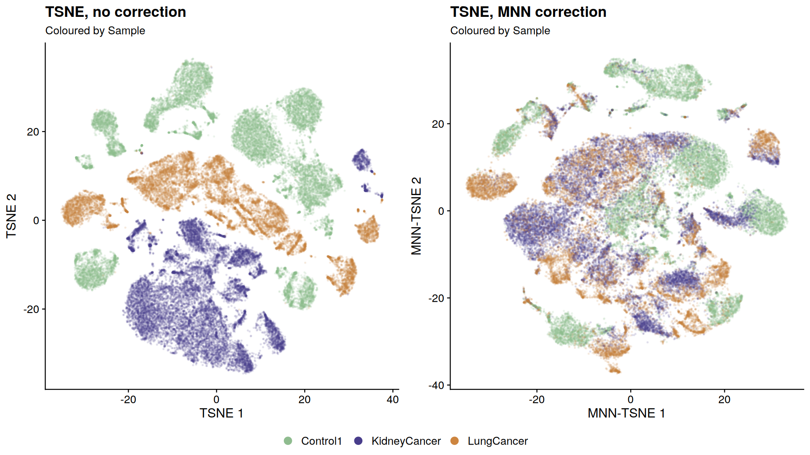
    


```R
fig(width = 16, height = 9)
plotProjections(combined, "CellType", dimnames = c("TSNE", "MNN-TSNE"), feat_desc = "Cell Type", 
                feat_color = c_celltype_col, guides_size = 4, point_size = 0.1, point_alpha = 0.1,
                legend_pos = "bottom", guides_nrow = 1, titles = c("TSNE, no correction","TSNE, MNN correction"))
reset.fig()
```


    
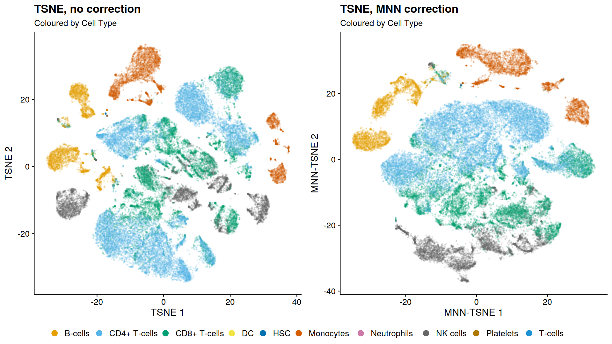
    


## Visualising before & after MNN corrections with UMAP


```R
set.seed(12345)
combined <- runUMAP(combined, dimred = "MNN", name = "MNN-UMAP", n_dimred = 30, 
                    n_neighbors = 30, spread = 1, min_dist = 0.3, n_threads = nthreads, BPPARAM = bpp)
```


```R
fig(width = 16, height = 9)
plotProjections(combined, "Sample", dimnames = c("UMAP", "MNN-UMAP"), feat_desc = "Sample", 
                feat_color = c_sample_col, guides_size = 4, point_size = 0.1, point_alpha = 0.1,
                legend_pos = "bottom", guides_nrow = 1, titles = c("UMAP, no correction","UMAP, MNN correction"))
reset.fig()
```


    
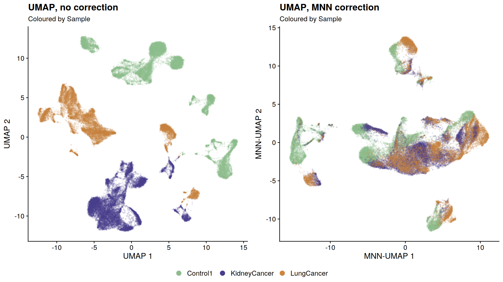
    


```R
fig(width = 16, height = 9)
plotProjections(combined, "CellType", dimnames = c("UMAP", "MNN-UMAP"), feat_desc = "Cell Type", 
                feat_color = c_celltype_col, guides_size = 4, point_size = 0.1, point_alpha = 0.1,
                legend_pos = "bottom", guides_nrow = 1, titles = c("UMAP, no correction","UMAP, MNN correction"))
reset.fig()
```


    
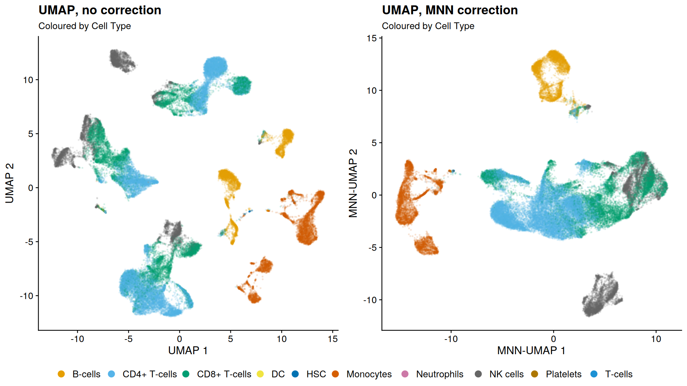
    


### Colour cells by... 

#### Library size `log10Sum`


```R
bk <- seq(min(combined$log10Sum), max(combined$log10Sum), max(combined$log10Sum)/20)
bk <- round(bk, 2)

fig(width = 16, height = 8)
plotProjections(combined, "log10Sum", dimnames = c("MNN-TSNE","MNN-UMAP"), feat_desc = "log10(Sum)", 
                feat_color = rev(rainbow(5)), color_breaks = bk, point_size = 0.1, point_alpha = 0.1, 
                guides_barheight = 15)
reset.fig()
```


    
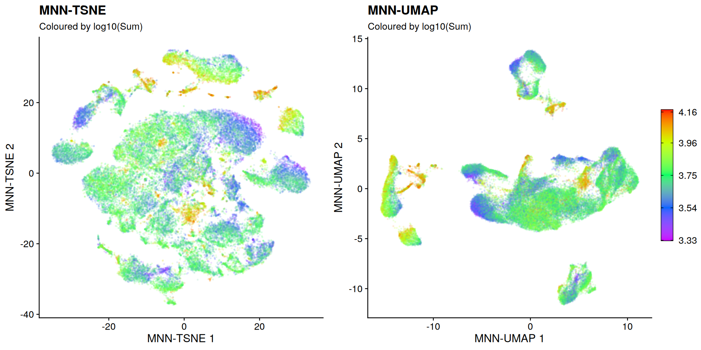
    


#### Doublet score `DoubletDensity`


```R
fig(width = 16, height = 8)
plotProjections(combined, I(log1p(combined$DoubletDensity)), c("MNN-TSNE","MNN-UMAP"), 
                feat_desc = "Doublet Score (log1p)", feat_color = c_heatmap_col1, 
                point_size = 0.1, point_alpha = 0.1, guides_barheight = 15)
reset.fig()
```


    
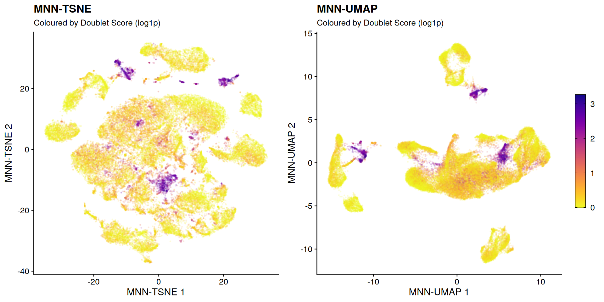
    


# 5 - Cell clustering

Here, we recommend using any or all of graph-based methods, for example **Walktrap**, **Louvain** and **Leiden** algorithms, for cell clustering.

Also, to consider a <strong>2-pass clustering procedure</strong>. A one-time clustering on the full dataset might not yield the desired resolution or subclusters. For a two-step process, first, the cells are separated into smaller subsets based on a initial round of coarse-grain clustering. Then, a second round of clustering is performed on each subset. Finally the clustering results are combined and stored into the full object <code>combined</code>.

Below shows examples of uring `clusterRows()` function to perform the 3 clustering methods. Edit the workflow to perform clustering as one sees fit.

```
set.seed(12345)

# walktrap
clusterRows(mat, full = TRUE, 
            NNGraphParam(cluster.fun = "walktrap", k = k, type = "rank", # default in scran
                         BNPARAM = AnnoyParam(), num.threads = nthreads))

# louvain
clusterRows(mat, full = TRUE, 
            NNGraphParam(cluster.fun = "louvain", k = k, type = "jaccard", # default in Seurat
                         cluster.args = list(resolution = 1),
                         BNPARAM = AnnoyParam(), num.threads = nthreads))

# leiden
clusterRows(mat, full = TRUE, 
            NNGraphParam(cluster.fun = "leiden", k = k, 
                         cluster.args = list(resolution_parameter = 1),
                         BNPARAM = AnnoyParam(), num.threads = nthreads))
```


```R
# Stores clustering labels
my.clusters <- vector(mode = "list")
communities <- vector(mode = "list")
```

## First-pass clustering

Here, we use the faster **Leiden** algorithm to perform a quick coarse clustering.


```R
method <- "leiden"
dimname <- "MNN" # or "PCA" without batch correction
n_dimred <- 20 # number of dimensions to use; default is 50
k <- 15

mat <- reducedDim(combined, dimname)[, seq_len(n_dimred), drop = FALSE]

set.seed(12345)
communities[[method]][[dimname]] <- clusterRows(mat, full = TRUE,
                                                NNGraphParam(cluster.fun = method, k = k, 
                                                             cluster.args = list(resolution_parameter = 0.01),
                                                             BNPARAM = AnnoyParam(), num.threads = nthreads))
my.clusters[[method]][[dimname]] <- factor(communities[[method]][[dimname]]$clusters)
```


```R
cat(sprintf("Cluster assignments using %s from %s:\n", stringr::str_to_title(method), dimname))
table(colData(combined)$Sample, my.clusters[[method]][[dimname]])
plotSilhouette(mat, my.clusters[[method]][[dimname]], printDiff = FALSE, plot = FALSE)

combined$first.pass <- my.clusters[[method]][[dimname]]
```

    Cluster assignments using Leiden from MNN:


                  
                      1    2    3    4    5    6    7    8    9   10   11   12   13
      Control1      328 5472 2714 1415 1613  501 3425  470 2012  313   82  112    3
      KidneyCancer  208 1965 7401 2824  655  155  111 2381  285   23   23  600  537
      LungCancer    274  383 3479 3078 2053   69   77 2112 1279   16    8  463  746


    Silhouette width summary:


       Min. 1st Qu.  Median    Mean 3rd Qu.    Max. 
    -0.4767  0.1122  0.2270  0.2276  0.3702  0.6367 


```R
p1 <- plotProjections(combined, "CellType", dimnames = c("MNN-TSNE", "MNN-UMAP"), feat_desc = "Cell Type", 
                      feat_color = c_celltype_col, text_by = "first.pass", point_size = 0.1, point_alpha = 0.1, 
                      legend_pos = "none", add_void = TRUE)

p2 <- plotProjections(combined, "first.pass", dimnames = c("MNN-TSNE", "MNN-UMAP"), feat_desc = method, 
                      feat_color = c30(), text_by = "first.pass", point_size = 0.1, point_alpha = 0.1,
                      guides_size = 4)

fig(width = 16, height = 15)
plot_grid(p1, p2, ncol = 1)
reset.fig()
```


    
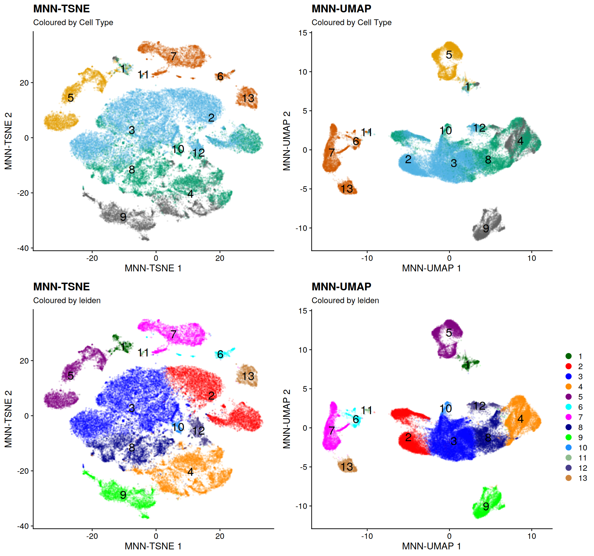
    


### (Optional) Remove randomly scattered cells that have high `DoubletDensity` scores

If there are many cells with high doublet scores randomly scattered on the dimensionality reduction plots (i.e. TSNE or UMAP), we can choose to do a round of doublet cell cleaning now. *The aim is to NOT remove doublet cluster(s).*

<div style="width: 100%; height: 25px; border-bottom: 1px dashed black; text-align: center">
    <span style="font-size: 20px; background-color: yellow; padding: 0 10px;">Begin Optional Step (remove doublet cells)</span>
</div>


```R
fig(width = 16, height = 8)
plotProjections(combined, I(log1p(combined$DoubletDensity)), c("MNN-TSNE","MNN-UMAP"), 
                feat_desc = "Doublet Score (log1p)", feat_color = c_heatmap_col1, text_by = "first.pass", 
                point_size = 0.1, point_alpha = 0.1, guides_barheight = 15)
reset.fig()
```


    
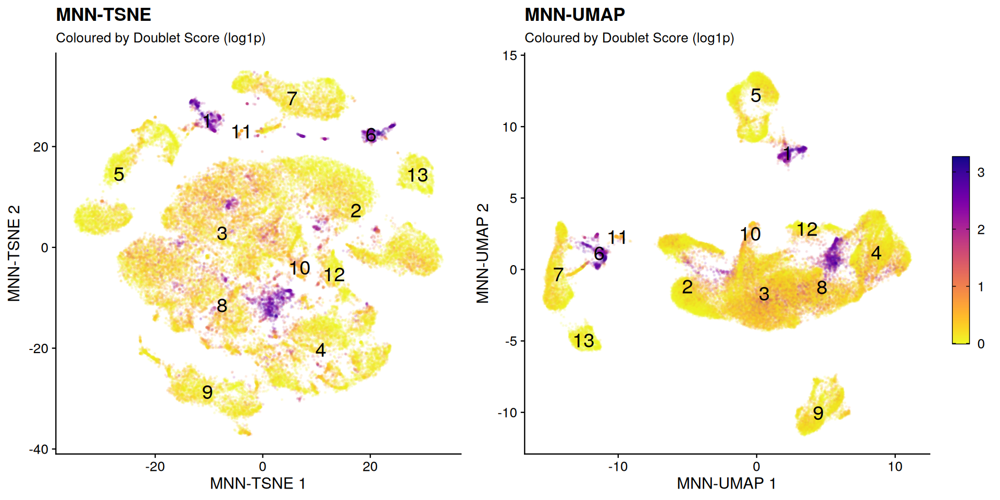
    


#### Define per-sample per-cluster `DoubletDensity` score upperbound thresholds


```R
# Upper limit/outlier: 75% quantile + (IQR * 3)
upper <- as.data.frame(colData(combined)[,c("Sample","first.pass","DoubletDensity")]) %>% 
    group_by(Sample, first.pass) %>% 
    reframe(iqr = iqr(log1p(DoubletDensity)), 
            enframe(quantile(log1p(DoubletDensity), c(0.25, 0.5, 0.75)), "quantile", "Score")) %>% 
    filter(quantile == "75%") %>% mutate(upper = iqr * 3 + Score) %>% arrange(Sample, first.pass)
head(upper)
```


<table class="dataframe">
<caption>A tibble: 6 × 6</caption>
<thead>
	<tr><th scope=col>Sample</th><th scope=col>first.pass</th><th scope=col>iqr</th><th scope=col>quantile</th><th scope=col>Score</th><th scope=col>upper</th></tr>
	<tr><th scope=col>&lt;fct&gt;</th><th scope=col>&lt;fct&gt;</th><th scope=col>&lt;dbl&gt;</th><th scope=col>&lt;chr&gt;</th><th scope=col>&lt;dbl&gt;</th><th scope=col>&lt;dbl&gt;</th></tr>
</thead>
<tbody>
	<tr><td>Control1</td><td>1</td><td>0.3174209</td><td>75%</td><td>2.3855463</td><td>3.3378090</td></tr>
	<tr><td>Control1</td><td>2</td><td>0.3254224</td><td>75%</td><td>0.3646431</td><td>1.3409103</td></tr>
	<tr><td>Control1</td><td>3</td><td>0.5258797</td><td>75%</td><td>0.6392084</td><td>2.2168474</td></tr>
	<tr><td>Control1</td><td>4</td><td>0.2231436</td><td>75%</td><td>0.2623643</td><td>0.9317949</td></tr>
	<tr><td>Control1</td><td>5</td><td>0.1133287</td><td>75%</td><td>0.1133287</td><td>0.4533147</td></tr>
	<tr><td>Control1</td><td>6</td><td>0.3588418</td><td>75%</td><td>2.5802168</td><td>3.6567422</td></tr>
</tbody>
</table>


```R
doublets <- as.data.frame(colData(combined)[,c("Sample","first.pass","DoubletDensity")]) %>%
    rownames_to_column("Barcode") %>% left_join(upper[,c("Sample","first.pass","upper")]) %>%
    filter(log1p(DoubletDensity) > upper)
head(doublets)

table("Is doublet" = colnames(combined) %in% doublets$Barcode)
```

    Joining with `by = join_by(Sample, first.pass)`


<table class="dataframe">
<caption>A data.frame: 6 × 5</caption>
<thead>
	<tr><th></th><th scope=col>Barcode</th><th scope=col>Sample</th><th scope=col>first.pass</th><th scope=col>DoubletDensity</th><th scope=col>upper</th></tr>
	<tr><th></th><th scope=col>&lt;chr&gt;</th><th scope=col>&lt;fct&gt;</th><th scope=col>&lt;fct&gt;</th><th scope=col>&lt;dbl&gt;</th><th scope=col>&lt;dbl&gt;</th></tr>
</thead>
<tbody>
	<tr><th scope=row>1</th><td>Control1_AAATCCTTCATCAGCCACTTTAGG-1</td><td>Control1</td><td>12</td><td>0.72</td><td>0.4533147</td></tr>
	<tr><th scope=row>2</th><td>Control1_AACCAGGTCATGGAACACTTTAGG-1</td><td>Control1</td><td>2 </td><td>4.74</td><td>1.3409103</td></tr>
	<tr><th scope=row>3</th><td>Control1_AACCATAAGAGGCGGAACTTTAGG-1</td><td>Control1</td><td>3 </td><td>9.82</td><td>2.2168474</td></tr>
	<tr><th scope=row>4</th><td>Control1_AACCATAAGCTTATCGACTTTAGG-1</td><td>Control1</td><td>9 </td><td>3.14</td><td>0.8697782</td></tr>
	<tr><th scope=row>5</th><td>Control1_AACCATTTCGCGGATAACTTTAGG-1</td><td>Control1</td><td>9 </td><td>2.46</td><td>0.8697782</td></tr>
	<tr><th scope=row>6</th><td>Control1_AACCATTTCTAATGAGACTTTAGG-1</td><td>Control1</td><td>4 </td><td>1.86</td><td>0.9317949</td></tr>
</tbody>
</table>


    Is doublet
    FALSE  TRUE 
    48563  1102 


```R
fig(width = 16, height = 8)
plotProjections(combined, colnames(combined) %in% doublets$Barcode, c("MNN-TSNE","MNN-UMAP"), 
                feat_desc = "Doublets to be removed", feat_color = c("yellow","red"), 
                point_size = 0.1, point_alpha = 0.1, guides_size = 4, rel_widths = c(9, 1))
reset.fig()
```


    
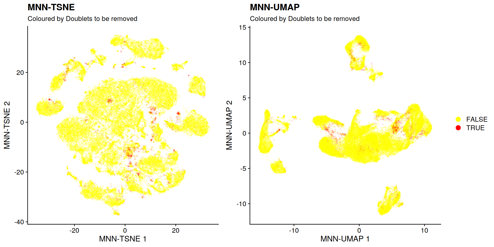
    


#### Remove marked doublet cells and re-do `runTSNE` and `runUMAP`


```R
combined <- combined[, !colnames(combined) %in% doublets$Barcode]
combined
```


    class: SingleCellExperiment 
    dim: 18129 48563 
    metadata(21): Control1_Samples Control1_cyclone ... LungCancer_enrichR_findMarkers_Cluster_up
      LungCancer_runInfo
    assays(2): counts logcounts
    rownames(18129): SAMD11 NOC2L ... MT-ND6 MT-CYB
    rowData names(6): ID Symbol ... is_mito is_hvg
    colnames(48563): Control1_AAACAAGCAACAAGTTACTTTAGG-1 Control1_AAACAAGCAACTAGTGACTTTAGG-1 ...
      LungCancer_TTTGTGAGTTGAGTCTAGCTGTGA-1 LungCancer_TTTGTGAGTTTACGACAGCTGTGA-1
    colData names(13): Sample Barcode ... condition first.pass
    reducedDimNames(6): PCA TSNE ... MNN-TSNE MNN-UMAP
    mainExpName: Gene Expression
    altExpNames(1): Antibody Capture


```R
set.seed(12345)
combined <- runTSNE(combined, dimred = "MNN", name = "MNN-TSNE", n_dimred = 30, 
                    n_threads = nthreads, BPPARAM = bpp)
```


```R
set.seed(12345)
combined <- runUMAP(combined, dimred = "MNN", name = "MNN-UMAP", n_dimred = 30, 
                    n_neighbors = 30, spread = 1, min_dist = 0.3, n_threads = nthreads, BPPARAM = bpp)
```

#### Re-run first-pass clustering using Leiden algorithm


```R
method <- "leiden"
dimname <- "MNN" # or "PCA" without batch correction
n_dimred <- 50 # number of dimensions to use; default is 50
k <- 10

mat <- reducedDim(combined, dimname)[, seq_len(n_dimred), drop = FALSE]

set.seed(12345)
communities[[method]][[dimname]] <- clusterRows(mat, full = TRUE,
                                                NNGraphParam(cluster.fun = method, k = k, 
                                                             cluster.args = list(resolution_parameter = 0.01),
                                                             BNPARAM = AnnoyParam(), num.threads = nthreads))
my.clusters[[method]][[dimname]] <- factor(communities[[method]][[dimname]]$clusters)
```


```R
cat(sprintf("Cluster assignments using %s from %s:\n", stringr::str_to_title(method), dimname))
table(colData(combined)$Sample, my.clusters[[method]][[dimname]])
plotSilhouette(mat, my.clusters[[method]][[dimname]], printDiff = FALSE, plot = FALSE)

combined$first.pass <- my.clusters[[method]][[dimname]]
```

    Cluster assignments using Leiden from MNN:


                  
                      1    2    3    4    5    6    7    8    9   10   11   12   13   14   15   16   17   18   19
      Control1      328 2183 2868 1010 3156  491 1346 2471  291  548  347 1991  632   95   78   23   97   35   98
      KidneyCancer  204  948  617  173  958  154 2689   51   24  456  489  274   29 2015   22 2989 3593   20  551
      LungCancer    268   67  656 1736  324   70 2598   45    7  260   87 1244   22 2368    8  336 2380   17  457
                  
                     20
      Control1        3
      KidneyCancer  530
      LungCancer    736


    Silhouette width summary:


        Min.  1st Qu.   Median     Mean  3rd Qu.     Max. 
    -0.47311  0.04507  0.12990  0.13044  0.20917  0.63412 


<div style="width: 100%; height: 25px; border-bottom: 1px dashed black; text-align: center">
    <span style="font-size: 20px; background-color: yellow; padding: 0 10px;">End Optional Step (remove doublet cells)</span>
</div>


```R
p1 <- plotProjections(combined, "CellType", dimnames = c("MNN-TSNE", "MNN-UMAP"), feat_desc = "Cell Type", 
                      feat_color = c_celltype_col, text_by = "first.pass", point_size = 0.1, point_alpha = 0.1, 
                      legend_pos = "none", add_void = TRUE)

p2 <- plotProjections(combined, "first.pass", dimnames = c("MNN-TSNE", "MNN-UMAP"), feat_desc = method, 
                      feat_color = c30(), text_by = "first.pass", point_size = 0.1, point_alpha = 0.1,
                      guides_size = 4)

fig(width = 16, height = 15)
plot_grid(p1, p2, ncol = 1)
reset.fig()
```


    
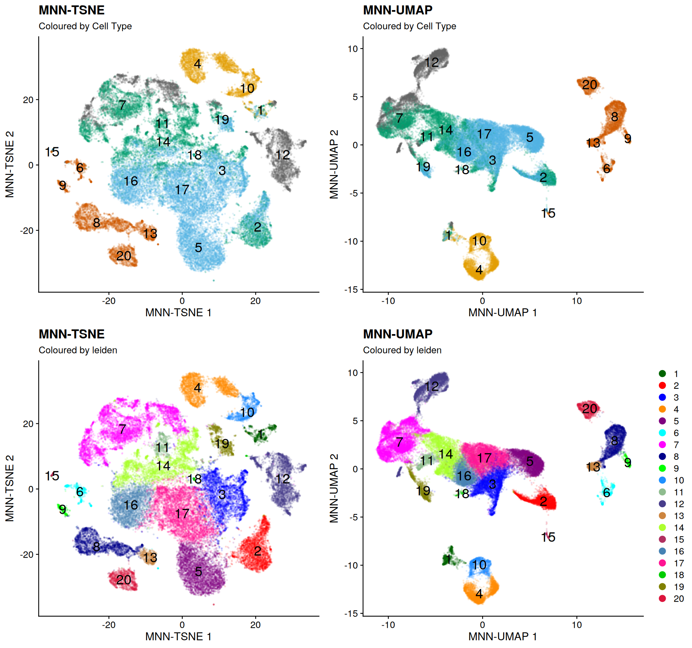
    


## Create subsets

You may divide your cells into subsets containing fewer clusters.

In this example, we create 3 subsets:
<div class="alert alert-info">
    <ul>
        <li>Subset 1: 2, 7, 11, 14</li>
        <li>Subset 2: 3, 5, 16, 17, 18</li>
        <li>Subset 3: 1, 4, 6, 8, 9, 10, 12, 13, 15, 19, 20</li>
    </ul>
</div>

### Create TSNE & UMAP (Subset 1)


```R
subset1 <- combined[, combined$first.pass %in% c(2, 7, 11, 14)]
colData(subset1) <- droplevels(colData(subset1))
dim(subset1)

set.seed(12345)
subset1 <- runTSNE(subset1, dimred = "MNN", name = "MNN-TSNE", n_dimred = 50, n_threads = nthreads, BPPARAM = bpp)

set.seed(12345)
subset1 <- runUMAP(subset1, dimred = "MNN", name = "MNN-UMAP", n_dimred = 50, 
                   n_neighbors = 30, spread = 1, min_dist = 0.3, n_threads = nthreads, BPPARAM = bpp)

p1 <- plotProjections(subset1, "first.pass", dimnames = c("MNN-TSNE", "MNN-UMAP"), feat_desc = "Cluster", 
                      feat_color = c30(), text_by = "first.pass", point_size = 0.1, point_alpha = 0.1, 
                      guides_size = 4, rel_widths = c(8,1))

p2 <- plotProjections(subset1, "CellCycle", dimnames = c("MNN-TSNE", "MNN-UMAP"), feat_desc = "Cell Cycle", 
                      feat_color = c_phase_col, text_by = "first.pass", point_size = 0.1, point_alpha = 0.1,
                      guides_size = 4, rel_widths = c(8,1))

fig(width = 16, height = 15)
plot_grid(p1, p2, ncol = 1)
reset.fig()
```


<style>
.list-inline {list-style: none; margin:0; padding: 0}
.list-inline>li {display: inline-block}
.list-inline>li:not(:last-child)::after {content: "\00b7"; padding: 0 .5ex}
</style>
<ol class=list-inline><li>18129</li><li>15232</li></ol>


    
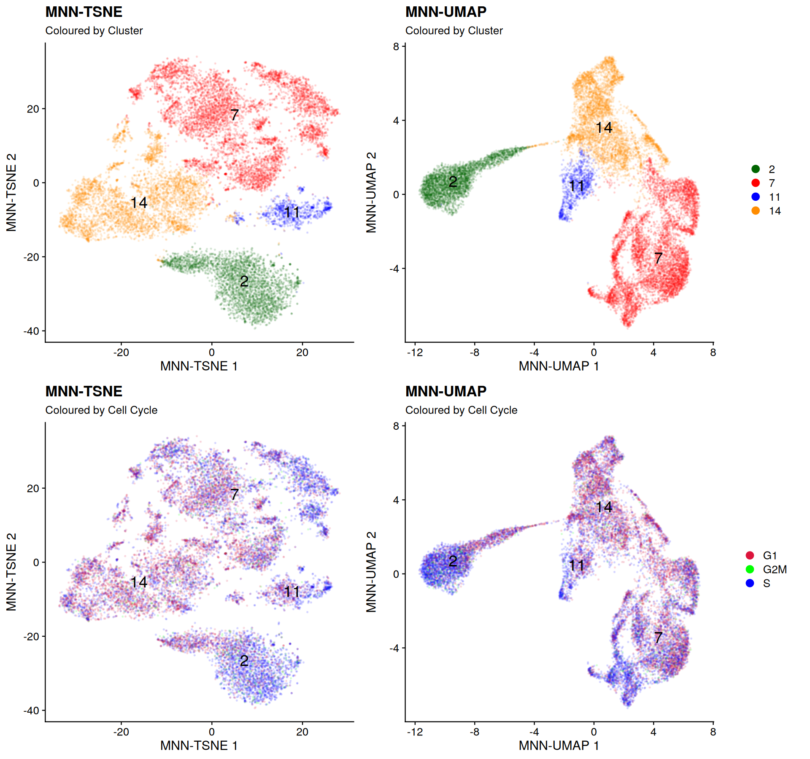
    


### Create TSNE & UMAP (Subset 2)


```R
subset2 <- combined[, combined$first.pass %in% c(3, 5, 16, 17, 18)]
colData(subset2) <- droplevels(colData(subset2))
dim(subset2)

set.seed(12345)
subset2 <- runTSNE(subset2, dimred = "MNN", name = "MNN-TSNE", n_dimred = 50, n_threads = nthreads, BPPARAM = bpp)

set.seed(12345)
subset2 <- runUMAP(subset2, dimred = "MNN", name = "MNN-UMAP", n_dimred = 50, 
                   n_neighbors = 30, spread = 1, min_dist = 0.3, n_threads = nthreads, BPPARAM = bpp)

p1 <- plotProjections(subset2, "first.pass", dimnames = c("MNN-TSNE", "MNN-UMAP"), feat_desc = "Cluster", 
                      feat_color = c30(), text_by = "first.pass", point_size = 0.1, point_alpha = 0.1, 
                      guides_size = 4, rel_widths = c(8,1))

p2 <- plotProjections(subset2, "CellCycle", dimnames = c("MNN-TSNE", "MNN-UMAP"), feat_desc = "Cell Cycle", 
                      feat_color = c_phase_col, text_by = "first.pass", point_size = 0.1, point_alpha = 0.1, 
                      guides_size = 4, rel_widths = c(8,1))

fig(width = 16, height = 15)
plot_grid(p1, p2, ncol = 1)
reset.fig()
```


<style>
.list-inline {list-style: none; margin:0; padding: 0}
.list-inline>li {display: inline-block}
.list-inline>li:not(:last-child)::after {content: "\00b7"; padding: 0 .5ex}
</style>
<ol class=list-inline><li>18129</li><li>18069</li></ol>


    
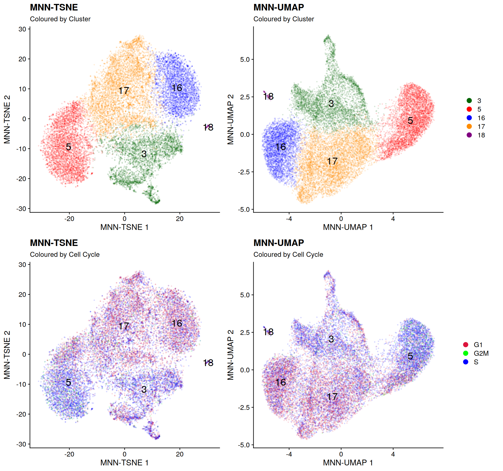
    


### Create TSNE & UMAP (Subset 3)


```R
subset3 <- combined[, combined$first.pass %in% c(1, 4, 6, 8, 9, 10, 12, 13, 15, 19, 20)]
colData(subset3) <- droplevels(colData(subset3))
dim(subset3)

set.seed(12345)
subset3 <- runTSNE(subset3, dimred = "MNN", name = "MNN-TSNE", n_dimred = 50, n_threads = nthreads, BPPARAM = bpp)

set.seed(12345)
subset3 <- runUMAP(subset3, dimred = "MNN", name = "MNN-UMAP", n_dimred = 50, 
                   n_neighbors = 30, spread = 1, min_dist = 0.3, n_threads = nthreads, BPPARAM = bpp)

p1 <- plotProjections(subset3, "first.pass", dimnames = c("MNN-TSNE", "MNN-UMAP"), feat_desc = "Cluster", 
                      feat_color = c30(), text_by = "first.pass", point_size = 0.1, point_alpha = 0.1, 
                      guides_size = 4, rel_widths = c(8,1))

p2 <- plotProjections(subset3, "CellCycle", dimnames = c("MNN-TSNE", "MNN-UMAP"), feat_desc = "Cell Cycle", 
                      feat_color = c_phase_col, text_by = "first.pass", point_size = 0.1, point_alpha = 0.1,
                      guides_size = 4, rel_widths = c(8,1))

fig(width = 16, height = 15)
plot_grid(p1, p2, ncol = 1)
reset.fig()
```


<style>
.list-inline {list-style: none; margin:0; padding: 0}
.list-inline>li {display: inline-block}
.list-inline>li:not(:last-child)::after {content: "\00b7"; padding: 0 .5ex}
</style>
<ol class=list-inline><li>18129</li><li>15262</li></ol>


    
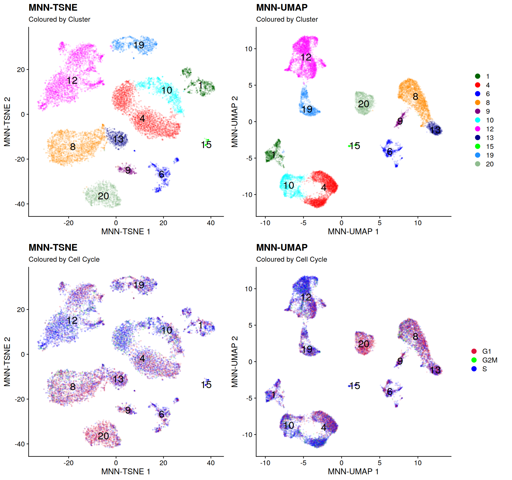
    


## Second-pass clustering

Here, we use the **Louvain** algorithm to perform clustering, but feel free to use different clustering algorithms that suit your dataset

**Subset 1**


```R
method <- "louvain"
dimname <- "MNN" # or "PCA" without batch correction
n_dimred <- 20 # number of dimensions to use; default is 50
k <- 15

mat <- reducedDim(subset1, dimname)[, seq_len(n_dimred), drop = FALSE]

set.seed(12345)
communities[[method]][[dimname]] <- clusterRows(mat, full = TRUE,
                                                NNGraphParam(cluster.fun = method, k = k, type = "jaccard", 
                                                             cluster.args = list(resolution = 2.5), 
                                                             BNPARAM = AnnoyParam(), num.threads = nthreads))
my.clusters[[method]][[dimname]] <- factor(communities[[method]][[dimname]]$clusters)
```


```R
cat(sprintf("Cluster assignments using %s from %s:\n", stringr::str_to_title(method), dimname))
table(colData(subset1)$Sample, my.clusters[[method]][[dimname]])
plotSilhouette(mat, my.clusters[[method]][[dimname]], printDiff = FALSE, plot = FALSE)

subset1$merged.louvain <- my.clusters[[method]][[dimname]]
```

    Cluster assignments using Louvain from MNN:


                  
                      1    2    3    4    5    6    7    8    9   10   11   12   13   14   15   16   17   18   19
      Control1       86 1284  802  654  101  119   10  241  324   64  120   23    4   62   31   13    3   11    3
      KidneyCancer    9   21  420   14  363    2  646   19   11  439   15  899  417   45  538   38  118  898   27
      LungCancer      0    4   19   62   86   11  422    9   15   77  448  164  327   11  363  158  155   99  726
                  
                     20   21   22   23   24   25   26   27
      Control1        8    6    1    1    0    0    0    0
      KidneyCancer  223  212   50  617   38   56    1    5
      LungCancer    364  219   34   64  523  365  142  253


    Silhouette width summary:


         Min.   1st Qu.    Median      Mean   3rd Qu.      Max. 
    -0.443226 -0.001106  0.102603  0.086208  0.184008  0.421260 


```R
p1 <- plotProjections(subset1, "merged.louvain", dimnames = c("MNN-TSNE", "MNN-UMAP"), feat_desc = "Cluster", 
                      feat_color = c30(), text_by = "merged.louvain", point_size = 0.3, point_alpha = 0.1,
                      guides_size = 4, rel_widths = c(8,1))

p2 <- plotProjections(subset1, "CellCycle", dimnames = c("MNN-TSNE", "MNN-UMAP"), feat_desc = "Cell Cycle", 
                      feat_color = c_phase_col, text_by = "merged.louvain", point_size = 0.3, point_alpha = 0.1,
                      guides_size = 4, rel_widths = c(8,1))

fig(width = 16, height = 15)
plot_grid(p1, p2, ncol = 1)
reset.fig()
```


    
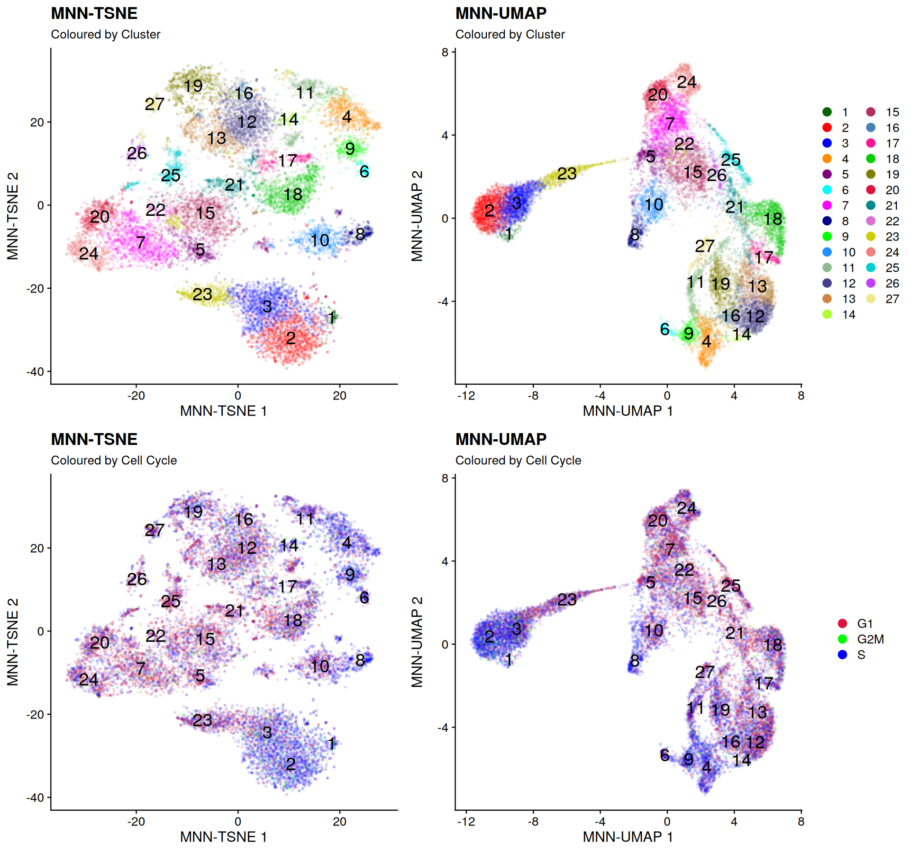
    


<div class="alert alert-warning">
  <strong>Note!</strong> After partially running the workflow, usually after preliminary manual curation of per-cluster cell types, you may want/need to come back to this stage to fine-tune the clusters.
</div>

Example of changing pre-defined clusters, we:
- merge clusters of **naive CD8 T** (1, 2, 3)


```R
levels(subset1$merged.louvain)[levels(subset1$merged.louvain) %in% c(2, 3)] <- 1

levels(subset1$merged.louvain) <- seq(1:nlevels(subset1$merged.louvain))
table(subset1$Sample, subset1$merged.louvain)
```


                  
                      1    2    3    4    5    6    7    8    9   10   11   12   13   14   15   16   17   18   19
      Control1     2172  654  101  119   10  241  324   64  120   23    4   62   31   13    3   11    3    8    6
      KidneyCancer  450   14  363    2  646   19   11  439   15  899  417   45  538   38  118  898   27  223  212
      LungCancer     23   62   86   11  422    9   15   77  448  164  327   11  363  158  155   99  726  364  219
                  
                     20   21   22   23   24   25
      Control1        1    1    0    0    0    0
      KidneyCancer   50  617   38   56    1    5
      LungCancer     34   64  523  365  142  253


```R
p1 <- plotProjections(subset1, "merged.louvain", dimnames = c("MNN-TSNE", "MNN-UMAP"), feat_desc = "Cluster", 
                      feat_color = c30(), text_by = "merged.louvain", point_size = 0.3, point_alpha = 0.1,
                      guides_size = 4, rel_widths = c(8,1))

p2 <- plotProjections(subset1, "CellCycle", dimnames = c("MNN-TSNE", "MNN-UMAP"), feat_desc = "Cell Cycle", 
                      feat_color = c_phase_col, text_by = "merged.louvain", point_size = 0.3, point_alpha = 0.1,
                      guides_size = 4, rel_widths = c(8,1))

fig(width = 16, height = 15)
plot_grid(p1, p2, ncol = 1)
reset.fig()
```


    
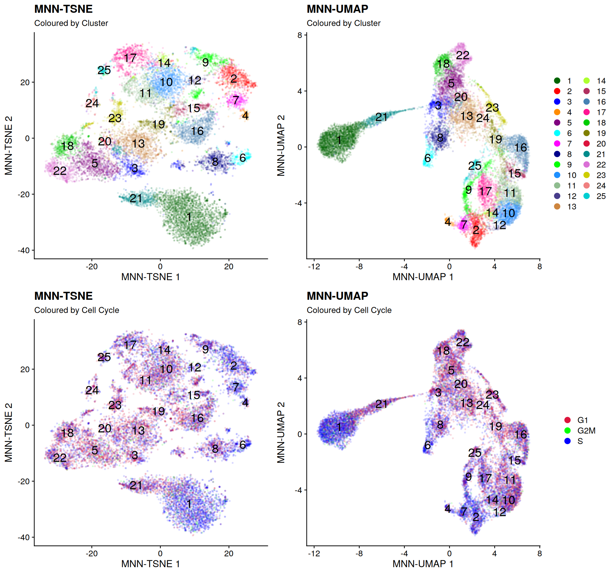
    


**Subset 2**


```R
method <- "louvain"
dimname <- "MNN" # or "PCA" without batch correction
n_dimred <- 40 # number of dimensions to use; default is 50
k <- 10

mat <- reducedDim(subset2, dimname)[, seq_len(n_dimred), drop = FALSE]

set.seed(12345)
communities[[method]][[dimname]] <- clusterRows(mat, full = TRUE,
                                                NNGraphParam(cluster.fun = method, k = k, type = "jaccard", 
                                                             cluster.args = list(resolution = 1), 
                                                             BNPARAM = AnnoyParam(), num.threads = nthreads))
my.clusters[[method]][[dimname]] <- factor(communities[[method]][[dimname]]$clusters)
```


```R
cat(sprintf("Cluster assignments using %s from %s:\n", stringr::str_to_title(method), dimname))
table(colData(subset2)$Sample, my.clusters[[method]][[dimname]])
plotSilhouette(mat, my.clusters[[method]][[dimname]], printDiff = FALSE, plot = FALSE)

subset2$merged.louvain <- my.clusters[[method]][[dimname]]
```

    Cluster assignments using Louvain from MNN:


                  
                      1    2    3    4    5    6    7    8    9
      Control1     1872 3139  675  319   34   96   36    7    1
      KidneyCancer  413  730  569   26 3066 1171   21 1336  845
      LungCancer    206  266  694   19  350  658   17  799  704


    Silhouette width summary:


        Min.  1st Qu.   Median     Mean  3rd Qu.     Max. 
    -0.33907  0.03724  0.11101  0.11040  0.19300  0.43695 


```R
p1 <- plotProjections(subset2, "merged.louvain", dimnames = c("MNN-TSNE", "MNN-UMAP"), feat_desc = "Cluster", 
                      feat_color = c30(), text_by = "merged.louvain", point_size = 0.1, point_alpha = 0.1,
                      guides_size = 4, rel_widths = c(8,1))

p2 <- plotProjections(subset2, "CellCycle", dimnames = c("MNN-TSNE", "MNN-UMAP"), feat_desc = "Cell Cycle", 
                      feat_color = c_phase_col, text_by = "merged.louvain", point_size = 0.1, point_alpha = 0.1, 
                      guides_size = 4, rel_widths = c(8,1))

fig(width = 16, height = 15)
plot_grid(p1, p2, ncol = 1)
reset.fig()
```


    
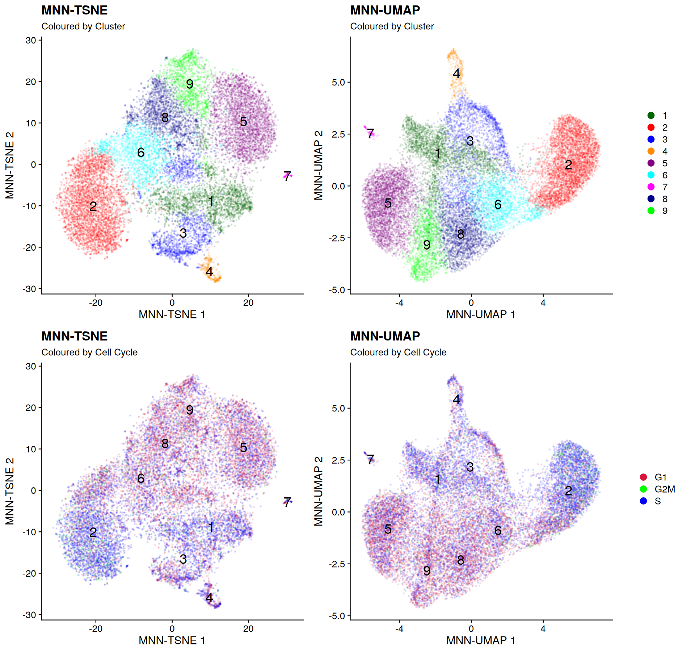
    


**Subset 3**


```R
method <- "louvain"
dimname <- "MNN" # or "PCA" without batch correction
n_dimred <- 45 # number of dimensions to use; default is 50
k <- 10

mat <- reducedDim(subset3, dimname)[, seq_len(n_dimred), drop = FALSE]

set.seed(12345)
communities[[method]][[dimname]] <- clusterRows(mat, full = TRUE,
                                                NNGraphParam(cluster.fun = method, k = k, type = "jaccard", 
                                                             cluster.args = list(resolution = 2), 
                                                             BNPARAM = AnnoyParam(), num.threads = nthreads))
my.clusters[[method]][[dimname]] <- factor(communities[[method]][[dimname]]$clusters)
```


```R
cat(sprintf("Cluster assignments using %s from %s:\n", stringr::str_to_title(method), dimname))
table(colData(subset3)$Sample, my.clusters[[method]][[dimname]])
plotSilhouette(mat, my.clusters[[method]][[dimname]], printDiff = FALSE, plot = FALSE)

subset3$merged.louvain <- my.clusters[[method]][[dimname]]
```

    Cluster assignments using Louvain from MNN:


                  
                      1    2    3    4    5    6    7    8    9   10   11   12   13   14   15   16   17   18   19
      Control1      234  996  408  899  291 1047 1499  633  146  267   79  196  298  482   81   93   27  145   35
      KidneyCancer  187    2  144    4  336   47   12   29   63    9   22   74   24    0   11   20  142    5    3
      LungCancer    178   72   55   20  186   24   83   22   34   35    7  210    7    2   14   93  160   15    0
                  
                     20   21   22   23   24   25   26
      Control1       71    3    5    1    4    1    0
      KidneyCancer  408  526  121  109   84   86    0
      LungCancer    294  735  745   41 1034  626  161


    Silhouette width summary:


       Min. 1st Qu.  Median    Mean 3rd Qu.    Max. 
    -0.4240  0.1057  0.1996  0.1845  0.2695  0.5483 


```R
p1 <- plotProjections(subset3, "merged.louvain", dimnames = c("MNN-TSNE", "MNN-UMAP"), feat_desc = "Cluster", 
                      feat_color = c30(), text_by = "merged.louvain", point_size = 0.1, point_alpha = 0.1,
                      guides_size = 4, rel_widths = c(8,1))

p2 <- plotProjections(subset3, "CellCycle", dimnames = c("MNN-TSNE", "MNN-UMAP"), feat_desc = "Cell Cycle", 
                      feat_color = c_phase_col, text_by = "merged.louvain", point_size = 0.1, point_alpha = 0.1, 
                      guides_size = 4, rel_widths = c(8,1))

fig(width = 16, height = 15)
plot_grid(p1, p2, ncol = 1)
reset.fig()
```


    
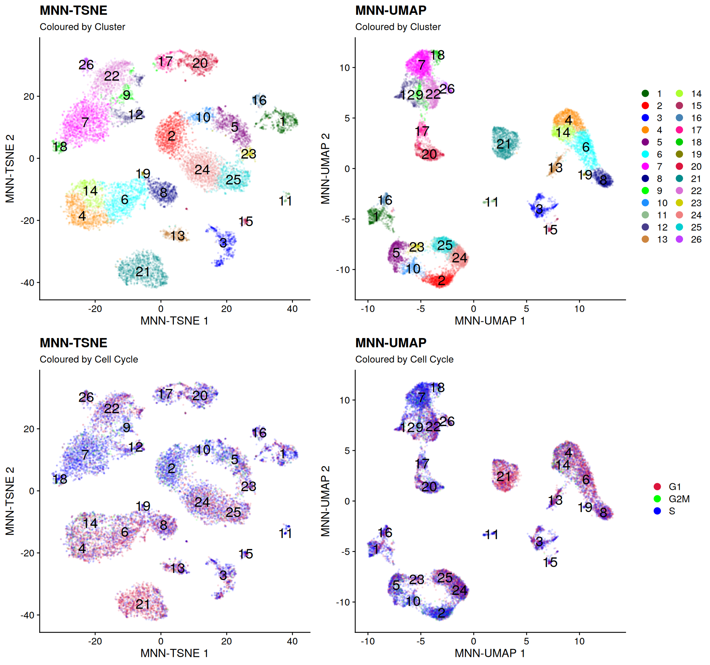
    


<div class="alert alert-warning">
  <strong>Note!</strong> After partially running the workflow, usually after preliminary manual curation of per-cluster cell types, you may want/need to come back to this stage to fine-tune the clusters.
</div>

Example of changing pre-defined clusters, we: 
- merge clusters of **NK cells** (7, 9, 12, 18)
- merge clusters of **Monocytes** (4, 14)
- merge clusters of **B cells** (24, 25)


```R
levels(subset3$merged.louvain)[levels(subset3$merged.louvain) == 12] <- 9
levels(subset3$merged.louvain)[levels(subset3$merged.louvain) == 18] <- 7
levels(subset3$merged.louvain)[levels(subset3$merged.louvain) == 14] <- 4
levels(subset3$merged.louvain)[levels(subset3$merged.louvain) == 24] <- 25

levels(subset3$merged.louvain) <- seq(1:nlevels(subset3$merged.louvain))
table(subset3$Sample, subset3$merged.louvain)
```


                  
                      1    2    3    4    5    6    7    8    9   10   11   12   13   14   15   16   17   18   19
      Control1      234  996  408 1381  291 1047 1644  633  342  267   79  298   81   93   27   35   71    3    5
      KidneyCancer  187    2  144    4  336   47   17   29  137    9   22   24   11   20  142    3  408  526  121
      LungCancer    178   72   55   22  186   24   98   22  244   35    7    7   14   93  160    0  294  735  745
                  
                     20   21   22
      Control1        1    5    0
      KidneyCancer  109  170    0
      LungCancer     41 1660  161


```R
p1 <- plotProjections(subset3, "merged.louvain", dimnames = c("MNN-TSNE", "MNN-UMAP"), feat_desc = "Cluster", 
                      feat_color = c30(), text_by = "merged.louvain", point_size = 0.1, point_alpha = 0.1,
                      guides_size = 4, rel_widths = c(8,1))

p2 <- plotProjections(subset3, "CellCycle", dimnames = c("MNN-TSNE", "MNN-UMAP"), feat_desc = "Cell Cycle", 
                      feat_color = c_phase_col, text_by = "merged.louvain", point_size = 0.1, point_alpha = 0.1, 
                      guides_size = 4, rel_widths = c(8,1))

fig(width = 16, height = 15)
plot_grid(p1, p2, ncol = 1)
reset.fig()
```


    
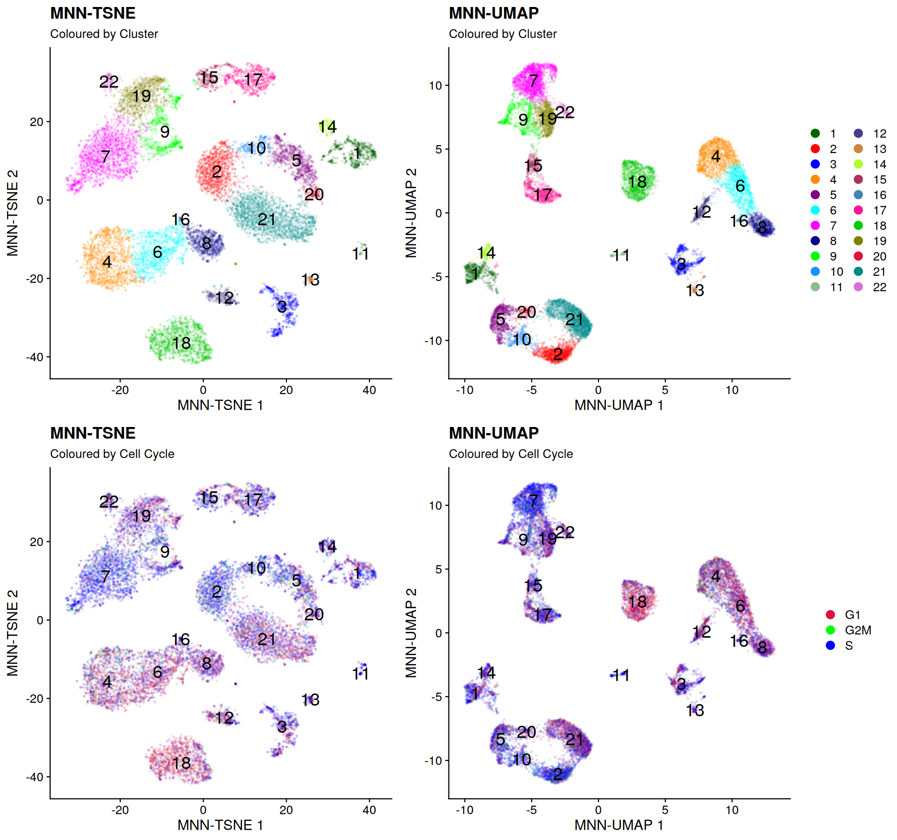
    


## Add assigned clusters to `sce` objects

Choose the desired clustering result and assign to the default "label" column using the `colLabels` function.


```R
# Combine cluster labels from all subsets
# Assign temporary IDs for now
combined$merged.louvain <- rbind(colData(subset1)[, c("Barcode","merged.louvain")] %>% as.data.frame %>% 
                                 mutate(merged.louvain = paste0("a", merged.louvain)), 
                                 colData(subset2)[, c("Barcode","merged.louvain")] %>% as.data.frame %>% 
                                 mutate(merged.louvain = paste0("b", merged.louvain)), 
                                 colData(subset3)[, c("Barcode","merged.louvain")] %>% as.data.frame %>% 
                                 mutate(merged.louvain = paste0("c", merged.louvain)))[colnames(combined),"merged.louvain"]
combined$merged.louvain <- factor(combined$merged.louvain, 
                                  levels = gtools::mixedsort(unique(combined$merged.louvain)))
colLabels(combined) <- combined$merged.louvain
```

### Rename and reorder clusters

<div class="alert alert-warning">
    <strong>Skip this step in the initial run!</strong>
    <br />Come back and run this step after cell clusters of the same "coarse cell type" and/or lineage are identified preliminarily. We do this so that the clusters of the same "<i>type</i>" are in sequential order by their cluster number.    
</div>


```R
levels(colLabels(combined)) <- c(15, 23, 17, 24, 6, 52, 22, 51, 20, 14, 13, 25, 19, 12, 26, 27, 11, 7, 28, 
                                 18, 16, 8, 29, 30, 21, 9, 1, 10, 31, 5, 2, 36, 3, 4, 53, 37, 55, 42, 40, 
                                 43, 34, 44, 32, 39, 48, 47, 56, 54, 50, 45, 49, 46, 33, 41, 38, 35)
colLabels(combined) <- factor(colLabels(combined), levels = gtools::mixedsort(levels(colLabels(combined))))
```

### Set colours for cell clusters


```R
c_clust_col <- choosePalette(colLabels(combined), 
                             # more than 40 clusters
                             pals::kovesi.rainbow_bgyrm_35_85_c69(nlevels(colLabels(combined))))
```

### Print number and percentage of cells


```R
table_samples_by_clusters <- table(Sample = combined$Sample, Cluster = combined$label)
table_samples_by_clusters
```


                  Cluster
    Sample            1    2    3    4    5    6    7    8    9   10   11   12   13   14   15   16   17   18   19
      Control1     3139   96    7    1   34   10    8    0 1872  675    3   13    4   23 2172    1  101    1   31
      KidneyCancer  730 1171 1336  845 3066  646  223   38  413  569   27   38  417  899  450  617  363   50  538
      LungCancer    266  658  799  704  350  422  364  523  206  694  726  158  327  164   23   64   86   34  363
                  Cluster
    Sample           20   21   22   23   24   25   26   27   28   29   30   31   32   33   34   35   36   37   38
      Control1      120    0  324  654  119   62    3   11    6    0    0  319  342    5 1644    0   36  996    5
      KidneyCancer   15    5   11   14    2   45  118  898  212   56    1   26  137  121   17    0   21    2  170
      LungCancer    448  253   15   62   11   11  155   99  219  365  142   19  244  745   98  161   17   72 1660
                  Cluster
    Sample           39   40   41   42   43   44   45   46   47   48   49   50   51   52   53   54   55   56
      Control1      267  291    1 1381 1047  633   35    3  298   79   71   27   64  241  234   93  408   81
      KidneyCancer    9  336  109    4   47   29    3  526   24   22  408  142  439   19  187   20  144   11
      LungCancer     35  186   41   22   24   22    0  735    7    7  294  160   77    9  178   93   55   14


```R
# No. of cells 
fig(width = 16, height = 5)
ggplot(data.frame(table_samples_by_clusters), aes(Sample, Freq, fill = Cluster)) + 
    geom_bar(position = "stack", stat = "identity", linewidth = 0.2, color = "black") + coord_flip() +
    scale_y_continuous("Number of cells", labels = comma) + guides(fill = guide_legend(ncol = 5)) +
    scale_fill_manual(values = c_clust_col) + theme_cowplot(20) + theme(axis.title.y = element_blank())
reset.fig()
```


    
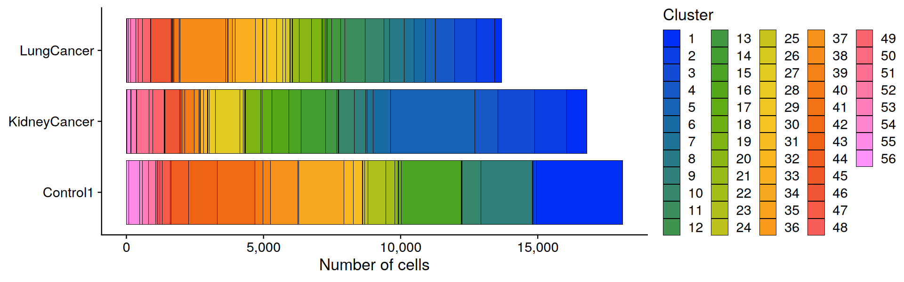
    


```R
# Percenatge cells
fig(width = 16, height = 5)
ggplot(data.frame(table_samples_by_clusters), aes(Sample, Freq, fill = Cluster)) +
    geom_bar(position = "fill", stat = "identity", linewidth = 0.2, color = "black") + coord_flip() +
    scale_y_continuous("Percentage", labels = percent_format()) + guides(fill = guide_legend(ncol = 5)) +
    scale_fill_manual(values = c_clust_col) + theme_cowplot(20) + theme(axis.title.y = element_blank())
reset.fig()
```


    
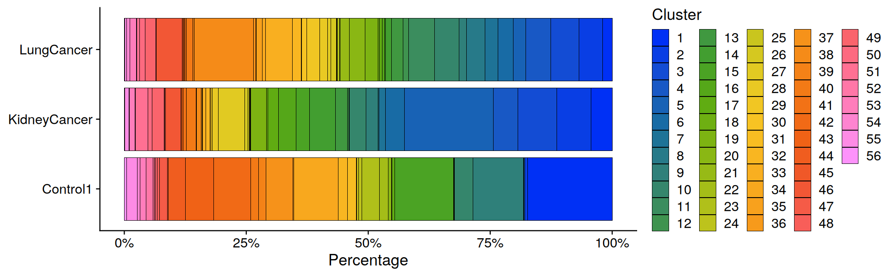
    


## t-SNE and UMAP plots

<div class="alert alert-warning">
    <strong>Warning!</strong> change the <code>dimnames</code> names to view plot in the corresponding reduced dimension results.
</div>


```R
# Coloured by clusters
fig(width = 16, height = 9)
plotProjections(combined, "label", dimnames = c("MNN-TSNE", "MNN-UMAP"), feat_desc = "Cluster", 
                feat_color = c_clust_col, text_by = "label", point_size = 0.1, point_alpha = 0.05,
                text_size = 5, guides_nrow = 3, guides_size = 4, legend_pos = "bottom", rel_heights = c(8,1))
reset.fig()
```


    
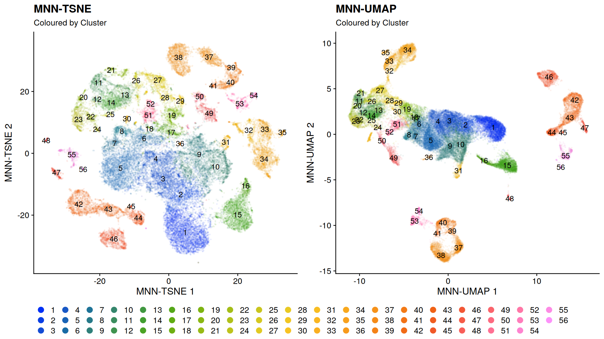
    


```R
bk <- seq(min(combined$log10Sum), max(combined$log10Sum), max(combined$log10Sum)/20)
bk <- round(bk, 2)

# Coloured by log10Sum
fig(width = 16, height = 8)
plotProjections(combined, "log10Sum", dimnames = c("MNN-TSNE", "MNN-UMAP"), feat_desc = "log10(Sum)", 
                feat_color = rev(rainbow(5)), color_breaks = bk, point_size = 0.1, point_alpha = 0.05,
                text_by = "label", text_size = 5, guides_barheight = 15)
reset.fig()
```


    
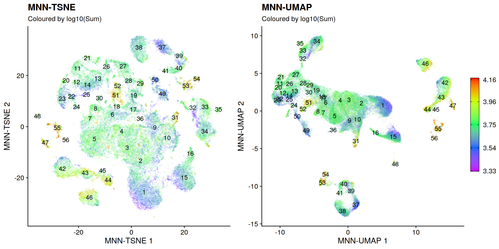
    


```R
# Coloured by cell cycle phases
fig(width = 16, height = 9)
plotProjections(combined, "CellCycle", dimnames = c("MNN-TSNE", "MNN-UMAP"), feat_desc = "Cell Cycle Phases", 
                feat_color = c_phase_col, text_by = "label", point_size = 0.1, point_alpha = 0.05,
                text_size = 5, guides_nrow = 1, guides_size = 4, legend_pos = "bottom")
reset.fig()
```


    
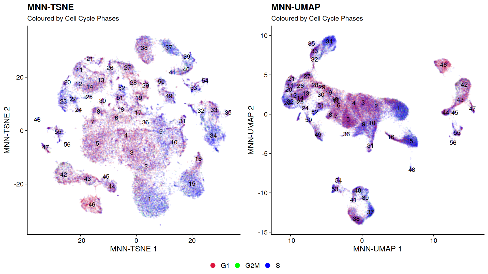
    


```R
fig(width = 16, height = 5)
colData(combined) %>% as.data.frame %>% summarise(counts = n(), .by = c(label, CellCycle)) %>%
    ggplot(aes(label, counts, fill = CellCycle)) + geom_col(position = "fill") + 
    scale_fill_manual(values = c_phase_col) + theme_cowplot(16) +
    theme(axis.text.x = element_text(angle = 90, hjust = 1, vjust = 0.5))
reset.fig()
```


    
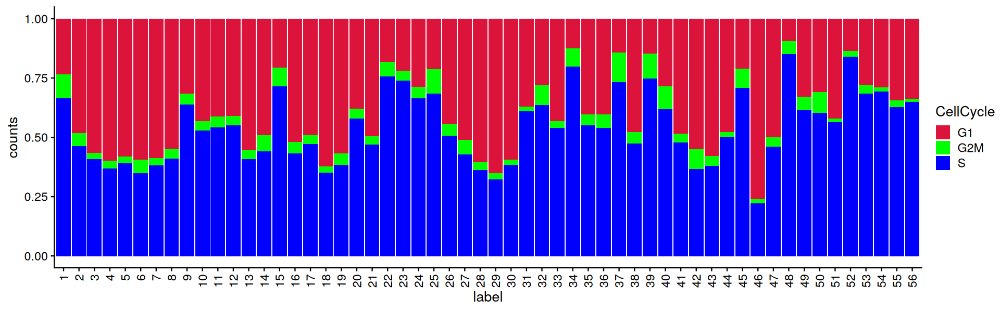
    


```R
# Coloured by samples
fig(width = 16, height = 9)
plotProjections(combined, "Sample", dimnames = c("MNN-TSNE", "MNN-UMAP"), feat_desc = "Sample", 
                feat_color = c_sample_col, text_by = "label", point_size = 0.1, point_alpha = 0.05,
                text_size = 5, guides_nrow = 1, guides_size = 4, legend_pos = "bottom")
reset.fig()
```


    
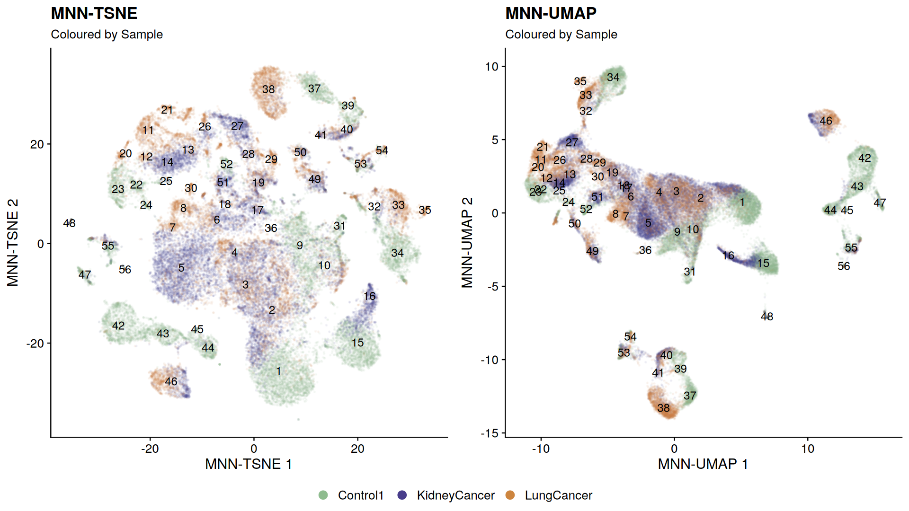
    


```R
fig(width = 16, height = 5)
colData(combined) %>% as.data.frame %>% summarise(counts = n(), .by = c(label, Sample)) %>%
    ggplot(aes(label, counts, fill = Sample)) + geom_col(position = "fill") + 
    scale_fill_manual(values = c_sample_col) + theme_cowplot(16) +
    theme(axis.text.x = element_text(angle = 90, hjust = 1, vjust = 0.5))
reset.fig()
```


    
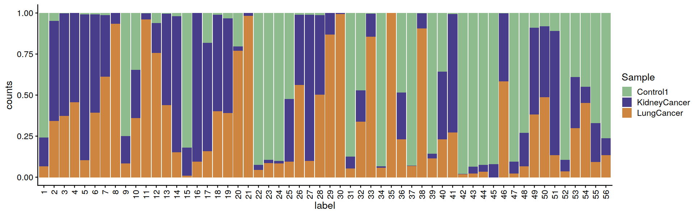
    


```R
# Coloured by condition
fig(width = 16, height = 9)
plotProjections(combined, "condition", dimnames = c("MNN-TSNE", "MNN-UMAP"), feat_desc = "Condition", 
                feat_color = c_cond_col, text_by = "label", point_size = 0.1, point_alpha = 0.05,
                text_size = 5, guides_nrow = 1, guides_size = 4, legend_pos = "bottom")
reset.fig()
```


    
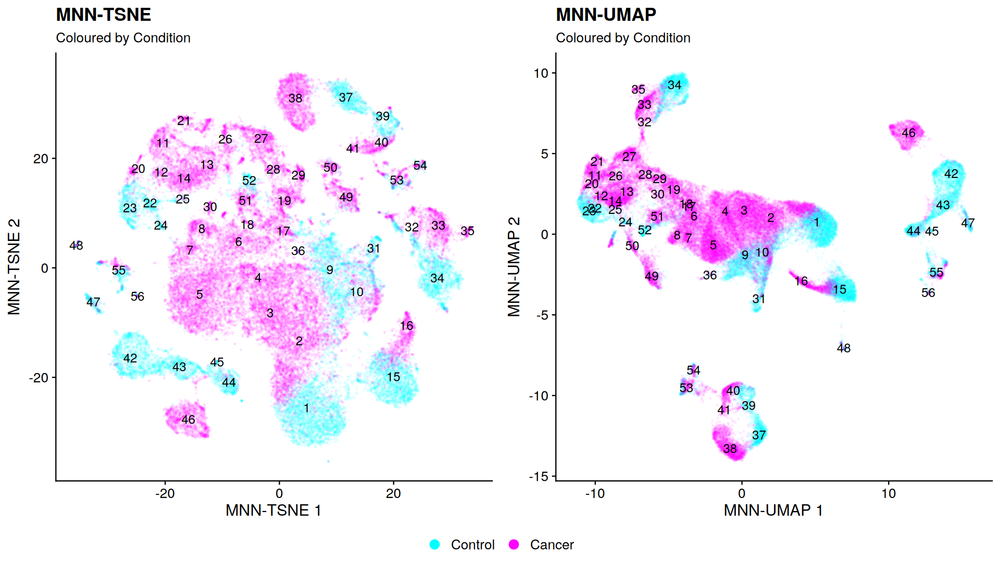
    


```R
fig(width = 16, height = 5)
colData(combined) %>% as.data.frame %>% summarise(counts = n(), .by = c(label, condition)) %>%
    ggplot(aes(label, counts, fill = condition)) + geom_col(position = "fill") + 
    scale_fill_manual(values = c_cond_col) + theme_cowplot(16) +
    theme(axis.text.x = element_text(angle = 90, hjust = 1, vjust = 0.5))
reset.fig()
```


    
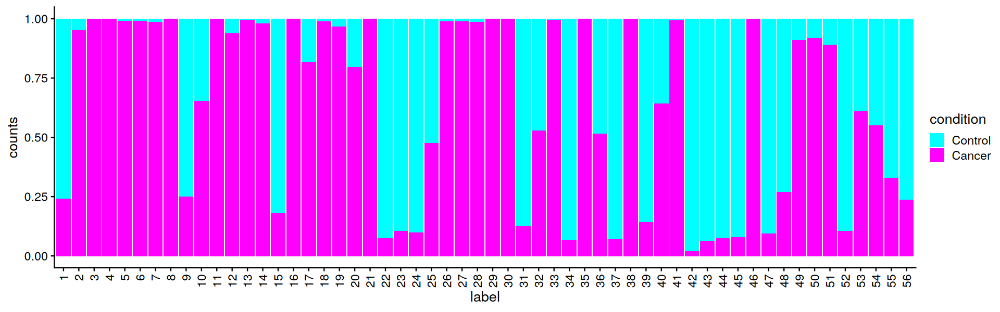
    


```R
# Coloured by cell types
fig(width = 16, height = 9)
plotProjections(combined, "CellType", dimnames = c("MNN-TSNE", "MNN-UMAP"), feat_desc = "Cell Type", 
                feat_color = c_celltype_col, text_by = "label", point_size = 0.1, point_alpha = 0.05,
                text_size = 5, guides_nrow = 1, guides_size = 4, legend_pos = "bottom")
reset.fig()
```


    
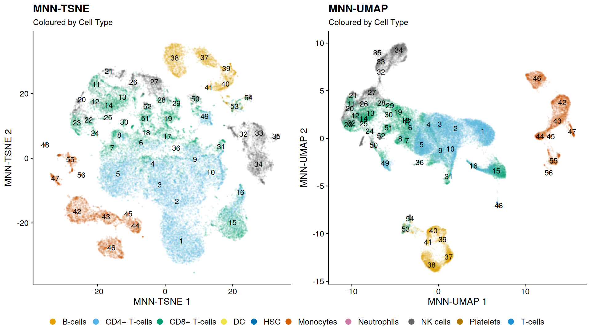
    


```R
table(Cluster = combined$label, CellType = combined$CellType)
```


           CellType
    Cluster B-cells CD4+ T-cells CD8+ T-cells   DC  HSC Monocytes Neutrophils NK cells Platelets T-cells
         1        0         4098           37    0    0         0           0        0         0       0
         2        0         1914           11    0    0         0           0        0         0       0
         3        0         2032          110    0    0         0           0        0         0       0
         4        0         1056          490    0    0         0           0        0         0       4
         5        0         3098          352    0    0         0           0        0         0       0
         6        0          451          627    0    0         0           0        0         0       0
         7        0           89          505    0    0         0           0        0         0       1
         8        0          176          385    0    0         0           0        0         0       0
         9        0         1905          584    0    0         0           0        0         1       1
         10       0         1721          215    0    0         0           0        0         0       2
         11       0            0          589    0    0         0           0      167         0       0
         12       0            0          136    0    0         0           0       73         0       0
         13       0            0          661    0    0         0           0       87         0       0
         14       0            0          953    0    0         0           0      133         0       0
         15       0          970         1675    0    0         0           0        0         0       0
         16       0          438          244    0    0         0           0        0         0       0
         17       0           66          484    0    0         0           0        0         0       0
         18       0            1           84    0    0         0           0        0         0       0
         19       0           10          921    0    0         0           0        0         0       1
         20       0            0            9    0    0         0           0      574         0       0
         21       0            0           13    0    0         0           0      245         0       0
         22       0            0          185    0    0         0           0      165         0       0
         23       0            0          618    0    0         0           0      112         0       0
         24       0            0          132    0    0         0           0        0         0       0
         25       0            0           68    0    0         0           0       50         0       0
         26       0            0           82    0    0         0           0      194         0       0
         27       0            0           25    0    0         0           0      983         0       0
         28       0            0          313    0    0         0           0      124         0       0
         29       0            0          364    0    0         0           0       57         0       0
         30       0            0          123    0    0         0           0       20         0       0
         31       0           61          301    0    0         0           0        2         0       0
         32       0            0            0    0    0         0           0      723         0       0
         33       0            0            0    0    0         0           0      871         0       0
         34       0            0            0    0    0         0           0     1759         0       0
         35       0            0            0    0    0         0           0      161         0       0
         36       0           11           52    0    0         0           0       11         0       0
         37    1070            0            0    0    0         0           0        0         0       0
         38    1835            0            0    0    0         0           0        0         0       0
         39     310            0            0    0    0         1           0        0         0       0
         40     813            0            0    0    0         0           0        0         0       0
         41     151            0            0    0    0         0           0        0         0       0
         42       0            0            0    0    0      1407           0        0         0       0
         43       0            0            0    0    0      1118           0        0         0       0
         44       0            0            0    0    0       684           0        0         0       0
         45       0            0            0    0    0        38           0        0         0       0
         46       0            0            0    0    0      1264           0        0         0       0
         47       0            0            0    1    0       328           0        0         0       0
         48      22            5            6    0   33        41           0        1         0       0
         49       0          516          253    0    0         0           1        3         0       0
         50       0            4          153    0    0         0           0      172         0       0
         51       0           30          536    0    0         0           0       14         0       0
         52       0            1          142    0    0         0           0      126         0       0
         53     266          196          133    0    0         0           0        4         0       0
         54      32            0           43    0    0         0           0      131         0       0
         55       1            2            9    0    0       574           1       20         0       0
         56       1            0            0    0    0       105           0        0         0       0


```R
# Coloured by DoubletDensity scores
fig(width = 16, height = 8)
plotProjections(combined, I(log1p(combined$DoubletDensity)), c("MNN-TSNE","MNN-UMAP"), 
                feat_desc = "Doublet Score (log1p)", feat_color = c_heatmap_col1, text_by = "label", 
                text_size = 5, point_size = 0.1, point_alpha = 0.05, guides_barheight = 15)
reset.fig()
```


    
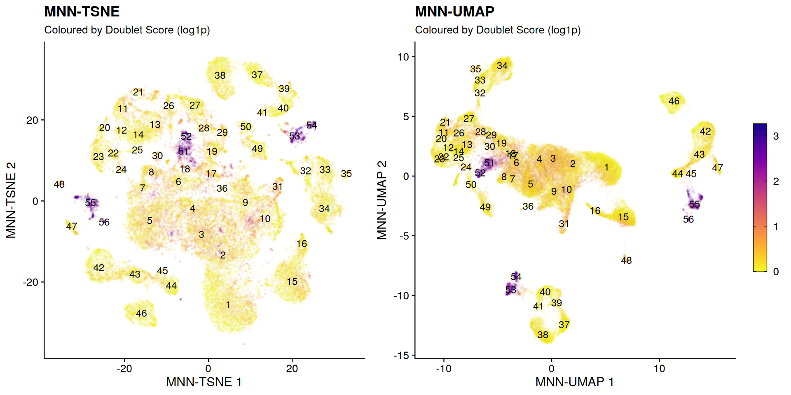
    


```R
# Plot DoubletDensity scores
fig(width = 16, height = 7)
as.data.frame(colData(combined)[,c("Sample","label","DoubletDensity")]) %>% 
ggplot(aes(label, log1p(DoubletDensity), color = Sample)) + 
    geom_boxplot(position = position_dodge(width = 0.5), width = 0.3, outlier.size = 0.5) + 
    scale_color_manual(values = c_sample_col) + theme_cowplot(16) + 
    theme(legend.position = "top", axis.text.x = element_text(angle = 90, hjust = 1, vjust = 0.5)) + 
    ylab("log Score")
reset.fig()
```


    
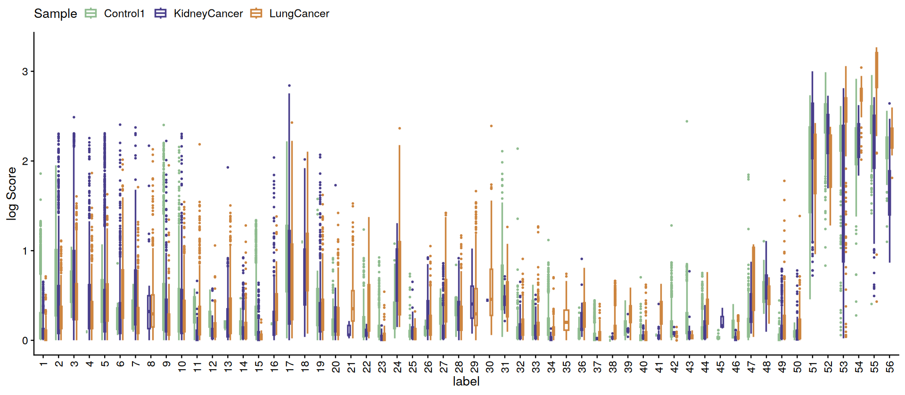
    


## Visualising gene expressions in cells

### Single gene expression

In the following plots we visualise the expression of `XIST` (expressed in female) and `DDX3Y` (expressed in male) in individual cells in human samples. The genes in mouse are `Xist` and `Ddx3y` respectively.

<div class="alert alert-warning">
    For <strong>Flex Gene Expression</strong> dataset, <code>XIST</code>/<code>Xist</code> is not available in the feature list, use other X-linked genes instead, such as <code>RLIM</code>/<code>Rlim</code>, <code>LAMP2</code>/<code>Lamp2</code>, and <code>ATRX</code>/<code>Atrx</code>.
</div>


```R
p1 <- plotProjection(combined, "RLIM", "MNN-TSNE", feat_color = c_heatmap_col1, other_fields = "Sample", 
                     point_size = 0.1, theme_size = 16) + facet_wrap(~ Sample, nrow = 1)
p2 <- plotProjection(combined, "DDX3Y", "MNN-TSNE", feat_color = c_heatmap_col1, other_fields = "Sample", 
                     point_size = 0.1, theme_size = 16) + facet_wrap(~ Sample, nrow = 1)

fig(width = 16, height = 12)
plot_grid(p1, p2, align = "vh", nrow = 2)
reset.fig()
```


    
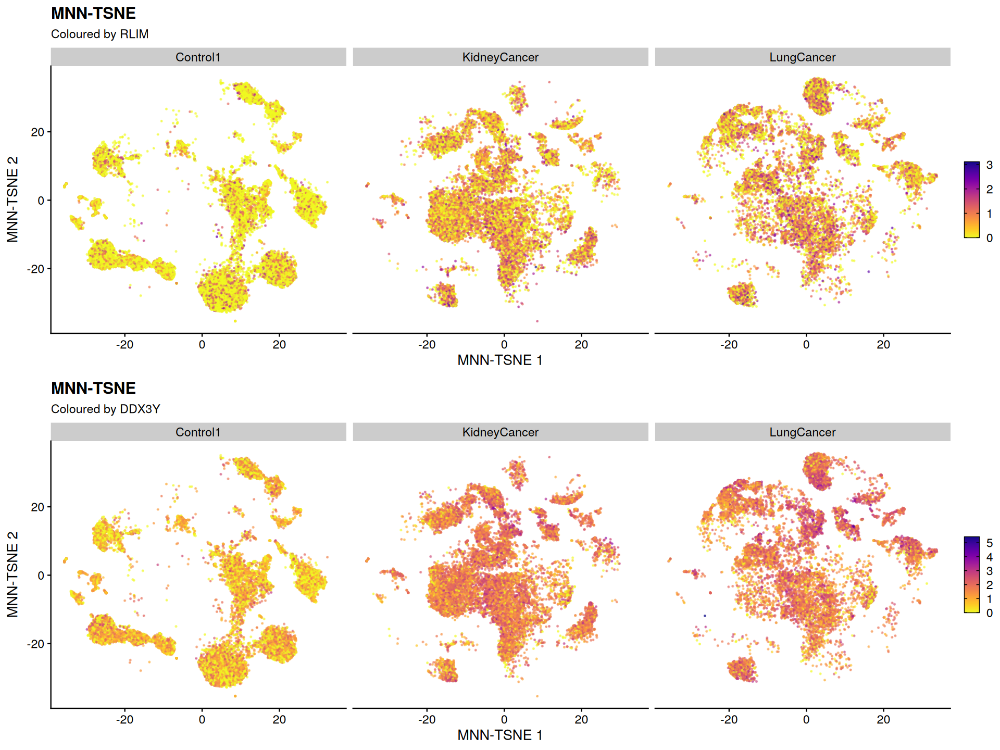
    


## Output average expression (logcounts) 

Set outfile prefix


```R
# Set outfile ID
file_id <- "160k_All"
file_id
```


'160k_All'


Create a `dgCMatrix` logcounts matrix for faster computation in some steps.


```R
sce_l <- as(logcounts(combined, withDimnames = TRUE), "dgCMatrix") # update object with new cell counts
```

### Average `logcounts` expression across samples


```R
# Use logcounts from combined
ave.expr <- sumCountsAcrossCells(sce_l, average = TRUE, BPPARAM = bpp, 
                                 ids = DataFrame(Sample = combined$Sample)) %>% 
    `colnames<-`(.$Sample) %>% assay %>% as.data.frame %>% rownames_to_column("Symbol")
head(ave.expr)

outfile <- paste0(file_id, "_average_logcounts_in_samples.tsv")
cat(sprintf("Write to file: %s\n", outfile))
write.table(ave.expr, file = outfile, sep = "\t", quote = F, row.names = F, col.names = T)
```


<table class="dataframe">
<caption>A data.frame: 6 × 4</caption>
<thead>
	<tr><th></th><th scope=col>Symbol</th><th scope=col>Control1</th><th scope=col>KidneyCancer</th><th scope=col>LungCancer</th></tr>
	<tr><th></th><th scope=col>&lt;chr&gt;</th><th scope=col>&lt;dbl&gt;</th><th scope=col>&lt;dbl&gt;</th><th scope=col>&lt;dbl&gt;</th></tr>
</thead>
<tbody>
	<tr><th scope=row>1</th><td>SAMD11 </td><td>0.0000000000</td><td>0.0002539472</td><td>0.0003469378</td></tr>
	<tr><th scope=row>2</th><td>NOC2L  </td><td>0.3082943312</td><td>0.1780666990</td><td>0.2391362040</td></tr>
	<tr><th scope=row>3</th><td>KLHL17 </td><td>0.0765075082</td><td>0.0262635925</td><td>0.0546494714</td></tr>
	<tr><th scope=row>4</th><td>PLEKHN1</td><td>0.0161339360</td><td>0.0118490041</td><td>0.0096570672</td></tr>
	<tr><th scope=row>5</th><td>PERM1  </td><td>0.0001740907</td><td>0.0002443657</td><td>0.0026151519</td></tr>
	<tr><th scope=row>6</th><td>HES4   </td><td>0.1119836395</td><td>0.0252823060</td><td>0.0272365574</td></tr>
</tbody>
</table>


    Write to file: 160k_All_average_logcounts_in_samples.tsv


### Average `logcounts` expression across clusters


```R
# Use logcounts from combined
ave.expr <- sumCountsAcrossCells(sce_l, average = TRUE, BPPARAM = bpp, 
                                 ids = DataFrame(cluster = combined$label)) %>% 
    `colnames<-`(paste0("Cluster", .$cluster)) %>% assay %>% as.data.frame %>% rownames_to_column("Symbol")
head(ave.expr)

outfile <- paste0(file_id, "_average_logcounts_in_clusters.tsv")
cat(sprintf("Write to file: %s\n", outfile))
write.table(ave.expr, file = outfile, sep = "\t", quote = F, row.names = F, col.names = T)
```


<table class="dataframe">
<caption>A data.frame: 6 × 57</caption>
<thead>
	<tr><th></th><th scope=col>Symbol</th><th scope=col>Cluster1</th><th scope=col>Cluster2</th><th scope=col>Cluster3</th><th scope=col>Cluster4</th><th scope=col>Cluster5</th><th scope=col>Cluster6</th><th scope=col>Cluster7</th><th scope=col>Cluster8</th><th scope=col>Cluster9</th><th scope=col>⋯</th><th scope=col>Cluster47</th><th scope=col>Cluster48</th><th scope=col>Cluster49</th><th scope=col>Cluster50</th><th scope=col>Cluster51</th><th scope=col>Cluster52</th><th scope=col>Cluster53</th><th scope=col>Cluster54</th><th scope=col>Cluster55</th><th scope=col>Cluster56</th></tr>
	<tr><th></th><th scope=col>&lt;chr&gt;</th><th scope=col>&lt;dbl&gt;</th><th scope=col>&lt;dbl&gt;</th><th scope=col>&lt;dbl&gt;</th><th scope=col>&lt;dbl&gt;</th><th scope=col>&lt;dbl&gt;</th><th scope=col>&lt;dbl&gt;</th><th scope=col>&lt;dbl&gt;</th><th scope=col>&lt;dbl&gt;</th><th scope=col>&lt;dbl&gt;</th><th scope=col>⋯</th><th scope=col>&lt;dbl&gt;</th><th scope=col>&lt;dbl&gt;</th><th scope=col>&lt;dbl&gt;</th><th scope=col>&lt;dbl&gt;</th><th scope=col>&lt;dbl&gt;</th><th scope=col>&lt;dbl&gt;</th><th scope=col>&lt;dbl&gt;</th><th scope=col>&lt;dbl&gt;</th><th scope=col>&lt;dbl&gt;</th><th scope=col>&lt;dbl&gt;</th></tr>
</thead>
<tbody>
	<tr><th scope=row>1</th><td>SAMD11 </td><td>0.0000000000</td><td>0.0000000000</td><td>0.000373612</td><td>0.0003563232</td><td>0.0000000000</td><td>0.00000000</td><td>0.001490649</td><td>0.000000000</td><td>0.00000000</td><td>⋯</td><td>0.000000000</td><td>0.000000000</td><td>0.00000000</td><td>0.00000000</td><td>0.000000000</td><td>0.00000000</td><td>0.000000000</td><td>0.000000000</td><td>0.00000000</td><td>0.000000000</td></tr>
	<tr><th scope=row>2</th><td>NOC2L  </td><td>0.2605890268</td><td>0.1852566795</td><td>0.196073140</td><td>0.1846652775</td><td>0.1464919419</td><td>0.16609156</td><td>0.199883358</td><td>0.216833461</td><td>0.24506705</td><td>⋯</td><td>0.319834331</td><td>0.363883841</td><td>0.22760461</td><td>0.24552440</td><td>0.217574777</td><td>0.35684074</td><td>0.295879125</td><td>0.278080531</td><td>0.32259395</td><td>0.361297525</td></tr>
	<tr><th scope=row>3</th><td>KLHL17 </td><td>0.0577558319</td><td>0.0293842490</td><td>0.025545531</td><td>0.0267846258</td><td>0.0208068218</td><td>0.03418026</td><td>0.040629006</td><td>0.055615594</td><td>0.06447513</td><td>⋯</td><td>0.073848538</td><td>0.044232534</td><td>0.07190679</td><td>0.08317128</td><td>0.050897397</td><td>0.09500810</td><td>0.056340074</td><td>0.082029123</td><td>0.07143576</td><td>0.066152143</td></tr>
	<tr><th scope=row>4</th><td>PLEKHN1</td><td>0.0032902369</td><td>0.0075547479</td><td>0.005474820</td><td>0.0155559992</td><td>0.0162772806</td><td>0.01089602</td><td>0.016200859</td><td>0.022248110</td><td>0.02928544</td><td>⋯</td><td>0.012227332</td><td>0.005188603</td><td>0.02008051</td><td>0.01660345</td><td>0.016118172</td><td>0.02308325</td><td>0.008977935</td><td>0.007389602</td><td>0.04540047</td><td>0.022012800</td></tr>
	<tr><th scope=row>5</th><td>PERM1  </td><td>0.0008675488</td><td>0.0008954645</td><td>0.001241685</td><td>0.0021818802</td><td>0.0006565961</td><td>0.00000000</td><td>0.000000000</td><td>0.003934076</td><td>0.00000000</td><td>⋯</td><td>0.001774747</td><td>0.000000000</td><td>0.00000000</td><td>0.00000000</td><td>0.001584213</td><td>0.00000000</td><td>0.000000000</td><td>0.000000000</td><td>0.00000000</td><td>0.005395099</td></tr>
	<tr><th scope=row>6</th><td>HES4   </td><td>0.0151439212</td><td>0.0147477653</td><td>0.018664950</td><td>0.0265518950</td><td>0.0140875722</td><td>0.01499869</td><td>0.006115306</td><td>0.011409147</td><td>0.00838254</td><td>⋯</td><td>0.062357562</td><td>0.000000000</td><td>0.02861643</td><td>0.03912120</td><td>0.023149367</td><td>0.03554200</td><td>0.022847929</td><td>0.037344146</td><td>0.21139159</td><td>0.314413700</td></tr>
</tbody>
</table>


    Write to file: 160k_All_average_logcounts_in_clusters.tsv


### Average `logcounts` expression across conditions


```R
ave.expr <- sumCountsAcrossCells(sce_l, average = TRUE, BPPARAM = bpp, 
                                 ids = DataFrame(condition = combined$condition)) %>% 
    `colnames<-`(.$condition) %>% assay %>% as.data.frame %>% rownames_to_column("Symbol")
head(ave.expr)

outfile <- paste0(file_id, "_average_logcounts_in_conditions.tsv")
cat(sprintf("Write to file: %s\n", outfile))
write.table(ave.expr, file = outfile, sep = "\t", quote = F, row.names = F, col.names = T)
```


<table class="dataframe">
<caption>A data.frame: 6 × 3</caption>
<thead>
	<tr><th></th><th scope=col>Symbol</th><th scope=col>Control</th><th scope=col>Cancer</th></tr>
	<tr><th></th><th scope=col>&lt;chr&gt;</th><th scope=col>&lt;dbl&gt;</th><th scope=col>&lt;dbl&gt;</th></tr>
</thead>
<tbody>
	<tr><th scope=row>1</th><td>SAMD11 </td><td>0.0000000000</td><td>0.0002957124</td></tr>
	<tr><th scope=row>2</th><td>NOC2L  </td><td>0.3082943312</td><td>0.2054950675</td></tr>
	<tr><th scope=row>3</th><td>KLHL17 </td><td>0.0765075082</td><td>0.0390126454</td></tr>
	<tr><th scope=row>4</th><td>PLEKHN1</td><td>0.0161339360</td><td>0.0108645315</td></tr>
	<tr><th scope=row>5</th><td>PERM1  </td><td>0.0001740907</td><td>0.0013091655</td></tr>
	<tr><th scope=row>6</th><td>HES4   </td><td>0.1119836395</td><td>0.0261600260</td></tr>
</tbody>
</table>


    Write to file: 160k_All_average_logcounts_in_conditions.tsv


### Average `logcounts` expression across conditions and clusters


```R
ave.expr <- sumCountsAcrossCells(sce_l, average = TRUE, BPPARAM = bpp,
                                 ids = DataFrame(gp = paste(combined$label, combined$condition, sep = "_"))) %>% 
    `colnames<-`(paste0("Cluster", .$gp)) 

ave.expr$gp <- factor(ave.expr$gp, levels = gtools::mixedsort(unique(ave.expr$gp)))
ave.expr <- ave.expr[,order(ave.expr$gp)]
ave.expr <- ave.expr %>% assay %>% as.data.frame %>% rownames_to_column("Symbol")
head(ave.expr)

outfile <- paste0(file_id, "_average_logcounts_in_conditions_and_clusters.tsv")
cat(sprintf("Write to file: %s\n", outfile))
write.table(ave.expr, file = outfile, sep = "\t", quote = F, row.names = F, col.names = T)
```


<table class="dataframe">
<caption>A data.frame: 6 × 108</caption>
<thead>
	<tr><th></th><th scope=col>Symbol</th><th scope=col>Cluster1_Cancer</th><th scope=col>Cluster1_Control</th><th scope=col>Cluster2_Cancer</th><th scope=col>Cluster2_Control</th><th scope=col>Cluster3_Cancer</th><th scope=col>Cluster3_Control</th><th scope=col>Cluster4_Cancer</th><th scope=col>Cluster4_Control</th><th scope=col>Cluster5_Cancer</th><th scope=col>⋯</th><th scope=col>Cluster52_Cancer</th><th scope=col>Cluster52_Control</th><th scope=col>Cluster53_Cancer</th><th scope=col>Cluster53_Control</th><th scope=col>Cluster54_Cancer</th><th scope=col>Cluster54_Control</th><th scope=col>Cluster55_Cancer</th><th scope=col>Cluster55_Control</th><th scope=col>Cluster56_Cancer</th><th scope=col>Cluster56_Control</th></tr>
	<tr><th></th><th scope=col>&lt;chr&gt;</th><th scope=col>&lt;dbl&gt;</th><th scope=col>&lt;dbl&gt;</th><th scope=col>&lt;dbl&gt;</th><th scope=col>&lt;dbl&gt;</th><th scope=col>&lt;dbl&gt;</th><th scope=col>&lt;dbl&gt;</th><th scope=col>&lt;dbl&gt;</th><th scope=col>&lt;dbl&gt;</th><th scope=col>&lt;dbl&gt;</th><th scope=col>⋯</th><th scope=col>&lt;dbl&gt;</th><th scope=col>&lt;dbl&gt;</th><th scope=col>&lt;dbl&gt;</th><th scope=col>&lt;dbl&gt;</th><th scope=col>&lt;dbl&gt;</th><th scope=col>&lt;dbl&gt;</th><th scope=col>&lt;dbl&gt;</th><th scope=col>&lt;dbl&gt;</th><th scope=col>&lt;dbl&gt;</th><th scope=col>&lt;dbl&gt;</th></tr>
</thead>
<tbody>
	<tr><th scope=row>1</th><td>SAMD11 </td><td>0.000000000</td><td>0.000000000</td><td>0.0000000000</td><td>0.00000000</td><td>0.0003748369</td><td>0.0000000</td><td>0.0003565533</td><td>0.000000</td><td>0.0000000000</td><td>⋯</td><td>0.00000000</td><td>0.00000000</td><td>0.000000000</td><td>0.000000000</td><td>0.00000000</td><td>0.00000000</td><td>0.00000000</td><td>0.00000000</td><td>0.00000000</td><td>0.000000000</td></tr>
	<tr><th scope=row>2</th><td>NOC2L  </td><td>0.190936776</td><td>0.282689582</td><td>0.1792799116</td><td>0.29912656</td><td>0.1961222910</td><td>0.1810819</td><td>0.1847844933</td><td>0.000000</td><td>0.1460908215</td><td>⋯</td><td>0.31102604</td><td>0.36216361</td><td>0.264612674</td><td>0.344649446</td><td>0.26040202</td><td>0.29956087</td><td>0.26966334</td><td>0.34841059</td><td>0.34080376</td><td>0.367622761</td></tr>
	<tr><th scope=row>3</th><td>KLHL17 </td><td>0.025212780</td><td>0.068081693</td><td>0.0291726724</td><td>0.03341523</td><td>0.0247609099</td><td>0.2648549</td><td>0.0268019174</td><td>0.000000</td><td>0.0206465066</td><td>⋯</td><td>0.05338860</td><td>0.09984357</td><td>0.056564953</td><td>0.055989300</td><td>0.05623179</td><td>0.11337427</td><td>0.05401107</td><td>0.07993457</td><td>0.03553816</td><td>0.075600904</td></tr>
	<tr><th scope=row>4</th><td>PLEKHN1</td><td>0.003088694</td><td>0.003354186</td><td>0.0079512792</td><td>0.00000000</td><td>0.0054927699</td><td>0.0000000</td><td>0.0147129139</td><td>1.321495</td><td>0.0160317614</td><td>⋯</td><td>0.02987350</td><td>0.02229434</td><td>0.009747815</td><td>0.007777054</td><td>0.00000000</td><td>0.01636837</td><td>0.04299107</td><td>0.04657564</td><td>0.00000000</td><td>0.028806874</td></tr>
	<tr><th scope=row>5</th><td>PERM1  </td><td>0.002404921</td><td>0.000379743</td><td>0.0009424653</td><td>0.00000000</td><td>0.0012457558</td><td>0.0000000</td><td>0.0021832888</td><td>0.000000</td><td>0.0006631313</td><td>⋯</td><td>0.00000000</td><td>0.00000000</td><td>0.000000000</td><td>0.000000000</td><td>0.00000000</td><td>0.00000000</td><td>0.00000000</td><td>0.00000000</td><td>0.00000000</td><td>0.007060253</td></tr>
	<tr><th scope=row>6</th><td>HES4   </td><td>0.012758006</td><td>0.015900969</td><td>0.0145819072</td><td>0.01790771</td><td>0.0187261465</td><td>0.0000000</td><td>0.0265690363</td><td>0.000000</td><td>0.0142277881</td><td>⋯</td><td>0.01323532</td><td>0.03813365</td><td>0.029445452</td><td>0.012556920</td><td>0.01235010</td><td>0.06771325</td><td>0.08905516</td><td>0.27106059</td><td>0.00000000</td><td>0.411454966</td></tr>
</tbody>
</table>


    Write to file: 160k_All_average_logcounts_in_conditions_and_clusters.tsv


# 6 - Expression of manually selected genes

<div class="alert alert-info">
    <strong>Tip!</strong> Use known markers to help manual annotation of cell clusters
</div>

**Show expression profiles of manually selected genes.**

T cells: CD3D, CD3E, CD3G

- CD4+ T: CD4, CD28, IL7R
  - Naive: (see naive markers)
  - Memory: ICOS, CCR4, GPR183, SLC2A3, NR3C1
  - Th1: TBX21, EOMES, IFNG
  - Th17: RORA, CCR6, RORC
  - Effector: CCL5, CXCR3, GZMK, PDE4B
  - Regulatory T (Treg): FOXP3, STAM, CTLA4
  - CD40LG

- CD8+ T: CD8A, KLRK1
  - Naive: (see naive markers)
  - Tumour-infiltrating (TIL) (with Naive markers): ZEB1, SETD1B, TMEM123, STAT3
  - Activated: DUSP4, IL21R, DUSP2, CXCR3
  - Terminally differentiated effector (TE): CX3CR1, KLRG1, ADRB2
  - Mucosal-associated invariant T (MAIT): KLRB1 (CD161), SLC4A10, LTK, CXCR6, CCR5
  - gamma delta (γδ) T: PTPRC (CD45), TRDC, not KLRC1
    
- Naive: ATM, LEF1, CCR7, TCF7, NELL2, TGFBR2
- Cytotoxic : GZMH, CST7, GNLY, CTSW, FGFBP2, GZMB, PRF1, KLRC1, KLRC3, KLRC4, ADGRG1, FCRL6, IKZF2
- Inflamed: CCL3, CCL4, IFIT2, IFIT3, ZC3HAV1

Natural Killer (NK) cells: TBX21, EOMES, CD7, MATK, IL2RB, KLRF1, NCR1

Innate lymphoid cells: GATA3, ICAM3
   - Group 2 (ILC2): RORA, MAF, PTGDR2, MBOAT2

B cells: CD79A, CD22, MS4A1 (CD20)
  - Naive: TCL1A, BACH2, IGHM, IGHD
  - Activated: CD83, CD55, BACH1, CXCR4, JUND
  - Unswitched memory (USM): ARHGAP25, CD24, PARP15, TCF4
  - Switched memory (SM): TNFRSF13B, IGHA1, IGHG1

Monocytes:
- CD14+ (classical): CD14, LYZ, VCAN, S100A8, S100A9, S100A12, TREM1
  - Tumour-associated: VEGFA, HIF1A, IER3, THBD, FOSL1
  - Cytokine stimulated: WARS1, IFITM3, GBP1
- CD16+ (non-classical): SIGLEC10, TCF7L2, FCGR3A (CD16a), CDKN1C, HES4, CX3CR1

Dendritic cells:
- CD1C+ DCs: CD1C, CD1D, CD33, CLEC10A, FCER1A
- Plasmacytoid dendritic cellS (pDCs): ITM2C, TCF4, LILRA4, CLEC4C, SERPINF1, MZB1


```R
geneNames <- c("CD3E","CD3D","CD3G","CD4","CD8A","TGFBR2","CCR7","LEF1","TCF7","IL7R","CD28","NELL2","SETD1B",
               "TMEM123","ZEB1","STAT3","GPR183","ICOS","CCR4","NR3C1","SLC2A3","RORA","CCR6","CD40LG","MAF",
               "STAM","CTLA4","FOXP3","IFNG","EOMES","TBX21","GNLY","GZMH","FGFBP2","KLRG1","ADRB2","CCL5",
               "CST7","CTSW","MATK","KLRK1","ADGRG1","FCRL6","GZMB","CX3CR1","PTPRC","DUSP4","PDE4B","CXCR4",
               "DUSP2","CXCR3","IL21R","GZMK","KLRC4","KLRC3","KLRC1","IKZF2","CCL4","CCL3","IFIT3","IFIT2",
               "ZC3HAV1","CCR5","SLC4A10","LTK","CXCR6","KLRB1","ATM","CD7","KLRF1","NCR1","IL2RB","PRF1",
               "TRDC","GATA3","ICAM3","PTGDR2","MBOAT2","RORC","TCL1A","BACH2","CD22","CD79A","MS4A1","IGHM",
               "IGHD","CD83","BACH1","CD55","JUND","IGHA1","TNFRSF13B","IGHG1","CD24","PARP15","ARHGAP25",
               "S100A12","TREM1","VEGFA","LYZ","CD14","VCAN","S100A8","S100A9","GBP1","TCF7L2","SIGLEC10",
               "WARS1","IFITM3","HES4","CDKN1C","FCGR3A","HIF1A","THBD","IER3","FOSL1","CD1D","CD33","FCER1A",
               "CD1C","CLEC10A","TCF4","MZB1","ITM2C","LILRA4","CLEC4C","SERPINF1")
length(geneNames)
```


127


```R
fig(width = 16, height = 30)
plotDots(combined, features = geneNames, group = "label", zlim = c(-3.5, 3.5),
              center = TRUE, scale = TRUE) + scale_size(limits = c(0, 1), range = c(0.1, 6)) + 
    guides(colour = guide_colourbar(title = "Row (Gene) Z-Score", barwidth = 10), 
           size = guide_legend(title = "Proportion Detected")) + theme_cowplot(16) + #coord_flip() + 
    theme(panel.grid.major = element_line(colour = "gray90"), 
          axis.text.x = element_text(angle = 90, hjust = 1, vjust = 0.5), 
          legend.position = "top", legend.justification = "center", legend.title.position = "top") + 
    labs(x = "Cluster", y = "Marker Genes")
reset.fig()
```

    Scale for size is already present.
    Adding another scale for size, which will replace the existing scale.


    
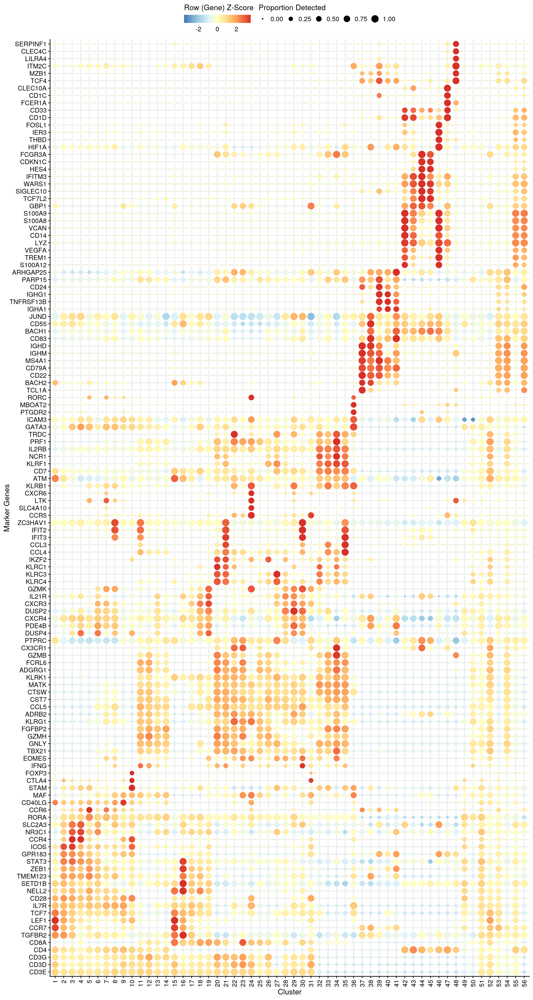
    


```R
dimname <- "MNN-UMAP"

p <- as.data.frame(reducedDim(combined, dimname)) %>% 
    bind_cols(as_tibble(t(logcounts(combined[geneNames,])))) %>% rename(V1 = 1, V2 = 2) %>% 
    gather(., key = "Symbol", value ="Expression", -c(V1, V2) ) %>% 
    mutate_at(vars(Symbol), factor) %>% mutate(Symbol = factor(Symbol, levels = geneNames)) %>%
    ggplot(aes(x = V1, y = V2, color = Expression)) + geom_point(size = 0.1, alpha = 0.1) + 
    facet_wrap(~ Symbol, ncol = 5) + scale_color_viridis(option = "plasma", direction = -1) +
    theme_classic(base_size = 20) + labs(x = paste(dimname, "1"), y = paste(dimname, "2"))

fig(width = 16, height = 70)
p
reset.fig()
```


    
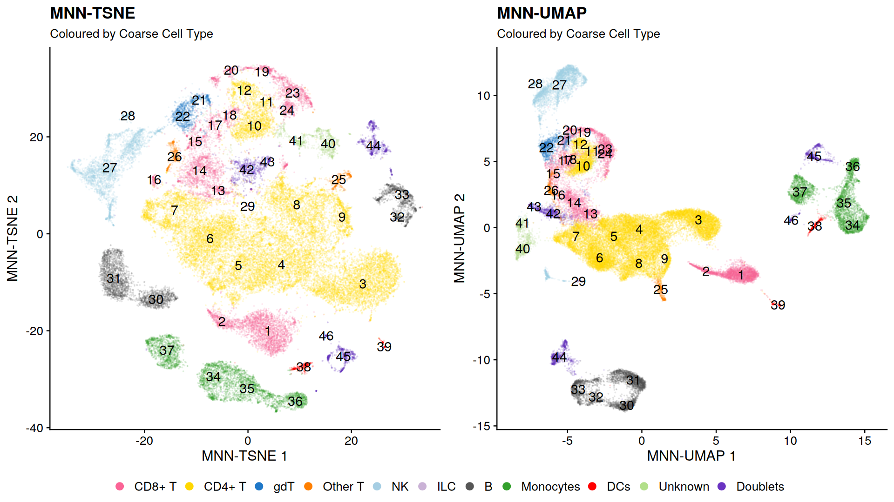
    


# 7 - Define per-cluster cell types

Introduces 2 new cell type labels:

- `CellType_1`: Coarse cell type annotation (same as `ClusterCellType`)
- `CellType_2`: Fine (per-cluster) cell type annotation

## Define "Coarse Cell Type" annotation


```R
combined$CellType_1 <- combined$label
levels(combined$CellType_1) <- c("CD4 T","CD4 T","CD4 T","CD4 T","CD4 T","CD4 T","CD4 T","CD4 T","CD4 T","CD4 T",
                                 "CD4 T","CD4 T","CD4 T","CD4 T","CD8 T","CD8 T","CD8 T","CD8 T","CD8 T","CD8 T",
                                 "CD8 T","CD8 T","CD8 T","CD8 T","CD8 T","CD8 T","gdT","CD8 T","CD8 T","CD8 T",
                                 "Other T","NK","NK","NK","NK","ILC","B","B","B","B","B","Monocytes","Monocytes",
                                 "Monocytes","Monocytes","Monocytes","DCs","DCs","Unknown","Unknown","Doublets",
                                 "Doublets","Doublets","Doublets","Doublets","Doublets")
combined$ClusterCellType <- combined$CellType_1
```


```R
table("Coarse Cell Type" = combined$CellType_1, "Condition" = combined$condition)
```


                    Condition
    Coarse Cell Type Control Cancer
           CD4 T        5885  16779
           CD8 T        3594   4748
           gdT            11    997
           Other T       319     45
           NK           1991   1523
           ILC            36     38
           B            1560   2620
           Monocytes    3099   1412
           DCs           377     60
           Unknown        98   1004
           Doublets     1121   1246


```R
table("Coarse Cell Type" = combined$CellType_1, "Clusters" = combined$label)
```


                    Clusters
    Coarse Cell Type    1    2    3    4    5    6    7    8    9   10   11   12   13   14   15   16   17   18
           CD4 T     4135 1925 2142 1550 3450 1078  595  561 2491 1938  756  209  748 1086    0    0    0    0
           CD8 T        0    0    0    0    0    0    0    0    0    0    0    0    0    0 2645  682  550   85
           gdT          0    0    0    0    0    0    0    0    0    0    0    0    0    0    0    0    0    0
           Other T      0    0    0    0    0    0    0    0    0    0    0    0    0    0    0    0    0    0
           NK           0    0    0    0    0    0    0    0    0    0    0    0    0    0    0    0    0    0
           ILC          0    0    0    0    0    0    0    0    0    0    0    0    0    0    0    0    0    0
           B            0    0    0    0    0    0    0    0    0    0    0    0    0    0    0    0    0    0
           Monocytes    0    0    0    0    0    0    0    0    0    0    0    0    0    0    0    0    0    0
           DCs          0    0    0    0    0    0    0    0    0    0    0    0    0    0    0    0    0    0
           Unknown      0    0    0    0    0    0    0    0    0    0    0    0    0    0    0    0    0    0
           Doublets     0    0    0    0    0    0    0    0    0    0    0    0    0    0    0    0    0    0
                    Clusters
    Coarse Cell Type   19   20   21   22   23   24   25   26   27   28   29   30   31   32   33   34   35   36
           CD4 T        0    0    0    0    0    0    0    0    0    0    0    0    0    0    0    0    0    0
           CD8 T      932  583  258  350  730  132  118  276    0  437  421  143    0    0    0    0    0    0
           gdT          0    0    0    0    0    0    0    0 1008    0    0    0    0    0    0    0    0    0
           Other T      0    0    0    0    0    0    0    0    0    0    0    0  364    0    0    0    0    0
           NK           0    0    0    0    0    0    0    0    0    0    0    0    0  723  871 1759  161    0
           ILC          0    0    0    0    0    0    0    0    0    0    0    0    0    0    0    0    0   74
           B            0    0    0    0    0    0    0    0    0    0    0    0    0    0    0    0    0    0
           Monocytes    0    0    0    0    0    0    0    0    0    0    0    0    0    0    0    0    0    0
           DCs          0    0    0    0    0    0    0    0    0    0    0    0    0    0    0    0    0    0
           Unknown      0    0    0    0    0    0    0    0    0    0    0    0    0    0    0    0    0    0
           Doublets     0    0    0    0    0    0    0    0    0    0    0    0    0    0    0    0    0    0
                    Clusters
    Coarse Cell Type   37   38   39   40   41   42   43   44   45   46   47   48   49   50   51   52   53   54
           CD4 T        0    0    0    0    0    0    0    0    0    0    0    0    0    0    0    0    0    0
           CD8 T        0    0    0    0    0    0    0    0    0    0    0    0    0    0    0    0    0    0
           gdT          0    0    0    0    0    0    0    0    0    0    0    0    0    0    0    0    0    0
           Other T      0    0    0    0    0    0    0    0    0    0    0    0    0    0    0    0    0    0
           NK           0    0    0    0    0    0    0    0    0    0    0    0    0    0    0    0    0    0
           ILC          0    0    0    0    0    0    0    0    0    0    0    0    0    0    0    0    0    0
           B         1070 1835  311  813  151    0    0    0    0    0    0    0    0    0    0    0    0    0
           Monocytes    0    0    0    0    0 1407 1118  684   38 1264    0    0    0    0    0    0    0    0
           DCs          0    0    0    0    0    0    0    0    0    0  329  108    0    0    0    0    0    0
           Unknown      0    0    0    0    0    0    0    0    0    0    0    0  773  329    0    0    0    0
           Doublets     0    0    0    0    0    0    0    0    0    0    0    0    0    0  580  269  599  206
                    Clusters
    Coarse Cell Type   55   56
           CD4 T        0    0
           CD8 T        0    0
           gdT          0    0
           Other T      0    0
           NK           0    0
           ILC          0    0
           B            0    0
           Monocytes    0    0
           DCs          0    0
           Unknown      0    0
           Doublets   607  106


```R
# Set colours for CellType_1
set.seed(10010)
c_celltype_col2 <- choosePalette(combined$CellType_1, sample(pals::cols25(nlevels(combined$CellType_1))))

# Coloured by CellType_1
fig(width = 16, height = 9)
plotProjections(combined, "CellType_1", dimnames = c("MNN-TSNE", "MNN-UMAP"), feat_desc = "Coarse Cell Type", 
                feat_color = c_celltype_col2, text_by = "label", point_size = 0.1, point_alpha = 0.05,
                text_size = 5, guides_nrow = 1, guides_size = 4, legend_pos = "bottom")
reset.fig()
```


    
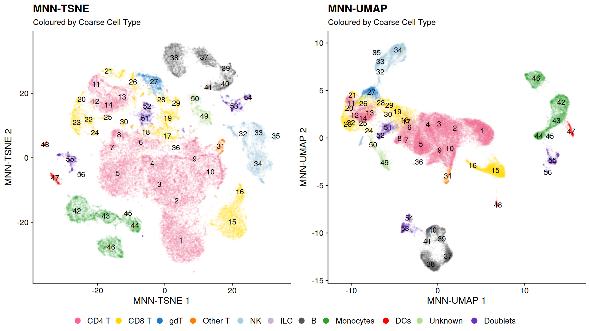
    


```R
fig(width = 16, height = 6)
data.frame(table("ct" = combined$CellType_1, "label" = combined$label, "Condition" = combined$condition)) %>% 
    ggplot(aes(Condition, Freq, fill = ct)) + geom_col() + 
    facet_wrap(~ ct, nrow = 2, scales = "free_y") + scale_fill_manual(values = c_celltype_col2) + 
    theme_cowplot(16) + guides(fill = guide_legend("Coarse CT", ncol = 1)) +
    theme(axis.text.x = element_text(angle = 0, hjust = 0.5, vjust = 1)) + ylab("Number of cells")
reset.fig()
```


    
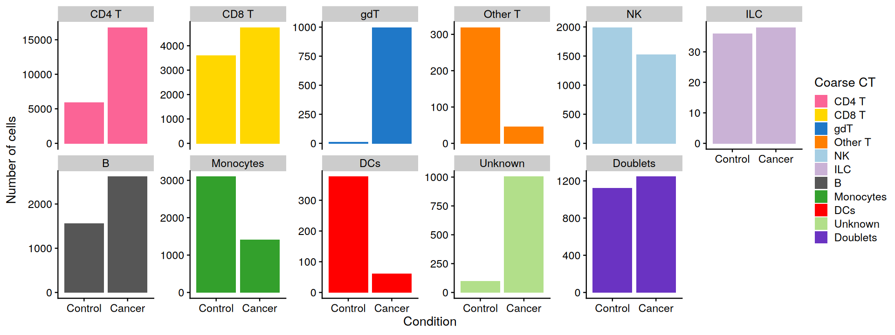
    


```R
fig(width = 16, height = 6)
data.frame(prop.table(table("Condition" = combined$condition, "ct" = combined$CellType_1, "label" = combined$label), 1)) %>% 
    ggplot(aes(Condition, Freq, fill = ct)) + geom_col() + 
    facet_wrap(~ ct, nrow = 2, scales = "free_y") + scale_fill_manual(values = c_celltype_col2) + 
    scale_y_continuous(labels = percent) + theme_cowplot(16) + guides(fill = guide_legend("Coarse CT", ncol = 1)) + 
    theme(axis.text.x = element_text(angle = 0, hjust = 0.5, vjust = 1)) + ylab("% Cells in condition")
reset.fig()
```


    
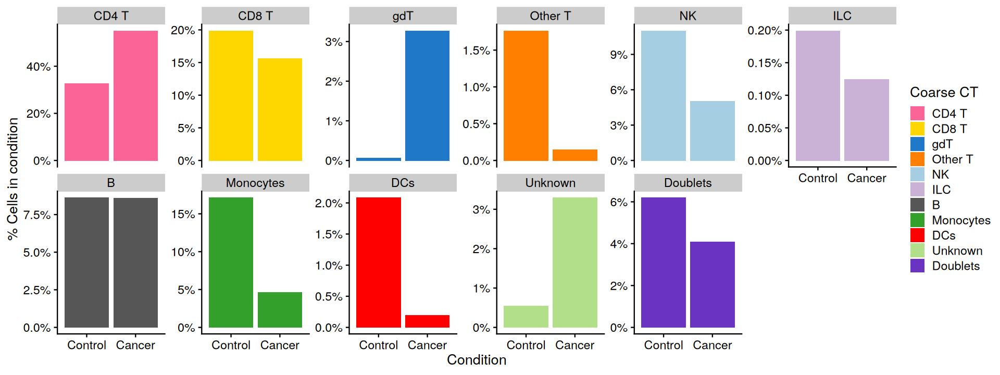
    


## Define "Fine Cell Type" annotation


```R
combined$CellType_2 <- combined$label
levels(combined$CellType_2) <- paste(1:nlevels(combined$label), 
                                     c("Naive CD4 T","Momory CD4 T","Momory CD4 T","Momory CD4 T",
                                       "Th17-like CD4 T","Activated CD4 T","Activated CD4 T",
                                       "Activated CD4 T, Inflamed","CD40LG+ CD4 T","Memory Tregs",
                                       "Th1 CD4 CTL, Inflamed","Th1 CD4 CTL","Activated Th1-like CD4 T",
                                       "Th1-like CD4 T","Naive CD8 T","CD8 TILs","CD8 TILs","Activated CD8 TILs",
                                       "Activated CD8 TILs","CD16+ CD8 CTL","CD16+ CD8 CTL, Inflamed",
                                       "TE CD8(lo) T","TE CD8(hi) T","MAITs","CD8 CTL","CD8 CTL","gdT",
                                       "Activated CD8(hi) T","Activated CD8(lo) T","Activated CD8 T, Inflamed",
                                       "CCR5+ T","NK","NK (CCL3/4)","NK (CX3CR1)","NK, Inflamed","ILC2",
                                       "Naive B","Activated B","USM B","SM B","SM B (CXCR4)","CD14 Monocytes",
                                       "Stimulated CD14 Monocytes","CD16 Monocytes","CD16 Monocytes (CX3CR1)",
                                       "CD14 TAM","CD1C+ DCs","pDCs","Cytotoxic-like","Momory-like","T","T",
                                       "B/T","B/T","T/Monocytes","B/Monocytes"))
```


```R
table("Fine Cell Type" = combined$CellType_2, "Condition" = combined$condition)
```


                                  Condition
    Fine Cell Type                 Control Cancer
      1 Naive CD4 T                   3139    996
      2 Momory CD4 T                    96   1829
      3 Momory CD4 T                     7   2135
      4 Momory CD4 T                     1   1549
      5 Th17-like CD4 T                 34   3416
      6 Activated CD4 T                 10   1068
      7 Activated CD4 T                  8    587
      8 Activated CD4 T, Inflamed        0    561
      9 CD40LG+ CD4 T                 1872    619
      10 Memory Tregs                  675   1263
      11 Th1 CD4 CTL, Inflamed           3    753
      12 Th1 CD4 CTL                    13    196
      13 Activated Th1-like CD4 T        4    744
      14 Th1-like CD4 T                 23   1063
      15 Naive CD8 T                  2172    473
      16 CD8 TILs                        1    681
      17 CD8 TILs                      101    449
      18 Activated CD8 TILs              1     84
      19 Activated CD8 TILs             31    901
      20 CD16+ CD8 CTL                 120    463
      21 CD16+ CD8 CTL, Inflamed         0    258
      22 TE CD8(lo) T                  324     26
      23 TE CD8(hi) T                  654     76
      24 MAITs                         119     13
      25 CD8 CTL                        62     56
      26 CD8 CTL                         3    273
      27 gdT                            11    997
      28 Activated CD8(hi) T             6    431
      29 Activated CD8(lo) T             0    421
      30 Activated CD8 T, Inflamed       0    143
      31 CCR5+ T                       319     45
      32 NK                            342    381
      33 NK (CCL3/4)                     5    866
      34 NK (CX3CR1)                  1644    115
      35 NK, Inflamed                    0    161
      36 ILC2                           36     38
      37 Naive B                       996     74
      38 Activated B                     5   1830
      39 USM B                         267     44
      40 SM B                          291    522
      41 SM B (CXCR4)                    1    150
      42 CD14 Monocytes               1381     26
      43 Stimulated CD14 Monocytes    1047     71
      44 CD16 Monocytes                633     51
      45 CD16 Monocytes (CX3CR1)        35      3
      46 CD14 TAM                        3   1261
      47 CD1C+ DCs                     298     31
      48 pDCs                           79     29
      49 Cytotoxic-like                 71    702
      50 Momory-like                    27    302
      51 T                              64    516
      52 T                             241     28
      53 B/T                           234    365
      54 B/T                            93    113
      55 T/Monocytes                   408    199
      56 B/Monocytes                    81     25


```R
# Set colours for CellType_2
c_celltype_col3 <- choosePalette(combined$CellType_2, c_clust_col) # same colour as cluster colours

# Coloured by CellType_2
fig(width = 16, height = 12)
plotProjections(combined, "CellType_2", dimnames = c("MNN-TSNE", "MNN-UMAP"), feat_desc = "Fine Cell Type", 
                feat_color = c_celltype_col3, text_by = "label", point_size = 0.1, point_alpha = 0.05,
                text_size = 5, guides_nrow = 12, guides_size = 4, legend_pos = "bottom", rel_height = c(5, 2))
reset.fig()
```


    
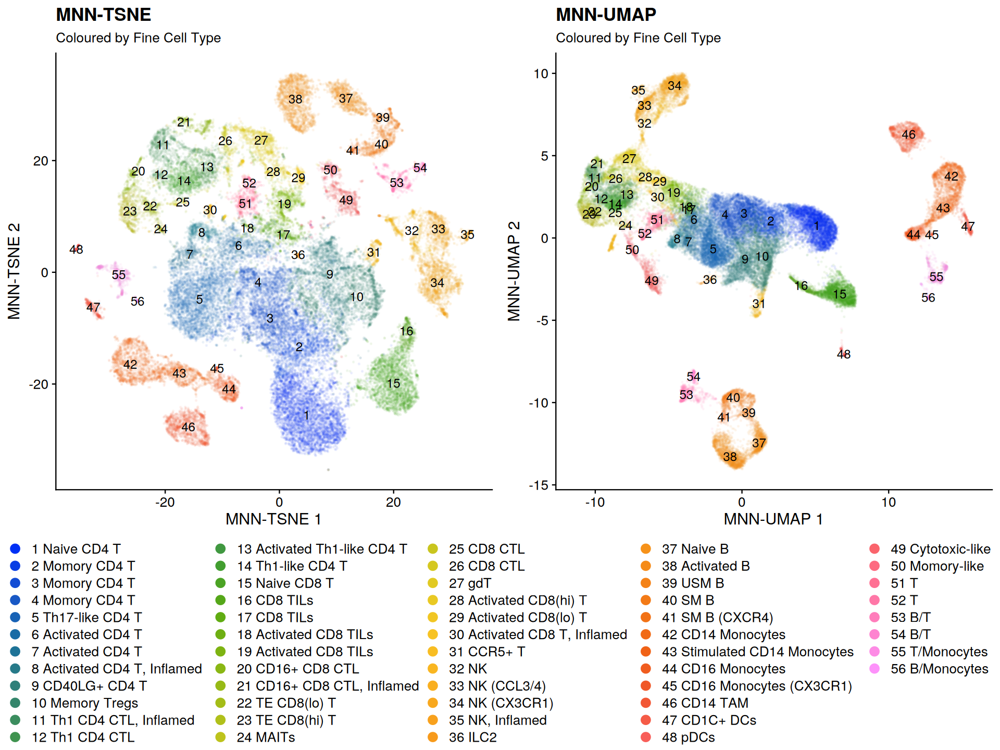
    


```R
fig(width = 16, height = 25)
data.frame(table("ct" = combined$CellType_2, "label" = combined$label, "Condition" = combined$condition)) %>% 
    ggplot(aes(Condition, Freq, fill = ct)) + geom_col() + facet_wrap(~ ct, ncol = 5, scales = "free_y") + 
    scale_fill_manual(values = c_celltype_col3) + theme_cowplot(16) + guides(fill = "none") +
    theme(axis.text.x = element_text(angle = 0, hjust = 0.5, vjust = 1)) + ylab("Number of cells")
reset.fig()
```


    
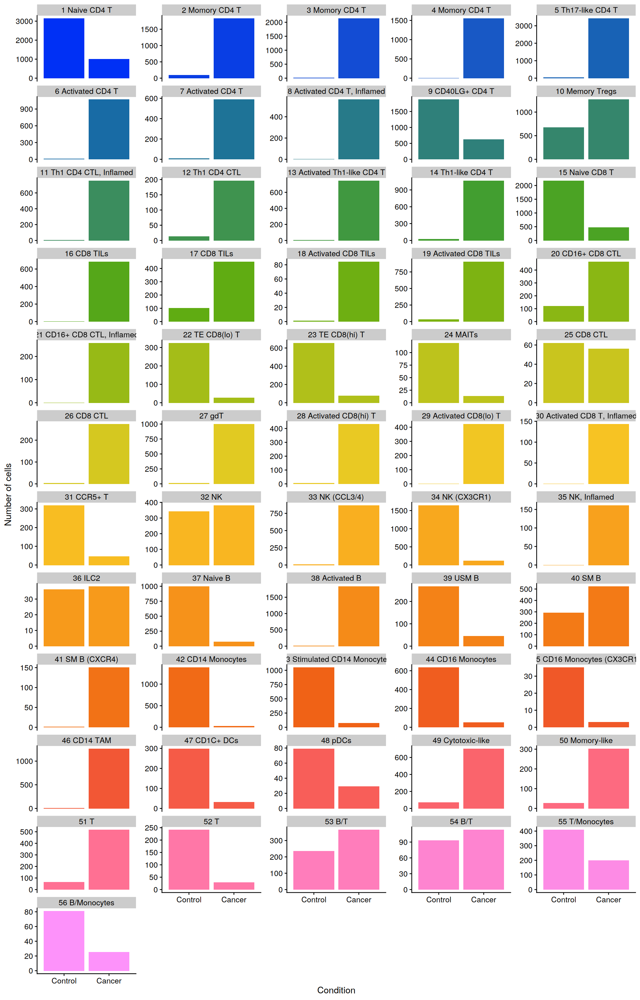
    


```R
fig(width = 16, height = 25)
data.frame(prop.table(table("Condition" = combined$condition, "ct" = combined$CellType_2, "label" = combined$label), 1)) %>% 
    ggplot(aes(Condition, Freq, fill = ct)) + geom_col() + facet_wrap(~ ct, ncol = 5, scales = "free_y") + 
    scale_fill_manual(values = c_celltype_col3) + scale_y_continuous(labels = percent) + 
    theme_cowplot(16) + guides(fill = "none") +
    theme(axis.text.x = element_text(angle = 0, hjust = 0.5, vjust = 1)) + ylab("% Cells in condition")
reset.fig()
```


    
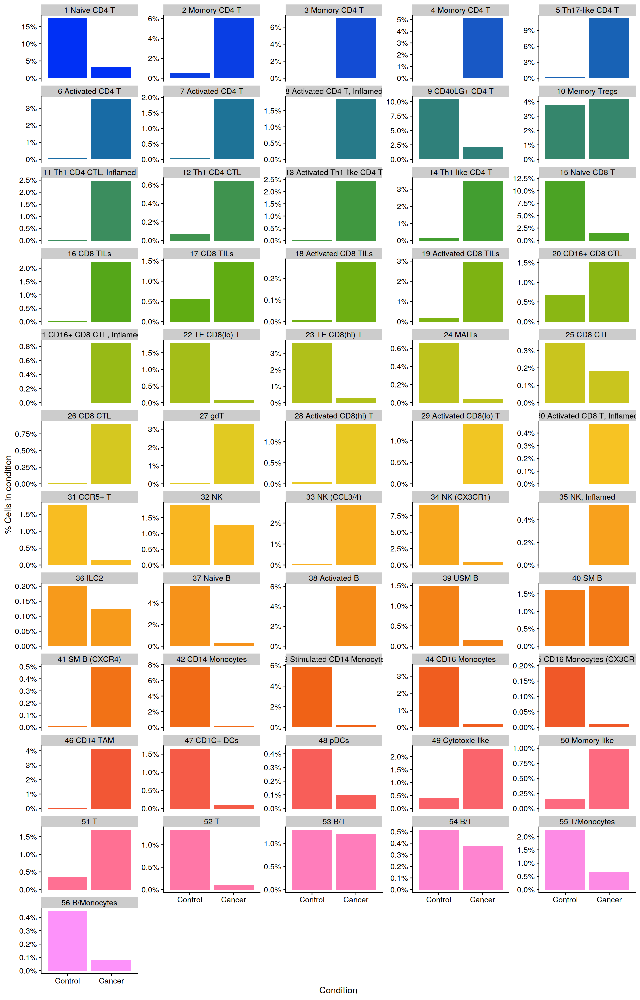
    


# 8 - Marker gene detection

Potential marker genes are identified by taking the top set of DE genes from each pairwise comparison between clusters. The results are arranged into a single output table that allows a marker set to be easily defined for a user-specified size of the top set. For example, to construct a marker set from the top 10 genes of each comparison, one would filter `marker.set` to retain rows with Top less than or equal to 10.

<div class="alert alert-warning">
  <strong>Warning!</strong> Take note of any poor clusters in the silhouette plot and consider how trustworthy the marker genes actually are.
</div>

Here we are going to use `findMarkers` from `scran` package as this is much faster. 

## Decided the `pval.type` and `min.prop` settings

- Use `pval.type` to specify how p-values are to be combined across pairwise comparisons for a given group/cluster. Defaults `pval.type` is `"any"`.
- Use `min.prop` to specify the minimum proportion of significant comparisons per gene. Defaults `min.prop` is 0.5 when `pval.type="some"`, and zero for all other `pval.type` options.

The choice of `pval.type` determines whether the highly ranked genes are those that are DE between the current group and:

### 1. DE against any other cluster ("any")

If `pval.type="any"`, the null hypothesis is that the **gene is not DE in as least 1 contrasts**. This approach does not explicitly favour genes that are uniquely expressed in a cluster. Rather, it focuses on combinations of genes that - together - drive separation of a cluster from the others. This is more general and robust but tends to yield a less focused marker set compared to the other `pval.type` settings.

Using `pval.type="any"`, the result will contain a `Top` column that shows the minimum rank across all pairwise comparisons. For example, if we define a marker set with an `T` of 1 for a given cluster. The set of genes with `Top <= 1` will contain the top gene from each pairwise comparison to every other cluster. If `T` is `5`, the set will consist of the union of the top 5 genes from each pairwise comparison. This approach does not explicitly favour genes that are uniquely expressed in a cluster. Rather, it focuses on combinations of genes that - together - drive separation of a cluster from the others. This is more general and robust but tends to yield a less focused marker set compared to the other `pval.type` settings.

### 2. DE against all other clusters ("all")

If `pval.type="all"`, the null hypothesis is that the **gene is not DE in all contrasts**. This strategy is particularly effective when dealing with distinct clusters that have a unique expression profile. In such cases, it yields a highly focused marker set that concisely captures the differences between clusters. However, it can be too stringent if the cluster's separation is driven by combinations of gene expression. 

### 3. DE against some (50%) other clusters ("some")

The `pval.type="some"` setting serves as a compromise between "all" and "any". A combined p-value is calculated by taking the middlemost value of the Holm-corrected p-values for each gene. Here, the null hypothesis is that the **gene is not DE in at least half of the contrasts**.

### 4. DE against some other clusters (rank-style)

This is achieved by setting `pval.type="any"` with `min.prop` set to some positive value in (0, 1). Here, we are selecting high-ranked genes that are among the top-ranked (`Top`) genes in at least `min.prop` of the pairwise comparisons

For example, if `pval.type="any", min.prop=0.3`, any gene with a value of `Top` less than or equal to 5 will be in the top 5 DEGs of at least 30% of the comparisons. This method increases the stringency of the `"any"` setting in a safer manner than `pval.type="some"`.

More explanation can be found by `?findMarkers`, `?combineMarkers` and `?combinePValues`.

## Find marker genes for clusters

<div class="alert alert-warning">
  <strong>Warning!</strong> All doublet clusters are not included in the marker analysis.
</div>


```R
# Use all cells
# not_doublets <- rep(TRUE, ncol(combined))

# Exclude annotated doublet clusters
not_doublets <- combined$CellType_1 != "Doublets"
table(not_doublets)
```


    not_doublets
    FALSE  TRUE 
     2367 46196 


### Run `findMarkers` (both directions)

Considers both up- and downregulated genes to be potential markers.


```R
# Set pval.type (and min.prop if using "any")
pval.type <- "any"
min.prop <- 0.3

# Using logcounts from combined
marker.genes.cluster <- findMarkers(sce_l[, not_doublets], groups = droplevels(combined$label[not_doublets]),
                                    #blocking on uninteresting factors
                                    block = droplevels(combined$condition[not_doublets]),
                                    pval.type = pval.type, min.prop = min.prop, BPPARAM = bpp)
marker.genes.cluster
```


    List of length 50
    names(50): 1 2 3 4 5 6 7 8 9 10 11 12 13 14 15 16 17 ... 34 35 36 37 38 39 40 41 42 43 44 45 46 47 48 49 50


Print the number of markers that passed the FDR or `Top` threshold. This will be the number of genes as inut for `enrichR`.


```R
printMarkerStats(marker.genes.cluster, pval.type = pval.type, min.prop = min.prop)
```

    Number of selected markers (Top 200 genes of at least 30.0% comparisons):
    - Cluster1: 185; Up = 108; Down = 77; Max. P-value = 9.1e-203.
    - Cluster2: 170; Up = 113; Down = 57; Max. P-value = 6.6e-163.
    - Cluster3: 161; Up = 128; Down = 33; Max. P-value = 2e-200.
    - Cluster4: 161; Up = 123; Down = 38; Max. P-value = 3.9e-81.
    - Cluster5: 161; Up = 130; Down = 31; Max. P-value = 3.9e-70.
    - Cluster6: 163; Up = 106; Down = 57; Max. P-value = 4.8e-160.
    - Cluster7: 175; Up = 126; Down = 49; Max. P-value = 2e-206.
    - Cluster8: 191; Up = 151; Down = 40; Max. P-value = 8.9e-146.
    - Cluster9: 146; Up = 83; Down = 63; Max. P-value = 5.8e-289.
    - Cluster10: 158; Up = 98; Down = 60; Max. P-value = 3.1e-102.
    - Cluster11: 166; Up = 129; Down = 37; Max. P-value = 6.1e-109.
    - Cluster12: 144; Up = 82; Down = 62; Max. P-value = 2.5e-85.
    - Cluster13: 155; Up = 97; Down = 58; Max. P-value = 9.7e-97.
    - Cluster14: 150; Up = 82; Down = 68; Max. P-value = 7.9e-144.
    - Cluster15: 169; Up = 82; Down = 87; Max. P-value = 2e-112.
    - Cluster16: 166; Up = 102; Down = 64; Max. P-value = 2e-223.
    - Cluster17: 148; Up = 65; Down = 83; Max. P-value = 1.1e-97.
    - Cluster18: 142; Up = 87; Down = 55; Max. P-value = 4.6e-31.
    - Cluster19: 159; Up = 100; Down = 59; Max. P-value = 5.1e-100.
    - Cluster20: 175; Up = 123; Down = 52; Max. P-value = 2.2e-111.
    - Cluster21: 179; Up = 133; Down = 46; Max. P-value = 5.4e-30.
    - Cluster22: 108; Up = 52; Down = 56; Max. P-value = 6.5e-48.
    - Cluster23: 128; Up = 66; Down = 62; Max. P-value = 4.6e-113.
    - Cluster24: 120; Up = 27; Down = 93; Max. P-value = 1.9e-19.
    - Cluster25: 104; Up = 19; Down = 85; Max. P-value = 2.1e-29.
    - Cluster26: 136; Up = 65; Down = 71; Max. P-value = 4.6e-26.
    - Cluster27: 160; Up = 93; Down = 67; Max. P-value = 2.1e-270.
    - Cluster28: 153; Up = 92; Down = 61; Max. P-value = 1.1e-102.
    - Cluster29: 201; Up = 167; Down = 34; Max. P-value = 4.9e-80.
    - Cluster30: 171; Up = 140; Down = 31; Max. P-value = 1.3e-44.
    - Cluster31: 121; Up = 46; Down = 75; Max. P-value = 2.5e-67.
    - Cluster32: 167; Up = 92; Down = 75; Max. P-value = 1.6e-151.
    - Cluster33: 186; Up = 133; Down = 53; Max. P-value = 3.8e-190.
    - Cluster34: 162; Up = 106; Down = 56; Max. P-value = 0.
    - Cluster35: 182; Up = 117; Down = 65; Max. P-value = 7.4e-34.
    - Cluster36: 149; Up = 10; Down = 139; Max. P-value = 9.5e-25.
    - Cluster37: 201; Up = 84; Down = 117; Max. P-value = 8.1e-88.
    - Cluster38: 209; Up = 169; Down = 40; Max. P-value = 0.
    - Cluster39: 197; Up = 58; Down = 139; Max. P-value = 2.2e-67.
    - Cluster40: 207; Up = 100; Down = 107; Max. P-value = 7.6e-133.
    - Cluster41: 199; Up = 74; Down = 125; Max. P-value = 3e-37.
    - Cluster42: 197; Up = 147; Down = 50; Max. P-value = 4.7e-203.
    - Cluster43: 217; Up = 147; Down = 70; Max. P-value = 1.1e-292.
    - Cluster44: 216; Up = 130; Down = 86; Max. P-value = 0.
    - Cluster45: 191; Up = 16; Down = 175; Max. P-value = 7.1e-30.
    - Cluster46: 234; Up = 229; Down = 5; Max. P-value = 1.7e-182.
    - Cluster47: 191; Up = 87; Down = 104; Max. P-value = 4.6e-86.
    - Cluster48: 171; Up = 12; Down = 159; Max. P-value = 2.6e-33.
    - Cluster49: 186; Up = 38; Down = 148; Max. P-value = 1.6e-84.
    - Cluster50: 172; Up = 21; Down = 151; Max. P-value = 1.8e-56.
    * Upregulated when logFC > 0.0 and downregulated when logFC < 0.0.


```R
for(ID in names(marker.genes.cluster)) {
    # Append Ensembl ID and Symbol from rowData
    marker.genes.cluster[[ID]] <- cbind(rowData(combined)[rownames(marker.genes.cluster[[ID]]),][,1:2], 
                                        marker.genes.cluster[[ID]])
}

exportResList(marker.genes.cluster, col_anno = c("ID","Symbol"), prefix = paste0(file_id, "_cluster"))
```

    Detecting findMarkers input.
    Creating file: 160k_All_cluster_findMarkers_Cluster1.tsv
    Creating file: 160k_All_cluster_findMarkers_Cluster2.tsv
    Creating file: 160k_All_cluster_findMarkers_Cluster3.tsv
    Creating file: 160k_All_cluster_findMarkers_Cluster4.tsv
    Creating file: 160k_All_cluster_findMarkers_Cluster5.tsv
    Creating file: 160k_All_cluster_findMarkers_Cluster6.tsv
    Creating file: 160k_All_cluster_findMarkers_Cluster7.tsv
    Creating file: 160k_All_cluster_findMarkers_Cluster8.tsv
    Creating file: 160k_All_cluster_findMarkers_Cluster9.tsv
    Creating file: 160k_All_cluster_findMarkers_Cluster10.tsv
    Creating file: 160k_All_cluster_findMarkers_Cluster11.tsv
    Creating file: 160k_All_cluster_findMarkers_Cluster12.tsv
    Creating file: 160k_All_cluster_findMarkers_Cluster13.tsv
    Creating file: 160k_All_cluster_findMarkers_Cluster14.tsv
    Creating file: 160k_All_cluster_findMarkers_Cluster15.tsv
    Creating file: 160k_All_cluster_findMarkers_Cluster16.tsv
    Creating file: 160k_All_cluster_findMarkers_Cluster17.tsv
    Creating file: 160k_All_cluster_findMarkers_Cluster18.tsv
    Creating file: 160k_All_cluster_findMarkers_Cluster19.tsv
    Creating file: 160k_All_cluster_findMarkers_Cluster20.tsv
    Creating file: 160k_All_cluster_findMarkers_Cluster21.tsv
    Creating file: 160k_All_cluster_findMarkers_Cluster22.tsv
    Creating file: 160k_All_cluster_findMarkers_Cluster23.tsv
    Creating file: 160k_All_cluster_findMarkers_Cluster24.tsv
    Creating file: 160k_All_cluster_findMarkers_Cluster25.tsv
    Creating file: 160k_All_cluster_findMarkers_Cluster26.tsv
    Creating file: 160k_All_cluster_findMarkers_Cluster27.tsv
    Creating file: 160k_All_cluster_findMarkers_Cluster28.tsv
    Creating file: 160k_All_cluster_findMarkers_Cluster29.tsv
    Creating file: 160k_All_cluster_findMarkers_Cluster30.tsv
    Creating file: 160k_All_cluster_findMarkers_Cluster31.tsv
    Creating file: 160k_All_cluster_findMarkers_Cluster32.tsv
    Creating file: 160k_All_cluster_findMarkers_Cluster33.tsv
    Creating file: 160k_All_cluster_findMarkers_Cluster34.tsv
    Creating file: 160k_All_cluster_findMarkers_Cluster35.tsv
    Creating file: 160k_All_cluster_findMarkers_Cluster36.tsv
    Creating file: 160k_All_cluster_findMarkers_Cluster37.tsv
    Creating file: 160k_All_cluster_findMarkers_Cluster38.tsv
    Creating file: 160k_All_cluster_findMarkers_Cluster39.tsv
    Creating file: 160k_All_cluster_findMarkers_Cluster40.tsv
    Creating file: 160k_All_cluster_findMarkers_Cluster41.tsv
    Creating file: 160k_All_cluster_findMarkers_Cluster42.tsv
    Creating file: 160k_All_cluster_findMarkers_Cluster43.tsv
    Creating file: 160k_All_cluster_findMarkers_Cluster44.tsv
    Creating file: 160k_All_cluster_findMarkers_Cluster45.tsv
    Creating file: 160k_All_cluster_findMarkers_Cluster46.tsv
    Creating file: 160k_All_cluster_findMarkers_Cluster47.tsv
    Creating file: 160k_All_cluster_findMarkers_Cluster48.tsv
    Creating file: 160k_All_cluster_findMarkers_Cluster49.tsv
    Creating file: 160k_All_cluster_findMarkers_Cluster50.tsv


### Run `findMarkers` (upregulated genes)

Set `direction='up'` to only consider upregulated genes as potential markers.


```R
# Set pval.type (and min.prop if using "any")
pval.type <- "any"
min.prop <- 0.3
direction <- "up"

# Using logcounts from combined
marker.genes.cluster.up <- findMarkers(sce_l[, not_doublets], groups = droplevels(combined$label[not_doublets]),
                                       #blocking on uninteresting factors
                                       block = droplevels(combined$condition[not_doublets]), 
                                       pval.type = pval.type, min.prop = min.prop,
                                       lfc = 0.5, direction = direction, BPPARAM = bpp)
marker.genes.cluster.up
```


    List of length 50
    names(50): 1 2 3 4 5 6 7 8 9 10 11 12 13 14 15 16 17 ... 34 35 36 37 38 39 40 41 42 43 44 45 46 47 48 49 50


Print the number of markers that passed the FDR or `Top` threshold. This will be the number of genes as inut for `enrichR`.


```R
printMarkerStats(marker.genes.cluster.up, pval.type = pval.type, min.prop = min.prop)
```

    Number of selected markers (Top 200 genes of at least 30.0% comparisons):
    - Cluster1: 250; Up = 250; Down = 0; Max. P-value = 1.7e-54.
    - Cluster2: 241; Up = 241; Down = 0; Max. P-value = 7.6e-73.
    - Cluster3: 240; Up = 240; Down = 0; Max. P-value = 3.5e-07.
    - Cluster4: 271; Up = 271; Down = 0; Max. P-value = 0.8.
    - Cluster5: 238; Up = 238; Down = 0; Max. P-value = 5.4e-13.
    - Cluster6: 251; Up = 251; Down = 0; Max. P-value = 6.2e-47.
    - Cluster7: 253; Up = 253; Down = 0; Max. P-value = 8e-19.
    - Cluster8: 256; Up = 256; Down = 0; Max. P-value = 7.2e-12.
    - Cluster9: 233; Up = 233; Down = 0; Max. P-value = 1.1e-14.
    - Cluster10: 247; Up = 247; Down = 0; Max. P-value = 4.2e-12.
    - Cluster11: 258; Up = 258; Down = 0; Max. P-value = 1.2e-17.
    - Cluster12: 254; Up = 254; Down = 0; Max. P-value = 0.093.
    - Cluster13: 246; Up = 246; Down = 0; Max. P-value = 1.3e-41.
    - Cluster14: 246; Up = 246; Down = 0; Max. P-value = 2.9e-116.
    - Cluster15: 263; Up = 263; Down = 0; Max. P-value = 6.3e-160.
    - Cluster16: 257; Up = 257; Down = 0; Max. P-value = 1.1e-135.
    - Cluster17: 237; Up = 237; Down = 0; Max. P-value = 1.7e-19.
    - Cluster18: 254; Up = 254; Down = 0; Max. P-value = 2.5e-09.
    - Cluster19: 254; Up = 254; Down = 0; Max. P-value = 1.1e-22.
    - Cluster20: 241; Up = 241; Down = 0; Max. P-value = 1.2e-22.
    - Cluster21: 257; Up = 257; Down = 0; Max. P-value = 4.2e-06.
    - Cluster22: 243; Up = 243; Down = 0; Max. P-value = 5.3e-20.
    - Cluster23: 255; Up = 255; Down = 0; Max. P-value = 1.4e-10.
    - Cluster24: 230; Up = 230; Down = 0; Max. P-value = 0.028.
    - Cluster25: 237; Up = 237; Down = 0; Max. P-value = 1.
    - Cluster26: 239; Up = 239; Down = 0; Max. P-value = 1.6e-05.
    - Cluster27: 243; Up = 243; Down = 0; Max. P-value = 2.7e-15.
    - Cluster28: 251; Up = 251; Down = 0; Max. P-value = 1.2e-18.
    - Cluster29: 265; Up = 265; Down = 0; Max. P-value = 4e-41.
    - Cluster30: 264; Up = 264; Down = 0; Max. P-value = 2.1e-06.
    - Cluster31: 244; Up = 244; Down = 0; Max. P-value = 0.55.
    - Cluster32: 239; Up = 239; Down = 0; Max. P-value = 1.1e-14.
    - Cluster33: 255; Up = 255; Down = 0; Max. P-value = 1.3e-24.
    - Cluster34: 252; Up = 252; Down = 0; Max. P-value = 4.8e-60.
    - Cluster35: 242; Up = 242; Down = 0; Max. P-value = 2.5e-40.
    - Cluster36: 247; Up = 247; Down = 0; Max. P-value = 5.3e-19.
    - Cluster37: 243; Up = 243; Down = 0; Max. P-value = 3.8e-30.
    - Cluster38: 228; Up = 228; Down = 0; Max. P-value = 6.6e-09.
    - Cluster39: 248; Up = 248; Down = 0; Max. P-value = 1.1e-12.
    - Cluster40: 235; Up = 235; Down = 0; Max. P-value = 3.8e-19.
    - Cluster41: 238; Up = 238; Down = 0; Max. P-value = 0.00025.
    - Cluster42: 241; Up = 241; Down = 0; Max. P-value = 3.7e-17.
    - Cluster43: 261; Up = 261; Down = 0; Max. P-value = 2e-121.
    - Cluster44: 253; Up = 253; Down = 0; Max. P-value = 6.5e-211.
    - Cluster45: 222; Up = 222; Down = 0; Max. P-value = 0.00068.
    - Cluster46: 249; Up = 249; Down = 0; Max. P-value = 0.
    - Cluster47: 255; Up = 255; Down = 0; Max. P-value = 3.8e-28.
    - Cluster48: 244; Up = 244; Down = 0; Max. P-value = 4.1e-06.
    - Cluster49: 254; Up = 254; Down = 0; Max. P-value = 0.0011.
    - Cluster50: 265; Up = 265; Down = 0; Max. P-value = 1.
    * Upregulated when logFC > 0.0 and downregulated when logFC < 0.0.


```R
# Append Ensembl ID and Symbol from rowData
for(ID in names(marker.genes.cluster.up)) {
    marker.genes.cluster.up[[ID]] <- cbind(rowData(combined)[rownames(marker.genes.cluster.up[[ID]]),][,1:2], 
                                           marker.genes.cluster.up[[ID]])
}

exportResList(marker.genes.cluster.up, col_anno = c("ID","Symbol"), prefix = paste0(file_id, "_cluster"), 
              direction = direction)
```

    Detecting findMarkers input.
    Creating file: 160k_All_cluster_findMarkers_upregulated_Cluster1.tsv
    Creating file: 160k_All_cluster_findMarkers_upregulated_Cluster2.tsv
    Creating file: 160k_All_cluster_findMarkers_upregulated_Cluster3.tsv
    Creating file: 160k_All_cluster_findMarkers_upregulated_Cluster4.tsv
    Creating file: 160k_All_cluster_findMarkers_upregulated_Cluster5.tsv
    Creating file: 160k_All_cluster_findMarkers_upregulated_Cluster6.tsv
    Creating file: 160k_All_cluster_findMarkers_upregulated_Cluster7.tsv
    Creating file: 160k_All_cluster_findMarkers_upregulated_Cluster8.tsv
    Creating file: 160k_All_cluster_findMarkers_upregulated_Cluster9.tsv
    Creating file: 160k_All_cluster_findMarkers_upregulated_Cluster10.tsv
    Creating file: 160k_All_cluster_findMarkers_upregulated_Cluster11.tsv
    Creating file: 160k_All_cluster_findMarkers_upregulated_Cluster12.tsv
    Creating file: 160k_All_cluster_findMarkers_upregulated_Cluster13.tsv
    Creating file: 160k_All_cluster_findMarkers_upregulated_Cluster14.tsv
    Creating file: 160k_All_cluster_findMarkers_upregulated_Cluster15.tsv
    Creating file: 160k_All_cluster_findMarkers_upregulated_Cluster16.tsv
    Creating file: 160k_All_cluster_findMarkers_upregulated_Cluster17.tsv
    Creating file: 160k_All_cluster_findMarkers_upregulated_Cluster18.tsv
    Creating file: 160k_All_cluster_findMarkers_upregulated_Cluster19.tsv
    Creating file: 160k_All_cluster_findMarkers_upregulated_Cluster20.tsv
    Creating file: 160k_All_cluster_findMarkers_upregulated_Cluster21.tsv
    Creating file: 160k_All_cluster_findMarkers_upregulated_Cluster22.tsv
    Creating file: 160k_All_cluster_findMarkers_upregulated_Cluster23.tsv
    Creating file: 160k_All_cluster_findMarkers_upregulated_Cluster24.tsv
    Creating file: 160k_All_cluster_findMarkers_upregulated_Cluster25.tsv
    Creating file: 160k_All_cluster_findMarkers_upregulated_Cluster26.tsv
    Creating file: 160k_All_cluster_findMarkers_upregulated_Cluster27.tsv
    Creating file: 160k_All_cluster_findMarkers_upregulated_Cluster28.tsv
    Creating file: 160k_All_cluster_findMarkers_upregulated_Cluster29.tsv
    Creating file: 160k_All_cluster_findMarkers_upregulated_Cluster30.tsv
    Creating file: 160k_All_cluster_findMarkers_upregulated_Cluster31.tsv
    Creating file: 160k_All_cluster_findMarkers_upregulated_Cluster32.tsv
    Creating file: 160k_All_cluster_findMarkers_upregulated_Cluster33.tsv
    Creating file: 160k_All_cluster_findMarkers_upregulated_Cluster34.tsv
    Creating file: 160k_All_cluster_findMarkers_upregulated_Cluster35.tsv
    Creating file: 160k_All_cluster_findMarkers_upregulated_Cluster36.tsv
    Creating file: 160k_All_cluster_findMarkers_upregulated_Cluster37.tsv
    Creating file: 160k_All_cluster_findMarkers_upregulated_Cluster38.tsv
    Creating file: 160k_All_cluster_findMarkers_upregulated_Cluster39.tsv
    Creating file: 160k_All_cluster_findMarkers_upregulated_Cluster40.tsv
    Creating file: 160k_All_cluster_findMarkers_upregulated_Cluster41.tsv
    Creating file: 160k_All_cluster_findMarkers_upregulated_Cluster42.tsv
    Creating file: 160k_All_cluster_findMarkers_upregulated_Cluster43.tsv
    Creating file: 160k_All_cluster_findMarkers_upregulated_Cluster44.tsv
    Creating file: 160k_All_cluster_findMarkers_upregulated_Cluster45.tsv
    Creating file: 160k_All_cluster_findMarkers_upregulated_Cluster46.tsv
    Creating file: 160k_All_cluster_findMarkers_upregulated_Cluster47.tsv
    Creating file: 160k_All_cluster_findMarkers_upregulated_Cluster48.tsv
    Creating file: 160k_All_cluster_findMarkers_upregulated_Cluster49.tsv
    Creating file: 160k_All_cluster_findMarkers_upregulated_Cluster50.tsv


### Run `findMarkers` (downregulated genes)

Set `direction='down'` to only consider downregulated genes as potential markers.


```R
# Set pval.type (and min.prop if using "any")
pval.type <- "any"
min.prop <- 0.3
direction <- "down"

# Using logcounts from combined
marker.genes.cluster.dn <- findMarkers(sce_l[, not_doublets], groups = droplevels(combined$label[not_doublets]),
                                       #blocking on uninteresting factors
                                       block = droplevels(combined$condition[not_doublets]), 
                                       pval.type = pval.type, min.prop = min.prop,
                                       lfc = 0.5, direction = direction, BPPARAM = bpp)
marker.genes.cluster.dn
```


    List of length 50
    names(50): 1 2 3 4 5 6 7 8 9 10 11 12 13 14 15 16 17 ... 34 35 36 37 38 39 40 41 42 43 44 45 46 47 48 49 50


Print the number of markers that passed the FDR or `Top` threshold. This will be the number of genes as inut for `enrichR`.


```R
printMarkerStats(marker.genes.cluster.dn, pval.type = pval.type, min.prop = min.prop)
```

    Number of selected markers (Top 200 genes of at least 30.0% comparisons):
    - Cluster1: 194; Up = 0; Down = 194; Max. P-value = 2e-45.
    - Cluster2: 171; Up = 0; Down = 171; Max. P-value = 4.9e-67.
    - Cluster3: 163; Up = 0; Down = 163; Max. P-value = 2.9e-174.
    - Cluster4: 142; Up = 0; Down = 142; Max. P-value = 4.2e-08.
    - Cluster5: 165; Up = 0; Down = 165; Max. P-value = 2.4e-31.
    - Cluster6: 122; Up = 0; Down = 122; Max. P-value = 1.5e-15.
    - Cluster7: 112; Up = 0; Down = 112; Max. P-value = 0.
    - Cluster8: 129; Up = 0; Down = 129; Max. P-value = 0.36.
    - Cluster9: 146; Up = 0; Down = 146; Max. P-value = 1.5e-203.
    - Cluster10: 155; Up = 0; Down = 155; Max. P-value = 3.9e-05.
    - Cluster11: 132; Up = 0; Down = 132; Max. P-value = 1e-88.
    - Cluster12: 141; Up = 0; Down = 141; Max. P-value = 1.2e-13.
    - Cluster13: 99; Up = 0; Down = 99; Max. P-value = 0.00022.
    - Cluster14: 153; Up = 0; Down = 153; Max. P-value = 4.6e-45.
    - Cluster15: 194; Up = 0; Down = 194; Max. P-value = 1.7e-09.
    - Cluster16: 189; Up = 0; Down = 189; Max. P-value = 1.8e-18.
    - Cluster17: 141; Up = 0; Down = 141; Max. P-value = 0.
    - Cluster18: 109; Up = 0; Down = 109; Max. P-value = 7.5e-31.
    - Cluster19: 128; Up = 0; Down = 128; Max. P-value = 0.
    - Cluster20: 145; Up = 0; Down = 145; Max. P-value = 2e-66.
    - Cluster21: 140; Up = 0; Down = 140; Max. P-value = 1.
    - Cluster22: 111; Up = 0; Down = 111; Max. P-value = 0.0082.
    - Cluster23: 152; Up = 0; Down = 152; Max. P-value = 5e-14.
    - Cluster24: 82; Up = 0; Down = 82; Max. P-value = 0.45.
    - Cluster25: 158; Up = 0; Down = 158; Max. P-value = 1.4e-18.
    - Cluster26: 148; Up = 0; Down = 148; Max. P-value = 7.1e-58.
    - Cluster27: 154; Up = 0; Down = 154; Max. P-value = 6.7e-236.
    - Cluster28: 116; Up = 0; Down = 116; Max. P-value = 1e-28.
    - Cluster29: 110; Up = 0; Down = 110; Max. P-value = 3.7e-134.
    - Cluster30: 125; Up = 0; Down = 125; Max. P-value = 3.5e-10.
    - Cluster31: 158; Up = 0; Down = 158; Max. P-value = 1.3e-18.
    - Cluster32: 148; Up = 0; Down = 148; Max. P-value = 1.8e-55.
    - Cluster33: 172; Up = 0; Down = 172; Max. P-value = 3.8e-13.
    - Cluster34: 166; Up = 0; Down = 166; Max. P-value = 1.4e-05.
    - Cluster35: 175; Up = 0; Down = 175; Max. P-value = 5.8e-48.
    - Cluster36: 162; Up = 0; Down = 162; Max. P-value = 5e-12.
    - Cluster37: 198; Up = 0; Down = 198; Max. P-value = 4.9e-15.
    - Cluster38: 207; Up = 0; Down = 207; Max. P-value = 0.
    - Cluster39: 211; Up = 0; Down = 211; Max. P-value = 4.4e-12.
    - Cluster40: 207; Up = 0; Down = 207; Max. P-value = 0.
    - Cluster41: 214; Up = 0; Down = 214; Max. P-value = 4.2e-28.
    - Cluster42: 212; Up = 0; Down = 212; Max. P-value = 1.3e-07.
    - Cluster43: 210; Up = 0; Down = 210; Max. P-value = 6.1e-53.
    - Cluster44: 206; Up = 0; Down = 206; Max. P-value = 1.9e-19.
    - Cluster45: 220; Up = 0; Down = 220; Max. P-value = 4.5e-08.
    - Cluster46: 220; Up = 0; Down = 220; Max. P-value = 8e-90.
    - Cluster47: 205; Up = 0; Down = 205; Max. P-value = 1.1e-102.
    - Cluster48: 218; Up = 0; Down = 218; Max. P-value = 1.3e-12.
    - Cluster49: 196; Up = 0; Down = 196; Max. P-value = 1.1e-85.
    - Cluster50: 183; Up = 0; Down = 183; Max. P-value = 9.7e-19.
    * Upregulated when logFC > 0.0 and downregulated when logFC < 0.0.


```R
# Append Ensembl ID and Symbol from rowData
for(ID in names(marker.genes.cluster.dn)) {
    marker.genes.cluster.dn[[ID]] <- cbind(rowData(combined)[rownames(marker.genes.cluster.dn[[ID]]),][,1:2], 
                                                marker.genes.cluster.dn[[ID]])
}

exportResList(marker.genes.cluster.dn, col_anno = c("ID","Symbol"), prefix = paste0(file_id, "_cluster"), 
              direction = direction)
```

    Detecting findMarkers input.
    Creating file: 160k_All_cluster_findMarkers_downregulated_Cluster1.tsv
    Creating file: 160k_All_cluster_findMarkers_downregulated_Cluster2.tsv
    Creating file: 160k_All_cluster_findMarkers_downregulated_Cluster3.tsv
    Creating file: 160k_All_cluster_findMarkers_downregulated_Cluster4.tsv
    Creating file: 160k_All_cluster_findMarkers_downregulated_Cluster5.tsv
    Creating file: 160k_All_cluster_findMarkers_downregulated_Cluster6.tsv
    Creating file: 160k_All_cluster_findMarkers_downregulated_Cluster7.tsv
    Creating file: 160k_All_cluster_findMarkers_downregulated_Cluster8.tsv
    Creating file: 160k_All_cluster_findMarkers_downregulated_Cluster9.tsv
    Creating file: 160k_All_cluster_findMarkers_downregulated_Cluster10.tsv
    Creating file: 160k_All_cluster_findMarkers_downregulated_Cluster11.tsv
    Creating file: 160k_All_cluster_findMarkers_downregulated_Cluster12.tsv
    Creating file: 160k_All_cluster_findMarkers_downregulated_Cluster13.tsv
    Creating file: 160k_All_cluster_findMarkers_downregulated_Cluster14.tsv
    Creating file: 160k_All_cluster_findMarkers_downregulated_Cluster15.tsv
    Creating file: 160k_All_cluster_findMarkers_downregulated_Cluster16.tsv
    Creating file: 160k_All_cluster_findMarkers_downregulated_Cluster17.tsv
    Creating file: 160k_All_cluster_findMarkers_downregulated_Cluster18.tsv
    Creating file: 160k_All_cluster_findMarkers_downregulated_Cluster19.tsv
    Creating file: 160k_All_cluster_findMarkers_downregulated_Cluster20.tsv
    Creating file: 160k_All_cluster_findMarkers_downregulated_Cluster21.tsv
    Creating file: 160k_All_cluster_findMarkers_downregulated_Cluster22.tsv
    Creating file: 160k_All_cluster_findMarkers_downregulated_Cluster23.tsv
    Creating file: 160k_All_cluster_findMarkers_downregulated_Cluster24.tsv
    Creating file: 160k_All_cluster_findMarkers_downregulated_Cluster25.tsv
    Creating file: 160k_All_cluster_findMarkers_downregulated_Cluster26.tsv
    Creating file: 160k_All_cluster_findMarkers_downregulated_Cluster27.tsv
    Creating file: 160k_All_cluster_findMarkers_downregulated_Cluster28.tsv
    Creating file: 160k_All_cluster_findMarkers_downregulated_Cluster29.tsv
    Creating file: 160k_All_cluster_findMarkers_downregulated_Cluster30.tsv
    Creating file: 160k_All_cluster_findMarkers_downregulated_Cluster31.tsv
    Creating file: 160k_All_cluster_findMarkers_downregulated_Cluster32.tsv
    Creating file: 160k_All_cluster_findMarkers_downregulated_Cluster33.tsv
    Creating file: 160k_All_cluster_findMarkers_downregulated_Cluster34.tsv
    Creating file: 160k_All_cluster_findMarkers_downregulated_Cluster35.tsv
    Creating file: 160k_All_cluster_findMarkers_downregulated_Cluster36.tsv
    Creating file: 160k_All_cluster_findMarkers_downregulated_Cluster37.tsv
    Creating file: 160k_All_cluster_findMarkers_downregulated_Cluster38.tsv
    Creating file: 160k_All_cluster_findMarkers_downregulated_Cluster39.tsv
    Creating file: 160k_All_cluster_findMarkers_downregulated_Cluster40.tsv
    Creating file: 160k_All_cluster_findMarkers_downregulated_Cluster41.tsv
    Creating file: 160k_All_cluster_findMarkers_downregulated_Cluster42.tsv
    Creating file: 160k_All_cluster_findMarkers_downregulated_Cluster43.tsv
    Creating file: 160k_All_cluster_findMarkers_downregulated_Cluster44.tsv
    Creating file: 160k_All_cluster_findMarkers_downregulated_Cluster45.tsv
    Creating file: 160k_All_cluster_findMarkers_downregulated_Cluster46.tsv
    Creating file: 160k_All_cluster_findMarkers_downregulated_Cluster47.tsv
    Creating file: 160k_All_cluster_findMarkers_downregulated_Cluster48.tsv
    Creating file: 160k_All_cluster_findMarkers_downregulated_Cluster49.tsv
    Creating file: 160k_All_cluster_findMarkers_downregulated_Cluster50.tsv


## Save `findMarkers` results to `metadata`

<div class="alert alert-info">
    <strong>Tip!</strong> In the accompanied Shiny App, it will look for list(s) named with "findMarkers_" in the prefix in <code>metadata()</code> and show their content under the <u>Gene markers</u> section of the website. In the example below, the content of the 3 lists will be displayed in their respective sub-menus under the following titles: 
    <ul>
        <li>Cluster</li>
        <li>Cluster: up</li>
        <li>Cluster: dn</li>
    </ul>
</div>


```R
metadata(combined)[['findMarkers_Cluster']] <- marker.genes.cluster
metadata(combined)[['findMarkers_Cluster_up']] <- marker.genes.cluster.up
metadata(combined)[['findMarkers_Cluster_dn']] <- marker.genes.cluster.dn
```

## Use cluster marker genes to show cluster similarities


```R
nGene <- 100
geneNames <- sapply(marker.genes.cluster, function(x) rownames(x[1:nGene,]))

geneNames <- unique(as.character(geneNames)) # Remove duplicated genes
cat(sprintf("Number of genes to plot: %d", length(geneNames)))
```

    Number of genes to plot: 1133


```R
fig(width = 16, height = 10)
plotGroupedHeatmap(combined, features = geneNames, group = "CellType_2", clustering_method = "ward.D2", 
                   border_color = "black", color = c_heatmap_col2, fontsize = 14, angle_col = 90,
                   center = TRUE, scale = TRUE, zlim = c(-3.5, 3.5), main = "Row-scaled", show_rownames = FALSE)
reset.fig()
```


    
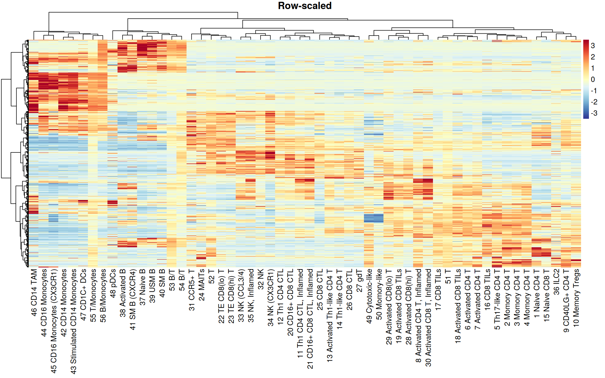
    


## Visualise first N cluster marker genes

Use `findMarkers` result from both directions. We aimed to present between 50 to 100 genes in the heatmap.


```R
nGene <- 4
geneNames <- sapply(marker.genes.cluster, function(x) rownames(x[1:nGene,]))
t(geneNames) # A matrix

geneNames <- unique(as.character(geneNames)) # Remove duplicated genes
cat(sprintf("Number of genes to plot: %d", length(geneNames)))
```


<table class="dataframe">
<caption>A matrix: 50 × 4 of type chr</caption>
<tbody>
	<tr><th scope=row>1</th><td>CCR7   </td><td>MAL   </td><td>LEF1    </td><td>CCL5   </td></tr>
	<tr><th scope=row>2</th><td>MAL    </td><td>CCL5  </td><td>CCR7    </td><td>CD28   </td></tr>
	<tr><th scope=row>3</th><td>CCR4   </td><td>MAL   </td><td>CD28    </td><td>SESN3  </td></tr>
	<tr><th scope=row>4</th><td>CCR4   </td><td>CCL5  </td><td>MAL     </td><td>RCAN3  </td></tr>
	<tr><th scope=row>5</th><td>MAL    </td><td>CR1   </td><td>CCR6    </td><td>CD4    </td></tr>
	<tr><th scope=row>6</th><td>CCL5   </td><td>CD4   </td><td>NKG7    </td><td>LTB    </td></tr>
	<tr><th scope=row>7</th><td>IL7R   </td><td>LTB   </td><td>CCL5    </td><td>CD4    </td></tr>
	<tr><th scope=row>8</th><td>ZC3HAV1</td><td>IFIT2 </td><td>PMAIP1  </td><td>OASL   </td></tr>
	<tr><th scope=row>9</th><td>CCL5   </td><td>NKG7  </td><td>CD4     </td><td>IL7R   </td></tr>
	<tr><th scope=row>10</th><td>CCL5   </td><td>NKG7  </td><td>CD28    </td><td>CD4    </td></tr>
	<tr><th scope=row>11</th><td>NKG7   </td><td>GNLY  </td><td>IFIT2   </td><td>GZMH   </td></tr>
	<tr><th scope=row>12</th><td>NKG7   </td><td>GNLY  </td><td>IRS2    </td><td>GZMH   </td></tr>
	<tr><th scope=row>13</th><td>GNLY   </td><td>NKG7  </td><td>CCL5    </td><td>FGFBP2 </td></tr>
	<tr><th scope=row>14</th><td>FGFBP2 </td><td>NKG7  </td><td>GNLY    </td><td>GZMH   </td></tr>
	<tr><th scope=row>15</th><td>CCL5   </td><td>NELL2 </td><td>NKG7    </td><td>EFHD2  </td></tr>
	<tr><th scope=row>16</th><td>NELL2  </td><td>CD8A  </td><td>CCL5    </td><td>EFHD2  </td></tr>
	<tr><th scope=row>17</th><td>NKG7   </td><td>EFHD2 </td><td>GNLY    </td><td>CCL5   </td></tr>
	<tr><th scope=row>18</th><td>CCL5   </td><td>ZEB2  </td><td>CD8A    </td><td>IL7R   </td></tr>
	<tr><th scope=row>19</th><td>CD8A   </td><td>CCL5  </td><td>GZMK    </td><td>GNLY   </td></tr>
	<tr><th scope=row>20</th><td>GNLY   </td><td>EFHD2 </td><td>NKG7    </td><td>GZMH   </td></tr>
	<tr><th scope=row>21</th><td>IFIT2  </td><td>PMAIP1</td><td>CCL5    </td><td>OASL   </td></tr>
	<tr><th scope=row>22</th><td>GNLY   </td><td>NELL2 </td><td>NKG7    </td><td>KLRD1  </td></tr>
	<tr><th scope=row>23</th><td>GZMH   </td><td>NKG7  </td><td>CCL5    </td><td>IL32   </td></tr>
	<tr><th scope=row>24</th><td>TSHZ1  </td><td>KAT5  </td><td>CCR7    </td><td>SELENOO</td></tr>
	<tr><th scope=row>25</th><td>CDKN1A </td><td>NKG7  </td><td>TRAPPC6A</td><td>LTB    </td></tr>
	<tr><th scope=row>26</th><td>NKG7   </td><td>GNLY  </td><td>CST7    </td><td>IRS2   </td></tr>
	<tr><th scope=row>27</th><td>GNLY   </td><td>KLRC3 </td><td>NKG7    </td><td>TRDC   </td></tr>
	<tr><th scope=row>28</th><td>NKG7   </td><td>CCL5  </td><td>CST7    </td><td>GNLY   </td></tr>
	<tr><th scope=row>29</th><td>CCL5   </td><td>DUSP2 </td><td>SLC7A5  </td><td>KLRB1  </td></tr>
	<tr><th scope=row>30</th><td>CCL5   </td><td>PMAIP1</td><td>NFKBIZ  </td><td>IFIT2  </td></tr>
	<tr><th scope=row>31</th><td>MYBL1  </td><td>PDZD4 </td><td>ADGRG1  </td><td>PFN1   </td></tr>
	<tr><th scope=row>32</th><td>GNLY   </td><td>NKG7  </td><td>CD5     </td><td>TRAC   </td></tr>
	<tr><th scope=row>33</th><td>NKG7   </td><td>SPON2 </td><td>IL2RB   </td><td>CST7   </td></tr>
	<tr><th scope=row>34</th><td>CD5    </td><td>GNLY  </td><td>NKG7    </td><td>IL7R   </td></tr>
	<tr><th scope=row>35</th><td>IL7R   </td><td>CD5   </td><td>IFIT2   </td><td>CD3E   </td></tr>
	<tr><th scope=row>36</th><td>CD6    </td><td>PYHIN1</td><td>CD5     </td><td>ADGRG1 </td></tr>
	<tr><th scope=row>37</th><td>CD74   </td><td>IGHD  </td><td>CD79A   </td><td>FCRL1  </td></tr>
	<tr><th scope=row>38</th><td>IGHM   </td><td>IGHD  </td><td>CD79A   </td><td>IRF8   </td></tr>
	<tr><th scope=row>39</th><td>IL32   </td><td>CD3E  </td><td>SAMD3   </td><td>CD79A  </td></tr>
	<tr><th scope=row>40</th><td>CD74   </td><td>BLK   </td><td>CD79A   </td><td>CD3E   </td></tr>
	<tr><th scope=row>41</th><td>CD74   </td><td>CD3E  </td><td>BCL11B  </td><td>CD79A  </td></tr>
	<tr><th scope=row>42</th><td>ZAP70  </td><td>CSF3R </td><td>CD3E    </td><td>TNFAIP2</td></tr>
	<tr><th scope=row>43</th><td>ZAP70  </td><td>TRAC  </td><td>CD3E    </td><td>IL32   </td></tr>
	<tr><th scope=row>44</th><td>IL32   </td><td>CCL5  </td><td>RHOH    </td><td>CD3E   </td></tr>
	<tr><th scope=row>45</th><td>SYNE2  </td><td>ETS1  </td><td>CD3E    </td><td>ZAP70  </td></tr>
	<tr><th scope=row>46</th><td>SPI1   </td><td>LYZ   </td><td>IFI30   </td><td>ZNF385A</td></tr>
	<tr><th scope=row>47</th><td>CD3E   </td><td>ZAP70 </td><td>BCL11B  </td><td>IL2RB  </td></tr>
	<tr><th scope=row>48</th><td>CCL5   </td><td>SYNE1 </td><td>KLRD1   </td><td>TBX21  </td></tr>
	<tr><th scope=row>49</th><td>B2M    </td><td>NKG7  </td><td>UBA52   </td><td>CCL5   </td></tr>
	<tr><th scope=row>50</th><td>B2M    </td><td>UBA52 </td><td>CD48    </td><td>EEF1G  </td></tr>
</tbody>
</table>


    Number of genes to plot: 77

Alternatively, use genes identified from up- and downregulated `findMarkers` results.


```R
#nGene <- 5
#geneNames1 <- sapply(marker.genes.cluster.up, function(x) rownames(x[1:nGene,]))
#geneNames1 # A matrix

#geneNames2 <- sapply(marker.genes.cluster.dn, function(x) rownames(x[1:nGene,]))
#geneNames2 # A matrix

#geneNames <- unique(c(as.character(geneNames1), as.character(geneNames2))) # Remove duplicated genes
#print(paste("Number of genes to plot:", length(geneNames)))
```


```R
p1 <- plotGroupedHeatmap(combined, features = geneNames, group = "label", clustering_method = "ward.D2", 
                         border_color = "black", color = c_heatmap_col1, fontsize = 12, angle_col = 90, 
                         main = "Unscaled", silent = T)

p2 <- plotGroupedHeatmap(combined, features = geneNames, group = "label", clustering_method = "ward.D2", 
                         border_color = "black", color = c_heatmap_col2, fontsize = 12, angle_col = 90,
                         center = TRUE, scale = TRUE, zlim = c(-3.5, 3.5), main = "Row-scaled", silent = T)

fig(width = 16, height = 18)
plot(p1$gtable)
plot(p2$gtable)
reset.fig()
```


    
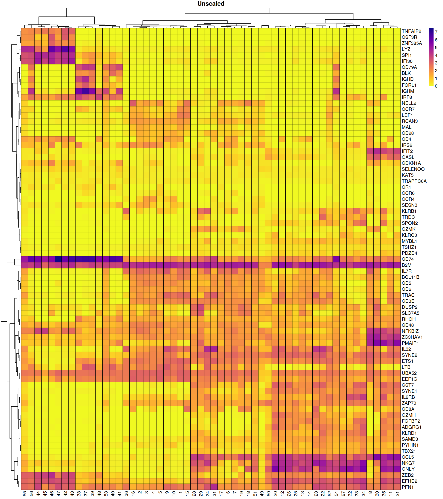
    


    
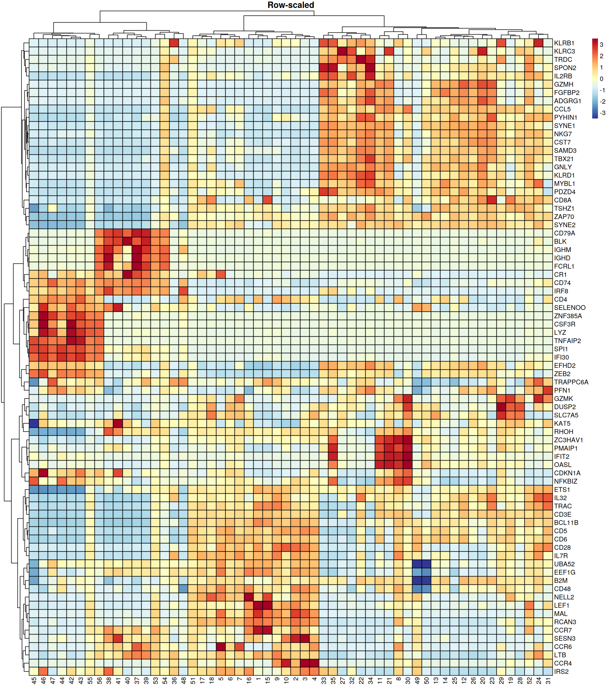
    


```R
fig(width = 16, height = 20)
plotDots(combined, features = geneNames[p2$tree_row$order], group = "label", zlim = c(-3.5, 3.5), 
         center = TRUE, scale = TRUE) + scale_size(limits = c(0, 1), range = c(0.1, 6)) + 
    scale_x_discrete(limits = p2$tree_col$labels[p2$tree_col$order]) + # order clusters based on heatmap p2 above
    scale_y_discrete(limits = rev(geneNames[p2$tree_row$order])) + # order genes based on heatmap p2 above
    guides(colour = guide_colourbar(title = "Row (Gene) Z-Score", barwidth = 10), 
           size = guide_legend(title = "Proportion Detected")) + theme_cowplot(16) + #coord_flip() +
    theme(panel.grid.major = element_line(colour = "gray90"), 
          axis.text.x = element_text(angle = 90, hjust = 1, vjust = 0.5), 
          legend.position = "top", legend.justification = "center", legend.title.position = "top") + 
    labs(x = "Cluster", y = "Genes")
reset.fig()
```

    Scale for size is already present.
    Adding another scale for size, which will replace the existing scale.


    
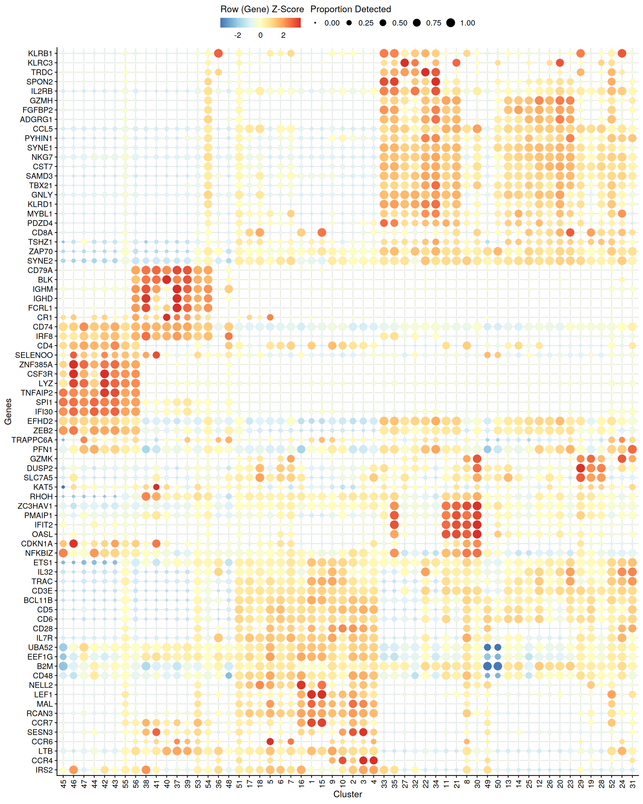
    


## Visualise first upregulated marker genes from each cluster


```R
geneNames <- sapply(marker.genes.cluster.up, function(x) rownames(x[1,]))
#geneNames

df <- data.frame(cluster = names(geneNames), gene = geneNames) %>% group_by(gene) %>% 
    summarise(cluster = paste(cluster, collapse = ",")) %>% 
    mutate(order = as.numeric(str_replace(cluster, ",.*", ""))) %>% arrange(order)
df

cat(sprintf("Number of genes to plot: %d", nrow(df)))
```


<table class="dataframe">
<caption>A tibble: 21 × 3</caption>
<thead>
	<tr><th scope=col>gene</th><th scope=col>cluster</th><th scope=col>order</th></tr>
	<tr><th scope=col>&lt;chr&gt;</th><th scope=col>&lt;chr&gt;</th><th scope=col>&lt;dbl&gt;</th></tr>
</thead>
<tbody>
	<tr><td>TCF7  </td><td>1                      </td><td> 1</td></tr>
	<tr><td>MAL   </td><td>2,5                    </td><td> 2</td></tr>
	<tr><td>CCR4  </td><td>3,4                    </td><td> 3</td></tr>
	<tr><td>IL7R  </td><td>6,7,17                 </td><td> 6</td></tr>
	<tr><td>IFIT2 </td><td>8                      </td><td> 8</td></tr>
	<tr><td>LTB   </td><td>9,10                   </td><td> 9</td></tr>
	<tr><td>GNLY  </td><td>11,13,20,27,32,50      </td><td>11</td></tr>
	<tr><td>CCL5  </td><td>12,18,21,23,26,28,29,30</td><td>12</td></tr>
	<tr><td>FGFBP2</td><td>14                     </td><td>14</td></tr>
	<tr><td>NELL2 </td><td>15,16                  </td><td>15</td></tr>
	<tr><td>CD8A  </td><td>19                     </td><td>19</td></tr>
	<tr><td>NKG7  </td><td>22,24,25,33,34,35      </td><td>22</td></tr>
	<tr><td>PFN1  </td><td>31                     </td><td>31</td></tr>
	<tr><td>KLRB1 </td><td>36                     </td><td>36</td></tr>
	<tr><td>CD74  </td><td>37,39,40,41,47         </td><td>37</td></tr>
	<tr><td>IGHM  </td><td>38                     </td><td>38</td></tr>
	<tr><td>CSF3R </td><td>42                     </td><td>42</td></tr>
	<tr><td>SPI1  </td><td>43,45,46               </td><td>43</td></tr>
	<tr><td>PSAP  </td><td>44                     </td><td>44</td></tr>
	<tr><td>ITM2C </td><td>48                     </td><td>48</td></tr>
	<tr><td>ZAP70 </td><td>49                     </td><td>49</td></tr>
</tbody>
</table>


    Number of genes to plot: 21


```R
p1 <- plotGroupedHeatmap(combined, features = df$gene, group = "label", clustering_method = "ward.D2", 
                         border_color = "black", color = c_heatmap_col1, fontsize = 12, angle_col = 90, 
                         main = "Unscaled", silent = T)

p2 <- plotGroupedHeatmap(combined, features = df$gene, group = "label", clustering_method = "ward.D2", 
                         border_color = "black", color = c_heatmap_col2, fontsize = 12, angle_col = 90,
                         center = TRUE, scale = TRUE, zlim = c(-3.5, 3.5), main = "Row-scaled", silent = T)

fig(width = 16, height = 7)
plot(p1$gtable)
plot(p2$gtable)
reset.fig()
```


    

    


    

    


```R
fig(width = 16, height = 7)
plotDots(combined, features = df$gene[p2$tree_row$order], group = "label", zlim = c(-3.5, 3.5), 
         center = TRUE, scale = TRUE) + scale_size(limits = c(0, 1), range = c(0.1, 6)) + 
    scale_x_discrete(limits = p2$tree_col$labels[p2$tree_col$order]) + # order clusters based on heatmap p2 above
    scale_y_discrete(limits = rev(df$gene[p2$tree_row$order])) + # order genes based on heatmap p2 above
    guides(colour = guide_colourbar(title = "Row (Gene) Z-Score", barwidth = 10), 
           size = guide_legend(title = "Proportion Detected")) + theme_cowplot(16) + #coord_flip() +
    theme(panel.grid.major = element_line(colour = "gray90"), 
          axis.text.x = element_text(angle = 90, hjust = 1, vjust = 0.5), 
          legend.position = "top", legend.justification = "center", legend.title.position = "top") + 
    labs(x = "Cluster", y = "Genes")
reset.fig()
```

    Scale for size is already present.
    Adding another scale for size, which will replace the existing scale.


    

    


```R
dimname <- "MNN-TSNE"

fig(width = 16, height = 15)
as.data.frame(reducedDim(combined, dimname)) %>% `colnames<-`(c("V1","V2")) %>%
    bind_cols(as_tibble(t(logcounts(combined[df$gene,])))) %>%
    gather(., key = "Symbol", value = "Expression", -c(V1, V2) ) %>% 
    mutate_at(vars(Symbol), factor) %>% mutate(Symbol = factor(Symbol, levels = df$gene)) %>%
    ggplot(aes(x = V1, y = V2, color = Expression)) + geom_point(size = 0.3, alpha = 0.3) + 
    facet_wrap(~ Symbol, ncol = 5, 
               labeller = as_labeller(function(x) paste0(df$cluster,": ", x))) + # add cluster id
    scale_color_viridis(option = "plasma", direction = -1) +
    theme_classic(base_size = 20) + labs(x = paste(dimname, "1"), y = paste(dimname, "2"))
reset.fig()
```


    

    


# 9 - DE analysis between conditions

## Prepare input

**Excluded celltypes and/or clusters**

*Assuming excluding 'Other T', 'ILC', 'DC', 'Unknown' and 'Doublets'*

- Cluster 31 CCR5+ T
- Cluster 36 ILC2
- Cluster 47 CD1C+ DCs
- Cluster 48 pDCs
- Cluster 49 Cytotoxic-like
- Cluster 50 Momory-like
- Clusters 51 to 56 Doublets


```R
table(combined$CellType_1, combined$Sample)
```


               
                Control1 KidneyCancer LungCancer
      CD4 T         5885        10418       6361
      CD8 T         3594         2497       2251
      gdT             11          898         99
      Other T        319           26         19
      NK            1991          275       1248
      ILC             36           21         17
      B             1560          626       1994
      Monocytes     3099          609        803
      DCs            377           46         14
      Unknown         98          550        454
      Doublets      1121          820        426


```R
table("Cells kept" = !combined$CellType_1 %in% c("Other T","ILC","DC","Unknown","Doublets"))

kept <- combined[,!combined$CellType_1 %in% c("Other T","ILC","DC","Unknown","Doublets")]
colData(kept) <- droplevels(colData(kept))

# remove whitespaces from CellType_1, which we'll use later
levels(kept$CellType_1) <- gsub("\\s*","", levels(kept$CellType_1))

# Remove genes not expressed at all
is.exp <- rowSums(counts(kept) > 0) > 1
table("Genes expressed" = is.exp)

kept <- kept[is.exp,]
kept
```


    Cells kept
    FALSE  TRUE 
     3907 44656 


    Genes expressed
    FALSE  TRUE 
     2186 15943 


    class: SingleCellExperiment 
    dim: 15943 44656 
    metadata(24): Control1_Samples Control1_cyclone ... findMarkers_Cluster_up findMarkers_Cluster_dn
    assays(2): counts logcounts
    rownames(15943): SAMD11 NOC2L ... MT-ND6 MT-CYB
    rowData names(6): ID Symbol ... is_mito is_hvg
    colnames(44656): Control1_AAACAAGCAACTAGTGACTTTAGG-1 Control1_AAACAAGCAGTTATCCACTTTAGG-1 ...
      LungCancer_TTTGTGAGTTGAGTCTAGCTGTGA-1 LungCancer_TTTGTGAGTTTACGACAGCTGTGA-1
    colData names(17): Sample Barcode ... ClusterCellType CellType_2
    reducedDimNames(6): PCA TSNE ... MNN-TSNE MNN-UMAP
    mainExpName: Gene Expression
    altExpNames(1): Antibody Capture


Create a `dgCMatrix` counts matrix for faster computation in some steps.


```R
kept_c <- as(counts(kept, withDimnames = TRUE), "dgCMatrix")
```

## Creating pseudo-bulk samples

We **sum** counts together from cells with the same combination of selected features. See [OSCA reference](https://bioconductor.org/books/3.22/OSCA.multisample/multi-sample-comparisons.html)

<div class="alert alert-warning">
    <strong>Warning!</strong> Change the <code>"ids" DataFrame</code> to include the factors where the unique combination of levels is used to define a group.
</div>

### Example 1: aggregate expression data across cells from the same sample (for PCA)


```R
summed0 <- aggregateAcrossCells(kept, id = colData(kept)[,c("Sample")], BPPARAM = SerialParam())
colData(summed0) <- droplevels(colData(summed0))
sizeFactors(summed0) <- NULL
summed0 <- logNormCounts(summed0) # Add logcounts
summed0
```


    class: SingleCellExperiment 
    dim: 15943 3 
    metadata(24): Control1_Samples Control1_cyclone ... findMarkers_Cluster_up findMarkers_Cluster_dn
    assays(2): counts logcounts
    rownames(15943): SAMD11 NOC2L ... MT-ND6 MT-CYB
    rowData names(6): ID Symbol ... is_mito is_hvg
    colnames(3): Control1 KidneyCancer LungCancer
    colData names(19): Sample Barcode ... ncells sizeFactor
    reducedDimNames(6): PCA TSNE ... MNN-TSNE MNN-UMAP
    mainExpName: Gene Expression
    altExpNames(0):


### Example 2: aggregate expression data across cells from the same sample and coarse cell type (for DEA)


```R
summed <- aggregateAcrossCells(kept, id = colData(kept)[,c("Sample","CellType_1")], BPPARAM = SerialParam())

# Remove pseudobulk with 1 cell
if(sum(!summed$ncells > 1) > 0) summed <- summed[,summed$ncells > 1,]

colData(summed) <- droplevels(colData(summed))
sizeFactors(summed) <- NULL
summed <- logNormCounts(summed) # Add logcounts
summed
```


    class: SingleCellExperiment 
    dim: 15943 21 
    metadata(24): Control1_Samples Control1_cyclone ... findMarkers_Cluster_up findMarkers_Cluster_dn
    assays(2): counts logcounts
    rownames(15943): SAMD11 NOC2L ... MT-ND6 MT-CYB
    rowData names(6): ID Symbol ... is_mito is_hvg
    colnames: NULL
    colData names(20): Sample Barcode ... ncells sizeFactor
    reducedDimNames(6): PCA TSNE ... MNN-TSNE MNN-UMAP
    mainExpName: Gene Expression
    altExpNames(0):


### Add column names to `summed`

<div class="alert alert-warning">
    <strong>Warning!</strong> Very important to define the column name of the <code>summed</code> object, i.e. a unique ID for each pseudo-bulk sample in <code>colData</code>. This is so that the <code>DGEList</code> object in the following edgeR analysis is created with the approprate row names for the <code>samples</code> slot.
</div>


```R
summed$PseudoSample <- paste(summed$Sample, summed$CellType_1, sep = "_")
summed$PseudoSample <- as.factor(summed$PseudoSample)
summed$PseudoSample <- factor(summed$PseudoSample, levels = gtools::mixedsort(levels(summed$PseudoSample)))
colnames(summed) <- summed$PseudoSample
```

### Save pseudobulk raw counts and logcounts


```R
# raw counts 
as.data.frame(counts(summed)) %>% rownames_to_column("ID") %>% head(5)
outfile <- paste0(file_id, "_pseudobulk_rawcounts.tsv")
cat(sprintf("Write to file: %s\n", outfile))
write.table(as.data.frame(counts(summed)) %>% rownames_to_column("ID"), 
            file = outfile, sep = "\t", quote = F, row.names = F, col.names = T)

# logcounts
as.data.frame(logcounts(summed)) %>% rownames_to_column("ID") %>% head(5)
outfile <- paste0(file_id, "_pseudobulk_logcounts.tsv")
cat(sprintf("Write to file: %s\n", outfile))
write.table(as.data.frame(logcounts(summed)) %>% rownames_to_column("ID"), 
            file = outfile, sep = "\t", quote = F, row.names = F, col.names = T)
```


<table class="dataframe">
<caption>A data.frame: 5 × 22</caption>
<thead>
	<tr><th></th><th scope=col>ID</th><th scope=col>Control1_CD4T</th><th scope=col>Control1_CD8T</th><th scope=col>Control1_gdT</th><th scope=col>Control1_NK</th><th scope=col>Control1_B</th><th scope=col>Control1_Monocytes</th><th scope=col>Control1_DCs</th><th scope=col>KidneyCancer_CD4T</th><th scope=col>KidneyCancer_CD8T</th><th scope=col>⋯</th><th scope=col>KidneyCancer_B</th><th scope=col>KidneyCancer_Monocytes</th><th scope=col>KidneyCancer_DCs</th><th scope=col>LungCancer_CD4T</th><th scope=col>LungCancer_CD8T</th><th scope=col>LungCancer_gdT</th><th scope=col>LungCancer_NK</th><th scope=col>LungCancer_B</th><th scope=col>LungCancer_Monocytes</th><th scope=col>LungCancer_DCs</th></tr>
	<tr><th></th><th scope=col>&lt;chr&gt;</th><th scope=col>&lt;dbl&gt;</th><th scope=col>&lt;dbl&gt;</th><th scope=col>&lt;dbl&gt;</th><th scope=col>&lt;dbl&gt;</th><th scope=col>&lt;dbl&gt;</th><th scope=col>&lt;dbl&gt;</th><th scope=col>&lt;dbl&gt;</th><th scope=col>&lt;dbl&gt;</th><th scope=col>&lt;dbl&gt;</th><th scope=col>⋯</th><th scope=col>&lt;dbl&gt;</th><th scope=col>&lt;dbl&gt;</th><th scope=col>&lt;dbl&gt;</th><th scope=col>&lt;dbl&gt;</th><th scope=col>&lt;dbl&gt;</th><th scope=col>&lt;dbl&gt;</th><th scope=col>&lt;dbl&gt;</th><th scope=col>&lt;dbl&gt;</th><th scope=col>&lt;dbl&gt;</th><th scope=col>&lt;dbl&gt;</th></tr>
</thead>
<tbody>
	<tr><th scope=row>1</th><td>SAMD11 </td><td>   0</td><td>   0</td><td>0</td><td>  0</td><td>  0</td><td>   0</td><td>  0</td><td>   1</td><td>  0</td><td>⋯</td><td>  0</td><td>  4</td><td> 0</td><td>   2</td><td>  0</td><td> 0</td><td>  0</td><td>  2</td><td>  1</td><td>0</td></tr>
	<tr><th scope=row>2</th><td>NOC2L  </td><td>1630</td><td>1075</td><td>3</td><td>672</td><td>456</td><td>1320</td><td>210</td><td>2019</td><td>611</td><td>⋯</td><td>169</td><td>223</td><td>27</td><td>1695</td><td>669</td><td>26</td><td>437</td><td>565</td><td>310</td><td>8</td></tr>
	<tr><th scope=row>3</th><td>KLHL17 </td><td> 398</td><td> 234</td><td>0</td><td>178</td><td> 97</td><td> 312</td><td> 42</td><td> 287</td><td> 54</td><td>⋯</td><td> 19</td><td> 35</td><td> 1</td><td> 391</td><td>139</td><td> 4</td><td> 99</td><td> 74</td><td> 85</td><td>0</td></tr>
	<tr><th scope=row>4</th><td>PLEKHN1</td><td>  97</td><td>  37</td><td>1</td><td> 27</td><td>  2</td><td>  82</td><td>  8</td><td> 146</td><td> 22</td><td>⋯</td><td>  0</td><td> 35</td><td> 0</td><td>  94</td><td> 20</td><td> 0</td><td>  8</td><td>  2</td><td> 21</td><td>0</td></tr>
	<tr><th scope=row>5</th><td>PERM1  </td><td>   1</td><td>   1</td><td>0</td><td>  0</td><td>  0</td><td>   0</td><td>  1</td><td>   3</td><td>  1</td><td>⋯</td><td>  0</td><td>  0</td><td> 0</td><td>  26</td><td>  3</td><td> 0</td><td> 14</td><td>  4</td><td>  5</td><td>0</td></tr>
</tbody>
</table>


    Write to file: 160k_All_pseudobulk_rawcounts.tsv


<table class="dataframe">
<caption>A data.frame: 5 × 22</caption>
<thead>
	<tr><th></th><th scope=col>ID</th><th scope=col>Control1_CD4T</th><th scope=col>Control1_CD8T</th><th scope=col>Control1_gdT</th><th scope=col>Control1_NK</th><th scope=col>Control1_B</th><th scope=col>Control1_Monocytes</th><th scope=col>Control1_DCs</th><th scope=col>KidneyCancer_CD4T</th><th scope=col>KidneyCancer_CD8T</th><th scope=col>⋯</th><th scope=col>KidneyCancer_B</th><th scope=col>KidneyCancer_Monocytes</th><th scope=col>KidneyCancer_DCs</th><th scope=col>LungCancer_CD4T</th><th scope=col>LungCancer_CD8T</th><th scope=col>LungCancer_gdT</th><th scope=col>LungCancer_NK</th><th scope=col>LungCancer_B</th><th scope=col>LungCancer_Monocytes</th><th scope=col>LungCancer_DCs</th></tr>
	<tr><th></th><th scope=col>&lt;chr&gt;</th><th scope=col>&lt;dbl&gt;</th><th scope=col>&lt;dbl&gt;</th><th scope=col>&lt;dbl&gt;</th><th scope=col>&lt;dbl&gt;</th><th scope=col>&lt;dbl&gt;</th><th scope=col>&lt;dbl&gt;</th><th scope=col>&lt;dbl&gt;</th><th scope=col>&lt;dbl&gt;</th><th scope=col>&lt;dbl&gt;</th><th scope=col>⋯</th><th scope=col>&lt;dbl&gt;</th><th scope=col>&lt;dbl&gt;</th><th scope=col>&lt;dbl&gt;</th><th scope=col>&lt;dbl&gt;</th><th scope=col>&lt;dbl&gt;</th><th scope=col>&lt;dbl&gt;</th><th scope=col>&lt;dbl&gt;</th><th scope=col>&lt;dbl&gt;</th><th scope=col>&lt;dbl&gt;</th><th scope=col>&lt;dbl&gt;</th></tr>
</thead>
<tbody>
	<tr><th scope=row>1</th><td>SAMD11 </td><td>0.0000000</td><td>0.0000000</td><td>0.000000</td><td>0.000000</td><td>0.000000</td><td>0.000000</td><td>0.000000</td><td>0.2721442</td><td>0.0000000</td><td>⋯</td><td>0.000000</td><td>3.537714</td><td>0.000000</td><td>0.6778346</td><td>0.000000</td><td>0.000000</td><td>0.000000</td><td>1.701644</td><td>1.410354</td><td>0.000000</td></tr>
	<tr><th scope=row>2</th><td>NOC2L  </td><td>9.6012212</td><td>9.6524954</td><td>9.629720</td><td>9.620244</td><td>9.716937</td><td>9.446666</td><td>9.414583</td><td>8.7147503</td><td>9.0696889</td><td>⋯</td><td>9.134793</td><td>9.211146</td><td>9.401391</td><td>8.9923067</td><td>9.158869</td><td>8.941715</td><td>9.342009</td><td>9.316036</td><td>9.008394</td><td>9.232259</td></tr>
	<tr><th scope=row>3</th><td>KLHL17 </td><td>7.5729279</td><td>7.4591675</td><td>0.000000</td><td>7.708738</td><td>7.490291</td><td>7.372410</td><td>7.101086</td><td>5.9208070</td><td>5.5969795</td><td>⋯</td><td>6.001962</td><td>6.552545</td><td>4.700932</td><td>6.8856788</td><td>6.901540</td><td>6.257323</td><td>7.207446</td><td>6.398323</td><td>7.149057</td><td>0.000000</td></tr>
	<tr><th scope=row>4</th><td>PLEKHN1</td><td>5.5595387</td><td>4.8412609</td><td>8.048395</td><td>5.025954</td><td>2.228574</td><td>5.468777</td><td>4.752752</td><td>4.9685418</td><td>4.3442403</td><td>⋯</td><td>0.000000</td><td>6.552545</td><td>0.000000</td><td>4.8672853</td><td>4.174597</td><td>0.000000</td><td>3.685061</td><td>1.701644</td><td>5.162634</td><td>0.000000</td></tr>
	<tr><th scope=row>5</th><td>PERM1  </td><td>0.5615872</td><td>0.8054786</td><td>0.000000</td><td>0.000000</td><td>0.000000</td><td>0.000000</td><td>2.085767</td><td>0.6984886</td><td>0.9090475</td><td>⋯</td><td>0.000000</td><td>0.000000</td><td>0.000000</td><td>3.1369426</td><td>1.831373</td><td>0.000000</td><td>4.443525</td><td>2.460855</td><td>3.215698</td><td>0.000000</td></tr>
</tbody>
</table>


    Write to file: 160k_All_pseudobulk_logcounts.tsv


## Create PCA (using functions from `DESeq2`)

### Create a `DESeqDataSet` object


```R
dds0 <- DESeqDataSetFromMatrix(countData = counts(summed0), 
                               colData = droplevels(colData(summed0)[, c("Sample","condition")]), 
                               rowData = rowData(summed0), design = ~1) # no DE
dds0 <- estimateSizeFactors(dds0)
```

    converting counts to integer mode
    


### Apply transformation


```R
# 'regularized log' transformation
rld0 <- rlog(dds0)

# variance stabilizing transformation
vst0 <- vst(dds0)
```

### Run PCA


```R
pca_rld <- plotPCA(rld0, intgroup = c("condition"), ntop = 500, returnData = TRUE)
pca_vst <- plotPCA(vst0, intgroup = c("condition"), ntop = 500, returnData = TRUE)
pcaVar_rld <- round(100 * attr(pca_rld, "percentVar"))
pcaVar_vst <- round(100 * attr(pca_vst, "percentVar"))
```

    using ntop=500 top features by variance
    
    using ntop=500 top features by variance
    


```R
p_pca_rld <- ggplot(pca_rld, aes(PC1, PC2, color = condition, shape = condition, label = name)) + 
    geom_point(size = 4) + scale_color_manual(values = c_cond_col) + theme_bw(18) + 
    ggrepel::geom_text_repel(size = 5, seed = 42, box.padding = 1, max.overlaps = Inf) +
    xlab(paste0("PC1: ", pcaVar_rld[1], "% variance")) + ylab(paste0("PC2: ", pcaVar_rld[2], "% variance")) +
    ggtitle("PCA", subtitle = "rlog")

p_pca_vst <- ggplot(pca_vst, aes(PC1, PC2, color = condition, shape = condition, label = name)) + 
    geom_point(size = 4) + scale_color_manual(values = c_cond_col) + theme_bw(18) +
    ggrepel::geom_text_repel(size = 5, seed = 42, box.padding = 1, max.overlaps = Inf) +
    xlab(paste0("PC1: ", pcaVar_vst[1], "% variance")) + ylab(paste0("PC2: ", pcaVar_vst[2], "% variance")) +
    ggtitle("PCA", subtitle = "VST")

fig(width = 16, height = 7)
plot_grid(p_pca_rld, p_pca_vst)
reset.fig()
```


    

    


## Perform DE analysis between conditions

[DESeq2](https://bioconductor.org/packages/release/bioc/html/DESeq2.html) or [edgeR](https://bioconductor.org/packages/release/bioc/html/edgeR.html): For data with a high level of multimodality (data heterogeneity) methods that consider the behavior of each individual gene, such as DESeq2 show better true positive rates (sensitivities). If the level of multimodality is low, however, edgeR can provide higher precision. [Reference](https://bmcbioinformatics.biomedcentral.com/articles/10.1186/s12859-019-2599-6)

Here we use edgeR to perform DE analysis.

### Create DGEList data object

<div class="alert alert-warning">
    <strong>Warning!</strong> Change the information to be added to the <code>samples</code> slot.
</div>


```R
y <- DGEList(counts(summed), samples = colData(summed)[,c("PseudoSample","ncells","condition","CellType_1")], 
             genes = rowData(summed)[,c("ID","Symbol")])

# Removing sample that have very few or lowly-sequenced cells
# In this case, we remove combinations containing fewer than 10 cells
discarded <- y$samples$ncells < 10
y <- y[,!discarded]
summary(discarded)
```


       Mode   FALSE 
    logical      21 


### Set design matrix

Read more about design matrices with and without intercept term [here](https://bioconductor.org/packages/release/workflows/vignettes/RNAseq123/inst/doc/designmatrices.html#design-matrices-with-and-without-intercept-term), and ordering of terms in the `model.matrix` when using `0+` in the model formula [here](https://support.bioconductor.org/p/110327/#110379).


```R
my.design <- model.matrix(~ 0 + y$samples$condition + y$samples$CellType_1, y$samples)

colnames(my.design) <- gsub("y\\$samples\\$", "", colnames(my.design)) # simplify term name
data.frame(coef = 1:ncol(my.design), term = colnames(my.design))
```


<table class="dataframe">
<caption>A data.frame: 8 × 2</caption>
<thead>
	<tr><th scope=col>coef</th><th scope=col>term</th></tr>
	<tr><th scope=col>&lt;int&gt;</th><th scope=col>&lt;chr&gt;</th></tr>
</thead>
<tbody>
	<tr><td>1</td><td>conditionControl   </td></tr>
	<tr><td>2</td><td>conditionCancer    </td></tr>
	<tr><td>3</td><td>CellType_1CD8T     </td></tr>
	<tr><td>4</td><td>CellType_1gdT      </td></tr>
	<tr><td>5</td><td>CellType_1NK       </td></tr>
	<tr><td>6</td><td>CellType_1B        </td></tr>
	<tr><td>7</td><td>CellType_1Monocytes</td></tr>
	<tr><td>8</td><td>CellType_1DCs      </td></tr>
</tbody>
</table>


### Construct contrast vector using `makeContrasts` to make comparison easier


```R
my.contrasts <- makeContrasts(
    Cancer_Control = conditionCancer-conditionControl,
    levels = my.design
)
```

### Remove lowly expressed genes


```R
# Use the filterByExpr() function from edgeR
keep <- filterByExpr(y, design = my.design, group = NULL)
y <- y[keep, , keep.lib.sizes = FALSE]
summary(keep)

# Correct for composition biases by computing normalization factors
y <- calcNormFactors(y)
DataFrame(y$samples)
```


       Mode   FALSE    TRUE 
    logical    3306   12637 


    DataFrame with 21 rows and 7 columns
                            group  lib.size norm.factors         PseudoSample    ncells condition CellType_1
                         <factor> <numeric>    <numeric>             <factor> <integer>  <factor>   <factor>
    Control1_CD4T               1  24411788      1.21950        Control1_CD4T      5885   Control       CD4T
    Control1_CD8T               1  15537400      1.23391        Control1_CD8T      3594   Control       CD8T
    Control1_gdT                1     44067      1.32266        Control1_gdT         11   Control       gdT 
    Control1_NK                 1   9933259      1.13968        Control1_NK        1991   Control       NK  
    Control1_B                  1   6302074      1.12315        Control1_B         1560   Control       B   
    ...                       ...       ...          ...                  ...       ...       ...        ...
    LungCancer_gdT              1    615719     1.030239 LungCancer_gdT              99    Cancer  gdT      
    LungCancer_NK               1   7836365     0.997810 LungCancer_NK             1248    Cancer  NK       
    LungCancer_B                1  10313343     0.927861 LungCancer_B              1994    Cancer  B        
    LungCancer_Monocytes        1   7007577     0.650301 LungCancer_Monocytes       803    Cancer  Monocytes
    LungCancer_DCs              1    154761     1.101338 LungCancer_DCs              14    Cancer  DCs      


### Create multi-dimensional scaling (MDS) plot


```R
fig(width = 8, height = 8)
limma::plotMDS(cpm(y, log = TRUE), col = str_replace_all(y$samples$condition, c_cond_col),
        main = "PCoA", cex.main = 2, cex.lab = 1.5, cex.axis = 1.5, cex = 1)
reset.fig()
```


    

    


### Estimating the dispersions


```R
y <- estimateDisp(y, my.design)
summary(y$trended.dispersion)

# Visualise dispersion estimates
fig(width = 8, height = 8)
plotBCV(y, cex.main = 1.5, cex.lab = 1.5, cex.axis = 1.5, cex = 0.5, 
        main = "Show common, trended and genewise BCV estimates")
reset.fig()
```


       Min. 1st Qu.  Median    Mean 3rd Qu.    Max. 
    0.08490 0.08681 0.10044 0.14073 0.17957 0.31438 


    

    


### Estimating the quasi-likelihood (QL) dispersions


```R
fit <- glmQLFit(y, my.design, robust = TRUE)

# Visualise QL dispersion estimates
fig(width = 8, height = 8)
plotQLDisp(fit, cex.main = 1.5, cex.lab = 1.5, cex.axis = 1.5, cex = 0.5, 
           main = "Show common, trended and genewise QL dispersion estimates")
reset.fig()
```


    

    


### Performs QL F-test to determine DE genes

#### DE: Cancer vs. Control


```R
res <- glmQLFTest(fit, contrast = my.contrasts[,"Cancer_Control"])

# Print the total number of differentially expressed genes at 5% FDR
summary(decideTests(res))

# Print top 10 DE genes
topTags(res)

# Output DE results to text file
outfile <- paste0(file_id, "_edgeR_DE_results_Cancer_vs_Ctrl.tsv")
cat(sprintf("Write to file: %s\n", outfile))
write.table(topTags(res, n = nrow(res), sort.by = "PValue", adjust.method = "BH"), file = outfile, 
            sep = "\t", quote = F, row.names = F, col.names = T)
```


           -1*conditionControl 1*conditionCancer
    Down                                    3842
    NotSig                                  5357
    Up                                      3438


<dl>
	<dt>$table</dt>
		<dd><table class="dataframe">
<caption>A data.frame: 10 × 7</caption>
<thead>
	<tr><th></th><th scope=col>ID</th><th scope=col>Symbol</th><th scope=col>logFC</th><th scope=col>logCPM</th><th scope=col>F</th><th scope=col>PValue</th><th scope=col>FDR</th></tr>
	<tr><th></th><th scope=col>&lt;chr&gt;</th><th scope=col>&lt;chr&gt;</th><th scope=col>&lt;dbl&gt;</th><th scope=col>&lt;dbl&gt;</th><th scope=col>&lt;dbl&gt;</th><th scope=col>&lt;dbl&gt;</th><th scope=col>&lt;dbl&gt;</th></tr>
</thead>
<tbody>
	<tr><th scope=row>TNFAIP8L2</th><td>ENSG00000163154</td><td>TNFAIP8L2</td><td>-3.893381</td><td>4.255640</td><td>381.0841</td><td>5.085345e-16</td><td>6.426351e-12</td></tr>
	<tr><th scope=row>MRM1</th><td>ENSG00000278619</td><td>MRM1     </td><td>-3.268926</td><td>2.975402</td><td>304.7418</td><td>2.090110e-14</td><td>1.320636e-10</td></tr>
	<tr><th scope=row>ATP5PO</th><td>ENSG00000241837</td><td>ATP5PO   </td><td> 7.175390</td><td>4.443825</td><td>309.8802</td><td>4.940538e-14</td><td>2.081119e-10</td></tr>
	<tr><th scope=row>BTG3</th><td>ENSG00000154640</td><td>BTG3     </td><td> 3.287545</td><td>6.298608</td><td>332.6967</td><td>6.844982e-14</td><td>2.162501e-10</td></tr>
	<tr><th scope=row>ZNF644</th><td>ENSG00000122482</td><td>ZNF644   </td><td> 2.037535</td><td>9.077450</td><td>378.9496</td><td>1.147022e-13</td><td>2.814202e-10</td></tr>
	<tr><th scope=row>RLF</th><td>ENSG00000117000</td><td>RLF      </td><td> 2.447651</td><td>6.938956</td><td>341.2939</td><td>1.336173e-13</td><td>2.814202e-10</td></tr>
	<tr><th scope=row>YTHDF3</th><td>ENSG00000185728</td><td>YTHDF3   </td><td> 2.319240</td><td>7.908604</td><td>326.7704</td><td>3.228917e-13</td><td>5.146430e-10</td></tr>
	<tr><th scope=row>MED11</th><td>ENSG00000161920</td><td>MED11    </td><td>-2.319510</td><td>4.339582</td><td>254.8826</td><td>3.258008e-13</td><td>5.146430e-10</td></tr>
	<tr><th scope=row>ETF1</th><td>ENSG00000120705</td><td>ETF1     </td><td> 2.540475</td><td>6.260216</td><td>266.1423</td><td>5.087989e-13</td><td>7.144102e-10</td></tr>
	<tr><th scope=row>PSMB10</th><td>ENSG00000205220</td><td>PSMB10   </td><td>-1.812290</td><td>7.799128</td><td>311.8240</td><td>6.183726e-13</td><td>7.814374e-10</td></tr>
</tbody>
</table>
</dd>
	<dt>$adjust.method</dt>
		<dd>'BH'</dd>
	<dt>$comparison</dt>
		<dd>'-1*conditionControl 1*conditionCancer'</dd>
	<dt>$test</dt>
		<dd>'glm'</dd>
</dl>


    Write to file: 160k_All_edgeR_DE_results_Cancer_vs_Ctrl.tsv


### Save DE results to `metadata`

<div class="alert alert-info">
    <strong>Tip!</strong> In the accompanied Shiny App, it will look for list(s) named with "edgeR_" in the prefix in <code>metadata()</code> and show their content under the <u>DEA (edgeR)</u> section of the website. In the example below, the content of the 3 <code>TopTags</code> objects will be displayed in the <u>Condition</u> sub-menu.
</div>


```R
metadata(combined)[['edgeR_Cancer_Control']] <- list("Cancer_Control" = res)
```

## Visualise first N condition DE genes

#### Vis: Cancer vs. Control


```R
nGene <- 50
geneNames <- rownames(topTags(res, nGene))
geneNames
```


<style>
.list-inline {list-style: none; margin:0; padding: 0}
.list-inline>li {display: inline-block}
.list-inline>li:not(:last-child)::after {content: "\00b7"; padding: 0 .5ex}
</style>
<ol class=list-inline><li>'TNFAIP8L2'</li><li>'MRM1'</li><li>'ATP5PO'</li><li>'BTG3'</li><li>'ZNF644'</li><li>'RLF'</li><li>'YTHDF3'</li><li>'MED11'</li><li>'ETF1'</li><li>'PSMB10'</li><li>'UBXN2A'</li><li>'GNA13'</li><li>'PYCR2'</li><li>'SUCO'</li><li>'CENPC'</li><li>'GBP1'</li><li>'CDK17'</li><li>'MAPK6'</li><li>'DNAJC2'</li><li>'HNRNPK'</li><li>'GIMAP8'</li><li>'NAP1L2'</li><li>'DCP1A'</li><li>'EIF4G2'</li><li>'GIMAP6'</li><li>'GIMAP5'</li><li>'GIMAP4'</li><li>'KRR1'</li><li>'COQ10B'</li><li>'DOK1'</li><li>'DHX9'</li><li>'ZNF691'</li><li>'RNF139'</li><li>'SOCS5'</li><li>'ELL2'</li><li>'TRIM5'</li><li>'METTL13'</li><li>'AARS1'</li><li>'PPP4R3A'</li><li>'UBQLN1'</li><li>'RPRD1B'</li><li>'ZNF283'</li><li>'ADNP2'</li><li>'NDUFAF1'</li><li>'RLIM'</li><li>'ZNF639'</li><li>'MYOF'</li><li>'HIF1A'</li><li>'ZNF786'</li><li>'ZNF331'</li></ol>


Using `summed` pseudo-bulk samples to create heatmap.


```R
logexp <- logcounts(summed)[geneNames,] # logcounts

expr <- data.frame(Group = summed$PseudoSample, t(logexp)) %>% group_by(Group) %>% 
    data.frame %>% column_to_rownames("Group") %>% t()

ann_col <- data.frame(Sample = summed$Sample, Condition = summed$condition, row.names = colnames(expr))
condition_colors <- list(Sample = c_sample_col, Condition = c_cond_col)

p <- pheatmap(expr, scale = "row", clustering_method = "ward.D2", cluster_cols = TRUE,
              border_color = NA, fontsize = 12, angle_col = 45, color = c_heatmap_col2, breaks = breaks,
              annotation_col = ann_col, annotation_colors = condition_colors,
              main = "Row-scaled 'summed' logcounts", silent = T)

fig(width = 16, height = 15)
plot(p$gtable)
reset.fig()
```


    

    


Using `kept` filtered single cells to create dot plot.

Assuming we are interested in looking at cells grouped by both Sample ID and Coarse Cell Type (i.e. the pseudobulk samples). Let's first define the `PseudoSample` groupings in the `kept` object.


```R
kept$Group <- as.factor(paste0(kept$Sample, "_", kept$CellType_1))
kept$Group <- factor(kept$Group, levels = as.vector(outer(levels(kept$Sample), 
                                                          paste0("_", levels(kept$CellType_1)), paste0)))
#levels(kept$Group)
```


```R
fig(width = 14, height = 16)
plotDots(kept, features = geneNames[p$tree_row$order], group = "Group", 
         center = TRUE, scale = TRUE, zlim = c(-3.5, 3.5)) + scale_size(limits = c(0, 1), range = c(0.1, 6)) + 
    scale_x_discrete(limits = p$tree_col$labels[p$tree_col$order]) + # order groups based on heatmap p above
    scale_y_discrete(limits = rev(geneNames[p$tree_row$order])) + # order genes based on heatmap p above
    guides(colour = guide_colourbar(title = "Row (Gene) Z-Score", barwidth = 10), 
           size = guide_legend(title = "Proportion Detected")) + theme_cowplot(16) + #coord_flip() + 
    theme(panel.grid.major = element_line(colour = "gray90"), 
          axis.text.x = element_text(angle = 45, hjust = 1, vjust = 1), 
          legend.position = "top", legend.justification = "center", legend.title.position = "top") + 
    labs(title = "Cancer vs. Control", x = "Group", y ="Genes")
reset.fig()
```

    Scale for size is already present.
    Adding another scale for size, which will replace the existing scale.


    

    


# 10 - DE analysis between conditions in each cluster/cell type

When there is no true biological replicates in the experimental design, it is still possible to perform DE analysis.

For such analysis, as shown here, each cell is consider *a sample*. [DESeq2](https://bioconductor.org/packages/release/bioc/html/DESeq2.html) and [glmGamPoi](https://bioconductor.org/packages/release/bioc/html/glmGamPoi.html) are used to fit the gene-wise dispersion, its trend and calculate the MAP based on the quasi-likelihood framework for single-cell data. See [recommendations for single-cell analysis](https://bioconductor.org/packages/release/bioc/vignettes/DESeq2/inst/doc/DESeq2.html#recommendations-for-single-cell-analysis) for more information.

> If **glmGamPoi** is used in published research, please cite:
    Ahlmann-Eltze, C., Huber, W. (2020) glmGamPoi: Fitting Gamma-Poisson
    Generalized Linear Models on Single Cell Count Data. Bioinformatics.
    https://doi.org/10.1093/bioinformatics/btaa1009
    
<div class="alert alert-info">
    <strong>Tip!</strong> When there are biological replicates, it is typically better to perform DE analysis on "pseudo-bulk" expression profiles. Please alter your analysis accordingly.
</div>


```R
# Use previously prepared input
table(kept$CellType_1, kept$Sample)
```


               
                Control1 KidneyCancer LungCancer
      CD4T          5885        10418       6361
      CD8T          3594         2497       2251
      gdT             11          898         99
      NK            1991          275       1248
      B             1560          626       1994
      Monocytes     3099          609        803
      DCs            377           46         14


## Performs likelihood ratio test (LRT) using `DESeq2`

LRT test is testing whether the term(s) removed in the 'reduced' model explains a significant amount of variation in the data. The LRT p-values are determined solely by the difference in deviance between the 'full' and 'reduced' model formula, i.e. p-values is identical in all contrasts. The test statistic and p-values may involve the testing of one or more log2 fold changes.

If the adjusted p-value (`padj`) is small, then for the set of genes with those small adjusted p-values, the additional coefficient in 'full' and not in 'reduced' increased the log likelihood more than would be expected if their true value was zero.

**Define thresholds, variable of interest and include unwanted variation present in the data**


```R
minCell <- 10 # Ignore clusters that have fewer than 10 cells in test and reference conditions
padj_cutoff <- 0.05 # FDR threshold

test <- "condition"

full <- ~ condition # full model
reduced <- ~ 1 # reduced model
```


```R
outputRes <- function(dds, test = "condition", ref = NULL, old_ref = NULL) {
    # Build results tables
    res <- list()
    freq <- data.frame(table(colData(dds)[,test]))
    ref <- if(is.null(ref)) levels(colData(dds)[,test])[1] else ref
    t <- NULL
    for(j in resultsNames(dds)) {
        if(grepl(test, j)) {
            t <- sub(test, "", j)
            if(!is.null(old_ref) && t == old_ref) next
            
            if(freq$Freq[freq$Var1 == ref] >= minCell & freq$Freq[freq$Var1 == t] >= minCell) {
                resultsname <- j
            } else next
        } else next
        
        id <- paste0(t, "_vs_", ref)
        title <- paste0(t, "_vs_", ref, "_", i)
        message(paste(t, "vs.", ref, "in Cluster", i))

        res[[id]] <- results(dds, name = resultsname, alpha = padj_cutoff)
        res[[id]]$ID <- mcols(dds)$ID
        res[[id]]$Symbol <- mcols(dds)$Symbol
        slot(mcols(res[[id]]), "listData")$type <- c(slot(mcols(res[[id]]), "listData")$type[1:6], 
                                                     "annotation", "annotation")
        slot(mcols(res[[id]]), "listData")$description <- c(slot(mcols(res[[id]]), "listData")$description[1:6], 
                                                            "ID", "Symbol")
        res[[id]]<- res[[id]][,c(7,8,1:6)]

        # Print the total number of DEGs at defined FDR threshold
        print(summary(res[[id]]))
    
        # Print top 10 genes, ordered by FDR then p-values
        df <- as.data.frame(res[[id]]) %>% arrange(padj, pvalue)
        print(head(df, 10))

        # Output DE results to text file
        outfile <- paste0(file_id, "_DESeq2_DE_results_", title, ".tsv")
        cat(sprintf("Write to file: %s\n", outfile))
        write.table(df %>% arrange(Symbol, ID), file = outfile, sep = "\t", 
                    quote = F, row.names = F, col.names = T)
        flush.console()
    }
    return(res)
}
```

The code below currently only work with a `test` term with 3 or less levels.

<div class="alert alert-warning">
    In the example below, we group cells and compare between conditions in each <b>coarse cell type</b>, i.e. <code>CellType_1</code>.
</div>


```R
dds <- list()
res <- list()

# Loop through available coarse cell types (CellType_1)
for(i in levels(kept$CellType_1)) {
    tmp <- kept[,kept$CellType_1 == i]
    # Build DESeqDataSet
    dds[[i]] <- DESeqDataSetFromMatrix(countData = kept_c[, kept$CellType_1 == i], 
                                       colData = droplevels(colData(tmp)), 
                                       rowData = rowData(tmp), design = full)
    
    # Use sizeFactors from SingleCellExperiment
    sizeFactors(dds[[i]]) <- sizeFactors(kept)[kept$CellType_1 == i]
    
    # Run LRT test
    dds[[i]] <- DESeq(dds[[i]], test = "LRT", useT = TRUE, minmu = 1e-6, minReplicatesForReplace = Inf, 
                      fitType = "glmGamPoi", sfType = "poscounts", reduced = reduced, quiet = TRUE)

    # Build results tables
    res[[i]] <- outputRes(dds[[i]], test = test, ref = levels(colData(dds[[i]])[,test])[1])
    
    # Use relevel to change ref to get all possible comparisons when nlevels is 3.
    #if(nlevels(colData(dds[[i]])[,test]) == 3) {
    #    colData(dds[[i]])[,test] <- relevel(colData(dds[[i]])[,test], ref = levels(colData(dds[[i]])[,test])[2])
    #    dds[[i]] <- nbinomLRT(dds[[i]], minmu = 1e-6, type = "glmGamPoi", reduced = reduced, quiet = TRUE)
    #    res[[i]] <- c(res[[i]], outputRes(dds[[i]], test = test,
    #                                      ref = levels(colData(dds[[i]])[,test])[1], 
    #                                      old_ref = levels(colData(tmp[[i]])[,test])[1]))
    #}
    flush.console()
}
```

    Warning message in asMethod(object):
    “sparse->dense coercion: allocating vector of size 2.7 GiB”
    converting counts to integer mode
    
    Cancer vs. Control in Cluster CD4T
    


    
    out of 15596 with nonzero total read count
    adjusted p-value < 0.05
    LFC > 0 (up)       : 3882, 25%
    LFC < 0 (down)     : 7511, 48%
    outliers [1]       : 0, 0%
    low counts [2]     : 0, 0%
    (mean count < 0)
    [1] see 'cooksCutoff' argument of ?results
    [2] see 'independentFiltering' argument of ?results
    
    NULL
                          ID   Symbol  baseMean log2FoldChange lfcSE     stat pvalue padj
    SKI      ENSG00000157933      SKI 3.7896280       1.530742    NA 5036.380      0    0
    TNFRSF14 ENSG00000157873 TNFRSF14 0.8038903      -1.211033    NA 2406.263      0    0
    ENO1     ENSG00000074800     ENO1 0.3830591      -1.650912    NA 2442.473      0    0
    PIK3CD   ENSG00000171608   PIK3CD 2.2423875      -1.125223    NA 4404.524      0    0
    PRDM2    ENSG00000116731    PRDM2 1.6786919       1.116346    NA 2727.265      0    0
    CAPZB    ENSG00000077549    CAPZB 1.6069327      -1.207692    NA 4065.408      0    0
    NIPAL3   ENSG00000001461   NIPAL3 0.2274207      -1.872740    NA 1574.917      0    0
    RUNX3    ENSG00000020633    RUNX3 1.7986266       2.076200    NA 4476.821      0    0
    LDLRAP1  ENSG00000157978  LDLRAP1 0.7434796      -1.841707    NA 4653.996      0    0
    MAN1C1   ENSG00000117643   MAN1C1 0.2801718      -2.226296    NA 2473.479      0    0
    Write to file: 160k_All_DESeq2_DE_results_Cancer_vs_Control_CD4T.tsv


    converting counts to integer mode
    
    Cancer vs. Control in Cluster CD8T
    


    
    out of 15037 with nonzero total read count
    adjusted p-value < 0.05
    LFC > 0 (up)       : 3654, 24%
    LFC < 0 (down)     : 6973, 46%
    outliers [1]       : 0, 0%
    low counts [2]     : 291, 1.9%
    (mean count < 0)
    [1] see 'cooksCutoff' argument of ?results
    [2] see 'independentFiltering' argument of ?results
    
    NULL
                         ID  Symbol  baseMean log2FoldChange lfcSE     stat pvalue padj
    SKI     ENSG00000157933     SKI 3.5346040       2.177140    NA 4243.893      0    0
    KCNAB2  ENSG00000069424  KCNAB2 1.9934659      -1.266539    NA 1946.462      0    0
    PIK3CD  ENSG00000171608  PIK3CD 2.6926842      -1.311355    NA 2557.210      0    0
    PRDM2   ENSG00000116731   PRDM2 1.6924732       1.239720    NA 1798.940      0    0
    CAPZB   ENSG00000077549   CAPZB 1.9703107      -1.355377    NA 2624.420      0    0
    RUNX3   ENSG00000020633   RUNX3 2.3599095       1.604871    NA 2433.464      0    0
    LDLRAP1 ENSG00000157978 LDLRAP1 0.9093822      -1.931179    NA 2136.442      0    0
    SYTL1   ENSG00000142765   SYTL1 1.6403904      -1.430367    NA 2169.200      0    0
    LCK     ENSG00000182866     LCK 1.6298678      -1.942727    NA 4937.980      0    0
    ZC3H12A ENSG00000163874 ZC3H12A 1.2341064       2.836527    NA 2545.846      0    0
    Write to file: 160k_All_DESeq2_DE_results_Cancer_vs_Control_CD8T.tsv


    converting counts to integer mode
    
    Cancer vs. Control in Cluster gdT
    


    
    out of 12835 with nonzero total read count
    adjusted p-value < 0.05
    LFC > 0 (up)       : 143, 1.1%
    LFC < 0 (down)     : 337, 2.6%
    outliers [1]       : 0, 0%
    low counts [2]     : 3685, 29%
    (mean count < 0)
    [1] see 'cooksCutoff' argument of ?results
    [2] see 'independentFiltering' argument of ?results
    
    NULL
                        ID Symbol   baseMean log2FoldChange lfcSE      stat       pvalue         padj
    CD300A ENSG00000167851 CD300A  0.6654337      -3.767223    NA 114.08152 2.280166e-25 2.086352e-21
    CX3CR1 ENSG00000168329 CX3CR1  0.1641790      -5.137790    NA 105.94148 9.427292e-24 4.312986e-20
    MT-CO3 ENSG00000198938 MT-CO3 24.6078826       2.454476    NA  86.64704 7.178563e-20 2.189462e-16
    SAMHD1 ENSG00000101347 SAMHD1  0.7022647      -3.220548    NA  76.80311 7.328850e-18 1.676475e-14
    KLRG1  ENSG00000139187  KLRG1  1.2093191      -3.067777    NA  75.18071 1.577930e-17 2.887611e-14
    PRF1   ENSG00000180644   PRF1  1.9859237      -2.527450    NA  73.72685 3.140662e-17 4.789509e-14
    STAT1  ENSG00000115415  STAT1  0.3736941      -3.511988    NA  69.70694 2.118169e-16 2.768750e-13
    NLRC5  ENSG00000140853  NLRC5  1.8423626      -2.131095    NA  68.11833 4.513659e-16 5.162498e-13
    MT-ND3 ENSG00000198840 MT-ND3 11.9154460       2.124143    NA  61.59910 1.020660e-14 1.037671e-11
    STK38  ENSG00000112079  STK38  0.8483197      -2.606670    NA  60.41768 1.800423e-14 1.647387e-11
    Write to file: 160k_All_DESeq2_DE_results_Cancer_vs_Control_gdT.tsv


    converting counts to integer mode
    
    Cancer vs. Control in Cluster NK
    


    
    out of 14367 with nonzero total read count
    adjusted p-value < 0.05
    LFC > 0 (up)       : 2802, 20%
    LFC < 0 (down)     : 6101, 42%
    outliers [1]       : 0, 0%
    low counts [2]     : 0, 0%
    (mean count < 0)
    [1] see 'cooksCutoff' argument of ?results
    [2] see 'independentFiltering' argument of ?results
    
    NULL
                          ID   Symbol baseMean log2FoldChange lfcSE     stat pvalue padj
    KCNAB2   ENSG00000069424   KCNAB2 4.004570      -1.764996    NA 2203.997      0    0
    FGR      ENSG00000000938      FGR 3.763502      -1.992435    NA 2667.222      0    0
    ZC3H12A  ENSG00000163874  ZC3H12A 1.332573       3.025361    NA 2419.709      0    0
    DENND2D  ENSG00000162777  DENND2D 1.947927      -2.305179    NA 2258.852      0    0
    TENT5C   ENSG00000183508   TENT5C 1.011117       3.241938    NA 1980.346      0    0
    ARHGAP30 ENSG00000186517 ARHGAP30 2.600452      -1.577679    NA 1950.768      0    0
    IER5     ENSG00000162783     IER5 3.703667       2.921354    NA 3385.240      0    0
    RGS2     ENSG00000116741     RGS2 1.199125       3.365875    NA 2008.832      0    0
    YPEL5    ENSG00000119801    YPEL5 2.957712       1.896299    NA 2047.798      0    0
    PLEK     ENSG00000115956     PLEK 2.640989      -2.011979    NA 2301.775      0    0
    Write to file: 160k_All_DESeq2_DE_results_Cancer_vs_Control_NK.tsv


    converting counts to integer mode
    
    Cancer vs. Control in Cluster B
    


    
    out of 14598 with nonzero total read count
    adjusted p-value < 0.05
    LFC > 0 (up)       : 3093, 21%
    LFC < 0 (down)     : 6177, 42%
    outliers [1]       : 0, 0%
    low counts [2]     : 0, 0%
    (mean count < 0)
    [1] see 'cooksCutoff' argument of ?results
    [2] see 'independentFiltering' argument of ?results
    
    NULL
                          ID   Symbol   baseMean log2FoldChange lfcSE     stat pvalue padj
    CASZ1    ENSG00000130940    CASZ1  1.3339635       3.237855    NA 1846.912      0    0
    PRDM2    ENSG00000116731    PRDM2  4.4137952       1.717872    NA 2542.560      0    0
    LAPTM5   ENSG00000162511   LAPTM5 38.9725466       1.656078    NA 4742.695      0    0
    SMAP2    ENSG00000084070    SMAP2  7.1926886       1.597796    NA 2119.794      0    0
    ZNF644   ENSG00000122482   ZNF644  3.5580509       1.874738    NA 2248.088      0    0
    CD53     ENSG00000143119     CD53  1.9029595      -1.783888    NA 2055.325      0    0
    IFI16    ENSG00000163565    IFI16  1.4634434      -2.107914    NA 1808.202      0    0
    SLAMF6   ENSG00000162739   SLAMF6  0.8813432      -3.066438    NA 2300.500      0    0
    ARHGAP30 ENSG00000186517 ARHGAP30  1.0776155      -2.233241    NA 1932.305      0    0
    SELL     ENSG00000188404     SELL  2.3907899      -2.776355    NA 2682.200      0    0
    Write to file: 160k_All_DESeq2_DE_results_Cancer_vs_Control_B.tsv


    converting counts to integer mode
    
    Cancer vs. Control in Cluster Monocytes
    


    
    out of 14698 with nonzero total read count
    adjusted p-value < 0.05
    LFC > 0 (up)       : 3577, 24%
    LFC < 0 (down)     : 6171, 42%
    outliers [1]       : 0, 0%
    low counts [2]     : 0, 0%
    (mean count < 0)
    [1] see 'cooksCutoff' argument of ?results
    [2] see 'independentFiltering' argument of ?results
    
    NULL
                         ID  Symbol   baseMean log2FoldChange lfcSE     stat pvalue padj
    NADK    ENSG00000008130    NADK  2.3902924      -2.509009    NA 3367.541      0    0
    DHRS3   ENSG00000162496   DHRS3  0.5098149       5.581107    NA 2980.751      0    0
    PLEKHM2 ENSG00000116786 PLEKHM2  2.0945024       1.673862    NA 2380.873      0    0
    RSRP1   ENSG00000117616   RSRP1  6.7395375      -1.183456    NA 1819.609      0    0
    LAPTM5  ENSG00000162511  LAPTM5 19.3484747       1.561126    NA 8316.598      0    0
    GBP1    ENSG00000117228    GBP1  2.7420440      -5.588385    NA 3744.972      0    0
    GBP5    ENSG00000154451    GBP5  2.4647202      -4.923602    NA 2892.496      0    0
    ZNF644  ENSG00000122482  ZNF644  1.2426319       1.921149    NA 1943.003      0    0
    PLEKHO1 ENSG00000023902 PLEKHO1  7.1245464      -1.173388    NA 1911.948      0    0
    S100A10 ENSG00000197747 S100A10  6.3477664       1.498897    NA 2375.210      0    0
    Write to file: 160k_All_DESeq2_DE_results_Cancer_vs_Control_Monocytes.tsv


    converting counts to integer mode
    
    Cancer vs. Control in Cluster DCs
    


    
    out of 13620 with nonzero total read count
    adjusted p-value < 0.05
    LFC > 0 (up)       : 1639, 12%
    LFC < 0 (down)     : 3096, 23%
    outliers [1]       : 0, 0%
    low counts [2]     : 2094, 15%
    (mean count < 0)
    [1] see 'cooksCutoff' argument of ?results
    [2] see 'independentFiltering' argument of ?results
    
    NULL
                         ID  Symbol  baseMean log2FoldChange lfcSE     stat       pvalue         padj
    MT-CYB  ENSG00000198727  MT-CYB  3.338021       1.870487    NA 325.6430 9.502606e-56 1.095270e-51
    MT-CO3  ENSG00000198938  MT-CO3 12.767481       1.358497    NA 279.2322 1.389366e-49 8.006918e-46
    NAGK    ENSG00000124357    NAGK  3.345917      -3.078822    NA 248.5859 2.680165e-45 1.029719e-41
    FGD2    ENSG00000146192    FGD2  3.899028      -3.009205    NA 241.2279 3.051193e-44 8.344036e-41
    MT-ND3  ENSG00000198840  MT-ND3  6.189569       1.342640    NA 240.3209 4.125213e-44 8.344036e-41
    JAML    ENSG00000160593    JAML  6.522386      -2.790019    NA 240.1659 4.343590e-44 8.344036e-41
    PSMB9   ENSG00000240065   PSMB9  2.074598      -3.493453    NA 232.9808 4.804098e-43 7.819204e-40
    YTHDF3  ENSG00000185728  YTHDF3  0.575143       2.543965    NA 232.6181 5.427176e-43 7.819204e-40
    MT-ATP6 ENSG00000198899 MT-ATP6 12.953271       1.219238    NA 230.5773 1.079361e-42 1.382302e-39
    LAPTM5  ENSG00000162511  LAPTM5 11.716404       1.330901    NA 218.4850 6.615685e-41 7.625239e-38
    Write to file: 160k_All_DESeq2_DE_results_Cancer_vs_Control_DCs.tsv


### Save DESeq2 DE results to `metadata`

<div class="alert alert-info">
    <strong>Tip!</strong> In the accompanied Shiny App, it will look for list(s) named with "DESeq2_" in the prefix in <code>metadata()</code> and show their content under the <u>DEA (DESeq2)</u> section of the website.
</div>


```R
# Check list names
names(res)
```


<style>
.list-inline {list-style: none; margin:0; padding: 0}
.list-inline>li {display: inline-block}
.list-inline>li:not(:last-child)::after {content: "\00b7"; padding: 0 .5ex}
</style>
<ol class=list-inline><li>'CD4T'</li><li>'CD8T'</li><li>'gdT'</li><li>'NK'</li><li>'B'</li><li>'Monocytes'</li><li>'DCs'</li></ol>


```R
# Use purrr::map to retrieve element in list with the specified second-layer element name
# Use purrr::compact to remove empty list elements
# Note: duplicate and update accordingly if you have more second-layer element names to store in `metadata`
metadata(combined)[["DESeq2_Cancer_Control"]] <- purrr::compact(purrr::map(res, "Cancer_vs_Control"))
```

## Visualise MA-plot

The function `plotMA` shows the log2 fold changes attributable to a given variable over the mean of normalized counts for all the samples in the comparison. Points will be colored blue if the adjusted p value is less than `padj_cutoff`. Points which fall out of the window are plotted as open triangles pointing either up or down.

<div class="alert alert-warning">
    <strong>Warning!</strong> Usually, log2 fold change (LFC) shrinkage is performed with the <code>lfcShrink</code> function to generate more accurate estimates. However, shrinkage cannot be performed on results fitted by <code>glmGamPoiM</code>. Therefore, you may observed large fold changes from genes with low information, including genes that have low counts or high dispersion values.
</div>


```R
tmp <- metadata(combined)[["DESeq2_Cancer_Control"]] # all levels have same pvalue/padj in LRT
```


```R
minexp <- 0.1 # red line at baseMean = 0.1
plist <- list()

j <- 1
for(i in 1:length(tmp)) {
    plist[[j]] <- ggplotify::as.ggplot(~{
        DESeq2::plotMA(tmp[[i]], ylim = c(-4, 4))
        title(paste("Cancer vs. Control, ", names(tmp)[i]), line = 0.5)
        abline(v = minexp, lwd = 2, lty = 2, col = "red")
    })
    j <- j + 1
}

fig(width = 18, height = 10)
plot_grid(plotlist = plist, ncol = 4, align = "vh")
reset.fig()

```


    

    


## Visualise gene expression as boxplots

Show top N genes with `baseMean` > `minexp`.

<div class="alert alert-warning">
    The <code>baseMean</code> represents the mean of normalized counts for all samples in the dataset, not the subset of samples specified by 'contrast'.
</div>

<div class="alert alert-warning">
    In the example below, we group cells and compare between conditions in each <b>coarse cell type</b>, i.e. <code>CellType_1</code>, as how the DEA was performed above.
</div>


```R
minexp <- 0.1 # red line at baseMean = 0.1
nTop <- 10

fig(width = 16, height = 6)
for(i in names(tmp)) {
    g <- if(grepl("^[[:digit:]]+$", i)) paste("Cluster", i) else i
    df <- as.data.frame(tmp[[i]]) %>% arrange(padj, pvalue) %>% filter(padj < padj_cutoff & baseMean > minexp)
    if(nrow(df) < 1) {
        message(sprintf("There is no DE genes that passed the defined thresholds in '%s'.", g))
        next
    }
    
    geneNames <- head(rownames(df), nTop)
    p <- plotBox(kept[,kept$CellType_1 == i], features = geneNames, group_by = c("CellType_1","condition"), 
                 color_by = "Detected", box_colors = c_heatmap_col2, guides_barheight = 10, 
                 facet_ncol = 10, x.text_angle = 90, x.text_size = 14, theme_size = 16) + 
    geom_boxplot(color = "black", linewidth = 0.1, outlier.size = 0.2) +
    ggtitle(g, subtitle = sprintf("Total %d genes with FDR < %.2f and baseMean > %.1f", 
                                                    nrow(df), padj_cutoff, minexp))
    
    print(p)
    flush.console()
}
reset.fig()
```


    

    


    

    


    

    


    

    


    

    


    

    


    

    


# 11 - Functional analysis using `enrichR`

## Enriched pathways

We use the `enrichR` package to access the [Enrichr](https://maayanlab.cloud/Enrichr/) website to perform gene set enrichment analysis.

### Set up `enrichR`

All the available gene-set libraries are listed in `dbs`


```R
# This function generates the whole list of database for the enrichR. 
dbs <- listEnrichrDbs()
#head(dbs)
cat(sprintf("Number of available databases from Enrichr: %d", nrow(dbs)))
```

    Number of available databases from Enrichr: 225

Change `dbsSel` to remove or include more gene-set libraries in the enrichment analysis.


```R
# Human
dbsSel <- c("GO_Biological_Process_2025", # Ontologies
#            "GO_Molecular_Function_2025", # Ontologies
#            "GO_Cellular_Component_2025", # Ontologies
#            "Reactome_Pathways_2024",     # Pathways
#            "WikiPathways_2024_Human",    # Pathways
#            "KEGG_2026",                  # Pathways
            "CellMarker_2024")            # Cell types

# Mouse
#dbsSel <- c("GO_Biological_Process_2025", # Ontologies
#            "GO_Molecular_Function_2025", # Ontologies
#            "GO_Cellular_Component_2025", # Ontologies
#            "Reactome_Pathways_2024",     # Pathways
#            "WikiPathways_2024_Mouse",    # Pathways
#            "KEGG_2026",                  # Pathways
#            "CellMarker_2024")            # Cell types
```

### Run `enrichR`

**On upregulated 'Cluster' marker genes (from `findMarkers`)**


```R
input <- metadata(combined)[['findMarkers_Cluster_up']]
metadata(combined)[['enrichR_findMarkers_Cluster_up']] <- runEnrichR(input, dbs = dbsSel, direction = "up", 
                                                                     column_by = "Symbol")
```

    Detecting findMarkers input.
    Connection changed to https://maayanlab.cloud/Enrichr/
    
    Connection is Live!
    
    Running enrichR on 'Cluster1' with 250 up-regulated genes.


    Uploading data to Enrichr... Done.
      Querying GO_Biological_Process_2025... Done.
      Querying CellMarker_2024... Done.
    Parsing results... Done.


    Running enrichR on 'Cluster2' with 241 up-regulated genes.


    Uploading data to Enrichr... Done.
      Querying GO_Biological_Process_2025... Done.
      Querying CellMarker_2024... Done.
    Parsing results... Done.


    Running enrichR on 'Cluster3' with 240 up-regulated genes.


    Uploading data to Enrichr... Done.
      Querying GO_Biological_Process_2025... Done.
      Querying CellMarker_2024... Done.
    Parsing results... Done.


    Running enrichR on 'Cluster4' with 271 up-regulated genes.


    Uploading data to Enrichr... Done.
      Querying GO_Biological_Process_2025... Done.
      Querying CellMarker_2024... Done.
    Parsing results... Done.


    Running enrichR on 'Cluster5' with 238 up-regulated genes.


    Uploading data to Enrichr... Done.
      Querying GO_Biological_Process_2025... Done.
      Querying CellMarker_2024... Done.
    Parsing results... Done.


    Running enrichR on 'Cluster6' with 251 up-regulated genes.


    Uploading data to Enrichr... Done.
      Querying GO_Biological_Process_2025... Done.
      Querying CellMarker_2024... Done.
    Parsing results... Done.


    Running enrichR on 'Cluster7' with 253 up-regulated genes.


    Uploading data to Enrichr... Done.
      Querying GO_Biological_Process_2025... Done.
      Querying CellMarker_2024... Done.
    Parsing results... Done.


    Running enrichR on 'Cluster8' with 256 up-regulated genes.


    Uploading data to Enrichr... Done.
      Querying GO_Biological_Process_2025... Done.
      Querying CellMarker_2024... Done.
    Parsing results... Done.


    Running enrichR on 'Cluster9' with 233 up-regulated genes.


    Uploading data to Enrichr... Done.
      Querying GO_Biological_Process_2025... Done.
      Querying CellMarker_2024... Done.
    Parsing results... Done.


    Running enrichR on 'Cluster10' with 247 up-regulated genes.


    Uploading data to Enrichr... Done.
      Querying GO_Biological_Process_2025... Done.
      Querying CellMarker_2024... Done.
    Parsing results... Done.


    Running enrichR on 'Cluster11' with 258 up-regulated genes.


    Uploading data to Enrichr... Done.
      Querying GO_Biological_Process_2025... Done.
      Querying CellMarker_2024... Done.
    Parsing results... Done.


    Running enrichR on 'Cluster12' with 254 up-regulated genes.


    Uploading data to Enrichr... Done.
      Querying GO_Biological_Process_2025... Done.
      Querying CellMarker_2024... Done.
    Parsing results... Done.


    Running enrichR on 'Cluster13' with 246 up-regulated genes.


    Uploading data to Enrichr... Done.
      Querying GO_Biological_Process_2025... Done.
      Querying CellMarker_2024... Done.
    Parsing results... Done.


    Running enrichR on 'Cluster14' with 246 up-regulated genes.


    Uploading data to Enrichr... Done.
      Querying GO_Biological_Process_2025... Done.
      Querying CellMarker_2024... Done.
    Parsing results... Done.


    Running enrichR on 'Cluster15' with 263 up-regulated genes.


    Uploading data to Enrichr... Done.
      Querying GO_Biological_Process_2025... Done.
      Querying CellMarker_2024... Done.
    Parsing results... Done.


    Running enrichR on 'Cluster16' with 257 up-regulated genes.


    Uploading data to Enrichr... Done.
      Querying GO_Biological_Process_2025... Done.
      Querying CellMarker_2024... Done.
    Parsing results... Done.


    Running enrichR on 'Cluster17' with 237 up-regulated genes.


    Uploading data to Enrichr... Done.
      Querying GO_Biological_Process_2025... Done.
      Querying CellMarker_2024... Done.
    Parsing results... Done.


    Running enrichR on 'Cluster18' with 254 up-regulated genes.


    Uploading data to Enrichr... Done.
      Querying GO_Biological_Process_2025... Done.
      Querying CellMarker_2024... Done.
    Parsing results... Done.


    Running enrichR on 'Cluster19' with 254 up-regulated genes.


    Uploading data to Enrichr... Done.
      Querying GO_Biological_Process_2025... Done.
      Querying CellMarker_2024... Done.
    Parsing results... Done.


    Running enrichR on 'Cluster20' with 241 up-regulated genes.


    Uploading data to Enrichr... Done.
      Querying GO_Biological_Process_2025... Done.
      Querying CellMarker_2024... Done.
    Parsing results... Done.


    Running enrichR on 'Cluster21' with 257 up-regulated genes.


    Uploading data to Enrichr... Done.
      Querying GO_Biological_Process_2025... Done.
      Querying CellMarker_2024... Done.
    Parsing results... Done.


    Running enrichR on 'Cluster22' with 243 up-regulated genes.


    Uploading data to Enrichr... Done.
      Querying GO_Biological_Process_2025... Done.
      Querying CellMarker_2024... Done.
    Parsing results... Done.


    Running enrichR on 'Cluster23' with 255 up-regulated genes.


    Uploading data to Enrichr... Done.
      Querying GO_Biological_Process_2025... Done.
      Querying CellMarker_2024... Done.
    Parsing results... Done.


    Running enrichR on 'Cluster24' with 230 up-regulated genes.


    Uploading data to Enrichr... Done.
      Querying GO_Biological_Process_2025... Done.
      Querying CellMarker_2024... Done.
    Parsing results... Done.


    Running enrichR on 'Cluster25' with 237 up-regulated genes.


    Uploading data to Enrichr... Done.
      Querying GO_Biological_Process_2025... Done.
      Querying CellMarker_2024... Done.
    Parsing results... Done.


    Running enrichR on 'Cluster26' with 239 up-regulated genes.


    Uploading data to Enrichr... Done.
      Querying GO_Biological_Process_2025... Done.
      Querying CellMarker_2024... Done.
    Parsing results... Done.


    Running enrichR on 'Cluster27' with 243 up-regulated genes.


    Uploading data to Enrichr... Done.
      Querying GO_Biological_Process_2025... Done.
      Querying CellMarker_2024... Done.
    Parsing results... Done.


    Running enrichR on 'Cluster28' with 251 up-regulated genes.


    Uploading data to Enrichr... Done.
      Querying GO_Biological_Process_2025... Done.
      Querying CellMarker_2024... Done.
    Parsing results... Done.


    Running enrichR on 'Cluster29' with 265 up-regulated genes.


    Uploading data to Enrichr... Done.
      Querying GO_Biological_Process_2025... Done.
      Querying CellMarker_2024... Done.
    Parsing results... Done.


    Running enrichR on 'Cluster30' with 264 up-regulated genes.


    Uploading data to Enrichr... Done.
      Querying GO_Biological_Process_2025... Done.
      Querying CellMarker_2024... Done.
    Parsing results... Done.


    Running enrichR on 'Cluster31' with 244 up-regulated genes.


    Uploading data to Enrichr... Done.
      Querying GO_Biological_Process_2025... Done.
      Querying CellMarker_2024... Done.
    Parsing results... Done.


    Running enrichR on 'Cluster32' with 239 up-regulated genes.


    Uploading data to Enrichr... Done.
      Querying GO_Biological_Process_2025... Done.
      Querying CellMarker_2024... Done.
    Parsing results... Done.


    Running enrichR on 'Cluster33' with 255 up-regulated genes.


    Uploading data to Enrichr... Done.
      Querying GO_Biological_Process_2025... Done.
      Querying CellMarker_2024... Done.
    Parsing results... Done.


    Running enrichR on 'Cluster34' with 252 up-regulated genes.


    Uploading data to Enrichr... Done.
      Querying GO_Biological_Process_2025... Done.
      Querying CellMarker_2024... Done.
    Parsing results... Done.


    Running enrichR on 'Cluster35' with 242 up-regulated genes.


    Uploading data to Enrichr... Done.
      Querying GO_Biological_Process_2025... Done.
      Querying CellMarker_2024... Done.
    Parsing results... Done.


    Running enrichR on 'Cluster36' with 247 up-regulated genes.


    Uploading data to Enrichr... Done.
      Querying GO_Biological_Process_2025... Done.
      Querying CellMarker_2024... Done.
    Parsing results... Done.


    Running enrichR on 'Cluster37' with 243 up-regulated genes.


    Uploading data to Enrichr... Done.
      Querying GO_Biological_Process_2025... Done.
      Querying CellMarker_2024... Done.
    Parsing results... Done.


    Running enrichR on 'Cluster38' with 228 up-regulated genes.


    Uploading data to Enrichr... Done.
      Querying GO_Biological_Process_2025... Done.
      Querying CellMarker_2024... Done.
    Parsing results... Done.


    Running enrichR on 'Cluster39' with 248 up-regulated genes.


    Uploading data to Enrichr... Done.
      Querying GO_Biological_Process_2025... Done.
      Querying CellMarker_2024... Done.
    Parsing results... Done.


    Running enrichR on 'Cluster40' with 235 up-regulated genes.


    Uploading data to Enrichr... Done.
      Querying GO_Biological_Process_2025... Done.
      Querying CellMarker_2024... Done.
    Parsing results... Done.


    Running enrichR on 'Cluster41' with 238 up-regulated genes.


    Uploading data to Enrichr... Done.
      Querying GO_Biological_Process_2025... Done.
      Querying CellMarker_2024... Done.
    Parsing results... Done.


    Running enrichR on 'Cluster42' with 241 up-regulated genes.


    Uploading data to Enrichr... Done.
      Querying GO_Biological_Process_2025... Done.
      Querying CellMarker_2024... Done.
    Parsing results... Done.


    Running enrichR on 'Cluster43' with 261 up-regulated genes.


    Uploading data to Enrichr... Done.
      Querying GO_Biological_Process_2025... Done.
      Querying CellMarker_2024... Done.
    Parsing results... Done.


    Running enrichR on 'Cluster44' with 253 up-regulated genes.


    Uploading data to Enrichr... Done.
      Querying GO_Biological_Process_2025... Done.
      Querying CellMarker_2024... Done.
    Parsing results... Done.


    Running enrichR on 'Cluster45' with 222 up-regulated genes.


    Uploading data to Enrichr... Done.
      Querying GO_Biological_Process_2025... Done.
      Querying CellMarker_2024... Done.
    Parsing results... Done.


    Running enrichR on 'Cluster46' with 249 up-regulated genes.


    Uploading data to Enrichr... Done.
      Querying GO_Biological_Process_2025... Done.
      Querying CellMarker_2024... Done.
    Parsing results... Done.


    Running enrichR on 'Cluster47' with 255 up-regulated genes.


    Uploading data to Enrichr... Done.
      Querying GO_Biological_Process_2025... Done.
      Querying CellMarker_2024... Done.
    Parsing results... Done.


    Running enrichR on 'Cluster48' with 244 up-regulated genes.


    Uploading data to Enrichr... Done.
      Querying GO_Biological_Process_2025... Done.
      Querying CellMarker_2024... Done.
    Parsing results... Done.


    Running enrichR on 'Cluster49' with 254 up-regulated genes.


    Uploading data to Enrichr... Done.
      Querying GO_Biological_Process_2025... Done.
      Querying CellMarker_2024... Done.
    Parsing results... Done.


    Running enrichR on 'Cluster50' with 265 up-regulated genes.


    Uploading data to Enrichr... Done.
      Querying GO_Biological_Process_2025... Done.
      Querying CellMarker_2024... Done.
    Parsing results... Done.


**On upregulated and downregulated 'Cancer vs. Control' DE genes (from `edgeR`)**


```R
input <- metadata(combined)[['edgeR_Cancer_Control']]
metadata(combined)[['enrichR_edgeR_Cancer_Control_up']] <- runEnrichR(input, dbs = dbsSel, direction = "up", 
                                                                      column_by = "Symbol")
```

    Detecting edgeR input.
    Connection changed to https://maayanlab.cloud/Enrichr/
    
    Connection is Live!
    
    Running enrichR on 'Cancer_Control' with 1000 up-regulated genes.


    Uploading data to Enrichr... Done.
      Querying GO_Biological_Process_2025... Done.
      Querying CellMarker_2024... Done.
    Parsing results... Done.


```R
input <- metadata(combined)[['edgeR_Cancer_Control']]
metadata(combined)[['enrichR_edgeR_Cancer_Control_dn']] <- runEnrichR(input, dbs = dbsSel, direction = "down", 
                                                                      column_by = "Symbol")
```

    Detecting edgeR input.
    Connection changed to https://maayanlab.cloud/Enrichr/
    
    Connection is Live!
    
    Running enrichR on 'Cancer_Control' with 1000 down-regulated genes.


    Uploading data to Enrichr... Done.
      Querying GO_Biological_Process_2025... Done.
      Querying CellMarker_2024... Done.
    Parsing results... Done.


**On upregulated and downregulated 'Cancer vs. Control' DE genes (from `DESeq2`)**


```R
input <- metadata(combined)[['DESeq2_Cancer_Control']]
metadata(combined)[['enrichR_DESeq2_Cancer_Control_up']] <- runEnrichR(input, dbs = dbsSel, direction = "up", 
                                                                       column_by = "Symbol")
```

    Detecting DESeq2 input.
    Connection changed to https://maayanlab.cloud/Enrichr/
    
    Connection is Live!
    
    Running enrichR on 'CD4T' with 1000 up-regulated genes.


    Uploading data to Enrichr... Done.
      Querying GO_Biological_Process_2025... Done.
      Querying CellMarker_2024... Done.
    Parsing results... Done.


    Running enrichR on 'CD8T' with 1000 up-regulated genes.


    Uploading data to Enrichr... Done.
      Querying GO_Biological_Process_2025... Done.
      Querying CellMarker_2024... Done.
    Parsing results... Done.


    Running enrichR on 'gdT' with 143 up-regulated genes.


    Uploading data to Enrichr... Done.
      Querying GO_Biological_Process_2025... Done.
      Querying CellMarker_2024... Done.
    Parsing results... Done.


    Running enrichR on 'NK' with 1000 up-regulated genes.


    Uploading data to Enrichr... Done.
      Querying GO_Biological_Process_2025... Done.
      Querying CellMarker_2024... Done.
    Parsing results... Done.


    Running enrichR on 'B' with 1000 up-regulated genes.


    Uploading data to Enrichr... Done.
      Querying GO_Biological_Process_2025... Done.
      Querying CellMarker_2024... Done.
    Parsing results... Done.


    Running enrichR on 'Monocytes' with 1000 up-regulated genes.


    Uploading data to Enrichr... Done.
      Querying GO_Biological_Process_2025... Done.
      Querying CellMarker_2024... Done.
    Parsing results... Done.


    Running enrichR on 'DCs' with 1000 up-regulated genes.


    Uploading data to Enrichr... Done.
      Querying GO_Biological_Process_2025... Done.
      Querying CellMarker_2024... Done.
    Parsing results... Done.


```R
input <- metadata(combined)[['DESeq2_Cancer_Control']]
metadata(combined)[['enrichR_DESeq2_Cancer_Control_dn']] <- runEnrichR(input, dbs = dbsSel, direction = "down", 
                                                                       column_by = "Symbol")
```

    Detecting DESeq2 input.
    Connection changed to https://maayanlab.cloud/Enrichr/
    
    Connection is Live!
    
    Running enrichR on 'CD4T' with 1000 down-regulated genes.


    Uploading data to Enrichr... Done.
      Querying GO_Biological_Process_2025... Done.
      Querying CellMarker_2024... Done.
    Parsing results... Done.


    Running enrichR on 'CD8T' with 1000 down-regulated genes.


    Uploading data to Enrichr... Done.
      Querying GO_Biological_Process_2025... Done.
      Querying CellMarker_2024... Done.
    Parsing results... Done.


    Running enrichR on 'gdT' with 337 down-regulated genes.


    Uploading data to Enrichr... Done.
      Querying GO_Biological_Process_2025... Done.
      Querying CellMarker_2024... Done.
    Parsing results... Done.


    Running enrichR on 'NK' with 1000 down-regulated genes.


    Uploading data to Enrichr... Done.
      Querying GO_Biological_Process_2025... Done.
      Querying CellMarker_2024... Done.
    Parsing results... Done.


    Running enrichR on 'B' with 1000 down-regulated genes.


    Uploading data to Enrichr... Done.
      Querying GO_Biological_Process_2025... Done.
      Querying CellMarker_2024... Done.
    Parsing results... Done.


    Running enrichR on 'Monocytes' with 1000 down-regulated genes.


    Uploading data to Enrichr... Done.
      Querying GO_Biological_Process_2025... Done.
      Querying CellMarker_2024... Done.
    Parsing results... Done.


    Running enrichR on 'DCs' with 1000 down-regulated genes.


    Uploading data to Enrichr... Done.
      Querying GO_Biological_Process_2025... Done.
      Querying CellMarker_2024... Done.
    Parsing results... Done.


### Plot `enrichR` results

Using `GO_Biological_Process_2025` as example.

**On upregulated 'Cluster' marker genes (from `findMarkers`)**


```R
fig(width = 16, height = 5)
plotEnrichR(metadata(combined)[['enrichR_findMarkers_Cluster_up']], db = "GO_Biological_Process_2025")
reset.fig()
```

    Warning message:
    “`aes_string()` was deprecated in ggplot2 3.0.0.
    ℹ Please use tidy evaluation idioms with `aes()`.
    ℹ See also `vignette("ggplot2-in-packages")` for more information.
    ℹ The deprecated feature was likely used in the enrichR package.
      Please report the issue to the authors.”


    

    


    

    


    

    


    

    


    

    


    

    


    

    


    

    


    

    


    

    


    

    


    

    


    

    


    

    


    

    


    

    


    

    


    

    


    Warning message in plotEnrich(object[[group]][[db]], showTerms = showTerms, numChar = numChar, :
    “There are duplicated trimmed names in the plot, consider increasing the 'numChar' setting.”


    

    


    

    


    Warning message in plotEnrich(object[[group]][[db]], showTerms = showTerms, numChar = numChar, :
    “There are duplicated trimmed names in the plot, consider increasing the 'numChar' setting.”


    

    


    

    


    

    


    

    


    

    


    

    


    

    


    

    


    

    


    

    


    Warning message in plotEnrich(object[[group]][[db]], showTerms = showTerms, numChar = numChar, :
    “There are duplicated trimmed names in the plot, consider increasing the 'numChar' setting.”


    

    


    

    


    Warning message in plotEnrich(object[[group]][[db]], showTerms = showTerms, numChar = numChar, :
    “There are duplicated trimmed names in the plot, consider increasing the 'numChar' setting.”


    

    


    

    


    

    


    

    


    

    


    

    


    

    


    

    


    

    


    

    


    

    


    

    


    

    


    

    


    

    


    

    


    

    


    

    


**On upregulated and downregulated 'Cancer vs. Control' DE genes (from `edgeR`)**


```R
fig(width = 16, height = 5)
plotEnrichR(metadata(combined)[['enrichR_edgeR_Cancer_Control_up']], db = "GO_Biological_Process_2025")
reset.fig()
```

    Warning message in plotEnrich(object[[group]][[db]], showTerms = showTerms, numChar = numChar, :
    “There are duplicated trimmed names in the plot, consider increasing the 'numChar' setting.”


    

    


```R
fig(width = 16, height = 5)
plotEnrichR(metadata(combined)[['enrichR_edgeR_Cancer_Control_dn']], db = "GO_Biological_Process_2025")
reset.fig()
```


    

    


**On upregulated and downregulated 'Cancer vs. Control' (Coarse) DE genes (from `DESeq2`)**


```R
fig(width = 16, height = 5)
plotEnrichR(metadata(combined)[['enrichR_DESeq2_Cancer_Control_up']], db = "GO_Biological_Process_2025")
reset.fig()
```


    

    


    

    


    

    


    

    


    

    


    

    


    

    


```R
fig(width = 16, height = 5)
plotEnrichR(metadata(combined)[['enrichR_DESeq2_Cancer_Control_dn']], db = "GO_Biological_Process_2025")
reset.fig()
```


    

    


    

    


    

    


    

    


    

    


    

    


    

    


### Print `enrichR` results to files

**Create a sub-folder `Enrichr` to store enrichR results**


```R
dir.create(file.path("Enrichr"), showWarnings = FALSE)
```

**On upregulated 'Cluster' marker genes (from `findMarkers`)**


```R
printEnrichR(metadata(combined)[["enrichR_findMarkers_Cluster_up"]], 
             prefix = file.path("Enrichr", paste0(file_id, "_findMarkers_upregulated")))
```

    Creating file: Enrichr/160k_All_findMarkers_upregulated_Cluster1_GO_Biological_Process_2025.tsv
    Creating file: Enrichr/160k_All_findMarkers_upregulated_Cluster1_CellMarker_2024.tsv
    Creating file: Enrichr/160k_All_findMarkers_upregulated_Cluster2_GO_Biological_Process_2025.tsv
    Creating file: Enrichr/160k_All_findMarkers_upregulated_Cluster2_CellMarker_2024.tsv
    Creating file: Enrichr/160k_All_findMarkers_upregulated_Cluster3_GO_Biological_Process_2025.tsv
    Creating file: Enrichr/160k_All_findMarkers_upregulated_Cluster3_CellMarker_2024.tsv
    Creating file: Enrichr/160k_All_findMarkers_upregulated_Cluster4_GO_Biological_Process_2025.tsv
    Creating file: Enrichr/160k_All_findMarkers_upregulated_Cluster4_CellMarker_2024.tsv
    Creating file: Enrichr/160k_All_findMarkers_upregulated_Cluster5_GO_Biological_Process_2025.tsv
    Creating file: Enrichr/160k_All_findMarkers_upregulated_Cluster5_CellMarker_2024.tsv
    Creating file: Enrichr/160k_All_findMarkers_upregulated_Cluster6_GO_Biological_Process_2025.tsv
    Creating file: Enrichr/160k_All_findMarkers_upregulated_Cluster6_CellMarker_2024.tsv
    Creating file: Enrichr/160k_All_findMarkers_upregulated_Cluster7_GO_Biological_Process_2025.tsv
    Creating file: Enrichr/160k_All_findMarkers_upregulated_Cluster7_CellMarker_2024.tsv
    Creating file: Enrichr/160k_All_findMarkers_upregulated_Cluster8_GO_Biological_Process_2025.tsv
    Creating file: Enrichr/160k_All_findMarkers_upregulated_Cluster8_CellMarker_2024.tsv
    Creating file: Enrichr/160k_All_findMarkers_upregulated_Cluster9_GO_Biological_Process_2025.tsv
    Creating file: Enrichr/160k_All_findMarkers_upregulated_Cluster9_CellMarker_2024.tsv
    Creating file: Enrichr/160k_All_findMarkers_upregulated_Cluster10_GO_Biological_Process_2025.tsv
    Creating file: Enrichr/160k_All_findMarkers_upregulated_Cluster10_CellMarker_2024.tsv
    Creating file: Enrichr/160k_All_findMarkers_upregulated_Cluster11_GO_Biological_Process_2025.tsv
    Creating file: Enrichr/160k_All_findMarkers_upregulated_Cluster11_CellMarker_2024.tsv
    Creating file: Enrichr/160k_All_findMarkers_upregulated_Cluster12_GO_Biological_Process_2025.tsv
    Creating file: Enrichr/160k_All_findMarkers_upregulated_Cluster12_CellMarker_2024.tsv
    Creating file: Enrichr/160k_All_findMarkers_upregulated_Cluster13_GO_Biological_Process_2025.tsv
    Creating file: Enrichr/160k_All_findMarkers_upregulated_Cluster13_CellMarker_2024.tsv
    Creating file: Enrichr/160k_All_findMarkers_upregulated_Cluster14_GO_Biological_Process_2025.tsv
    Creating file: Enrichr/160k_All_findMarkers_upregulated_Cluster14_CellMarker_2024.tsv
    Creating file: Enrichr/160k_All_findMarkers_upregulated_Cluster15_GO_Biological_Process_2025.tsv
    Creating file: Enrichr/160k_All_findMarkers_upregulated_Cluster15_CellMarker_2024.tsv
    Creating file: Enrichr/160k_All_findMarkers_upregulated_Cluster16_GO_Biological_Process_2025.tsv
    Creating file: Enrichr/160k_All_findMarkers_upregulated_Cluster16_CellMarker_2024.tsv
    Creating file: Enrichr/160k_All_findMarkers_upregulated_Cluster17_GO_Biological_Process_2025.tsv
    Creating file: Enrichr/160k_All_findMarkers_upregulated_Cluster17_CellMarker_2024.tsv
    Creating file: Enrichr/160k_All_findMarkers_upregulated_Cluster18_GO_Biological_Process_2025.tsv
    Creating file: Enrichr/160k_All_findMarkers_upregulated_Cluster18_CellMarker_2024.tsv
    Creating file: Enrichr/160k_All_findMarkers_upregulated_Cluster19_GO_Biological_Process_2025.tsv
    Creating file: Enrichr/160k_All_findMarkers_upregulated_Cluster19_CellMarker_2024.tsv
    Creating file: Enrichr/160k_All_findMarkers_upregulated_Cluster20_GO_Biological_Process_2025.tsv
    Creating file: Enrichr/160k_All_findMarkers_upregulated_Cluster20_CellMarker_2024.tsv
    Creating file: Enrichr/160k_All_findMarkers_upregulated_Cluster21_GO_Biological_Process_2025.tsv
    Creating file: Enrichr/160k_All_findMarkers_upregulated_Cluster21_CellMarker_2024.tsv
    Creating file: Enrichr/160k_All_findMarkers_upregulated_Cluster22_GO_Biological_Process_2025.tsv
    Creating file: Enrichr/160k_All_findMarkers_upregulated_Cluster22_CellMarker_2024.tsv
    Creating file: Enrichr/160k_All_findMarkers_upregulated_Cluster23_GO_Biological_Process_2025.tsv
    Creating file: Enrichr/160k_All_findMarkers_upregulated_Cluster23_CellMarker_2024.tsv
    Creating file: Enrichr/160k_All_findMarkers_upregulated_Cluster24_GO_Biological_Process_2025.tsv
    Creating file: Enrichr/160k_All_findMarkers_upregulated_Cluster24_CellMarker_2024.tsv
    Creating file: Enrichr/160k_All_findMarkers_upregulated_Cluster25_GO_Biological_Process_2025.tsv
    Creating file: Enrichr/160k_All_findMarkers_upregulated_Cluster25_CellMarker_2024.tsv
    Creating file: Enrichr/160k_All_findMarkers_upregulated_Cluster26_GO_Biological_Process_2025.tsv
    Creating file: Enrichr/160k_All_findMarkers_upregulated_Cluster26_CellMarker_2024.tsv
    Creating file: Enrichr/160k_All_findMarkers_upregulated_Cluster27_GO_Biological_Process_2025.tsv
    Creating file: Enrichr/160k_All_findMarkers_upregulated_Cluster27_CellMarker_2024.tsv
    Creating file: Enrichr/160k_All_findMarkers_upregulated_Cluster28_GO_Biological_Process_2025.tsv
    Creating file: Enrichr/160k_All_findMarkers_upregulated_Cluster28_CellMarker_2024.tsv
    Creating file: Enrichr/160k_All_findMarkers_upregulated_Cluster29_GO_Biological_Process_2025.tsv
    Creating file: Enrichr/160k_All_findMarkers_upregulated_Cluster29_CellMarker_2024.tsv
    Creating file: Enrichr/160k_All_findMarkers_upregulated_Cluster30_GO_Biological_Process_2025.tsv
    Creating file: Enrichr/160k_All_findMarkers_upregulated_Cluster30_CellMarker_2024.tsv
    Creating file: Enrichr/160k_All_findMarkers_upregulated_Cluster31_GO_Biological_Process_2025.tsv
    Creating file: Enrichr/160k_All_findMarkers_upregulated_Cluster31_CellMarker_2024.tsv
    Creating file: Enrichr/160k_All_findMarkers_upregulated_Cluster32_GO_Biological_Process_2025.tsv
    Creating file: Enrichr/160k_All_findMarkers_upregulated_Cluster32_CellMarker_2024.tsv
    Creating file: Enrichr/160k_All_findMarkers_upregulated_Cluster33_GO_Biological_Process_2025.tsv
    Creating file: Enrichr/160k_All_findMarkers_upregulated_Cluster33_CellMarker_2024.tsv
    Creating file: Enrichr/160k_All_findMarkers_upregulated_Cluster34_GO_Biological_Process_2025.tsv
    Creating file: Enrichr/160k_All_findMarkers_upregulated_Cluster34_CellMarker_2024.tsv
    Creating file: Enrichr/160k_All_findMarkers_upregulated_Cluster35_GO_Biological_Process_2025.tsv
    Creating file: Enrichr/160k_All_findMarkers_upregulated_Cluster35_CellMarker_2024.tsv
    Creating file: Enrichr/160k_All_findMarkers_upregulated_Cluster36_GO_Biological_Process_2025.tsv
    Creating file: Enrichr/160k_All_findMarkers_upregulated_Cluster36_CellMarker_2024.tsv
    Creating file: Enrichr/160k_All_findMarkers_upregulated_Cluster37_GO_Biological_Process_2025.tsv
    Creating file: Enrichr/160k_All_findMarkers_upregulated_Cluster37_CellMarker_2024.tsv
    Creating file: Enrichr/160k_All_findMarkers_upregulated_Cluster38_GO_Biological_Process_2025.tsv
    Creating file: Enrichr/160k_All_findMarkers_upregulated_Cluster38_CellMarker_2024.tsv
    Creating file: Enrichr/160k_All_findMarkers_upregulated_Cluster39_GO_Biological_Process_2025.tsv
    Creating file: Enrichr/160k_All_findMarkers_upregulated_Cluster39_CellMarker_2024.tsv
    Creating file: Enrichr/160k_All_findMarkers_upregulated_Cluster40_GO_Biological_Process_2025.tsv
    Creating file: Enrichr/160k_All_findMarkers_upregulated_Cluster40_CellMarker_2024.tsv
    Creating file: Enrichr/160k_All_findMarkers_upregulated_Cluster41_GO_Biological_Process_2025.tsv
    Creating file: Enrichr/160k_All_findMarkers_upregulated_Cluster41_CellMarker_2024.tsv
    Creating file: Enrichr/160k_All_findMarkers_upregulated_Cluster42_GO_Biological_Process_2025.tsv
    Creating file: Enrichr/160k_All_findMarkers_upregulated_Cluster42_CellMarker_2024.tsv
    Creating file: Enrichr/160k_All_findMarkers_upregulated_Cluster43_GO_Biological_Process_2025.tsv
    Creating file: Enrichr/160k_All_findMarkers_upregulated_Cluster43_CellMarker_2024.tsv
    Creating file: Enrichr/160k_All_findMarkers_upregulated_Cluster44_GO_Biological_Process_2025.tsv
    Creating file: Enrichr/160k_All_findMarkers_upregulated_Cluster44_CellMarker_2024.tsv
    Creating file: Enrichr/160k_All_findMarkers_upregulated_Cluster45_GO_Biological_Process_2025.tsv
    Creating file: Enrichr/160k_All_findMarkers_upregulated_Cluster45_CellMarker_2024.tsv


    Creating file: Enrichr/160k_All_findMarkers_upregulated_Cluster46_GO_Biological_Process_2025.tsv
    Creating file: Enrichr/160k_All_findMarkers_upregulated_Cluster46_CellMarker_2024.tsv
    Creating file: Enrichr/160k_All_findMarkers_upregulated_Cluster47_GO_Biological_Process_2025.tsv
    Creating file: Enrichr/160k_All_findMarkers_upregulated_Cluster47_CellMarker_2024.tsv
    Creating file: Enrichr/160k_All_findMarkers_upregulated_Cluster48_GO_Biological_Process_2025.tsv
    Creating file: Enrichr/160k_All_findMarkers_upregulated_Cluster48_CellMarker_2024.tsv
    Creating file: Enrichr/160k_All_findMarkers_upregulated_Cluster49_GO_Biological_Process_2025.tsv
    Creating file: Enrichr/160k_All_findMarkers_upregulated_Cluster49_CellMarker_2024.tsv
    Creating file: Enrichr/160k_All_findMarkers_upregulated_Cluster50_GO_Biological_Process_2025.tsv
    Creating file: Enrichr/160k_All_findMarkers_upregulated_Cluster50_CellMarker_2024.tsv


**On upregulated and downregulated 'Cancer vs. Control' DE genes (from `edgeR`)**


```R
printEnrichR(metadata(combined)[["enrichR_edgeR_Cancer_Control_up"]], 
             prefix = file.path("Enrichr", paste0(file_id, "_edgeR_upregulated")))
```

    Creating file: Enrichr/160k_All_edgeR_upregulated_Cancer_Control_GO_Biological_Process_2025.tsv
    Creating file: Enrichr/160k_All_edgeR_upregulated_Cancer_Control_CellMarker_2024.tsv


```R
printEnrichR(metadata(combined)[["enrichR_edgeR_Cancer_Control_dn"]], 
             prefix = file.path("Enrichr", paste0(file_id, "_edgeR_downregulated")))
```

    Creating file: Enrichr/160k_All_edgeR_downregulated_Cancer_Control_GO_Biological_Process_2025.tsv
    Creating file: Enrichr/160k_All_edgeR_downregulated_Cancer_Control_CellMarker_2024.tsv


**On upregulated and downregulated 'Cancer vs. Control' (Coarse) DE genes (from `DESeq2`)**


```R
printEnrichR(metadata(combined)[["enrichR_DESeq2_Cancer_Control_up"]], 
             prefix = file.path("Enrichr", paste0(file_id, "_Cancer_Control_DESeq2_upregulated")))
```

    Creating file: Enrichr/160k_All_Cancer_Control_DESeq2_upregulated_CD4T_GO_Biological_Process_2025.tsv
    Creating file: Enrichr/160k_All_Cancer_Control_DESeq2_upregulated_CD4T_CellMarker_2024.tsv
    Creating file: Enrichr/160k_All_Cancer_Control_DESeq2_upregulated_CD8T_GO_Biological_Process_2025.tsv
    Creating file: Enrichr/160k_All_Cancer_Control_DESeq2_upregulated_CD8T_CellMarker_2024.tsv
    Creating file: Enrichr/160k_All_Cancer_Control_DESeq2_upregulated_gdT_GO_Biological_Process_2025.tsv
    Creating file: Enrichr/160k_All_Cancer_Control_DESeq2_upregulated_gdT_CellMarker_2024.tsv
    Creating file: Enrichr/160k_All_Cancer_Control_DESeq2_upregulated_NK_GO_Biological_Process_2025.tsv
    Creating file: Enrichr/160k_All_Cancer_Control_DESeq2_upregulated_NK_CellMarker_2024.tsv
    Creating file: Enrichr/160k_All_Cancer_Control_DESeq2_upregulated_B_GO_Biological_Process_2025.tsv
    Creating file: Enrichr/160k_All_Cancer_Control_DESeq2_upregulated_B_CellMarker_2024.tsv
    Creating file: Enrichr/160k_All_Cancer_Control_DESeq2_upregulated_Monocytes_GO_Biological_Process_2025.tsv
    Creating file: Enrichr/160k_All_Cancer_Control_DESeq2_upregulated_Monocytes_CellMarker_2024.tsv
    Creating file: Enrichr/160k_All_Cancer_Control_DESeq2_upregulated_DCs_GO_Biological_Process_2025.tsv
    Creating file: Enrichr/160k_All_Cancer_Control_DESeq2_upregulated_DCs_CellMarker_2024.tsv


```R
printEnrichR(metadata(combined)[["enrichR_DESeq2_Cancer_Control_dn"]], 
             prefix = file.path("Enrichr", paste0(file_id, "_Cancer_Control_DESeq2_downregulated")))
```

    Creating file: Enrichr/160k_All_Cancer_Control_DESeq2_downregulated_CD4T_GO_Biological_Process_2025.tsv
    Creating file: Enrichr/160k_All_Cancer_Control_DESeq2_downregulated_CD4T_CellMarker_2024.tsv
    Creating file: Enrichr/160k_All_Cancer_Control_DESeq2_downregulated_CD8T_GO_Biological_Process_2025.tsv
    Creating file: Enrichr/160k_All_Cancer_Control_DESeq2_downregulated_CD8T_CellMarker_2024.tsv
    Creating file: Enrichr/160k_All_Cancer_Control_DESeq2_downregulated_gdT_GO_Biological_Process_2025.tsv
    Creating file: Enrichr/160k_All_Cancer_Control_DESeq2_downregulated_gdT_CellMarker_2024.tsv
    Creating file: Enrichr/160k_All_Cancer_Control_DESeq2_downregulated_NK_GO_Biological_Process_2025.tsv
    Creating file: Enrichr/160k_All_Cancer_Control_DESeq2_downregulated_NK_CellMarker_2024.tsv
    Creating file: Enrichr/160k_All_Cancer_Control_DESeq2_downregulated_B_GO_Biological_Process_2025.tsv
    Creating file: Enrichr/160k_All_Cancer_Control_DESeq2_downregulated_B_CellMarker_2024.tsv
    Creating file: Enrichr/160k_All_Cancer_Control_DESeq2_downregulated_Monocytes_GO_Biological_Process_2025.tsv
    Creating file: Enrichr/160k_All_Cancer_Control_DESeq2_downregulated_Monocytes_CellMarker_2024.tsv
    Creating file: Enrichr/160k_All_Cancer_Control_DESeq2_downregulated_DCs_GO_Biological_Process_2025.tsv
    Creating file: Enrichr/160k_All_Cancer_Control_DESeq2_downregulated_DCs_CellMarker_2024.tsv


### Concatenate `findMarkers` 'Cluster' marker gene results


```R
exportResList(metadata(combined)[['findMarkers_Cluster']], concatenate = TRUE, col_anno = c("ID","Symbol"), 
              prefix = paste0(file_id, "_cluster"))
```

    Detecting findMarkers input.
    Creating a concatenated file: 160k_All_cluster_findMarkers_concatenated.tsv


### Concatenate `edgeR` 'Cancer vs. Control' DE gene results


```R
exportResList(metadata(combined)[['edgeR_Cancer_Control']], concatenate = TRUE, col_anno = c("ID","Symbol"), 
              prefix = paste0(file_id, "_Cancer_Control"))
```

    Detecting edgeR input.
    Creating a concatenated file: 160k_All_Cancer_Control_edgeR_concatenated.tsv


### Concatenate `DESeq2` 'Cancer vs. Control' DE gene results


```R
exportResList(metadata(combined)[['DESeq2_Cancer_Control']], concatenate = TRUE, col_anno = c("ID","Symbol"), 
              prefix = paste0(file_id, "_Cancer_Control"))
```

    Detecting DESeq2 input.
    Creating a concatenated file: 160k_All_Cancer_Control_DESeq2_concatenated.tsv


# Save `runInfo` to `metadata`

<div class="alert alert-info">
    <strong>Tip!</strong> In the accompanied Shiny App, the Run Information will be displayed under the <u>Overview</u>.
</div>


```R
metadata(combined)[['runInfo']] <- runInfo
combined
```


    class: SingleCellExperiment 
    dim: 18129 48563 
    metadata(32): Control1_Samples Control1_cyclone ... enrichR_DESeq2_Cancer_Control_dn runInfo
    assays(2): counts logcounts
    rownames(18129): SAMD11 NOC2L ... MT-ND6 MT-CYB
    rowData names(6): ID Symbol ... is_mito is_hvg
    colnames(48563): Control1_AAACAAGCAACAAGTTACTTTAGG-1 Control1_AAACAAGCAACTAGTGACTTTAGG-1 ...
      LungCancer_TTTGTGAGTTGAGTCTAGCTGTGA-1 LungCancer_TTTGTGAGTTTACGACAGCTGTGA-1
    colData names(17): Sample Barcode ... ClusterCellType CellType_2
    reducedDimNames(6): PCA TSNE ... MNN-TSNE MNN-UMAP
    mainExpName: Gene Expression
    altExpNames(1): Antibody Capture


# Save objects


```R
# Remove unwanted information stored in the SingleCellExperiment before saving the object
# For example, this removed "PCA" from the reducedDims slot
# reducedDim(combined, "PCA") <- NULL
# For example, this removed "MNN" from the reducedDims slot
# reducedDim(combined, "MNN") <- NULL
```


```R
outfile <- "combined_h5_sce"
cat(sprintf("h5 output folder: %s\n", outfile))

# For HDF5-based SummarizedExperiment object
HDF5Array::saveHDF5SummarizedExperiment(combined, dir = outfile, replace = TRUE, verbose = FALSE)

# Print file size
cat(sprintf("h5 output size: %s", utils:::format.object_size(file.info(paste0(outfile, "/assays.h5"))$size + 
                                                      file.info(paste0(outfile, "/se.rds"))$size, "auto")))
```

    h5 output folder: combined_h5_sce
    h5 output size: 2.5 Gb

# Session Info


```R
writeLines(capture.output(sessionInfo()), "sessionInfo.txt")
sessionInfo()
```


    R version 4.5.2 (2025-10-31)
    Platform: x86_64-conda-linux-gnu
    Running under: Ubuntu 20.04.6 LTS
    
    Matrix products: default
    BLAS/LAPACK: /home/ihsuan/miniconda3/envs/github_sc/lib/libopenblasp-r0.3.30.so;  LAPACK version 3.12.0
    
    locale:
     [1] LC_CTYPE=en_GB.UTF-8       LC_NUMERIC=C               LC_TIME=en_GB.UTF-8       
     [4] LC_COLLATE=en_GB.UTF-8     LC_MONETARY=en_GB.UTF-8    LC_MESSAGES=en_GB.UTF-8   
     [7] LC_PAPER=en_GB.UTF-8       LC_NAME=C                  LC_ADDRESS=C              
    [10] LC_TELEPHONE=C             LC_MEASUREMENT=en_GB.UTF-8 LC_IDENTIFICATION=C       
    
    time zone: Europe/London
    tzcode source: system (glibc)
    
    attached base packages:
    [1] grid      stats4    stats     graphics  grDevices utils     datasets  methods   base     
    
    other attached packages:
     [1] kableExtra_1.4.0            lubridate_1.9.5             forcats_1.0.1              
     [4] stringr_1.6.0               dplyr_1.2.0                 purrr_1.2.1                
     [7] readr_2.1.6                 tidyr_1.3.2                 tibble_3.3.1               
    [10] tidyverse_2.0.0             scRUtils_0.4.0              viridis_0.6.5              
    [13] viridisLite_0.4.3           scran_1.38.0                scater_1.38.0              
    [16] scuttle_1.20.0              scales_1.4.0                pheatmap_1.0.13            
    [19] ggforce_0.5.0               ggplot2_4.0.2               enrichR_3.4                
    [22] edgeR_4.8.2                 limma_3.66.0                DESeq2_1.50.2              
    [25] cowplot_1.2.0               bluster_1.20.0              BiocParallel_1.44.0        
    [28] BiocNeighbors_2.4.0         batchelor_1.26.0            SingleCellExperiment_1.32.0
    [31] SummarizedExperiment_1.40.0 Biobase_2.70.0              GenomicRanges_1.62.1       
    [34] Seqinfo_1.0.0               IRanges_2.44.0              S4Vectors_0.48.0           
    [37] BiocGenerics_0.56.0         generics_0.1.4              MatrixGenerics_1.22.0      
    [40] matrixStats_1.5.0          
    
    loaded via a namespace (and not attached):
      [1] RcppAnnoy_0.0.23          pbdZMQ_0.3-14             ggplotify_0.1.3           polyclip_1.10-7          
      [5] lifecycle_1.0.5           doParallel_1.0.17         lattice_0.22-7            pals_1.10                
      [9] MASS_7.3-65               magrittr_2.0.4            rmarkdown_2.30            metapod_1.18.0           
     [13] glmGamPoi_1.22.0          mapproj_1.2.12            RColorBrewer_1.1-3        ResidualMatrix_1.20.0    
     [17] maps_3.4.3                abind_1.4-8               Rtsne_0.17                yulab.utils_0.2.4        
     [21] WriteXLS_6.8.0            rappdirs_0.3.4            tweenr_2.0.3              circlize_0.4.17          
     [25] ggrepel_0.9.6             irlba_2.3.7               RSpectra_0.16-2           dqrng_0.4.1              
     [29] svglite_2.2.2             DelayedMatrixStats_1.32.0 codetools_0.2-20          DelayedArray_0.36.0      
     [33] xml2_1.5.2                tidyselect_1.2.1          shape_1.4.6.1             farver_2.1.2             
     [37] ScaledMatrix_1.18.0       base64enc_0.1-6           jsonlite_2.0.0            GetoptLong_1.1.0         
     [41] iterators_1.0.14          systemfonts_1.3.1         foreach_1.5.2             tools_4.5.2              
     [45] ggnewscale_0.5.2          ragg_1.5.0                Rcpp_1.1.1                glue_1.8.0               
     [49] gridExtra_2.3             SparseArray_1.10.8        xfun_0.56                 IRdisplay_1.1            
     [53] HDF5Array_1.38.0          withr_3.0.2               fastmap_1.2.0             rhdf5filters_1.22.0      
     [57] digest_0.6.39             rsvd_1.0.5                timechange_0.4.0          R6_2.6.1                 
     [61] gridGraphics_0.5-1        textshaping_1.0.4         colorspace_2.1-2          Cairo_1.7-0              
     [65] gtools_3.9.5              dichromat_2.0-0.1         h5mread_1.2.1             httr_1.4.7               
     [69] S4Arrays_1.10.1           uwot_0.2.4                pkgconfig_2.0.3           gtable_0.3.6             
     [73] ComplexHeatmap_2.26.1     S7_0.2.1                  XVector_0.50.0            htmltools_0.5.9          
     [77] clue_0.3-66               png_0.1-8                 knitr_1.51                rstudioapi_0.18.0        
     [81] tzdb_0.5.0                rjson_0.2.23              uuid_1.2-2                curl_7.0.0               
     [85] repr_1.1.7                rhdf5_2.54.1              GlobalOptions_0.1.3       parallel_4.5.2           
     [89] vipor_0.4.7               pillar_1.11.1             vctrs_0.7.1               BiocSingular_1.26.1      
     [93] beachmat_2.26.0           cluster_2.1.8.2           beeswarm_0.4.0            evaluate_1.0.5           
     [97] cli_3.6.5                 locfit_1.5-9.12           compiler_4.5.2            rlang_1.1.7              
    [101] crayon_1.5.3              labeling_0.4.3            fs_1.6.6                  ggbeeswarm_0.7.3         
    [105] stringi_1.8.7             Matrix_1.7-4              IRkernel_1.3.2            hms_1.1.4                
    [109] sparseMatrixStats_1.22.0  Rhdf5lib_1.32.0           statmod_1.5.1             igraph_2.2.1             

