# Analysis of Single-cell Gene Expression Data <span style="font-size:20px">(integration) v2.0.3</span>

## Bioinformatics Core Facility, University of Manchester

1. [Prepare workspace](#1---Prepare-workspace)
2. [Import data](#2---Import-data)
3. [Prepare data for integration](#3---Prepare-data-for-integration)
4. [Data integration](#4---Data-integration)
5. [Cell clustering](#5---Cell-clustering)
6. [Expression of manually selected genes](#6---Expression-of-manually-selected-genes)
7. [Define per-cluster cell types](#7---Define-per-cluster-cell-types)
8. [Marker gene detection](#8---Marker-gene-detection)
9. [DE analysis between conditions](#9---DE-analysis-between-conditions)
10. [DE analysis between conditions in each cluster/cell type](#10---DE-analysis-between-conditions-in-each-cluster/cell-type)
11. [Functional analysis using `enrichR`](#11---Functional-analysis-using-enrichR)

<span style="font-size:12px; font-style:italic">Workflow and Shiny App GitHub: https://github.com/fls-bioinformatics-core/sc-gex</span>

# Project summary

*Add experimental details here. For example:*

<div class="alert alert-info">
    <b>Kidney and Lung DTCs Matched PBMC MultiPro® Human Discovery Panel</b> <a href ="https://www.10xgenomics.com/datasets/160k_DTC_Matched_PBMC_MultiPro_Human_Discovery_Panel">Link</a>
    <br /><br />
    DTCs and matched PBMCs were obtained from Discovery Life Sciences, including Stage I kidney cancer DTCs, Stage I kidney cancer matched PBMCs, Stage III kidney cancer DTCs, Stage III kidney cancer matched PBMCs, Stage III lung cancer DTCs, and Stage III lung cancer matched PBMCs. Control PBMCs were obtained from AllCells.
    <br /><br />
    Samples were prepared in accordance with the Cell Preparation Guide Handbook (CG00053) for Tips & Best Practices on handling and counting cells. Consult Cell Thawing Protocols for Single Cell Assays (CG000447) for guidance on thawing dissociated tumor cells.
    <br /><br />
    Antibody staining was performed as described in Intracellular Protein Labeling Protocol section of the Demonstrated Protocol Cell Surface & Intracellular Protein Labeling for GEM-X Flex Gene Expression (CG000781, Rev A) and Flex assay was performed as described in the GEM-X Flex Gene Expression Reagent Kits for Multiplexed Samples with Feature Barcode technology for Protein using Barcode Oligo Capture User Guide (CG000789). Libraries were sequenced on an Illumina NovaSeq 6000 with approximately 40,000 paired end reads/cell for Gene Expression and 20,000 paired end reads/cell for Feature Barcode libraries.
    <br /><br />
    Dual indexing libraries were sequenced with the following scheme:
    <ul>
        <li>28 cycles Read 1</li>
        <li>10 cycles i7</li>
        <li>10 cycles i5</li>
        <li>90 cycles Read 2</li>
    </ul>
</div>

## Sample summary

<a href="#Show-run-info">See below</a>.

# 1 - Prepare workspace

**Tested on R version 4.4 and Bioconductor version 3.20**

- Set sample names and paths to the directories where the HDF5-based object were saved
- Load R libraries
- Set up colour palettes

## Define sample names and HDF5 paths


```R
# Set sample name
sample_names <- c("Control1",
                  "KidneyCancer",
                  "LungCancer")

# Set the paths to the directories where the HDF5-based object were saved, in the same order as sample names
h5_files <- c("../160k_Human_Control1_PBMC/Control1_h5_sce", 
              "../160k_Human_Kidney_Cancer_PBMC/KidneyCancer_h5_sce",
              "../160k_Human_Lung_Cancer_PBMC/LungCancer_h5_sce")

# Show info
h5_df <- data.frame(Sample = sample_names, Type = "Processed SingleCellExperiment", HDF5 = h5_files)
h5_df$Sample <- factor(h5_df$Sample, levels = sample_names)
h5_df
```


<table class="dataframe">
<caption>A data.frame: 3 × 3</caption>
<thead>
	<tr><th scope=col>Sample</th><th scope=col>Type</th><th scope=col>HDF5</th></tr>
	<tr><th scope=col>&lt;fct&gt;</th><th scope=col>&lt;chr&gt;</th><th scope=col>&lt;chr&gt;</th></tr>
</thead>
<tbody>
	<tr><td>Control1    </td><td>Processed SingleCellExperiment</td><td>../160k_Human_Control1_PBMC/Control1_h5_sce         </td></tr>
	<tr><td>KidneyCancer</td><td>Processed SingleCellExperiment</td><td>../160k_Human_Kidney_Cancer_PBMC/KidneyCancer_h5_sce</td></tr>
	<tr><td>LungCancer  </td><td>Processed SingleCellExperiment</td><td>../160k_Human_Lung_Cancer_PBMC/LungCancer_h5_sce    </td></tr>
</tbody>
</table>


## Load libraries

The required R packages are listed below. This workflow has been tested on **R version 4.4 (Bioconductor version 3.20)** and latest versions of the packages supported in this R environment (see <a href=#Session-Info>Session Info</a>).  

Commented line below are packages that are required but we are not loading and attaching them.

<div class="alert alert-info">
    The <strong>scRUtils</strong> R package is current available only on <a href="https://github.com/ycl6/scRUtils" target="_blank">GitHub</a>. It can be installed using <code>devtools::install_github("ycl6/scRUtils")</code>.
</div>


```R
suppressPackageStartupMessages({
    # R-4.4.3
    library(batchelor)     # Single-cell batch correction methods
    library(BiocNeighbors) # AnnoyParam
    library(BiocParallel)  # MulticoreParam
    library(bluster)       # clusterRows, NNGraphParam, mergeCommunities
    library(cowplot)       # plotColData, plotRowData, plot_grid
    library(DESeq2)
    library(edgeR)
    library(enrichR)
    library(ggforce)       # gather_set_data, geom_parallel_sets*
    library(ggplot2)
    library(pheatmap)
    library(scales)
    library(scater)
    library(scran)
    library(viridis)       # scale_color_viridis

#    Access the exact function with "::" without load and attach package
#    library(BiocSingular)  # RandomParam & IrlbaParam
#    library(dplyr)         # select
#    library(ggplotify)     # as.ggplot
#    library(gtools)        # mixedsort
#    library(HDF5Array)     # loadHDF5SummarizedExperiment, saveHDF5SummarizedExperiment
#    library(igraph)        # cut_at
#    library(limma)         # vennDiagram, plotMDS
#    library(pals)          # cols25
#    library(RColorBrewer)  # brewer.pal
#    library(stringi)       # stri_join_list
#    library(stringr)       # str_to_title

    library(scRUtils)       # with customised functions
    library(tidyverse)
})
```

## Set default options


```R
# Set output window width
options(width = 110) # default 80; getOption("width")

# Set figure size; width = 10, height = 7, res = 120
fig()
```

Choose a `BiocParallel` Interface:
- **SerialParam**: Supported on all platforms. Evaluate BiocParallel-enabled code with parallel evaluation disabled.
- **MulticoreParam**: Supported on Unix and Mac. Evaluate BiocParallel-enabled code using multiple cores on a single computer.
- **SnowParam**: Supported on all platforms. Evaluate BiocParallel-enabled code across several distinct instances, on one or several computers.
- **BatchtoolsParam**: Applicable to clusters with formal schedulers. Evaluate BiocParallel-enabled code by submitting to a cluster scheduler like SGE.

<div class="alert alert-info">
    HDF5-based arrays only allow serial reading within a process. Therefore, some of the processing steps in this workflow are using <code>dgCMatrix</code> class matrices to improve performance, while keeping the assays in the <code>SingleCellExperiment</code> object in <code>DelayedMatrix</code> class.
</div>


```R
# Set number of threads for parallelisation
nthreads <- 8

# Choose BiocParallel Interface
bpp <- MulticoreParam(nthreads)
```


```R
# Initialise c30() and c40() palettes
c30 <- c30()
c40 <- c40()

fig(width = 14, height = 7)
par(mfrow = c(1,2), mar=c(0,0,1,0))
pie(rep(1,30), col = c30, radius = 1.5, main = "c30")
pie(rep(1,40), col = c40, radius = 1.5, main = "c40")
reset.fig()
```


    
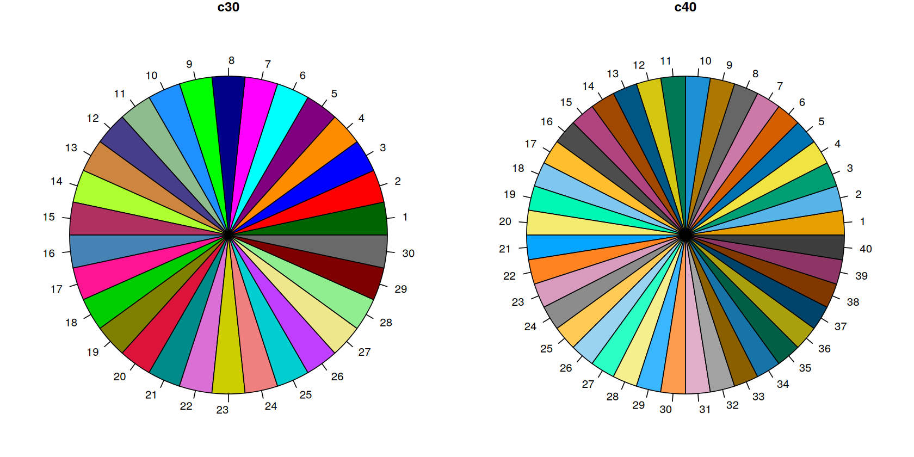
    


```R
# Set colours for samples
c_sample_col <- choosePalette(h5_df$Sample, c30[11:13])
c_sample_col

# Set colours for cell cycle phases
c_phase_col <- setNames(c30[c(20, 3, 9)], c("G1", "S", "G2M"))
c_phase_col

# Set colours for heatmaps
breaks <- seq(-3, 3, by = 0.05) # 121 breaks
c_heatmap_col1 <- plasma(length(breaks), direction = -1) # logcounts
c_heatmap_col2 <- colorRampPalette(rev(RColorBrewer::brewer.pal(11, "RdYlBu")))(length(breaks)) # scaled/z-score
```


<style>
.dl-inline {width: auto; margin:0; padding: 0}
.dl-inline>dt, .dl-inline>dd {float: none; width: auto; display: inline-block}
.dl-inline>dt::after {content: ":\0020"; padding-right: .5ex}
.dl-inline>dt:not(:first-of-type) {padding-left: .5ex}
</style><dl class=dl-inline><dt>Control1</dt><dd>'#8fbc8f'</dd><dt>KidneyCancer</dt><dd>'#483d8b'</dd><dt>LungCancer</dt><dd>'#cd853f'</dd></dl>


<style>
.dl-inline {width: auto; margin:0; padding: 0}
.dl-inline>dt, .dl-inline>dd {float: none; width: auto; display: inline-block}
.dl-inline>dt::after {content: ":\0020"; padding-right: .5ex}
.dl-inline>dt:not(:first-of-type) {padding-left: .5ex}
</style><dl class=dl-inline><dt>G1</dt><dd>'#dc143c'</dd><dt>S</dt><dd>'#0000ff'</dd><dt>G2M</dt><dd>'#00ff00'</dd></dl>


# 2 - Import data

## Load HDF5 objects

Here, we use the `loadHDF5SummarizedExperiment` function from the `HDF5Array` R package to import HDF5 files.


```R
all.sce <- list()
barcodes <- data.frame(Sample = NULL, Barcodes = NULL)
for(i in 1:length(h5_df$Sample)) {
    sample_name <- as.character(h5_df$Sample[i])
    message(paste("Read HDF5 files:", sample_name))
    sce <- HDF5Array::loadHDF5SummarizedExperiment(h5_df$HDF5[i])
    levels(sce$Sample) <- sample_name

    # Add Sample ID to Barcode as prefix to make cell barcodes unique
    colnames(sce) <- paste0(sce$Sample, "_", sce$Barcode)
    sce$Barcode <- colnames(sce)

    print(sce)
    flush.console()

    all.sce[[sample_name]] <- sce
}
```

    Read HDF5 files: Control1
    


    class: SingleCellExperiment 
    dim: 18129 18460 
    metadata(8): Samples cyclone ... DoubletDensity runInfo
    assays(2): counts logcounts
    rownames(18129): SAMD11 NOC2L ... MT-ND6 MT-CYB
    rowData names(12): ID Symbol ... pct_dropout is_hvg
    colnames(18460): Control1_AAACAAGCAACAAGTTACTTTAGG-1 Control1_AAACAAGCAACTAGTGACTTTAGG-1 ...
      Control1_TTTGTGAGTGGCGTAGACTTTAGG-1 Control1_TTTGTGAGTTAATTCGACTTTAGG-1
    colData names(23): Sample Barcode ... label log10Sum
    reducedDimNames(3): PCA TSNE UMAP
    mainExpName: Gene Expression
    altExpNames(1): Antibody Capture


    Read HDF5 files: KidneyCancer
    


    class: SingleCellExperiment 
    dim: 18129 17168 
    metadata(8): Samples cyclone ... DoubletDensity runInfo
    assays(2): counts logcounts
    rownames(18129): SAMD11 NOC2L ... MT-ND6 MT-CYB
    rowData names(12): ID Symbol ... pct_dropout is_hvg
    colnames(17168): KidneyCancer_AAACAAGCAAATACCGATGTTGAC-1 KidneyCancer_AAACAAGCAACAGATTATGTTGAC-1
      ... KidneyCancer_TTTGTGAGTGTCCTTCATGTTGAC-1 KidneyCancer_TTTGTGAGTTGGATGAATGTTGAC-1
    colData names(23): Sample Barcode ... label log10Sum
    reducedDimNames(3): PCA TSNE UMAP
    mainExpName: Gene Expression
    altExpNames(1): Antibody Capture


    Read HDF5 files: LungCancer
    


    class: SingleCellExperiment 
    dim: 18129 14037 
    metadata(8): Samples cyclone ... DoubletDensity runInfo
    assays(2): counts logcounts
    rownames(18129): SAMD11 NOC2L ... MT-ND6 MT-CYB
    rowData names(12): ID Symbol ... pct_dropout is_hvg
    colnames(14037): LungCancer_AAACAAGCAAGGCCTGAGCTGTGA-1 LungCancer_AAACAAGCACCTTTGGAGCTGTGA-1 ...
      LungCancer_TTTGTGAGTTGAGTCTAGCTGTGA-1 LungCancer_TTTGTGAGTTTACGACAGCTGTGA-1
    colData names(23): Sample Barcode ... label log10Sum
    reducedDimNames(3): PCA TSNE UMAP
    mainExpName: Gene Expression
    altExpNames(1): Antibody Capture


## Show run info


```R
rI <- metadata(all.sce[[1]])[["runInfo"]]
df1 <- data.frame(matrix(ncol = length(rI[[1]]), nrow = 0))
df2 <- data.frame(matrix(ncol = length(rI[[2]]), nrow = 0))

for(i in 1:length(all.sce))
{
    rI <- metadata(all.sce[[i]])[["runInfo"]]
    df1 <- rbind(df1, as.data.frame(t(matrix(rI[[1]]))))
    df2 <- rbind(df2, as.data.frame(t(matrix(rI[[2]]))))
}
colnames(df1) <- names(rI[[1]])
colnames(df2) <- names(rI[[2]])
df2 <- cbind(df1[, 1, drop = FALSE], df2) # Add Sample ID

# Add runInfo
runInfo <- list("Sample" = df1, "Data" = df2)

if (suppressPackageStartupMessages(requireNamespace("kableExtra")) && requireNamespace("IRdisplay")) {
    suppressPackageStartupMessages(library(kableExtra))
    df1 %>% kable("html") %>% kable_styling(font_size = 12, position = "left", full_width = FALSE) %>% 
    column_spec(1:ncol(df1), extra_css = "vertical-align: middle !important;") %>%
    add_header_above(c("Single-cell Sample Summary" = ncol(df1)), bold = TRUE, background = "blue", 
                     color = "white") %>% as.character() %>% IRdisplay::display_html()
    
    df2 %>% kable("html") %>% kable_styling(font_size = 12, position = "left", full_width = FALSE) %>% 
    column_spec(1:ncol(df2), extra_css = 'vertical-align: middle !important;') %>%
    add_header_above(c("Data Processing Summary" = ncol(df2)), bold = TRUE, background = "blue", 
                     color = "white") %>% as.character() %>% IRdisplay::display_html()    
} else {
    message("Single-cell Sample Summary")
    data.frame(df1)
    message("Data Processing Summary")
    data.frame(df2)
}
```


<table class="table" style="font-size: 12px; width: auto !important; ">
 <thead>
<tr><th style="border-bottom:hidden;padding-bottom:0; padding-left:3px;padding-right:3px;text-align: center; font-weight: bold; color: white !important;padding-right: 4px; padding-left: 4px; background-color: blue !important;" colspan="7"><div style="border-bottom: 1px solid #ddd; padding-bottom: 5px; ">Single-cell Sample Summary</div></th></tr>
  <tr>
   <th style="text-align:left;"> Sample ID </th>
   <th style="text-align:left;"> Platform </th>
   <th style="text-align:left;"> Chemistry </th>
   <th style="text-align:left;"> Reference </th>
   <th style="text-align:left;"> Transcriptome </th>
   <th style="text-align:left;"> Probe Set Name </th>
   <th style="text-align:left;"> Pipeline Version </th>
  </tr>
 </thead>
<tbody>
  <tr>
   <td style="text-align:left;vertical-align: middle !important;"> Control1 </td>
   <td style="text-align:left;vertical-align: middle !important;"> 10x Genomics </td>
   <td style="text-align:left;vertical-align: middle !important;"> Flex Gene Expression </td>
   <td style="text-align:left;vertical-align: middle !important;"> GRCh38-2024-A </td>
   <td style="text-align:left;vertical-align: middle !important;"> GRCh38-2024-A </td>
   <td style="text-align:left;vertical-align: middle !important;"> Chromium Human Transcriptome Probe Set v1.1.0 </td>
   <td style="text-align:left;vertical-align: middle !important;"> cellranger-9.0.0 </td>
  </tr>
  <tr>
   <td style="text-align:left;vertical-align: middle !important;"> KidneyCancer </td>
   <td style="text-align:left;vertical-align: middle !important;"> 10x Genomics </td>
   <td style="text-align:left;vertical-align: middle !important;"> Flex Gene Expression </td>
   <td style="text-align:left;vertical-align: middle !important;"> GRCh38-2024-A </td>
   <td style="text-align:left;vertical-align: middle !important;"> GRCh38-2024-A </td>
   <td style="text-align:left;vertical-align: middle !important;"> Chromium Human Transcriptome Probe Set v1.1.0 </td>
   <td style="text-align:left;vertical-align: middle !important;"> cellranger-9.0.0 </td>
  </tr>
  <tr>
   <td style="text-align:left;vertical-align: middle !important;"> LungCancer </td>
   <td style="text-align:left;vertical-align: middle !important;"> 10x Genomics </td>
   <td style="text-align:left;vertical-align: middle !important;"> Flex Gene Expression </td>
   <td style="text-align:left;vertical-align: middle !important;"> GRCh38-2024-A </td>
   <td style="text-align:left;vertical-align: middle !important;"> GRCh38-2024-A </td>
   <td style="text-align:left;vertical-align: middle !important;"> Chromium Human Transcriptome Probe Set v1.1.0 </td>
   <td style="text-align:left;vertical-align: middle !important;"> cellranger-9.0.0 </td>
  </tr>
</tbody>
</table>


<table class="table" style="font-size: 12px; width: auto !important; ">
 <thead>
<tr><th style="border-bottom:hidden;padding-bottom:0; padding-left:3px;padding-right:3px;text-align: center; font-weight: bold; color: white !important;padding-right: 4px; padding-left: 4px; background-color: blue !important;" colspan="9"><div style="border-bottom: 1px solid #ddd; padding-bottom: 5px; ">Data Processing Summary</div></th></tr>
  <tr>
   <th style="text-align:left;"> Sample ID </th>
   <th style="text-align:left;"> Lab/Facility </th>
   <th style="text-align:left;"> Analyst </th>
   <th style="text-align:left;"> Run ID </th>
   <th style="text-align:left;"> Run Name </th>
   <th style="text-align:left;"> Sequencer </th>
   <th style="text-align:left;"> User </th>
   <th style="text-align:left;"> PI </th>
   <th style="text-align:left;"> Organism </th>
  </tr>
 </thead>
<tbody>
  <tr>
   <td style="text-align:left;vertical-align: middle !important;"> Control1 </td>
   <td style="text-align:left;vertical-align: middle !important;"> UoM BCF </td>
   <td style="text-align:left;vertical-align: middle !important;"> I-Hsuan Lin </td>
   <td style="text-align:left;vertical-align: middle !important;"> SOME_RUN_ID </td>
   <td style="text-align:left;vertical-align: middle !important;"> SOME_RUN_NAME </td>
   <td style="text-align:left;vertical-align: middle !important;"> NovaSeq 6000 </td>
   <td style="text-align:left;vertical-align: middle !important;"> SOME_USER </td>
   <td style="text-align:left;vertical-align: middle !important;"> SOME_PI </td>
   <td style="text-align:left;vertical-align: middle !important;"> Human </td>
  </tr>
  <tr>
   <td style="text-align:left;vertical-align: middle !important;"> KidneyCancer </td>
   <td style="text-align:left;vertical-align: middle !important;"> UoM BCF </td>
   <td style="text-align:left;vertical-align: middle !important;"> I-Hsuan Lin </td>
   <td style="text-align:left;vertical-align: middle !important;"> SOME_RUN_ID </td>
   <td style="text-align:left;vertical-align: middle !important;"> SOME_RUN_NAME </td>
   <td style="text-align:left;vertical-align: middle !important;"> NovaSeq 6000 </td>
   <td style="text-align:left;vertical-align: middle !important;"> SOME_USER </td>
   <td style="text-align:left;vertical-align: middle !important;"> SOME_PI </td>
   <td style="text-align:left;vertical-align: middle !important;"> Human </td>
  </tr>
  <tr>
   <td style="text-align:left;vertical-align: middle !important;"> LungCancer </td>
   <td style="text-align:left;vertical-align: middle !important;"> UoM BCF </td>
   <td style="text-align:left;vertical-align: middle !important;"> I-Hsuan Lin </td>
   <td style="text-align:left;vertical-align: middle !important;"> SOME_RUN_ID </td>
   <td style="text-align:left;vertical-align: middle !important;"> SOME_RUN_NAME </td>
   <td style="text-align:left;vertical-align: middle !important;"> NovaSeq 6000 </td>
   <td style="text-align:left;vertical-align: middle !important;"> SOME_USER </td>
   <td style="text-align:left;vertical-align: middle !important;"> SOME_PI </td>
   <td style="text-align:left;vertical-align: middle !important;"> Human </td>
  </tr>
</tbody>
</table>


## Visualising with t-SNE and UMAP


```R
p <- list()
for(i in 1:length(all.sce)) {
    p[[i]] <- plotProjections(all.sce[[i]], "Sample", dimnames = c("TSNE", "UMAP"), point_alpha = 0.01, 
                              feat_color = c_sample_col, text_by = "label", text_size = 7, 
                              legend_pos = "none", show_subtitle = FALSE, theme_size = 14, 
                              titles = sprintf("%s (%s)", names(all.sce[i]), c("TSNE","UMAP")))
}

fig(width = 16, height = 8)
plot_grid(plotlist = p, ncol = 2, align = "h")
reset.fig()
```


    
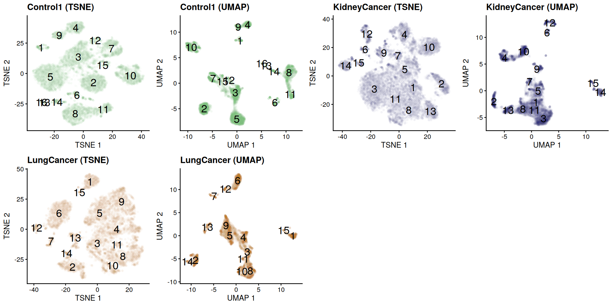
    


# 3 - Prepare data for integration

## Find common genes

Reduce the genes in each dataset to those common genes only


```R
universe1 <- Reduce(intersect, lapply(all.sce, rownames))
print(paste("Common genes:", length(universe1)))

all.common <- list()
for(i in 1:length(all.sce)) {
    all.common[[names(all.sce)[i]]] <- all.sce[[i]][match(universe1, rownames(all.sce[[i]])),]
}
all.common
```

    [1] "Common genes: 18129"


    $Control1
    class: SingleCellExperiment 
    dim: 18129 18460 
    metadata(8): Samples cyclone ... DoubletDensity runInfo
    assays(2): counts logcounts
    rownames(18129): SAMD11 NOC2L ... MT-ND6 MT-CYB
    rowData names(12): ID Symbol ... pct_dropout is_hvg
    colnames(18460): Control1_AAACAAGCAACAAGTTACTTTAGG-1 Control1_AAACAAGCAACTAGTGACTTTAGG-1 ...
      Control1_TTTGTGAGTGGCGTAGACTTTAGG-1 Control1_TTTGTGAGTTAATTCGACTTTAGG-1
    colData names(23): Sample Barcode ... label log10Sum
    reducedDimNames(3): PCA TSNE UMAP
    mainExpName: Gene Expression
    altExpNames(1): Antibody Capture
    
    $KidneyCancer
    class: SingleCellExperiment 
    dim: 18129 17168 
    metadata(8): Samples cyclone ... DoubletDensity runInfo
    assays(2): counts logcounts
    rownames(18129): SAMD11 NOC2L ... MT-ND6 MT-CYB
    rowData names(12): ID Symbol ... pct_dropout is_hvg
    colnames(17168): KidneyCancer_AAACAAGCAAATACCGATGTTGAC-1 KidneyCancer_AAACAAGCAACAGATTATGTTGAC-1
      ... KidneyCancer_TTTGTGAGTGTCCTTCATGTTGAC-1 KidneyCancer_TTTGTGAGTTGGATGAATGTTGAC-1
    colData names(23): Sample Barcode ... label log10Sum
    reducedDimNames(3): PCA TSNE UMAP
    mainExpName: Gene Expression
    altExpNames(1): Antibody Capture
    
    $LungCancer
    class: SingleCellExperiment 
    dim: 18129 14037 
    metadata(8): Samples cyclone ... DoubletDensity runInfo
    assays(2): counts logcounts
    rownames(18129): SAMD11 NOC2L ... MT-ND6 MT-CYB
    rowData names(12): ID Symbol ... pct_dropout is_hvg
    colnames(14037): LungCancer_AAACAAGCAAGGCCTGAGCTGTGA-1 LungCancer_AAACAAGCACCTTTGGAGCTGTGA-1 ...
      LungCancer_TTTGTGAGTTGAGTCTAGCTGTGA-1 LungCancer_TTTGTGAGTTTACGACAGCTGTGA-1
    colData names(23): Sample Barcode ... label log10Sum
    reducedDimNames(3): PCA TSNE UMAP
    mainExpName: Gene Expression
    altExpNames(1): Antibody Capture


## Organise data structure

Make all `sce` objects have identical `rowData` and `colData` column names and order.

<div class="alert alert-warning">
    <strong>Warning!</strong> You may add more columns to show additional features in the integrated object if the columns are present in <u>all the samples</u>.
</div>


```R
# Select rowData columns to keep
rowData_colnames <- c("ID","Symbol","Type","SEQNAME","is_mito")

# Select colData columns to keep
# Add 'coarse_cell_type' and 'fine_cell_type' if using Cell Ranger's Cell Annotation prediction
colData_colnames <- c("Sample","Barcode","sum","detected","subsets_Mt_percent","log10Sum","sizeFactor","CellCycle",
                      #"coarse_cell_type","fine_cell_type",
                      "CellType","label")

# Make all sce have identical rowData and colData column names and order
for(i in 1:length(all.common)) {
    rowData(all.common[[i]]) <- rowData(all.common[[i]])[, rowData_colnames]
    colData(all.common[[i]]) <- colData(all.common[[i]])[, colData_colnames]

    # Clear old reducedDims
    reducedDims(all.common[[i]]) <- list()
}
```


```R
all.common
```


    $Control1
    class: SingleCellExperiment 
    dim: 18129 18460 
    metadata(8): Samples cyclone ... DoubletDensity runInfo
    assays(2): counts logcounts
    rownames(18129): SAMD11 NOC2L ... MT-ND6 MT-CYB
    rowData names(5): ID Symbol Type SEQNAME is_mito
    colnames(18460): Control1_AAACAAGCAACAAGTTACTTTAGG-1 Control1_AAACAAGCAACTAGTGACTTTAGG-1 ...
      Control1_TTTGTGAGTGGCGTAGACTTTAGG-1 Control1_TTTGTGAGTTAATTCGACTTTAGG-1
    colData names(10): Sample Barcode ... CellType label
    reducedDimNames(0):
    mainExpName: Gene Expression
    altExpNames(1): Antibody Capture
    
    $KidneyCancer
    class: SingleCellExperiment 
    dim: 18129 17168 
    metadata(8): Samples cyclone ... DoubletDensity runInfo
    assays(2): counts logcounts
    rownames(18129): SAMD11 NOC2L ... MT-ND6 MT-CYB
    rowData names(5): ID Symbol Type SEQNAME is_mito
    colnames(17168): KidneyCancer_AAACAAGCAAATACCGATGTTGAC-1 KidneyCancer_AAACAAGCAACAGATTATGTTGAC-1
      ... KidneyCancer_TTTGTGAGTGTCCTTCATGTTGAC-1 KidneyCancer_TTTGTGAGTTGGATGAATGTTGAC-1
    colData names(10): Sample Barcode ... CellType label
    reducedDimNames(0):
    mainExpName: Gene Expression
    altExpNames(1): Antibody Capture
    
    $LungCancer
    class: SingleCellExperiment 
    dim: 18129 14037 
    metadata(8): Samples cyclone ... DoubletDensity runInfo
    assays(2): counts logcounts
    rownames(18129): SAMD11 NOC2L ... MT-ND6 MT-CYB
    rowData names(5): ID Symbol Type SEQNAME is_mito
    colnames(14037): LungCancer_AAACAAGCAAGGCCTGAGCTGTGA-1 LungCancer_AAACAAGCACCTTTGGAGCTGTGA-1 ...
      LungCancer_TTTGTGAGTTGAGTCTAGCTGTGA-1 LungCancer_TTTGTGAGTTTACGACAGCTGTGA-1
    colData names(10): Sample Barcode ... CellType label
    reducedDimNames(0):
    mainExpName: Gene Expression
    altExpNames(1): Antibody Capture


## Recomputes log-normalized expression values

The `multiBatchNorm` function recomputes log-normalized expression values (using `logNormCounts`) after adjusting the size factors for systematic differences in coverage between `SingleCellExperiment` objects.


```R
set.seed(12345)
all.common.normed <- do.call(multiBatchNorm, all.common)
all.common.normed
```


    $Control1
    class: SingleCellExperiment 
    dim: 18129 18460 
    metadata(8): Samples cyclone ... DoubletDensity runInfo
    assays(2): counts logcounts
    rownames(18129): SAMD11 NOC2L ... MT-ND6 MT-CYB
    rowData names(5): ID Symbol Type SEQNAME is_mito
    colnames(18460): Control1_AAACAAGCAACAAGTTACTTTAGG-1 Control1_AAACAAGCAACTAGTGACTTTAGG-1 ...
      Control1_TTTGTGAGTGGCGTAGACTTTAGG-1 Control1_TTTGTGAGTTAATTCGACTTTAGG-1
    colData names(10): Sample Barcode ... CellType label
    reducedDimNames(0):
    mainExpName: Gene Expression
    altExpNames(1): Antibody Capture
    
    $KidneyCancer
    class: SingleCellExperiment 
    dim: 18129 17168 
    metadata(8): Samples cyclone ... DoubletDensity runInfo
    assays(2): counts logcounts
    rownames(18129): SAMD11 NOC2L ... MT-ND6 MT-CYB
    rowData names(5): ID Symbol Type SEQNAME is_mito
    colnames(17168): KidneyCancer_AAACAAGCAAATACCGATGTTGAC-1 KidneyCancer_AAACAAGCAACAGATTATGTTGAC-1
      ... KidneyCancer_TTTGTGAGTGTCCTTCATGTTGAC-1 KidneyCancer_TTTGTGAGTTGGATGAATGTTGAC-1
    colData names(10): Sample Barcode ... CellType label
    reducedDimNames(0):
    mainExpName: Gene Expression
    altExpNames(1): Antibody Capture
    
    $LungCancer
    class: SingleCellExperiment 
    dim: 18129 14037 
    metadata(8): Samples cyclone ... DoubletDensity runInfo
    assays(2): counts logcounts
    rownames(18129): SAMD11 NOC2L ... MT-ND6 MT-CYB
    rowData names(5): ID Symbol Type SEQNAME is_mito
    colnames(14037): LungCancer_AAACAAGCAAGGCCTGAGCTGTGA-1 LungCancer_AAACAAGCACCTTTGGAGCTGTGA-1 ...
      LungCancer_TTTGTGAGTTGAGTCTAGCTGTGA-1 LungCancer_TTTGTGAGTTTACGACAGCTGTGA-1
    colData names(10): Sample Barcode ... CellType label
    reducedDimNames(0):
    mainExpName: Gene Expression
    altExpNames(1): Antibody Capture


```R
p <- list()
for(i in 1:length(all.common)) {
    p[[i]] <- ggplot(data.frame(Original = all.common[[i]]$sizeFactor, Normed = all.common.normed[[i]]$sizeFactor),
                     aes(x = Original, y = Normed)) + geom_point(size = 0.5) + 
    geom_abline(intercept = 0, slope = 1, color = "red", linetype = 2, linewidth = 1) +
    theme_bw(base_size = 16) + ggtitle(paste(names(all.common[i]), "sf"))
}

fig(width = 16, height = 4)
plot_grid(plotlist = p, ncol = 4, align = "h")
reset.fig()
```


    
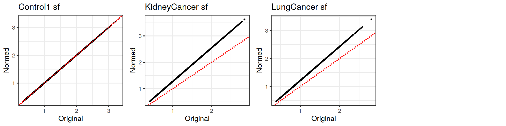
    


Create `dgCMatrix` counts and logcounts matrices for faster computation in some steps.


```R
normed_c <- list()
normed_l <- list()

for(i in names(all.common.normed)) {
    normed_c[[i]] <-  as(counts(all.common.normed[[i]], withDimnames = TRUE), "dgCMatrix")
    normed_l[[i]] <-  as(logcounts(all.common.normed[[i]], withDimnames = TRUE), "dgCMatrix")
}
```

## Identifying highly variable genes (HVGs)

Identifying HVG based on common genes using re-normalised `SingleCellExperiment` objects.

### Quantifying per-gene variation

Choose to model the variance of the log-expression profiles for each gene (`modelGeneVar`) or model the per-gene count variance with Poisson noise (`modelGeneVarByPoisson`).


```R
# Choose variance modelling method to use
hvg_model <- "modelGeneVarByPoisson" # Or modelGeneVar
all.var <- list()

message(paste0("Using '", hvg_model, "' method"))

for(i in names(all.common.normed)) {
    to_keep <- TRUE # Include all genes
    # Optional
    # Not is_mito and not ribosomal protein-coding genes (Human & Mouse)
    #to_keep <- !rowData(all.common.normed[[i]])$is_mito & 
    #            !grepl("^RPL|^RPS|^Rpl|^Rps", rownames(all.common.normed[[i]]))
    
    if(hvg_model == "modelGeneVar") {
        set.seed(12345)
        all.var[[i]] <- modelGeneVarByPoisson(normed_l[[i]][to_keep,], BPPARAM = bpp)
    } else {
        set.seed(12345)
        all.var[[i]] <- modelGeneVarByPoisson(normed_c[[i]][to_keep,], 
                                              size.factors = sizeFactors(all.common.normed[[i]]), BPPARAM = bpp)
    }
}

# Print DataFrame
for(i in 1:length(all.common.normed)) {
    print(paste0(names(all.common.normed)[i], ":"))
    all.var[[i]] %>% as.data.frame %>% arrange(FDR, desc(bio)) %>% dplyr::select(1:6) %>% DataFrame %>% print
}
```

    Using 'modelGeneVarByPoisson' method
    


    [1] "Control1:"
    DataFrame with 18129 rows and 6 columns
                 mean     total      tech       bio   p.value       FDR
            <numeric> <numeric> <numeric> <numeric> <numeric> <numeric>
    LYZ       1.45634   4.59072  0.632304   3.95841         0         0
    CD74      3.76971   4.04530  0.178336   3.86697         0         0
    GNLY      1.20764   4.16534  0.640817   3.52452         0         0
    NKG7      1.49643   3.89281  0.627994   3.26482         0         0
    S100A9    1.12832   3.82526  0.634779   3.19048         0         0
    ...           ...       ...       ...       ...       ...       ...
    TGIF2LY         0         0         0         0       NaN       NaN
    PCDH11Y         0         0         0         0       NaN       NaN
    AMELY           0         0         0         0       NaN       NaN
    TSPY1           0         0         0         0       NaN       NaN
    DAZ2            0         0         0         0       NaN       NaN
    [1] "KidneyCancer:"
    DataFrame with 18129 rows and 6 columns
                 mean     total      tech       bio   p.value       FDR
            <numeric> <numeric> <numeric> <numeric> <numeric> <numeric>
    GNLY     1.138577   3.42077  0.485806   2.93496         0         0
    FOS      2.051771   2.70202  0.379939   2.32208         0         0
    CCL5     1.212722   2.68365  0.486043   2.19761         0         0
    CD74     1.797954   2.55010  0.423862   2.12624         0         0
    NKG7     0.993822   2.47213  0.475705   1.99642         0         0
    ...           ...       ...       ...       ...       ...       ...
    PCDH11Y         0         0         0         0       NaN       NaN
    AMELY           0         0         0         0       NaN       NaN
    TBL1Y           0         0         0         0       NaN       NaN
    TSPY1           0         0         0         0       NaN       NaN
    DAZ2            0         0         0         0       NaN       NaN
    [1] "LungCancer:"
    DataFrame with 18129 rows and 6 columns
                 mean     total      tech       bio   p.value       FDR
            <numeric> <numeric> <numeric> <numeric> <numeric> <numeric>
    GNLY     1.720334   5.00735  0.452335   4.55502         0         0
    CD74     2.968303   4.47523  0.231769   4.24346         0         0
    CCL5     2.221786   4.47919  0.362671   4.11652         0         0
    IGHM     0.940615   4.10908  0.481994   3.62709         0         0
    NKG7     1.662264   3.66641  0.461079   3.20533         0         0
    ...           ...       ...       ...       ...       ...       ...
    PCDH11Y         0         0         0         0       NaN       NaN
    AMELY           0         0         0         0       NaN       NaN
    TBL1Y           0         0         0         0       NaN       NaN
    TSPY1           0         0         0         0       NaN       NaN
    DAZ2            0         0         0         0       NaN       NaN


### Selecting HVGs

We perform feature selection by averaging the variance components across all batches with the `combineVar` function. We compute the average as it is responsive to batch-specific HVGs while still preserving the within-batch ranking of genes. In contrast, approaches based on taking the **intersection** or **union** of HVGs across batches become increasingly conservative or liberal, respectively, with an increasing number of batches.


```R
# Select the top N genes with the highest biological components
#hvg_genes <- Reduce(intersect, lapply(all.var, getTopHVGs, n = 5000, var.field = "bio", var.threshold = 0))

# Select the top N% genes with the highest biological components
#hvg_genes <- Reduce(intersect, lapply(all.var, getTopHVGs, prop = 0.20, var.field = "bio", var.threshold = 0))
```

When integrating datasets of variable composition, it is generally safer to err on the side of **including more genes** than are used in a single dataset analysis, to ensure that markers are retained for any dataset-specific subpopulations that might be present. 


```R
combined.var <- do.call(combineVar, all.var)

# Select the top N genes with the highest biological components
hvg_genes <- getTopHVGs(combined.var, n = 3500, var.field = "bio", var.threshold = 0)

# Select genes with positive average biological components
#hvg_genes <- rownames(combined.var)[combined.var$bio > 0]

# Select the top N% genes with the highest biological components
#hvg_genes <- getTopHVGs(combined.var, prop = 0.20, var.field = "bio", var.threshold = 0)
```


```R
message(sprintf("Top %d HVGs selected (%s):", length(hvg_genes), hvg_model))
head(hvg_genes, 20)
```

    Top 3500 HVGs selected (modelGeneVarByPoisson):
    


<style>
.list-inline {list-style: none; margin:0; padding: 0}
.list-inline>li {display: inline-block}
.list-inline>li:not(:last-child)::after {content: "\00b7"; padding: 0 .5ex}
</style>
<ol class=list-inline><li>'GNLY'</li><li>'CD74'</li><li>'NKG7'</li><li>'FOS'</li><li>'CCL5'</li><li>'IGHM'</li><li>'LYZ'</li><li>'TRBC2'</li><li>'S100A9'</li><li>'DUSP1'</li><li>'H1-10'</li><li>'IL32'</li><li>'EFHD2'</li><li>'VIM'</li><li>'JUN'</li><li>'IL7R'</li><li>'SRGN'</li><li>'TCF7'</li><li>'IFI30'</li><li>'SPI1'</li></ol>


<div class="alert alert-info">
    <strong>Tip!</strong> In the accompanied Shiny App, top N HVGs are used as example genes in multi-gene expression visualisation.
</div>


```R
# Add to runInfo
runInfo <- c(runInfo, list(
    "HVG" = list(
        "Method" = hvg_model, 
        "Estimates" = combined.var, 
        "Genes" = hvg_genes)
    )
)
```

# 4 - Data integration

Large single-cell RNA sequencing (scRNA-seq) projects usually need to generate data across multiple batches due to logistical constraints. However, the processing of different batches is often subject to uncontrollable differences, and results in systematic differences in the observed expression in cells from different batches. We also often observe a strong donor effect in integrated datasets. This might be due to differences in cell type composition between donors, but the more likely explanation is that of a technical difference in sample preparation processing or uninteresting genotypic differences.

Computational correction of batch effects is critical for eliminating batch-to-batch variation, allowing data across multiple batches to be combined for common downstream analysis. See [OSCA reference](https://bioconductor.org/books/3.20/OSCA.multisample/integrating-datasets.html)

## Diagnosing batch effects

Before performing any correction, we check that there actually is a batch effect across these datasets by checking that they cluster separately.

### Create a single `SingleCellExperiment` object

 Here, we use the `cbind` function to combine `SingleCellExperiment` objects in the list without applying any correction, and we informally verify that cells from different batches are separated using a t-SNE plot.

It is also possible to combine `SingleCellExperiment` objects with the `correctExperiments` function, and without applying any correction using the `NoCorrectParam` flag. However, data stored in `metadata` and `altExps` is not retained.

<div class="alert alert-warning">
    <strong>Warning!</strong>
    <br />
    If it takes longer than 1 minute for the merging to complete, it means there is a problem with <code>cbind()</code> concerning the columns in either <code>rowData()</code> and/or <code>colData()</code>. Interrupt the kernel and check for consistency of the columns of the objects stored in <code>all.common.normed</code>. Alternatively, use <code>correctExperiments()</code> to merge data and it'll throw out warning messages if there's a problem with the data structure.
</div>


```R
#set.seed(12345)
#combined <- correctExperiments(all.common.normed, PARAM = NoCorrectParam())
# Use `cbind` to combine SingleCellExperiment to retain "metadata" and altExps"
combined <- do.call(cbind, all.common.normed)

# Sort meta data
combined$Sample <- factor(combined$Sample, levels = gtools::mixedsort(levels(combined$Sample)))
combined$CellType <- factor(combined$CellType, levels = gtools::mixedsort(levels(combined$CellType)))

# Remove "merged" matrix in the assays slot, as it is identical to the "logcounts" matrix
assay(combined, "merged") <- NULL
combined
```


    class: SingleCellExperiment 
    dim: 18129 49665 
    metadata(24): Samples cyclone ... DoubletDensity runInfo
    assays(2): counts logcounts
    rownames(18129): SAMD11 NOC2L ... MT-ND6 MT-CYB
    rowData names(5): ID Symbol Type SEQNAME is_mito
    colnames(49665): Control1_AAACAAGCAACAAGTTACTTTAGG-1 Control1_AAACAAGCAACTAGTGACTTTAGG-1 ...
      LungCancer_TTTGTGAGTTGAGTCTAGCTGTGA-1 LungCancer_TTTGTGAGTTTACGACAGCTGTGA-1
    colData names(10): Sample Barcode ... CellType label
    reducedDimNames(0):
    mainExpName: Gene Expression
    altExpNames(1): Antibody Capture


Fix duplicate `metadata` names after combining datasets


```R
# If metadata in single-sample data is identical
if(length(metadata(combined)) %% length(names(all.common.normed)) == 0) {
    n_meta <- length(metadata(combined)) / length(names(all.common.normed))
    for(i in 1:length(names(all.common.normed))) {
        name <- names(all.common.normed)[i]
#        print(name)
        to <- i * n_meta
        from <- to - n_meta + 1
        names(metadata(combined))[from:to] <- paste0(name, "_", names(metadata(combined))[from:to])
    }
} else {
    stop("Not fixed automatically!")
}
```


```R
# Set colours for cell types
c_celltype_col <- choosePalette(combined$CellType, c40)
#c_celltype_col
```


```R
# Add HVG to rowData
rowData(combined)$is_hvg <- FALSE
rowData(combined)[rownames(combined) %in% hvg_genes,]$is_hvg <- TRUE
table("Is HVG" = rowData(combined)$is_hvg)
```


    Is HVG
    FALSE  TRUE 
    14629  3500 


### Add additional variables that describes the samples  to `colData`

<div class="alert alert-warning">
    <strong>Warning!</strong> Need to add additional information about your samples here.
</div>


```R
combined$condition <- combined$Sample
levels(combined$condition) <- c("Control","Cancer","Cancer","Cancer")

# Set colours for condition
c_cond_col <- setNames(c("cyan", "magenta"), c("Control", "Cancer"))
c_cond_col
```


<style>
.dl-inline {width: auto; margin:0; padding: 0}
.dl-inline>dt, .dl-inline>dd {float: none; width: auto; display: inline-block}
.dl-inline>dt::after {content: ":\0020"; padding-right: .5ex}
.dl-inline>dt:not(:first-of-type) {padding-left: .5ex}
</style><dl class=dl-inline><dt>Control</dt><dd>'cyan'</dd><dt>Cancer</dt><dd>'magenta'</dd></dl>


### Run `multiBatchPCA` on the *uncorrected* `logcounts` matrix

The `multiBatchPCA` function perform a principal components analysis across multiple gene expression matrices (i.e. batches) to project all cells to a common low-dimensional space. Default to `d = 50` dimensions.

**weights**: A numeric vector, logical scalar or list specifying the weighting scheme to use. See `?multiBatchPCA` for more details.


```R
set.seed(12345)

# Use Randomized SVD algorithm, faster for file-backed matrices
#pca <- multiBatchPCA(normed_l, subset.row = hvg_genes, get.variance = TRUE, 
#                     weights = rep(1, length(normed_l)), 
#                     BSPARAM = BiocSingular::RandomParam(), BPPARAM = bpp)

# Use IRLBA algorithm, default behavior is more accurate
pca <- multiBatchPCA(normed_l, subset.row = hvg_genes, get.variance = TRUE, 
                     #weights = rep(1, length(normed_l)), 
                     BSPARAM = BiocSingular::IrlbaParam(), BPPARAM = bpp)
```


```R
# Re-construct pca object and attributes
rotation <- metadata(pca)$rotation
colnames(rotation) <- paste0("PC", seq_len(ncol(rotation)))
varExplained <- metadata(pca)$var.explained
percentVar <- varExplained/metadata(pca)$var.total*100

pca <- unlist(pca, use.names = FALSE)
colnames(pca) <- paste0("PC", seq_len(ncol(pca)))
attr(pca, "varExplained") <- varExplained
attr(pca, "percentVar") <- percentVar
attr(pca, "rotation") <- rotation
str(pca)

# Store PCA results
reducedDim(combined, "PCA") <- pca
```

     num [1:49665, 1:50] 5.5259 -0.8486 -0.0831 -3.2809 6.8182 ...
     - attr(*, "dimnames")=List of 2
      ..$ : chr [1:49665] "Control1_AAACAAGCAACAAGTTACTTTAGG-1" "Control1_AAACAAGCAACTAGTGACTTTAGG-1" "Control1_AAACAAGCAGTTATCCACTTTAGG-1" "Control1_AAACAAGCATAGCCGGACTTTAGG-1" ...
      ..$ : chr [1:50] "PC1" "PC2" "PC3" "PC4" ...
     - attr(*, "varExplained")= num [1:50] 158.3 89 67.1 52 32.7 ...
     - attr(*, "percentVar")= num [1:50] 8.64 4.85 3.66 2.84 1.78 ...
     - attr(*, "rotation")= num [1:3500, 1:50] 0.00311 0.10852 0.01265 0.07427 -0.01582 ...
      ..- attr(*, "dimnames")=List of 2
      .. ..$ : chr [1:3500] "GNLY" "CD74" "NKG7" "FOS" ...
      .. ..$ : chr [1:50] "PC1" "PC2" "PC3" "PC4" ...


```R
show <- 20 # Show first N PCs

# Scree plot
as.data.frame(percentVar) %>% rownames_to_column("PC") %>% mutate(PC = as.numeric(PC)) %>% head(show) %>%
    ggplot(aes(x = PC, y = percentVar)) + geom_point(size = 3) +
    scale_x_continuous(breaks = seq(0, 50, by = 5)) + theme_cowplot(20) + 
    guides(color = guide_legend(title = "Method")) + theme(legend.position = "top") + 
    labs(x = "PC", y = "Variance explained (%)")
```


    
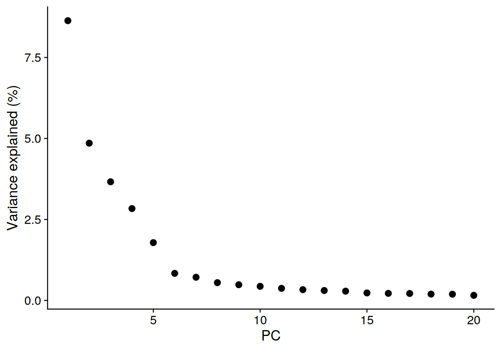
    


### Run `runTSNE` and `runUMAP` to find low-dimensional representations of the *uncorrected* data

For `n_dimred`, better to include more PCs in integrated dataset than that used in a single dataset analysis. The default is 50, i.e. all dimensions.


```R
set.seed(12345)
combined <- runTSNE(combined, dimred = "PCA", name = "TSNE", n_dimred = 30, n_threads = nthreads, BPPARAM = bpp)
```


```R
set.seed(12345)
combined <- runUMAP(combined, dimred = "PCA", name = "UMAP", n_dimred = 30,
                    n_neighbors = 30, spread = 1, min_dist = 0.3, n_threads = nthreads, BPPARAM = bpp)
```


```R
# Added PCA, TSNE, UMAP reducedDims
combined
```


    class: SingleCellExperiment 
    dim: 18129 49665 
    metadata(24): Control1_Samples Control1_cyclone ... LungCancer_DoubletDensity LungCancer_runInfo
    assays(2): counts logcounts
    rownames(18129): SAMD11 NOC2L ... MT-ND6 MT-CYB
    rowData names(6): ID Symbol ... is_mito is_hvg
    colnames(49665): Control1_AAACAAGCAACAAGTTACTTTAGG-1 Control1_AAACAAGCAACTAGTGACTTTAGG-1 ...
      LungCancer_TTTGTGAGTTGAGTCTAGCTGTGA-1 LungCancer_TTTGTGAGTTTACGACAGCTGTGA-1
    colData names(11): Sample Barcode ... label condition
    reducedDimNames(3): PCA TSNE UMAP
    mainExpName: Gene Expression
    altExpNames(1): Antibody Capture


### Visualise the *uncorrected* data in t-SNE and UMAP


```R
fig(width = 16, height = 8)
plotProjections(combined, "Sample", dimnames = c("TSNE", "UMAP"), feat_desc = "Sample", 
                feat_color = c_sample_col, guides_size = 4, point_size = 0.1, point_alpha = 0.1,
                legend_pos = "bottom", guides_nrow = 1, titles = c("TSNE, no correction","UMAP, no correction"))
reset.fig()
```


    
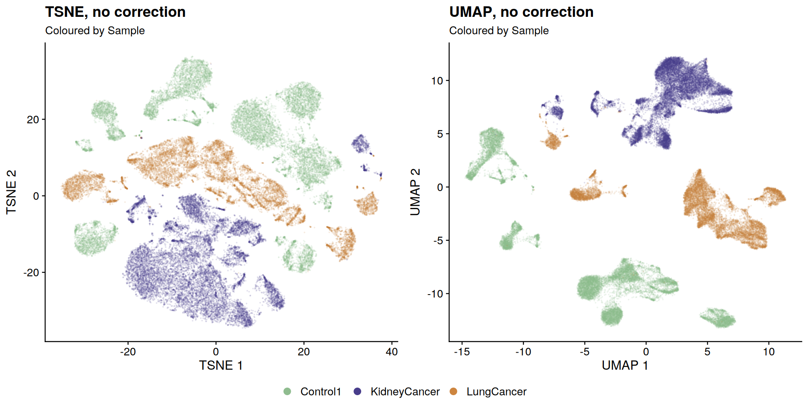
    


```R
fig(width = 16, height = 8)
plotProjections(combined, "CellType", dimnames = c("TSNE", "UMAP"), feat_desc = "Cell Type", 
                feat_color = c_celltype_col, guides_size = 4, point_size = 0.1, point_alpha = 0.1,
                legend_pos = "bottom", guides_nrow = 1, titles = c("TSNE, no correction","UMAP, no correction"))
reset.fig()
```


    
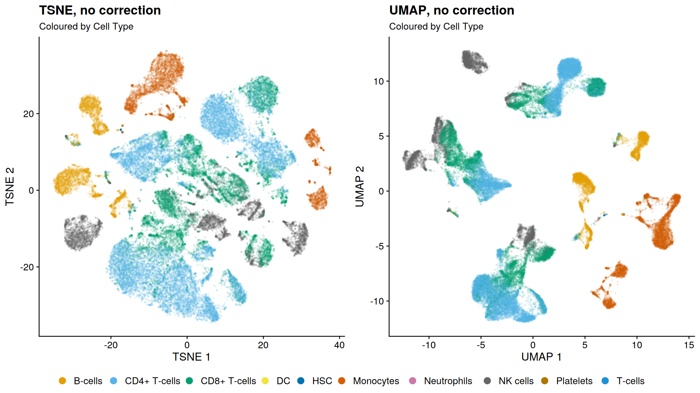
    


<div class="alert alert-info">
    <strong>About this dataset: </strong> (edits required)
    <ul>
        <li>Looks like the batch effect is very significant.</li>
        <li>We will perform correction and see how the connected data looks like.</li>
    </ul>
</div>

## Performing MNN correction

We use a fast version of the mutual nearest neighbors (MNN) method, `fastMNN`, in the `batchelor` package to correct for batch effects in single-cell expression data. The batch correction functions in batchelor are organized into three levels:

1. At the lowest level, we have the functions that implement a single type of correction, e.g., `fastMNN`.
2. At the next level, we have the `batchCorrect` function that wraps the single-correction function into a common interface.
3. At the highest level, we have the `correctExperiments` function that wraps the `batchCorrect` function.

Here, we run the `batchCorrect` function with the `FastMnnParam` flag to apply the `fastMNN` correction. 

The `multiBatchPCA` function is called when applying `fastMNN` to perform a PCA across multiple batches to project all cells to a common low-dimensional space.

### Controlling the merge order

By default, batches are merged in the user-supplied order in the input `SingleCellExperiment` objects or list. The merge order may occasionally be important as it determines the number of MNN pairs available at each merge step. MNN pairs results in greater stability of the batch vectors and increased likelihood of identifying shared subpopulations, which are important to the precision and accuracy of the MNN-based correction, respectively. The order can be changed by setting the `merge.order` or `auto.merge` arguments. See `?fastMNN` for more details.

**merge.order**: An integer vector containing the linear merge order of batches. Alternatively, a list of lists representing a tree structure specifying a hierarchical merge order. For example, a hierarchical merge to first merge together replicates with the same genotype, and then merge samples across different genotypes. See [Example](https://bioconductor.org/books/3.20/OSCA.multisample/chimeric-mouse-embryo-10x-genomics.html#merging)

**auto.merge**: Use `auto.merge=TRUE` to instruct `fastMNN` automatically identify the “best” merge order (i.e. largest number of MNNs). The aim is to improve the stability of the correction by first merging more similar batches with more MNN pairs. This can be somewhat time-consuming as MNN pairs need to be iteratively recomputed for all possible batch pairings.

Option 1: Use below code to use `auto.merge = TRUE`.


```R
set.seed(12345)
corrected <- batchCorrect(normed_l, subset.row = hvg_genes, 
                          PARAM = FastMnnParam(auto.merge = TRUE, 
                                               #weights = rep(1, length(normed_l)), # 1:1
                                               # use Randomized SVD or IRLBA for PCA
                                               #BSPARAM = BiocSingular::RandomParam(), # Use RandomParam
                                               BSPARAM = BiocSingular::IrlbaParam(),   # Or IrlbaParam
                                               BNPARAM = AnnoyParam(), BPPARAM = bpp))
```

Option 2: Use below code and use `merge.order` to set the merge order if your choice.


```R
#set.seed(12345)
#corrected <- batchCorrect(normed_l, subset.row = hvg_genes, 
#                          PARAM = FastMnnParam(merge.order = list(1, list(2, 3)), 
#                                               weights = rep(1, length(normed_l)), # 1:1
#                                               # use Randomized SVD or IRLBA for PCA
#                                               #BSPARAM = BiocSingular::RandomParam(), # Use RandomParam
#                                               BSPARAM = BiocSingular::IrlbaParam(),   # Or IrlbaParam
#                                               BNPARAM = AnnoyParam(), BPPARAM = bpp))
```

The returned object contains:

- A `batch` column in the `colData` slot, containing the batch of origin for each row (i.e., cell) in corrected.
- A `rotation` column the `rowData` slot, containing the rotation matrix used for the PCA.
- A `reconstructed` matrix in the `assays` slot, containing the low-rank reconstruction of the expression matrix. This can be interpreted as per-gene corrected log-expression values (after cosine normalization, if `cos.norm=TRUE` which is the default setting) but should not be used for quantitative analyses.
- A `corrected` matrix in the `reducedDims` slot, containing corrected low-dimensional coordinates for each cell. 

Additionally, the metadata of the output object contains:

- `merge.info`, a DataFrame of diagnostic information about each merge step.
- `pca.info`, a list of metadata produced by `multiBatchPCA`, such as the variance explained when `get.variance=TRUE`.


```R
corrected
```


    class: SingleCellExperiment 
    dim: 3500 49665 
    metadata(2): merge.info pca.info
    assays(1): reconstructed
    rownames(3500): GNLY CD74 ... CMPK2 ASCC3
    rowData names(1): rotation
    colnames(49665): Control1_AAACAAGCAACAAGTTACTTTAGG-1 Control1_AAACAAGCAACTAGTGACTTTAGG-1 ...
      LungCancer_TTTGTGAGTTGAGTCTAGCTGTGA-1 LungCancer_TTTGTGAGTTTACGACAGCTGTGA-1
    colData names(1): batch
    reducedDimNames(1): corrected
    mainExpName: NULL
    altExpNames(0):


### Check the proportion of variance lost

For `fastMNN()`, one useful diagnostic is the proportion of variance within each batch that is lost during MNN correction. Specifically, this refers to the within-batch variance that is removed during orthogonalization with respect to the average correction vector at each merge step. This is returned via the `lost.var` field in the metadata of returned object, which contains a matrix of the variance lost in each batch (column) at each merge step (row).

Large proportions of lost variance (>10%) suggest that correction is removing genuine biological heterogeneity. This would occur due to violations of the assumption of orthogonality between the batch effect and the biological subspace. If the proportion of lost variance is small, it indicates that non-orthogonality is not a major concern.


```R
metadata(corrected)$merge.info
```


    DataFrame with 2 rows and 6 columns
                         left        right                               pairs batch.size   skipped
                       <List>       <List>                     <DataFrameList>  <numeric> <logical>
    1              LungCancer KidneyCancer 35629:20041,35630:29332,35630:31630   0.729777     FALSE
    2 LungCancer,KidneyCancer     Control1  35644:12864,35644:12006,35644:1220   0.743482     FALSE
                           lost.var
                           <matrix>
    1 0.0000000:0.0116580:0.0117947
    2 0.0112386:0.0182646:0.0165127


```R
data.frame(Order = 1:nrow(metadata(corrected)$merge.info),
           Left = stringi::stri_join_list(as.list(metadata(corrected)$merge.info$left), sep = ", "), 
           Right = stringi::stri_join_list(as.list(metadata(corrected)$merge.info$right)))
```


<table class="dataframe">
<caption>A data.frame: 2 × 3</caption>
<thead>
	<tr><th scope=col>Order</th><th scope=col>Left</th><th scope=col>Right</th></tr>
	<tr><th scope=col>&lt;int&gt;</th><th scope=col>&lt;chr&gt;</th><th scope=col>&lt;chr&gt;</th></tr>
</thead>
<tbody>
	<tr><td>1</td><td>LungCancer              </td><td>KidneyCancer</td></tr>
	<tr><td>2</td><td>LungCancer, KidneyCancer</td><td>Control1    </td></tr>
</tbody>
</table>


```R
metadata(corrected)$merge.info$lost.var
```


<table class="dataframe">
<caption>A matrix: 2 × 3 of type dbl</caption>
<thead>
	<tr><th scope=col>Control1</th><th scope=col>KidneyCancer</th><th scope=col>LungCancer</th></tr>
</thead>
<tbody>
	<tr><td>0.00000000</td><td>0.01165801</td><td>0.01179465</td></tr>
	<tr><td>0.01123859</td><td>0.01826459</td><td>0.01651267</td></tr>
</tbody>
</table>


## Save MNN results

<div class="alert alert-warning">
    <strong>Warning!</strong> The <code>reconstructed</code> matrix in the <code>assays</code> slot contains the corrected expression values for each gene in each cell, obtained by projecting the low-dimensional coordinates in corrected back into gene expression space. <strong>It is not recommended using this for anything other than visualisation.</strong> Use of the corrected values in any quantitative procedure should be treated with caution, and should be backed up by similar results from an analysis on the uncorrected values. See <a href="https://bioconductor.org/books/3.20/OSCA.multisample/using-corrected-values.html">OSCA reference</a>
</div>


```R
reducedDim(combined, "MNN") <- reducedDim(corrected, "corrected")
combined
```


    class: SingleCellExperiment 
    dim: 18129 49665 
    metadata(24): Control1_Samples Control1_cyclone ... LungCancer_DoubletDensity LungCancer_runInfo
    assays(2): counts logcounts
    rownames(18129): SAMD11 NOC2L ... MT-ND6 MT-CYB
    rowData names(6): ID Symbol ... is_mito is_hvg
    colnames(49665): Control1_AAACAAGCAACAAGTTACTTTAGG-1 Control1_AAACAAGCAACTAGTGACTTTAGG-1 ...
      LungCancer_TTTGTGAGTTGAGTCTAGCTGTGA-1 LungCancer_TTTGTGAGTTTACGACAGCTGTGA-1
    colData names(11): Sample Barcode ... label condition
    reducedDimNames(4): PCA TSNE UMAP MNN
    mainExpName: Gene Expression
    altExpNames(1): Antibody Capture


## Visualising before & after MNN corrections with t-SNE


```R
set.seed(12345)
combined <- runTSNE(combined, dimred = "MNN", name = "MNN-TSNE", n_dimred = 30, 
                    n_threads = nthreads, BPPARAM = bpp)
```


```R
fig(width = 16, height = 8)
plotProjections(combined, "Sample", dimnames = c("TSNE", "MNN-TSNE"), feat_desc = "Sample", 
                feat_color = c_sample_col, guides_size = 4, point_size = 0.1, point_alpha = 0.1,
                legend_pos = "bottom", guides_nrow = 1, titles = c("TSNE, no correction","TSNE, MNN correction"))
reset.fig()
```


    
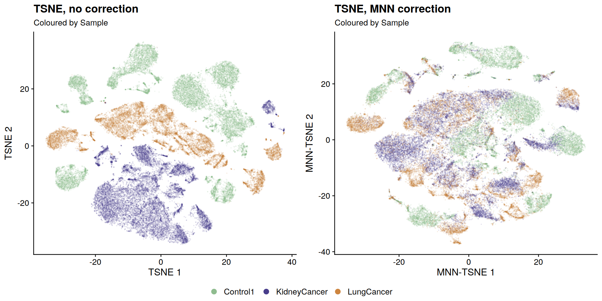
    


```R
fig(width = 16, height = 8)
plotProjections(combined, "CellType", dimnames = c("TSNE", "MNN-TSNE"), feat_desc = "Cell Type", 
                feat_color = c_celltype_col, guides_size = 4, point_size = 0.1, point_alpha = 0.1,
                legend_pos = "bottom", guides_nrow = 1, titles = c("TSNE, no correction","TSNE, MNN correction"))
reset.fig()
```


    
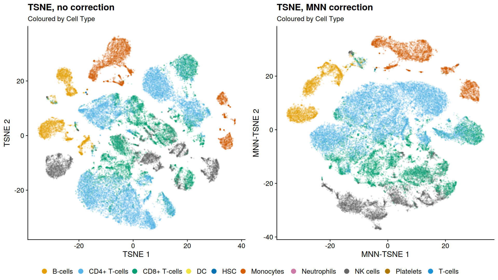
    


## Visualising before & after MNN corrections with UMAP


```R
set.seed(12345)
combined <- runUMAP(combined, dimred = "MNN", name = "MNN-UMAP", n_dimred = 30, 
                    n_neighbors = 30, spread = 1, min_dist = 0.3, n_threads = nthreads, BPPARAM = bpp)
```


```R
fig(width = 16, height = 8)
plotProjections(combined, "Sample", dimnames = c("UMAP", "MNN-UMAP"), feat_desc = "Sample", 
                feat_color = c_sample_col, guides_size = 4, point_size = 0.1, point_alpha = 0.1,
                legend_pos = "bottom", guides_nrow = 1, titles = c("UMAP, no correction","UMAP, MNN correction"))
reset.fig()
```


    
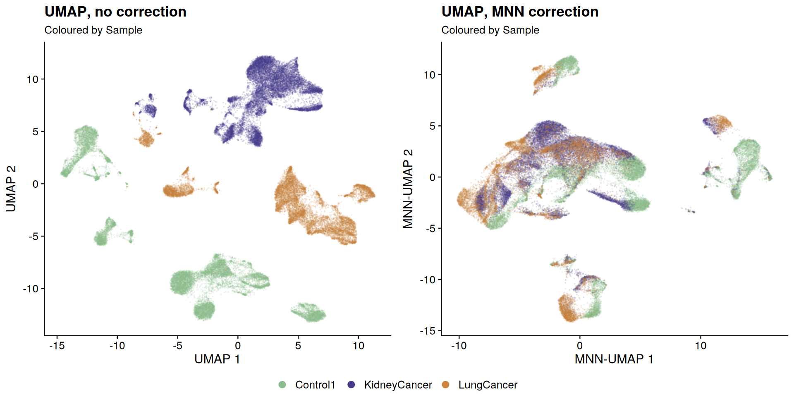
    


```R
fig(width = 16, height = 8)
plotProjections(combined, "CellType", dimnames = c("UMAP", "MNN-UMAP"), feat_desc = "Cell Type", 
                feat_color = c_celltype_col, guides_size = 4, point_size = 0.1, point_alpha = 0.1,
                legend_pos = "bottom", guides_nrow = 1, titles = c("UMAP, no correction","UMAP, MNN correction"))
reset.fig()
```


    
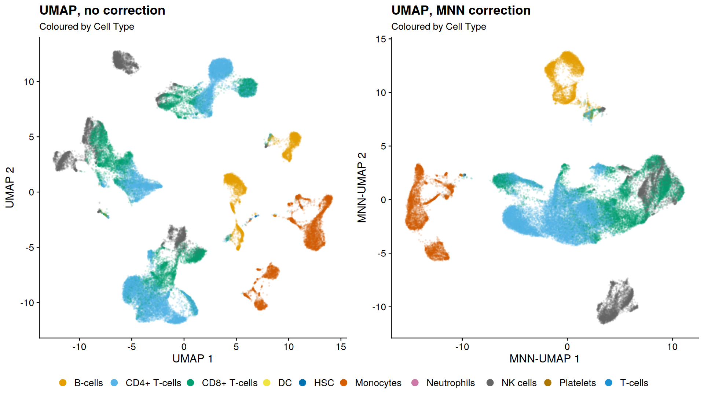
    


### Colour cells by... 

#### Library size `log10Sum`


```R
bk <- seq(min(combined$log10Sum), max(combined$log10Sum), max(combined$log10Sum)/20)
bk <- round(bk, 2)

fig(width = 16, height = 8)
plotProjections(combined, "log10Sum", dimnames = c("MNN-TSNE","MNN-UMAP"), feat_desc = "log10(Sum)", 
                feat_color = rev(rainbow(5)), color_breaks = bk, point_size = 0.1, point_alpha = 0.1, 
                guides_barheight = 20)
reset.fig()
```


    
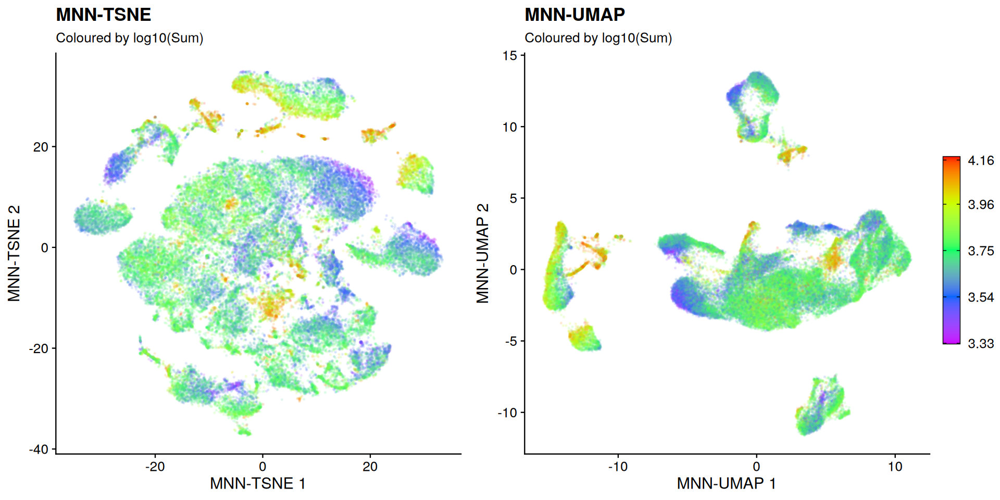
    


#### Doublet score `DoubletDensity`


```R
combined$DoubletDensity <- unlist(lapply(all.common.normed, function(x) metadata(x)[['DoubletDensity']]))

fig(width = 16, height = 8)
plotProjections(combined, I(log1p(combined$DoubletDensity)), c("MNN-TSNE","MNN-UMAP"), 
                feat_desc = "Doublet Score (log1p)", feat_color = c_heatmap_col1, 
                point_size = 0.1, point_alpha = 0.1)
reset.fig()
```


    
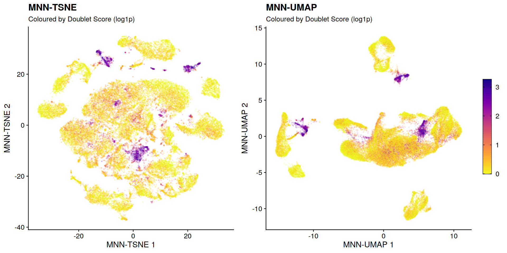
    


# 5 - Cell clustering

Here, we recommend using any or all of graph-based methods, for example **Walktrap**, **Louvain** and **Leiden** algorithms, for cell clustering.

Also, to consider a <strong>2-pass clustering procedure</strong>. A one-time clustering on the full dataset might not yield the desired resolution or subclusters. For a two-step process, first, the cells are separated into smaller subsets based on a initial round of coarse-grain clustering. Then, a second round of clustering is performed on each subset. Finally the clustering results are combined and stored into the full object <code>combined</code>.

Below shows examples of uring `clusterRows()` function to perform the 3 clustering methods. Edit the workflow to perform clustering as one sees fit.

```
set.seed(12345)

# walktrap
clusterRows(mat, full = TRUE, 
            NNGraphParam(cluster.fun = "walktrap", k = k, type = "rank", # default in scran
                         BNPARAM = AnnoyParam(), num.threads = nthreads))

# louvain
clusterRows(mat, full = TRUE, 
            NNGraphParam(cluster.fun = "louvain", k = k, type = "jaccard", # default in Seurat
                         cluster.args = list(resolution = 1),
                         BNPARAM = AnnoyParam(), num.threads = nthreads))

# leiden
clusterRows(mat, full = TRUE, 
            NNGraphParam(cluster.fun = "leiden", k = k, 
                         cluster.args = list(resolution_parameter = 1),
                         BNPARAM = AnnoyParam(), num.threads = nthreads))
```


```R
# Stores clustering labels
my.clusters <- vector(mode = "list")
communities <- vector(mode = "list")
```

## First-pass clustering

Here, we use the faster **Leiden** algorithm to perform a quick coarse clustering.


```R
method <- "leiden"
dimname <- "MNN" # or "PCA" without batch correction
n_dimred <- 20 # number of dimensions to use; default is 50
k <- 15

mat <- reducedDim(combined, dimname)[, seq_len(n_dimred), drop = FALSE]

set.seed(12345)
communities[[method]][[dimname]] <- clusterRows(mat, full = TRUE,
                                                NNGraphParam(cluster.fun = method, k = k, 
                                                             cluster.args = list(resolution_parameter = 0.01),
                                                             BNPARAM = AnnoyParam(), num.threads = nthreads))
my.clusters[[method]][[dimname]] <- factor(communities[[method]][[dimname]]$clusters)
```


```R
print(sprintf("%s cluster assignments from %s:", stringr::str_to_title(method), dimname))
table(colData(combined)$Sample, my.clusters[[method]][[dimname]])
plotSilhouette(mat, my.clusters[[method]][[dimname]], printDiff = FALSE, plot = FALSE)

combined$first.pass <- my.clusters[[method]][[dimname]]
```

    [1] "Leiden cluster assignments from MNN:"


                  
                      1    2    3    4    5    6    7    8    9   10   11   12   13
      Control1      328 5472 2714 1415 1613  501 3425  470 2012  313   82  112    3
      KidneyCancer  208 1965 7401 2824  655  155  111 2381  285   23   23  600  537
      LungCancer    274  383 3479 3078 2053   69   77 2112 1279   16    8  463  746


    Silhouette width summary:


       Min. 1st Qu.  Median    Mean 3rd Qu.    Max. 
    -0.4767  0.1122  0.2270  0.2276  0.3702  0.6367 


### (Optional) Remove randomly scattered cells that have high `DoubletDensity` scores

If there are many cells with high doublet scores randomly scattered on the dimensionality reduction plots (i.e. TSNE or UMAP), we can choose to do a round of doublet cell cleaning now. *The aim is to NOT remove doublet cluster(s).*

<div style="width: 100%; height: 25px; border-bottom: 1px dashed black; text-align: center">
    <span style="font-size: 20px; background-color: yellow; padding: 0 10px;">Begin Optional Step (remove doublet cells)</span>
</div>


```R
fig(width = 16, height = 8)
plotProjections(combined, I(log1p(combined$DoubletDensity)), c("MNN-TSNE","MNN-UMAP"), 
                feat_desc = "Doublet Score (log1p)", feat_color = c_heatmap_col1, text_by = "first.pass", 
                point_size = 0.1, point_alpha = 0.1)
reset.fig()
```


    
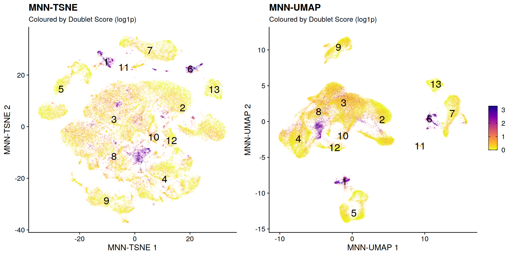
    


#### Define per-sample per-cluster `DoubletDensity` score upperbound thresholds


```R
# Upper limit/outlier: 75% quantile + (IQR * 3)
upper <- as.data.frame(colData(combined)[,c("Sample","first.pass","DoubletDensity")]) %>% 
    group_by(Sample, first.pass) %>% 
    reframe(iqr = iqr(log1p(DoubletDensity)), 
            enframe(quantile(log1p(DoubletDensity), c(0.25, 0.5, 0.75)), "quantile", "Score")) %>% 
    filter(quantile == "75%") %>% mutate(upper = iqr * 3 + Score) %>% arrange(Sample, first.pass)
head(upper)
```


<table class="dataframe">
<caption>A tibble: 6 × 6</caption>
<thead>
	<tr><th scope=col>Sample</th><th scope=col>first.pass</th><th scope=col>iqr</th><th scope=col>quantile</th><th scope=col>Score</th><th scope=col>upper</th></tr>
	<tr><th scope=col>&lt;fct&gt;</th><th scope=col>&lt;fct&gt;</th><th scope=col>&lt;dbl&gt;</th><th scope=col>&lt;chr&gt;</th><th scope=col>&lt;dbl&gt;</th><th scope=col>&lt;dbl&gt;</th></tr>
</thead>
<tbody>
	<tr><td>Control1</td><td>1</td><td>0.3200037</td><td>75%</td><td>2.3887628</td><td>3.3487739</td></tr>
	<tr><td>Control1</td><td>2</td><td>0.3254224</td><td>75%</td><td>0.3646431</td><td>1.3409103</td></tr>
	<tr><td>Control1</td><td>3</td><td>0.5359616</td><td>75%</td><td>0.6312718</td><td>2.2391566</td></tr>
	<tr><td>Control1</td><td>4</td><td>0.2231436</td><td>75%</td><td>0.2623643</td><td>0.9317949</td></tr>
	<tr><td>Control1</td><td>5</td><td>0.1133287</td><td>75%</td><td>0.1133287</td><td>0.4533147</td></tr>
	<tr><td>Control1</td><td>6</td><td>0.3558069</td><td>75%</td><td>2.5771819</td><td>3.6446026</td></tr>
</tbody>
</table>


```R
doublets <- as.data.frame(colData(combined)[,c("Sample","first.pass","DoubletDensity")]) %>%
    rownames_to_column("Barcode") %>% left_join(upper[,c("Sample","first.pass","upper")]) %>%
    filter(log1p(DoubletDensity) > upper)
head(doublets)

table("Is doublet" = colnames(combined) %in% doublets$Barcode)
```

    Joining with `by = join_by(Sample, first.pass)`


<table class="dataframe">
<caption>A data.frame: 6 × 5</caption>
<thead>
	<tr><th></th><th scope=col>Barcode</th><th scope=col>Sample</th><th scope=col>first.pass</th><th scope=col>DoubletDensity</th><th scope=col>upper</th></tr>
	<tr><th></th><th scope=col>&lt;chr&gt;</th><th scope=col>&lt;fct&gt;</th><th scope=col>&lt;fct&gt;</th><th scope=col>&lt;dbl&gt;</th><th scope=col>&lt;dbl&gt;</th></tr>
</thead>
<tbody>
	<tr><th scope=row>1</th><td>Control1_AAATCCTTCATCAGCCACTTTAGG-1</td><td>Control1</td><td>12</td><td>0.74</td><td>0.4533147</td></tr>
	<tr><th scope=row>2</th><td>Control1_AACCAGGTCATGGAACACTTTAGG-1</td><td>Control1</td><td>2 </td><td>4.74</td><td>1.3409103</td></tr>
	<tr><th scope=row>3</th><td>Control1_AACCATAAGAGGCGGAACTTTAGG-1</td><td>Control1</td><td>3 </td><td>9.86</td><td>2.2391566</td></tr>
	<tr><th scope=row>4</th><td>Control1_AACCATAAGCTTATCGACTTTAGG-1</td><td>Control1</td><td>9 </td><td>3.16</td><td>0.8697782</td></tr>
	<tr><th scope=row>5</th><td>Control1_AACCATTTCGCGGATAACTTTAGG-1</td><td>Control1</td><td>9 </td><td>2.44</td><td>0.8697782</td></tr>
	<tr><th scope=row>6</th><td>Control1_AACCATTTCTAATGAGACTTTAGG-1</td><td>Control1</td><td>4 </td><td>1.84</td><td>0.9317949</td></tr>
</tbody>
</table>


    Is doublet
    FALSE  TRUE 
    48584  1081 


```R
fig(width = 16, height = 8)
plotProjections(combined, colnames(combined) %in% doublets$Barcode, c("MNN-TSNE","MNN-UMAP"), 
                feat_desc = "Doublets to be removed", feat_color = c("yellow","red"), 
                point_size = 0.1, point_alpha = 0.1, guides_size = 4, rel_widths = c(9, 1))
reset.fig()
```


    
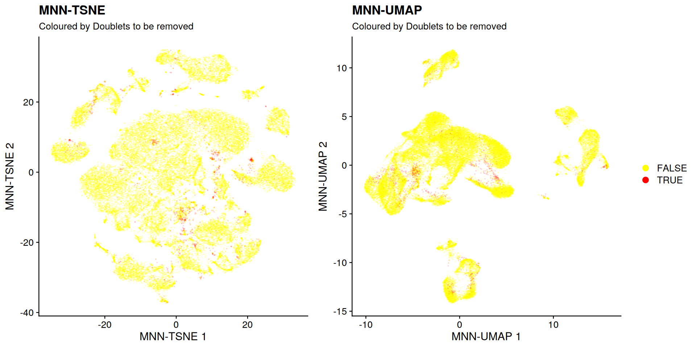
    


#### Remove marked doublet cells and re-do `runTSNE`and `runUMAP`


```R
combined <- combined[, !colnames(combined) %in% doublets$Barcode]
combined
```


    class: SingleCellExperiment 
    dim: 18129 48584 
    metadata(24): Control1_Samples Control1_cyclone ... LungCancer_DoubletDensity LungCancer_runInfo
    assays(2): counts logcounts
    rownames(18129): SAMD11 NOC2L ... MT-ND6 MT-CYB
    rowData names(6): ID Symbol ... is_mito is_hvg
    colnames(48584): Control1_AAACAAGCAACAAGTTACTTTAGG-1 Control1_AAACAAGCAACTAGTGACTTTAGG-1 ...
      LungCancer_TTTGTGAGTTGAGTCTAGCTGTGA-1 LungCancer_TTTGTGAGTTTACGACAGCTGTGA-1
    colData names(13): Sample Barcode ... DoubletDensity first.pass
    reducedDimNames(6): PCA TSNE ... MNN-TSNE MNN-UMAP
    mainExpName: Gene Expression
    altExpNames(1): Antibody Capture


```R
set.seed(12345)
combined <- runTSNE(combined, dimred = "MNN", name = "MNN-TSNE", n_dimred = 30, 
                    n_threads = nthreads, BPPARAM = bpp)
```


```R
set.seed(12345)
combined <- runUMAP(combined, dimred = "MNN", name = "MNN-UMAP", n_dimred = 30, 
                    n_neighbors = 30, spread = 1, min_dist = 0.3, n_threads = nthreads, BPPARAM = bpp)
```

#### Re-run first-pass clustering using Leiden algorithm


```R
method <- "leiden"
dimname <- "MNN" # or "PCA" without batch correction
n_dimred <- 50 # number of dimensions to use; default is 50
k <- 10

mat <- reducedDim(combined, dimname)[, seq_len(n_dimred), drop = FALSE]

set.seed(12345)
communities[[method]][[dimname]] <- clusterRows(mat, full = TRUE,
                                                NNGraphParam(cluster.fun = method, k = k, 
                                                             cluster.args = list(resolution_parameter = 0.01),
                                                             BNPARAM = AnnoyParam(), num.threads = nthreads))
my.clusters[[method]][[dimname]] <- factor(communities[[method]][[dimname]]$clusters)
```


```R
print(sprintf("%s cluster assignments from %s:", stringr::str_to_title(method), dimname))
table(colData(combined)$Sample, my.clusters[[method]][[dimname]])
plotSilhouette(mat, my.clusters[[method]][[dimname]], printDiff = FALSE, plot = FALSE)

combined$first.pass <- my.clusters[[method]][[dimname]]
```

    [1] "Leiden cluster assignments from MNN:"


                  
                      1    2    3    4    5    6    7    8    9   10   11   12   13   14   15   16   17   18   19
      Control1      327 2177 2606 1011 3158  491 1332 2468  547  455 1990  636  326   43   82  289   36  101    3
      KidneyCancer  205  947 4159  174  967  157 1592   50  454 1678  275   33   27 3789   22   23   21  551  526
      LungCancer    269   67 2999 1739  329   70 2200   47  258  648 1244   22   21 1620    8    7   17  455  735
                  
                     20
      Control1       15
      KidneyCancer 1151
      LungCancer    935


    Silhouette width summary:


        Min.  1st Qu.   Median     Mean  3rd Qu.     Max. 
    -0.47202  0.03836  0.12043  0.12744  0.20580  0.63243 


<div style="width: 100%; height: 25px; border-bottom: 1px dashed black; text-align: center">
    <span style="font-size: 20px; background-color: yellow; padding: 0 10px;">End Optional Step (remove doublet cells)</span>
</div>


```R
p1 <- plotProjections(combined, "CellType", dimnames = c("MNN-TSNE", "MNN-UMAP"), feat_desc = "Cell Type", 
                      feat_color = c_celltype_col, text_by = "first.pass", point_size = 0.1, point_alpha = 0.1, 
                      legend_pos = "none", add_void = TRUE)

p2 <- plotProjections(combined, "first.pass", dimnames = c("MNN-TSNE", "MNN-UMAP"), feat_desc = method, 
                      feat_color = c30(), text_by = "first.pass", point_size = 0.1, point_alpha = 0.1,
                      guides_size = 4)

fig(width = 16, height = 15)
plot_grid(p1, p2, ncol = 1)
reset.fig()
```


    
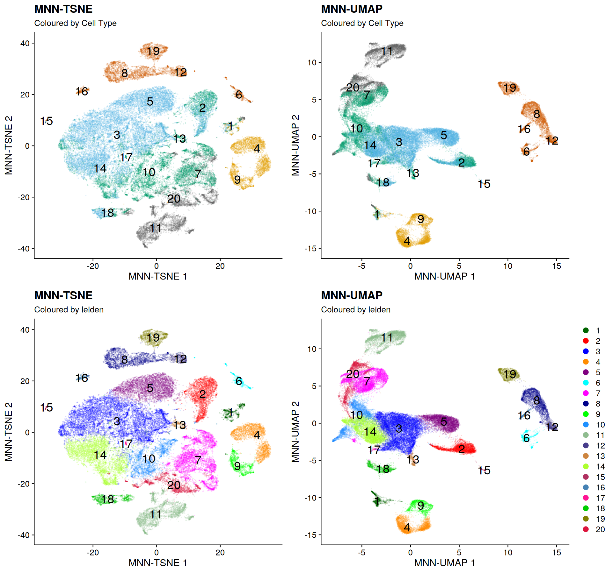
    


## Create subsets

You may divide your cells into subsets containing fewer clusters.

In this example, we create 3 subsets:

<div class="alert alert-info">
    <ul>
        <li>Subset 1: 2, 7, 10, 18, 20</li>
        <li>Subset 2: 3, 5, 14, 17</li>
        <li>Subset 3: 1, 4, 6, 8, 9, 11, 12, 13, 15, 16, 19</li>
    </ul>
</div>

### Create TSNE & UMAP (Subset 1)


```R
subset1 <- combined[, combined$first.pass %in% c(2, 7, 10, 18, 20)]
colData(subset1) <- droplevels(colData(subset1))
dim(subset1)

set.seed(12345)
subset1 <- runTSNE(subset1, dimred = "MNN", name = "MNN-TSNE", n_dimred = 50, n_threads = nthreads, BPPARAM = bpp)

set.seed(12345)
subset1 <- runUMAP(subset1, dimred = "MNN", name = "MNN-UMAP", n_dimred = 50, 
                   n_neighbors = 30, spread = 1, min_dist = 0.3, n_threads = nthreads, BPPARAM = bpp)

p1 <- plotProjections(subset1, "first.pass", dimnames = c("MNN-TSNE", "MNN-UMAP"), feat_desc = "Cluster", 
                      feat_color = c30(), text_by = "first.pass", point_size = 0.1, point_alpha = 0.1, 
                      guides_size = 4, rel_widths = c(8,1))

p2 <- plotProjections(subset1, "CellCycle", dimnames = c("MNN-TSNE", "MNN-UMAP"), feat_desc = "Cell Cycle", 
                      feat_color = c_phase_col, text_by = "first.pass", point_size = 0.1, point_alpha = 0.1,
                      guides_size = 4, rel_widths = c(8,1))

fig(width = 16, height = 15)
plot_grid(p1, p2, ncol = 1)
reset.fig()
```


<style>
.list-inline {list-style: none; margin:0; padding: 0}
.list-inline>li {display: inline-block}
.list-inline>li:not(:last-child)::after {content: "\00b7"; padding: 0 .5ex}
</style>
<ol class=list-inline><li>18129</li><li>14304</li></ol>


    
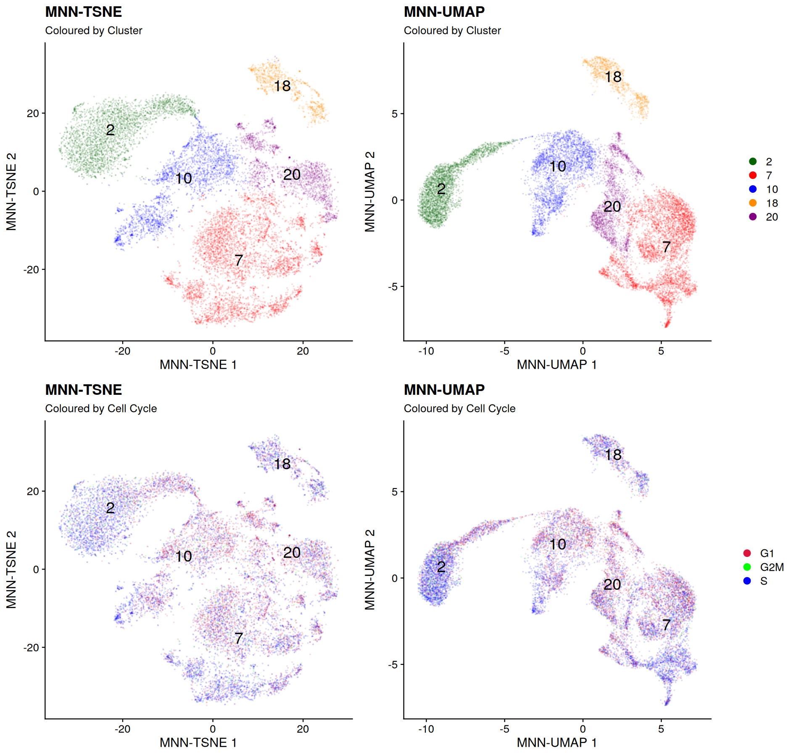
    


### Create TSNE & UMAP (Subset 2)


```R
subset2 <- combined[, combined$first.pass %in% c(3, 5, 14, 17)]
colData(subset2) <- droplevels(colData(subset2))
dim(subset2)

set.seed(12345)
subset2 <- runTSNE(subset2, dimred = "MNN", name = "MNN-TSNE", n_dimred = 50, n_threads = nthreads, BPPARAM = bpp)

set.seed(12345)
subset2 <- runUMAP(subset2, dimred = "MNN", name = "MNN-UMAP", n_dimred = 50, 
                   n_neighbors = 30, spread = 1, min_dist = 0.3, n_threads = nthreads, BPPARAM = bpp)

p1 <- plotProjections(subset2, "first.pass", dimnames = c("MNN-TSNE", "MNN-UMAP"), feat_desc = "Cluster", 
                      feat_color = c30(), text_by = "first.pass", point_size = 0.1, point_alpha = 0.1, 
                      guides_size = 4, rel_widths = c(8,1))

p2 <- plotProjections(subset2, "CellCycle", dimnames = c("MNN-TSNE", "MNN-UMAP"), feat_desc = "Cell Cycle", 
                      feat_color = c_phase_col, text_by = "first.pass", point_size = 0.1, point_alpha = 0.1, 
                      guides_size = 4, rel_widths = c(8,1))

fig(width = 16, height = 15)
plot_grid(p1, p2, ncol = 1)
reset.fig()
```


<style>
.list-inline {list-style: none; margin:0; padding: 0}
.list-inline>li {display: inline-block}
.list-inline>li:not(:last-child)::after {content: "\00b7"; padding: 0 .5ex}
</style>
<ol class=list-inline><li>18129</li><li>19744</li></ol>


    
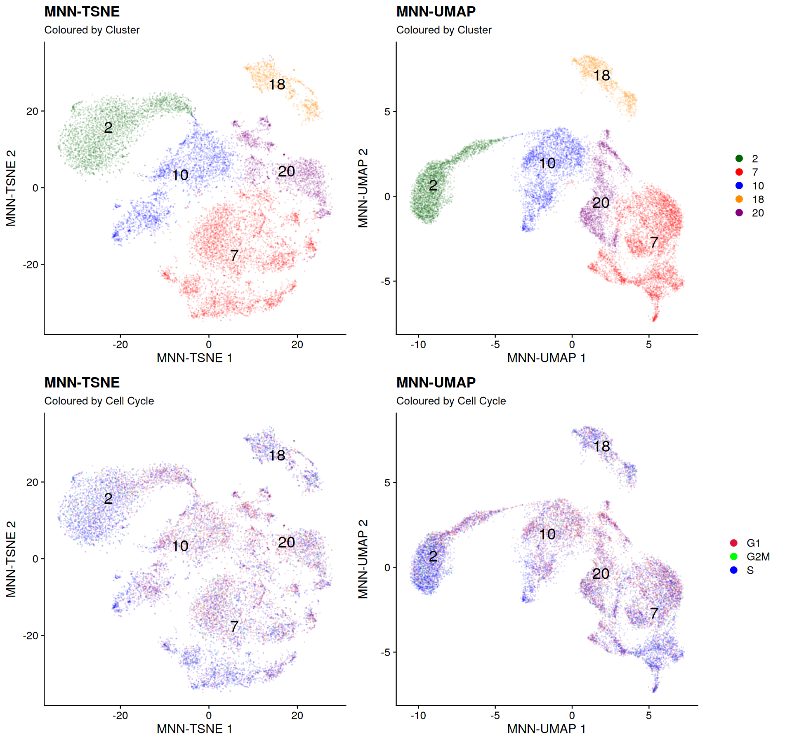
    


### Create TSNE & UMAP (Subset 3)


```R
subset3 <- combined[, combined$first.pass %in% c(1, 4, 6, 8, 9, 11, 12, 13, 15, 16, 19)]
colData(subset3) <- droplevels(colData(subset3))
dim(subset3)

set.seed(12345)
subset3 <- runTSNE(subset3, dimred = "MNN", name = "MNN-TSNE", n_dimred = 50, n_threads = nthreads, BPPARAM = bpp)

set.seed(12345)
subset3 <- runUMAP(subset3, dimred = "MNN", name = "MNN-UMAP", n_dimred = 50, 
                   n_neighbors = 30, spread = 1, min_dist = 0.3, n_threads = nthreads, BPPARAM = bpp)

p1 <- plotProjections(subset3, "first.pass", dimnames = c("MNN-TSNE", "MNN-UMAP"), feat_desc = "Cluster", 
                      feat_color = c30(), text_by = "first.pass", point_size = 0.1, point_alpha = 0.1, 
                      guides_size = 4, rel_widths = c(8,1))

p2 <- plotProjections(subset3, "CellCycle", dimnames = c("MNN-TSNE", "MNN-UMAP"), feat_desc = "Cell Cycle", 
                      feat_color = c_phase_col, text_by = "first.pass", point_size = 0.1, point_alpha = 0.1,
                      guides_size = 4, rel_widths = c(8,1))

fig(width = 16, height = 15)
plot_grid(p1, p2, ncol = 1)
reset.fig()
```


<style>
.list-inline {list-style: none; margin:0; padding: 0}
.list-inline>li {display: inline-block}
.list-inline>li:not(:last-child)::after {content: "\00b7"; padding: 0 .5ex}
</style>
<ol class=list-inline><li>18129</li><li>14536</li></ol>


    
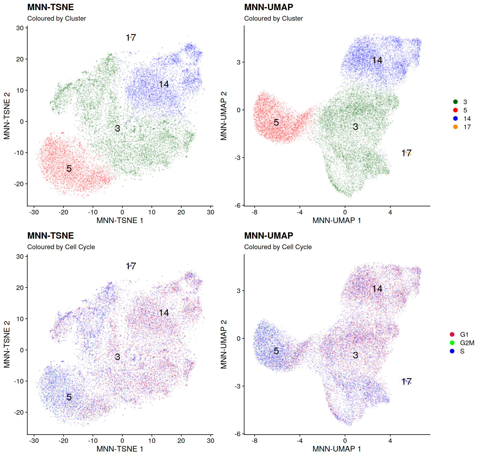
    


## Second-pass clustering

Here, we use the **Louvain** algorithm to perform clustering, but feel free to use different clustering algorithms that suit your dataset

**Subset 1**


```R
method <- "louvain"
dimname <- "MNN" # or "PCA" without batch correction
n_dimred <- 20 # number of dimensions to use; default is 50
k <- 15

mat <- reducedDim(subset1, dimname)[, seq_len(n_dimred), drop = FALSE]

set.seed(12345)
communities[[method]][[dimname]] <- clusterRows(mat, full = TRUE,
                                                NNGraphParam(cluster.fun = method, k = k, type = "jaccard", 
                                                             cluster.args = list(resolution = 2.5), 
                                                             BNPARAM = AnnoyParam(), num.threads = nthreads))
my.clusters[[method]][[dimname]] <- factor(communities[[method]][[dimname]]$clusters)
```


```R
print(sprintf("%s cluster assignments from %s:", stringr::str_to_title(method), dimname))
table(colData(subset1)$Sample, my.clusters[[method]][[dimname]])
plotSilhouette(mat, my.clusters[[method]][[dimname]], printDiff = FALSE, plot = FALSE)

subset1$merged.louvain <- my.clusters[[method]][[dimname]]
```

    [1] "Louvain cluster assignments from MNN:"


                  
                      1    2    3    4    5    6    7    8    9   10   11   12   13   14   15   16   17   18   19
      Control1      534 1052  572  649  121  117  260  420   54   91   21   29    4   72    4   16   34   17    7
      KidneyCancer   26   25  344   16  399    1   23   13  498  189  887    8  416  403  566  890  542   45  233
      LungCancer      2    5   12   72   84    9    9   32   92  157  166  426  290  315   50   93  371  208  228
                  
                     20   21   22   23   24   25
      Control1        2    2    2    0    0    0
      KidneyCancer   25  114  193   58    5    0
      LungCancer    702  148   73  370  253  138


    Silhouette width summary:


         Min.   1st Qu.    Median      Mean   3rd Qu.      Max. 
    -0.506687  0.006988  0.113495  0.098712  0.198879  0.454367 


<div class="alert alert-warning">
  <strong>Note!</strong> After partially running the workflow, usually after preliminary manual curation of per-cluster cell types, you may want/need to come back to this stage to fine-tune the clusters.
</div>

Example of changing pre-defined clusters, we:
- merge clusters 1, 2 and 3, which are **naive CD8 T cells**
- merge clusters 15 and 20, which are **activated CD8(hi) T**


```R
levels(subset1$merged.louvain)[c(2, 3)] <- 1
levels(subset1$merged.louvain)[20] <- 15
levels(subset1$merged.louvain) <- seq(1:nlevels(subset1$merged.louvain))
table(subset1$condition, subset1$merged.louvain)
```


             
                 1    2    3    4    5    6    7    8    9   10   11   12   13   14   15   16   17   18   19   20
      Control 2158  649  121  117  260  420   54   91   21   29    4   72    6   16   34   17    7    2    2    0
      Cancer   414   88  483   10   32   45  590  346 1053  434  706  718  882  983  913  253  461  727  262  428
             
                21   22
      Control    0    0
      Cancer   258  138


```R
p1 <- plotProjections(subset1, "merged.louvain", dimnames = c("MNN-TSNE", "MNN-UMAP"), feat_desc = "Cluster", 
                      feat_color = c30(), text_by = "merged.louvain", point_size = 0.3, point_alpha = 0.1,
                      guides_size = 4, rel_widths = c(8,1))

p2 <- plotProjections(subset1, "CellCycle", dimnames = c("MNN-TSNE", "MNN-UMAP"), feat_desc = "Cell Cycle", 
                      feat_color = c_phase_col, text_by = "merged.louvain", point_size = 0.3, point_alpha = 0.1,
                      guides_size = 4, rel_widths = c(8,1))

fig(width = 16, height = 15)
plot_grid(p1, p2, ncol = 1)
reset.fig()
```


    
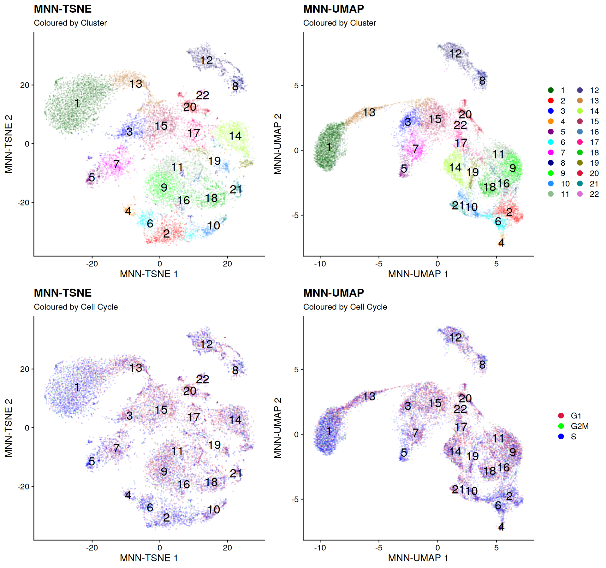
    


**Subset 2**


```R
method <- "louvain"
dimname <- "MNN" # or "PCA" without batch correction
n_dimred <- 50 # number of dimensions to use; default is 50
k <- 10

mat <- reducedDim(subset2, dimname)[, seq_len(n_dimred), drop = FALSE]

set.seed(12345)
communities[[method]][[dimname]] <- clusterRows(mat, full = TRUE,
                                                NNGraphParam(cluster.fun = method, k = k, type = "jaccard", 
                                                             cluster.args = list(resolution = 0.8), 
                                                             BNPARAM = AnnoyParam(), num.threads = nthreads))
my.clusters[[method]][[dimname]] <- factor(communities[[method]][[dimname]]$clusters)
```


```R
print(sprintf("%s cluster assignments from %s:", stringr::str_to_title(method), dimname))
table(colData(subset2)$Sample, my.clusters[[method]][[dimname]])
plotSilhouette(mat, my.clusters[[method]][[dimname]], printDiff = FALSE, plot = FALSE)

subset2$merged.louvain <- my.clusters[[method]][[dimname]]
```

    [1] "Louvain cluster assignments from MNN:"


                  
                      1    2    3    4    5    6    7    8    9
      Control1     2054 3152  353   13   22  196   37   16    0
      KidneyCancer  231  966  469  841 2898 1065   21 1205 1240
      LungCancer    173  311  597 1300  320  669   18  820  757


    Silhouette width summary:


        Min.  1st Qu.   Median     Mean  3rd Qu.     Max. 
    -0.26903  0.03060  0.09698  0.09755  0.16908  0.32973 


<div class="alert alert-warning">
  <strong>Note!</strong> After partially running the workflow, usually after preliminary manual curation of per-cluster cell types, you may want/need to come back to this stage to fine-tune the clusters.
</div>

Example of changing pre-defined clusters, we:
- merge clusters 6 and 9, which are **ICOS(hi) Momory CD4+ T**


```R
levels(subset2$merged.louvain)[9] <- 6
levels(subset2$merged.louvain) <- seq(1:nlevels(subset2$merged.louvain))
table(subset2$condition, subset2$merged.louvain)
```


             
                 1    2    3    4    5    6    7    8
      Control 2054 3152  353   13   22  196   37   16
      Cancer   404 1277 1066 2141 3218 3731   39 2025


```R
p1 <- plotProjections(subset2, "merged.louvain", dimnames = c("MNN-TSNE", "MNN-UMAP"), feat_desc = "Cluster", 
                      feat_color = c30(), text_by = "merged.louvain", point_size = 0.1, point_alpha = 0.1,
                      guides_size = 4, rel_widths = c(8,1))

p2 <- plotProjections(subset2, "CellCycle", dimnames = c("MNN-TSNE", "MNN-UMAP"), feat_desc = "Cell Cycle", 
                      feat_color = c_phase_col, text_by = "merged.louvain", point_size = 0.1, point_alpha = 0.1, 
                      guides_size = 4, rel_widths = c(8,1))

fig(width = 16, height = 15)
plot_grid(p1, p2, ncol = 1)
reset.fig()
```


    
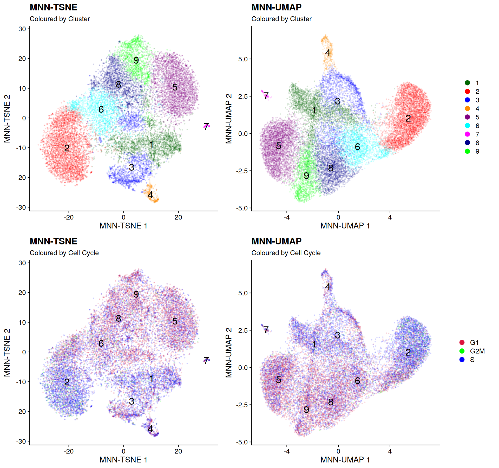
    


**Subset 3**


```R
method <- "louvain"
dimname <- "MNN" # or "PCA" without batch correction
n_dimred <- 50 # number of dimensions to use; default is 50
k <- 10

mat <- reducedDim(subset3, dimname)[, seq_len(n_dimred), drop = FALSE]

set.seed(12345)
communities[[method]][[dimname]] <- clusterRows(mat, full = TRUE,
                                                NNGraphParam(cluster.fun = method, k = k, type = "jaccard", 
                                                             cluster.args = list(resolution = 1.25), 
                                                             BNPARAM = AnnoyParam(), num.threads = nthreads))
my.clusters[[method]][[dimname]] <- factor(communities[[method]][[dimname]]$clusters)
```


```R
print(sprintf("%s cluster assignments from %s:", stringr::str_to_title(method), dimname))
table(colData(subset3)$Sample, my.clusters[[method]][[dimname]])
plotSilhouette(mat, my.clusters[[method]][[dimname]], printDiff = FALSE, plot = FALSE)

subset3$merged.louvain <- my.clusters[[method]][[dimname]]
```

    [1] "Louvain cluster assignments from MNN:"


                  
                      1    2    3    4    5    6    7    8    9   10   11   12   13   14   15   16   17   18   19
      Control1      327 1002  409 1286  318 1165 1520  646  327  144   81  177  297  232   82    6  148    3    0
      KidneyCancer  205    1  144    5  339   33   15   45   27  180   22   75   23  118   11  171    5  527    0
      LungCancer    271   67   56   23  185   22   89   23   20  781    8  206    7   76   14 1667   12  736  157


    Silhouette width summary:


       Min. 1st Qu.  Median    Mean 3rd Qu.    Max. 
    -0.4167  0.1140  0.2067  0.1960  0.2858  0.5548 


<div class="alert alert-warning">
  <strong>Note!</strong> After partially running the workflow, usually after preliminary manual curation of per-cluster cell types, you may want/need to come back to this stage to fine-tune the clusters.
</div>

Example of changing pre-defined clusters, we: 
- merge clusters of **NK cells**.


```R
levels(subset3$merged.louvain)[c(10, 12, 17)] <- 7
levels(subset3$merged.louvain) <- seq(1:nlevels(subset3$merged.louvain))
table(subset3$condition, subset3$merged.louvain)
```


             
                 1    2    3    4    5    6    7    8    9   10   11   12   13   14   15   16
      Control  327 1002  409 1286  318 1165 1989  646  327   81  297  232   82    6    3    0
      Cancer   476   68  200   28  524   55 1363   68   47   30   30  194   25 1838 1263  157


```R
p1 <- plotProjections(subset3, "merged.louvain", dimnames = c("MNN-TSNE", "MNN-UMAP"), feat_desc = "Cluster", 
                      feat_color = c30(), text_by = "merged.louvain", point_size = 0.1, point_alpha = 0.1,
                      guides_size = 4, rel_widths = c(8,1))

p2 <- plotProjections(subset3, "CellCycle", dimnames = c("MNN-TSNE", "MNN-UMAP"), feat_desc = "Cell Cycle", 
                      feat_color = c_phase_col, text_by = "merged.louvain", point_size = 0.1, point_alpha = 0.1, 
                      guides_size = 4, rel_widths = c(8,1))

fig(width = 16, height = 15)
plot_grid(p1, p2, ncol = 1)
reset.fig()
```


    
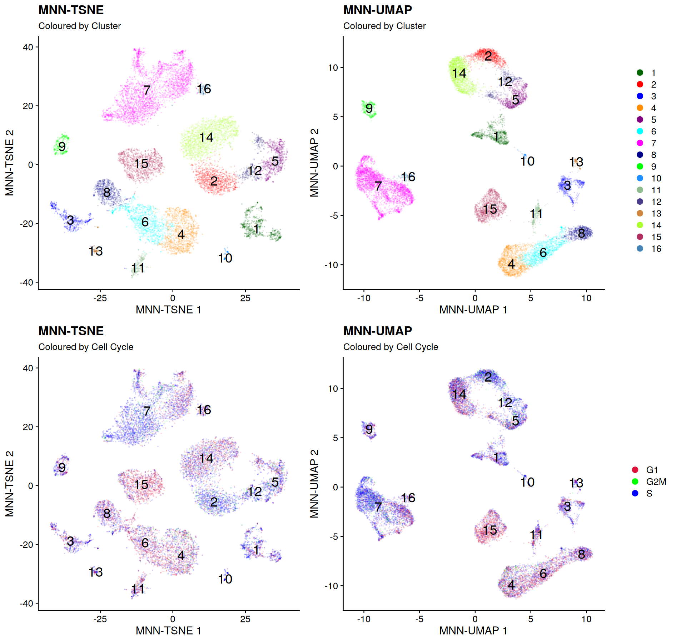
    


## Add assigned clusters to `sce` objects

Choose the desired clustering result and assign to the default "label" column using the `colLabels` function.


```R
# Combine cluster labels from all subsets
# Assign temporary IDs for now
combined$merged.louvain <- rbind(colData(subset1)[, c("Barcode","merged.louvain")] %>% as.data.frame %>% 
                                 mutate(merged.louvain = paste0("a", merged.louvain)), 
                                 colData(subset2)[, c("Barcode","merged.louvain")] %>% as.data.frame %>% 
                                 mutate(merged.louvain = paste0("b", merged.louvain)), 
                                 colData(subset3)[, c("Barcode","merged.louvain")] %>% as.data.frame %>% 
                                 mutate(merged.louvain = paste0("c", merged.louvain)))[colnames(combined),"merged.louvain"]
combined$merged.louvain <- factor(combined$merged.louvain, 
                                  levels = gtools::mixedsort(unique(combined$merged.louvain)))
colLabels(combined) <- combined$merged.louvain
```

### Rename and reorder clusters

<div class="alert alert-warning">
    <strong>Skip this step in the initial run!</strong>
    <br />Come back and run this step after cell clusters of the same "coarse cell type" and/or lineage are identified preliminarily. We do this so that the clusters of the same "<i>type</i>" are in sequential order by their cluster number.    
</div>


```R
levels(colLabels(combined)) <- c(10, 21, 12, 22, 43, 20, 42, 41, 8, 17, 25, 40, 11, 19, 13, 24, 14, 9, 
                                 16, 26, 18, 15, 6, 1, 7, 5, 4, 2, 29, 3, 44, 30, 45, 34, 33, 35, 27, 
                                 36, 23, 39, 38, 32, 46, 31, 37, 28)
colLabels(combined) <- factor(colLabels(combined), levels = gtools::mixedsort(levels(colLabels(combined))))
```


```R
# Set colours for cell clusters
c_clust_col <- choosePalette(colLabels(combined), 
                             # more than 40 clusters
                             pals::kovesi.rainbow_bgyrm_35_85_c69(nlevels(colLabels(combined))))
```

### Print number and percentage of cells


```R
table_samples_by_clusters <- table(Sample = combined$Sample, Cluster = combined$label)
table_samples_by_clusters
```


                  Cluster
    Sample            1    2    3    4    5    6    7    8    9   10   11   12   13   14   15   16   17   18   19
      Control1     3152  196   16   22   13 2054  353   21    2 2158    6  121   34    7    0    2   29    0   16
      KidneyCancer  966 2305 1205 2898  841  231  469  887   25  395  759  399  542  233    0  114    8    5  890
      LungCancer    311 1426  820  320 1300  173  597  166  702   19  123   84  371  228  138  148  426  253   93
                  Cluster
    Sample           20   21   22   23   24   25   26   27   28   29   30   31   32   33   34   35   36   37   38
      Control1      420  649  117  327   17    4    0 1989    0   37 1002    6  232  318 1286 1165  646    3  297
      KidneyCancer   13   16    1   27   45  416   58  275    0   21    1  171  118  339    5   33   45  527   23
      LungCancer     32   72    9   20  208  290  370 1088  157   18   67 1667   76  185   23   22   23  736    7
                  Cluster
    Sample           39   40   41   42   43   44   45   46
      Control1       81   72   91   54  260  327  409   82
      KidneyCancer   22  403  189  498   23  205  144   11
      LungCancer      8  315  157   92    9  271   56   14


```R
# No. of cells 
fig(width = 16, height = 5)
ggplot(data.frame(table_samples_by_clusters), aes(Sample, Freq, fill = Cluster)) + 
    geom_bar(position = "stack", stat = "identity", linewidth = 0.2, color = "black") + coord_flip() +
    scale_y_continuous("Number of cells", labels = comma) + guides(fill = guide_legend(ncol = 4)) +
    scale_fill_manual(values = c_clust_col) + theme_cowplot(20) + theme(axis.title.y = element_blank())
reset.fig()
```


    
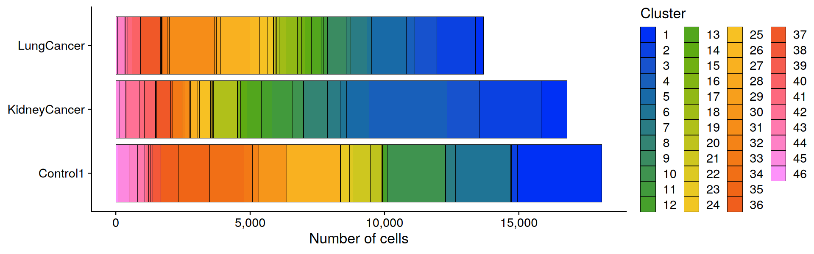
    


```R
# Percenatge cells
fig(width = 16, height = 5)
ggplot(data.frame(table_samples_by_clusters), aes(Sample, Freq, fill = Cluster)) +
    geom_bar(position = "fill", stat = "identity", linewidth = 0.2, color = "black") + coord_flip() +
    scale_y_continuous("Percentage", labels = percent_format()) + guides(fill = guide_legend(ncol = 4)) +
    scale_fill_manual(values = c_clust_col) + theme_cowplot(20) + theme(axis.title.y = element_blank())
reset.fig()
```


    
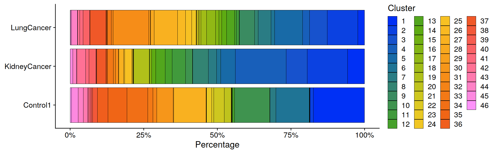
    


## t-SNE and UMAP plots

<div class="alert alert-warning">
    <strong>Warning!</strong> change the <code>dimnames</code> names to view plot in the corresponding reduced dimension results.
</div>


```R
# Coloured by clusters
fig(width = 16, height = 9)
plotProjections(combined, "label", dimnames = c("MNN-TSNE", "MNN-UMAP"), feat_desc = "Cluster", 
                feat_color = c_clust_col, text_by = "label", point_size = 0.1, point_alpha = 0.1,
                text_size = 6, guides_nrow = 3, guides_size = 4, legend_pos = "bottom", rel_heights = c(8,1))
reset.fig()
```


    
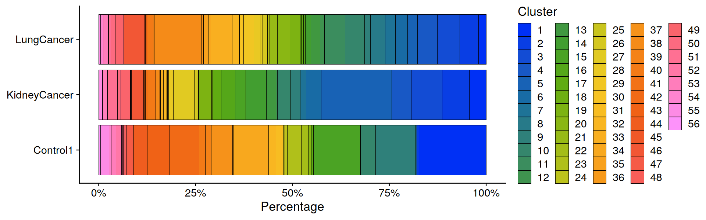
    


```R
bk <- seq(min(combined$log10Sum), max(combined$log10Sum), max(combined$log10Sum)/20)
bk <- round(bk, 2)

# Coloured by log10Sum
fig(width = 16, height = 8)
plotProjections(combined, "log10Sum", dimnames = c("MNN-TSNE", "MNN-UMAP"), feat_desc = "log10(Sum)", 
                feat_color = rev(rainbow(5)), color_breaks = bk, point_size = 0.1, point_alpha = 0.1,
                text_by = "label", text_size = 6, guides_barheight = 20)
reset.fig()
```


    

    


```R
# Coloured by cell cycle phases
fig(width = 16, height = 9)
plotProjections(combined, "CellCycle", dimnames = c("MNN-TSNE", "MNN-UMAP"), feat_desc = "Cell Cycle Phases", 
                feat_color = c_phase_col, text_by = "label", point_size = 0.1, point_alpha = 0.1,
                text_size = 6, guides_nrow = 1, guides_size = 4, legend_pos = "bottom")
reset.fig()
```


    
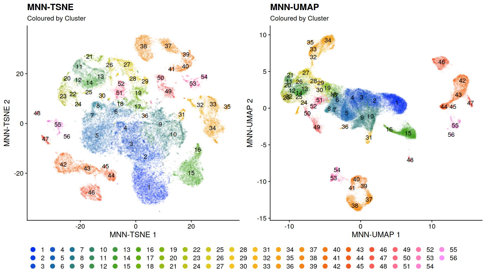
    


```R
fig(width = 16, height = 5)
colData(combined) %>% as.data.frame %>% group_by(label, CellCycle) %>% summarise(counts = n()) %>%
    ggplot(aes(label, counts, fill = CellCycle)) + geom_col(position = "fill") + 
    scale_fill_manual(values = c_phase_col) + theme_cowplot(14) +
    theme(axis.text.x = element_text(angle = 90, hjust = 1, vjust = 0.5))
reset.fig()
```

    `summarise()` has grouped output by 'label'. You can override using the `.groups` argument.


    
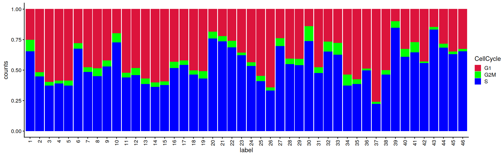
    


```R
# Coloured by samples
fig(width = 16, height = 9)
plotProjections(combined, "Sample", dimnames = c("MNN-TSNE", "MNN-UMAP"), feat_desc = "Sample", 
                feat_color = c_sample_col, text_by = "label", point_size = 0.1, point_alpha = 0.1,
                text_size = 6, guides_nrow = 1, guides_size = 4, legend_pos = "bottom")
reset.fig()
```


    
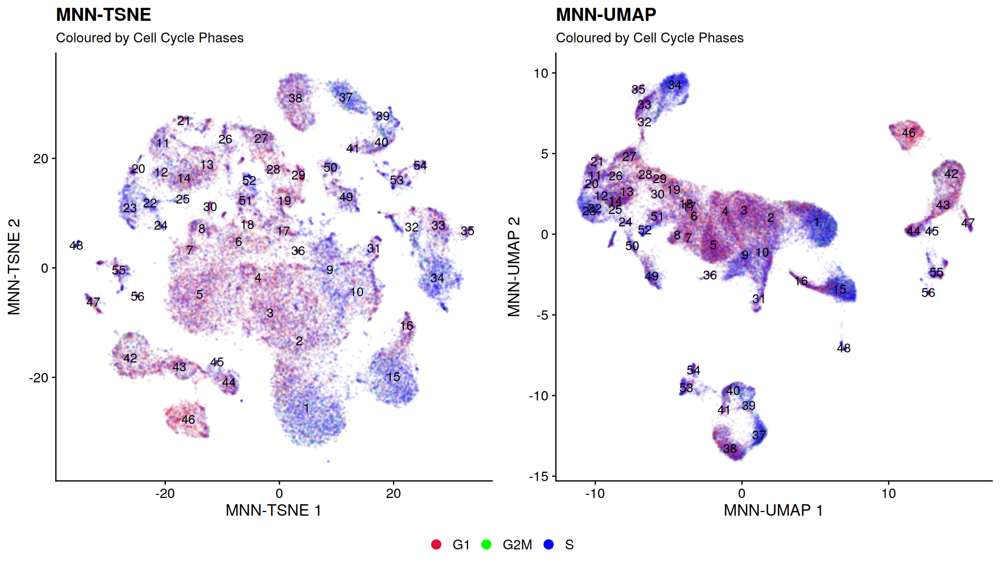
    


```R
fig(width = 16, height = 5)
colData(combined) %>% as.data.frame %>% group_by(label, Sample) %>% summarise(counts = n()) %>%
    ggplot(aes(label, counts, fill = Sample)) + geom_col(position = "fill") + 
    scale_fill_manual(values = c_sample_col) + theme_cowplot(14) +
    theme(axis.text.x = element_text(angle = 90, hjust = 1, vjust = 0.5))
reset.fig()
```

    `summarise()` has grouped output by 'label'. You can override using the `.groups` argument.


    
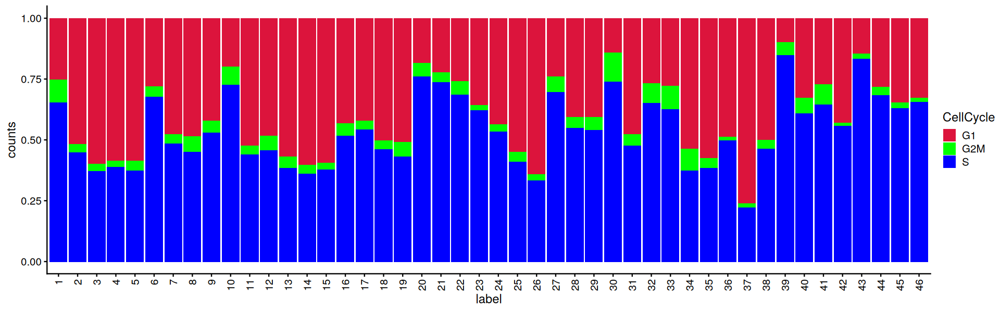
    


```R
# Coloured by condition
fig(width = 16, height = 9)
plotProjections(combined, "condition", dimnames = c("MNN-TSNE", "MNN-UMAP"), feat_desc = "Condition", 
                feat_color = c_cond_col, text_by = "label", point_size = 0.1, point_alpha = 0.1,
                text_size = 6, guides_nrow = 1, guides_size = 4, legend_pos = "bottom")
reset.fig()
```


    
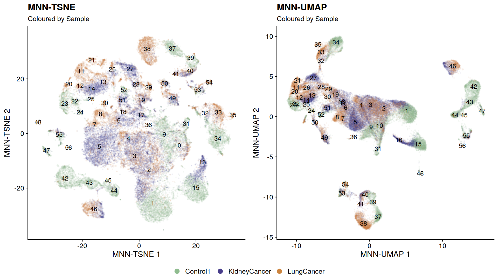
    


```R
fig(width = 16, height = 5)
colData(combined) %>% as.data.frame %>% group_by(label, condition) %>% summarise(counts = n()) %>%
    ggplot(aes(label, counts, fill = condition)) + geom_col(position = "fill") + 
    scale_fill_manual(values = c_cond_col) + theme_cowplot(14) +
    theme(axis.text.x = element_text(angle = 90, hjust = 1, vjust = 0.5))
reset.fig()
```

    `summarise()` has grouped output by 'label'. You can override using the `.groups` argument.


    
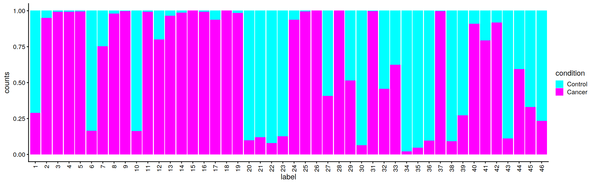
    


```R
# Coloured by cell types
fig(width = 16, height = 9)
plotProjections(combined, "CellType", dimnames = c("MNN-TSNE", "MNN-UMAP"), feat_desc = "Cell Type", 
                feat_color = c_celltype_col, text_by = "label", point_size = 0.1, point_alpha = 0.1,
                text_size = 6, guides_nrow = 1, guides_size = 4, legend_pos = "bottom")
reset.fig()
```


    
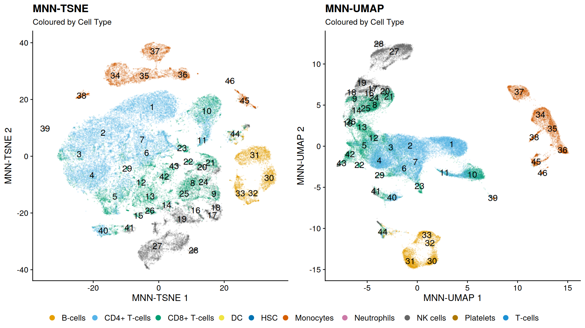
    


```R
table(Cluster = combined$label, CellType = combined$CellType)
```


           CellType
    Cluster B-cells CD4+ T-cells CD8+ T-cells   DC  HSC Monocytes Neutrophils NK cells Platelets T-cells
         1        0         4390           39    0    0         0           0        0         0       0
         2        0         3822          105    0    0         0           0        0         0       0
         3        0         1480          560    0    0         0           0        0         0       1
         4        0         2965          275    0    0         0           0        0         0       0
         5        0          743         1410    0    0         0           0        0         0       1
         6        0         1916          540    0    0         0           0        0         0       2
         7        0         1267          152    0    0         0           0        0         0       0
         8        0            0          927    0    0         0           0      147         0       0
         9        0            0          565    0    0         0           0      164         0       0
         10       0          925         1647    0    0         0           0        0         0       0
         11       0          492          396    0    0         0           0        0         0       0
         12       0           98          506    0    0         0           0        0         0       0
         13       0            6          941    0    0         0           0        0         0       0
         14       0            0          313    0    0         0           0      155         0       0
         15       0            0          118    0    0         0           0       20         0       0
         16       0            0           76    0    0         0           0      188         0       0
         17       0            0            5    0    0         0           0      458         0       0
         18       0            0           12    0    0         0           0      246         0       0
         19       0            0           19    0    0         0           0      980         0       0
         20       0            0          191    0    0         0           0      274         0       0
         21       0            0          622    0    0         0           0      115         0       0
         22       0            0          127    0    0         0           0        0         0       0
         23       0           64          308    0    0         0           0        2         0       0
         24       0            0          190    0    0         0           0       80         0       0
         25       0            0          623    0    0         0           0       87         0       0
         26       0            0          370    0    0         0           0       58         0       0
         27       0            0            0    0    0         0           0     3352         0       0
         28       0            0            0    0    0         0           0      157         0       0
         29       0            9           56    0    0         0           0       11         0       0
         30    1070            0            0    0    0         0           0        0         0       0
         31    1844            0            0    0    0         0           0        0         0       0
         32     425            0            0    0    0         1           0        0         0       0
         33     842            0            0    0    0         0           0        0         0       0
         34       0            0            0    0    0      1314           0        0         0       0
         35       0            0            0    0    0      1220           0        0         0       0
         36       0            0            0    0    0       714           0        0         0       0
         37       0            0            0    0    0      1266           0        0         0       0
         38       0            0            0    1    0       326           0        0         0       0
         39      23            7            8    0   33        39           0        1         0       0
         40       0          525          260    0    0         0           0        4         1       0
         41       0            1          202    0    0         0           0      234         0       0
         42       0           38          592    0    0         0           0       14         0       0
         43       0            1          164    0    0         0           0      127         0       0
         44     302          197          167    0    0         0           0      137         0       0
         45       0            2           12    0    0       575           1       19         0       0
         46       2            0            0    0    0       105           0        0         0       0


```R
# Coloured by DoubletDensity scores
fig(width = 16, height = 8)
plotProjections(combined, I(log1p(combined$DoubletDensity)), c("MNN-TSNE","MNN-UMAP"), 
                feat_desc = "Doublet Score (log1p)", feat_color = c_heatmap_col1, 
                text_by = "label", text_size = 6, point_size = 0.1, point_alpha = 0.1)
reset.fig()
```


    
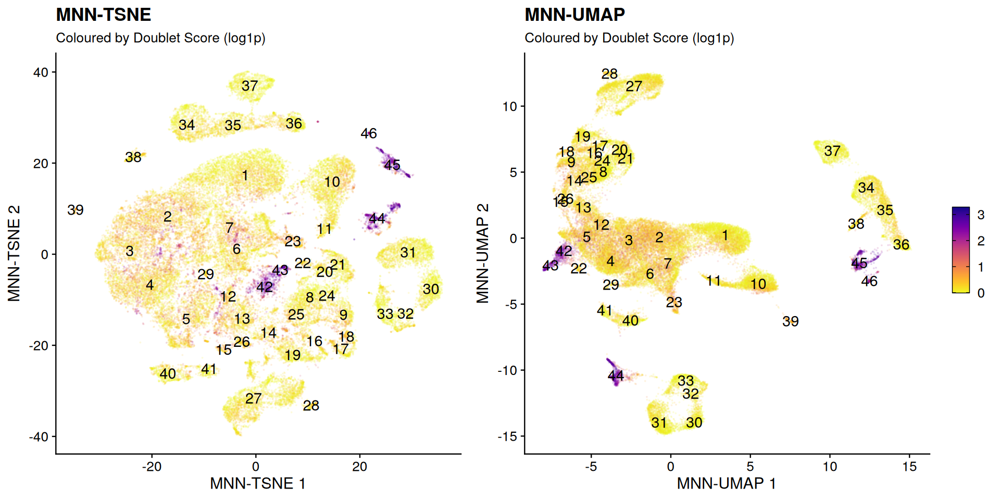
    


```R
# Plot DoubletDensity scores
fig(width = 16, height = 7)
as.data.frame(colData(combined)[,c("Sample","label","DoubletDensity")]) %>% 
ggplot(aes(label, log1p(DoubletDensity), color = Sample)) + 
    geom_boxplot(position = position_dodge(width = 0.5), width = 0.3, outlier.size = 0.5) + 
    scale_color_manual(values = c_sample_col) + theme_cowplot(16) + 
    theme(legend.position = "top", axis.text.x = element_text(angle = 90, hjust = 1, vjust = 0.5)) + 
    ylab("log Score")
reset.fig()
```


    
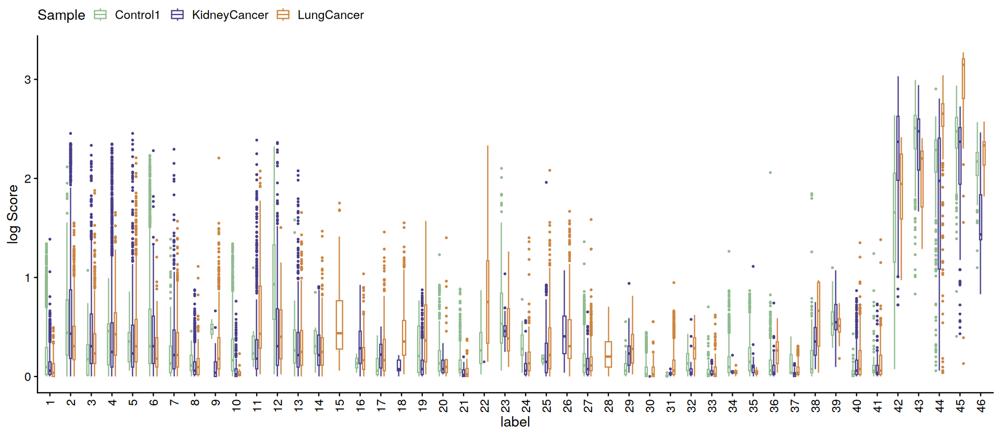
    


## Visualising gene expressions in cells

### Single gene expression

In the following plots we visualise the expression of `XIST` (expressed in female) and `DDX3Y` (expressed in male) in individual cells in human samples. The genes in mouse are `Xist` and `Ddx3y` respectively.

<div class="alert alert-warning">
    For <strong>Flex Gene Expression</strong> dataset, <code>XIST</code>/<code>Xist</code> is not available in the feature list, use other X-linked genes instead, such as <code>RLIM</code>/<code>Rlim</code>, <code>LAMP2</code>/<code>Lamp2</code>, and <code>ATRX</code>/<code>Atrx</code>.
</div>


```R
p1 <- plotProjection(combined, "RLIM", "MNN-TSNE", feat_color = c_heatmap_col1, other_fields = "Sample", 
                     point_size = 0.1, theme_size = 16) + facet_wrap(~ Sample, nrow = 1)
p2 <- plotProjection(combined, "DDX3Y", "MNN-TSNE", feat_color = c_heatmap_col1, other_fields = "Sample", 
                     point_size = 0.1, theme_size = 16) + facet_wrap(~ Sample, nrow = 1)

fig(width = 16, height = 12)
plot_grid(p1, p2, align = "vh", nrow = 2)
reset.fig()
```


    
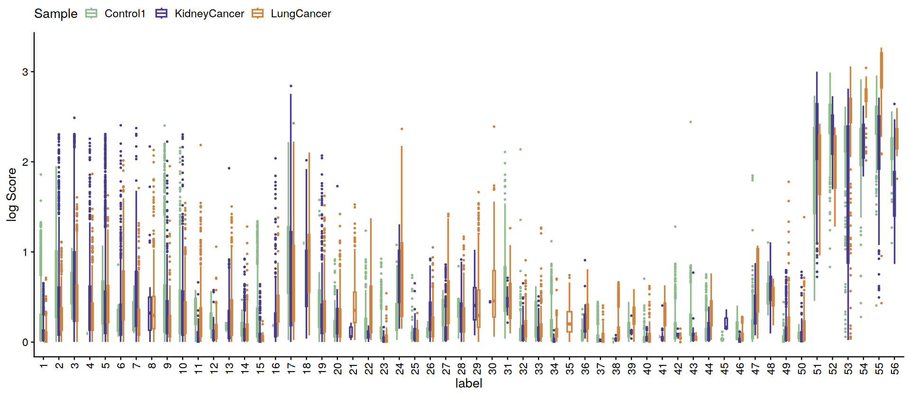
    


## Output average expression (logcounts) 

Set outfile prefix


```R
# Set outfile ID
file_id <- "160k_All"
file_id
```


'160k_All'


Create a `dgCMatrix` logcounts matrix for faster computation in some steps.


```R
sce_l <- as(logcounts(combined, withDimnames = TRUE), "dgCMatrix") # update object with new cell counts
```

### Average `logcounts` expression across samples


```R
# Use logcounts from combined
ave.expr.sample <- sumCountsAcrossCells(sce_l, average = TRUE, BPPARAM = bpp,
                                       ids = DataFrame(Sample = combined$Sample)) %>% 
    `colnames<-`(.$Sample) %>% assay %>% as.data.frame %>% rownames_to_column("Symbol")
head(ave.expr.sample)

outfile <- paste0(file_id, "_average_logcounts_in_samples.tsv")
print(paste("Write to file:", outfile))
write.table(ave.expr.sample, file = outfile, sep = "\t", quote = F, row.names = F, col.names = T)
```


<table class="dataframe">
<caption>A data.frame: 6 × 4</caption>
<thead>
	<tr><th></th><th scope=col>Symbol</th><th scope=col>Control1</th><th scope=col>KidneyCancer</th><th scope=col>LungCancer</th></tr>
	<tr><th></th><th scope=col>&lt;chr&gt;</th><th scope=col>&lt;dbl&gt;</th><th scope=col>&lt;dbl&gt;</th><th scope=col>&lt;dbl&gt;</th></tr>
</thead>
<tbody>
	<tr><th scope=row>1</th><td>SAMD11 </td><td>0.0000000000</td><td>0.0002537205</td><td>0.0003468364</td></tr>
	<tr><th scope=row>2</th><td>NOC2L  </td><td>0.3082084279</td><td>0.1779314846</td><td>0.2390327569</td></tr>
	<tr><th scope=row>3</th><td>KLHL17 </td><td>0.0764449751</td><td>0.0262705475</td><td>0.0546844268</td></tr>
	<tr><th scope=row>4</th><td>PLEKHN1</td><td>0.0161321525</td><td>0.0118384252</td><td>0.0096542455</td></tr>
	<tr><th scope=row>5</th><td>PERM1  </td><td>0.0001740714</td><td>0.0002441475</td><td>0.0026143878</td></tr>
	<tr><th scope=row>6</th><td>HES4   </td><td>0.1119712608</td><td>0.0252597339</td><td>0.0272285993</td></tr>
</tbody>
</table>


    [1] "Write to file: 160k_All_average_logcounts_in_samples.tsv"


### Average `logcounts` expression across clusters


```R
# Use logcounts from combined
ave.expr.label <- sumCountsAcrossCells(sce_l, average = TRUE, BPPARAM = bpp,
                                       ids = DataFrame(cluster = combined$label)) %>% 
    `colnames<-`(paste0("Cluster", .$cluster)) %>% assay %>% as.data.frame %>% rownames_to_column("Symbol")
head(ave.expr.label)

outfile <- paste0(file_id, "_average_logcounts_in_clusters.tsv")
print(paste("Write to file:", outfile))
write.table(ave.expr.label, file = outfile, sep = "\t", quote = F, row.names = F, col.names = T)
```


<table class="dataframe">
<caption>A data.frame: 6 × 47</caption>
<thead>
	<tr><th></th><th scope=col>Symbol</th><th scope=col>Cluster1</th><th scope=col>Cluster2</th><th scope=col>Cluster3</th><th scope=col>Cluster4</th><th scope=col>Cluster5</th><th scope=col>Cluster6</th><th scope=col>Cluster7</th><th scope=col>Cluster8</th><th scope=col>Cluster9</th><th scope=col>⋯</th><th scope=col>Cluster37</th><th scope=col>Cluster38</th><th scope=col>Cluster39</th><th scope=col>Cluster40</th><th scope=col>Cluster41</th><th scope=col>Cluster42</th><th scope=col>Cluster43</th><th scope=col>Cluster44</th><th scope=col>Cluster45</th><th scope=col>Cluster46</th></tr>
	<tr><th></th><th scope=col>&lt;chr&gt;</th><th scope=col>&lt;dbl&gt;</th><th scope=col>&lt;dbl&gt;</th><th scope=col>&lt;dbl&gt;</th><th scope=col>&lt;dbl&gt;</th><th scope=col>&lt;dbl&gt;</th><th scope=col>&lt;dbl&gt;</th><th scope=col>&lt;dbl&gt;</th><th scope=col>&lt;dbl&gt;</th><th scope=col>&lt;dbl&gt;</th><th scope=col>⋯</th><th scope=col>&lt;dbl&gt;</th><th scope=col>&lt;dbl&gt;</th><th scope=col>&lt;dbl&gt;</th><th scope=col>&lt;dbl&gt;</th><th scope=col>&lt;dbl&gt;</th><th scope=col>&lt;dbl&gt;</th><th scope=col>&lt;dbl&gt;</th><th scope=col>&lt;dbl&gt;</th><th scope=col>&lt;dbl&gt;</th><th scope=col>&lt;dbl&gt;</th></tr>
</thead>
<tbody>
	<tr><th scope=row>1</th><td>SAMD11 </td><td>0.0000000000</td><td>0.0002037884</td><td>0.0002706031</td><td>0.0000000000</td><td>0.0004117625</td><td>0.000000000</td><td>0.000000000</td><td>0.000000000</td><td>0.000000000</td><td>⋯</td><td>0.003918315</td><td>0.000000000</td><td>0.000000000</td><td>0.00000000</td><td>0.00000000</td><td>0.000000000</td><td>0.00000000</td><td>0.000000000</td><td>0.00000000</td><td>0.000000000</td></tr>
	<tr><th scope=row>2</th><td>NOC2L  </td><td>0.2551996459</td><td>0.2011802743</td><td>0.1737607984</td><td>0.1445734710</td><td>0.1901048721</td><td>0.254229768</td><td>0.202880981</td><td>0.167191138</td><td>0.188604859</td><td>⋯</td><td>0.298117938</td><td>0.316736258</td><td>0.371844532</td><td>0.22539362</td><td>0.25263445</td><td>0.213248222</td><td>0.35232308</td><td>0.286644755</td><td>0.32523292</td><td>0.354003183</td></tr>
	<tr><th scope=row>3</th><td>KLHL17 </td><td>0.0561845094</td><td>0.0309880514</td><td>0.0249914890</td><td>0.0206990732</td><td>0.0399673240</td><td>0.064066904</td><td>0.054817602</td><td>0.043014934</td><td>0.048940082</td><td>⋯</td><td>0.078065131</td><td>0.071986092</td><td>0.043037060</td><td>0.07791203</td><td>0.08271696</td><td>0.048577863</td><td>0.10477568</td><td>0.062810228</td><td>0.07120116</td><td>0.065533899</td></tr>
	<tr><th scope=row>4</th><td>PLEKHN1</td><td>0.0036704256</td><td>0.0065747452</td><td>0.0147927222</td><td>0.0163363347</td><td>0.0164280070</td><td>0.030756309</td><td>0.013090710</td><td>0.007855634</td><td>0.013170065</td><td>⋯</td><td>0.036834275</td><td>0.012302117</td><td>0.005048371</td><td>0.02266707</td><td>0.01197717</td><td>0.016821896</td><td>0.02270548</td><td>0.007921126</td><td>0.04525137</td><td>0.021807073</td></tr>
	<tr><th scope=row>5</th><td>PERM1  </td><td>0.0008099603</td><td>0.0011162357</td><td>0.0016569889</td><td>0.0006991533</td><td>0.0010246130</td><td>0.000000000</td><td>0.003079391</td><td>0.000000000</td><td>0.000000000</td><td>⋯</td><td>0.002697812</td><td>0.001785601</td><td>0.000000000</td><td>0.00000000</td><td>0.00000000</td><td>0.001426776</td><td>0.00000000</td><td>0.000000000</td><td>0.00000000</td><td>0.005344678</td></tr>
	<tr><th scope=row>6</th><td>HES4   </td><td>0.0177076213</td><td>0.0148687867</td><td>0.0202659239</td><td>0.0137251790</td><td>0.0129246918</td><td>0.006960947</td><td>0.005820796</td><td>0.005149588</td><td>0.007870599</td><td>⋯</td><td>0.109075852</td><td>0.062738953</td><td>0.000000000</td><td>0.03340675</td><td>0.03228690</td><td>0.021545128</td><td>0.03274246</td><td>0.026623665</td><td>0.20650888</td><td>0.330439272</td></tr>
</tbody>
</table>


    [1] "Write to file: 160k_All_average_logcounts_in_clusters.tsv"


### Average `logcounts` expression across conditions


```R
ave.expr.cond <- sumCountsAcrossCells(sce_l, average = TRUE, BPPARAM = bpp,
                                      ids = DataFrame(condition = combined$condition)) %>% 
    `colnames<-`(.$condition) %>% assay %>% as.data.frame %>% rownames_to_column("Symbol")
head(ave.expr.cond)

outfile <- paste0(file_id, "_average_logcounts_in_conditions.tsv")
print(paste("Write to file:", outfile))

write.table(ave.expr.cond, file = outfile, sep = "\t", quote = F, row.names = F, col.names = T)
```


<table class="dataframe">
<caption>A data.frame: 6 × 3</caption>
<thead>
	<tr><th></th><th scope=col>Symbol</th><th scope=col>Control</th><th scope=col>Cancer</th></tr>
	<tr><th></th><th scope=col>&lt;chr&gt;</th><th scope=col>&lt;dbl&gt;</th><th scope=col>&lt;dbl&gt;</th></tr>
</thead>
<tbody>
	<tr><th scope=row>1</th><td>SAMD11 </td><td>0.0000000000</td><td>0.0002955281</td></tr>
	<tr><th scope=row>2</th><td>NOC2L  </td><td>0.3082084279</td><td>0.2053650361</td></tr>
	<tr><th scope=row>3</th><td>KLHL17 </td><td>0.0764449751</td><td>0.0390279516</td></tr>
	<tr><th scope=row>4</th><td>PLEKHN1</td><td>0.0161321525</td><td>0.0108577614</td></tr>
	<tr><th scope=row>5</th><td>PERM1  </td><td>0.0001740714</td><td>0.0013083497</td></tr>
	<tr><th scope=row>6</th><td>HES4   </td><td>0.1119712608</td><td>0.0261437248</td></tr>
</tbody>
</table>


    [1] "Write to file: 160k_All_average_logcounts_in_conditions.tsv"


### Average `logcounts` expression across conditions and clusters


```R
ave.expr.gp <- sumCountsAcrossCells(sce_l, average = TRUE, BPPARAM = bpp,
                                    ids = DataFrame(group = paste(combined$label, combined$condition, sep = "_"))) %>% 
    `colnames<-`(paste0("Cluster", .$group)) 

ave.expr.gp$group <- factor(ave.expr.gp$group, levels = gtools::mixedsort(unique(ave.expr.gp$group)))
ave.expr.gp <- ave.expr.gp[,order(ave.expr.gp$group)]
ave.expr.gp <- ave.expr.gp %>% assay %>% as.data.frame %>% rownames_to_column("Symbol")
head(ave.expr.gp)

outfile <- paste0(file_id, "_average_logcounts_in_groups.tsv")
print(paste("Write to file:", outfile))

write.table(ave.expr.gp, file = outfile, sep = "\t", quote = F, row.names = F, col.names = T)
```


<table class="dataframe">
<caption>A data.frame: 6 × 89</caption>
<thead>
	<tr><th></th><th scope=col>Symbol</th><th scope=col>Cluster1_Cancer</th><th scope=col>Cluster1_Control</th><th scope=col>Cluster2_Cancer</th><th scope=col>Cluster2_Control</th><th scope=col>Cluster3_Cancer</th><th scope=col>Cluster3_Control</th><th scope=col>Cluster4_Cancer</th><th scope=col>Cluster4_Control</th><th scope=col>Cluster5_Cancer</th><th scope=col>⋯</th><th scope=col>Cluster42_Cancer</th><th scope=col>Cluster42_Control</th><th scope=col>Cluster43_Cancer</th><th scope=col>Cluster43_Control</th><th scope=col>Cluster44_Cancer</th><th scope=col>Cluster44_Control</th><th scope=col>Cluster45_Cancer</th><th scope=col>Cluster45_Control</th><th scope=col>Cluster46_Cancer</th><th scope=col>Cluster46_Control</th></tr>
	<tr><th></th><th scope=col>&lt;chr&gt;</th><th scope=col>&lt;dbl&gt;</th><th scope=col>&lt;dbl&gt;</th><th scope=col>&lt;dbl&gt;</th><th scope=col>&lt;dbl&gt;</th><th scope=col>&lt;dbl&gt;</th><th scope=col>&lt;dbl&gt;</th><th scope=col>&lt;dbl&gt;</th><th scope=col>&lt;dbl&gt;</th><th scope=col>&lt;dbl&gt;</th><th scope=col>⋯</th><th scope=col>&lt;dbl&gt;</th><th scope=col>&lt;dbl&gt;</th><th scope=col>&lt;dbl&gt;</th><th scope=col>&lt;dbl&gt;</th><th scope=col>&lt;dbl&gt;</th><th scope=col>&lt;dbl&gt;</th><th scope=col>&lt;dbl&gt;</th><th scope=col>&lt;dbl&gt;</th><th scope=col>&lt;dbl&gt;</th><th scope=col>&lt;dbl&gt;</th></tr>
</thead>
<tbody>
	<tr><th scope=row>1</th><td>SAMD11 </td><td>0.000000000</td><td>0.0000000000</td><td>0.0002144939</td><td>0.00000000</td><td>0.0002727412</td><td>0.0000000</td><td>0.0000000000</td><td>0.00000000</td><td>0.0004142627</td><td>⋯</td><td>0.000000000</td><td>0.00000000</td><td>0.00000000</td><td>0.00000000</td><td>0.00000000</td><td>0.000000000</td><td>0.00000000</td><td>0.00000000</td><td>0.00000000</td><td>0.000000000</td></tr>
	<tr><th scope=row>2</th><td>NOC2L  </td><td>0.185150794</td><td>0.2835792091</td><td>0.1953205089</td><td>0.31272509</td><td>0.1725332653</td><td>0.3291205</td><td>0.1438488721</td><td>0.25056253</td><td>0.1891442906</td><td>⋯</td><td>0.201470843</td><td>0.34192699</td><td>0.28743473</td><td>0.36030934</td><td>0.25884435</td><td>0.327112628</td><td>0.26534482</td><td>0.35451806</td><td>0.32403588</td><td>0.363139556</td></tr>
	<tr><th scope=row>3</th><td>KLHL17 </td><td>0.025522391</td><td>0.0686069475</td><td>0.0272234436</td><td>0.10265005</td><td>0.0242231156</td><td>0.1222387</td><td>0.0204505682</td><td>0.05704858</td><td>0.0402100028</td><td>⋯</td><td>0.048814230</td><td>0.04599533</td><td>0.04671503</td><td>0.11192161</td><td>0.05628426</td><td>0.072309797</td><td>0.05374101</td><td>0.07973913</td><td>0.03553816</td><td>0.074678941</td></tr>
	<tr><th scope=row>4</th><td>PLEKHN1</td><td>0.004485141</td><td>0.0033403522</td><td>0.0060686663</td><td>0.01620832</td><td>0.0136216090</td><td>0.1630117</td><td>0.0164480188</td><td>0.00000000</td><td>0.0165277567</td><td>⋯</td><td>0.017365806</td><td>0.01087918</td><td>0.03928324</td><td>0.02066514</td><td>0.00747469</td><td>0.008570984</td><td>0.04277611</td><td>0.04646177</td><td>0.00000000</td><td>0.028455571</td></tr>
	<tr><th scope=row>5</th><td>PERM1  </td><td>0.001875725</td><td>0.0003781768</td><td>0.0011748747</td><td>0.00000000</td><td>0.0016700812</td><td>0.0000000</td><td>0.0007039331</td><td>0.00000000</td><td>0.0010308344</td><td>⋯</td><td>0.001557362</td><td>0.00000000</td><td>0.00000000</td><td>0.00000000</td><td>0.00000000</td><td>0.000000000</td><td>0.00000000</td><td>0.00000000</td><td>0.00000000</td><td>0.006974153</td></tr>
	<tr><th scope=row>6</th><td>HES4   </td><td>0.022328829</td><td>0.0158353872</td><td>0.0149218568</td><td>0.01385856</td><td>0.0204260497</td><td>0.0000000</td><td>0.0138190118</td><td>0.00000000</td><td>0.0130031696</td><td>⋯</td><td>0.022212946</td><td>0.01424861</td><td>0.01158091</td><td>0.03534696</td><td>0.02551082</td><td>0.028243584</td><td>0.08294552</td><td>0.26693106</td><td>0.00000000</td><td>0.431182952</td></tr>
</tbody>
</table>


    [1] "Write to file: 160k_All_average_logcounts_in_groups.tsv"


# 6 - Expression of manually selected genes

<div class="alert alert-info">
    <strong>Tip!</strong> Use known markers to help manual annotation of cell clusters
</div>

**Show expression profiles of manually selected genes.**

T cells: CD3D, CD3E, CD3G

- CD4+ T: CD4, CD28, IL7R
  - Naive: (see naive markers)
  - Memory: ICOS, CCR4, GPR183, SLC2A3, NR3C1
  - Th17: RORA, CCR6, RORC
  - Effector: CCL5, CXCR3, GZMK, PDE4B
  - Regulatory T (Treg): FOXP3, STAM, CTLA4
  - CD40LG

- CD8+ T: CD8A, KLRK1
  - Naive: (see naive markers)
  - Tumour-infiltrating (TIL) (with Naive markers): ZEB1, SETD1B, TMEM123, STAT3
  - Activated: DUSP4, IL21R, DUSP2, CXCR3
  - Terminally differentiated effector (TE): CX3CR1, KLRG1, ADRB2
  - Mucosal-associated invariant T (MAIT): KLRB1 (CD161), SLC4A10, LTK, CXCR6, CCR5
  - gamma delta (γδ) T: PTPRC (CD45), TRDC, not KLRC1
    
- Double-negative (DN) T: CD3+ CD4- CD8-
- Double-positive (DP) T: CD4, CD8A
- Naive: ATM, LEF1, CCR7, TCF7, NELL2, TGFBR2
- Cytotoxic : GZMH, CST7, GNLY, CTSW, FGFBP2, GZMB, PRF1, KLRC1, KLRC3, KLRC4, ADGRG1, FCRL6, IKZF2
- Inflamed: CCL3, CCL4, IFIT2, IFIT3, ZC3HAV1

Natural Killer (NK) cells: CD7, MATK, IL2RB, KLRF1, NCR1

Innate lymphoid cells: GATA3, ICAM3
   - Group 2 (ILC2): RORA, MAF, PTGDR2, MBOAT2

B cells: CD79A, CD22, MS4A1 (CD20)
  - Naive: TCL1A, BACH2, IGHM, IGHD
  - Activated: CD83, CD55, BACH1, CXCR4, JUND
  - Unswitched memory (USM): ARHGAP25, CD24,PARP15, TCF4
  - Switched memory (SM): TNFRSF13B, IGHA1, IGHG1

Monocytes:
- CD14+ (classical): CD14, LYZ, VCAN, S100A8, S100A9, S100A12, TREM1
  - Tumour-associated: VEGFA, HIF1A, IER3, THBD, FOSL1
  - Cytokine stimulated: WARS1, IFITM3, GBP1
- CD16+ (non-classical): SIGLEC10, TCF7L2, FCGR3A (CD16a), CDKN1C, HES4, CX3CR1

Dendritic cells:
- CD1C+ DCs: CD1C, CD1D, CD33, CLEC10A, FCER1A
- Plasmacytoid dendritic cellS (pDCs): ITM2C, TCF4, LILRA4, CLEC4C, SERPINF1, MZB1


```R
geneNames <- c("CD3E","CD3D","CD3G","CD4","CD8A","TGFBR2","CCR7","LEF1","IL7R","TCF7","NELL2","SETD1B","STAT3",
               "NR3C1","ZEB1","TMEM123","CCR4","CD28","ICOS","CCR6","GPR183","SLC2A3","RORA","MAF","CD40LG",
               "STAM","FOXP3","CTLA4","GNLY","GZMH","FGFBP2","KLRG1","ADRB2","CCL5","CST7","CTSW","MATK","KLRK1",
               "ADGRG1","FCRL6","GZMB","DUSP4","PDE4B","CXCR4","IL21R","DUSP2","GZMK","CXCR3","ZC3HAV1","IFIT2",
               "IFIT3","CCL3","CCL4","IKZF2","KLRC1","KLRC3","KLRC4","CCR5","SLC4A10","LTK","CXCR6","KLRB1",
               "KLRF1","NCR1","TRDC","ATM","CD7","PRF1","IL2RB","GATA3","ICAM3","RORC","PTGDR2","MBOAT2","BACH2",
               "CD24","CD22","CD79A","MS4A1","TCL1A","IGHM","IGHD","CD83","BACH1","CD55","JUND","IGHA1",
               "TNFRSF13B","IGHG1","ARHGAP25","PARP15","S100A12","TREM1","VEGFA","LYZ","CD14","VCAN","S100A8",
               "S100A9","GBP1","TCF7L2","SIGLEC10","WARS1","IFITM3","HES4","CDKN1C","FCGR3A","CX3CR1","PTPRC",
               "HIF1A","THBD","IER3","FOSL1","CD1D","CD33","FCER1A","CD1C","CLEC10A","TCF4","MZB1","ITM2C",
               "LILRA4","CLEC4C","SERPINF1")
length(geneNames)
```


124


```R
fig(width = 16, height = 30)
plotDots(combined, features = geneNames, group = "label", zlim = c(-3, 3),
              center = TRUE, scale = TRUE) + scale_size(limits = c(0, 1), range = c(0.1, 6)) + 
    guides(colour = guide_colourbar(title = "Row (Gene) Z-Score", barwidth = 10), 
           size = guide_legend(title = "Proportion Detected")) + theme_cowplot(16) + #coord_flip() + 
    theme(panel.grid.major = element_line(colour = "gray90"), 
          axis.text.x = element_text(angle = 90, hjust = 1, vjust = 0.5), 
          legend.position = "top", legend.justification = "center", legend.title.position = "top") + 
    labs(x = "Cluster", y = "Marker Genes")
reset.fig()
```

    Scale for size is already present.
    Adding another scale for size, which will replace the existing scale.


    
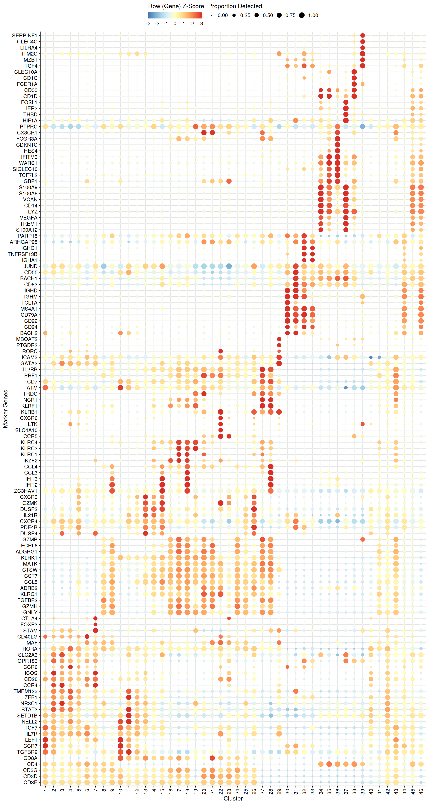
    


```R
dimname <- "MNN-UMAP"

p <- as.data.frame(reducedDim(combined, dimname)) %>% 
    bind_cols(as_tibble(t(logcounts(combined[geneNames,])))) %>% rename(V1 = 1, V2 = 2) %>% 
    gather(., key = "Symbol", value ="Expression", -c(V1, V2) ) %>% 
    mutate_at(vars(Symbol), factor) %>% mutate(Symbol = factor(Symbol, levels = geneNames)) %>%
    ggplot(aes(x = V1, y = V2, color = Expression)) + geom_point(size = 0.1, alpha = 0.1) + 
    facet_wrap(~ Symbol, ncol = 5) + scale_color_viridis(option = "plasma", direction = -1) +
    theme_classic(base_size = 20) + labs(x = paste(dimname, "1"), y = paste(dimname, "2"))

fig(width = 16, height = 72)
p
reset.fig()
```


    

    


# 7 - Define per-cluster cell types

Introduces 2 new cell type labels:

- `CellType_1`: Coarse cell type annotation (same as `ClusterCellType`)
- `CellType_2`: Fine (per-cluster) cell type annotation

## Define "Coarse Cell Type" annotation


```R
combined$CellType_1 <- combined$label
levels(combined$CellType_1) <- c("CD4 T","CD4 T","CD4 T","CD4 T","CD4 T","CD4 T","CD4 T","CD4 T","CD4 T","CD8 T",
                                 "CD8 T","CD8 T","CD8 T","CD8 T","CD8 T","CD8 T","CD8 T","CD8 T","gdT","CD8 T",
                                 "CD8 T","CD8 T","Other T","Other T","Other T","Other T","NK","NK","ILC","B",
                                 "B","B","B","Monocytes","Monocytes","Monocytes","Monocytes","DCs","DCs",
                                 "Unknown","Unknown","Doublets","Doublets","Doublets","Doublets","Doublets")
combined$ClusterCellType <- combined$CellType_1
```


```R
table("Coarse Cell Type" = combined$CellType_1, "Condition" = combined$condition)
```


                    Condition
    Coarse Cell Type Control Cancer
           CD4 T        5829  15642
           CD8 T        3543   4388
           gdT            16    983
           Other T       348   1434
           NK           1989   1520
           ILC            37     39
           B            1558   2624
           Monocytes    3100   1414
           DCs           378     60
           Unknown       163   1064
           Doublets     1132   1323


```R
table("Coarse Cell Type" = combined$CellType_1, "Clusters" = combined$label)
```


                    Clusters
    Coarse Cell Type    1    2    3    4    5    6    7    8    9   10   11   12   13   14   15   16   17   18
           CD4 T     4429 3927 2041 3240 2154 2458 1419 1074  729    0    0    0    0    0    0    0    0    0
           CD8 T        0    0    0    0    0    0    0    0    0 2572  888  604  947  468  138  264  463  258
           gdT          0    0    0    0    0    0    0    0    0    0    0    0    0    0    0    0    0    0
           Other T      0    0    0    0    0    0    0    0    0    0    0    0    0    0    0    0    0    0
           NK           0    0    0    0    0    0    0    0    0    0    0    0    0    0    0    0    0    0
           ILC          0    0    0    0    0    0    0    0    0    0    0    0    0    0    0    0    0    0
           B            0    0    0    0    0    0    0    0    0    0    0    0    0    0    0    0    0    0
           Monocytes    0    0    0    0    0    0    0    0    0    0    0    0    0    0    0    0    0    0
           DCs          0    0    0    0    0    0    0    0    0    0    0    0    0    0    0    0    0    0
           Unknown      0    0    0    0    0    0    0    0    0    0    0    0    0    0    0    0    0    0
           Doublets     0    0    0    0    0    0    0    0    0    0    0    0    0    0    0    0    0    0
                    Clusters
    Coarse Cell Type   19   20   21   22   23   24   25   26   27   28   29   30   31   32   33   34   35   36
           CD4 T        0    0    0    0    0    0    0    0    0    0    0    0    0    0    0    0    0    0
           CD8 T        0  465  737  127    0    0    0    0    0    0    0    0    0    0    0    0    0    0
           gdT        999    0    0    0    0    0    0    0    0    0    0    0    0    0    0    0    0    0
           Other T      0    0    0    0  374  270  710  428    0    0    0    0    0    0    0    0    0    0
           NK           0    0    0    0    0    0    0    0 3352  157    0    0    0    0    0    0    0    0
           ILC          0    0    0    0    0    0    0    0    0    0   76    0    0    0    0    0    0    0
           B            0    0    0    0    0    0    0    0    0    0    0 1070 1844  426  842    0    0    0
           Monocytes    0    0    0    0    0    0    0    0    0    0    0    0    0    0    0 1314 1220  714
           DCs          0    0    0    0    0    0    0    0    0    0    0    0    0    0    0    0    0    0
           Unknown      0    0    0    0    0    0    0    0    0    0    0    0    0    0    0    0    0    0
           Doublets     0    0    0    0    0    0    0    0    0    0    0    0    0    0    0    0    0    0
                    Clusters
    Coarse Cell Type   37   38   39   40   41   42   43   44   45   46
           CD4 T        0    0    0    0    0    0    0    0    0    0
           CD8 T        0    0    0    0    0    0    0    0    0    0
           gdT          0    0    0    0    0    0    0    0    0    0
           Other T      0    0    0    0    0    0    0    0    0    0
           NK           0    0    0    0    0    0    0    0    0    0
           ILC          0    0    0    0    0    0    0    0    0    0
           B            0    0    0    0    0    0    0    0    0    0
           Monocytes 1266    0    0    0    0    0    0    0    0    0
           DCs          0  327  111    0    0    0    0    0    0    0
           Unknown      0    0    0  790  437    0    0    0    0    0
           Doublets     0    0    0    0    0  644  292  803  609  107


```R
# Set colours for CellType_1
set.seed(10010)
c_celltype_col2 <- choosePalette(combined$CellType_1, sample(pals::cols25(nlevels(combined$CellType_1))))

# Coloured by CellType_1
fig(width = 16, height = 9)
plotProjections(combined, "CellType_1", dimnames = c("MNN-TSNE", "MNN-UMAP"), feat_desc = "Coarse Cell Type", 
                feat_color = c_celltype_col2, text_by = "label", point_size = 0.1, point_alpha = 0.1,
                text_size = 6, guides_nrow = 1, guides_size = 4, legend_pos = "bottom")
reset.fig()
```


    
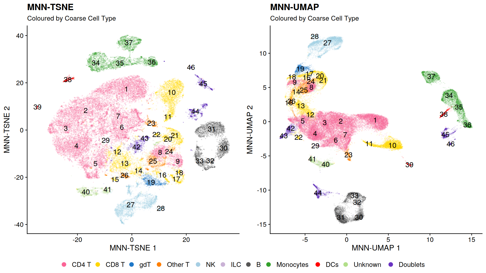
    


```R
fig(width = 16, height = 6)
data.frame(table("ct" = combined$CellType_1, "label" = combined$label, "Condition" = combined$condition)) %>% 
    ggplot(aes(Condition, Freq, fill = ct)) + geom_col() + 
    facet_wrap(~ ct, nrow = 2, scales = "free_y") + scale_fill_manual(values = c_celltype_col2) + 
    theme_cowplot(16) + guides(fill = guide_legend("Coarse CT", ncol = 1)) +
    theme(axis.text.x = element_text(angle = 0, hjust = 0.5, vjust = 1)) + ylab("Number of cells")
reset.fig()
```


    
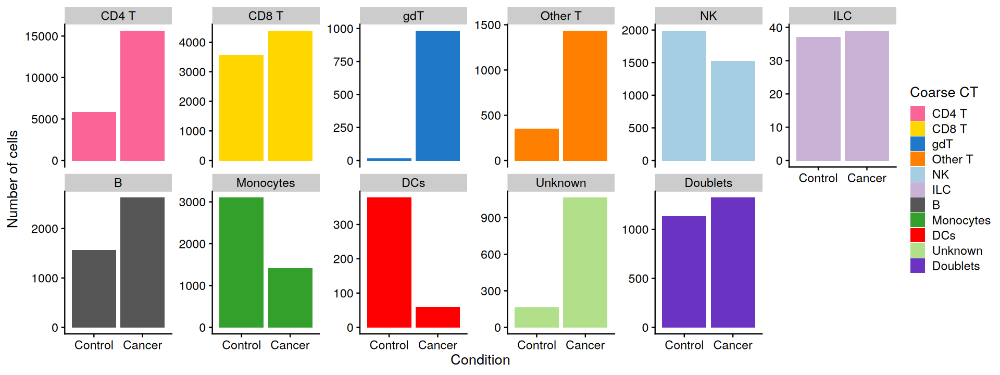
    


```R
fig(width = 16, height = 6)
data.frame(prop.table(table("Condition" = combined$condition, "ct" = combined$CellType_1, "label" = combined$label), 1)) %>% 
    ggplot(aes(Condition, Freq, fill = ct)) + geom_col() + 
    facet_wrap(~ ct, nrow = 2, scales = "free_y") + scale_fill_manual(values = c_celltype_col2) + 
    scale_y_continuous(labels = percent) + theme_cowplot(16) + guides(fill = guide_legend("Coarse CT", ncol = 1)) + 
    theme(axis.text.x = element_text(angle = 0, hjust = 0.5, vjust = 1)) + ylab("% Cells in condition")
reset.fig()
```


    
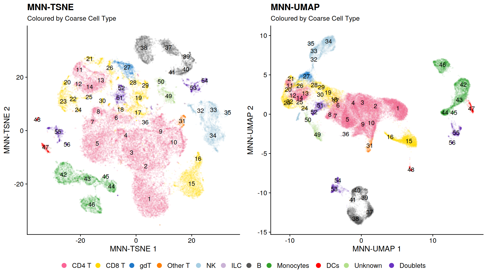
    


## Define "Fine Cell Type" annotation


```R
combined$CellType_2 <- combined$label
levels(combined$CellType_2) <- paste(1:nlevels(combined$label), 
                                     c("Naive CD4 T","ICOS(hi) Momory CD4 T","ICOS(hi) Momory CD4 T",
                                       "Th17-like T","Effector CD4 T","CD40LG+ CD4 T","Memory Tregs",
                                       "CTSW- Cytotoxic CD4 T","Inflamed Cytotoxic CD4 T","Naive CD8 T",
                                       "CD8 TILs","Naive-like Activated CD8 T","Activated CD8(hi) T",
                                       "Activated CD8(lo) T","Inflamed Activated CD8 T","CD16(lo) Cytotoxic CD8 T",
                                       "CD16+ Cytotoxic CD8 T","CD16+ Inflamed Cytotoxic CD8 T","gdT",
                                       "TE CD8(lo) T","TE CD8(hi) T","MAITs","DP T","Cytotoxic DP T",
                                       "Cytotoxic DP T","Activated DN T","NK","Inflamed NK","ILC2","Naive B",
                                       "Activated B","USM B","SM B","CD14 Monocytes","Stimulated CD14 Monocytes",
                                       "CD16 Monocytes","CD14 TAM","CD1C+ DCs","pDCs","Cytotoxic-like",
                                       "Momory-like","Naive T/TIL/NK","Naive T/Effect T/NK","B/T","Monocytes/T",
                                       "B/Monocytes"))
```


```R
table("Fine Cell Type" = combined$CellType_2, "Condition" = combined$condition)
```


                                       Condition
    Fine Cell Type                      Control Cancer
      1 Naive CD4 T                        3152   1277
      2 ICOS(hi) Momory CD4 T               196   3731
      3 ICOS(hi) Momory CD4 T                16   2025
      4 Th17-like T                          22   3218
      5 Effector CD4 T                       13   2141
      6 CD40LG+ CD4 T                      2054    404
      7 Memory Tregs                        353   1066
      8 CTSW- Cytotoxic CD4 T                21   1053
      9 Inflamed Cytotoxic CD4 T              2    727
      10 Naive CD8 T                       2158    414
      11 CD8 TILs                             6    882
      12 Naive-like Activated CD8 T         121    483
      13 Activated CD8(hi) T                 34    913
      14 Activated CD8(lo) T                  7    461
      15 Inflamed Activated CD8 T             0    138
      16 CD16(lo) Cytotoxic CD8 T             2    262
      17 CD16+ Cytotoxic CD8 T               29    434
      18 CD16+ Inflamed Cytotoxic CD8 T       0    258
      19 gdT                                 16    983
      20 TE CD8(lo) T                       420     45
      21 TE CD8(hi) T                       649     88
      22 MAITs                              117     10
      23 DP T                               327     47
      24 Cytotoxic DP T                      17    253
      25 Cytotoxic DP T                       4    706
      26 Activated DN T                       0    428
      27 NK                                1989   1363
      28 Inflamed NK                          0    157
      29 ILC2                                37     39
      30 Naive B                           1002     68
      31 Activated B                          6   1838
      32 USM B                              232    194
      33 SM B                               318    524
      34 CD14 Monocytes                    1286     28
      35 Stimulated CD14 Monocytes         1165     55
      36 CD16 Monocytes                     646     68
      37 CD14 TAM                             3   1263
      38 CD1C+ DCs                          297     30
      39 pDCs                                81     30
      40 Cytotoxic-like                      72    718
      41 Momory-like                         91    346
      42 Naive T/TIL/NK                      54    590
      43 Naive T/Effect T/NK                260     32
      44 B/T                                327    476
      45 Monocytes/T                        409    200
      46 B/Monocytes                         82     25


```R
# Set colours for CellType_2
c_celltype_col3 <- choosePalette(combined$CellType_2, c_clust_col) # same colour as cluster colours

# Coloured by CellType_2
fig(width = 16, height = 11)
plotProjections(combined, "CellType_2", dimnames = c("MNN-TSNE", "MNN-UMAP"), feat_desc = "Fine Cell Type", 
                feat_color = c_celltype_col3, text_by = "label", point_size = 0.1, point_alpha = 0.1,
                text_size = 6, guides_nrow = 10, guides_size = 4, legend_pos = "bottom", rel_height = c(6, 2))
reset.fig()
```


    
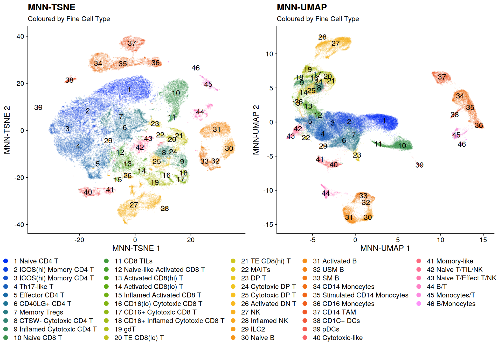
    


```R
fig(width = 16, height = 22)
data.frame(table("ct" = combined$CellType_2, "label" = combined$label, "Condition" = combined$condition)) %>% 
    ggplot(aes(Condition, Freq, fill = ct)) + geom_col() + facet_wrap(~ ct, ncol = 5, scales = "free_y") + 
    scale_fill_manual(values = c_celltype_col3) + theme_cowplot(16) + guides(fill = "none") +
    theme(axis.text.x = element_text(angle = 0, hjust = 0.5, vjust = 1)) + ylab("Number of cells")
reset.fig()
```


    
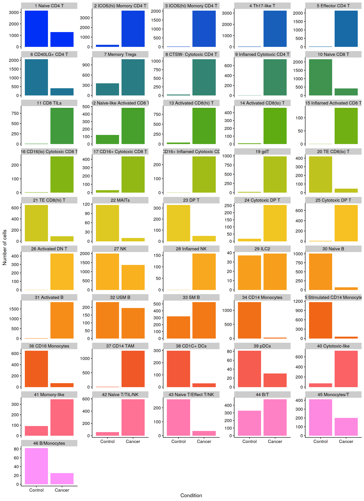
    


```R
fig(width = 16, height = 22)
data.frame(prop.table(table("Condition" = combined$condition, "ct" = combined$CellType_2, "label" = combined$label), 1)) %>% 
    ggplot(aes(Condition, Freq, fill = ct)) + geom_col() + facet_wrap(~ ct, ncol = 5, scales = "free_y") + 
    scale_fill_manual(values = c_celltype_col3) + scale_y_continuous(labels = percent) + 
    theme_cowplot(16) + guides(fill = "none") +
    theme(axis.text.x = element_text(angle = 0, hjust = 0.5, vjust = 1)) + ylab("% Cells in condition")
reset.fig()
```


    
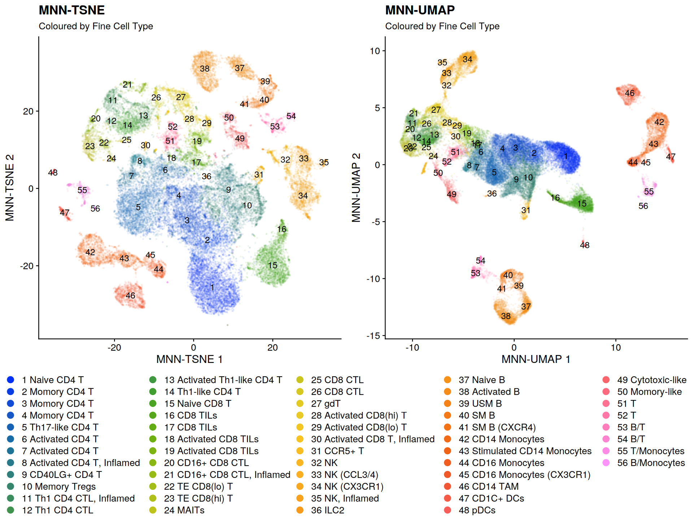
    


# 8 - Marker gene detection

Potential marker genes are identified by taking the top set of DE genes from each pairwise comparison between clusters. The results are arranged into a single output table that allows a marker set to be easily defined for a user-specified size of the top set. For example, to construct a marker set from the top 10 genes of each comparison, one would filter `marker.set` to retain rows with Top less than or equal to 10.

<div class="alert alert-warning">
  <strong>Warning!</strong> Take note of any poor clusters in the silhouette plot and consider how trustworthy the marker genes actually are.
</div>

Here we are going to use `findMarkers` from `scran` package as this is much faster. 

## Decided the `pval.type` and `min.prop` settings

- Use `pval.type` to specify how p-values are to be combined across pairwise comparisons for a given group/cluster. Defaults `pval.type` is `"any"`.
- Use `min.prop` to specify the minimum proportion of significant comparisons per gene. Defaults `min.prop` is 0.5 when `pval.type="some"`, and zero for all other `pval.type` options.

The choice of `pval.type` determines whether the highly ranked genes are those that are DE between the current group and:

### 1. DE against any other cluster ("any")

If `pval.type="any"`, the null hypothesis is that the **gene is not DE in as least 1 contrasts**. This approach does not explicitly favour genes that are uniquely expressed in a cluster. Rather, it focuses on combinations of genes that - together - drive separation of a cluster from the others. This is more general and robust but tends to yield a less focused marker set compared to the other `pval.type` settings.

Using `pval.type="any"`, the result will contain a `Top` column that shows the minimum rank across all pairwise comparisons. For example, if we define a marker set with an `T` of 1 for a given cluster. The set of genes with `Top <= 1` will contain the top gene from each pairwise comparison to every other cluster. If `T` is `5`, the set will consist of the union of the top 5 genes from each pairwise comparison. This approach does not explicitly favour genes that are uniquely expressed in a cluster. Rather, it focuses on combinations of genes that - together - drive separation of a cluster from the others. This is more general and robust but tends to yield a less focused marker set compared to the other `pval.type` settings.

### 2. DE against all other clusters ("all")

If `pval.type="all"`, the null hypothesis is that the **gene is not DE in all contrasts**. This strategy is particularly effective when dealing with distinct clusters that have a unique expression profile. In such cases, it yields a highly focused marker set that concisely captures the differences between clusters. However, it can be too stringent if the cluster's separation is driven by combinations of gene expression. 

### 3. DE against some (50%) other clusters ("some")

The `pval.type="some"` setting serves as a compromise between "all" and "any". A combined p-value is calculated by taking the middlemost value of the Holm-corrected p-values for each gene. Here, the null hypothesis is that the **gene is not DE in at least half of the contrasts**.

### 4. DE against some other clusters (rank-style)

This is achieved by setting `pval.type="any"` with `min.prop` set to some positive value in (0, 1). Here, we are selecting high-ranked genes that are among the top-ranked (`Top`) genes in at least `min.prop` of the pairwise comparisons

For example, if `pval.type="any", min.prop=0.3`, any gene with a value of `Top` less than or equal to 5 will be in the top 5 DEGs of at least 30% of the comparisons. This method increases the stringency of the `"any"` setting in a safer manner than `pval.type="some"`.

More explanation can be found by `?findMarkers`, `?combineMarkers` and `?combinePValues`.

## Find marker genes for clusters

<div class="alert alert-warning">
  <strong>Warning!</strong> All doublet clusters are not included in the marker analysis.
</div>


```R
not_doublets <- combined$CellType_1 != "Doublets"
table(not_doublets)
```


    not_doublets
    FALSE  TRUE 
     2455 46129 


### Run `findMarkers` (both directions)

Considers both up- and downregulated genes to be potential markers.


```R
# Set pval.type (and min.prop if using "any")
pval.type <- "any"
min.prop <- 0.3

# Using logcounts from combined
marker.genes.cluster <- findMarkers(sce_l[, not_doublets], groups = droplevels(combined$label[not_doublets]),
                                    #blocking on uninteresting factors
                                    block = droplevels(combined$condition[not_doublets]),
                                    pval.type = pval.type, min.prop = min.prop, BPPARAM = bpp)
marker.genes.cluster
```


    List of length 41
    names(41): 1 2 3 4 5 6 7 8 9 10 11 12 13 14 15 16 17 ... 25 26 27 28 29 30 31 32 33 34 35 36 37 38 39 40 41


Print the number of markers that passed the FDR or `Top` threshold. This will be the number of genes as inut for `enrichR`.


```R
printMarkerStats(marker.genes.cluster, pval.type = pval.type, min.prop = min.prop)
```

    Number of selected markers (Top 200 genes of at least 30.0% comparisons):
    - Cluster1: 196; Up = 121; Down = 75; Max. P-value = 6e-314.
    - Cluster2: 176; Up = 126; Down = 50; Max. P-value = 4e-175.
    - Cluster3: 182; Up = 135; Down = 47; Max. P-value = 1.2e-80.
    - Cluster4: 177; Up = 144; Down = 33; Max. P-value = 4.1e-176.
    - Cluster5: 180; Up = 132; Down = 48; Max. P-value = 7.5e-131.
    - Cluster6: 162; Up = 82; Down = 80; Max. P-value = 2.7e-200.
    - Cluster7: 170; Up = 95; Down = 75; Max. P-value = 1.1e-211.
    - Cluster8: 159; Up = 88; Down = 71; Max. P-value = 1.1e-205.
    - Cluster9: 172; Up = 135; Down = 37; Max. P-value = 3.4e-152.
    - Cluster10: 177; Up = 78; Down = 99; Max. P-value = 1.5e-147.
    - Cluster11: 178; Up = 110; Down = 68; Max. P-value = 1.5e-188.
    - Cluster12: 151; Up = 63; Down = 88; Max. P-value = 6.1e-89.
    - Cluster13: 175; Up = 113; Down = 62; Max. P-value = 1.5e-183.
    - Cluster14: 162; Up = 102; Down = 60; Max. P-value = 1.7e-152.
    - Cluster15: 179; Up = 145; Down = 34; Max. P-value = 1.8e-31.
    - Cluster16: 143; Up = 70; Down = 73; Max. P-value = 4.9e-28.
    - Cluster17: 179; Up = 121; Down = 58; Max. P-value = 6.1e-180.
    - Cluster18: 186; Up = 144; Down = 42; Max. P-value = 3.5e-85.
    - Cluster19: 167; Up = 92; Down = 75; Max. P-value = 1.4e-100.
    - Cluster20: 131; Up = 89; Down = 42; Max. P-value = 5.3e-74.
    - Cluster21: 135; Up = 71; Down = 64; Max. P-value = 0.
    - Cluster22: 137; Up = 35; Down = 102; Max. P-value = 7.2e-56.
    - Cluster23: 133; Up = 51; Down = 82; Max. P-value = 1.8e-94.
    - Cluster24: 144; Up = 92; Down = 52; Max. P-value = 1.2e-90.
    - Cluster25: 162; Up = 105; Down = 57; Max. P-value = 5.8e-119.
    - Cluster26: 202; Up = 162; Down = 40; Max. P-value = 5.3e-143.
    - Cluster27: 197; Up = 150; Down = 47; Max. P-value = 0.
    - Cluster28: 187; Up = 118; Down = 69; Max. P-value = 5.9e-30.
    - Cluster29: 159; Up = 11; Down = 148; Max. P-value = 4.3e-22.
    - Cluster30: 215; Up = 93; Down = 122; Max. P-value = 3.9e-162.
    - Cluster31: 219; Up = 170; Down = 49; Max. P-value = 2.7e-111.
    - Cluster32: 211; Up = 75; Down = 136; Max. P-value = 1e-75.
    - Cluster33: 214; Up = 97; Down = 117; Max. P-value = 6.9e-112.
    - Cluster34: 213; Up = 162; Down = 51; Max. P-value = 6.1e-169.
    - Cluster35: 229; Up = 163; Down = 66; Max. P-value = 9.5e-275.
    - Cluster36: 236; Up = 146; Down = 90; Max. P-value = 2.7e-248.
    - Cluster37: 226; Up = 220; Down = 6; Max. P-value = 2.9e-223.
    - Cluster38: 211; Up = 103; Down = 108; Max. P-value = 6.7e-125.
    - Cluster39: 183; Up = 18; Down = 165; Max. P-value = 4.1e-29.
    - Cluster40: 192; Up = 40; Down = 152; Max. P-value = 3.4e-217.
    - Cluster41: 169; Up = 24; Down = 145; Max. P-value = 1.2e-68.
    * Upregulated when logFC > 0.0 and downregulated when logFC < 0.0.


```R
for(ID in names(marker.genes.cluster)) {
    # Append Ensembl ID and Symbol from rowData
    marker.genes.cluster[[ID]] <- cbind(rowData(combined)[rownames(marker.genes.cluster[[ID]]),][,1:2], 
                                        marker.genes.cluster[[ID]])
}

exportResList(marker.genes.cluster, col_anno = c("ID","Symbol"), prefix = paste0(file_id, "_cluster"))
```

    Detecting findMarkers input.
    Creating file: 160k_All_cluster_findMarkers_Cluster1.tsv
    Creating file: 160k_All_cluster_findMarkers_Cluster2.tsv
    Creating file: 160k_All_cluster_findMarkers_Cluster3.tsv
    Creating file: 160k_All_cluster_findMarkers_Cluster4.tsv
    Creating file: 160k_All_cluster_findMarkers_Cluster5.tsv
    Creating file: 160k_All_cluster_findMarkers_Cluster6.tsv
    Creating file: 160k_All_cluster_findMarkers_Cluster7.tsv
    Creating file: 160k_All_cluster_findMarkers_Cluster8.tsv
    Creating file: 160k_All_cluster_findMarkers_Cluster9.tsv
    Creating file: 160k_All_cluster_findMarkers_Cluster10.tsv
    Creating file: 160k_All_cluster_findMarkers_Cluster11.tsv
    Creating file: 160k_All_cluster_findMarkers_Cluster12.tsv
    Creating file: 160k_All_cluster_findMarkers_Cluster13.tsv
    Creating file: 160k_All_cluster_findMarkers_Cluster14.tsv
    Creating file: 160k_All_cluster_findMarkers_Cluster15.tsv
    Creating file: 160k_All_cluster_findMarkers_Cluster16.tsv
    Creating file: 160k_All_cluster_findMarkers_Cluster17.tsv
    Creating file: 160k_All_cluster_findMarkers_Cluster18.tsv
    Creating file: 160k_All_cluster_findMarkers_Cluster19.tsv
    Creating file: 160k_All_cluster_findMarkers_Cluster20.tsv
    Creating file: 160k_All_cluster_findMarkers_Cluster21.tsv
    Creating file: 160k_All_cluster_findMarkers_Cluster22.tsv
    Creating file: 160k_All_cluster_findMarkers_Cluster23.tsv
    Creating file: 160k_All_cluster_findMarkers_Cluster24.tsv
    Creating file: 160k_All_cluster_findMarkers_Cluster25.tsv
    Creating file: 160k_All_cluster_findMarkers_Cluster26.tsv
    Creating file: 160k_All_cluster_findMarkers_Cluster27.tsv
    Creating file: 160k_All_cluster_findMarkers_Cluster28.tsv
    Creating file: 160k_All_cluster_findMarkers_Cluster29.tsv
    Creating file: 160k_All_cluster_findMarkers_Cluster30.tsv
    Creating file: 160k_All_cluster_findMarkers_Cluster31.tsv
    Creating file: 160k_All_cluster_findMarkers_Cluster32.tsv
    Creating file: 160k_All_cluster_findMarkers_Cluster33.tsv
    Creating file: 160k_All_cluster_findMarkers_Cluster34.tsv
    Creating file: 160k_All_cluster_findMarkers_Cluster35.tsv
    Creating file: 160k_All_cluster_findMarkers_Cluster36.tsv
    Creating file: 160k_All_cluster_findMarkers_Cluster37.tsv
    Creating file: 160k_All_cluster_findMarkers_Cluster38.tsv
    Creating file: 160k_All_cluster_findMarkers_Cluster39.tsv
    Creating file: 160k_All_cluster_findMarkers_Cluster40.tsv
    Creating file: 160k_All_cluster_findMarkers_Cluster41.tsv


### Run `findMarkers` (upregulated genes)

Set `direction='up'` to only consider upregulated genes as potential markers.


```R
# Set pval.type (and min.prop if using "any")
pval.type <- "any"
min.prop <- 0.3
direction <- "up"

# Using logcounts from combined
marker.genes.cluster.up <- findMarkers(sce_l[, not_doublets], groups = droplevels(combined$label[not_doublets]),
                                       #blocking on uninteresting factors
                                       block = droplevels(combined$condition[not_doublets]), 
                                       pval.type = pval.type, min.prop = min.prop,
                                       lfc = 0.5, direction = direction, BPPARAM = bpp)
marker.genes.cluster.up
```


    List of length 41
    names(41): 1 2 3 4 5 6 7 8 9 10 11 12 13 14 15 16 17 ... 25 26 27 28 29 30 31 32 33 34 35 36 37 38 39 40 41


Print the number of markers that passed the FDR or `Top` threshold. This will be the number of genes as inut for `enrichR`.


```R
printMarkerStats(marker.genes.cluster.up, pval.type = pval.type, min.prop = min.prop)
```

    Number of selected markers (Top 200 genes of at least 30.0% comparisons):
    - Cluster1: 254; Up = 254; Down = 0; Max. P-value = 0.
    - Cluster2: 252; Up = 252; Down = 0; Max. P-value = 0.
    - Cluster3: 278; Up = 278; Down = 0; Max. P-value = 2.5e-26.
    - Cluster4: 248; Up = 248; Down = 0; Max. P-value = 1.7e-13.
    - Cluster5: 263; Up = 263; Down = 0; Max. P-value = 0.0018.
    - Cluster6: 248; Up = 248; Down = 0; Max. P-value = 0.98.
    - Cluster7: 258; Up = 258; Down = 0; Max. P-value = 6.7e-124.
    - Cluster8: 252; Up = 252; Down = 0; Max. P-value = 7e-37.
    - Cluster9: 265; Up = 265; Down = 0; Max. P-value = 3.2e-133.
    - Cluster10: 274; Up = 274; Down = 0; Max. P-value = 1.3e-22.
    - Cluster11: 261; Up = 261; Down = 0; Max. P-value = 0.079.
    - Cluster12: 246; Up = 246; Down = 0; Max. P-value = 1.1e-25.
    - Cluster13: 255; Up = 255; Down = 0; Max. P-value = 1.1e-11.
    - Cluster14: 255; Up = 255; Down = 0; Max. P-value = 0.0064.
    - Cluster15: 268; Up = 268; Down = 0; Max. P-value = 0.072.
    - Cluster16: 251; Up = 251; Down = 0; Max. P-value = 2.2e-24.
    - Cluster17: 258; Up = 258; Down = 0; Max. P-value = 1.
    - Cluster18: 266; Up = 266; Down = 0; Max. P-value = 3e-54.
    - Cluster19: 258; Up = 258; Down = 0; Max. P-value = 4.7e-25.
    - Cluster20: 262; Up = 262; Down = 0; Max. P-value = 3e-29.
    - Cluster21: 260; Up = 260; Down = 0; Max. P-value = 4e-20.
    - Cluster22: 250; Up = 250; Down = 0; Max. P-value = 8.7e-39.
    - Cluster23: 254; Up = 254; Down = 0; Max. P-value = 2.4e-08.
    - Cluster24: 266; Up = 266; Down = 0; Max. P-value = 3.4e-06.
    - Cluster25: 263; Up = 263; Down = 0; Max. P-value = 8.8e-17.
    - Cluster26: 270; Up = 270; Down = 0; Max. P-value = 8.2e-29.
    - Cluster27: 241; Up = 241; Down = 0; Max. P-value = 0.
    - Cluster28: 251; Up = 251; Down = 0; Max. P-value = 0.024.
    - Cluster29: 245; Up = 245; Down = 0; Max. P-value = 0.46.
    - Cluster30: 245; Up = 245; Down = 0; Max. P-value = 9.1e-08.
    - Cluster31: 232; Up = 232; Down = 0; Max. P-value = 5.8e-41.
    - Cluster32: 252; Up = 252; Down = 0; Max. P-value = 1.6e-12.
    - Cluster33: 243; Up = 243; Down = 0; Max. P-value = 6.4e-43.
    - Cluster34: 246; Up = 246; Down = 0; Max. P-value = 1.9e-22.
    - Cluster35: 265; Up = 265; Down = 0; Max. P-value = 7.7e-124.
    - Cluster36: 258; Up = 258; Down = 0; Max. P-value = 0.
    - Cluster37: 248; Up = 248; Down = 0; Max. P-value = 2.1e-248.
    - Cluster38: 251; Up = 251; Down = 0; Max. P-value = 1.9e-21.
    - Cluster39: 251; Up = 251; Down = 0; Max. P-value = 8.9e-08.
    - Cluster40: 262; Up = 262; Down = 0; Max. P-value = 0.081.
    - Cluster41: 261; Up = 261; Down = 0; Max. P-value = 1.
    * Upregulated when logFC > 0.0 and downregulated when logFC < 0.0.


```R
# Append Ensembl ID and Symbol from rowData
for(ID in names(marker.genes.cluster.up)) {
    marker.genes.cluster.up[[ID]] <- cbind(rowData(combined)[rownames(marker.genes.cluster.up[[ID]]),][,1:2], 
                                           marker.genes.cluster.up[[ID]])
}

exportResList(marker.genes.cluster.up, col_anno = c("ID","Symbol"), prefix = paste0(file_id, "_cluster"), 
              direction = direction)
```

    Detecting findMarkers input.
    Creating file: 160k_All_cluster_findMarkers_upregulated_Cluster1.tsv
    Creating file: 160k_All_cluster_findMarkers_upregulated_Cluster2.tsv
    Creating file: 160k_All_cluster_findMarkers_upregulated_Cluster3.tsv
    Creating file: 160k_All_cluster_findMarkers_upregulated_Cluster4.tsv
    Creating file: 160k_All_cluster_findMarkers_upregulated_Cluster5.tsv
    Creating file: 160k_All_cluster_findMarkers_upregulated_Cluster6.tsv
    Creating file: 160k_All_cluster_findMarkers_upregulated_Cluster7.tsv
    Creating file: 160k_All_cluster_findMarkers_upregulated_Cluster8.tsv
    Creating file: 160k_All_cluster_findMarkers_upregulated_Cluster9.tsv
    Creating file: 160k_All_cluster_findMarkers_upregulated_Cluster10.tsv
    Creating file: 160k_All_cluster_findMarkers_upregulated_Cluster11.tsv
    Creating file: 160k_All_cluster_findMarkers_upregulated_Cluster12.tsv
    Creating file: 160k_All_cluster_findMarkers_upregulated_Cluster13.tsv
    Creating file: 160k_All_cluster_findMarkers_upregulated_Cluster14.tsv
    Creating file: 160k_All_cluster_findMarkers_upregulated_Cluster15.tsv
    Creating file: 160k_All_cluster_findMarkers_upregulated_Cluster16.tsv
    Creating file: 160k_All_cluster_findMarkers_upregulated_Cluster17.tsv
    Creating file: 160k_All_cluster_findMarkers_upregulated_Cluster18.tsv
    Creating file: 160k_All_cluster_findMarkers_upregulated_Cluster19.tsv
    Creating file: 160k_All_cluster_findMarkers_upregulated_Cluster20.tsv
    Creating file: 160k_All_cluster_findMarkers_upregulated_Cluster21.tsv
    Creating file: 160k_All_cluster_findMarkers_upregulated_Cluster22.tsv
    Creating file: 160k_All_cluster_findMarkers_upregulated_Cluster23.tsv
    Creating file: 160k_All_cluster_findMarkers_upregulated_Cluster24.tsv
    Creating file: 160k_All_cluster_findMarkers_upregulated_Cluster25.tsv
    Creating file: 160k_All_cluster_findMarkers_upregulated_Cluster26.tsv
    Creating file: 160k_All_cluster_findMarkers_upregulated_Cluster27.tsv
    Creating file: 160k_All_cluster_findMarkers_upregulated_Cluster28.tsv
    Creating file: 160k_All_cluster_findMarkers_upregulated_Cluster29.tsv
    Creating file: 160k_All_cluster_findMarkers_upregulated_Cluster30.tsv
    Creating file: 160k_All_cluster_findMarkers_upregulated_Cluster31.tsv
    Creating file: 160k_All_cluster_findMarkers_upregulated_Cluster32.tsv
    Creating file: 160k_All_cluster_findMarkers_upregulated_Cluster33.tsv
    Creating file: 160k_All_cluster_findMarkers_upregulated_Cluster34.tsv
    Creating file: 160k_All_cluster_findMarkers_upregulated_Cluster35.tsv
    Creating file: 160k_All_cluster_findMarkers_upregulated_Cluster36.tsv
    Creating file: 160k_All_cluster_findMarkers_upregulated_Cluster37.tsv
    Creating file: 160k_All_cluster_findMarkers_upregulated_Cluster38.tsv
    Creating file: 160k_All_cluster_findMarkers_upregulated_Cluster39.tsv
    Creating file: 160k_All_cluster_findMarkers_upregulated_Cluster40.tsv
    Creating file: 160k_All_cluster_findMarkers_upregulated_Cluster41.tsv


### Run `findMarkers` (downregulated genes)

Set `direction='down'` to only consider downregulated genes as potential markers.


```R
# Set pval.type (and min.prop if using "any")
pval.type <- "any"
min.prop <- 0.3
direction <- "down"

# Using logcounts from combined
marker.genes.cluster.dn <- findMarkers(sce_l[, not_doublets], groups = droplevels(combined$label[not_doublets]),
                                       #blocking on uninteresting factors
                                       block = droplevels(combined$condition[not_doublets]), 
                                       pval.type = pval.type, min.prop = min.prop,
                                       lfc = 0.5, direction = direction, BPPARAM = bpp)
marker.genes.cluster.dn
```


    List of length 41
    names(41): 1 2 3 4 5 6 7 8 9 10 11 12 13 14 15 16 17 ... 25 26 27 28 29 30 31 32 33 34 35 36 37 38 39 40 41


Print the number of markers that passed the FDR or `Top` threshold. This will be the number of genes as inut for `enrichR`.


```R
printMarkerStats(marker.genes.cluster.dn, pval.type = pval.type, min.prop = min.prop)
```

    Number of selected markers (Top 200 genes of at least 30.0% comparisons):
    - Cluster1: 202; Up = 0; Down = 202; Max. P-value = 3.8e-63.
    - Cluster2: 162; Up = 0; Down = 162; Max. P-value = 2.7e-182.
    - Cluster3: 142; Up = 0; Down = 142; Max. P-value = 1.1e-33.
    - Cluster4: 175; Up = 0; Down = 175; Max. P-value = 1.4e-179.
    - Cluster5: 115; Up = 0; Down = 115; Max. P-value = 2.2e-84.
    - Cluster6: 144; Up = 0; Down = 144; Max. P-value = 6.7e-28.
    - Cluster7: 159; Up = 0; Down = 159; Max. P-value = 2.2e-29.
    - Cluster8: 165; Up = 0; Down = 165; Max. P-value = 9.5e-289.
    - Cluster9: 147; Up = 0; Down = 147; Max. P-value = 3.5e-126.
    - Cluster10: 204; Up = 0; Down = 204; Max. P-value = 0.
    - Cluster11: 182; Up = 0; Down = 182; Max. P-value = 2.8e-25.
    - Cluster12: 154; Up = 0; Down = 154; Max. P-value = 6.7e-19.
    - Cluster13: 132; Up = 0; Down = 132; Max. P-value = 7.6e-20.
    - Cluster14: 132; Up = 0; Down = 132; Max. P-value = 8.3e-65.
    - Cluster15: 139; Up = 0; Down = 139; Max. P-value = 1.5e-10.
    - Cluster16: 146; Up = 0; Down = 146; Max. P-value = 1.1e-78.
    - Cluster17: 158; Up = 0; Down = 158; Max. P-value = 5.9e-17.
    - Cluster18: 148; Up = 0; Down = 148; Max. P-value = 5.4e-06.
    - Cluster19: 169; Up = 0; Down = 169; Max. P-value = 2e-115.
    - Cluster20: 140; Up = 0; Down = 140; Max. P-value = 2.3e-09.
    - Cluster21: 148; Up = 0; Down = 148; Max. P-value = 1.
    - Cluster22: 87; Up = 0; Down = 87; Max. P-value = 1e-16.
    - Cluster23: 159; Up = 0; Down = 159; Max. P-value = 2e-05.
    - Cluster24: 132; Up = 0; Down = 132; Max. P-value = 4.4e-49.
    - Cluster25: 111; Up = 0; Down = 111; Max. P-value = 2.3e-12.
    - Cluster26: 119; Up = 0; Down = 119; Max. P-value = 2.8e-09.
    - Cluster27: 162; Up = 0; Down = 162; Max. P-value = 8.8e-174.
    - Cluster28: 192; Up = 0; Down = 192; Max. P-value = 2.4e-06.
    - Cluster29: 174; Up = 0; Down = 174; Max. P-value = 0.18.
    - Cluster30: 213; Up = 0; Down = 213; Max. P-value = 2.2e-178.
    - Cluster31: 211; Up = 0; Down = 211; Max. P-value = 5e-73.
    - Cluster32: 214; Up = 0; Down = 214; Max. P-value = 1.5e-17.
    - Cluster33: 210; Up = 0; Down = 210; Max. P-value = 4.9e-81.
    - Cluster34: 221; Up = 0; Down = 221; Max. P-value = 1.7e-29.
    - Cluster35: 220; Up = 0; Down = 220; Max. P-value = 4.3e-32.
    - Cluster36: 216; Up = 0; Down = 216; Max. P-value = 3.3e-65.
    - Cluster37: 224; Up = 0; Down = 224; Max. P-value = 5.2e-119.
    - Cluster38: 213; Up = 0; Down = 213; Max. P-value = 6.9e-44.
    - Cluster39: 226; Up = 0; Down = 226; Max. P-value = 2.9e-07.
    - Cluster40: 200; Up = 0; Down = 200; Max. P-value = 0.
    - Cluster41: 176; Up = 0; Down = 176; Max. P-value = 1.1e-21.
    * Upregulated when logFC > 0.0 and downregulated when logFC < 0.0.


```R
# Append Ensembl ID and Symbol from rowData
for(ID in names(marker.genes.cluster.dn)) {
    marker.genes.cluster.dn[[ID]] <- cbind(rowData(combined)[rownames(marker.genes.cluster.dn[[ID]]),][,1:2], 
                                                marker.genes.cluster.dn[[ID]])
}

exportResList(marker.genes.cluster.dn, col_anno = c("ID","Symbol"), prefix = paste0(file_id, "_cluster"), 
              direction = direction)
```

    Detecting findMarkers input.
    Creating file: 160k_All_cluster_findMarkers_downregulated_Cluster1.tsv
    Creating file: 160k_All_cluster_findMarkers_downregulated_Cluster2.tsv
    Creating file: 160k_All_cluster_findMarkers_downregulated_Cluster3.tsv
    Creating file: 160k_All_cluster_findMarkers_downregulated_Cluster4.tsv
    Creating file: 160k_All_cluster_findMarkers_downregulated_Cluster5.tsv
    Creating file: 160k_All_cluster_findMarkers_downregulated_Cluster6.tsv
    Creating file: 160k_All_cluster_findMarkers_downregulated_Cluster7.tsv
    Creating file: 160k_All_cluster_findMarkers_downregulated_Cluster8.tsv
    Creating file: 160k_All_cluster_findMarkers_downregulated_Cluster9.tsv
    Creating file: 160k_All_cluster_findMarkers_downregulated_Cluster10.tsv
    Creating file: 160k_All_cluster_findMarkers_downregulated_Cluster11.tsv
    Creating file: 160k_All_cluster_findMarkers_downregulated_Cluster12.tsv
    Creating file: 160k_All_cluster_findMarkers_downregulated_Cluster13.tsv
    Creating file: 160k_All_cluster_findMarkers_downregulated_Cluster14.tsv
    Creating file: 160k_All_cluster_findMarkers_downregulated_Cluster15.tsv
    Creating file: 160k_All_cluster_findMarkers_downregulated_Cluster16.tsv
    Creating file: 160k_All_cluster_findMarkers_downregulated_Cluster17.tsv
    Creating file: 160k_All_cluster_findMarkers_downregulated_Cluster18.tsv
    Creating file: 160k_All_cluster_findMarkers_downregulated_Cluster19.tsv
    Creating file: 160k_All_cluster_findMarkers_downregulated_Cluster20.tsv
    Creating file: 160k_All_cluster_findMarkers_downregulated_Cluster21.tsv
    Creating file: 160k_All_cluster_findMarkers_downregulated_Cluster22.tsv
    Creating file: 160k_All_cluster_findMarkers_downregulated_Cluster23.tsv
    Creating file: 160k_All_cluster_findMarkers_downregulated_Cluster24.tsv
    Creating file: 160k_All_cluster_findMarkers_downregulated_Cluster25.tsv
    Creating file: 160k_All_cluster_findMarkers_downregulated_Cluster26.tsv
    Creating file: 160k_All_cluster_findMarkers_downregulated_Cluster27.tsv
    Creating file: 160k_All_cluster_findMarkers_downregulated_Cluster28.tsv
    Creating file: 160k_All_cluster_findMarkers_downregulated_Cluster29.tsv
    Creating file: 160k_All_cluster_findMarkers_downregulated_Cluster30.tsv
    Creating file: 160k_All_cluster_findMarkers_downregulated_Cluster31.tsv
    Creating file: 160k_All_cluster_findMarkers_downregulated_Cluster32.tsv
    Creating file: 160k_All_cluster_findMarkers_downregulated_Cluster33.tsv
    Creating file: 160k_All_cluster_findMarkers_downregulated_Cluster34.tsv
    Creating file: 160k_All_cluster_findMarkers_downregulated_Cluster35.tsv
    Creating file: 160k_All_cluster_findMarkers_downregulated_Cluster36.tsv
    Creating file: 160k_All_cluster_findMarkers_downregulated_Cluster37.tsv
    Creating file: 160k_All_cluster_findMarkers_downregulated_Cluster38.tsv
    Creating file: 160k_All_cluster_findMarkers_downregulated_Cluster39.tsv
    Creating file: 160k_All_cluster_findMarkers_downregulated_Cluster40.tsv
    Creating file: 160k_All_cluster_findMarkers_downregulated_Cluster41.tsv


## Save `findMarkers` results to `metadata`

<div class="alert alert-info">
    <strong>Tip!</strong> In the accompanied Shiny App, it will look for list(s) named with "findMarkers_" in the prefix in <code>metadata()</code> and show their content under the <u>Gene markers</u> section of the website. In the example below, the content of the 3 lists will be displayed in their respective sub-menus under the following titles: 
    <ul>
        <li>Cluster</li>
        <li>Cluster: up</li>
        <li>Cluster: dn</li>
    </ul>
</div>


```R
metadata(combined)[['findMarkers_Cluster']] <- marker.genes.cluster
metadata(combined)[['findMarkers_Cluster_up']] <- marker.genes.cluster.up
metadata(combined)[['findMarkers_Cluster_dn']] <- marker.genes.cluster.dn
```

## Use cluster marker genes to show cluster similarities


```R
nGene <- 200
geneNames <- sapply(marker.genes.cluster, function(x) rownames(x[1:nGene,]))

geneNames <- unique(as.character(geneNames)) # Remove duplicated genes
print(paste("Number of genes to plot:", length(geneNames)))
```

    [1] "Number of genes to plot: 1692"


```R
fig(width = 16, height = 10)
plotGroupedHeatmap(combined, features = geneNames, group = "CellType_2", clustering_method = "ward.D2", 
                   border_color = "black", color = c_heatmap_col2, fontsize = 16, angle_col = 90,
                   center = TRUE, scale = TRUE, zlim = c(-3, 3), main = "Row-scaled", show_rownames = FALSE)
reset.fig()
```


    

    


## Visualise first N cluster marker genes

Use `findMarkers` result from both directions. We aimed to present between 50 to 100 genes in the heatmap.


```R
nGene <- 4
geneNames <- sapply(marker.genes.cluster, function(x) rownames(x[1:nGene,]))
t(geneNames) # A matrix

geneNames <- unique(as.character(geneNames)) # Remove duplicated genes
print(paste("Number of genes to plot:", length(geneNames)))
```


<table class="dataframe">
<caption>A matrix: 41 × 4 of type chr</caption>
<tbody>
	<tr><th scope=row>1</th><td>MAL  </td><td>CCR7  </td><td>RCAN3 </td><td>LEF1   </td></tr>
	<tr><th scope=row>2</th><td>MAL  </td><td>CCR4  </td><td>CCR7  </td><td>CD28   </td></tr>
	<tr><th scope=row>3</th><td>CCR4 </td><td>MAL   </td><td>CCL5  </td><td>LTB    </td></tr>
	<tr><th scope=row>4</th><td>MAL  </td><td>CCR6  </td><td>CR1   </td><td>NELL2  </td></tr>
	<tr><th scope=row>5</th><td>CD4  </td><td>LTB   </td><td>NKG7  </td><td>RCAN3  </td></tr>
	<tr><th scope=row>6</th><td>NKG7 </td><td>CCL5  </td><td>GNLY  </td><td>IL7R   </td></tr>
	<tr><th scope=row>7</th><td>CCL5 </td><td>NKG7  </td><td>CD4   </td><td>EFHD2  </td></tr>
	<tr><th scope=row>8</th><td>GNLY </td><td>FGFBP2</td><td>NKG7  </td><td>GZMH   </td></tr>
	<tr><th scope=row>9</th><td>GNLY </td><td>IFIT2 </td><td>OASL  </td><td>CCL5   </td></tr>
	<tr><th scope=row>10</th><td>CCL5 </td><td>NELL2 </td><td>NKG7  </td><td>CD8A   </td></tr>
	<tr><th scope=row>11</th><td>NELL2</td><td>NKG7  </td><td>CD8A  </td><td>CCL5   </td></tr>
	<tr><th scope=row>12</th><td>NKG7 </td><td>GNLY  </td><td>EFHD2 </td><td>CCL5   </td></tr>
	<tr><th scope=row>13</th><td>GNLY </td><td>CCL5  </td><td>GZMK  </td><td>NKG7   </td></tr>
	<tr><th scope=row>14</th><td>CCL5 </td><td>NKG7  </td><td>CST7  </td><td>GNLY   </td></tr>
	<tr><th scope=row>15</th><td>CCL5 </td><td>PMAIP1</td><td>NFKBIZ</td><td>IFIT2  </td></tr>
	<tr><th scope=row>16</th><td>NKG7 </td><td>GNLY  </td><td>CCL5  </td><td>CST7   </td></tr>
	<tr><th scope=row>17</th><td>GNLY </td><td>EFHD2 </td><td>CTSW  </td><td>NKG7   </td></tr>
	<tr><th scope=row>18</th><td>IFIT2</td><td>PMAIP1</td><td>RGS3  </td><td>CTSW   </td></tr>
	<tr><th scope=row>19</th><td>GNLY </td><td>TRDC  </td><td>KLRC3 </td><td>NKG7   </td></tr>
	<tr><th scope=row>20</th><td>GNLY </td><td>NKG7  </td><td>PRF1  </td><td>KLRD1  </td></tr>
	<tr><th scope=row>21</th><td>NKG7 </td><td>CCL5  </td><td>CST7  </td><td>TRAC   </td></tr>
	<tr><th scope=row>22</th><td>KLRB1</td><td>ENC1  </td><td>TSHZ1 </td><td>NKG7   </td></tr>
	<tr><th scope=row>23</th><td>MYBL1</td><td>PDZD4 </td><td>COTL1 </td><td>PFN1   </td></tr>
	<tr><th scope=row>24</th><td>GZMH </td><td>NKG7  </td><td>RCAN3 </td><td>GNLY   </td></tr>
	<tr><th scope=row>25</th><td>GNLY </td><td>NKG7  </td><td>CCL5  </td><td>FGFBP2 </td></tr>
	<tr><th scope=row>26</th><td>CCL5 </td><td>DUSP2 </td><td>SLC7A5</td><td>KLRB1  </td></tr>
	<tr><th scope=row>27</th><td>GNLY </td><td>NKG7  </td><td>IL2RB </td><td>FCER1G </td></tr>
	<tr><th scope=row>28</th><td>IL7R </td><td>CD5   </td><td>CD3E  </td><td>IFIT2  </td></tr>
	<tr><th scope=row>29</th><td>CD6  </td><td>PYHIN1</td><td>ADGRG1</td><td>CD5    </td></tr>
	<tr><th scope=row>30</th><td>CD74 </td><td>IGHD  </td><td>NIBAN3</td><td>CD79A  </td></tr>
	<tr><th scope=row>31</th><td>IGHM </td><td>IGHD  </td><td>CD79A </td><td>IRF8   </td></tr>
	<tr><th scope=row>32</th><td>CD74 </td><td>CCL5  </td><td>CD3E  </td><td>CST7   </td></tr>
	<tr><th scope=row>33</th><td>CD74 </td><td>CCL5  </td><td>CD79A </td><td>NKG7   </td></tr>
	<tr><th scope=row>34</th><td>ZAP70</td><td>CD3E  </td><td>HK3   </td><td>CSF3R  </td></tr>
	<tr><th scope=row>35</th><td>CST7 </td><td>CSF1R </td><td>CD3E  </td><td>MARCKS </td></tr>
	<tr><th scope=row>36</th><td>IL32 </td><td>CST7  </td><td>CSF1R </td><td>CCL5   </td></tr>
	<tr><th scope=row>37</th><td>SPI1 </td><td>LYZ   </td><td>IFI30 </td><td>ZNF385A</td></tr>
	<tr><th scope=row>38</th><td>CD3E </td><td>ZAP70 </td><td>BCL11B</td><td>IL2RB  </td></tr>
	<tr><th scope=row>39</th><td>SYNE1</td><td>CCL5  </td><td>KLRD1 </td><td>CST7   </td></tr>
	<tr><th scope=row>40</th><td>B2M  </td><td>NKG7  </td><td>GNLY  </td><td>UBA52  </td></tr>
	<tr><th scope=row>41</th><td>B2M  </td><td>LTB   </td><td>NKG7  </td><td>EEF1G  </td></tr>
</tbody>
</table>


    [1] "Number of genes to plot: 69"


Alternatively, use genes identified from up- and downregulated `findMarkers` results.


```R
#nGene <- 5
#geneNames1 <- sapply(marker.genes.cluster.up, function(x) rownames(x[1:nGene,]))
#geneNames1 # A matrix

#geneNames2 <- sapply(marker.genes.cluster.dn, function(x) rownames(x[1:nGene,]))
#geneNames2 # A matrix

#geneNames <- unique(c(as.character(geneNames1), as.character(geneNames2))) # Remove duplicated genes
#print(paste("Number of genes to plot:", length(geneNames)))
```


```R
p1 <- plotGroupedHeatmap(combined, features = geneNames, group = "label", clustering_method = "ward.D2", 
                         border_color = "black", color = c_heatmap_col1, fontsize = 12, angle_col = 90, 
                         main = "Unscaled", silent = T)

p2 <- plotGroupedHeatmap(combined, features = geneNames, group = "label", clustering_method = "ward.D2", 
                         border_color = "black", color = c_heatmap_col2, fontsize = 12, angle_col = 90,
                         center = TRUE, scale = TRUE, zlim = c(-3, 3), main = "Row-scaled", silent = T)

fig(width = 16, height = 18)
plot(p1$gtable)
plot(p2$gtable)
reset.fig()
```


    
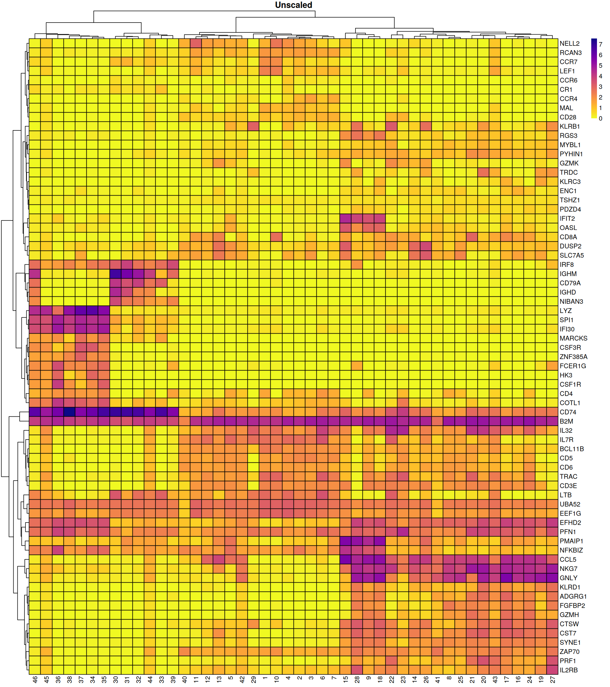
    


    
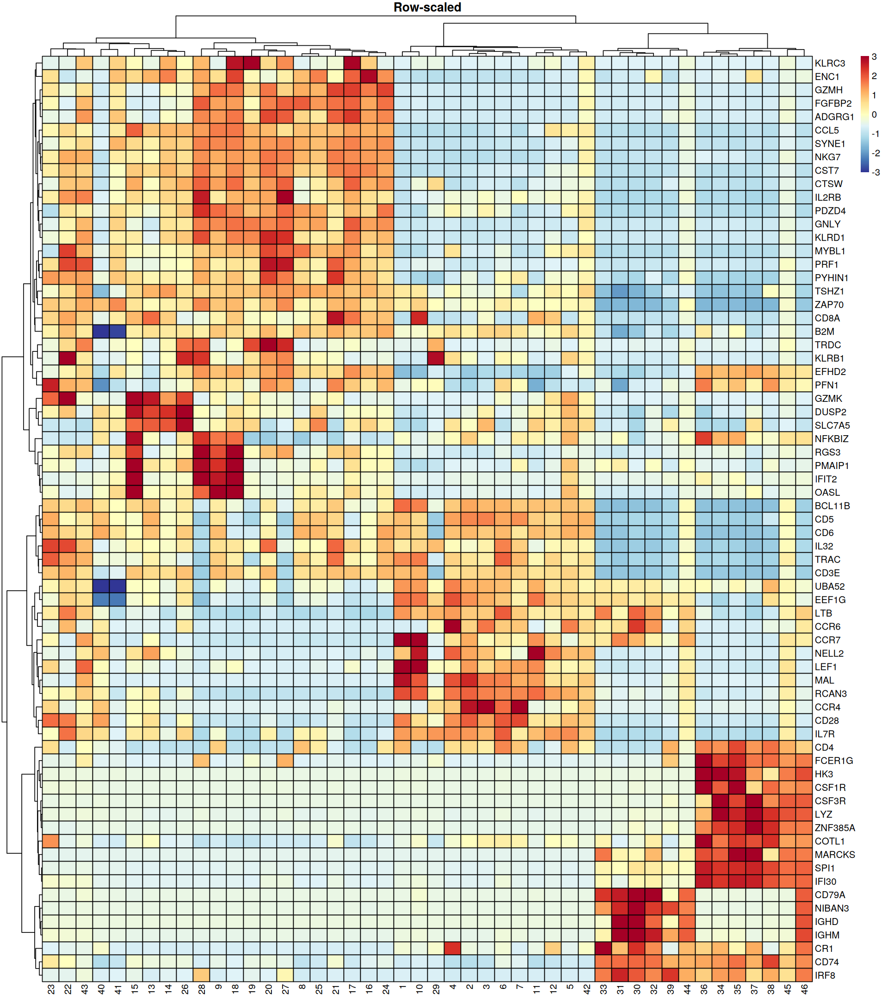
    


```R
fig(width = 16, height = 20)
plotDots(combined, features = geneNames[p2$tree_row$order], group = "label", zlim = c(-3, 3), 
         center = TRUE, scale = TRUE) + scale_size(limits = c(0, 1), range = c(0.1, 6)) + 
    scale_y_discrete(limits = geneNames[p2$tree_row$order]) + # order genes based on heatmap p2 above
    scale_x_discrete(limits = p2$tree_col$labels[p2$tree_col$order]) + # order clusters based on heatmap p2 above
    guides(colour = guide_colourbar(title = "Row (Gene) Z-Score", barwidth = 10), 
           size = guide_legend(title = "Proportion Detected")) + theme_cowplot(16) + #coord_flip() +
    theme(panel.grid.major = element_line(colour = "gray90"), 
          axis.text.x = element_text(angle = 90, hjust = 1, vjust = 0.5), 
          legend.position = "top", legend.justification = "center", legend.title.position = "top") + 
    labs(x = "Cluster", y = "Genes")
reset.fig()
```

    Scale for size is already present.
    Adding another scale for size, which will replace the existing scale.


    
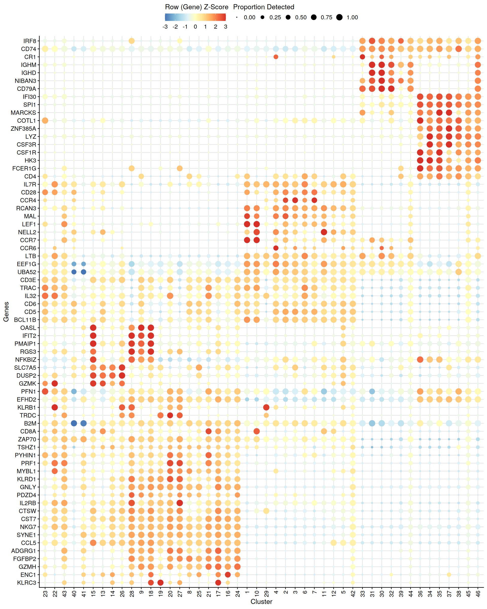
    


## Visualise first upregulated marker genes from each cluster


```R
geneNames <- sapply(marker.genes.cluster.up, function(x) rownames(x[1,]))
#geneNames

df <- data.frame(cluster = names(geneNames), gene = geneNames) %>% group_by(gene) %>% 
    summarise(cluster = paste(cluster, collapse = ",")) %>% 
    mutate(order = as.numeric(str_replace(cluster, ",.*", ""))) %>% arrange(order)
df

print(paste("Number of genes to plot:", nrow(df)))
```


<table class="dataframe">
<caption>A tibble: 21 × 3</caption>
<thead>
	<tr><th scope=col>gene</th><th scope=col>cluster</th><th scope=col>order</th></tr>
	<tr><th scope=col>&lt;chr&gt;</th><th scope=col>&lt;chr&gt;</th><th scope=col>&lt;dbl&gt;</th></tr>
</thead>
<tbody>
	<tr><td>TCF7  </td><td>1                      </td><td> 1</td></tr>
	<tr><td>MAL   </td><td>2,4                    </td><td> 2</td></tr>
	<tr><td>CCR4  </td><td>3                      </td><td> 3</td></tr>
	<tr><td>LTB   </td><td>5,6,7                  </td><td> 5</td></tr>
	<tr><td>FGFBP2</td><td>8                      </td><td> 8</td></tr>
	<tr><td>GNLY  </td><td>9,17,19,25,27,41       </td><td> 9</td></tr>
	<tr><td>NELL2 </td><td>10,11                  </td><td>10</td></tr>
	<tr><td>IL7R  </td><td>12                     </td><td>12</td></tr>
	<tr><td>CCL5  </td><td>13,14,15,16,18,21,24,26</td><td>13</td></tr>
	<tr><td>IL32  </td><td>20                     </td><td>20</td></tr>
	<tr><td>NKG7  </td><td>22,28                  </td><td>22</td></tr>
	<tr><td>COTL1 </td><td>23                     </td><td>23</td></tr>
	<tr><td>KLRB1 </td><td>29                     </td><td>29</td></tr>
	<tr><td>CD74  </td><td>30,32,33,38            </td><td>30</td></tr>
	<tr><td>IGHD  </td><td>31                     </td><td>31</td></tr>
	<tr><td>CSF3R </td><td>34                     </td><td>34</td></tr>
	<tr><td>PLXNB2</td><td>35                     </td><td>35</td></tr>
	<tr><td>PSAP  </td><td>36                     </td><td>36</td></tr>
	<tr><td>SPI1  </td><td>37                     </td><td>37</td></tr>
	<tr><td>ITM2C </td><td>39                     </td><td>39</td></tr>
	<tr><td>ZAP70 </td><td>40                     </td><td>40</td></tr>
</tbody>
</table>


    [1] "Number of genes to plot: 21"


```R
p1 <- plotGroupedHeatmap(combined, features = df$gene, group = "label", clustering_method = "ward.D2", 
                         border_color = "black", color = c_heatmap_col1, fontsize = 12, angle_col = 90, 
                         main = "Unscaled", silent = T)

p2 <- plotGroupedHeatmap(combined, features = df$gene, group = "label", clustering_method = "ward.D2", 
                         border_color = "black", color = c_heatmap_col2, fontsize = 12, angle_col = 90,
                         center = TRUE, scale = TRUE, zlim = c(-3, 3), main = "Row-scaled", silent = T)

fig(width = 16, height = 7)
plot(p1$gtable)
plot(p2$gtable)
reset.fig()
```


    
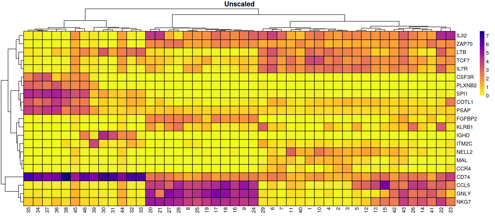
    


    
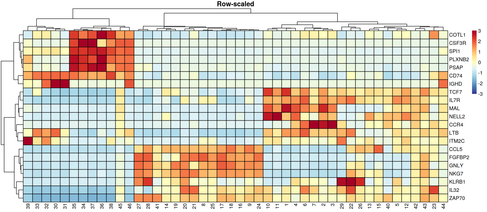
    


```R
fig(width = 16, height = 7)
plotDots(combined, features = df$gene[p2$tree_row$order], group = "label", zlim = c(-3, 3), 
         center = TRUE, scale = TRUE) + scale_size(limits = c(0, 1), range = c(0.1, 6)) + 
    scale_y_discrete(limits = df$gene[p2$tree_row$order]) + # order genes based on heatmap p2 above
    scale_x_discrete(limits = p2$tree_col$labels[p2$tree_col$order]) + # order clusters based on heatmap p2 above
    guides(colour = guide_colourbar(title = "Row (Gene) Z-Score", barwidth = 10), 
           size = guide_legend(title = "Proportion Detected")) + theme_cowplot(16) + #coord_flip() +
    theme(panel.grid.major = element_line(colour = "gray90"), 
          axis.text.x = element_text(angle = 90, hjust = 1, vjust = 0.5), 
          legend.position = "top", legend.justification = "center", legend.title.position = "top") + 
    labs(x = "Cluster", y = "Genes")
reset.fig()
```

    Scale for size is already present.
    Adding another scale for size, which will replace the existing scale.


    
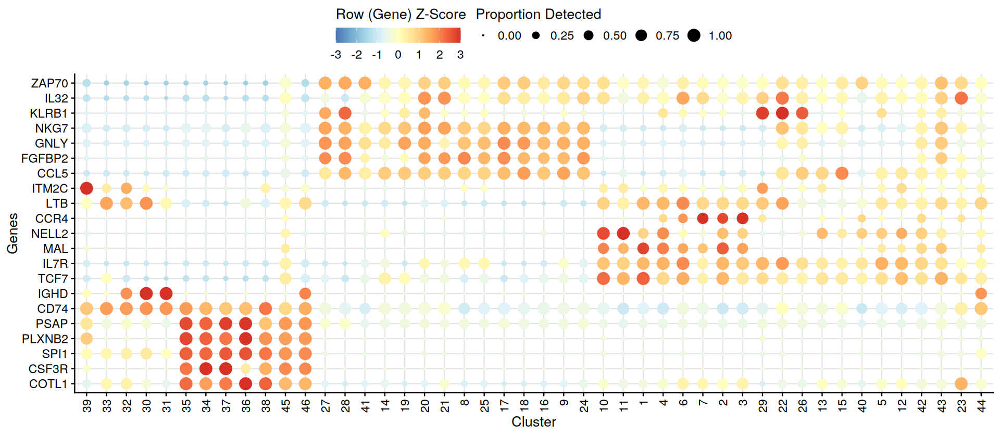
    


```R
dimname <- "MNN-TSNE"

fig(width = 16, height = 15)
as.data.frame(reducedDim(combined, dimname)) %>% `colnames<-`(c("V1","V2")) %>%
    bind_cols(as_tibble(t(logcounts(combined[df$gene,])))) %>%
    gather(., key = "Symbol", value = "Expression", -c(V1, V2) ) %>% 
    mutate_at(vars(Symbol), factor) %>% mutate(Symbol = factor(Symbol, levels = df$gene)) %>%
    ggplot(aes(x = V1, y = V2, color = Expression)) + geom_point(size = 0.3, alpha = 0.3) + 
    facet_wrap(~ Symbol, ncol = 5, 
               labeller = as_labeller(function(x) paste0(df$cluster,": ", x))) + # add cluster id
    scale_color_viridis(option = "plasma", direction = -1) +
    theme_classic(base_size = 20) + labs(x = paste(dimname, "1"), y = paste(dimname, "2"))
reset.fig()
```


    
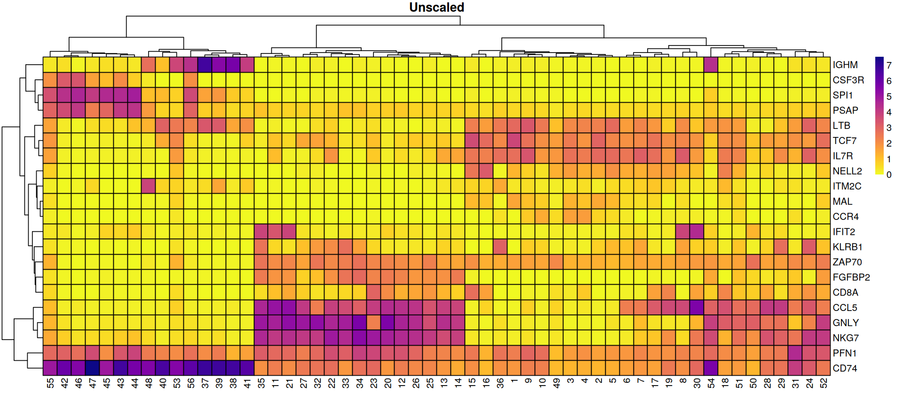
    


# 9 - DE analysis between conditions

## Prepare input

**Excluded celltypes and/or clusters**

*Assuming excluding 'Other T', 'ILC', 'DC', 'Unknown' and 'Doublets'*

- Cluster 23 DP T
- Cluster 24 Cytotoxic DP T
- Cluster 25 Cytotoxic DP T
- Cluster 26 Activated DN T
- Cluster 29 ILC2
- Cluster 38 CD1C+ DCs
- Cluster 39 pDCs
- Cluster 40 Cytotoxic-like
- Cluster 41 Momory-like
- Clusters 42-46 Doublets


```R
table(combined$CellType_1, combined$Sample)
```


               
                Control1 KidneyCancer LungCancer
      CD4 T         5829         9827       5815
      CD8 T         3543         2485       1903
      gdT             16          890         93
      Other T        348          546        888
      NK            1989          275       1245
      ILC             37           21         18
      B             1558          629       1995
      Monocytes     3100          610        804
      DCs            378           45         15
      Unknown        163          592        472
      Doublets      1132          881        442


```R
table("Cells kept" = !combined$CellType_1 %in% c("Other T","ILC","DC","Unknown","Doublets"))

kept <- combined[,!combined$CellType_1 %in% c("Other T","ILC","DC","Unknown","Doublets")]
colData(kept) <- droplevels(colData(kept))

# remove whitespaces from CellType_1, which we'll use later
levels(kept$CellType_1) <- gsub("\\s*","", levels(kept$CellType_1))

# Remove genes not expressed at all
is.exp <- rowSums(counts(kept) > 0) > 1
table("Is expressed" = is.exp)

kept <- kept[is.exp,]
kept
```


    Cells kept
    FALSE  TRUE 
     5540 43044 


    Is expressed
    FALSE  TRUE 
     2210 15919 


    class: SingleCellExperiment 
    dim: 15919 43044 
    metadata(27): Control1_Samples Control1_cyclone ... findMarkers_Cluster_up findMarkers_Cluster_dn
    assays(2): counts logcounts
    rownames(15919): SAMD11 NOC2L ... MT-ND6 MT-CYB
    rowData names(6): ID Symbol ... is_mito is_hvg
    colnames(43044): Control1_AAACAAGCAACTAGTGACTTTAGG-1 Control1_AAACAAGCAGTTATCCACTTTAGG-1 ...
      LungCancer_TTTGTGAGTTGAGTCTAGCTGTGA-1 LungCancer_TTTGTGAGTTTACGACAGCTGTGA-1
    colData names(17): Sample Barcode ... ClusterCellType CellType_2
    reducedDimNames(6): PCA TSNE ... MNN-TSNE MNN-UMAP
    mainExpName: Gene Expression
    altExpNames(1): Antibody Capture


Create a `dgCMatrix` counts matrix for faster computation in some steps.


```R
kept_c <- as(counts(kept, withDimnames = TRUE), "dgCMatrix")
```

## Creating pseudo-bulk samples

We sum counts together from cells with the same combination of selected features. See [OSCA reference](https://bioconductor.org/books/3.20/OSCA.multisample/multi-sample-comparisons.html)

<div class="alert alert-warning">
    <strong>Warning!</strong> Change the <code>"ids" DataFrame</code> to include the factors where the unique combination of levels is used to define a group.
</div>


```R
summed <- aggregateAcrossCells(kept, id = colData(kept)[,c("Sample","CellType_1")], BPPARAM = bpp)
colData(summed) <- droplevels(colData(summed))
sizeFactors(summed) <- NULL
summed <- logNormCounts(summed) # Add logcounts
summed
```


    class: SingleCellExperiment 
    dim: 15919 21 
    metadata(27): Control1_Samples Control1_cyclone ... findMarkers_Cluster_up findMarkers_Cluster_dn
    assays(2): counts logcounts
    rownames(15919): SAMD11 NOC2L ... MT-ND6 MT-CYB
    rowData names(6): ID Symbol ... is_mito is_hvg
    colnames: NULL
    colData names(20): Sample Barcode ... ncells sizeFactor
    reducedDimNames(6): PCA TSNE ... MNN-TSNE MNN-UMAP
    mainExpName: Gene Expression
    altExpNames(0):


### Add column names to `summed`

<div class="alert alert-warning">
    <strong>Warning!</strong> Very important to define the column name of the <code>summed</code> object, i.e. a unique ID for each pseudo-bulk sample in <code>colData</code>. This is so that the <code>DGEList</code> object in the following edgeR analysis is created with the approprate row names for the <code>samples</code> slot.
</div>


```R
summed$PseudoSample <- paste(summed$Sample, summed$CellType_1, sep = "_")
summed$PseudoSample <- as.factor(summed$PseudoSample)
summed$PseudoSample <- factor(summed$PseudoSample, levels = gtools::mixedsort(levels(summed$PseudoSample)))
colnames(summed) <- summed$PseudoSample
```


```R
fig(width = 16, height = 8)
as.data.frame(colData(summed)[,c("PseudoSample","condition","ncells")]) %>% 
    ggplot(aes(PseudoSample, ncells, fill = condition)) + geom_col() + 
    geom_text(aes(label = ncells), hjust = -0.1, size = 4) + coord_flip() + 
    scale_y_continuous(limits = c(0, 11000), expand = c(0, 0)) + scale_fill_manual(values = c_cond_col) + 
    theme_cowplot(16) + theme(legend.position = "top") + ylab("Number of cells")
reset.fig()
```


    
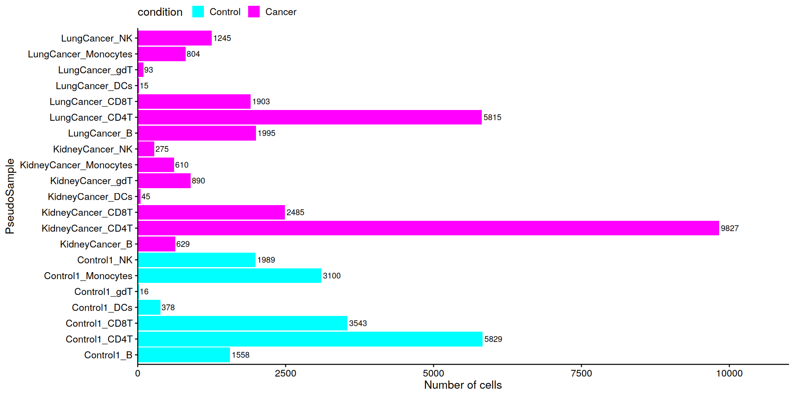
    


## Perform DE analysis between conditions

[DESeq2](https://bioconductor.org/packages/release/bioc/html/DESeq2.html) or [edgeR](https://bioconductor.org/packages/release/bioc/html/edgeR.html): For data with a high level of multimodality (data heterogeneity) methods that consider the behavior of each individual gene, such as DESeq2 show better true positive rates (sensitivities). If the level of multimodality is low, however, edgeR can provide higher precision. [Reference](https://bmcbioinformatics.biomedcentral.com/articles/10.1186/s12859-019-2599-6)

Here we use edgeR to perform DE analysis.

### Create DGEList data object

<div class="alert alert-warning">
    <strong>Warning!</strong> Change the information to be added to the <code>samples</code> slot.
</div>


```R
y <- DGEList(counts(summed), samples = colData(summed)[,c("PseudoSample","ncells","condition","CellType_1")], 
             genes = rowData(summed)[,c("ID","Symbol")])

# Removing sample that have very few or lowly-sequenced cells
# In this case, we remove combinations containing fewer than 10 cells
discarded <- y$samples$ncells < 10
y <- y[,!discarded]
summary(discarded)
```


       Mode   FALSE 
    logical      21 


### Set design matrix

Read more about design matrices with and without intercept term [here](https://bioconductor.org/packages/release/workflows/vignettes/RNAseq123/inst/doc/designmatrices.html#design-matrices-with-and-without-intercept-term), and ordering of terms in the `model.matrix` when using `0+` in the model formula [here](https://support.bioconductor.org/p/110327/#110379).


```R
my.design <- model.matrix(~ 0 + y$samples$condition + y$samples$CellType_1, y$samples)

colnames(my.design) <- gsub("y\\$samples\\$", "", colnames(my.design)) # simplify term name
data.frame(coef = 1:ncol(my.design), term = colnames(my.design))
```


<table class="dataframe">
<caption>A data.frame: 8 × 2</caption>
<thead>
	<tr><th scope=col>coef</th><th scope=col>term</th></tr>
	<tr><th scope=col>&lt;int&gt;</th><th scope=col>&lt;chr&gt;</th></tr>
</thead>
<tbody>
	<tr><td>1</td><td>conditionControl   </td></tr>
	<tr><td>2</td><td>conditionCancer    </td></tr>
	<tr><td>3</td><td>CellType_1CD8T     </td></tr>
	<tr><td>4</td><td>CellType_1gdT      </td></tr>
	<tr><td>5</td><td>CellType_1NK       </td></tr>
	<tr><td>6</td><td>CellType_1B        </td></tr>
	<tr><td>7</td><td>CellType_1Monocytes</td></tr>
	<tr><td>8</td><td>CellType_1DCs      </td></tr>
</tbody>
</table>


### Construct contrast vector using `makeContrasts` to make comparison easier


```R
my.contrasts <- makeContrasts(
    Cancer_Control = conditionCancer-conditionControl,
    levels = my.design
)
```

### Remove lowly expressed genes


```R
# Use the filterByExpr() function from edgeR
keep <- filterByExpr(y, design = my.design, group = NULL)
y <- y[keep, , keep.lib.sizes = FALSE]
summary(keep)

# Correct for composition biases by computing normalization factors
y <- calcNormFactors(y)
DataFrame(y$samples)
```


       Mode   FALSE    TRUE 
    logical    3292   12627 


    DataFrame with 21 rows and 7 columns
                            group  lib.size norm.factors         PseudoSample    ncells condition CellType_1
                         <factor> <numeric>    <numeric>             <factor> <integer>  <factor>   <factor>
    Control1_CD4T               1  24091085      1.21448        Control1_CD4T      5829   Control       CD4T
    Control1_CD8T               1  15459867      1.22265        Control1_CD8T      3543   Control       CD8T
    Control1_gdT                1     65303      1.27769        Control1_gdT         16   Control       gdT 
    Control1_NK                 1   9923859      1.15261        Control1_NK        1989   Control       NK  
    Control1_B                  1   6294215      1.12002        Control1_B         1558   Control       B   
    ...                       ...       ...          ...                  ...       ...       ...        ...
    LungCancer_gdT              1    572428     1.036575 LungCancer_gdT              93    Cancer  gdT      
    LungCancer_NK               1   7837127     1.007650 LungCancer_NK             1245    Cancer  NK       
    LungCancer_B                1  10311340     0.932968 LungCancer_B              1995    Cancer  B        
    LungCancer_Monocytes        1   7017952     0.643046 LungCancer_Monocytes       804    Cancer  Monocytes
    LungCancer_DCs              1    168067     1.092225 LungCancer_DCs              15    Cancer  DCs      


### Create multi-dimensional scaling (MDS) plot


```R
fig(width = 8, height = 8)
limma::plotMDS(cpm(y, log = TRUE), col = str_replace_all(y$samples$condition, c_cond_col),
        main = "PCoA", cex.main = 2, cex.lab = 1.5, cex.axis = 1.5, cex = 1)
reset.fig()
```


    
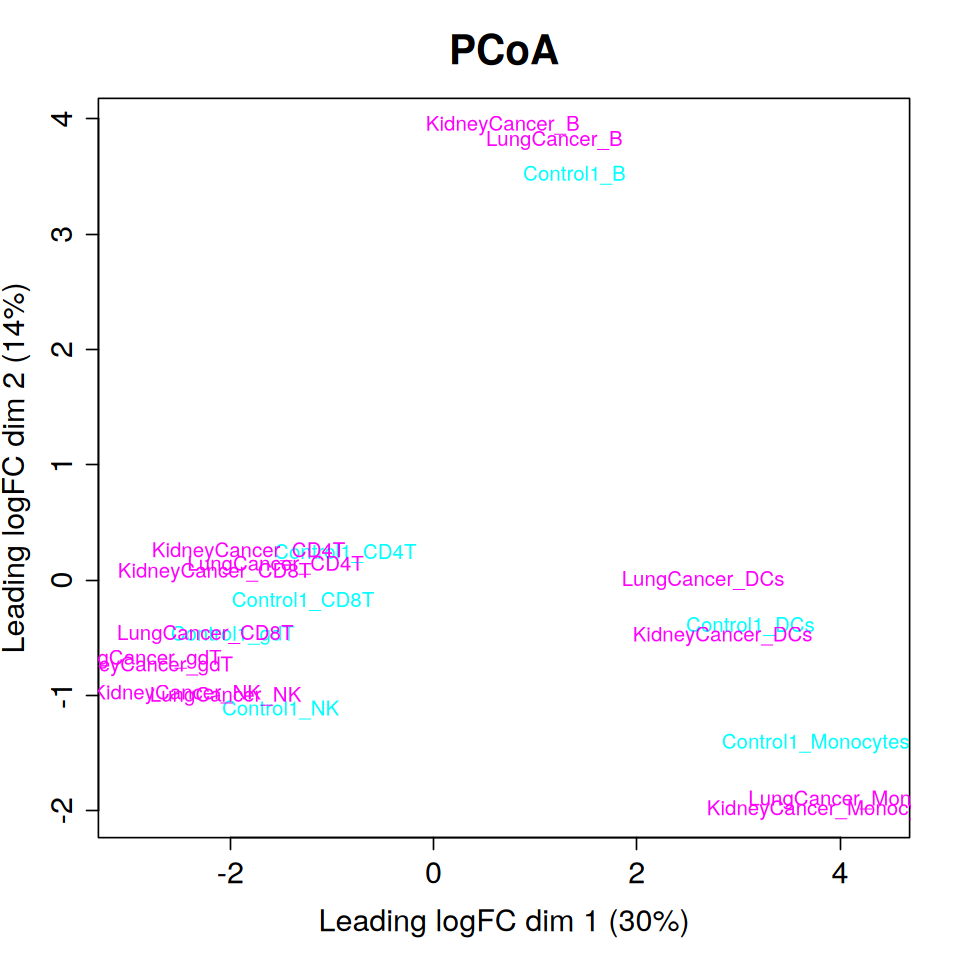
    


### Estimating the dispersions


```R
y <- estimateDisp(y, my.design)
summary(y$trended.dispersion)

# Visualise dispersion estimates
fig(width = 7, height = 7)
plotBCV(y, cex.lab = 1.5, cex.axis = 1.5, cex = 0.5, main = "Show common, trended and genewise BCV estimates")
reset.fig()
```


       Min. 1st Qu.  Median    Mean 3rd Qu.    Max. 
    0.08281 0.08666 0.09972 0.14634 0.18663 0.34159 


    

    


### Estimating the quasi-likelihood (QL) dispersions


```R
fit <- glmQLFit(y, my.design, robust = TRUE)

# Visualise QL dispersion estimates
fig(width = 7, height = 7)
plotQLDisp(fit, cex.lab = 1.5, cex.axis = 1.5, cex = 0.5, 
           main = "Show common, trended and genewise QL dispersion estimates")
reset.fig()
```


    

    


### Performs QL F-test to determine DE genes

#### DE: Cancer vs. Control


```R
res <- glmQLFTest(fit, contrast = my.contrasts[,"Cancer_Control"])

# Print the total number of differentially expressed genes at 5% FDR
summary(decideTests(res))

# Print top 10 DE genes
topTags(res)

# Output DE results to text file
outfile <- paste0(file_id, "_edgeR_DE_results_Cancer_vs_Ctrl.tsv")
print(paste("Write to file:", outfile))
write.table(topTags(res, n = nrow(res), sort.by = "PValue", adjust.method = "BH"), file = outfile, 
            sep = "\t", quote = F, row.names = F, col.names = T)
```


           -1*conditionControl 1*conditionCancer
    Down                                    3898
    NotSig                                  5371
    Up                                      3358


<dl>
	<dt>$table</dt>
		<dd><table class="dataframe">
<caption>A data.frame: 10 × 7</caption>
<thead>
	<tr><th></th><th scope=col>ID</th><th scope=col>Symbol</th><th scope=col>logFC</th><th scope=col>logCPM</th><th scope=col>F</th><th scope=col>PValue</th><th scope=col>FDR</th></tr>
	<tr><th></th><th scope=col>&lt;chr&gt;</th><th scope=col>&lt;chr&gt;</th><th scope=col>&lt;dbl&gt;</th><th scope=col>&lt;dbl&gt;</th><th scope=col>&lt;dbl&gt;</th><th scope=col>&lt;dbl&gt;</th><th scope=col>&lt;dbl&gt;</th></tr>
</thead>
<tbody>
	<tr><th scope=row>TNFAIP8L2</th><td>ENSG00000163154</td><td>TNFAIP8L2</td><td>-3.875065</td><td>4.265593</td><td>353.3979</td><td>2.096401e-15</td><td>2.647126e-11</td></tr>
	<tr><th scope=row>BTG3</th><td>ENSG00000154640</td><td>BTG3     </td><td> 3.290727</td><td>6.293525</td><td>389.3199</td><td>1.683527e-14</td><td>1.062895e-10</td></tr>
	<tr><th scope=row>ZNF644</th><td>ENSG00000122482</td><td>ZNF644   </td><td> 2.034083</td><td>9.063911</td><td>423.3502</td><td>4.750163e-14</td><td>1.999343e-10</td></tr>
	<tr><th scope=row>ATP5PO</th><td>ENSG00000241837</td><td>ATP5PO   </td><td> 7.146726</td><td>4.449535</td><td>294.8941</td><td>8.335831e-14</td><td>2.214420e-10</td></tr>
	<tr><th scope=row>MRM1</th><td>ENSG00000278619</td><td>MRM1     </td><td>-3.243436</td><td>2.986899</td><td>270.5670</td><td>8.768589e-14</td><td>2.214420e-10</td></tr>
	<tr><th scope=row>RLF</th><td>ENSG00000117000</td><td>RLF      </td><td> 2.428312</td><td>6.920502</td><td>345.5965</td><td>1.917155e-13</td><td>4.034653e-10</td></tr>
	<tr><th scope=row>MED11</th><td>ENSG00000161920</td><td>MED11    </td><td>-2.332308</td><td>4.365296</td><td>267.1529</td><td>3.429273e-13</td><td>6.185918e-10</td></tr>
	<tr><th scope=row>PSMB10</th><td>ENSG00000205220</td><td>PSMB10   </td><td>-1.837798</td><td>7.826486</td><td>330.3213</td><td>4.084933e-13</td><td>6.447556e-10</td></tr>
	<tr><th scope=row>RPRD1B</th><td>ENSG00000101413</td><td>RPRD1B   </td><td> 2.127628</td><td>6.279685</td><td>283.0511</td><td>5.006839e-13</td><td>6.709886e-10</td></tr>
	<tr><th scope=row>GNA13</th><td>ENSG00000120063</td><td>GNA13    </td><td> 2.209885</td><td>8.725422</td><td>320.9183</td><td>5.313919e-13</td><td>6.709886e-10</td></tr>
</tbody>
</table>
</dd>
	<dt>$adjust.method</dt>
		<dd>'BH'</dd>
	<dt>$comparison</dt>
		<dd>'-1*conditionControl 1*conditionCancer'</dd>
	<dt>$test</dt>
		<dd>'glm'</dd>
</dl>


    [1] "Write to file: 160k_All_edgeR_DE_results_Cancer_vs_Ctrl.tsv"


### Save DE results to `metadata`

<div class="alert alert-info">
    <strong>Tip!</strong> In the accompanied Shiny App, it will look for list(s) named with "edgeR_" in the prefix in <code>metadata()</code> and show their content under the <u>DEA (edgeR)</u> section of the website. In the example below, the content of the 3 <code>TopTags</code> objects will be displayed in the <u>Condition</u> sub-menu.
</div>


```R
metadata(combined)[['edgeR_Cancer_Control']] <- list("Cancer_Control" = res)
```

## Visualise first N condition DE genes

#### Vis: Cancer vs. Control

Assuming we are interested in looking at cells grouped by both Sample ID and Coarse Cell Type. Let's define these groupings here.


```R
kept$Group <- as.factor(paste0(kept$Sample, kept$CellType_1))
kept$Group <- factor(kept$Group, levels = as.vector(outer(levels(kept$Sample), levels(kept$CellType_1), paste0)))
#levels(kept$Group)

summed$Group <- as.factor(paste0(summed$Sample, summed$CellType_1))
summed$Group <- factor(summed$Group, levels = levels(kept$Group))
#levels(summed$Group)
```


```R
nGene <- 50
geneNames <- rownames(topTags(res, nGene))
geneNames
```


<style>
.list-inline {list-style: none; margin:0; padding: 0}
.list-inline>li {display: inline-block}
.list-inline>li:not(:last-child)::after {content: "\00b7"; padding: 0 .5ex}
</style>
<ol class=list-inline><li>'TNFAIP8L2'</li><li>'BTG3'</li><li>'ZNF644'</li><li>'ATP5PO'</li><li>'MRM1'</li><li>'RLF'</li><li>'MED11'</li><li>'PSMB10'</li><li>'RPRD1B'</li><li>'GNA13'</li><li>'GBP1'</li><li>'YTHDF3'</li><li>'SUCO'</li><li>'PYCR2'</li><li>'ETF1'</li><li>'NAP1L2'</li><li>'UBXN2A'</li><li>'DCP1A'</li><li>'GIMAP6'</li><li>'CENPC'</li><li>'GIMAP4'</li><li>'METTL13'</li><li>'GIMAP8'</li><li>'GIMAP5'</li><li>'DNAJC2'</li><li>'MAPK6'</li><li>'SNIP1'</li><li>'COQ10B'</li><li>'ELL2'</li><li>'SIT1'</li><li>'CDK17'</li><li>'RAB1A'</li><li>'KRR1'</li><li>'TRIM5'</li><li>'HNRNPK'</li><li>'UAP1'</li><li>'PPP4R3A'</li><li>'ADNP2'</li><li>'DHX9'</li><li>'AARS1'</li><li>'ZNF639'</li><li>'RAB2A'</li><li>'ARL11'</li><li>'USP16'</li><li>'PARS2'</li><li>'MYOF'</li><li>'GINM1'</li><li>'ZNF691'</li><li>'RNASEL'</li><li>'NDUFAF1'</li></ol>


Using `summed` pseudo-bulk samples.


```R
logexp <- logcounts(summed)[geneNames,] # logcounts

expr <- data.frame(Group = summed$Group, t(logexp)) %>% group_by(Group) %>% data.frame %>% 
    column_to_rownames("Group") %>% t()

ann_col <- data.frame(Sample = summed$Sample, Condition = summed$condition, row.names = colnames(expr))
condition_colors <- list(Sample = c_sample_col, Condition = c_cond_col)

p <- pheatmap(expr, scale = "row", clustering_method = "ward.D2", cluster_cols = TRUE, 
              border_color = "black", fontsize = 12, angle_col = 45, color = c_heatmap_col2, breaks = breaks,
              annotation_col = ann_col, annotation_colors = condition_colors, 
              main = "Row-scaled 'summed' logcounts", silent = T)

fig(width = 14, height = 15)
plot(p$gtable)
reset.fig()
```


    

    


Using `kept` filtered single cells.


```R
fig(width = 12, height = 16)
plotDots(kept, features = geneNames[p$tree_row$order], group = "Group", 
         center = TRUE, scale = TRUE, zlim = c(-3, 3)) + scale_size(limits = c(0, 1), range = c(0.1, 6)) + 
    scale_x_discrete(limits = p$tree_col$labels[p$tree_col$order]) + # order groups based on heatmap p above
    scale_y_discrete(limits = geneNames[p$tree_row$order]) + # order genes based on heatmap p above
    guides(colour = guide_colourbar(title = "Row (Gene) Z-Score", barwidth = 10), 
           size = guide_legend(title = "Proportion Detected")) + theme_cowplot(16) + #coord_flip() + 
    theme(panel.grid.major = element_line(colour = "gray90"), 
          axis.text.x = element_text(angle = 45, hjust = 1, vjust = 1), 
          legend.position = "top", legend.justification = "center", legend.title.position = "top") + 
    labs(title = "Cancer vs. Control", x = "Group", y ="Genes")
reset.fig()
```

    Scale for size is already present.
    Adding another scale for size, which will replace the existing scale.


    

    


# 10 - DE analysis between conditions in each cluster/cell type

For this analysis, each cell is consider a sample. [DESeq2](https://bioconductor.org/packages/release/bioc/html/DESeq2.html) and [glmGamPoi](https://bioconductor.org/packages/release/bioc/html/glmGamPoi.html) are used to fit the gene-wise dispersion, its trend and calculate the MAP based on the quasi-likelihood framework for single-cell data. See [recommendations for single-cell analysis](https://bioconductor.org/packages/release/bioc/vignettes/DESeq2/inst/doc/DESeq2.html#recommendations-for-single-cell-analysis) for more information.

> If **glmGamPoi** is used in published research, please cite:
    Ahlmann-Eltze, C., Huber, W. (2020) glmGamPoi: Fitting Gamma-Poisson
    Generalized Linear Models on Single Cell Count Data. Bioinformatics.
    https://doi.org/10.1093/bioinformatics/btaa1009


```R
# Use previously prepared input
table(kept$CellType_1, kept$Sample)
```


               
                Control1 KidneyCancer LungCancer
      CD4T          5829         9827       5815
      CD8T          3543         2485       1903
      gdT             16          890         93
      NK            1989          275       1245
      B             1558          629       1995
      Monocytes     3100          610        804
      DCs            378           45         15


## Performs likelihood ratio test (LRT) using `DESeq2`

LRT test is testing whether the term(s) removed in the 'reduced' model explains a significant amount of variation in the data. The LRT p-values are determined solely by the difference in deviance between the 'full' and 'reduced' model formula, i.e. p-values is identical in all contrasts. The test statistic and p-values may involve the testing of one or more log2 fold changes.

If the adjusted p-value (`padj`) is small, then for the set of genes with those small adjusted p-values, the additional coefficient in 'full' and not in 'reduced' increased the log likelihood more than would be expected if their true value was zero.

**Define thresholds, variable of interest and include unwanted variation present in the data**


```R
minCell <- 10 # Ignore clusters that have fewer than 10 cells in test and reference conditions
padj_cutoff <- 0.05 # FDR threshold

test <- "condition"

full <- ~ condition # full model
reduced <- ~ 1 # reduced model
```


```R
outputRes <- function(dds, test = "condition", ref = NULL, old_ref = NULL) {
    # Build results tables
    res <- list()
    freq <- data.frame(table(colData(dds)[,test]))
    ref <- if(is.null(ref)) levels(colData(dds)[,test])[1] else ref
    t <- NULL
    for(j in resultsNames(dds)) {
        if(grepl(test, j)) {
            t <- sub(test, "", j)
            if(!is.null(old_ref) && t == old_ref) next
            
            if(freq$Freq[freq$Var1 == ref] >= minCell & freq$Freq[freq$Var1 == t] >= minCell) {
                resultsname <- j
            } else next
        } else next
        
        id <- paste0(t, "_vs_", ref)
        title <- paste0(t, "_vs_", ref, "_", i)
        message(paste(t, "vs.", ref, "in Cluster", i))

        res[[id]] <- results(dds, name = resultsname, alpha = padj_cutoff)
        res[[id]]$ID <- mcols(dds)$ID
        res[[id]]$Symbol <- mcols(dds)$Symbol
        slot(mcols(res[[id]]), 
             "listData")$type <- c(slot(mcols(res[[id]]), "listData")$type[1:6], 
                                   "annotation", "annotation")
        slot(mcols(res[[id]]), 
             "listData")$description <- c(slot(mcols(res[[id]]), "listData")$description[1:6], 
                                          "ID", "Symbol")
        res[[id]]<- res[[id]][,c(7,8,1:6)]

        # Print the total number of DEGs at defined FDR threshold
        print(summary(res[[id]]))
    
        # Print top 10 genes, ordered by FDR then p-values
        df <- as.data.frame(res[[id]]) %>% arrange(padj, pvalue)
        print(head(df, 10))

        # Output DE results to text file
        outfile <- paste0(file_id, "_DESeq2_DE_results_", title, ".tsv")
        print(paste("Write to file:", outfile))
        write.table(df, file = outfile, sep = "\t", quote = F, row.names = F, col.names = T)
        flush.console()
    }
    return(res)
}
```

The code below currently only work with a `test` term with 3 or less levels.

<div class="alert alert-warning">
    In the example below, we group cells and compare between conditions in each <b>coarse cell type</b>, i.e. <code>CellType_1</code>.
</div>


```R
dds <- list()
res <- list()

# Loop through available cell groups
for(i in levels(kept$CellType_1)) {
    tmp <- kept[,kept$CellType_1 == i]
    # Build DESeqDataSet
    dds[[i]] <- DESeqDataSetFromMatrix(countData = kept_c[, kept$CellType_1 == i], 
                                       colData = droplevels(colData(tmp)), 
                                       rowData = rowData(tmp), design = full)
    
    # Use sizeFactors from SingleCellExperiment
    sizeFactors(dds[[i]]) <- sizeFactors(kept)[kept$CellType_1 == i]
    
    # Run LRT test
    dds[[i]] <- DESeq(dds[[i]], test = "LRT", useT = TRUE, minmu = 1e-6, minReplicatesForReplace = Inf, 
                      fitType = "glmGamPoi", sfType = "poscounts", reduced = reduced, quiet = TRUE)

    # Build results tables
    res[[i]] <- outputRes(dds[[i]], test = test, ref = levels(colData(dds[[i]])[,test])[1])
    
    # Use relevel to change ref to get all possible comparisons when nlevels is 3.
    #if(nlevels(colData(dds[[i]])[,test]) == 3) {
    #    colData(dds[[i]])[,test] <- relevel(colData(dds[[i]])[,test], ref = levels(colData(dds[[i]])[,test])[2])
    #    dds[[i]] <- nbinomLRT(dds[[i]], minmu = 1e-6, type = "glmGamPoi", reduced = reduced, quiet = TRUE)
    #    res[[i]] <- c(res[[i]], outputRes(dds[[i]], test = test,
    #                                      ref = levels(colData(dds[[i]])[,test])[1], 
    #                                      old_ref = levels(colData(tmp[[i]])[,test])[1]))
    #}
    flush.console()
}
```

    Warning message in asMethod(object):
    “sparse->dense coercion: allocating vector of size 2.5 GiB”
    converting counts to integer mode
    
    Cancer vs. Control in Cluster CD4T
    


    
    out of 15549 with nonzero total read count
    adjusted p-value < 0.05
    LFC > 0 (up)       : 3857, 25%
    LFC < 0 (down)     : 7475, 48%
    outliers [1]       : 0, 0%
    low counts [2]     : 0, 0%
    (mean count < 0)
    [1] see 'cooksCutoff' argument of ?results
    [2] see 'independentFiltering' argument of ?results
    
    NULL
                          ID   Symbol  baseMean log2FoldChange lfcSE     stat pvalue padj
    SKI      ENSG00000157933      SKI 3.6578339       1.481754    NA 4634.773      0    0
    TNFRSF14 ENSG00000157873 TNFRSF14 0.8154704      -1.200721    NA 2322.237      0    0
    ENO1     ENSG00000074800     ENO1 0.3884106      -1.648908    NA 2373.927      0    0
    PIK3CD   ENSG00000171608   PIK3CD 2.2911608      -1.101387    NA 4152.982      0    0
    PRDM2    ENSG00000116731    PRDM2 1.6666134       1.120472    NA 2685.705      0    0
    CAPZB    ENSG00000077549    CAPZB 1.6221549      -1.214784    NA 4028.306      0    0
    RUNX3    ENSG00000020633    RUNX3 1.7075124       2.042578    NA 4126.565      0    0
    LDLRAP1  ENSG00000157978  LDLRAP1 0.7686922      -1.812722    NA 4458.242      0    0
    MAN1C1   ENSG00000117643   MAN1C1 0.2937980      -2.159869    NA 2326.142      0    0
    SYTL1    ENSG00000142765    SYTL1 1.4346146      -1.377503    NA 4284.825      0    0
    [1] "Write to file: 160k_All_DESeq2_DE_results_Cancer_vs_Control_CD4T.tsv"


    converting counts to integer mode
    
    Cancer vs. Control in Cluster CD8T
    


    
    out of 14997 with nonzero total read count
    adjusted p-value < 0.05
    LFC > 0 (up)       : 3570, 24%
    LFC < 0 (down)     : 6971, 46%
    outliers [1]       : 0, 0%
    low counts [2]     : 0, 0%
    (mean count < 0)
    [1] see 'cooksCutoff' argument of ?results
    [2] see 'independentFiltering' argument of ?results
    
    NULL
                         ID  Symbol  baseMean log2FoldChange lfcSE     stat pvalue padj
    SKI     ENSG00000157933     SKI 3.2772018       2.087385    NA 3825.182      0    0
    KCNAB2  ENSG00000069424  KCNAB2 1.9758829      -1.290421    NA 1913.966      0    0
    PIK3CD  ENSG00000171608  PIK3CD 2.7585789      -1.270952    NA 2314.535      0    0
    PRDM2   ENSG00000116731   PRDM2 1.6802732       1.249519    NA 1779.624      0    0
    CAPZB   ENSG00000077549   CAPZB 2.0166061      -1.337723    NA 2469.661      0    0
    RUNX3   ENSG00000020633   RUNX3 2.2474651       1.566233    NA 2170.636      0    0
    LDLRAP1 ENSG00000157978 LDLRAP1 0.9317731      -1.961799    NA 2123.762      0    0
    SYTL1   ENSG00000142765   SYTL1 1.6278151      -1.478110    NA 2199.213      0    0
    LCK     ENSG00000182866     LCK 1.6557704      -1.952802    NA 4715.943      0    0
    ZC3H12A ENSG00000163874 ZC3H12A 1.1047225       2.692349    NA 2257.432      0    0
    [1] "Write to file: 160k_All_DESeq2_DE_results_Cancer_vs_Control_CD8T.tsv"


    converting counts to integer mode
    
    Cancer vs. Control in Cluster gdT
    


    
    out of 12800 with nonzero total read count
    adjusted p-value < 0.05
    LFC > 0 (up)       : 279, 2.2%
    LFC < 0 (down)     : 636, 5%
    outliers [1]       : 0, 0%
    low counts [2]     : 3185, 25%
    (mean count < 0)
    [1] see 'cooksCutoff' argument of ?results
    [2] see 'independentFiltering' argument of ?results
    
    NULL
                         ID  Symbol   baseMean log2FoldChange lfcSE      stat       pvalue         padj
    CD300A  ENSG00000167851  CD300A  0.6725189      -3.542010    NA 136.17926 1.099400e-29 1.057073e-25
    CX3CR1  ENSG00000168329  CX3CR1  0.1712235      -4.870569    NA 124.83400 1.781439e-27 8.564270e-24
    MT-CO3  ENSG00000198938  MT-CO3 24.3912291       2.179995    NA 107.09051 5.657709e-24 1.813296e-20
    MT-ND3  ENSG00000198840  MT-ND3 11.7758786       2.354016    NA 102.40107 4.873885e-23 1.171560e-19
    STAT1   ENSG00000115415   STAT1  0.3921616      -3.391686    NA 100.88091 9.816166e-23 1.887649e-19
    IL32    ENSG00000008517    IL32  3.7631753      -2.126703    NA  97.60771 4.447971e-22 7.127874e-19
    NLRC5   ENSG00000140853   NLRC5  1.8839449      -2.072497    NA  94.13875 2.217668e-21 3.046126e-18
    RAC2    ENSG00000128340    RAC2  0.8787904      -2.769749    NA  93.73296 2.677126e-21 3.217571e-18
    MT-ATP6 ENSG00000198899 MT-ATP6 22.6635222       1.776575    NA  86.20793 8.912722e-20 9.521758e-17
    GIMAP4  ENSG00000133574  GIMAP4  0.5076898      -3.298992    NA  84.08164 2.411211e-19 2.318380e-16
    [1] "Write to file: 160k_All_DESeq2_DE_results_Cancer_vs_Control_gdT.tsv"


    converting counts to integer mode
    
    Cancer vs. Control in Cluster NK
    


    
    out of 14366 with nonzero total read count
    adjusted p-value < 0.05
    LFC > 0 (up)       : 2805, 20%
    LFC < 0 (down)     : 6096, 42%
    outliers [1]       : 0, 0%
    low counts [2]     : 0, 0%
    (mean count < 0)
    [1] see 'cooksCutoff' argument of ?results
    [2] see 'independentFiltering' argument of ?results
    
    NULL
                          ID   Symbol baseMean log2FoldChange lfcSE     stat pvalue padj
    KCNAB2   ENSG00000069424   KCNAB2 4.011471      -1.756004    NA 2181.286      0    0
    FGR      ENSG00000000938      FGR 3.771334      -1.986139    NA 2649.104      0    0
    ZC3H12A  ENSG00000163874  ZC3H12A 1.332116       3.027799    NA 2423.268      0    0
    DENND2D  ENSG00000162777  DENND2D 1.950750      -2.304177    NA 2255.718      0    0
    TENT5C   ENSG00000183508   TENT5C 1.011239       3.231649    NA 1971.192      0    0
    ARHGAP30 ENSG00000186517 ARHGAP30 2.602174      -1.568652    NA 1925.802      0    0
    IER5     ENSG00000162783     IER5 3.698989       2.921523    NA 3372.414      0    0
    RGS2     ENSG00000116741     RGS2 1.195184       3.362599    NA 1986.548      0    0
    YPEL5    ENSG00000119801    YPEL5 2.952487       1.896043    NA 2040.038      0    0
    PLEK     ENSG00000115956     PLEK 2.646895      -2.008077    NA 2291.562      0    0
    [1] "Write to file: 160k_All_DESeq2_DE_results_Cancer_vs_Control_NK.tsv"


    converting counts to integer mode
    
    Cancer vs. Control in Cluster B
    


    
    out of 14587 with nonzero total read count
    adjusted p-value < 0.05
    LFC > 0 (up)       : 3094, 21%
    LFC < 0 (down)     : 6184, 42%
    outliers [1]       : 0, 0%
    low counts [2]     : 282, 1.9%
    (mean count < 0)
    [1] see 'cooksCutoff' argument of ?results
    [2] see 'independentFiltering' argument of ?results
    
    NULL
                          ID   Symbol   baseMean log2FoldChange lfcSE     stat pvalue padj
    CASZ1    ENSG00000130940    CASZ1  1.3357766       3.236870    NA 1848.492      0    0
    PRDM2    ENSG00000116731    PRDM2  4.4169554       1.717449    NA 2547.851      0    0
    LAPTM5   ENSG00000162511   LAPTM5 38.9792077       1.655305    NA 4718.302      0    0
    SMAP2    ENSG00000084070    SMAP2  7.1902122       1.594150    NA 2109.575      0    0
    ZNF644   ENSG00000122482   ZNF644  3.5578419       1.876338    NA 2244.714      0    0
    CD53     ENSG00000143119     CD53  1.8992477      -1.788556    NA 2058.190      0    0
    IFI16    ENSG00000163565    IFI16  1.4623801      -2.109450    NA 1813.287      0    0
    SLAMF6   ENSG00000162739   SLAMF6  0.8797593      -3.063343    NA 2297.223      0    0
    ARHGAP30 ENSG00000186517 ARHGAP30  1.0756545      -2.231990    NA 1927.033      0    0
    SELL     ENSG00000188404     SELL  2.3868086      -2.778233    NA 2681.988      0    0
    [1] "Write to file: 160k_All_DESeq2_DE_results_Cancer_vs_Control_B.tsv"


    converting counts to integer mode
    
    Cancer vs. Control in Cluster Monocytes
    


    
    out of 14696 with nonzero total read count
    adjusted p-value < 0.05
    LFC > 0 (up)       : 3593, 24%
    LFC < 0 (down)     : 6175, 42%
    outliers [1]       : 0, 0%
    low counts [2]     : 0, 0%
    (mean count < 0)
    [1] see 'cooksCutoff' argument of ?results
    [2] see 'independentFiltering' argument of ?results
    
    NULL
                         ID  Symbol   baseMean log2FoldChange lfcSE     stat pvalue padj
    NADK    ENSG00000008130    NADK  2.3888815      -2.508591    NA 3375.116      0    0
    DHRS3   ENSG00000162496   DHRS3  0.5091996       5.636039    NA 2996.823      0    0
    PLEKHM2 ENSG00000116786 PLEKHM2  2.0936364       1.678828    NA 2401.590      0    0
    RSRP1   ENSG00000117616   RSRP1  6.7362293      -1.182919    NA 1823.685      0    0
    LAPTM5  ENSG00000162511  LAPTM5 19.3474311       1.562172    NA 8318.798      0    0
    GBP1    ENSG00000117228    GBP1  2.7417508      -5.590928    NA 3748.785      0    0
    GBP5    ENSG00000154451    GBP5  2.4640956      -4.894452    NA 2880.714      0    0
    ZNF644  ENSG00000122482  ZNF644  1.2437134       1.922351    NA 1947.118      0    0
    PLEKHO1 ENSG00000023902 PLEKHO1  7.1228938      -1.173874    NA 1913.439      0    0
    S100A10 ENSG00000197747 S100A10  6.3528173       1.497571    NA 2374.391      0    0
    [1] "Write to file: 160k_All_DESeq2_DE_results_Cancer_vs_Control_Monocytes.tsv"


    converting counts to integer mode
    
    Cancer vs. Control in Cluster DCs
    


    
    out of 13636 with nonzero total read count
    adjusted p-value < 0.05
    LFC > 0 (up)       : 1658, 12%
    LFC < 0 (down)     : 3061, 22%
    outliers [1]       : 0, 0%
    low counts [2]     : 1835, 13%
    (mean count < 0)
    [1] see 'cooksCutoff' argument of ?results
    [2] see 'independentFiltering' argument of ?results
    
    NULL
                         ID  Symbol   baseMean log2FoldChange lfcSE     stat       pvalue         padj
    MT-CYB  ENSG00000198727  MT-CYB  3.3127956       1.853761    NA 316.9327 1.211076e-54 1.429190e-50
    MT-CO3  ENSG00000198938  MT-CO3 12.6907060       1.334212    NA 263.4307 2.050288e-47 1.209773e-43
    NAGK    ENSG00000124357    NAGK  3.3345689      -3.127603    NA 247.8081 3.333132e-45 1.311143e-41
    PSMB9   ENSG00000240065   PSMB9  2.0866981      -3.617858    NA 243.4225 1.419892e-44 4.189036e-41
    MT-ND3  ENSG00000198840  MT-ND3  6.1476940       1.334336    NA 234.7535 2.558233e-43 6.037941e-40
    JAML    ENSG00000160593    JAML  6.4538690      -2.808721    NA 232.4340 5.578998e-43 1.097296e-39
    FGD2    ENSG00000146192    FGD2  3.8817924      -2.985218    NA 228.4514 2.140899e-42 3.181260e-39
    YTHDF3  ENSG00000185728  YTHDF3  0.5702463       2.517959    NA 228.4298 2.156604e-42 3.181260e-39
    MT-ATP6 ENSG00000198899 MT-ATP6 12.8414505       1.209858    NA 221.3534 2.398234e-41 3.144618e-38
    TAP1    ENSG00000168394    TAP1  2.6525793      -2.705306    NA 213.4829 3.598831e-40 4.246980e-37
    [1] "Write to file: 160k_All_DESeq2_DE_results_Cancer_vs_Control_DCs.tsv"


### Save DESeq2 DE results to `metadata`

<div class="alert alert-info">
    <strong>Tip!</strong> In the accompanied Shiny App, it will look for list(s) named with "DESeq2_" in the prefix in <code>metadata()</code> and show their content under the <u>DEA (DESeq2)</u> section of the website.
</div>


```R
# Check list names
names(res)
```


<style>
.list-inline {list-style: none; margin:0; padding: 0}
.list-inline>li {display: inline-block}
.list-inline>li:not(:last-child)::after {content: "\00b7"; padding: 0 .5ex}
</style>
<ol class=list-inline><li>'CD4T'</li><li>'CD8T'</li><li>'gdT'</li><li>'NK'</li><li>'B'</li><li>'Monocytes'</li><li>'DCs'</li></ol>


```R
# Use purrr::map to retrieve element in list with the specified second-layer element name
# Use purrr::compact to remove empty list elements
# Note: duplicate and update accordingly if you have more second-layer element names to store in `metadata`
metadata(combined)[["DESeq2_Cancer_Control"]] <- purrr::compact(purrr::map(res, "Cancer_vs_Control"))
```

## Visualise MA-plot

The function `plotMA` shows the log2 fold changes attributable to a given variable over the mean of normalized counts for all the samples in the comparison. Points will be colored blue if the adjusted p value is less than `padj_cutoff`. Points which fall out of the window are plotted as open triangles pointing either up or down.

<div class="alert alert-warning">
    <strong>Warning!</strong> Usually, log2 fold change (LFC) shrinkage is performed with the <code>lfcShrink</code> function to generate more accurate estimates. However, shrinkage cannot be performed on results fitted by <code>glmGamPoiM</code>. Therefore, you may observed large fold changes from genes with low information, including genes that have low counts or high dispersion values.
</div>


```R
tmp <- metadata(combined)[["DESeq2_Cancer_Control"]] # all levels have same pvalue/padj in LRT
```


```R
minexp <- 0.1 # red line at baseMean = 0.1
plist <- list()

j <- 1
for(i in 1:length(tmp)) {
    plist[[j]] <- ggplotify::as.ggplot(~{
        DESeq2::plotMA(tmp[[i]], ylim = c(-4, 4))
        title(paste("Cancer vs. Control, ", names(tmp)[i]), line = 0.5)
        abline(v = minexp, lwd = 2, lty = 2, col = "red")
    })
    j <- j + 1
}

fig(width = 18, height = 10)
plot_grid(plotlist = plist, ncol = 4, align = "vh")
reset.fig()

```


    

    


## Visualise gene expression as boxplots

Show top N genes with `baseMean` > `minexp`.

<div class="alert alert-warning">
    The <code>baseMean</code> represents the mean of normalized counts for all samples in the dataset, not the subset of samples specified by 'contrast'.
</div>

<div class="alert alert-warning">
    In the example below, we group cells and compare between conditions in each <b>coarse cell type</b>, i.e. <code>CellType_1</code>, as how the DEA was performed above.
</div>


```R
minexp <- 0.1 # red line at baseMean = 0.1
nTop <- 10

fig(width = 16, height = 6)
for(i in names(tmp)) {
    g <- if(grepl("^[[:digit:]]+$", i)) paste("Cluster", i) else i
    df <- as.data.frame(tmp[[i]]) %>% arrange(padj, pvalue) %>% filter(padj < padj_cutoff & baseMean > minexp)
    if(nrow(df) < 1) {
        message(sprintf("There is no DE genes that passed the defined thresholds in '%s'.", g))
        next
    }
    
    geneNames <- head(rownames(df), nTop)
    p <- plotBox(kept[,kept$CellType_1 == i], features = geneNames, group_by = c("CellType_1","condition"), 
                 color_by = "Detected", box_colors = c_heatmap_col2, guides_barheight = 10, 
                 facet_ncol = 10, x.text_angle = 90, x.text_size = 14, theme_size = 16) + 
    geom_boxplot(color = "black", linewidth = 0.1, outlier.size = 0.2) +
    ggtitle(g, subtitle = sprintf("Total %d genes with FDR < %.2f and baseMean > %.1f", 
                                                    nrow(df), padj_cutoff, minexp))
    
    print(p)
    flush.console()
}
reset.fig()
```


    

    


    

    


    

    


    

    


    

    


    

    


    

    


# 11 - Functional analysis using `enrichR`

## Enriched pathways

We use the `enrichR` package to access the [Enrichr](https://maayanlab.cloud/Enrichr/) website to perform gene set enrichment analysis.

### Set up `enrichR`

All the available gene-set libraries are listed in `dbs`


```R
# This function generates the whole list of database for the enrichR. 
dbs <- listEnrichrDbs()
print(paste("Number of available databases from Enrichr:", nrow(dbs)))
#head(dbs)
```

    [1] "Number of available databases from Enrichr: 216"


Change `dbsSel` to remove or include more gene-set libraries in the enrichment analysis.


```R
# Human
dbsSel <- c("GO_Biological_Process_2025", # Ontologies
#            "GO_Molecular_Function_2025", # Ontologies
#            "GO_Cellular_Component_2025", # Ontologies
            "Reactome_Pathways_2024",     # Pathways
            "WikiPathways_2024_Human",    # Pathways
            "CellMarker_2024")            # Cell types

# Mouse
#dbsSel <- c("GO_Biological_Process_2025", # Ontologies
#            "GO_Molecular_Function_2025", # Ontologies
#            "GO_Cellular_Component_2025", # Ontologies
#            "Reactome_Pathways_2024",     # Pathways
#            "WikiPathways_2024_Mouse",    # Pathways
#            "CellMarker_2024")            # Cell types
```

### Run enrichR

**On upregulated 'Cluster' marker genes (from `findMarkers`)**


```R
input <- metadata(combined)[['findMarkers_Cluster_up']]
metadata(combined)[['enrichR_findMarkers_Cluster_up']] <- runEnrichR(input, dbs = dbsSel, direction = "up", 
                                                                     column_by = "Symbol")
```

    Detecting findMarkers input.
    Connection changed to https://maayanlab.cloud/Enrichr/
    
    Connection is Live!
    
    Running enrichR on 'Cluster1' with 254 up-regulated genes.


    Uploading data to Enrichr... Done.
      Querying GO_Biological_Process_2025... Done.
      Querying Reactome_Pathways_2024... Done.
      Querying WikiPathways_2024_Human... Done.
      Querying CellMarker_2024... Done.
    Parsing results... Done.


    Running enrichR on 'Cluster2' with 252 up-regulated genes.


    Uploading data to Enrichr... Done.
      Querying GO_Biological_Process_2025... Done.
      Querying Reactome_Pathways_2024... Done.
      Querying WikiPathways_2024_Human... Done.
      Querying CellMarker_2024... Done.
    Parsing results... Done.


    Running enrichR on 'Cluster3' with 278 up-regulated genes.


    Uploading data to Enrichr... Done.
      Querying GO_Biological_Process_2025... Done.
      Querying Reactome_Pathways_2024... Done.
      Querying WikiPathways_2024_Human... Done.
      Querying CellMarker_2024... Done.
    Parsing results... Done.


    Running enrichR on 'Cluster4' with 248 up-regulated genes.


    Uploading data to Enrichr... Done.
      Querying GO_Biological_Process_2025... Done.
      Querying Reactome_Pathways_2024... Done.
      Querying WikiPathways_2024_Human... Done.
      Querying CellMarker_2024... Done.
    Parsing results... Done.


    Running enrichR on 'Cluster5' with 263 up-regulated genes.


    Uploading data to Enrichr... Done.
      Querying GO_Biological_Process_2025... Done.
      Querying Reactome_Pathways_2024... Done.
      Querying WikiPathways_2024_Human... Done.
      Querying CellMarker_2024... Done.
    Parsing results... Done.


    Running enrichR on 'Cluster6' with 248 up-regulated genes.


    Uploading data to Enrichr... Done.
      Querying GO_Biological_Process_2025... Done.
      Querying Reactome_Pathways_2024... Done.
      Querying WikiPathways_2024_Human... Done.
      Querying CellMarker_2024... Done.
    Parsing results... Done.


    Running enrichR on 'Cluster7' with 258 up-regulated genes.


    Uploading data to Enrichr... Done.
      Querying GO_Biological_Process_2025... Done.
      Querying Reactome_Pathways_2024... Done.
      Querying WikiPathways_2024_Human... Done.
      Querying CellMarker_2024... Done.
    Parsing results... Done.


    Running enrichR on 'Cluster8' with 252 up-regulated genes.


    Uploading data to Enrichr... Done.
      Querying GO_Biological_Process_2025... Done.
      Querying Reactome_Pathways_2024... Done.
      Querying WikiPathways_2024_Human... Done.
      Querying CellMarker_2024... Done.
    Parsing results... Done.


    Running enrichR on 'Cluster9' with 265 up-regulated genes.


    Uploading data to Enrichr... Done.
      Querying GO_Biological_Process_2025... Done.
      Querying Reactome_Pathways_2024... Done.
      Querying WikiPathways_2024_Human... Done.
      Querying CellMarker_2024... Done.
    Parsing results... Done.


    Running enrichR on 'Cluster10' with 274 up-regulated genes.


    Uploading data to Enrichr... Done.
      Querying GO_Biological_Process_2025... Done.
      Querying Reactome_Pathways_2024... Done.
      Querying WikiPathways_2024_Human... Done.
      Querying CellMarker_2024... Done.
    Parsing results... Done.


    Running enrichR on 'Cluster11' with 261 up-regulated genes.


    Uploading data to Enrichr... Done.
      Querying GO_Biological_Process_2025... Done.
      Querying Reactome_Pathways_2024... Done.
      Querying WikiPathways_2024_Human... Done.
      Querying CellMarker_2024... Done.
    Parsing results... Done.


    Running enrichR on 'Cluster12' with 246 up-regulated genes.


    Uploading data to Enrichr... Done.
      Querying GO_Biological_Process_2025... Done.
      Querying Reactome_Pathways_2024... Done.
      Querying WikiPathways_2024_Human... Done.
      Querying CellMarker_2024... Done.
    Parsing results... Done.


    Running enrichR on 'Cluster13' with 255 up-regulated genes.


    Uploading data to Enrichr... Done.
      Querying GO_Biological_Process_2025... Done.
      Querying Reactome_Pathways_2024... Done.
      Querying WikiPathways_2024_Human... Done.
      Querying CellMarker_2024... Done.
    Parsing results... Done.


    Running enrichR on 'Cluster14' with 255 up-regulated genes.


    Uploading data to Enrichr... Done.
      Querying GO_Biological_Process_2025... Done.
      Querying Reactome_Pathways_2024... Done.
      Querying WikiPathways_2024_Human... Done.
      Querying CellMarker_2024... Done.
    Parsing results... Done.


    Running enrichR on 'Cluster15' with 268 up-regulated genes.


    Uploading data to Enrichr... Done.
      Querying GO_Biological_Process_2025... Done.
      Querying Reactome_Pathways_2024... Done.
      Querying WikiPathways_2024_Human... Done.
      Querying CellMarker_2024... Done.
    Parsing results... Done.


    Running enrichR on 'Cluster16' with 251 up-regulated genes.


    Uploading data to Enrichr... Done.
      Querying GO_Biological_Process_2025... Done.
      Querying Reactome_Pathways_2024... Done.
      Querying WikiPathways_2024_Human... Done.
      Querying CellMarker_2024... Done.
    Parsing results... Done.


    Running enrichR on 'Cluster17' with 258 up-regulated genes.


    Uploading data to Enrichr... Done.
      Querying GO_Biological_Process_2025... Done.
      Querying Reactome_Pathways_2024... Done.
      Querying WikiPathways_2024_Human... Done.
      Querying CellMarker_2024... Done.
    Parsing results... Done.


    Running enrichR on 'Cluster18' with 266 up-regulated genes.


    Uploading data to Enrichr... Done.
      Querying GO_Biological_Process_2025... Done.
      Querying Reactome_Pathways_2024... Done.
      Querying WikiPathways_2024_Human... Done.
      Querying CellMarker_2024... Done.
    Parsing results... Done.


    Running enrichR on 'Cluster19' with 258 up-regulated genes.


    Uploading data to Enrichr... Done.
      Querying GO_Biological_Process_2025... Done.
      Querying Reactome_Pathways_2024... Done.
      Querying WikiPathways_2024_Human... Done.
      Querying CellMarker_2024... Done.
    Parsing results... Done.


    Running enrichR on 'Cluster20' with 262 up-regulated genes.


    Uploading data to Enrichr... Done.
      Querying GO_Biological_Process_2025... Done.
      Querying Reactome_Pathways_2024... Done.
      Querying WikiPathways_2024_Human... Done.
      Querying CellMarker_2024... Done.
    Parsing results... Done.


    Running enrichR on 'Cluster21' with 260 up-regulated genes.


    Uploading data to Enrichr... Done.
      Querying GO_Biological_Process_2025... Done.
      Querying Reactome_Pathways_2024... Done.
      Querying WikiPathways_2024_Human... Done.
      Querying CellMarker_2024... Done.
    Parsing results... Done.


    Running enrichR on 'Cluster22' with 250 up-regulated genes.


    Uploading data to Enrichr... Done.
      Querying GO_Biological_Process_2025... Done.
      Querying Reactome_Pathways_2024... Done.
      Querying WikiPathways_2024_Human... Done.
      Querying CellMarker_2024... Done.
    Parsing results... Done.


    Running enrichR on 'Cluster23' with 254 up-regulated genes.


    Uploading data to Enrichr... Done.
      Querying GO_Biological_Process_2025... Done.
      Querying Reactome_Pathways_2024... Done.
      Querying WikiPathways_2024_Human... Done.
      Querying CellMarker_2024... Done.
    Parsing results... Done.


    Running enrichR on 'Cluster24' with 266 up-regulated genes.


    Uploading data to Enrichr... Done.
      Querying GO_Biological_Process_2025... Done.
      Querying Reactome_Pathways_2024... Done.
      Querying WikiPathways_2024_Human... Done.
      Querying CellMarker_2024... Done.
    Parsing results... Done.


    Running enrichR on 'Cluster25' with 263 up-regulated genes.


    Uploading data to Enrichr... Done.
      Querying GO_Biological_Process_2025... Done.
      Querying Reactome_Pathways_2024... Done.
      Querying WikiPathways_2024_Human... Done.
      Querying CellMarker_2024... Done.
    Parsing results... Done.


    Running enrichR on 'Cluster26' with 270 up-regulated genes.


    Uploading data to Enrichr... Done.
      Querying GO_Biological_Process_2025... Done.
      Querying Reactome_Pathways_2024... Done.
      Querying WikiPathways_2024_Human... Done.
      Querying CellMarker_2024... Done.
    Parsing results... Done.


    Running enrichR on 'Cluster27' with 241 up-regulated genes.


    Uploading data to Enrichr... Done.
      Querying GO_Biological_Process_2025... Done.
      Querying Reactome_Pathways_2024... Done.
      Querying WikiPathways_2024_Human... Done.
      Querying CellMarker_2024... Done.
    Parsing results... Done.


    Running enrichR on 'Cluster28' with 251 up-regulated genes.


    Uploading data to Enrichr... Done.
      Querying GO_Biological_Process_2025... Done.
      Querying Reactome_Pathways_2024... Done.
      Querying WikiPathways_2024_Human... Done.
      Querying CellMarker_2024... Done.
    Parsing results... Done.


    Running enrichR on 'Cluster29' with 245 up-regulated genes.


    Uploading data to Enrichr... Done.
      Querying GO_Biological_Process_2025... Done.
      Querying Reactome_Pathways_2024... Done.
      Querying WikiPathways_2024_Human... Done.
      Querying CellMarker_2024... Done.
    Parsing results... Done.


    Running enrichR on 'Cluster30' with 245 up-regulated genes.


    Uploading data to Enrichr... Done.
      Querying GO_Biological_Process_2025... Done.
      Querying Reactome_Pathways_2024... Done.
      Querying WikiPathways_2024_Human... Done.
      Querying CellMarker_2024... Done.
    Parsing results... Done.


    Running enrichR on 'Cluster31' with 232 up-regulated genes.


    Uploading data to Enrichr... Done.
      Querying GO_Biological_Process_2025... Done.
      Querying Reactome_Pathways_2024... Done.
      Querying WikiPathways_2024_Human... Done.
      Querying CellMarker_2024... Done.
    Parsing results... Done.


    Running enrichR on 'Cluster32' with 252 up-regulated genes.


    Uploading data to Enrichr... Done.
      Querying GO_Biological_Process_2025... Done.
      Querying Reactome_Pathways_2024... Done.
      Querying WikiPathways_2024_Human... Done.
      Querying CellMarker_2024... Done.
    Parsing results... Done.


    Running enrichR on 'Cluster33' with 243 up-regulated genes.


    Uploading data to Enrichr... Done.
      Querying GO_Biological_Process_2025... Done.
      Querying Reactome_Pathways_2024... Done.
      Querying WikiPathways_2024_Human... Done.
      Querying CellMarker_2024... Done.
    Parsing results... Done.


    Running enrichR on 'Cluster34' with 246 up-regulated genes.


    Uploading data to Enrichr... Done.
      Querying GO_Biological_Process_2025... Done.
      Querying Reactome_Pathways_2024... Done.
      Querying WikiPathways_2024_Human... Done.
      Querying CellMarker_2024... Done.
    Parsing results... Done.


    Running enrichR on 'Cluster35' with 265 up-regulated genes.


    Uploading data to Enrichr... Done.
      Querying GO_Biological_Process_2025... Done.
      Querying Reactome_Pathways_2024... Done.
      Querying WikiPathways_2024_Human... Done.
      Querying CellMarker_2024... Done.
    Parsing results... Done.


    Running enrichR on 'Cluster36' with 258 up-regulated genes.


    Uploading data to Enrichr... Done.
      Querying GO_Biological_Process_2025... Done.
      Querying Reactome_Pathways_2024... Done.
      Querying WikiPathways_2024_Human... Done.
      Querying CellMarker_2024... Done.
    Parsing results... Done.


    Running enrichR on 'Cluster37' with 248 up-regulated genes.


    Uploading data to Enrichr... Done.
      Querying GO_Biological_Process_2025... Done.
      Querying Reactome_Pathways_2024... Done.
      Querying WikiPathways_2024_Human... Done.
      Querying CellMarker_2024... Done.
    Parsing results... Done.


    Running enrichR on 'Cluster38' with 251 up-regulated genes.


    Uploading data to Enrichr... Done.
      Querying GO_Biological_Process_2025... Done.
      Querying Reactome_Pathways_2024... Done.
      Querying WikiPathways_2024_Human... Done.
      Querying CellMarker_2024... Done.
    Parsing results... Done.


    Running enrichR on 'Cluster39' with 251 up-regulated genes.


    Uploading data to Enrichr... Done.
      Querying GO_Biological_Process_2025... Done.
      Querying Reactome_Pathways_2024... Done.
      Querying WikiPathways_2024_Human... Done.
      Querying CellMarker_2024... Done.
    Parsing results... Done.


    Running enrichR on 'Cluster40' with 262 up-regulated genes.


    Uploading data to Enrichr... Done.
      Querying GO_Biological_Process_2025... Done.
      Querying Reactome_Pathways_2024... Done.
      Querying WikiPathways_2024_Human... Done.
      Querying CellMarker_2024... Done.
    Parsing results... Done.


    Running enrichR on 'Cluster41' with 261 up-regulated genes.


    Uploading data to Enrichr... Done.
      Querying GO_Biological_Process_2025... Done.
      Querying Reactome_Pathways_2024... Done.
      Querying WikiPathways_2024_Human... Done.
      Querying CellMarker_2024... Done.
    Parsing results... Done.


**On upregulated and downregulated 'Cancer vs. Control' DE genes (from `edgeR`)**


```R
input <- metadata(combined)[['edgeR_Cancer_Control']]
metadata(combined)[['enrichR_edgeR_Cancer_Control_up']] <- runEnrichR(input, dbs = dbsSel, direction = "up", 
                                                                 column_by = "Symbol")
```

    Detecting edgeR input.
    Connection changed to https://maayanlab.cloud/Enrichr/
    
    Connection is Live!
    
    Running enrichR on 'Cancer_Control' with 1000 up-regulated genes.


    Uploading data to Enrichr... Done.
      Querying GO_Biological_Process_2025... Done.
      Querying Reactome_Pathways_2024... Done.
      Querying WikiPathways_2024_Human... Done.
      Querying CellMarker_2024... Done.
    Parsing results... Done.


```R
input <- metadata(combined)[['edgeR_Cancer_Control']]
metadata(combined)[['enrichR_edgeR_Cancer_Control_dn']] <- runEnrichR(input, dbs = dbsSel, direction = "down", 
                                                                 column_by = "Symbol")
```

    Detecting edgeR input.
    Connection changed to https://maayanlab.cloud/Enrichr/
    
    Connection is Live!
    
    Running enrichR on 'Cancer_Control' with 1000 down-regulated genes.


    Uploading data to Enrichr... Done.
      Querying GO_Biological_Process_2025... Done.
      Querying Reactome_Pathways_2024... Done.
      Querying WikiPathways_2024_Human... Done.
      Querying CellMarker_2024... Done.
    Parsing results... Done.


**On upregulated and downregulated 'Cancer vs. Control' DE genes (from `DESeq2`)**


```R
input <- metadata(combined)[['DESeq2_Cancer_Control']]
metadata(combined)[['enrichR_DESeq2_Cancer_Control_up']] <- runEnrichR(input, dbs = dbsSel, direction = "up", 
                                                                       column_by = "Symbol")
```

    Detecting DESeq2 input.
    Connection changed to https://maayanlab.cloud/Enrichr/
    
    Connection is Live!
    
    Running enrichR on 'CD4T' with 1000 up-regulated genes.


    Uploading data to Enrichr... Done.
      Querying GO_Biological_Process_2025... Done.
      Querying Reactome_Pathways_2024... Done.
      Querying WikiPathways_2024_Human... Done.
      Querying CellMarker_2024... Done.
    Parsing results... Done.


    Running enrichR on 'CD8T' with 1000 up-regulated genes.


    Uploading data to Enrichr... Done.
      Querying GO_Biological_Process_2025... Done.
      Querying Reactome_Pathways_2024... Done.
      Querying WikiPathways_2024_Human... Done.
      Querying CellMarker_2024... Done.
    Parsing results... Done.


    Running enrichR on 'gdT' with 279 up-regulated genes.


    Uploading data to Enrichr... Done.
      Querying GO_Biological_Process_2025... Done.
      Querying Reactome_Pathways_2024... Done.
      Querying WikiPathways_2024_Human... Done.
      Querying CellMarker_2024... Done.
    Parsing results... Done.


    Running enrichR on 'NK' with 1000 up-regulated genes.


    Uploading data to Enrichr... Done.
      Querying GO_Biological_Process_2025... Done.
      Querying Reactome_Pathways_2024... Done.
      Querying WikiPathways_2024_Human... Done.
      Querying CellMarker_2024... Done.
    Parsing results... Done.


    Running enrichR on 'B' with 1000 up-regulated genes.


    Uploading data to Enrichr... Done.
      Querying GO_Biological_Process_2025... Done.
      Querying Reactome_Pathways_2024... Done.
      Querying WikiPathways_2024_Human... Done.
      Querying CellMarker_2024... Done.
    Parsing results... Done.


    Running enrichR on 'Monocytes' with 1000 up-regulated genes.


    Uploading data to Enrichr... Done.
      Querying GO_Biological_Process_2025... Done.
      Querying Reactome_Pathways_2024... Done.
      Querying WikiPathways_2024_Human... Done.
      Querying CellMarker_2024... Done.
    Parsing results... Done.


    Running enrichR on 'DCs' with 1000 up-regulated genes.


    Uploading data to Enrichr... Done.
      Querying GO_Biological_Process_2025... Done.
      Querying Reactome_Pathways_2024... Done.
      Querying WikiPathways_2024_Human... Done.
      Querying CellMarker_2024... Done.
    Parsing results... Done.


```R
input <- metadata(combined)[['DESeq2_Cancer_Control']]
metadata(combined)[['enrichR_DESeq2_Cancer_Control_dn']] <- runEnrichR(input, dbs = dbsSel, direction = "down", 
                                                                       column_by = "Symbol")
```

    Detecting DESeq2 input.
    Connection changed to https://maayanlab.cloud/Enrichr/
    
    Connection is Live!
    
    Running enrichR on 'CD4T' with 1000 down-regulated genes.


    Uploading data to Enrichr... Done.
      Querying GO_Biological_Process_2025... Done.
      Querying Reactome_Pathways_2024... Done.
      Querying WikiPathways_2024_Human... Done.
      Querying CellMarker_2024... Done.
    Parsing results... Done.


    Running enrichR on 'CD8T' with 1000 down-regulated genes.


    Uploading data to Enrichr... Done.
      Querying GO_Biological_Process_2025... Done.
      Querying Reactome_Pathways_2024... Done.
      Querying WikiPathways_2024_Human... Done.
      Querying CellMarker_2024... Done.
    Parsing results... Done.


    Running enrichR on 'gdT' with 636 down-regulated genes.


    Uploading data to Enrichr... Done.
      Querying GO_Biological_Process_2025... Done.
      Querying Reactome_Pathways_2024... Done.
      Querying WikiPathways_2024_Human... Done.
      Querying CellMarker_2024... Done.
    Parsing results... Done.


    Running enrichR on 'NK' with 1000 down-regulated genes.


    Uploading data to Enrichr... Done.
      Querying GO_Biological_Process_2025... Done.
      Querying Reactome_Pathways_2024... Done.
      Querying WikiPathways_2024_Human... Done.
      Querying CellMarker_2024... Done.
    Parsing results... Done.


    Running enrichR on 'B' with 1000 down-regulated genes.


    Uploading data to Enrichr... Done.
      Querying GO_Biological_Process_2025... Done.
      Querying Reactome_Pathways_2024... Done.
      Querying WikiPathways_2024_Human... Done.
      Querying CellMarker_2024... Done.
    Parsing results... Done.


    Running enrichR on 'Monocytes' with 1000 down-regulated genes.


    Uploading data to Enrichr... Done.
      Querying GO_Biological_Process_2025... Done.
      Querying Reactome_Pathways_2024... Done.
      Querying WikiPathways_2024_Human... Done.
      Querying CellMarker_2024... Done.
    Parsing results... Done.


    Running enrichR on 'DCs' with 1000 down-regulated genes.


    Uploading data to Enrichr... Done.
      Querying GO_Biological_Process_2025... Done.
      Querying Reactome_Pathways_2024... Done.
      Querying WikiPathways_2024_Human... Done.
      Querying CellMarker_2024... Done.
    Parsing results... Done.


### Plot enrichR results

Using `GO_Biological_Process_2025` as example.

**On upregulated 'Cluster' marker genes**


```R
fig(width = 16, height = 5)
plotEnrichR(metadata(combined)[['enrichR_findMarkers_Cluster_up']], db = "GO_Biological_Process_2025")
reset.fig()
```


    

    


    

    


    

    


    

    


    

    


    

    


    

    


    

    


    

    


    

    


    

    


    

    


    

    


    

    


    Warning message in plotEnrich(object[[group]][[db]], showTerms = showTerms, numChar = numChar, :
    “There are duplicated trimmed names in the plot, consider increasing the 'numChar' setting.”


    

    


    

    


    

    


    

    


    Warning message in plotEnrich(object[[group]][[db]], showTerms = showTerms, numChar = numChar, :
    “There are duplicated trimmed names in the plot, consider increasing the 'numChar' setting.”


    

    


    

    


    

    


    

    


    

    


    

    


    

    


    

    


    

    


    

    


    

    


    

    


    

    


    

    


    

    


    

    


    

    


    

    


    

    


    

    


    

    


    Warning message in plotEnrich(object[[group]][[db]], showTerms = showTerms, numChar = numChar, :
    “There are duplicated trimmed names in the plot, consider increasing the 'numChar' setting.”


    

    


    

    


**On upregulated 'Cancer vs. Control' DE genes (from `edgeR`)**


```R
fig(width = 16, height = 5)
plotEnrichR(metadata(combined)[['enrichR_edgeR_Cancer_Control_up']], db = "GO_Biological_Process_2025")
reset.fig()
```

    Warning message in plotEnrich(object[[group]][[db]], showTerms = showTerms, numChar = numChar, :
    “There are duplicated trimmed names in the plot, consider increasing the 'numChar' setting.”


    

    


**On downregulated 'Cancer vs. Control' DE genes (from `edgeR`)**


```R
fig(width = 16, height = 5)
plotEnrichR(metadata(combined)[['enrichR_edgeR_Cancer_Control_dn']], db = "GO_Biological_Process_2025")
reset.fig()
```


    

    


**On upregulated 'Cancer vs. Control' DE genes (from `DESeq2`)**


```R
fig(width = 16, height = 5)
plotEnrichR(metadata(combined)[['enrichR_DESeq2_Cancer_Control_up']], db = "GO_Biological_Process_2025")
reset.fig()
```


    

    


    

    


    

    


    

    


    

    


    

    


    

    


**On downregulated 'Cancer vs. Control' DE genes (from `DESeq2`)**


```R
fig(width = 16, height = 5)
plotEnrichR(metadata(combined)[['enrichR_DESeq2_Cancer_Control_dn']], db = "GO_Biological_Process_2025")
reset.fig()
```


    

    


    

    


    

    


    

    


    

    


    

    


    

    


### Print enrichR results to files

#### Create a sub-folder `Enrichr` to store enrichR results


```R
dir.create(file.path("Enrichr"), showWarnings = FALSE)
```

**On upregulated 'Cluster' marker genes**


```R
printEnrichR(metadata(combined)[["enrichR_findMarkers_Cluster_up"]], 
             prefix = file.path("Enrichr", paste0(file_id, "_findMarkers_upregulated")))
```

    Creating file: Enrichr/160k_All_findMarkers_upregulated_Cluster1_GO_Biological_Process_2025.tsv
    Creating file: Enrichr/160k_All_findMarkers_upregulated_Cluster1_Reactome_Pathways_2024.tsv
    Creating file: Enrichr/160k_All_findMarkers_upregulated_Cluster1_WikiPathways_2024_Human.tsv
    Creating file: Enrichr/160k_All_findMarkers_upregulated_Cluster1_CellMarker_2024.tsv
    Creating file: Enrichr/160k_All_findMarkers_upregulated_Cluster2_GO_Biological_Process_2025.tsv
    Creating file: Enrichr/160k_All_findMarkers_upregulated_Cluster2_Reactome_Pathways_2024.tsv
    Creating file: Enrichr/160k_All_findMarkers_upregulated_Cluster2_WikiPathways_2024_Human.tsv
    Creating file: Enrichr/160k_All_findMarkers_upregulated_Cluster2_CellMarker_2024.tsv
    Creating file: Enrichr/160k_All_findMarkers_upregulated_Cluster3_GO_Biological_Process_2025.tsv
    Creating file: Enrichr/160k_All_findMarkers_upregulated_Cluster3_Reactome_Pathways_2024.tsv
    Creating file: Enrichr/160k_All_findMarkers_upregulated_Cluster3_WikiPathways_2024_Human.tsv
    Creating file: Enrichr/160k_All_findMarkers_upregulated_Cluster3_CellMarker_2024.tsv
    Creating file: Enrichr/160k_All_findMarkers_upregulated_Cluster4_GO_Biological_Process_2025.tsv
    Creating file: Enrichr/160k_All_findMarkers_upregulated_Cluster4_Reactome_Pathways_2024.tsv
    Creating file: Enrichr/160k_All_findMarkers_upregulated_Cluster4_WikiPathways_2024_Human.tsv
    Creating file: Enrichr/160k_All_findMarkers_upregulated_Cluster4_CellMarker_2024.tsv
    Creating file: Enrichr/160k_All_findMarkers_upregulated_Cluster5_GO_Biological_Process_2025.tsv
    Creating file: Enrichr/160k_All_findMarkers_upregulated_Cluster5_Reactome_Pathways_2024.tsv
    Creating file: Enrichr/160k_All_findMarkers_upregulated_Cluster5_WikiPathways_2024_Human.tsv
    Creating file: Enrichr/160k_All_findMarkers_upregulated_Cluster5_CellMarker_2024.tsv
    Creating file: Enrichr/160k_All_findMarkers_upregulated_Cluster6_GO_Biological_Process_2025.tsv
    Creating file: Enrichr/160k_All_findMarkers_upregulated_Cluster6_Reactome_Pathways_2024.tsv
    Creating file: Enrichr/160k_All_findMarkers_upregulated_Cluster6_WikiPathways_2024_Human.tsv
    Creating file: Enrichr/160k_All_findMarkers_upregulated_Cluster6_CellMarker_2024.tsv
    Creating file: Enrichr/160k_All_findMarkers_upregulated_Cluster7_GO_Biological_Process_2025.tsv
    Creating file: Enrichr/160k_All_findMarkers_upregulated_Cluster7_Reactome_Pathways_2024.tsv
    Creating file: Enrichr/160k_All_findMarkers_upregulated_Cluster7_WikiPathways_2024_Human.tsv
    Creating file: Enrichr/160k_All_findMarkers_upregulated_Cluster7_CellMarker_2024.tsv
    Creating file: Enrichr/160k_All_findMarkers_upregulated_Cluster8_GO_Biological_Process_2025.tsv
    Creating file: Enrichr/160k_All_findMarkers_upregulated_Cluster8_Reactome_Pathways_2024.tsv
    Creating file: Enrichr/160k_All_findMarkers_upregulated_Cluster8_WikiPathways_2024_Human.tsv
    Creating file: Enrichr/160k_All_findMarkers_upregulated_Cluster8_CellMarker_2024.tsv
    Creating file: Enrichr/160k_All_findMarkers_upregulated_Cluster9_GO_Biological_Process_2025.tsv
    Creating file: Enrichr/160k_All_findMarkers_upregulated_Cluster9_Reactome_Pathways_2024.tsv
    Creating file: Enrichr/160k_All_findMarkers_upregulated_Cluster9_WikiPathways_2024_Human.tsv
    Creating file: Enrichr/160k_All_findMarkers_upregulated_Cluster9_CellMarker_2024.tsv
    Creating file: Enrichr/160k_All_findMarkers_upregulated_Cluster10_GO_Biological_Process_2025.tsv
    Creating file: Enrichr/160k_All_findMarkers_upregulated_Cluster10_Reactome_Pathways_2024.tsv
    Creating file: Enrichr/160k_All_findMarkers_upregulated_Cluster10_WikiPathways_2024_Human.tsv
    Creating file: Enrichr/160k_All_findMarkers_upregulated_Cluster10_CellMarker_2024.tsv
    Creating file: Enrichr/160k_All_findMarkers_upregulated_Cluster11_GO_Biological_Process_2025.tsv
    Creating file: Enrichr/160k_All_findMarkers_upregulated_Cluster11_Reactome_Pathways_2024.tsv
    Creating file: Enrichr/160k_All_findMarkers_upregulated_Cluster11_WikiPathways_2024_Human.tsv
    Creating file: Enrichr/160k_All_findMarkers_upregulated_Cluster11_CellMarker_2024.tsv
    Creating file: Enrichr/160k_All_findMarkers_upregulated_Cluster12_GO_Biological_Process_2025.tsv
    Creating file: Enrichr/160k_All_findMarkers_upregulated_Cluster12_Reactome_Pathways_2024.tsv
    Creating file: Enrichr/160k_All_findMarkers_upregulated_Cluster12_WikiPathways_2024_Human.tsv
    Creating file: Enrichr/160k_All_findMarkers_upregulated_Cluster12_CellMarker_2024.tsv
    Creating file: Enrichr/160k_All_findMarkers_upregulated_Cluster13_GO_Biological_Process_2025.tsv
    Creating file: Enrichr/160k_All_findMarkers_upregulated_Cluster13_Reactome_Pathways_2024.tsv
    Creating file: Enrichr/160k_All_findMarkers_upregulated_Cluster13_WikiPathways_2024_Human.tsv
    Creating file: Enrichr/160k_All_findMarkers_upregulated_Cluster13_CellMarker_2024.tsv
    Creating file: Enrichr/160k_All_findMarkers_upregulated_Cluster14_GO_Biological_Process_2025.tsv
    Creating file: Enrichr/160k_All_findMarkers_upregulated_Cluster14_Reactome_Pathways_2024.tsv
    Creating file: Enrichr/160k_All_findMarkers_upregulated_Cluster14_WikiPathways_2024_Human.tsv
    Creating file: Enrichr/160k_All_findMarkers_upregulated_Cluster14_CellMarker_2024.tsv
    Creating file: Enrichr/160k_All_findMarkers_upregulated_Cluster15_GO_Biological_Process_2025.tsv
    Creating file: Enrichr/160k_All_findMarkers_upregulated_Cluster15_Reactome_Pathways_2024.tsv
    Creating file: Enrichr/160k_All_findMarkers_upregulated_Cluster15_WikiPathways_2024_Human.tsv
    Creating file: Enrichr/160k_All_findMarkers_upregulated_Cluster15_CellMarker_2024.tsv
    Creating file: Enrichr/160k_All_findMarkers_upregulated_Cluster16_GO_Biological_Process_2025.tsv
    Creating file: Enrichr/160k_All_findMarkers_upregulated_Cluster16_Reactome_Pathways_2024.tsv
    Creating file: Enrichr/160k_All_findMarkers_upregulated_Cluster16_WikiPathways_2024_Human.tsv
    Creating file: Enrichr/160k_All_findMarkers_upregulated_Cluster16_CellMarker_2024.tsv
    Creating file: Enrichr/160k_All_findMarkers_upregulated_Cluster17_GO_Biological_Process_2025.tsv
    Creating file: Enrichr/160k_All_findMarkers_upregulated_Cluster17_Reactome_Pathways_2024.tsv
    Creating file: Enrichr/160k_All_findMarkers_upregulated_Cluster17_WikiPathways_2024_Human.tsv
    Creating file: Enrichr/160k_All_findMarkers_upregulated_Cluster17_CellMarker_2024.tsv
    Creating file: Enrichr/160k_All_findMarkers_upregulated_Cluster18_GO_Biological_Process_2025.tsv
    Creating file: Enrichr/160k_All_findMarkers_upregulated_Cluster18_Reactome_Pathways_2024.tsv
    Creating file: Enrichr/160k_All_findMarkers_upregulated_Cluster18_WikiPathways_2024_Human.tsv
    Creating file: Enrichr/160k_All_findMarkers_upregulated_Cluster18_CellMarker_2024.tsv
    Creating file: Enrichr/160k_All_findMarkers_upregulated_Cluster19_GO_Biological_Process_2025.tsv
    Creating file: Enrichr/160k_All_findMarkers_upregulated_Cluster19_Reactome_Pathways_2024.tsv
    Creating file: Enrichr/160k_All_findMarkers_upregulated_Cluster19_WikiPathways_2024_Human.tsv
    Creating file: Enrichr/160k_All_findMarkers_upregulated_Cluster19_CellMarker_2024.tsv
    Creating file: Enrichr/160k_All_findMarkers_upregulated_Cluster20_GO_Biological_Process_2025.tsv
    Creating file: Enrichr/160k_All_findMarkers_upregulated_Cluster20_Reactome_Pathways_2024.tsv
    Creating file: Enrichr/160k_All_findMarkers_upregulated_Cluster20_WikiPathways_2024_Human.tsv
    Creating file: Enrichr/160k_All_findMarkers_upregulated_Cluster20_CellMarker_2024.tsv
    Creating file: Enrichr/160k_All_findMarkers_upregulated_Cluster21_GO_Biological_Process_2025.tsv
    Creating file: Enrichr/160k_All_findMarkers_upregulated_Cluster21_Reactome_Pathways_2024.tsv
    Creating file: Enrichr/160k_All_findMarkers_upregulated_Cluster21_WikiPathways_2024_Human.tsv
    Creating file: Enrichr/160k_All_findMarkers_upregulated_Cluster21_CellMarker_2024.tsv
    Creating file: Enrichr/160k_All_findMarkers_upregulated_Cluster22_GO_Biological_Process_2025.tsv
    Creating file: Enrichr/160k_All_findMarkers_upregulated_Cluster22_Reactome_Pathways_2024.tsv
    Creating file: Enrichr/160k_All_findMarkers_upregulated_Cluster22_WikiPathways_2024_Human.tsv
    Creating file: Enrichr/160k_All_findMarkers_upregulated_Cluster22_CellMarker_2024.tsv
    Creating file: Enrichr/160k_All_findMarkers_upregulated_Cluster23_GO_Biological_Process_2025.tsv


    Creating file: Enrichr/160k_All_findMarkers_upregulated_Cluster23_Reactome_Pathways_2024.tsv
    Creating file: Enrichr/160k_All_findMarkers_upregulated_Cluster23_WikiPathways_2024_Human.tsv
    Creating file: Enrichr/160k_All_findMarkers_upregulated_Cluster23_CellMarker_2024.tsv
    Creating file: Enrichr/160k_All_findMarkers_upregulated_Cluster24_GO_Biological_Process_2025.tsv
    Creating file: Enrichr/160k_All_findMarkers_upregulated_Cluster24_Reactome_Pathways_2024.tsv
    Creating file: Enrichr/160k_All_findMarkers_upregulated_Cluster24_WikiPathways_2024_Human.tsv
    Creating file: Enrichr/160k_All_findMarkers_upregulated_Cluster24_CellMarker_2024.tsv
    Creating file: Enrichr/160k_All_findMarkers_upregulated_Cluster25_GO_Biological_Process_2025.tsv
    Creating file: Enrichr/160k_All_findMarkers_upregulated_Cluster25_Reactome_Pathways_2024.tsv
    Creating file: Enrichr/160k_All_findMarkers_upregulated_Cluster25_WikiPathways_2024_Human.tsv
    Creating file: Enrichr/160k_All_findMarkers_upregulated_Cluster25_CellMarker_2024.tsv
    Creating file: Enrichr/160k_All_findMarkers_upregulated_Cluster26_GO_Biological_Process_2025.tsv
    Creating file: Enrichr/160k_All_findMarkers_upregulated_Cluster26_Reactome_Pathways_2024.tsv
    Creating file: Enrichr/160k_All_findMarkers_upregulated_Cluster26_WikiPathways_2024_Human.tsv
    Creating file: Enrichr/160k_All_findMarkers_upregulated_Cluster26_CellMarker_2024.tsv
    Creating file: Enrichr/160k_All_findMarkers_upregulated_Cluster27_GO_Biological_Process_2025.tsv
    Creating file: Enrichr/160k_All_findMarkers_upregulated_Cluster27_Reactome_Pathways_2024.tsv
    Creating file: Enrichr/160k_All_findMarkers_upregulated_Cluster27_WikiPathways_2024_Human.tsv
    Creating file: Enrichr/160k_All_findMarkers_upregulated_Cluster27_CellMarker_2024.tsv
    Creating file: Enrichr/160k_All_findMarkers_upregulated_Cluster28_GO_Biological_Process_2025.tsv
    Creating file: Enrichr/160k_All_findMarkers_upregulated_Cluster28_Reactome_Pathways_2024.tsv
    Creating file: Enrichr/160k_All_findMarkers_upregulated_Cluster28_WikiPathways_2024_Human.tsv
    Creating file: Enrichr/160k_All_findMarkers_upregulated_Cluster28_CellMarker_2024.tsv
    Creating file: Enrichr/160k_All_findMarkers_upregulated_Cluster29_GO_Biological_Process_2025.tsv
    Creating file: Enrichr/160k_All_findMarkers_upregulated_Cluster29_Reactome_Pathways_2024.tsv
    Creating file: Enrichr/160k_All_findMarkers_upregulated_Cluster29_WikiPathways_2024_Human.tsv
    Creating file: Enrichr/160k_All_findMarkers_upregulated_Cluster29_CellMarker_2024.tsv
    Creating file: Enrichr/160k_All_findMarkers_upregulated_Cluster30_GO_Biological_Process_2025.tsv
    Creating file: Enrichr/160k_All_findMarkers_upregulated_Cluster30_Reactome_Pathways_2024.tsv
    Creating file: Enrichr/160k_All_findMarkers_upregulated_Cluster30_WikiPathways_2024_Human.tsv
    Creating file: Enrichr/160k_All_findMarkers_upregulated_Cluster30_CellMarker_2024.tsv
    Creating file: Enrichr/160k_All_findMarkers_upregulated_Cluster31_GO_Biological_Process_2025.tsv
    Creating file: Enrichr/160k_All_findMarkers_upregulated_Cluster31_Reactome_Pathways_2024.tsv
    Creating file: Enrichr/160k_All_findMarkers_upregulated_Cluster31_WikiPathways_2024_Human.tsv
    Creating file: Enrichr/160k_All_findMarkers_upregulated_Cluster31_CellMarker_2024.tsv
    Creating file: Enrichr/160k_All_findMarkers_upregulated_Cluster32_GO_Biological_Process_2025.tsv
    Creating file: Enrichr/160k_All_findMarkers_upregulated_Cluster32_Reactome_Pathways_2024.tsv
    Creating file: Enrichr/160k_All_findMarkers_upregulated_Cluster32_WikiPathways_2024_Human.tsv
    Creating file: Enrichr/160k_All_findMarkers_upregulated_Cluster32_CellMarker_2024.tsv
    Creating file: Enrichr/160k_All_findMarkers_upregulated_Cluster33_GO_Biological_Process_2025.tsv
    Creating file: Enrichr/160k_All_findMarkers_upregulated_Cluster33_Reactome_Pathways_2024.tsv
    Creating file: Enrichr/160k_All_findMarkers_upregulated_Cluster33_WikiPathways_2024_Human.tsv
    Creating file: Enrichr/160k_All_findMarkers_upregulated_Cluster33_CellMarker_2024.tsv
    Creating file: Enrichr/160k_All_findMarkers_upregulated_Cluster34_GO_Biological_Process_2025.tsv
    Creating file: Enrichr/160k_All_findMarkers_upregulated_Cluster34_Reactome_Pathways_2024.tsv
    Creating file: Enrichr/160k_All_findMarkers_upregulated_Cluster34_WikiPathways_2024_Human.tsv
    Creating file: Enrichr/160k_All_findMarkers_upregulated_Cluster34_CellMarker_2024.tsv
    Creating file: Enrichr/160k_All_findMarkers_upregulated_Cluster35_GO_Biological_Process_2025.tsv
    Creating file: Enrichr/160k_All_findMarkers_upregulated_Cluster35_Reactome_Pathways_2024.tsv
    Creating file: Enrichr/160k_All_findMarkers_upregulated_Cluster35_WikiPathways_2024_Human.tsv
    Creating file: Enrichr/160k_All_findMarkers_upregulated_Cluster35_CellMarker_2024.tsv
    Creating file: Enrichr/160k_All_findMarkers_upregulated_Cluster36_GO_Biological_Process_2025.tsv
    Creating file: Enrichr/160k_All_findMarkers_upregulated_Cluster36_Reactome_Pathways_2024.tsv
    Creating file: Enrichr/160k_All_findMarkers_upregulated_Cluster36_WikiPathways_2024_Human.tsv
    Creating file: Enrichr/160k_All_findMarkers_upregulated_Cluster36_CellMarker_2024.tsv
    Creating file: Enrichr/160k_All_findMarkers_upregulated_Cluster37_GO_Biological_Process_2025.tsv
    Creating file: Enrichr/160k_All_findMarkers_upregulated_Cluster37_Reactome_Pathways_2024.tsv
    Creating file: Enrichr/160k_All_findMarkers_upregulated_Cluster37_WikiPathways_2024_Human.tsv
    Creating file: Enrichr/160k_All_findMarkers_upregulated_Cluster37_CellMarker_2024.tsv
    Creating file: Enrichr/160k_All_findMarkers_upregulated_Cluster38_GO_Biological_Process_2025.tsv
    Creating file: Enrichr/160k_All_findMarkers_upregulated_Cluster38_Reactome_Pathways_2024.tsv
    Creating file: Enrichr/160k_All_findMarkers_upregulated_Cluster38_WikiPathways_2024_Human.tsv
    Creating file: Enrichr/160k_All_findMarkers_upregulated_Cluster38_CellMarker_2024.tsv
    Creating file: Enrichr/160k_All_findMarkers_upregulated_Cluster39_GO_Biological_Process_2025.tsv
    Creating file: Enrichr/160k_All_findMarkers_upregulated_Cluster39_Reactome_Pathways_2024.tsv
    Creating file: Enrichr/160k_All_findMarkers_upregulated_Cluster39_WikiPathways_2024_Human.tsv
    Creating file: Enrichr/160k_All_findMarkers_upregulated_Cluster39_CellMarker_2024.tsv
    Creating file: Enrichr/160k_All_findMarkers_upregulated_Cluster40_GO_Biological_Process_2025.tsv
    Creating file: Enrichr/160k_All_findMarkers_upregulated_Cluster40_Reactome_Pathways_2024.tsv
    Creating file: Enrichr/160k_All_findMarkers_upregulated_Cluster40_WikiPathways_2024_Human.tsv
    Creating file: Enrichr/160k_All_findMarkers_upregulated_Cluster40_CellMarker_2024.tsv
    Creating file: Enrichr/160k_All_findMarkers_upregulated_Cluster41_GO_Biological_Process_2025.tsv
    Creating file: Enrichr/160k_All_findMarkers_upregulated_Cluster41_Reactome_Pathways_2024.tsv
    Creating file: Enrichr/160k_All_findMarkers_upregulated_Cluster41_WikiPathways_2024_Human.tsv
    Creating file: Enrichr/160k_All_findMarkers_upregulated_Cluster41_CellMarker_2024.tsv


**On upregulated and downregulated 'Cancer vs. Control' DE genes (from `edgeR`)**


```R
printEnrichR(metadata(combined)[["enrichR_edgeR_Cancer_Control_up"]], 
             prefix = file.path("Enrichr", paste0(file_id, "_edgeR_upregulated")))
```

    Creating file: Enrichr/160k_All_edgeR_upregulated_Cancer_Control_GO_Biological_Process_2025.tsv
    Creating file: Enrichr/160k_All_edgeR_upregulated_Cancer_Control_Reactome_Pathways_2024.tsv
    Creating file: Enrichr/160k_All_edgeR_upregulated_Cancer_Control_WikiPathways_2024_Human.tsv
    Creating file: Enrichr/160k_All_edgeR_upregulated_Cancer_Control_CellMarker_2024.tsv


```R
printEnrichR(metadata(combined)[["enrichR_edgeR_Cancer_Control_dn"]], 
             prefix = file.path("Enrichr", paste0(file_id, "_edgeR_downregulated")))
```

    Creating file: Enrichr/160k_All_edgeR_downregulated_Cancer_Control_GO_Biological_Process_2025.tsv
    Creating file: Enrichr/160k_All_edgeR_downregulated_Cancer_Control_Reactome_Pathways_2024.tsv
    Creating file: Enrichr/160k_All_edgeR_downregulated_Cancer_Control_WikiPathways_2024_Human.tsv
    Creating file: Enrichr/160k_All_edgeR_downregulated_Cancer_Control_CellMarker_2024.tsv


**On upregulated and downregulated 'Cancer vs. Control' DE genes (from `DESeq2`)**


```R
printEnrichR(metadata(combined)[["enrichR_DESeq2_Cancer_Control_up"]], 
             prefix = file.path("Enrichr", paste0(file_id, "_Cancer_Control_DESeq2_upregulated")))
```

    Creating file: Enrichr/160k_All_Cancer_Control_DESeq2_upregulated_CD4T_GO_Biological_Process_2025.tsv
    Creating file: Enrichr/160k_All_Cancer_Control_DESeq2_upregulated_CD4T_Reactome_Pathways_2024.tsv
    Creating file: Enrichr/160k_All_Cancer_Control_DESeq2_upregulated_CD4T_WikiPathways_2024_Human.tsv
    Creating file: Enrichr/160k_All_Cancer_Control_DESeq2_upregulated_CD4T_CellMarker_2024.tsv
    Creating file: Enrichr/160k_All_Cancer_Control_DESeq2_upregulated_CD8T_GO_Biological_Process_2025.tsv
    Creating file: Enrichr/160k_All_Cancer_Control_DESeq2_upregulated_CD8T_Reactome_Pathways_2024.tsv
    Creating file: Enrichr/160k_All_Cancer_Control_DESeq2_upregulated_CD8T_WikiPathways_2024_Human.tsv
    Creating file: Enrichr/160k_All_Cancer_Control_DESeq2_upregulated_CD8T_CellMarker_2024.tsv
    Creating file: Enrichr/160k_All_Cancer_Control_DESeq2_upregulated_gdT_GO_Biological_Process_2025.tsv
    Creating file: Enrichr/160k_All_Cancer_Control_DESeq2_upregulated_gdT_Reactome_Pathways_2024.tsv
    Creating file: Enrichr/160k_All_Cancer_Control_DESeq2_upregulated_gdT_WikiPathways_2024_Human.tsv
    Creating file: Enrichr/160k_All_Cancer_Control_DESeq2_upregulated_gdT_CellMarker_2024.tsv
    Creating file: Enrichr/160k_All_Cancer_Control_DESeq2_upregulated_NK_GO_Biological_Process_2025.tsv
    Creating file: Enrichr/160k_All_Cancer_Control_DESeq2_upregulated_NK_Reactome_Pathways_2024.tsv
    Creating file: Enrichr/160k_All_Cancer_Control_DESeq2_upregulated_NK_WikiPathways_2024_Human.tsv
    Creating file: Enrichr/160k_All_Cancer_Control_DESeq2_upregulated_NK_CellMarker_2024.tsv
    Creating file: Enrichr/160k_All_Cancer_Control_DESeq2_upregulated_B_GO_Biological_Process_2025.tsv
    Creating file: Enrichr/160k_All_Cancer_Control_DESeq2_upregulated_B_Reactome_Pathways_2024.tsv
    Creating file: Enrichr/160k_All_Cancer_Control_DESeq2_upregulated_B_WikiPathways_2024_Human.tsv
    Creating file: Enrichr/160k_All_Cancer_Control_DESeq2_upregulated_B_CellMarker_2024.tsv
    Creating file: Enrichr/160k_All_Cancer_Control_DESeq2_upregulated_Monocytes_GO_Biological_Process_2025.tsv
    Creating file: Enrichr/160k_All_Cancer_Control_DESeq2_upregulated_Monocytes_Reactome_Pathways_2024.tsv
    Creating file: Enrichr/160k_All_Cancer_Control_DESeq2_upregulated_Monocytes_WikiPathways_2024_Human.tsv
    Creating file: Enrichr/160k_All_Cancer_Control_DESeq2_upregulated_Monocytes_CellMarker_2024.tsv
    Creating file: Enrichr/160k_All_Cancer_Control_DESeq2_upregulated_DCs_GO_Biological_Process_2025.tsv
    Creating file: Enrichr/160k_All_Cancer_Control_DESeq2_upregulated_DCs_Reactome_Pathways_2024.tsv
    Creating file: Enrichr/160k_All_Cancer_Control_DESeq2_upregulated_DCs_WikiPathways_2024_Human.tsv
    Creating file: Enrichr/160k_All_Cancer_Control_DESeq2_upregulated_DCs_CellMarker_2024.tsv


```R
printEnrichR(metadata(combined)[["enrichR_DESeq2_Cancer_Control_dn"]], 
             prefix = file.path("Enrichr", paste0(file_id, "_Cancer_Control_DESeq2_downregulated")))
```

    Creating file: Enrichr/160k_All_Cancer_Control_DESeq2_downregulated_CD4T_GO_Biological_Process_2025.tsv
    Creating file: Enrichr/160k_All_Cancer_Control_DESeq2_downregulated_CD4T_Reactome_Pathways_2024.tsv
    Creating file: Enrichr/160k_All_Cancer_Control_DESeq2_downregulated_CD4T_WikiPathways_2024_Human.tsv
    Creating file: Enrichr/160k_All_Cancer_Control_DESeq2_downregulated_CD4T_CellMarker_2024.tsv
    Creating file: Enrichr/160k_All_Cancer_Control_DESeq2_downregulated_CD8T_GO_Biological_Process_2025.tsv
    Creating file: Enrichr/160k_All_Cancer_Control_DESeq2_downregulated_CD8T_Reactome_Pathways_2024.tsv
    Creating file: Enrichr/160k_All_Cancer_Control_DESeq2_downregulated_CD8T_WikiPathways_2024_Human.tsv
    Creating file: Enrichr/160k_All_Cancer_Control_DESeq2_downregulated_CD8T_CellMarker_2024.tsv
    Creating file: Enrichr/160k_All_Cancer_Control_DESeq2_downregulated_gdT_GO_Biological_Process_2025.tsv
    Creating file: Enrichr/160k_All_Cancer_Control_DESeq2_downregulated_gdT_Reactome_Pathways_2024.tsv
    Creating file: Enrichr/160k_All_Cancer_Control_DESeq2_downregulated_gdT_WikiPathways_2024_Human.tsv
    Creating file: Enrichr/160k_All_Cancer_Control_DESeq2_downregulated_gdT_CellMarker_2024.tsv
    Creating file: Enrichr/160k_All_Cancer_Control_DESeq2_downregulated_NK_GO_Biological_Process_2025.tsv
    Creating file: Enrichr/160k_All_Cancer_Control_DESeq2_downregulated_NK_Reactome_Pathways_2024.tsv
    Creating file: Enrichr/160k_All_Cancer_Control_DESeq2_downregulated_NK_WikiPathways_2024_Human.tsv
    Creating file: Enrichr/160k_All_Cancer_Control_DESeq2_downregulated_NK_CellMarker_2024.tsv
    Creating file: Enrichr/160k_All_Cancer_Control_DESeq2_downregulated_B_GO_Biological_Process_2025.tsv
    Creating file: Enrichr/160k_All_Cancer_Control_DESeq2_downregulated_B_Reactome_Pathways_2024.tsv
    Creating file: Enrichr/160k_All_Cancer_Control_DESeq2_downregulated_B_WikiPathways_2024_Human.tsv
    Creating file: Enrichr/160k_All_Cancer_Control_DESeq2_downregulated_B_CellMarker_2024.tsv
    Creating file: Enrichr/160k_All_Cancer_Control_DESeq2_downregulated_Monocytes_GO_Biological_Process_2025.tsv
    Creating file: Enrichr/160k_All_Cancer_Control_DESeq2_downregulated_Monocytes_Reactome_Pathways_2024.tsv
    Creating file: Enrichr/160k_All_Cancer_Control_DESeq2_downregulated_Monocytes_WikiPathways_2024_Human.tsv
    Creating file: Enrichr/160k_All_Cancer_Control_DESeq2_downregulated_Monocytes_CellMarker_2024.tsv
    Creating file: Enrichr/160k_All_Cancer_Control_DESeq2_downregulated_DCs_GO_Biological_Process_2025.tsv
    Creating file: Enrichr/160k_All_Cancer_Control_DESeq2_downregulated_DCs_Reactome_Pathways_2024.tsv
    Creating file: Enrichr/160k_All_Cancer_Control_DESeq2_downregulated_DCs_WikiPathways_2024_Human.tsv
    Creating file: Enrichr/160k_All_Cancer_Control_DESeq2_downregulated_DCs_CellMarker_2024.tsv


## Ingenuity Pathway Analysis (IPA)

Here we generate a file that can be imported directly into IPA for downstream analysis.

### Concatenate `findMarkers` 'Cluster' marker gene results


```R
exportResList(metadata(combined)[['findMarkers_Cluster']], concatenate = TRUE, col_anno = c("ID","Symbol"), 
              prefix = paste0(file_id, "_cluster"))
```

    Detecting findMarkers input.
    Creating a concatenated file: 160k_All_cluster_findMarkers_concatenated.tsv


### Concatenate `edgeR` 'Cancer vs. Control' DE gene results


```R
exportResList(metadata(combined)[['edgeR_Cancer_Control']], concatenate = TRUE, col_anno = c("ID","Symbol"), 
              prefix = paste0(file_id, "_Cancer_Control"))
```

    Detecting edgeR input.
    Creating a concatenated file: 160k_All_Cancer_Control_edgeR_concatenated.tsv


### Concatenate `DESeq2` 'Cancer vs. Control' DE gene results


```R
exportResList(metadata(combined)[['DESeq2_Cancer_Control']], concatenate = TRUE, col_anno = c("ID","Symbol"), 
              prefix = paste0(file_id, "_Cancer_Control"))
```

    Detecting DESeq2 input.
    Creating a concatenated file: 160k_All_Cancer_Control_DESeq2_concatenated.tsv


# Save `runInfo` to `metadata`

<div class="alert alert-info">
    <strong>Tip!</strong> In the accompanied Shiny App, the Run Information will be displayed under the <u>Overview</u>.
</div>


```R
metadata(combined)[['runInfo']] <- runInfo
combined
```


    class: SingleCellExperiment 
    dim: 18129 48584 
    metadata(35): Control1_Samples Control1_cyclone ... enrichR_DESeq2_Cancer_Control_dn runInfo
    assays(2): counts logcounts
    rownames(18129): SAMD11 NOC2L ... MT-ND6 MT-CYB
    rowData names(6): ID Symbol ... is_mito is_hvg
    colnames(48584): Control1_AAACAAGCAACAAGTTACTTTAGG-1 Control1_AAACAAGCAACTAGTGACTTTAGG-1 ...
      LungCancer_TTTGTGAGTTGAGTCTAGCTGTGA-1 LungCancer_TTTGTGAGTTTACGACAGCTGTGA-1
    colData names(17): Sample Barcode ... ClusterCellType CellType_2
    reducedDimNames(6): PCA TSNE ... MNN-TSNE MNN-UMAP
    mainExpName: Gene Expression
    altExpNames(1): Antibody Capture


# Save objects


```R
# Remove unwanted information stored in the SingleCellExperiment before saving the object
# For example, this removed "PCA" from the reducedDims slot
# reducedDim(combined, "PCA") <- NULL
# For example, this removed "MNN" from the reducedDims slot
# reducedDim(combined, "MNN") <- NULL
```


```R
# For HDF5-based SummarizedExperiment object
HDF5Array::saveHDF5SummarizedExperiment(combined, dir = "combined_h5_sce", replace = TRUE, verbose = FALSE)

# Print file size
"Folder: combined_h5_sce"
paste("Size:", utils:::format.object_size(file.info("combined_h5_sce/assays.h5")$size + 
                                          file.info("combined_h5_sce/se.rds")$size, "auto"))
```


'Folder: combined_h5_sce'


'Size: 2.2 Gb'


# Session Info


```R
writeLines(capture.output(sessionInfo()), "sessionInfo.txt")
sessionInfo()
```


    R version 4.4.3 (2025-02-28)
    Platform: x86_64-conda-linux-gnu
    Running under: Ubuntu 20.04.6 LTS
    
    Matrix products: default
    BLAS/LAPACK: /home/ihsuan/miniconda3/envs/github_sc/lib/libopenblasp-r0.3.29.so;  LAPACK version 3.12.0
    
    locale:
     [1] LC_CTYPE=en_GB.UTF-8       LC_NUMERIC=C               LC_TIME=en_GB.UTF-8       
     [4] LC_COLLATE=en_GB.UTF-8     LC_MONETARY=en_GB.UTF-8    LC_MESSAGES=en_GB.UTF-8   
     [7] LC_PAPER=en_GB.UTF-8       LC_NAME=C                  LC_ADDRESS=C              
    [10] LC_TELEPHONE=C             LC_MEASUREMENT=en_GB.UTF-8 LC_IDENTIFICATION=C       
    
    time zone: Europe/London
    tzcode source: system (glibc)
    
    attached base packages:
    [1] grid      stats4    stats     graphics  grDevices utils     datasets  methods   base     
    
    other attached packages:
     [1] kableExtra_1.4.0            lubridate_1.9.4             forcats_1.0.0              
     [4] stringr_1.5.1               dplyr_1.1.4                 purrr_1.0.4                
     [7] readr_2.1.5                 tidyr_1.3.1                 tibble_3.3.0               
    [10] tidyverse_2.0.0             scRUtils_0.3.8              viridis_0.6.5              
    [13] viridisLite_0.4.2           scran_1.34.0                scater_1.34.1              
    [16] scuttle_1.16.0              scales_1.4.0                pheatmap_1.0.13            
    [19] ggforce_0.5.0               ggplot2_3.5.2               enrichR_3.4                
    [22] edgeR_4.4.2                 limma_3.62.2                DESeq2_1.46.0              
    [25] cowplot_1.1.3               bluster_1.16.0              BiocParallel_1.40.2        
    [28] BiocNeighbors_2.0.1         batchelor_1.22.0            SingleCellExperiment_1.28.1
    [31] SummarizedExperiment_1.36.0 Biobase_2.66.0              GenomicRanges_1.58.0       
    [34] GenomeInfoDb_1.42.3         IRanges_2.40.1              S4Vectors_0.44.0           
    [37] BiocGenerics_0.52.0         MatrixGenerics_1.18.1       matrixStats_1.5.0          
    
    loaded via a namespace (and not attached):
      [1] RcppAnnoy_0.0.22          pbdZMQ_0.3-14             ggplotify_0.1.2           polyclip_1.10-7          
      [5] lifecycle_1.0.4           doParallel_1.0.17         lattice_0.22-7            pals_1.10                
      [9] MASS_7.3-65               magrittr_2.0.3            rmarkdown_2.29            metapod_1.14.0           
     [13] glmGamPoi_1.18.0          mapproj_1.2.12            RColorBrewer_1.1-3        ResidualMatrix_1.16.0    
     [17] maps_3.4.3                abind_1.4-8               zlibbioc_1.52.0           Rtsne_0.17               
     [21] yulab.utils_0.2.0         WriteXLS_6.8.0            tweenr_2.0.3              circlize_0.4.16          
     [25] GenomeInfoDbData_1.2.13   ggrepel_0.9.6             irlba_2.3.5.1             dqrng_0.4.1              
     [29] svglite_2.2.1             DelayedMatrixStats_1.28.1 codetools_0.2-20          DelayedArray_0.32.0      
     [33] xml2_1.3.8                tidyselect_1.2.1          shape_1.4.6.1             UCSC.utils_1.2.0         
     [37] farver_2.1.2              ScaledMatrix_1.14.0       base64enc_0.1-3           jsonlite_2.0.0           
     [41] GetoptLong_1.0.5          iterators_1.0.14          systemfonts_1.2.3         foreach_1.5.2            
     [45] tools_4.4.3               ggnewscale_0.5.2          ragg_1.4.0                Rcpp_1.0.14              
     [49] glue_1.8.0                gridExtra_2.3             SparseArray_1.6.2         xfun_0.52                
     [53] IRdisplay_1.1             HDF5Array_1.34.0          withr_3.0.2               fastmap_1.2.0            
     [57] rhdf5filters_1.18.1       digest_0.6.37             rsvd_1.0.5                timechange_0.3.0         
     [61] R6_2.6.1                  gridGraphics_0.5-1        textshaping_1.0.1         colorspace_2.1-1         
     [65] Cairo_1.6-2               gtools_3.9.5              dichromat_2.0-0.1         generics_0.1.4           
     [69] httr_1.4.7                S4Arrays_1.6.0            uwot_0.2.3                pkgconfig_2.0.3          
     [73] gtable_0.3.6              ComplexHeatmap_2.22.0     XVector_0.46.0            htmltools_0.5.8.1        
     [77] clue_0.3-66               png_0.1-8                 knitr_1.50                rstudioapi_0.17.1        
     [81] tzdb_0.5.0                rjson_0.2.23              uuid_1.2-1                curl_6.4.0               
     [85] repr_1.1.7                rhdf5_2.50.2              GlobalOptions_0.1.2       parallel_4.4.3           
     [89] vipor_0.4.7               pillar_1.10.2             vctrs_0.6.5               BiocSingular_1.22.0      
     [93] beachmat_2.22.0           cluster_2.1.8.1           beeswarm_0.4.0            evaluate_1.0.4           
     [97] cli_3.6.5                 locfit_1.5-9.12           compiler_4.4.3            rlang_1.1.6              
    [101] crayon_1.5.3              labeling_0.4.3            fs_1.6.6                  ggbeeswarm_0.7.2         
    [105] stringi_1.8.7             Matrix_1.7-3              IRkernel_1.3.2            hms_1.1.3                
    [109] sparseMatrixStats_1.18.0  Rhdf5lib_1.28.0           statmod_1.5.0             igraph_2.1.4             

