# Analysis of Single-cell Gene Expression Data <span style="font-size:20px">(single-sample) v2.0.0</span>

## Bioinformatics Core Facility, University of Manchester

1. [Prepare workspace and data](#1.-Prepare-workspace-and-data)
2. [Cells and genes QC plots](#2.-Cells-and-genes-QC-plots)
3. [Quality filtering of cells](#3.-Quality-filtering-of-cells)
4. [Classification of cell cycle phase](#4.-Classification-of-cell-cycle-phase)
5. [Expression normalization](#5.-Expression-normalization)
6. [Feature (HVGs) selection](#6.-Feature-(HVGs)-selection)
7. [Dimensionality reduction using HVG](#7.-Dimensionality-reduction-using-HVG)
8. [Cell type annotation](#8.-Cell-type-annotation)
9. [Cell clustering](#9.-Cell-clustering)
10. [Marker gene detection](#10.-Marker-gene-detection)
11. [Functional analysis using `enrichR`](#11.-Functional-analysis-using-enrichR)
12. [Doublet detection](#12.-Doublet-detection)

# Project summary

*Add experimental details here. For example:*

<div class="alert alert-info">
    <b>Kidney and Lung DTCs Matched PBMC MultiPro® Human Discovery Panel</b> <a href ="https://www.10xgenomics.com/datasets/160k_DTC_Matched_PBMC_MultiPro_Human_Discovery_Panel">Link</a>
    <br /><br />
    DTCs and matched PBMCs were obtained from Discovery Life Sciences, including Stage I kidney cancer DTCs, Stage I kidney cancer matched PBMCs, Stage III kidney cancer DTCs, Stage III kidney cancer matched PBMCs, Stage III lung cancer DTCs, and Stage III lung cancer matched PBMCs. Control PBMCs were obtained from AllCells.
    <br /><br />
    Samples were prepared in accordance with the Cell Preparation Guide Handbook (CG00053) for Tips & Best Practices on handling and counting cells. Consult Cell Thawing Protocols for Single Cell Assays (CG000447) for guidance on thawing dissociated tumor cells.
    <br /><br />
    Antibody staining was performed as described in Intracellular Protein Labeling Protocol section of the Demonstrated Protocol Cell Surface & Intracellular Protein Labeling for GEM-X Flex Gene Expression (CG000781, Rev A) and Flex assay was performed as described in the GEM-X Flex Gene Expression Reagent Kits for Multiplexed Samples with Feature Barcode technology for Protein using Barcode Oligo Capture User Guide (CG000789). Libraries were sequenced on an Illumina NovaSeq 6000 with approximately 40,000 paired end reads/cell for Gene Expression and 20,000 paired end reads/cell for Feature Barcode libraries.
    <br /><br />
    Dual indexing libraries were sequenced with the following scheme:
    <ul>
        <li>28 cycles Read 1</li>
        <li>10 cycles i7</li>
        <li>10 cycles i5</li>
        <li>90 cycles Read 2</li>
    </ul>
</div>

## Dataset summary


```R
# Change/add/delete as required
runInfo <- list(
    "Sample" = c(
        "Sample ID" = "KidneyCancer", 
        "Platform" = "10x Genomics",
        "Chemistry" = "Flex Gene Expression", 
        "Reference" = "GRCh38-2024-A", 
        "Transcriptome" = "GRCh38-2024-A", 
        "Probe Set Name" = "Chromium Human Transcriptome Probe Set v1.1.0",
        "Pipeline Version" = "cellranger-9.0.0"),
    "Data" = c(
        "Lab/Facility" = "UoM BCF",
        "Analyst" = "I-Hsuan Lin",
        "Run ID" = "SOME_RUN_ID", 
        "Run Name" = "SOME_RUN_NAME", 
        "Sequencer" = "NovaSeq 6000", 
        "User" = "SOME_USER", 
        "PI" = "SOME_PI", 
        "Organism" = "Human")
)
```


```R
if (suppressPackageStartupMessages(requireNamespace("kableExtra")) && requireNamespace("IRdisplay")) {
    suppressPackageStartupMessages(library(kableExtra))
    data.frame(Feat = names(runInfo[[1]]), Info = runInfo[[1]], row.names = NULL) %>% 
    kable("html", caption = '<span style = "font-size: 110%; font-weight:bold; color: blue; white-space: nowrap;">Sample Summary</span>') %>% 
    kable_styling(font_size = 14, position = "left", full_width = FALSE) %>% column_spec(1, bold = T) %>% 
    as.character() %>% IRdisplay::display_html()
    
    data.frame(Feat = names(runInfo[[2]]), Info = runInfo[[2]], row.names = NULL) %>% 
    kable("html", caption = '<span style = "font-size: 110%; font-weight:bold; color: blue; white-space: nowrap;">Data Analysis Summary</span>') %>% 
    kable_styling(font_size = 14, position = "left", full_width = FALSE) %>% column_spec(1, bold = T) %>% 
    as.character() %>% IRdisplay::display_html()
} else {
    message("Single-cell Sample Summary")
    data.frame(data.frame(Feat = names(runInfo[[1]]), Info = runInfo[[1]], row.names = NULL))
    message("Data Processing Summary")
    data.frame(data.frame(Feat = names(runInfo[[2]]), Info = runInfo[[2]], row.names = NULL))
}
```


<table class="table" style="font-size: 14px; width: auto !important; ">
<caption style="font-size: initial !important;"><span style="font-size: 110%; font-weight:bold; color: blue; white-space: nowrap;">Sample Summary</span></caption>
 <thead>
  <tr>
   <th style="text-align:left;"> Feat </th>
   <th style="text-align:left;"> Info </th>
  </tr>
 </thead>
<tbody>
  <tr>
   <td style="text-align:left;font-weight: bold;"> Sample ID </td>
   <td style="text-align:left;"> KidneyCancer </td>
  </tr>
  <tr>
   <td style="text-align:left;font-weight: bold;"> Platform </td>
   <td style="text-align:left;"> 10x Genomics </td>
  </tr>
  <tr>
   <td style="text-align:left;font-weight: bold;"> Chemistry </td>
   <td style="text-align:left;"> Flex Gene Expression </td>
  </tr>
  <tr>
   <td style="text-align:left;font-weight: bold;"> Reference </td>
   <td style="text-align:left;"> GRCh38-2024-A </td>
  </tr>
  <tr>
   <td style="text-align:left;font-weight: bold;"> Transcriptome </td>
   <td style="text-align:left;"> GRCh38-2024-A </td>
  </tr>
  <tr>
   <td style="text-align:left;font-weight: bold;"> Probe Set Name </td>
   <td style="text-align:left;"> Chromium Human Transcriptome Probe Set v1.1.0 </td>
  </tr>
  <tr>
   <td style="text-align:left;font-weight: bold;"> Pipeline Version </td>
   <td style="text-align:left;"> cellranger-9.0.0 </td>
  </tr>
</tbody>
</table>


<table class="table" style="font-size: 14px; width: auto !important; ">
<caption style="font-size: initial !important;"><span style="font-size: 110%; font-weight:bold; color: blue; white-space: nowrap;">Data Analysis Summary</span></caption>
 <thead>
  <tr>
   <th style="text-align:left;"> Feat </th>
   <th style="text-align:left;"> Info </th>
  </tr>
 </thead>
<tbody>
  <tr>
   <td style="text-align:left;font-weight: bold;"> Lab/Facility </td>
   <td style="text-align:left;"> UoM BCF </td>
  </tr>
  <tr>
   <td style="text-align:left;font-weight: bold;"> Analyst </td>
   <td style="text-align:left;"> I-Hsuan Lin </td>
  </tr>
  <tr>
   <td style="text-align:left;font-weight: bold;"> Run ID </td>
   <td style="text-align:left;"> SOME_RUN_ID </td>
  </tr>
  <tr>
   <td style="text-align:left;font-weight: bold;"> Run Name </td>
   <td style="text-align:left;"> SOME_RUN_NAME </td>
  </tr>
  <tr>
   <td style="text-align:left;font-weight: bold;"> Sequencer </td>
   <td style="text-align:left;"> NovaSeq 6000 </td>
  </tr>
  <tr>
   <td style="text-align:left;font-weight: bold;"> User </td>
   <td style="text-align:left;"> SOME_USER </td>
  </tr>
  <tr>
   <td style="text-align:left;font-weight: bold;"> PI </td>
   <td style="text-align:left;"> SOME_PI </td>
  </tr>
  <tr>
   <td style="text-align:left;font-weight: bold;"> Organism </td>
   <td style="text-align:left;"> Human </td>
  </tr>
</tbody>
</table>


# 1. Prepare workspace and data

**Tested on R version 4.4 and Bioconductor version 3.20**

- Set sample name and Cell Ranger HDF5 file path
- Load R libraries
- Set up colour palettes
- Load Cell Ranger outputs to create a `SingleCellExperiment` (`sce`) objects
- Estimate ambient contamination (applicable to snRNA-seq)

## Define sample name and HDF5 path


```R
# Set sample name
sample_name <- runInfo[["Sample"]][["Sample ID"]]

# Path to the cellranger filtered HDF5
# Can be relative or full path
filtered_h5 <- "160k_DTC_Matched_PBMC_MultiPro_Human_Discovery_Panel_Kidney_Cancer_PBMC_count_sample_filtered_feature_bc_matrix.h5"

# Path to the cellranger raw HDF5
# Can be relative or full path
raw_h5 <- "160k_DTC_Matched_PBMC_MultiPro_Human_Discovery_Panel_Kidney_Cancer_PBMC_count_sample_raw_feature_bc_matrix.h5"

# Show info
data.frame(ID = c(rep(sample_name, 2)), Type = c("filtered", rep("raw", length(sample_name))), 
           HDF5 = c(filtered_h5, raw_h5))
```


<table class="dataframe">
<caption>A data.frame: 2 √ó 3</caption>
<thead>
	<tr><th scope=col>ID</th><th scope=col>Type</th><th scope=col>HDF5</th></tr>
	<tr><th scope=col>&lt;chr&gt;</th><th scope=col>&lt;chr&gt;</th><th scope=col>&lt;chr&gt;</th></tr>
</thead>
<tbody>
	<tr><td>KidneyCancer</td><td>filtered</td><td>160k_DTC_Matched_PBMC_MultiPro_Human_Discovery_Panel_Kidney_Cancer_PBMC_count_sample_filtered_feature_bc_matrix.h5</td></tr>
	<tr><td>KidneyCancer</td><td>raw     </td><td>160k_DTC_Matched_PBMC_MultiPro_Human_Discovery_Panel_Kidney_Cancer_PBMC_count_sample_raw_feature_bc_matrix.h5     </td></tr>
</tbody>
</table>


## Load libraries

The required R packages are listed below. This workflow has been tested on **R version 4.4** (**Bioconductor version 3.20**) and latest versions of the packages supported in this R environment (see <a href=#Session-Info>Session Info</a>).  

Commented line below are packages that are required but we are not loading and attaching them.

<div class="alert alert-info">
    The <strong>scRUtils</strong> R package is current available only on <a href="https://github.com/ycl6/scRUtils" target="_blank">GitHub</a>. It can be installed using <code>remotes::install_github("ycl6/scRUtils")</code>.
</div>


```R
suppressPackageStartupMessages({
    # R-4.4.3
    library(AnnotationHub)
    library(BiocNeighbors) # AnnoyParam
    library(BiocParallel)  # MulticoreParam
    library(bluster)       # clusterRows, NNGraphParam, mergeCommunities
    library(cowplot)       # plotColData, plotRowData, plot_grid
    library(DropletUtils)  # read10xCounts, emptyDrops, ambientProfileEmpty
    library(enrichR)
    library(ggforce)       # gather_set_data, geom_parallel_sets*
    library(ggplot2)
    library(scales)
    library(scater)
    library(scran)
    library(SingleR)
    library(viridis)       # scale_color_viridis, plasma

#    Access the exact function with "::" without load and attach package
#    library(BiocSingular)  # RandomParam, IrlbaParam
#    library(celldex)       # Pokédex for Cell Types
#    library(dplyr)         # select
#    library(gtools)        # mixedsort
#    library(HDF5Array)     # saveHDF5SummarizedExperiment
#    library(igraph)        # cut_at
#    library(limma)         # vennDiagram
#    library(plyr)          # ldply
#    library(RColorBrewer)  # brewer.pal
#    library(scDblFinder)   # computeDoubletDensity
#    library(stringr)       # str_to_title

    library(scRUtils)       # with customised functions
    library(tidyverse)
})
```

### Set default options


```R
# Set output window width
options(width = 110) # default 80; getOption("width")

# Set figure size; width = 10, height = 7, res = 120
fig()
```

Choose a `BiocParallel` Interface:
- **SerialParam**: Supported on all platforms. Evaluate BiocParallel-enabled code with parallel evaluation disabled.
- **MulticoreParam**: Supported on Unix and Mac. Evaluate BiocParallel-enabled code using multiple cores on a single computer.
- **SnowParam**: Supported on all platforms. Evaluate BiocParallel-enabled code across several distinct instances, on one or several computers.
- **BatchtoolsParam**: Applicable to clusters with formal schedulers. Evaluate BiocParallel-enabled code by submitting to a cluster scheduler like SGE.

<div class="alert alert-info">
    HDF5-based arrays only allow serial reading within a process. Therefore, some of the processing steps in this workflow are using <code>dgCMatrix</code> class matrices to improve performance, while keeping the assays in the <code>SingleCellExperiment</code> object in <code>DelayedMatrix</code> class.
</div>


```R
# Set number of threads for parallelisation
nthreads <- 8

# Choose BiocParallel Interface
bpp <- MulticoreParam(nthreads)
```


```R
# Initialise c30() and c40() palettes
c30 <- c30()
c40 <- c40()

fig(width = 14, height = 7)
par(mfrow = c(1,2), mar=c(0,0,1,0))
pie(rep(1,30), col = c30, radius = 1.5, main = "c30")
pie(rep(1,40), col = c40, radius = 1.5, main = "c40")
reset.fig()
```


    

    


```R
# Set colours for samples
c_sample_col <- choosePalette(sample_name, c30)
c_sample_col

# Set colours for cell cycle phases
c_phase_col <- setNames(c30[c(20, 3, 9)], c("G1", "S", "G2M"))
c_phase_col

# Set colours for heatmaps
c_heatmap_col1 <- plasma(256, direction = -1) # logcounts
c_heatmap_col2 <- colorRampPalette(rev(RColorBrewer::brewer.pal(11, "RdYlBu")))(256) # scaled/z-score
```


<strong>KidneyCancer:</strong> '#006400'


<style>
.dl-inline {width: auto; margin:0; padding: 0}
.dl-inline>dt, .dl-inline>dd {float: none; width: auto; display: inline-block}
.dl-inline>dt::after {content: ":\0020"; padding-right: .5ex}
.dl-inline>dt:not(:first-of-type) {padding-left: .5ex}
</style><dl class=dl-inline><dt>G1</dt><dd>'#dc143c'</dd><dt>S</dt><dd>'#0000ff'</dd><dt>G2M</dt><dd>'#00ff00'</dd></dl>


## Importing Cell Ranger data

We will use `read10xCounts` from `DropletUtils` package to read the UMI counts produced by Cell Ranger and automatically generate a `sce` object. The **HDF5** format enables out-of-core computation.

<div class="alert alert-info">
  <strong>Info!</strong> Requires filtered HDF5 file (<code>filtered_feature_bc_matrix.h5</code>).
</div>


```R
cdSc <- read10xCounts(filtered_h5, sample.names = sample_name, # assign sample name at the same time
                      col.names = TRUE) # column named with the cell barcodes
rowData(cdSc)$Type <- as.factor(rowData(cdSc)$Type)
cdSc
```


    class: SingleCellExperiment 
    dim: 18478 20066 
    metadata(1): Samples
    assays(1): counts
    rownames(18478): ENSG00000187634 ENSG00000188976 ... 80127-1 80340-1
    rowData names(3): ID Symbol Type
    colnames(20066): AAACAAGCAAATACCGATGTTGAC-1 AAACAAGCAACAGATTATGTTGAC-1 ...
      TTTGTGAGTTGAGTCTATGTTGAC-1 TTTGTGAGTTGGATGAATGTTGAC-1
    colData names(2): Sample Barcode
    reducedDimNames(0):
    mainExpName: NULL
    altExpNames(0):


### Use `splitAltExps` to split of alternative library types (where applicable)

If successful, one can use `altExp(cdSc)` to access data stored in the `altExp` slot.

In this workflow, we will focus on the main **Gene Expression** data.


```R
if(nlevels(rowData(cdSc)$Type) > 1) {
    table("library types" = rowData(cdSc)$Type)
    
    cdSc <- splitAltExps(cdSc, rowData(cdSc)$Type)
    message(paste("Main experiment:", mainExpName(cdSc)))
    print(cdSc)
    
    for(i in altExpNames(cdSc)) {
        message(paste("Alternative experiment:", i))
        print(altExp(cdSc, e = i))
    }
}
```

    Main experiment: Gene Expression
    


    class: SingleCellExperiment 
    dim: 18129 20066 
    metadata(1): Samples
    assays(1): counts
    rownames(18129): ENSG00000187634 ENSG00000188976 ... ENSG00000198695 ENSG00000198727
    rowData names(3): ID Symbol Type
    colnames(20066): AAACAAGCAAATACCGATGTTGAC-1 AAACAAGCAACAGATTATGTTGAC-1 ...
      TTTGTGAGTTGAGTCTATGTTGAC-1 TTTGTGAGTTGGATGAATGTTGAC-1
    colData names(2): Sample Barcode
    reducedDimNames(0):
    mainExpName: Gene Expression
    altExpNames(1): Antibody Capture


    Alternative experiment: Antibody Capture
    


    class: SingleCellExperiment 
    dim: 349 20066 
    metadata(1): Samples
    assays(1): counts
    rownames(349): 67909-1 67373-1 ... 80127-1 80340-1
    rowData names(3): ID Symbol Type
    colnames(20066): AAACAAGCAAATACCGATGTTGAC-1 AAACAAGCAACAGATTATGTTGAC-1 ...
      TTTGTGAGTTGAGTCTATGTTGAC-1 TTTGTGAGTTGGATGAATGTTGAC-1
    colData names(0):
    reducedDimNames(0):
    mainExpName: NULL
    altExpNames(0):


```R
# Change sample from character to factor type
cdSc$Sample <- factor(cdSc$Sample)
levels(cdSc$Sample) <- sample_name

# Use uniquifyFeatureNames to make feature names unique
rownames(cdSc) <- uniquifyFeatureNames(rowData(cdSc)$ID, rowData(cdSc)$Symbol)

# Placeholder to mark non-ambient genes
okay.genes <- c()
```

## Add SEQNAME to gene information

Here, we make use of `AnnotationHub` to add SEQNAME (chromosome) annotation from Ensembl DB.


```R
# Create an AnnotationHub object
ah = AnnotationHub()

# To display Human EnsDb if required
#hs <- query(ah, c("EnsDb", "Ensembl", "Homo sapiens"))
#hs

# To display Mouse EnsDb if required
#mm <- query(ah, c("EnsDb", "Ensembl", "Mus musculus"))
#mm
```

Select the EnsDb corresponds to the correct Reference Package used by Cell Ranger:

- 3.0.0 (Nov 19, 2018)
  - AH64446 | Ensembl  93 EnsDb for *Homo Sapiens*
  - AH64461 | Ensembl  93 EnsDb for *Mus musculus*
- 2020-A (Jul 7, 2020)
  - AH75011 | Ensembl  98 EnsDb for *Homo sapiens*; GRCh38; GENCODE v32
  - AH75036 | Ensembl  98 EnsDb for *Mus musculus*; GRCm38; GENCODE vM23
- 2024-A (Mar 13, 2024)
  - AH113665 | Ensembl 110 EnsDb for *Homo Sapiens*; GRCh38; GENCODE v44
  - AH113713 | Ensembl 110 EnsDb for *Mus musculus*; GRCm39; GENCODE vM33


```R
ens <- AnnotationHub()[["AH113665"]]
```

    loading from cache
    
    require(“ensembldb”)
    


```R
# Add SEQNAME
rowData(cdSc)$SEQNAME <- mapIds(ens, keys = rowData(cdSc)$ID, keytype = "GENEID", column = "SEQNAME")

# Number of genes in each chromosome
table(rowData(cdSc)$SEQNAME)
```


    
       1   10   11   12   13   14   15   16   17   18   19    2   20   21   22    3    4    5    6    7    8    9 
    1890  682 1206  952  299  580  523  755 1071  255 1303 1151  508  193  402 1002  706  821  927  825  611  716 
      MT    X    Y 
      12  723   16 


Access the count matrix, which is a `DelayedMatrix` class for HDF5 dataset.


```R
# The rows are genes and columns are cells.
counts(cdSc)[1:5,1:5] # same as assay(cdSc, "counts")
```


    <5 x 5> sparse DelayedMatrix object of type "integer":
            AAACAAGCAAATACCGATGTTGAC-1 ... AAACAAGCAAGGCCTGATGTTGAC-1
    SAMD11                           0   .                          0
    NOC2L                            0   .                          0
    KLHL17                           0   .                          0
    PLEKHN1                          0   .                          0
    PERM1                            0   .                          0


## Estimate ambient contamination (applicable to snRNA-seq)

Ambient contamination is a phenomenon that is generally most pronounced in massively multiplexed scRNA-seq protocols. Briefly, extracellular RNA (most commonly released upon cell lysis) is captured along with each cell in its reaction chamber, contributing counts to genes that are not otherwise expressed in that cell.

If the snRNA-seq libraries are of high quality, we can assume that any mitochondrial “expression” is due to contamination from the ambient solution. Below we use the `controlAmbience` function from `DropletUtils` package to estimate the proportion of ambient contamination for each gene.

### Load HDF5

<div class="alert alert-info">
  <strong>Info!</strong> Requires unfiltered raw HDF5 file (<code>raw_feature_bc_matrix.h5</code>).
</div>


```R
# Load HDF5
# Adding colnames to sce (col.names = TRUE) is very important in speeding up the as() operation below
sce <- read10xCounts(raw_h5, sample.names = sample_name, col.names = TRUE)
rowData(sce)$Type <- as.factor(rowData(sce)$Type)

# Use splitAltExps to split of alternative library types
if(nlevels(rowData(sce)$Type) > 1) {
    sce <- splitAltExps(sce, rowData(sce)$Type)
}

sce$Sample <- factor(sce$Sample)
rownames(sce) <- uniquifyFeatureNames(rowData(sce)$ID, rowData(sce)$Symbol)
rowData(sce)$SEQNAME <- mapIds(ens, keys = rowData(sce)$ID, keytype = "GENEID", column = "SEQNAME")

# Drop genes if no matching SEQNAME
sce <- sce[!is.na(rowData(sce)$SEQNAME),]
sce
```

    Warning message:
    "Unable to map 548 of 39186 requested IDs."


    class: SingleCellExperiment 
    dim: 38638 668112 
    metadata(1): Samples
    assays(1): counts
    rownames(38638): DDX11L2 MIR1302-2HG ... ENSG00000285329 ENSG00000286070
    rowData names(4): ID Symbol Type SEQNAME
    colnames(668112): AAACAAGCAAACAAGAATGTTGAC-1 AAACAAGCAAACAATCATGTTGAC-1 ...
      TTTGTGAGTTTGTTGAATGTTGAC-1 TTTGTGAGTTTGTTTCATGTTGAC-1
    colData names(2): Sample Barcode
    reducedDimNames(0):
    mainExpName: Gene Expression
    altExpNames(1): Antibody Capture


### Estimate the ambient profile


```R
# 'dgCMatrix' input is much faster when running emptyDrops 
mat <- as(counts(sce, withDimnames = FALSE), "dgCMatrix")
rownames(mat) <- rownames(sce)

# Estimate the transcript proportions in the ambient solution
ambient <- ambientProfileEmpty(mat, round = FALSE, good.turing = FALSE, BPPARAM = bpp)
summary(ambient)
```


        Min.  1st Qu.   Median     Mean  3rd Qu.     Max. 
        0.00     0.00     0.00    67.49    17.00 22801.00 


### Call non-empty droplets


```R
# Call non-empty droplets using emptyDrops()
set.seed(12345)
e.out <- emptyDrops(mat, BPPARAM = bpp)
e.out

# Use FDR threshold of 0.1%
is.cell <- e.out$FDR <= 0.001
summary(is.cell)

# replace all NA's with FALSE
is.cell.no.na <- is.cell
is.cell.no.na[is.na(is.cell)] <- FALSE
summary(is.cell.no.na)
```


    DataFrame with 668112 rows and 5 columns
                                   Total   LogProb    PValue   Limited       FDR
                               <integer> <numeric> <numeric> <logical> <numeric>
    AAACAAGCAAACAAGAATGTTGAC-1         2        NA        NA        NA        NA
    AAACAAGCAAACAATCATGTTGAC-1         2        NA        NA        NA        NA
    AAACAAGCAAACACGCATGTTGAC-1         1        NA        NA        NA        NA
    AAACAAGCAAACCCAAATGTTGAC-1         0        NA        NA        NA        NA
    AAACAAGCAAACCGTAATGTTGAC-1         1        NA        NA        NA        NA
    ...                              ...       ...       ...       ...       ...
    TTTGTGAGTTTGTCAAATGTTGAC-1         3        NA        NA        NA        NA
    TTTGTGAGTTTGTCCCATGTTGAC-1        14        NA        NA        NA        NA
    TTTGTGAGTTTGTGACATGTTGAC-1         4        NA        NA        NA        NA
    TTTGTGAGTTTGTTGAATGTTGAC-1        15        NA        NA        NA        NA
    TTTGTGAGTTTGTTTCATGTTGAC-1         1        NA        NA        NA        NA


       Mode   FALSE    TRUE    NA's 
    logical    1609   20442  646061 


       Mode   FALSE    TRUE 
    logical  647670   20442 


### Estimate the ambient contribution from controls

Control features should be those that cannot be expressed and thus fully attributable to ambient contamination. For single-nuclei sequencing, mitochondrial transcripts are used as control features under the assumption that all high-quality libraries are stripped nuclei.


```R
nuclei <- rowSums(mat[, is.cell.no.na])
is.mito <- rowData(sce)$SEQNAME == "MT"

# Estimate the proportion of ambient contamination for each gene
contam <- controlAmbience(nuclei, ambient, features = is.mito, mode = "proportion")
head(contam)

summary(contam[,1])
```


<table class="dataframe">
<caption>A matrix: 6 √ó 1 of type dbl</caption>
<thead>
	<tr><th></th><th scope=col>y</th></tr>
</thead>
<tbody>
	<tr><th scope=row>DDX11L2</th><td>NaN</td></tr>
	<tr><th scope=row>MIR1302-2HG</th><td>NaN</td></tr>
	<tr><th scope=row>FAM138A</th><td>NaN</td></tr>
	<tr><th scope=row>ENSG00000290826</th><td>NaN</td></tr>
	<tr><th scope=row>OR4F5</th><td>NaN</td></tr>
	<tr><th scope=row>ENSG00000238009</th><td>NaN</td></tr>
</tbody>
</table>


       Min. 1st Qu.  Median    Mean 3rd Qu.    Max.    NA's 
      0.000   0.723   0.828   0.729   0.947   1.000   22508 


We create a plot to show the percentage of counts in the nuclei that are attributed to contamination from the ambient solution. Each point represents a gene and mitochondrial genes are highlighted in red.


```R
# Percentage of counts in the nuclei of the dataset that are attributed to contamination from the ambient solution.
# Each point represents a gene and mitochondrial genes are highlighted in red.
plot(log10(nuclei+1), contam*100, col = ifelse(is.mito, "red", "grey"), pch = 16, cex.lab = 1.5, cex.axis = 1.5,
     xlab = "Log-nuclei expression", ylab = "Contamination (%)")
```


    
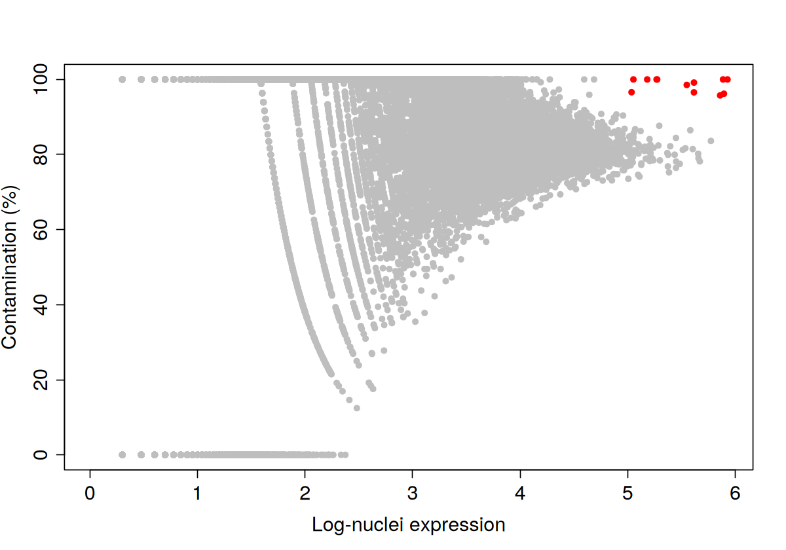
    


```R
# Show mito gene estimates
as.data.frame(contam[is.mito,]) %>% setNames("contamination") %>% arrange(contamination)

# Set lowest mito gene estimate as cutoff, change n in nth() to set higher cutoff
contam.cutoff <- as.data.frame(contam[is.mito,]) %>% setNames("contamination") %>% arrange(contamination) %>% 
    pull(contamination) %>% nth(1)
print(paste("Ambient contamination cutoff:", round(contam.cutoff, 4)))

# Keep genes in which less than N% of the counts are ambient-derived
non.ambient <- contam[,1] < contam.cutoff
summary(non.ambient)

okay.genes <- names(non.ambient)[which(non.ambient)]
print(paste("Number of genes passed the ambient contamination cutoff:", length(okay.genes)))
```


<table class="dataframe">
<caption>A data.frame: 13 √ó 1</caption>
<thead>
	<tr><th></th><th scope=col>contamination</th></tr>
	<tr><th></th><th scope=col>&lt;dbl&gt;</th></tr>
</thead>
<tbody>
	<tr><th scope=row>MT-ATP6</th><td>0.9575062</td></tr>
	<tr><th scope=row>MT-CO2</th><td>0.9619592</td></tr>
	<tr><th scope=row>MT-ND4</th><td>0.9655860</td></tr>
	<tr><th scope=row>MT-ND4L</th><td>0.9659523</td></tr>
	<tr><th scope=row>MT-CYB</th><td>0.9854448</td></tr>
	<tr><th scope=row>MT-ND3</th><td>0.9916748</td></tr>
	<tr><th scope=row>MT-ND1</th><td>1.0000000</td></tr>
	<tr><th scope=row>MT-ND2</th><td>1.0000000</td></tr>
	<tr><th scope=row>MT-CO1</th><td>1.0000000</td></tr>
	<tr><th scope=row>MT-CO3</th><td>1.0000000</td></tr>
	<tr><th scope=row>MT-ND5</th><td>1.0000000</td></tr>
	<tr><th scope=row>MT-ND6</th><td>1.0000000</td></tr>
	<tr><th scope=row>MT-ATP8</th><td>      NaN</td></tr>
</tbody>
</table>


    [1] "Ambient contamination cutoff: 0.9575"


       Mode   FALSE    TRUE    NA's 
    logical    3890   12240   22508 


    [1] "Number of genes passed the ambient contamination cutoff: 12240"


# 2. Cells and genes QC plots

### Define mitochondrial genes 


```R
# Works on both Mouse & Human
is.mito <- rowData(cdSc)$SEQNAME == "MT"
rowData(cdSc)$is_mito <- is.mito

print(paste("Number of annotated mitochondrial genes =", sum(is.mito)))
```

    [1] "Number of annotated mitochondrial genes = 12"


```R
rowData(cdSc)$Symbol[is.mito]
```


<style>
.list-inline {list-style: none; margin:0; padding: 0}
.list-inline>li {display: inline-block}
.list-inline>li:not(:last-child)::after {content: "\00b7"; padding: 0 .5ex}
</style>
<ol class=list-inline><li>'MT-ND1'</li><li>'MT-ND2'</li><li>'MT-CO1'</li><li>'MT-CO2'</li><li>'MT-ATP6'</li><li>'MT-CO3'</li><li>'MT-ND3'</li><li>'MT-ND4L'</li><li>'MT-ND4'</li><li>'MT-ND5'</li><li>'MT-ND6'</li><li>'MT-CYB'</li></ol>


### Add QC metrics


```R
# Add Cell QC
cdSc <- addPerCellQC(cdSc, percent.top = c(50, 100), subsets = list(Mt = is.mito), BPPARAM = bpp)
cdSc$log10GenesPerUMI <- log10(cdSc$detected+1) / log10(cdSc$sum+1)

# Mark potentially problematic genes due to ambient contamination
rowData(cdSc)$is_ambient <- !rownames(cdSc) %in% okay.genes

table(rowData(cdSc)$is_ambient)

# Add feature QC
cdSc <- addPerFeatureQC(cdSc, detection_limit = 0, BPPARAM = bpp)
rowData(cdSc)$n_cells_by_counts <- rowData(cdSc)$detected/100 * ncol(cdSc)
rowData(cdSc)$pct_dropout <- 100 - rowData(cdSc)$detected
```


    
    FALSE  TRUE 
    12026  6103 


#### View information related with cells

We will use `colData()` function to access the metadata related with cells.

**Notes on `colData()` elements**

- `sum` - the sum of counts for each cell (i.e. library size)
- `detected` - number of genes detected above detection limit (default 0))
- `percent.top_XX` - percentage of library size occupied by the most highly expressed genes in each cell
- `subsets_Mt_sum` - counts assigned to mitochondrial genes
- `subsets_Mt_detected` - number of mitochondrial genes detected
- `subsets_Mt_percent` - percentage of each cell's count sum assigned to mitochondrial genes
- `log10GenesPerUMI` - genes detected per count


```R
head(colData(cdSc), 5)
```


    DataFrame with 5 rows and 14 columns
                                     Sample                Barcode       sum  detected percent.top_50
                                   <factor>            <character> <numeric> <integer>      <numeric>
    AAACAAGCAAATACCGATGTTGAC-1 KidneyCancer AAACAAGCAAATACCGATGT..      4077      2134        17.9299
    AAACAAGCAACAGATTATGTTGAC-1 KidneyCancer AAACAAGCAACAGATTATGT..      5985      2833        17.2431
    AAACAAGCAACGTTAGATGTTGAC-1 KidneyCancer AAACAAGCAACGTTAGATGT..      2631      1668        13.4550
    AAACAAGCAAGATAAGATGTTGAC-1 KidneyCancer AAACAAGCAAGATAAGATGT..      5267      2604        15.6256
    AAACAAGCAAGGCCTGATGTTGAC-1 KidneyCancer AAACAAGCAAGGCCTGATGT..      6067      3034        12.2960
                               percent.top_100 subsets_Mt_sum subsets_Mt_detected subsets_Mt_percent
                                     <numeric>      <numeric>           <integer>          <numeric>
    AAACAAGCAAATACCGATGTTGAC-1         24.6750            235                  12            5.76404
    AAACAAGCAACAGATTATGTTGAC-1         23.0242            466                  12            7.78613
    AAACAAGCAACGTTAGATGTTGAC-1         20.9046            100                  12            3.80084
    AAACAAGCAAGATAAGATGTTGAC-1         21.8341            263                  12            4.99335
    AAACAAGCAAGGCCTGATGTTGAC-1         17.6199            210                  12            3.46135
                               altexps_Antibody Capture_sum altexps_Antibody Capture_detected
                                                  <numeric>                         <integer>
    AAACAAGCAAATACCGATGTTGAC-1                         2144                               259
    AAACAAGCAACAGATTATGTTGAC-1                         4576                               296
    AAACAAGCAACGTTAGATGTTGAC-1                         2668                               286
    AAACAAGCAAGATAAGATGTTGAC-1                         3987                               289
    AAACAAGCAAGGCCTGATGTTGAC-1                         5011                               300
                               altexps_Antibody Capture_percent     total log10GenesPerUMI
                                                      <numeric> <numeric>        <numeric>
    AAACAAGCAAATACCGATGTTGAC-1                          34.4639      6221         0.922157
    AAACAAGCAACAGATTATGTTGAC-1                          43.3292     10561         0.914026
    AAACAAGCAACGTTAGATGTTGAC-1                          50.3491      5299         0.942160
    AAACAAGCAAGATAAGATGTTGAC-1                          43.0841      9254         0.917822
    AAACAAGCAAGGCCTGATGTTGAC-1                          45.2338     11078         0.920464


#### View information related with genes

We use `rowData()` function to access the metadata related with genes.

**Notes on `rowData()` elements**

- is_mito - mitochondrial genes
- is_ambient - genes affected by ambient contamination
- mean - mean counts for each genes across all cells
- detected - percentage of cells a gene is detected above detection limit (default 0)
- n_cells_by_counts - number of cells a gene detected
- pct_dropout - percentage of dropouts, i.e. `1 - detected` 

*Dropouts are statistical negatives, could be true negatives or false negatives (not detected properly)*


```R
head(rowData(cdSc), 5)
```


    DataFrame with 5 rows and 11 columns
                         ID      Symbol            Type     SEQNAME   is_mito subsets_Mt is_ambient        mean
                <character> <character>        <factor> <character> <logical>  <logical>  <logical>   <numeric>
    SAMD11  ENSG00000187634      SAMD11 Gene Expression           1     FALSE      FALSE       TRUE 0.000299013
    NOC2L   ENSG00000188976       NOC2L Gene Expression           1     FALSE      FALSE      FALSE 0.237765374
    KLHL17  ENSG00000187961      KLHL17 Gene Expression           1     FALSE      FALSE       TRUE 0.035134058
    PLEKHN1 ENSG00000187583     PLEKHN1 Gene Expression           1     FALSE      FALSE       TRUE 0.016096880
    PERM1   ENSG00000187642       PERM1 Gene Expression           1     FALSE      FALSE       TRUE 0.000398684
              detected n_cells_by_counts pct_dropout
             <numeric>         <numeric>   <numeric>
    SAMD11   0.0299013                 6     99.9701
    NOC2L   18.8627529              3785     81.1372
    KLHL17   3.1496063               632     96.8504
    PLEKHN1  1.3405761               269     98.6594
    PERM1    0.0348849                 7     99.9651


## Plots on cell QC metrics

Low-quality cells need to be identified and removed to ensure that the technical effects do not distort downstream analysis results. Three common measures of cell quality are:

- the total number of UMIs or __library size__ per cell
- the __number of detectable features (i.e. genes)__ in each cell library
- proportion of __mitochondrial genes__ in each cell library

### View library size

The __library size__ is defined as the total sum of UMIs across all genes. Cells with relatively small library sizes are considered to be of low quality as the RNA has not been efficiently captured (i.e., converted into cDNA and amplified) during library preparation. 


```R
# Print library size summary
summary(cdSc$sum)

# Plot histogram
ggplot(as.data.frame(colData(cdSc)), aes(x = sum, fill = Sample)) + 
    geom_histogram(color = "white", alpha = 0.6, linewidth = 0.3, bins = 50) +
    scale_x_continuous(labels = unit_format(unit = "K", scale = 1e-3)) +
    guides(fill = guide_legend(override.aes = list(alpha = 1))) +
    scale_fill_manual(values = c_sample_col) + theme_cowplot(20) +
    labs(x = "Library size", y = "Number of cells", title = "Histogram of library size")
```


       Min. 1st Qu.  Median    Mean 3rd Qu.    Max. 
        496    4114    5151    5689    6123  115343 


    

    


### View number of detected genes

The __number of detectable genes__ in each cell is defined as the number of genes above detection limit (default is with non-zero counts) for that cell. Any cell with very few expressed genes is likely to be of poor quality as the diverse transcript population has not been successfully captured. 


```R
# Print detected genes summary
summary(cdSc$detected)

# Plot histogram
ggplot(as.data.frame(colData(cdSc)), aes(x = detected, fill = Sample)) +
    geom_histogram(color = "white", alpha = 0.6, linewidth = 0.3, bins = 50) +
    scale_x_continuous(labels = unit_format(unit = "K", scale = 1e-3)) +
    guides(fill = guide_legend(override.aes = list(alpha = 1))) +
    scale_fill_manual(values = c_sample_col) + theme_cowplot(20) +
    labs(x = "Number of detected genes", y = "Number of cells", title = "Histogram of detected genes")
```


       Min. 1st Qu.  Median    Mean 3rd Qu.    Max. 
        259    2213    2564    2602    2866    9378 


    
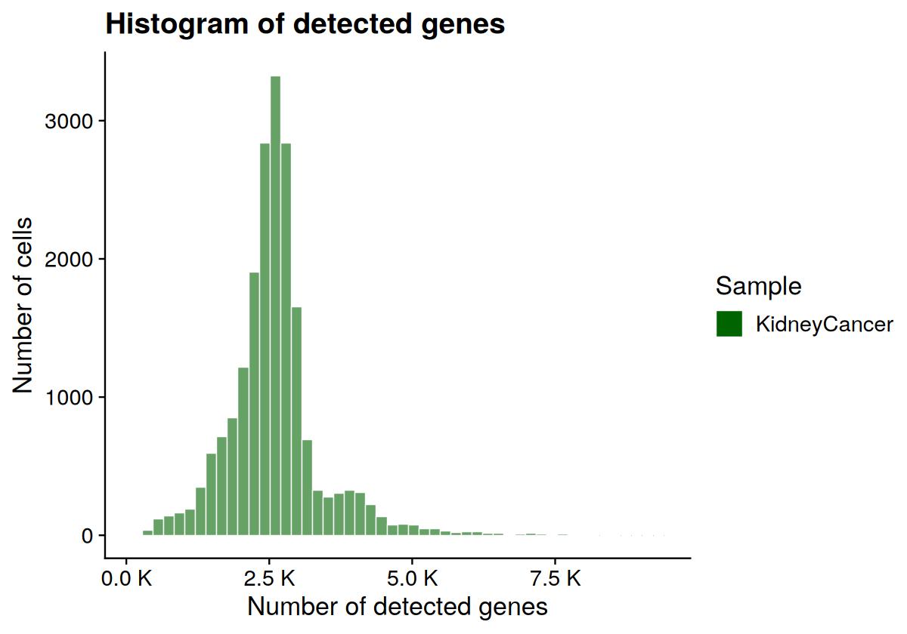
    


### View mitochondrial proportion

High proportions of reads mapping to __mitochondrial genes__ are indicative of poor-quality cells ([Lun et al., 2016](https://pubmed.ncbi.nlm.nih.gov/27909575)), possibly because of increased apoptosis and/or loss of cytoplasmic RNA from lysed cells. 

In snRNA-seq data, the loss of the cytoplasm means that the stripped nuclei should not contain any mitochondrial transcripts. High-quality nuclei __should not contain any mitochondrial transcripts__; the presence of any mitochondrial counts in a library indicates that the removal of the cytoplasm was not complete, possibly introducing irrelevant heterogeneity in downstream analyses.

__For scRNA-seq:__

- A mean below 5% is very good.
- A mean below 10% is good.
- A mean above 20% is no good.


```R
# Print mitochondrial proportion summary
summary(cdSc$subsets_Mt_percent)

print("Number of cells with 0% mitochondrial content:")
data.frame(Sample = cdSc$Sample, ZeroMito = cdSc$subsets_Mt_percent == 0) %>%
    count(Sample, ZeroMito, name = "Count") %>% group_by(Sample) %>% 
    mutate(Percentage = round(prop.table(Count)*100, 2))

# Plot histogram
ggplot(as.data.frame(colData(cdSc)), aes(x = subsets_Mt_percent, fill = Sample)) +
    geom_histogram(color = "white", alpha = 0.6, linewidth = 0.3, bins = 50) +
    guides(fill = guide_legend(override.aes = list(alpha = 1))) +
    scale_fill_manual(values = c_sample_col) + theme_cowplot(20) +
    labs(x = "Mitochondrial proportion (%)", y = "Number of cells", 
         title = "Histogram of mitochondrial proportion")
```


       Min. 1st Qu.  Median    Mean 3rd Qu.    Max. 
      0.387   3.349   4.090   4.517   5.056  49.835 


    [1] "Number of cells with 0% mitochondrial content:"


<table class="dataframe">
<caption>A grouped_df: 1 √ó 4</caption>
<thead>
	<tr><th scope=col>Sample</th><th scope=col>ZeroMito</th><th scope=col>Count</th><th scope=col>Percentage</th></tr>
	<tr><th scope=col>&lt;fct&gt;</th><th scope=col>&lt;lgl&gt;</th><th scope=col>&lt;int&gt;</th><th scope=col>&lt;dbl&gt;</th></tr>
</thead>
<tbody>
	<tr><td>KidneyCancer</td><td>FALSE</td><td>20066</td><td>100</td></tr>
</tbody>
</table>


    
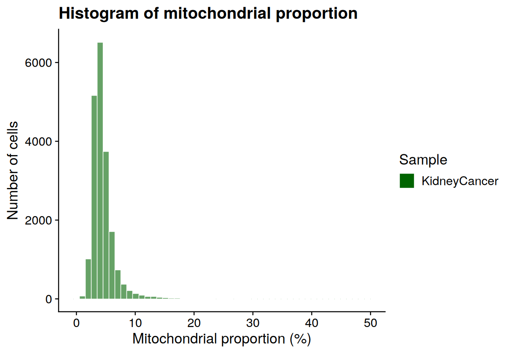
    


### View novelty (complexity of RNA species)

Visualise the overall novelty of the gene expression by showing log10 genes detected per UMI against number of cells. Generally, we expect the novelty score to be above 0.80.


```R
# Print Novelty summary
summary(cdSc$log10GenesPerUMI)

# Plot histogram
ggplot(as.data.frame(colData(cdSc)), aes(x = log10GenesPerUMI, fill = Sample)) +
    geom_histogram(color = "white", alpha = 0.6, linewidth = 0.3, bins = 50) +
    guides(fill = guide_legend(override.aes = list(alpha = 1))) +
    scale_fill_manual(values = c_sample_col) + theme_cowplot(20) +
    labs(x = "log10 nGene per log10 nUMI", y = "Number of cells", 
         title = "Histogram of complexity of RNA species")
```


       Min. 1st Qu.  Median    Mean 3rd Qu.    Max. 
     0.7847  0.9116  0.9190  0.9187  0.9272  0.9795 


    
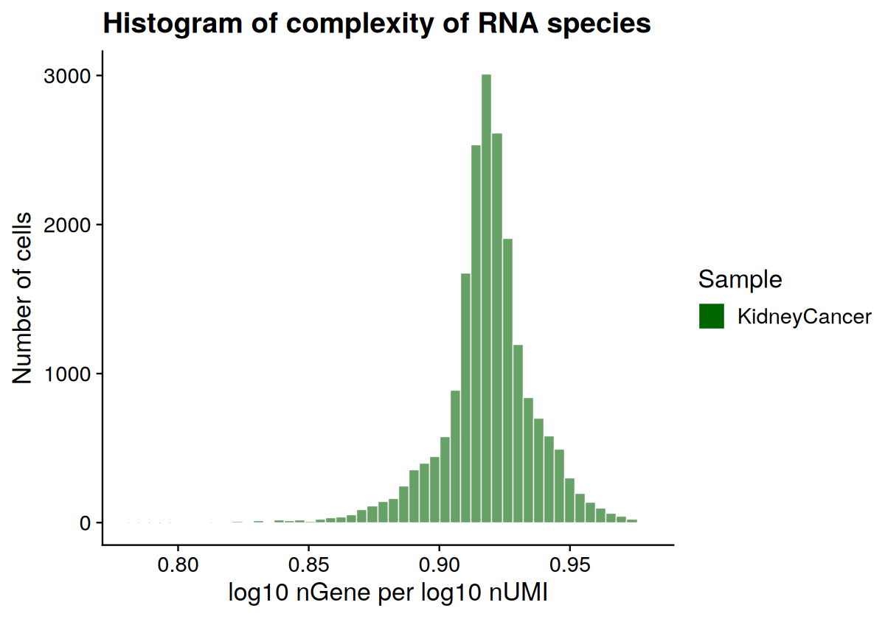
    


### Show relationship between 2 QC metrics 


```R
# Set up log10 scale
log10_breaks <- trans_breaks("log10", function(x) 10^x)
log10_labels <- trans_format("log10", math_format(10^.x))
```


```R
plotColData(cdSc, x = "sum", y = "detected", colour_by = "Sample", other_fields = "Sample", 
            point_alpha = 0.3, theme_size = 20) + facet_wrap(~ Sample) +
    scale_x_log10(breaks = log10_breaks, labels = log10_labels) +
    scale_y_log10(breaks = log10_breaks, labels = log10_labels) +
    scale_color_manual(values = c_sample_col) + theme(legend.position = "none") +
    labs(x = "Library size", y = "Number of detected genes")
```

    Scale for colour is already present.
    Adding another scale for colour, which will replace the existing scale.


    
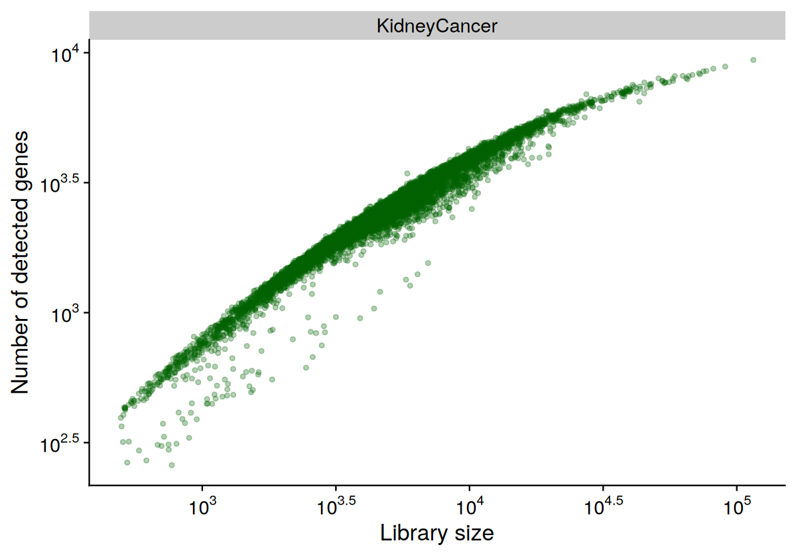
    


```R
plotColData(cdSc, x = "sum", y = "subsets_Mt_percent", colour_by = "Sample", other_fields = "Sample", 
            point_alpha = 0.3, theme_size = 20) + facet_wrap(~ Sample) +
    scale_x_log10(breaks = log10_breaks, labels = log10_labels) +
    scale_color_manual(values = c_sample_col) + theme(legend.position = "none") +
    labs(x = "Library size", y = "Mitochondrial proportion (%)")
```

    Scale for colour is already present.
    Adding another scale for colour, which will replace the existing scale.


    
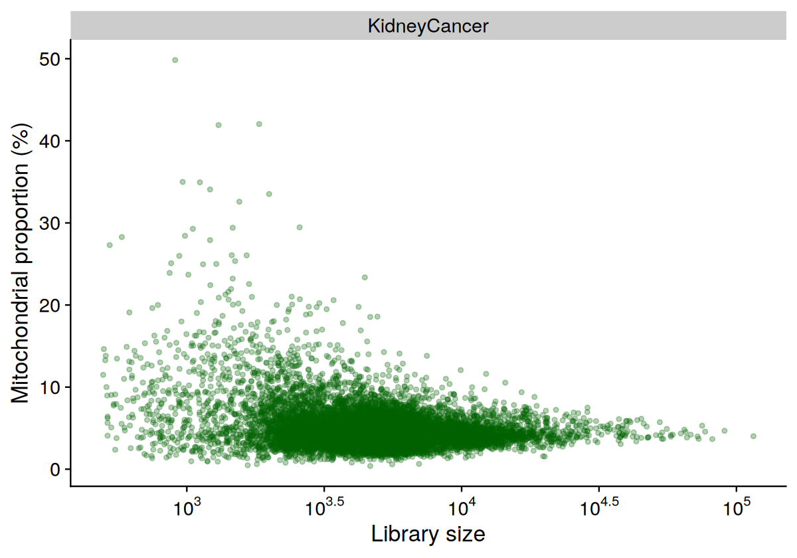
    


```R
plotColData(cdSc, x = "detected", y = "subsets_Mt_percent", colour_by = "Sample", other_fields = "Sample", 
            point_alpha = 0.3, theme_size = 20) + facet_wrap(~ Sample) +
    scale_x_log10(breaks = log10_breaks, labels = log10_labels) +
    scale_color_manual(values = c_sample_col) + theme(legend.position = "none") +
    labs(x = "Number of detected genes", y = "Mitochondrial proportion (%)")
```

    Scale for colour is already present.
    Adding another scale for colour, which will replace the existing scale.


    
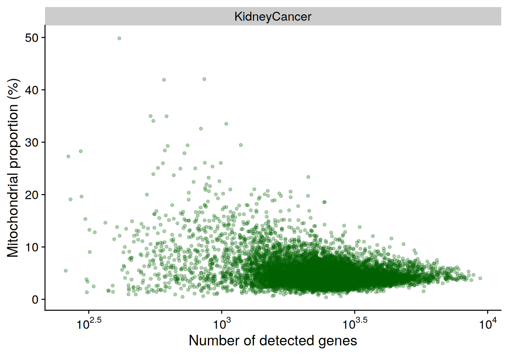
    


```R
plotColData(cdSc, x = "sum", y = "detected", colour_by = "subsets_Mt_percent", size_by = "subsets_Mt_sum", 
            other_fields = "Sample", point_alpha = 0.3, theme_size = 20) + facet_wrap(~ Sample) +
    scale_x_log10(breaks = log10_breaks, labels = log10_labels) +
    scale_y_log10(breaks = log10_breaks, labels = log10_labels) +
    guides(color = guide_colorbar(title = "Mitochondrial\nproportion (%)"), 
           size = guide_legend(title = "Mitochondrial\ncounts", override.aes = list(fill = "black", alpha = 1))) +
    labs(x = "Library size", y = "Number of detected genes")
```


    
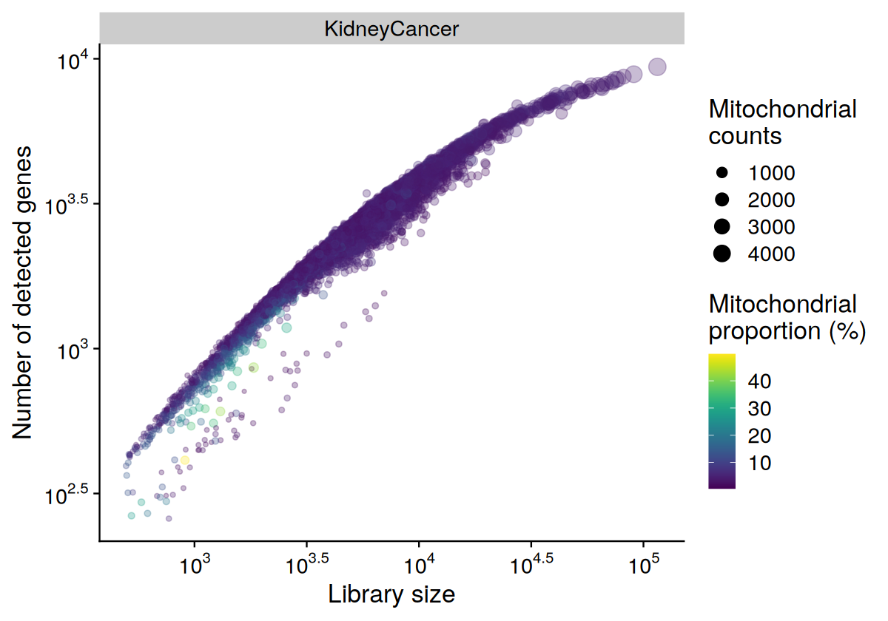
    


## Plots on gene QC metrics

In the plot below, mitochondrial genes (marked in red) often appear at the top right corner of the figure since they are highly expressed in most cells. It is only a problem if these genes make up the majority of a cell's reads (more than 80%). These problematic cells are removed further down this workflow.


```R
plotRowData(cdSc, x = "mean", y = "detected", colour_by = "is_mito", size_by = "is_mito", theme_size = 20) + 
    scale_x_log10(breaks = log10_breaks, labels = log10_labels) + scale_color_manual(values = c("cyan","red")) +
    guides(color = guide_legend(title = "Mito Gene", override.aes = list(size = 4, alpha = 1)), 
           size = guide_legend(title = "Mito Gene")) +
    labs(x = "Mean counts across all cells", y = "Proportion of expressing cell (%)")
```

    Scale for colour is already present.
    Adding another scale for colour, which will replace the existing scale.
    Warning message:
    "Using size for a discrete variable is not advised."
    Warning message in scale_x_log10(breaks = log10_breaks, labels = log10_labels):
    "log-10 transformation introduced infinite values."


    
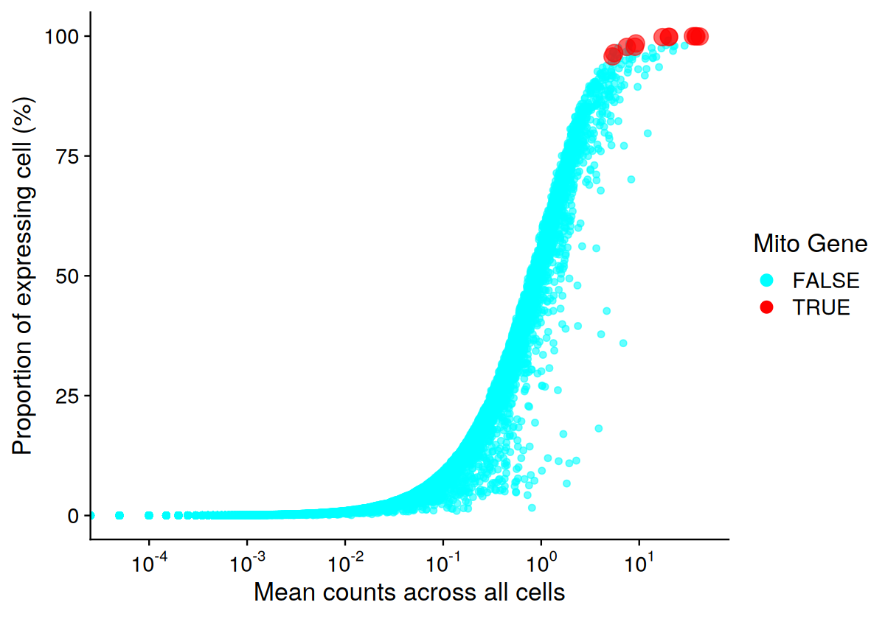
    


In the plot below, genes affected by ambient contamination are marked in red.


```R
plotRowData(cdSc, x = "mean", y = "detected", colour_by = "is_ambient", theme_size = 20) +
    scale_x_log10(breaks = log10_breaks, labels = log10_labels) + scale_color_manual(values = c("cyan","red")) +
    guides(color = guide_legend(title = "Ambient\ncontamination", override.aes = list(size = 4, alpha = 1)), 
           size = guide_legend(title = "Ambient\ncontamination")) +
    labs(x = "Mean counts across all cells", y = "Proportion of expressing cell (%)")
```

    Scale for colour is already present.
    Adding another scale for colour, which will replace the existing scale.
    Warning message in scale_x_log10(breaks = log10_breaks, labels = log10_labels):
    "log-10 transformation introduced infinite values."


    
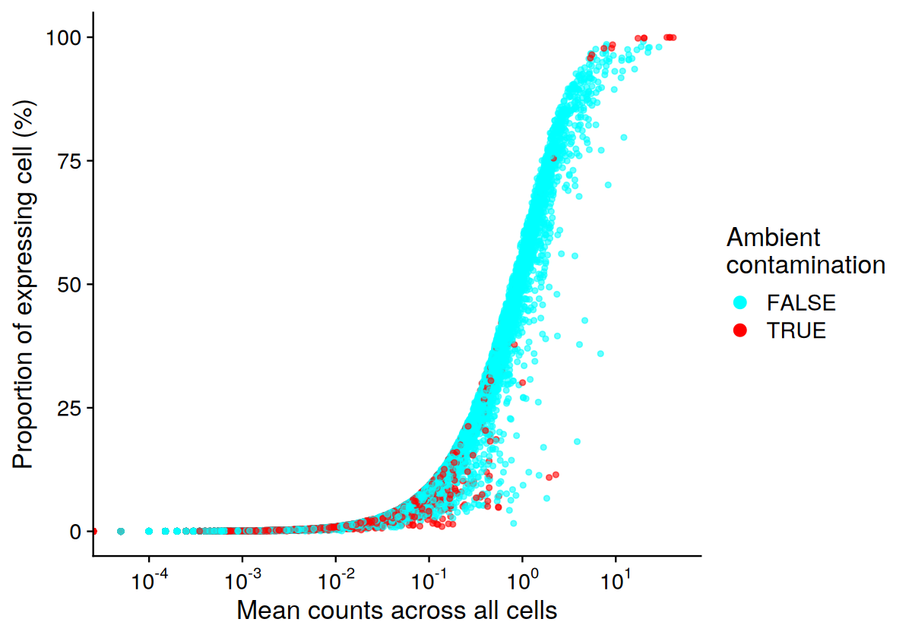
    


In the plot below, it shows log10 mean counts of genes (x-axis) versus number of cells expressing that gene (y-axis). Generally, in single cell datasets there are some genes with very low, or very high, total counts, which accounts for the S shape of the plot.

__Dropouts__ is the proportion of cells a gene is **not** detected. As expected, genes with low mean count have higher percentage of dropouts.


```R
plotRowData(cdSc, x = "mean", y = "n_cells_by_counts", colour_by = "pct_dropout", 
            point_alpha = 0.3, theme_size = 20) +
    scale_x_log10(breaks = log10_breaks, labels = log10_labels) +
    guides(color = guide_colorbar(title = "Dropouts (%)")) +
    labs(x = "Mean counts across all cells", y = "Number of expressing cells")
```

    Warning message in scale_x_log10(breaks = log10_breaks, labels = log10_labels):
    "log-10 transformation introduced infinite values."


    
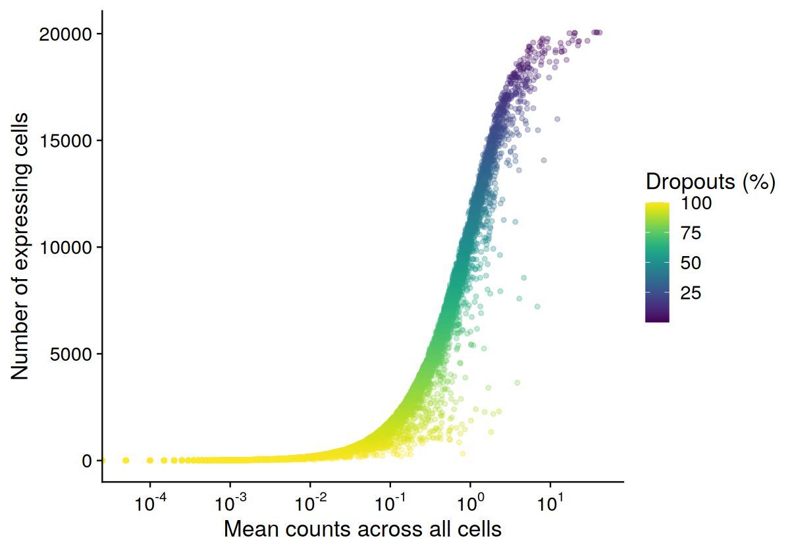
    


# 3. Quality filtering of cells

__Picking thresholds for filtering out poor cells__ is not straightforward for different metrics as their absolute values depend on the protocol and biological system. For example, sequencing to greater depth will lead to more reads, regardless of the quality of the cells. To obtain an adaptive threshold, the assumption made here is that most of the dataset consists of high-quality cells. Plots to facilitate picking thresholds for cell cutoffs are below.

### The distribution of the UMIs, number of detectable genes,  mitochondrial proportion and novelty.

The dotted line represents the threshold which is the **N** Median Absolute Deviation (MAD). Outlier cells are defined as those that are **N** MADs away (can be *lower*, *higher* or *both*) from the median.

For the library size, detectable genes and novelty, cells on the left of the thresholds (i.e. lower) would be filtered out. For mitochondrial proportion, cells on the right of the thresholds (i.e. higher) would be filtered out.

Finally, cells are generally removed for having mitochondrial proportion above 5 MAD. Sometime when an experiment has very low percentage of mitochondrial reads, no removal is necessary.

### Considering experimental factors

More complex studies will involve batches of cells generated with different experimental parameters (e.g., sequencing depth, different donors, etc). It makes little sense to compute medians and MADs from a mixture distribution containing samples from multiple batches. In such cases, the adaptive strategy should be applied to each batch separately. If cells from all batches have been merged into a single `SingleCellExperiment`, the `batch=` argument should be used to ensure that outliers are identified within each batch. This allows `isOutlier()` to accommodate systematic differences in the QC metrics across batches.

## Library size


```R
# Change this setting to adjust and show different threshold
mad1 <- 2
libsize.drop <- isOutlier(cdSc$sum, nmads = mad1, type = "lower", log = TRUE)
cut_off_reads <- attr(libsize.drop, "thresholds")["lower"]
round(cut_off_reads, 2)

# Set minimum library size cutoff at 500 if the MAD cutoff is lower than 500
cut_off_reads <- ifelse(cut_off_reads < 500, 500, cut_off_reads)
round(cut_off_reads, 2)

libsize.drop <- cdSc$sum < cut_off_reads

as.data.frame(colData(cdSc)) %>%
    ggplot(aes(x = sum, fill = factor(Sample))) +
    geom_density(color = NA, alpha = 0.5) + facet_wrap(~ Sample) +
    geom_vline(xintercept = cut_off_reads, colour = "red", linetype = "longdash") +
    annotate("text", x = cut_off_reads, y = Inf, label = round(cut_off_reads, 2), 
             vjust = 2, hjust = -0.2, size = 5) +
    scale_fill_manual(values = c_sample_col) + theme_cowplot(20) +
    scale_x_log10(breaks = log10_breaks, labels = log10_labels) +
    theme(legend.position = "none") +
    labs(x = "Library Size", y = "density", title = "Total count", 
         subtitle = paste(sum(libsize.drop), "cell(s) to the left of cutoff have too low count"))

as.data.frame(colData(cdSc)) %>% cbind(., libsize.drop) %>%
    rename(LowCount = libsize.drop) %>%
    ggplot(aes(x = factor(Sample), y = sum)) + geom_violin(linewidth = 1) +
    geom_jitter(aes(color = LowCount), alpha = 0.3, size = 0.5, 
                position = position_jitter(height = 0, width = 0.15, seed = 123)) +
    scale_color_manual(values = c("black", "red")) + theme_cowplot(20) +
    scale_y_log10(breaks = log10_breaks, labels = log10_labels) +
    guides(color = guide_legend(override.aes = list(size = 4, alpha = 1))) +
    labs(x = "Sample", y = "Library Size", title = "Total count", 
         subtitle = paste(sum(libsize.drop), "cell(s) coloured in red have too low count"))
```


<strong>lower:</strong> 2894.59


<strong>lower:</strong> 2894.59


    
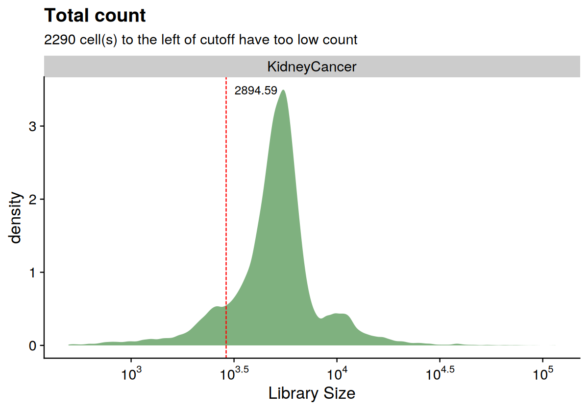
    


    
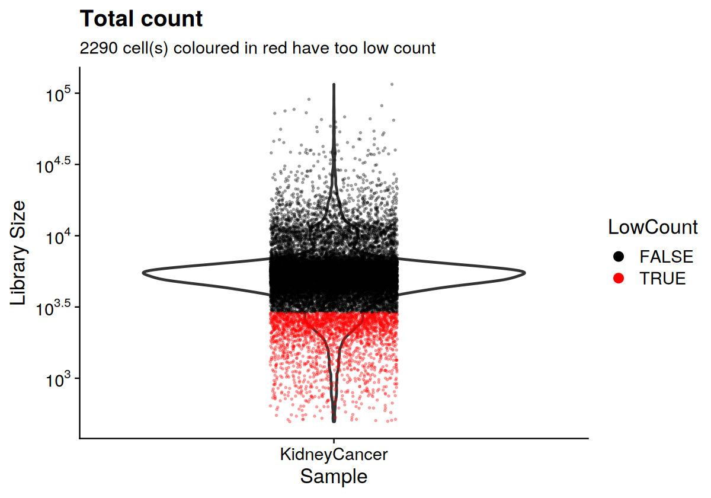
    


## Number of detected genes


```R
# Change this setting to adjust and show different threshold
mad2 <- 2.25
feature.drop <- isOutlier(cdSc$detected, nmads = mad2, type = "lower", log = TRUE)
cut_off_genes <- attr(feature.drop, "thresholds")["lower"]
round(cut_off_genes, 2)

# Set minimum detected genes cutoff at 250 if the MAD cutoff is lower than 250
cut_off_genes <- ifelse(cut_off_genes < 250, 250, cut_off_genes)
round(cut_off_genes,2)

feature.drop <- cdSc$detected < cut_off_genes

as.data.frame(colData(cdSc)) %>%
    ggplot(aes(x = detected, fill = factor(Sample))) + 
    geom_density(color = NA, alpha = 0.5) + facet_wrap(~ Sample) +
    geom_vline(xintercept = cut_off_genes, colour = "red", linetype = "longdash") +
    annotate("text", x = cut_off_genes, y = Inf, label = round(cut_off_genes, 2), 
             vjust = 2, hjust = -0.2, size = 5) +
    scale_fill_manual(values = c_sample_col) + theme_cowplot(20) +
    scale_x_log10(breaks = log10_breaks, labels = log10_labels) +
    theme(legend.position = "none") +
    labs(x = "Number of detected genes", y = "density", title = "Total detected genes", 
         subtitle = paste(sum(feature.drop), "cell(s) to the left of cutoff have too few detected genes"))

as.data.frame(colData(cdSc)) %>% cbind(., feature.drop) %>%
    rename(LowDetected = feature.drop) %>%
    ggplot(aes(x = factor(Sample), y = detected)) + geom_violin(linewidth = 1) +
    geom_jitter(aes(color = LowDetected), alpha = 0.3, size = 0.5, 
                position = position_jitter(height = 0, width = 0.15, seed = 123)) +
    scale_color_manual(values = c("black", "red")) + theme_cowplot(20) + 
    guides(color = guide_legend(override.aes = list(size = 4, alpha = 1))) +
    labs(x = "Sample", y = "Number of detected genes", title = "Total detected genes", 
         subtitle = paste(sum(feature.drop), "cell(s) coloured in red have too few detected genes"))
```


<strong>lower:</strong> 1690.45


<strong>lower:</strong> 1690.45


    
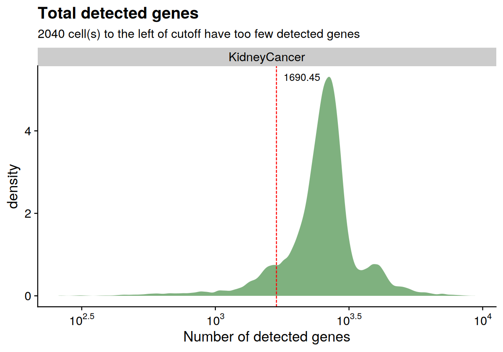
    


    
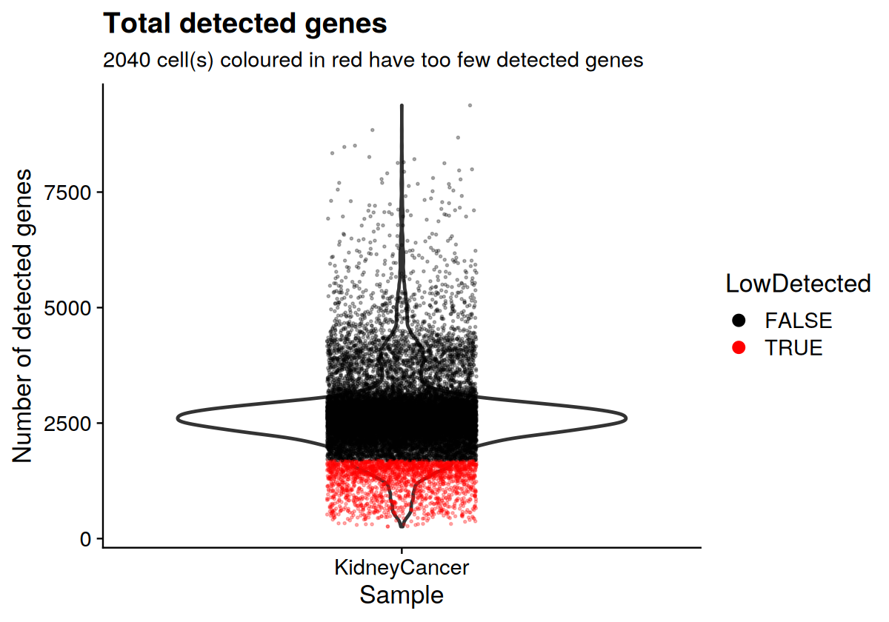
    


## Mitochondrial proportion


```R
# Change this setting to adjust and show different threshold
mad3 <- 3
mito.drop <- isOutlier(cdSc$subsets_Mt_percent, nmads = mad3, type = "higher")
cut_off_MT <- attr(mito.drop, "thresholds")["higher"]
round(cut_off_MT, 2)

# Set minimum cutoff at 10% if the MAD cutoff is lower than 10%
#cut_off_MT <- ifelse(cut_off_MT < 10, 10, cut_off_MT)
# Set maximum cutoff at 20% if the MAD cutoff is higher than 20%
#cut_off_MT <- ifelse(cut_off_MT > 20, 20, cut_off_MT)
# Apply manual cutoff
cut_off_MT <- 10
round(cut_off_MT, 2)

mito.drop <- cdSc$subsets_Mt_percent > cut_off_MT

p <- as.data.frame(colData(cdSc)) %>% 
    ggplot(aes(x = subsets_Mt_percent, fill = factor(Sample))) + 
    geom_density(color = NA, alpha = 0.5) + facet_wrap(~ Sample) +
    geom_vline(xintercept = cut_off_MT, colour = "red", linetype = "longdash") +
    annotate("text", x = cut_off_MT, y = Inf, label = round(cut_off_MT, 2), 
             vjust = 2, hjust = -0.2, size = 5) +
    scale_fill_manual(values = c_sample_col) + theme_cowplot(20) + 
    theme(legend.position = "none") +
    labs(x = "Mitochondrial proportion", y = "density", title = "Mitochondrial proportion", 
         subtitle = paste(sum(mito.drop), "cell(s) to the right of cutoff have too high mitochondrial proportion"))

# Visual zoom to between 0 - 50%
if(max(cdSc$subsets_Mt_percent) > 50) {
    p <- p + coord_cartesian(xlim = c(0, 50))
}

p
```


<strong>higher:</strong> 7.79


10


    
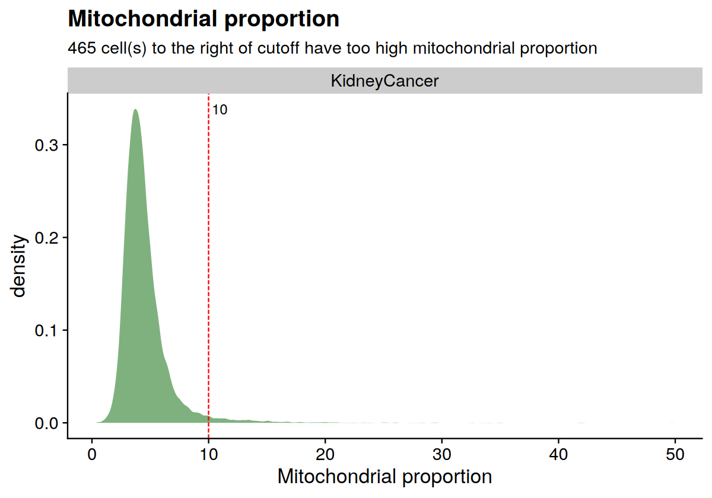
    


## Novelty (complexity of RNA species)

The expected novelty is about 0.8.


```R
# Change this setting to adjust and show different threshold
cut_off_novelty <- 0.865
novelty.drop <- cdSc$log10GenesPerUMI < cut_off_novelty

as.data.frame(colData(cdSc)) %>%
    ggplot(aes(x = log10GenesPerUMI, fill = factor(Sample))) + 
    geom_density(color = NA, alpha = 0.5) + facet_wrap(~ Sample) +
    geom_vline(xintercept = cut_off_novelty, colour = "red", linetype = "longdash") +
    annotate("text", x = cut_off_novelty, y = Inf, label = cut_off_novelty, 
             vjust = 2, hjust = -0.2, size = 5) +
    scale_fill_manual(values = c_sample_col) + theme_cowplot(20) + 
    theme(legend.position = "none") +
    labs(x = "log10 nGene per log10 nUMI", y = "density", title = "Complexity of RNA species", 
         subtitle = paste(sum(novelty.drop), "cells to the left of cutoff have too low complexity"))
```


    
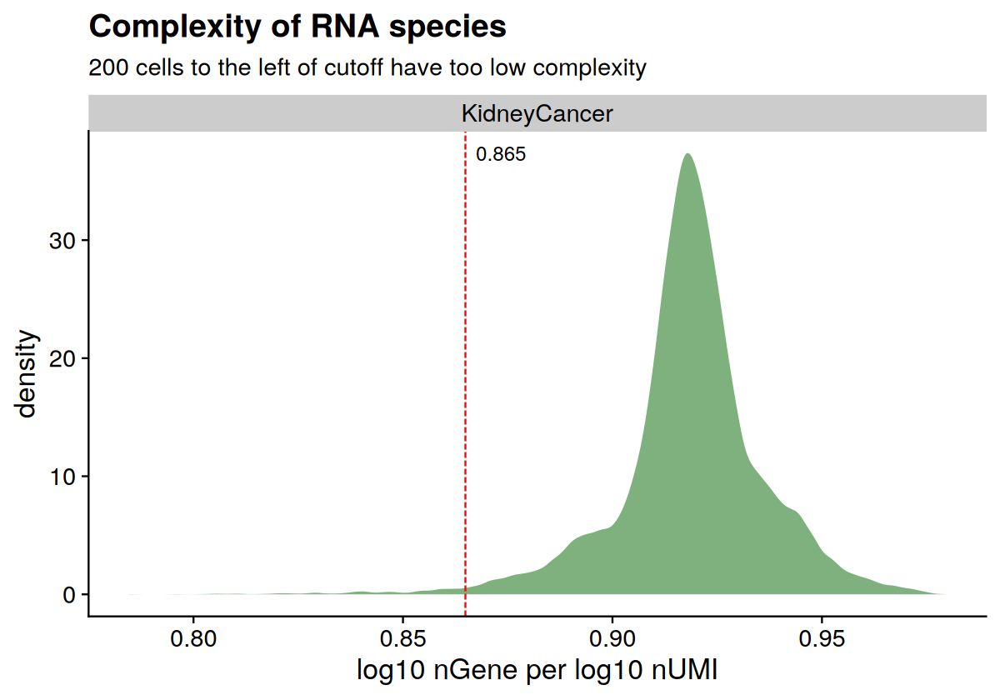
    


## Show cells with extremely high counts

Use `isOutlier` and MAD cutoff to investigate possible outlier cells with high read-depth (could be doublets).


```R
# Change this setting to adjust and show different threshold
mad4 <- 3
highcount.drop <- isOutlier(cdSc$sum, nmads = mad4, type = "higher", log = TRUE)
cut_off_highcount <- attr(highcount.drop, "thresholds")["higher"]
round(cut_off_highcount,2)

# Apply manual cutoff
cut_off_highcount <- 15000
highcount.drop <- cdSc$sum > cut_off_highcount
round(cut_off_highcount,2)

as.data.frame(colData(cdSc)) %>%
    ggplot(aes(x = sum, fill = factor(Sample))) +
    geom_density(color = NA, alpha = 0.5) + facet_wrap(~ Sample) +
    geom_vline(xintercept = cut_off_highcount, colour = "red", linetype = "longdash") +
    annotate("text", x = cut_off_highcount, y = Inf, label = round(cut_off_highcount, 2), 
             vjust = 2, hjust = 1.2, size = 5) +
    scale_fill_manual(values = c_sample_col) + theme_cowplot(20) + 
    scale_x_log10(breaks = log10_breaks, labels = log10_labels) +
    theme(legend.position = "none") +
    labs(x = "Library Size", y = "density", title = "Total count", 
         subtitle = paste(sum(highcount.drop), "cell(s) to the right of cutoff have too high count"))

as.data.frame(colData(cdSc)) %>% cbind(., highcount.drop) %>%
    rename(HighCount = highcount.drop) %>%
    ggplot(aes(x = factor(Sample), y = sum)) + geom_violin(linewidth = 1) +
    geom_jitter(aes(color = HighCount, size = HighCount, alpha = HighCount), 
                position = position_jitter(height = 0, width = 0.15, seed = 123)) +
    scale_alpha_discrete(range = c(0.5, 1)) + scale_size_discrete(range = c(2, 3)) +
    scale_color_manual(values = c("black", "red")) + theme_cowplot(20) + 
    scale_y_continuous(labels = unit_format(unit = "K", scale = 1e-3)) +
    guides(color = guide_legend(override.aes = list(size = 4, alpha = 1))) +
    labs(x = "Sample", y = "Library Size", title = "Total count", 
         subtitle = paste(sum(highcount.drop), "cell(s) coloured in red have extremely high count"))
```


<strong>higher:</strong> 12227.82


15000


    Warning message:
    "Using alpha for a discrete variable is not advised."
    Warning message:
    "Using size for a discrete variable is not advised."


    
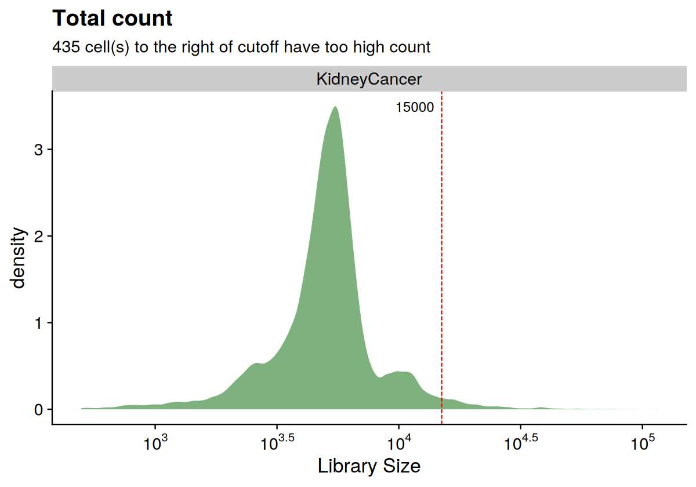
    


    
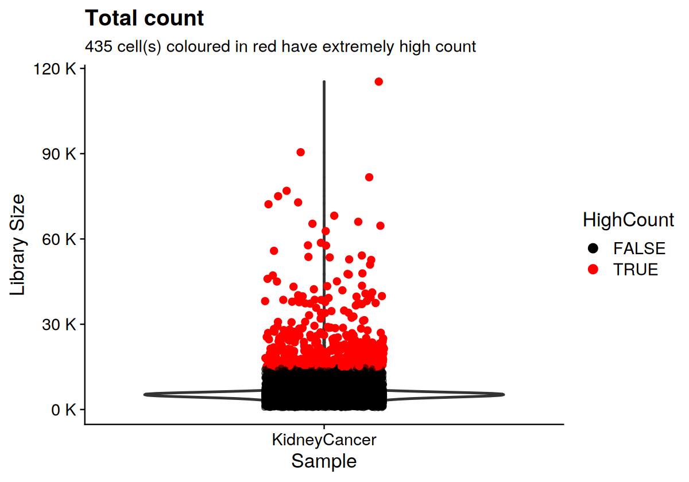
    


## Show outlier summary


```R
print(paste("Cells removed if:"))
print(paste("Read count below library size cutoff:", round(cut_off_reads, 2)))
print(paste("Number of genes expressed below feature cutoff:", round(cut_off_genes, 2)))
print(paste("MT percent above mito cutoff:", round(cut_off_MT, 2)))
print(paste("Novelty cutoff:", round(cut_off_novelty, 2)))
print(paste("High count cutoff:", round(cut_off_highcount, 2)))
```

    [1] "Cells removed if:"
    [1] "Read count below library size cutoff: 2894.59"
    [1] "Number of genes expressed below feature cutoff: 1690.45"
    [1] "MT percent above mito cutoff: 10"
    [1] "Novelty cutoff: 0.86"
    [1] "High count cutoff: 15000"


```R
# Discard summary
discard <- libsize.drop | feature.drop | mito.drop | novelty.drop | highcount.drop
cdSc$discard <- discard

venn.df <- data.frame(Sample = cdSc$Sample, LibSize = libsize.drop, FeaturesExp = feature.drop, 
                      MitoProp = mito.drop, Novelty = novelty.drop, HighCount = highcount.drop, Total = discard)

print(paste("Total number of cells removed:"))
DataFrame(Cells = colSums(venn.df[,2:7]))
```

    [1] "Total number of cells removed:"


    DataFrame with 6 rows and 1 column
                    Cells
                <numeric>
    LibSize          2290
    FeaturesExp      2040
    MitoProp          465
    Novelty           200
    HighCount         435
    Total            2898


```R
limma::vennDiagram(venn.df[,2:6], cex = c(1.5,1.2,1.0))
```


    
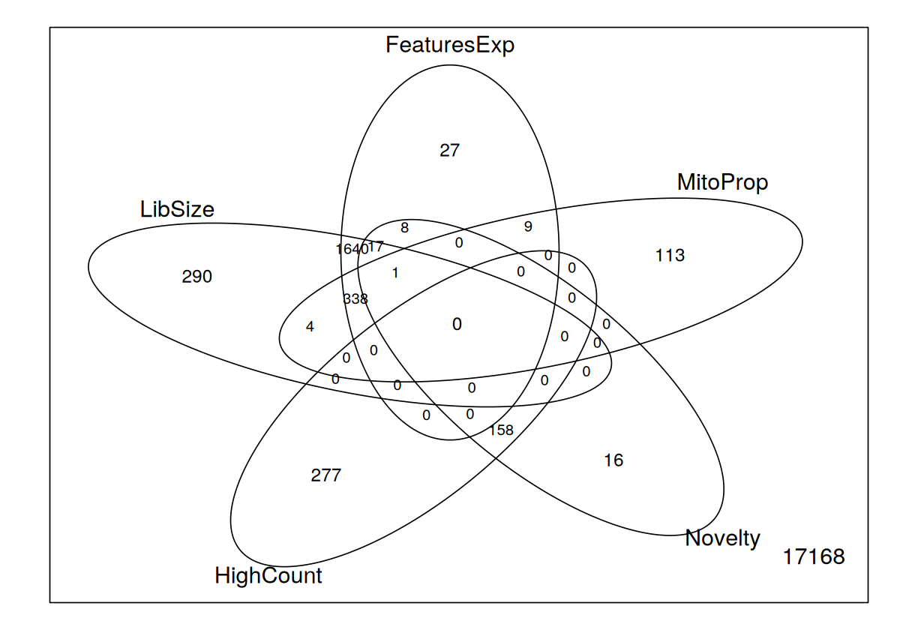
    


Use __QC plot(s) below__ to check result and decide whether further filtering is required.


```R
fig(width = 16, height = 8)
plotColData(cdSc, x = "sum", y = "detected", colour_by = "subsets_Mt_percent", 
            other_fields = c("Sample","discard"), point_size = 2, point_alpha = 0.3, theme_size = 20) +
    facet_grid(discard ~ Sample) +
    scale_x_log10(breaks = log10_breaks, labels = log10_labels) +
    scale_y_log10(breaks = log10_breaks, labels = log10_labels) +
    guides(color = guide_colorbar(title = "Mitochondrial\nproportion (%)")) +
    labs(x = "Library size", y = "Number of detected genes")
reset.fig()
```


    
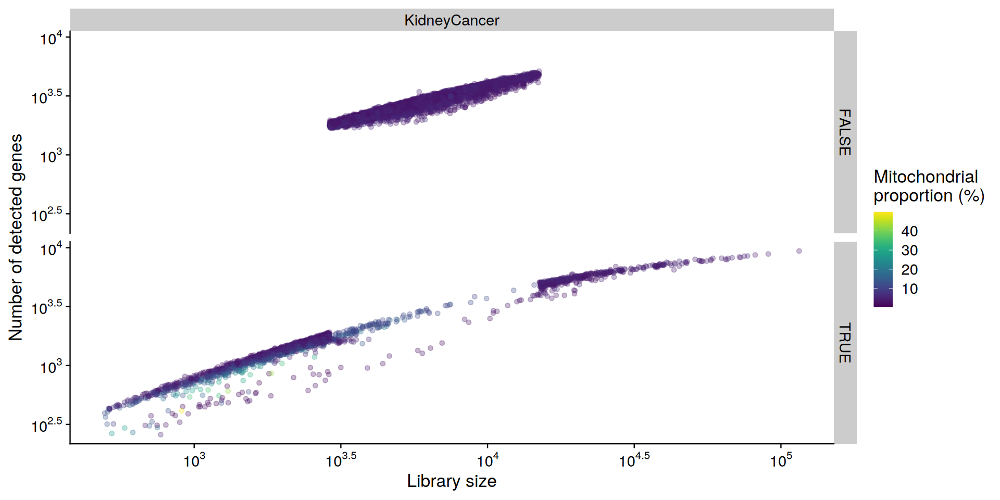
    


## Filter poor-quality cells

A new object is created with the filtered dataset.


```R
cdScAnnot <- cdSc[, !cdSc$discard]
cdScAnnot
```


    class: SingleCellExperiment 
    dim: 18129 17168 
    metadata(1): Samples
    assays(1): counts
    rownames(18129): SAMD11 NOC2L ... MT-ND6 MT-CYB
    rowData names(11): ID Symbol ... n_cells_by_counts pct_dropout
    colnames(17168): AAACAAGCAAATACCGATGTTGAC-1 AAACAAGCAACAGATTATGTTGAC-1 ...
      TTTGTGAGTGTCCTTCATGTTGAC-1 TTTGTGAGTTGGATGAATGTTGAC-1
    colData names(15): Sample Barcode ... log10GenesPerUMI discard
    reducedDimNames(0):
    mainExpName: Gene Expression
    altExpNames(1): Antibody Capture


```R
print(paste("Total cells before quality filtering =", ncol(cdSc)))
print(paste("Total cells before quality filtering, per sample:"))
table(cdSc$Sample)

print(paste("Total cells remaining after quality filtering =", ncol(cdScAnnot)))
print(paste("Total cells after quality filtering, per sample:"))
table(cdScAnnot$Sample)
```

    [1] "Total cells before quality filtering = 20066"
    [1] "Total cells before quality filtering, per sample:"


    
    KidneyCancer 
           20066 


    [1] "Total cells remaining after quality filtering = 17168"
    [1] "Total cells after quality filtering, per sample:"


    
    KidneyCancer 
           17168 


```R
# Show library size
as.data.frame(colData(cdScAnnot)) %>% 
    ggplot(aes(x = factor(Sample), y = sum, color = Sample)) + geom_violin(linewidth = 1) +
    geom_jitter(alpha = 0.5, size = 1, position = position_jitter(height = 0, width = 0.15, seed = 123)) +
    scale_color_manual(values = c_sample_col) + theme_cowplot(20) + 
    guides(color = guide_legend(override.aes = list(size = 4, alpha = 1))) +
    theme(legend.position = "none") + labs(x = "Sample", y = "Library Size", title = "Total UMI count")
```


    
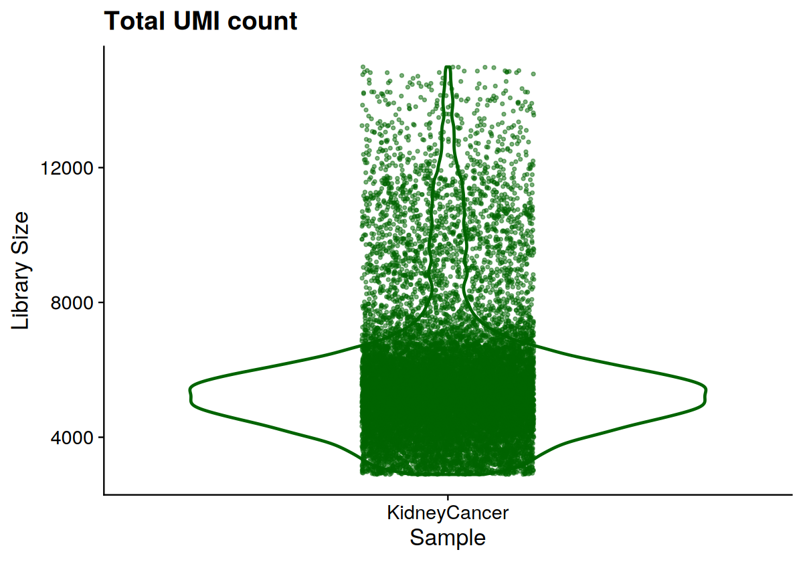
    


## Update PerFeatureQC due to cell filtering


```R
rowData(cdScAnnot) <- rowData(cdScAnnot)[,!colnames(rowData(cdScAnnot)) %in% 
                                         c("mean","detected","n_cells_by_counts","pct_dropout")]
cdScAnnot <- addPerFeatureQC(cdScAnnot, detection_limit = 0, BPPARAM = bpp)
rowData(cdScAnnot)$n_cells_by_counts <- rowData(cdScAnnot)$detected/100 * ncol(cdScAnnot)
rowData(cdScAnnot)$pct_dropout <- 100 - rowData(cdScAnnot)$detected

cdScAnnot
```


    class: SingleCellExperiment 
    dim: 18129 17168 
    metadata(1): Samples
    assays(1): counts
    rownames(18129): SAMD11 NOC2L ... MT-ND6 MT-CYB
    rowData names(11): ID Symbol ... n_cells_by_counts pct_dropout
    colnames(17168): AAACAAGCAAATACCGATGTTGAC-1 AAACAAGCAACAGATTATGTTGAC-1 ...
      TTTGTGAGTGTCCTTCATGTTGAC-1 TTTGTGAGTTGGATGAATGTTGAC-1
    colData names(15): Sample Barcode ... log10GenesPerUMI discard
    reducedDimNames(0):
    mainExpName: Gene Expression
    altExpNames(1): Antibody Capture


Create a `dgCMatrix` counts matrix for faster computation in some steps.


```R
annot_c <- as(counts(cdScAnnot, withDimnames = FALSE), "dgCMatrix")
rownames(annot_c) <- rownames(cdScAnnot)
```

# 4. Classification of cell cycle phase

On occasion, it can be desirable to determine cell cycle activity from scRNA-seq data. In and of itself, the distribution of cells across phases of the cell cycle is not usually informative, but we can use this to determine if there are differences in proliferation between subpopulations or across treatment conditions.

The prediction method used here is described by [Scialdone et al. (2015)](https://www.sciencedirect.com/science/article/pii/S1046202315300098) to classify cells into cell cycle phases based on the gene expression data. Using a training dataset, the sign of the difference in expression between two genes was computed for each pair of genes. Pairs with changes in the sign across cell cycle phases were chosen as markers. Cells in a test dataset can then be classified into the appropriate phase, based on whether the observed sign for each marker pair is consistent with one phase or another. We do the cell cycle classification before gene filtering as this provides more precise cell cycle phase classifications. This approach is implemented in the Cyclone function using a pre-trained set of marker pairs for human data. Some additional work is necessary to match the gene symbols in the data to the Ensembl annotation in the pre-trained marker set.

Previously, the workflow uses `org.XX.eg.db` to map SYMBOL from `rowData` to Ensembl ID. However the `rowData` now contains Ensembl ID, therefore the mapping step is not necessary.

## Load pre-trained set of marker pairs

<div class="alert alert-warning">
  <strong>Warning!</strong> Edits required to choose human or mouse cycle markers.
</div>


```R
# Human
sample.pairs <- readRDS(system.file("exdata", "human_cycle_markers.rds", package = "scran"))

# Mouse
#sample.pairs <- readRDS(system.file("exdata", "mouse_cycle_markers.rds", package = "scran"))
```

## Run `cyclone` classifier

__Background about Cell Cycle Analysis__

- Cells are classified as being in G1 phase (not in cell division aka cell cycle) if their G1 score is above 0.5 and greater than the G2/M score.
- Cells are classified as being in S phase (synthesis of DNA, replication) if neither score is above 0.5.
- Cells are classified as being in G2/M phase (gap between DNA synthesis and mitosis) if their G2/M score is above 0.5 and greater than the G1 score.
 
The cell-cycle status of cells can be a significant confounding factor in some datasets i.e. clusters forming on the basis of cell cycle status instead of other biological factors of interest. The goal at this stage is only to assess the cell cycle status of cells not to try normalise it away.

This method would be less accurate for data that are substantially different from those used in the training set, e.g., due to the use of a different protocol. This dataset uses UMI counts, which has an entirely different set of biases, e.g., 3’-end coverage only, no length bias, no amplification noise. These new biases (and the absence of expected biases) may interfere with accurate classification of some cells. So there is some uncertainty with this analysis. 

Nevertheless we need to keep in mind that there could be quite high cell-cycle effect which might confound the dataset. To avoid problems from misclassification, no processing of this dataset by cell cycle phase will be done here.


```R
set.seed(12345)
# Use counts from cdScAnnot
assignments <- cyclone(annot_c, sample.pairs, gene.names = rowData(cdScAnnot)$ID, verbose = TRUE, BPPARAM = bpp)

## Assigning cell-cycle stages to the scater object
cdScAnnot$CellCycle <- factor(assignments$phases)

print("Predicted phase:")
table(Sample = cdScAnnot$Sample, "Phases (cells)" = cdScAnnot$CellCycle)
round(prop.table(table(Sample = cdScAnnot$Sample, "Phases (%)" = cdScAnnot$CellCycle))*100, 2)
```

    Number of G1 pairs: 22619
    
    Number of S pairs: 28314
    
    Number of G2M pairs: 19788
    


    [1] "Predicted phase:"


                  Phases (cells)
    Sample           G1  G2M    S
      KidneyCancer 9090  813 7265


                  Phases (%)
    Sample            G1   G2M     S
      KidneyCancer 52.95  4.74 42.32


Generally if they are on G1 stage, then they are not in cell-cycle stage and if on G2/M then they are cell-cycle stages. If they are in S, which is the synthesis phase indicating DNA is being replicated.


```R
fig(width = 9, height = 8)
plotCyclone(assignments, phase_color = c_phase_col, title = "Cell cycle phase scores")
reset.fig()
```


    
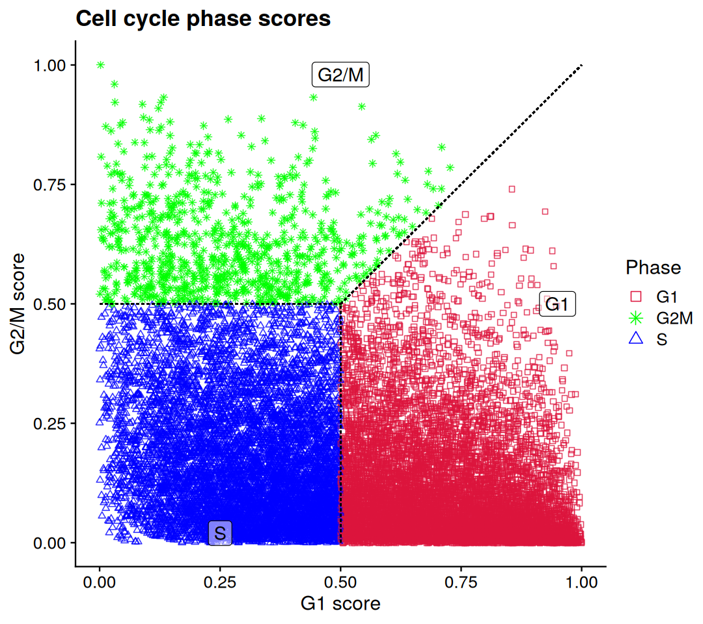
    


## Save `cyclone` results to `metadata`


```R
metadata(cdScAnnot)[['cyclone']] <- assignments
```

# 5. Expression normalization

Single cell RNA-seq data requires different normalisation to bulk data methods (e.g. DESeq2) because scRNA-seq is very sparse. Here the deconvolution based method will be used.

__Further detail on the deconvolution method to deal with zero counts:__ 
Read counts are subject to differences in capture efficiency and sequencing depth between cells ([Stegle et al., 2015](https://www.nature.com/articles/nrg3833)). Normalisation is required to eliminate these cell-specific biases prior to downstream quantitative analyses. In bulk data this is often done by assuming that most genes are not differentially expressed (DE) between cells. Any systematic difference in count size across the non-DE majority of genes between two cells is assumed to represent bias and is removed by scaling. More specifically, “size factors” are calculated that represent the extent to which counts should be scaled in each library. Single-cell data can be problematic due to the dominance of low and zero counts. To overcome this, counts from many cells are pooled to increase the count size for accurate size factor estimation ([Lun et al., 2016](https://genomebiology.biomedcentral.com/articles/10.1186/s13059-016-0947-7)). Pool-based size factors are then “deconvolved” into cell-based factors for cell-specific normalisation.

## Compute deconvolution size factors

In general, it is more appropriate to pool more similar cells to avoid violating the assumption of a non-DE majority of genes. This can be done by specifying the `clusters` argument where cells in each cluster have similar expression profiles. Deconvolution is subsequently applied on the cells within each cluster, where there should be fewer DE genes between cells. A convenience function `quickCluster` is provided for this purpose, though any reasonable clustering can be used. Only a rough clustering is required here, as `calculateSumFactors` is robust to a moderate level of DE within each cluster.

After performing `calculateSumFactors`, we store size factors in a new column called `sizeFactor` in `colData`. The values can be retrieved by using the `sizeFactors` function.


```R
# Using pre-clustering
set.seed(12345)
# We want at least 100 cells per cluster, i.e. min.size = 100
qclust <- quickCluster(annot_c, min.size = 100, BPPARAM = bpp)
table(qclust)

# Default min.mean to 1 for read count data and 0.1 for UMI data
sizeFactors(cdScAnnot) <- calculateSumFactors(annot_c, cluster = qclust, min.mean = 0.1, BPPARAM = bpp)
summary(sizeFactors(cdScAnnot)) # same as cdScAnnot$sizeFactor
```


    qclust
       1    2    3    4    5    6    7    8    9   10   11   12   13   14   15   16   17   18   19   20   21 
     242 1378 2786  206  594  371 3592 1348 1055  295 1213  348 1229 1084  127  480  314  121  112  125  148 


       Min. 1st Qu.  Median    Mean 3rd Qu.    Max. 
     0.4061  0.7935  0.9323  1.0000  1.0864  2.8561 


## Compute log-transformed normalized expression values

The count data are used to compute normalised log-expression values for use in downstream analyses. Each value is defined as the log-ratio of each count to the size factor for the corresponding cell, after adding a prior count of 1 to avoid undefined values at zero counts. Division by the size factor ensures that any cell-specific biases are removed. If spike-in-specific size factors are present in sce, they will be automatically applied to normalise the spike-in transcripts separately from the endogenous genes.

The log-transformation provides some measure of variance stabilization ([Law et al., 2014](https://www.ncbi.nlm.nih.gov/pmc/articles/PMC4053721/)), so that high-abundance genes with large variances do not dominate downstream analyses. The computed values are stored as an expression matrix in addition to the other assay elements.

When `sizeFactor` is present in `colData()`, the normalised expression computation will use this by default when `size.factors = NULL`.


```R
cdScAnnot <- logNormCounts(cdScAnnot)
cdScAnnot
```


    class: SingleCellExperiment 
    dim: 18129 17168 
    metadata(2): Samples cyclone
    assays(2): counts logcounts
    rownames(18129): SAMD11 NOC2L ... MT-ND6 MT-CYB
    rowData names(11): ID Symbol ... n_cells_by_counts pct_dropout
    colnames(17168): AAACAAGCAAATACCGATGTTGAC-1 AAACAAGCAACAGATTATGTTGAC-1 ...
      TTTGTGAGTGTCCTTCATGTTGAC-1 TTTGTGAGTTGGATGAATGTTGAC-1
    colData names(17): Sample Barcode ... CellCycle sizeFactor
    reducedDimNames(0):
    mainExpName: Gene Expression
    altExpNames(1): Antibody Capture


Create a `dgCMatrix` logcounts matrix for faster computation in some steps.


```R
annot_l <- as(logcounts(cdScAnnot, withDimnames = FALSE), "dgCMatrix")
rownames(annot_l) <- rownames(cdScAnnot)
```

# 6. Feature (HVGs) selection

We often use scRNA-seq data in exploratory analyses to characterize heterogeneity across cells. Procedures like clustering and dimensionality reduction compare cells based on their gene expression profiles. We want to select genes that contain useful information about the biology of the system while removing genes that contain random noise. 

The simplest approach to feature selection is to select the most variable genes based on their expression across the population. Several methods are available to quantify the variation per gene and to select an appropriate set of highly variable genes (HVGs).

1. Variance of the log-counts (`modelGeneVar`): Model the variance of the log-expression profiles for each gene, decomposing it into technical and biological components based on a fitted mean-variance trend.
2. Coefficient of variation (`modelGeneCV2`): Model the squared coefficient of variation (CV<sup>2</sup>) of the normalized expression profiles for each gene, fitting a trend to account for the mean-variance relationship across genes.
3. Quantifying technical noise: In some scenarios where many genes at a particular abundance are affected by a biological process and caused the fitted trend to be inflated, e.g. by strong upregulation of cell type-specific genes. We can fit a mean-dependent trend to the variance of the spike-in transcripts, so the fitted value of the spike-in trend should represent a better estimate of the technical component for each gene.
  - With spike-in data (`modelGeneVarWithSpikes`): Model the variance of the log-expression profiles for each gene, decomposing it into technical and biological components based on a mean-variance trend fitted to spike-in transcripts.
  - Without spike-in data (`modelGeneVarByPoisson`): In the absence of spike-in data, one can attempt to create a trend by making some distributional assumptions about the noise.

#### About the returned DataFrame:

- mean: Mean normalised log-expression per gene.
- total: Variance of the normalised log-expression per gene.
- bio: Biological component of the variance.
- tech: Technical component of the variance.
- p.value, FDR: Raw and adjusted p-values for the test against the null hypothesis that bio<=0.

<div class="alert alert-info">
    <strong>Info!</strong> Create a new object <code>cdScFilt</code> so that modelling is only performed on this subset of genes.
</div>


```R
# Not is_ambient
#cdScFilt <- cdScAnnot[!rowData(cdScAnnot)$is_ambient,]

# Not is_ambient and not is_mito
#cdScFilt <- cdScAnnot[!rowData(cdScAnnot)$is_ambient & !rowData(cdScAnnot)$is_mito,]

# Not is_ambient and not is_mito and not ribosomal protein-coding genes (Human & Mouse)
cdScFilt <- cdScAnnot[!rowData(cdScAnnot)$is_ambient & !rowData(cdScAnnot)$is_mito & 
                      !grepl("^RPL|^RPS|^Rpl|^Rps", rownames(cdScAnnot)),]
cdScFilt
```


    class: SingleCellExperiment 
    dim: 12026 17168 
    metadata(2): Samples cyclone
    assays(2): counts logcounts
    rownames(12026): NOC2L RNF223 ... KDM5D EIF1AY
    rowData names(11): ID Symbol ... n_cells_by_counts pct_dropout
    colnames(17168): AAACAAGCAAATACCGATGTTGAC-1 AAACAAGCAACAGATTATGTTGAC-1 ...
      TTTGTGAGTGTCCTTCATGTTGAC-1 TTTGTGAGTTGGATGAATGTTGAC-1
    colData names(17): Sample Barcode ... CellCycle sizeFactor
    reducedDimNames(0):
    mainExpName: Gene Expression
    altExpNames(1): Antibody Capture


Create `dgCMatrix` counts and logcounts matrices for faster computation in some steps.


```R
filt_c <- as(counts(cdScFilt, withDimnames = FALSE), "dgCMatrix")
rownames(filt_c) <- rownames(filt_c)

filt_l <- as(logcounts(cdScFilt, withDimnames = FALSE), "dgCMatrix")
rownames(filt_l) <- rownames(cdScFilt)
```

## Quantifying per-gene variation

### Model the variance of the log-expression profiles for each gene


```R
set.seed(12345)
var.out1 <- modelGeneVar(filt_l, BPPARAM = bpp) # logcounts
var.out1 %>% as.data.frame %>% arrange(FDR, desc(bio)) %>% dplyr::select(1:6) %>% DataFrame
```


    DataFrame with 12026 rows and 6 columns
                  mean     total      tech       bio      p.value          FDR
             <numeric> <numeric> <numeric> <numeric>    <numeric>    <numeric>
    GNLY      1.236668  3.941864  0.751971  3.189893 7.44797e-142 8.85564e-138
    LYZ       0.407114  1.612934  0.385311  1.227623  5.33732e-81  3.17304e-77
    CCL5      1.331915  3.162595  0.768501  2.394093  1.54993e-77  6.14289e-74
    NKG7      1.092416  2.900703  0.719321  2.181382  1.37780e-73  4.09550e-70
    IGHM      0.177637  0.761377  0.192074  0.569302  2.15600e-70  5.12696e-67
    ...            ...       ...       ...       ...          ...          ...
    TMSB15A          0         0         0         0          NaN          NaN
    GRIA3            0         0         0         0          NaN          NaN
    DCAF12L1         0         0         0         0          NaN          NaN
    XPNPEP2          0         0         0         0          NaN          NaN
    CTAG2            0         0         0         0          NaN          NaN


### Model the per-gene count variance with Poisson noise

For each gene, the function computes the variance and mean of the log-expression values. A trend is fitted to the variance against the mean for simulated Poisson counts. The assumption is that the technical component is Poisson-distributed, or at least negative binomial-distributed with a known constant dispersion. This is useful for UMI count data sets that do not have spike-ins and are too heterogeneous to assume that most genes exhibit negligible biological variability.

*The normalised log-expression used to calculate the per-gene mean here are identical to that calculated by `logNormCounts`, and are different from that by log2 cpm method.*


```R
set.seed(12345)
var.out2 <- modelGeneVarByPoisson(filt_c, BPPARAM = bpp) # counts
var.out2 %>% as.data.frame %>% arrange(FDR, desc(bio)) %>% dplyr::select(1:6) %>% DataFrame
```


    DataFrame with 12026 rows and 6 columns
                  mean     total      tech       bio   p.value       FDR
             <numeric> <numeric> <numeric> <numeric> <numeric> <numeric>
    GNLY       1.24988   4.03294  0.616307   3.41663         0         0
    CCL5       1.34318   3.22343  0.613799   2.60963         0         0
    FOS        2.24619   3.00063  0.456851   2.54378         0         0
    NKG7       1.10272   2.97217  0.609498   2.36267         0         0
    CD74       1.99641   2.69761  0.513851   2.18376         0         0
    ...            ...       ...       ...       ...       ...       ...
    TMSB15A          0         0         0         0       NaN       NaN
    GRIA3            0         0         0         0       NaN       NaN
    DCAF12L1         0         0         0         0       NaN       NaN
    XPNPEP2          0         0         0         0       NaN       NaN
    CTAG2            0         0         0         0       NaN       NaN


### Assess the fit

We assess the suitability of the trend fitted to the endogenous variances by examining whether it is consistent with the variances. The trend passes through or close to most of the endogenous gene variances, indicating that our assumption (that most genes have low levels of biological variability) is valid. This strategy exploits the large number of endogenous genes to obtain a stable trend. 

#### Visualizing the fit: `modelGeneVar`


```R
# modelGeneVar
if("per.block" %in% colnames(var.out1)) {
    blocked.stats <- var.out1$per.block
    n <- length(names(blocked.stats))
    p <-  vector("list", n)

    for(i in 1:n) {
        p[[i]] <- plotVariableFeature(cdScFilt, var = blocked.stats[[i]], 
                                      title = paste("modelGeneVar:", names(blocked.stats)[i])) +
            theme(legend.position = "top", legend.justification = "left")
    }
} else {
    p <-  vector("list", 1)
    p[[1]] <- plotVariableFeature(cdScFilt, var = var.out1, title = "modelGeneVar")
}

fig(width = 16, height = 7)
plot_grid(plotlist = p)
reset.fig()
```


    
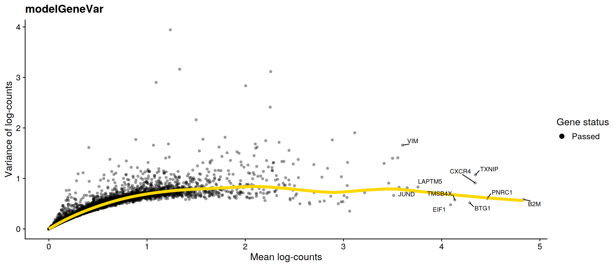
    


Ideally the plot above would look like the mountain, where it would have rise in the middle but then drop off at the end (low variance for highly expressed genes). The trend line would follow it as well.

#### Visualizing the fit: `modelGeneVarByPoisson`


```R
# modelGeneVarByPoisson
if("per.block" %in% colnames(var.out2)) {
    blocked.stats <- var.out2$per.block
    n <- length(names(blocked.stats))
    p <-  vector("list", n)

    for(i in 1:n) {
        p[[i]] <- plotVariableFeature(cdScFilt, var = blocked.stats[[i]], 
                                      title = paste("modelGeneVarByPoisson:", names(blocked.stats)[i])) +
            theme(legend.position = "top", legend.justification = "left")
    }
} else {
    p <-  vector("list", 1)
    p[[1]] <- plotVariableFeature(cdScFilt, var = var.out2, title = "modelGeneVarByPoisson")
}

fig(width = 16, height = 7)
plot_grid(plotlist = p)
reset.fig()
```


    
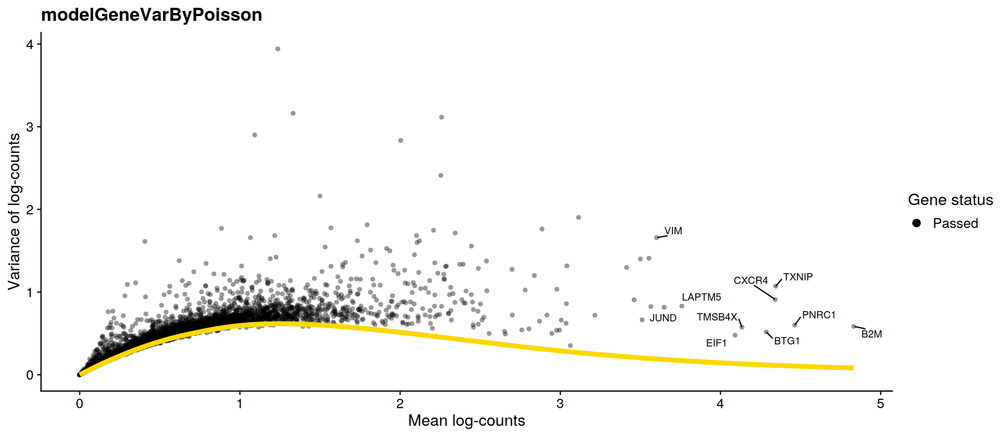
    


## Selecting highly variable genes

Once the per-gene variations are quantified, the next step is to select the HVGs to be used in downstream analyses. Selecting a larger number of HVGs will allow use to retain more potentially relevant genes to capture any batch-specific variation that might be present but at the same time increasing noise from irrelevant genes that obscure interesting biological signal. There are several common methods used to guide HVG selection, which you can read more [here](https://bioconductor.org/books/3.20/OSCA.basic/feature-selection.html).

### (Option 1) Select the top N genes with the highest biological components


```R
nHVG <- 2000

# "modelGeneVar" method
hvg.out1 <- getTopHVGs(var.out1, n = nHVG, var.field = "bio", var.threshold = 0)
message(sprintf("Top %d HVGs using Bio (modelGeneVar):", nHVG))
head(hvg.out1, 20)

# "modelGeneVarByPoisson" method
hvg.out2 <- getTopHVGs(var.out2, n = nHVG, var.field = "bio", var.threshold = 0)
message(sprintf("Top %d HVGs using Bio (modelGeneVarByPoisson):", nHVG))
head(hvg.out2, 20)
```

    Top 2000 HVGs using Bio (modelGeneVar):
    


<style>
.list-inline {list-style: none; margin:0; padding: 0}
.list-inline>li {display: inline-block}
.list-inline>li:not(:last-child)::after {content: "\00b7"; padding: 0 .5ex}
</style>
<ol class=list-inline><li>'GNLY'</li><li>'CCL5'</li><li>'FOS'</li><li>'NKG7'</li><li>'CD74'</li><li>'TRBC2'</li><li>'NELL2'</li><li>'LYZ'</li><li>'TNFAIP3'</li><li>'ZEB2'</li><li>'SRGN'</li><li>'LTB'</li><li>'EFHD2'</li><li>'TRBC1'</li><li>'METRNL'</li><li>'IL7R'</li><li>'H1-10'</li><li>'VIM'</li><li>'KLRB1'</li><li>'TOB1'</li></ol>


    Top 2000 HVGs using Bio (modelGeneVarByPoisson):
    


<style>
.list-inline {list-style: none; margin:0; padding: 0}
.list-inline>li {display: inline-block}
.list-inline>li:not(:last-child)::after {content: "\00b7"; padding: 0 .5ex}
</style>
<ol class=list-inline><li>'GNLY'</li><li>'CCL5'</li><li>'FOS'</li><li>'NKG7'</li><li>'CD74'</li><li>'TRBC2'</li><li>'TNFAIP3'</li><li>'NELL2'</li><li>'VIM'</li><li>'SRGN'</li><li>'IL7R'</li><li>'LTB'</li><li>'H1-10'</li><li>'ZFP36L2'</li><li>'TOB1'</li><li>'EFHD2'</li><li>'PDE4D'</li><li>'TCF7'</li><li>'JUNB'</li><li>'ZEB2'</li></ol>


### (Option 2) Select the top N% genes with the highest biological components


```R
#pHVG <- 0.20 # 20%

# "modelGeneVar" method
#hvg.out1 <- getTopHVGs(var.out1, prop = pHVG, var.field = "bio", var.threshold = 0)
#message(sprintf("Number of HVGs using top %d%% Bio (modelGeneVar): %d", round(pHVG * 100), length(hvg.out1)))
#head(hvg.out1, 20)

# "modelGeneVarByPoisson" method
#hvg.out2 <- getTopHVGs(var.out2, prop = pHVG, var.field = "bio", var.threshold = 0)
#message(sprintf("Number of HVGs using top %d%% Bio (modelGeneVarByPoisson): %d", round(pHVG * 100), length(hvg.out2)))
#head(hvg.out2, 20)
```

### Visualise HVG selections

Below we mark the selected HVG from both models in red.

Trends based purely on technical noise (i.e. `modelGeneVarByPoisson`) tend to yield large biological components for highly-expressed genes, including “house-keeping” genes coding for essential cellular components such as ribosomal proteins, which are considered uninteresting for characterizing cellular heterogeneity. These observations suggest that a more accurate noise model does not necessarily yield a better ranking of HVGs, though one should keep an open mind - house-keeping genes are regularly DE in a variety of conditions, and the fact that they have large biological components indicates that there is strong variation across cells that may not be completely irrelevant. See [OSCA reference](https://bioconductor.org/books/3.20/OSCA.basic/feature-selection.html#sec:spikeins)


```R
# modelGeneVar
if("per.block" %in% colnames(var.out1)) {
    blocked.stats <- var.out1$per.block
    n <- length(names(blocked.stats))
    p <-  vector("list", n)

    for(i in 1:n) {
        p[[i]] <- plotVariableFeature(cdScFilt, var = blocked.stats[[i]], hvg = hvg.out1,
                                      title = paste("modelGeneVar:", names(blocked.stats)[i])) +
            theme(legend.position = "top", legend.justification = "left", legend.direction = "vertical")
    }
} else {
    p <-  vector("list", 1)
    p[[1]] <- plotVariableFeature(cdScFilt, var = var.out1, hvg = hvg.out1, title = "modelGeneVar")
}

fig(width = 16, height = 7)
plot_grid(plotlist = p)
reset.fig()
```


    
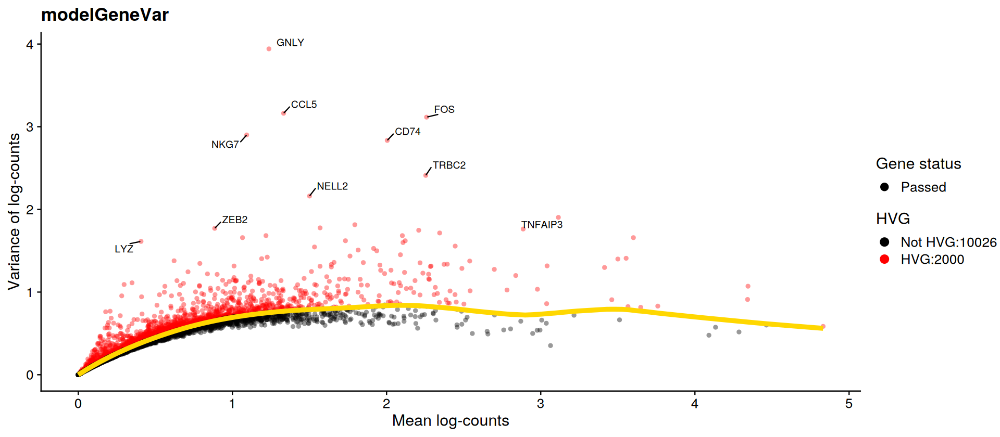
    


```R
# modelGeneVarByPoisson
if("per.block" %in% colnames(var.out2)) {
    blocked.stats <- var.out2$per.block
    n <- length(names(blocked.stats))
    p <-  vector("list", n)

    for(i in 1:n) {
        p[[i]] <- plotVariableFeature(cdScFilt, var = blocked.stats[[i]], hvg = hvg.out2,
                                      title = paste("modelGeneVarByPoisson:", names(blocked.stats)[i])) +
            theme(legend.position = "top", legend.justification = "left", legend.direction = "vertical")
    }
} else {
    p <-  vector("list", 1)
    p[[1]] <- plotVariableFeature(cdScFilt, var = var.out2, hvg = hvg.out2, title = "modelGeneVarByPoisson")
}

fig(width = 16, height = 7)
plot_grid(plotlist = p)
reset.fig()
```


    
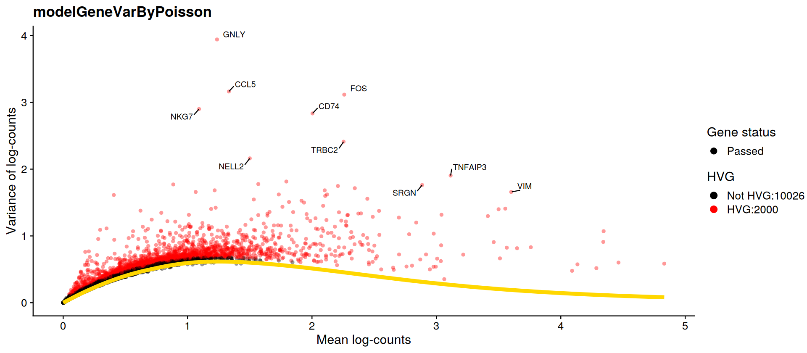
    


## Decide which model and HVG to use

<div class="alert alert-warning">
    <strong>Warning!</strong> 
    <ul><li><code>modelGeneVar</code> - <code>var.out1</code></li>
        <li><code>modelGeneVarByPoisson</code> - <code>var.out2</code></li>
    </ul>
</div>


```R
# Select model
hvg_model <- "modelGeneVarByPoisson"
```

<div class="alert alert-info">
  <strong>About this dataset: </strong> (edits required)
  <ul>
      <li>We use the the <code>getTopHVGs</code> method to select top <strong>2,000</strong> HVGs from the <code>modelGeneVarByPoisson</code> model.</li>
  </ul>
</div>

<div class="alert alert-info">
    <strong>Tip!</strong> In the accompanied Shiny App, top N HVGs are used as example genes in multi-gene expression visualisation.
</div>


```R
if(hvg_model == "modelGeneVar") {
    hvg_est <- var.out1
    hvg_genes <- hvg.out1
} else {
    hvg_est <- var.out2
    hvg_genes <- hvg.out2
}

# Add to runInfo
runInfo <- c(runInfo, list(
    "HVG" = list(
        "Method" = hvg_model, 
        "Estimates" = hvg_est, 
        "Genes" = hvg_genes)
    )
)

# Subset variance estimate DataFrame with HVGs
hvg <- hvg_est[hvg_genes,]
hvg <- data.frame(Symbol = rownames(hvg), hvg) %>% arrange(p.value, desc(bio))

hvg %>% DataFrame
```


    DataFrame with 2000 rows and 7 columns
                  Symbol      mean     total      tech       bio     p.value         FDR
             <character> <numeric> <numeric> <numeric> <numeric>   <numeric>   <numeric>
    GNLY            GNLY   1.24988   4.03294  0.616307   3.41663           0           0
    CCL5            CCL5   1.34318   3.22343  0.613799   2.60963           0           0
    FOS              FOS   2.24619   3.00063  0.456851   2.54378           0           0
    NKG7            NKG7   1.10272   2.97217  0.609498   2.36267           0           0
    CD74            CD74   1.99641   2.69761  0.513851   2.18376           0           0
    ...              ...       ...       ...       ...       ...         ...         ...
    DOCK2          DOCK2   1.22213  0.684485  0.616296 0.0681887 4.47127e-12 6.77155e-12
    TOR1AIP1    TOR1AIP1   1.08002  0.673947  0.606869 0.0670777 4.69153e-12 7.09699e-12
    DUSP11        DUSP11   1.12938  0.679338  0.611908 0.0674300 5.41439e-12 8.17694e-12
    ZFC3H1        ZFC3H1   1.39008  0.678105  0.610834 0.0672707 5.57172e-12 8.41028e-12
    ZNF292        ZNF292   1.39940  0.677047  0.610073 0.0669749 6.46223e-12 9.72729e-12


```R
# Save to file
write.table(hvg, file = "HVG.tsv", sep = "\t", quote = F, row.names = F, col.names = T)
```


```R
# Add HVG to rowData
rowData(cdScAnnot)$is_hvg <- FALSE
rowData(cdScAnnot)[rownames(cdScAnnot) %in% hvg_genes,]$is_hvg <- TRUE
table("Is HVG" = rowData(cdScAnnot)$is_hvg)
```


    Is HVG
    FALSE  TRUE 
    16129  2000 


__Final Notes__ There are alternative approaches for determining the HVG, especially those based on Coefficient of Variance. The method used here, the variance of the log-expression values, avoids genes with strong expression in only one or two cells. This ensures that the set of top HVGs is not dominated by genes with (mostly uninteresting) outlier expression patterns.

However, it has been mentioned that fitting the trendline to endogenous genes might not always be a good idea.


# 7. Dimensionality reduction using HVG

1. Principal components analysis (PCA)
2. t-stochastic neighbor embedding (t-SNE)
3. Uniform manifold approximation and projection (UMAP)

## Principal components analysis

We perform a PCA on the log-normalized expression values using the `calculatePCA` function from `scater` package. By default, `calculatePCA` function will compute the first 50 PCs.

Here, we restricting the PCA to the HVGs selected previously (by using `subset_row`) to reduce both computational work and high-dimensional random noise. In particular, while PCA is robust to random noise, an excess of it may cause the earlier PCs to capture noise instead of biological structure.

For large data sets, greater efficiency is obtained by using approximate SVD algorithms that only compute the top PCs. By default, most PCA-related functions in `scater` and `scran` will use methods from the `irlba` or `rsvd` packages to perform the SVD. Many of these approximate algorithms are based on randomization and thus require `set.seed()` to obtain reproducible results. See [here](https://bioconductor.org/books/3.20/OSCA.advanced/dealing-with-big-data.html#big-data-svd) more details.

<div class="alert alert-warning">
    <strong>Warning!</strong> The PCA results are slightly different from versions available in R 4.3 versus R 4.4. Therefore the TSNE, UMAP and clustering results will also be different. Make sure to use the same environment/versions to process (or re-process) data from the same project.
</div>


```R
set.seed(12345)

# Use exact SVD
#pca <- calculatePCA(filt_l, ncomponents = 50, subset_row = hvg_genes)

# Use Randomized SVD algorithm, much faster for file-backed matrices
pca <- calculatePCA(filt_l, ncomponents = 50, subset_row = hvg_genes, BSPARAM = BiocSingular::RandomParam())

# Use IRLBA algorithm, default behavior is more accurate
#pca <- calculatePCA(filt_l, ncomponents = 50, subset_row = hvg_genes, BSPARAM = BiocSingular::IrlbaParam())
```

The attributes of the PC coordinate matrix contain the following elements:

- percentVar - the percentage of variance explained by each PC. This may not sum to 100 if not all PCs are reported.
- varExplained - the actual variance explained by each PC.
- rotation - the rotation matrix containing loadings for all genes used in the analysis and for each PC.


```R
# Store PCA results
reducedDim(cdScAnnot, "PCA") <- pca

# Print the dimension of the PCA reducedDims
dim(reducedDim(cdScAnnot, "PCA"))

# Print the PCA reducedDims structure
str(reducedDim(cdScAnnot, "PCA"))
```


<style>
.list-inline {list-style: none; margin:0; padding: 0}
.list-inline>li {display: inline-block}
.list-inline>li:not(:last-child)::after {content: "\00b7"; padding: 0 .5ex}
</style>
<ol class=list-inline><li>17168</li><li>50</li></ol>


     num [1:17168, 1:50] 2.417 6.161 5.588 -7.281 -0.246 ...
     - attr(*, "dimnames")=List of 2
      ..$ : chr [1:17168] "AAACAAGCAAATACCGATGTTGAC-1" "AAACAAGCAACAGATTATGTTGAC-1" "AAACAAGCAAGATAAGATGTTGAC-1" "AAACAAGCAAGGCCTGATGTTGAC-1" ...
      ..$ : chr [1:50] "PC1" "PC2" "PC3" "PC4" ...
     - attr(*, "varExplained")= num [1:50] 82.2 53.3 30 23.4 18 ...
     - attr(*, "percentVar")= num [1:50] 6.14 3.98 2.24 1.75 1.34 ...
     - attr(*, "rotation")= num [1:2000, 1:50] -0.0737 -0.0531 -0.0228 -0.068 -0.1084 ...
      ..- attr(*, "dimnames")=List of 2
      .. ..$ : chr [1:2000] "GNLY" "CCL5" "FOS" "NKG7" ...
      .. ..$ : chr [1:50] "PC1" "PC2" "PC3" "PC4" ...


### Choosing the number of PCs

How many of the top PCs should we retain for downstream analyses? The choice of the number of PCs `d` is a decision that is analogous to the choice of the number of HVGs to use. Using more PCs will retain more biological signal at the cost of including more noise that might mask said signal. On the other hand, using fewer PCs will introduce competition between different factors of variation, where weaker (but still interesting) factors may be pushed down into lower PCs and inadvertently discarded from downtream analyses.

Most practitioners will simply set `d` to a “reasonable” but arbitrary value, typically ranging from 10 to 50. Nonetheless, we will use some data-driven strategies to guide a suitable choice of `d`. These automated choices are best treated as guidelines as they make some strong assumptions about what variation is “interesting”.


```R
percent.var <- attr(reducedDim(cdScAnnot, "PCA"), "percentVar")
show <- 20 # Show first N PCs

as.data.frame(percent.var) %>% rownames_to_column(var = "PC") %>% mutate(PC = as.numeric(PC)) %>% head(show)
```


<table class="dataframe">
<caption>A data.frame: 20 √ó 2</caption>
<thead>
	<tr><th></th><th scope=col>PC</th><th scope=col>percent.var</th></tr>
	<tr><th></th><th scope=col>&lt;dbl&gt;</th><th scope=col>&lt;dbl&gt;</th></tr>
</thead>
<tbody>
	<tr><th scope=row>1</th><td> 1</td><td>6.1418648</td></tr>
	<tr><th scope=row>2</th><td> 2</td><td>3.9829927</td></tr>
	<tr><th scope=row>3</th><td> 3</td><td>2.2446130</td></tr>
	<tr><th scope=row>4</th><td> 4</td><td>1.7514169</td></tr>
	<tr><th scope=row>5</th><td> 5</td><td>1.3418247</td></tr>
	<tr><th scope=row>6</th><td> 6</td><td>0.9323745</td></tr>
	<tr><th scope=row>7</th><td> 7</td><td>0.7797089</td></tr>
	<tr><th scope=row>8</th><td> 8</td><td>0.5451091</td></tr>
	<tr><th scope=row>9</th><td> 9</td><td>0.4131314</td></tr>
	<tr><th scope=row>10</th><td>10</td><td>0.3639718</td></tr>
	<tr><th scope=row>11</th><td>11</td><td>0.3336176</td></tr>
	<tr><th scope=row>12</th><td>12</td><td>0.2881058</td></tr>
	<tr><th scope=row>13</th><td>13</td><td>0.2834401</td></tr>
	<tr><th scope=row>14</th><td>14</td><td>0.2586503</td></tr>
	<tr><th scope=row>15</th><td>15</td><td>0.2550766</td></tr>
	<tr><th scope=row>16</th><td>16</td><td>0.2134524</td></tr>
	<tr><th scope=row>17</th><td>17</td><td>0.2062116</td></tr>
	<tr><th scope=row>18</th><td>18</td><td>0.1825249</td></tr>
	<tr><th scope=row>19</th><td>19</td><td>0.1782930</td></tr>
	<tr><th scope=row>20</th><td>20</td><td>0.1748023</td></tr>
</tbody>
</table>


```R
as.data.frame(percent.var) %>% rownames_to_column(var = "PC") %>% mutate(PC = as.numeric(PC)) %>% head(show) %>%
    ggplot(aes(x = PC, y = percent.var)) + geom_point(size = 3) +
    scale_x_continuous(breaks = seq(0, 50, by = 5)) + theme_cowplot(20) + 
    guides(color = guide_legend(title = "Method")) + theme(legend.position = "top") + 
    labs(x = "PC", y = "Variance explained (%)")
```


    
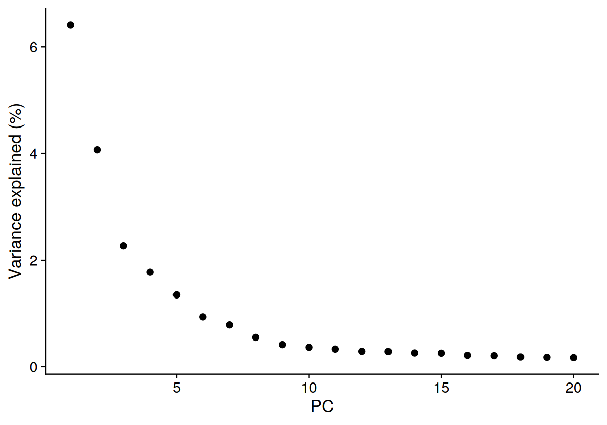
    


<div class="alert alert-info">
  <strong>About this dataset: </strong> (edits required)
    <ul>
      <li>The top 10 PCs retain a lot of information, while other PCs contain pregressivelly less.</li>
      <li>However, it is still advisable to use more PCs in <code>n_dimred</code>since they might contain information about rare cell types (in some datasets such as platelets and dendritic cells).</li>
    </ul>
</div>

## Visualising with t-SNE

The t-stochastic neighbor embedding (t-SNE) method attempts to find a low-dimensional representation of the data that preserves the distances between each point and its neighbors in the high-dimensional space. Unlike PCA, it is not restricted to linear transformations, nor is it obliged to accurately represent distances between distant populations. This means that it has much more freedom in how it arranges cells in low-dimensional space, enabling it to separate many distinct clusters in a complex population. See [OSCA reference](https://bioconductor.org/books/3.20/OSCA.basic/dimensionality-reduction.html#t-stochastic-neighbor-embedding)

#### n_dimred

By default, all dimensions are used to compute the second set of reduced dimensions. If `n_dimred` is also specified, only the first `n_dimred` columns are used. Alternatively, `n_dimred` can be an integer vector specifying the column indices of the dimensions to use.

#### perplexity

The value of the `perplexity` parameter can have a large effect on the results. By default, the function will set a “reasonable” perplexity that scales with the number of cells in x. (Specifically, it is the number of cells divided by 5, capped at a maximum of 50.) However, it is often worthwhile to manually try multiple values to ensure that the conclusions are robust.

<div class="alert alert-warning">
  It is unwise to read too much into the relative sizes and positions of the visual clusters. t-SNE will inflate dense clusters and compress sparse ones, such that we cannot use the size as a measure of subpopulation heterogeneity. In addition, t-SNE is not obliged to preserve the relative locations of non-neighboring clusters, such that we cannot use their positions to determine relationships between distant clusters.
</div>

### Use default perplexity


```R
# runTSNE() stores the t-SNE coordinates in the reducedDims
set.seed(12345)
cdScAnnot <- runTSNE(cdScAnnot, dimred = "PCA", n_dimred = 15, name = "TSNE", n_threads = nthreads, BPPARAM = bpp)

fig(width = 8, height = 8)
plotProjection(cdScAnnot, "Sample", dimname = "TSNE", feat_color = c_sample_col, point_alpha = 0.3, 
               legend_pos = "none")
reset.fig()
```


    
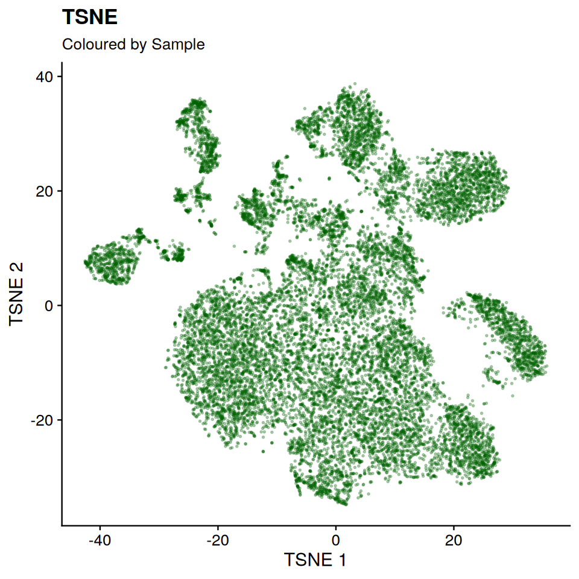
    


## Visualising with UMAP (`uwot::umap`)

The uniform manifold approximation and projection (UMAP) method is an alternative to t-SNE for non-linear dimensionality reduction. It is roughly similar to t-SNE in that it also tries to find a low-dimensional representation that preserves relationships between neighbors in high-dimensional space. However, the two methods are based on different theory, represented by differences in the various graph weighting equations. See [OSCA reference](https://bioconductor.org/books/3.20/OSCA.basic/dimensionality-reduction.html#uniform-manifold-approximation-and-projection)

Compared to t-SNE, the UMAP visualisation tends to have more compact visual clusters with more empty space between them. It also attempts to preserve more of the global structure than t-SNE.

UMAP has its own suite of hyperparameters that affect the visualisation. Of these, the number of neighbors (`n_neighbors`) and the minimum distance between embedded points (`min_dist`) have the greatest effect on the granularity of the output. If these values are too low, random noise will be incorrectly treated as high-resolution structure, while values that are too high will discard fine structure altogether in favor of obtaining an accurate overview of the entire dataset. Again, it is a good idea to test a range of values for these parameters to ensure that they do not compromise any conclusions drawn from a UMAP plot.

#### n_dimred

By default, all dimensions are used to compute the second set of reduced dimensions. If `n_dimred` is also specified, only the first `n_dimred` columns are used. Alternatively, `n_dimred` can be an integer vector specifying the column indices of the dimensions to use.

#### n_neighbors

This sets the number of nearest neighbors to identify when constructing the initial graph. Larger values result in more global views of the manifold, while smaller values result in more local data being preserved. In general values should be in the range 2 to 100. The default value set by `uwot` is 15 (*seurat uses 30*).

#### spread

The effective scale of embedded points. In combination with `min_dist`, this determines how clustered/clumped the embedded points are. The default value set by `uwot` is 1 (*seurat also uses 1*).

#### min_dist

The effective minimum distance between embedded points. Smaller values will result in a more clustered/clumped embedding where nearby points on the manifold are drawn closer together, while larger values will result on a more even dispersal of points. The value should be set relative to the `spread` value, which determines the scale at which embedded points will be spread out. The default value set by `uwot` is 0.01 (*seurat also uses 0.3*).

Note:
- Default settings in scater/uwot: n_neighbors = 15, spread = 1, min_dist = 0.01
- Default settings in seurat: n_neighbors = 30, spread = 1, min_dist = 0.3

<div class="alert alert-warning">
  It is arguable whether the UMAP or t-SNE visualizations are more useful or aesthetically pleasing. UMAP aims to preserve more global structure but this necessarily reduces resolution within each visual cluster. However, UMAP is unarguably much faster, and for that reason alone, it is increasingly displacing t-SNE as the method of choice for visualizing large scRNA-seq data sets.
</div>

### Use adjusted settings


```R
set.seed(12345)
cdScAnnot <- runUMAP(cdScAnnot, dimred = "PCA", n_dimred = 15, name = "UMAP", 
                     n_neighbors = 20, spread = 1, min_dist = 0.1, n_threads = nthreads, BPPARAM = bpp)

fig(width = 8, height = 8)
plotProjection(cdScAnnot, "Sample", dimname = "UMAP", feat_color = c_sample_col, point_alpha = 0.3, 
               legend_pos = "none")
reset.fig()
```


    
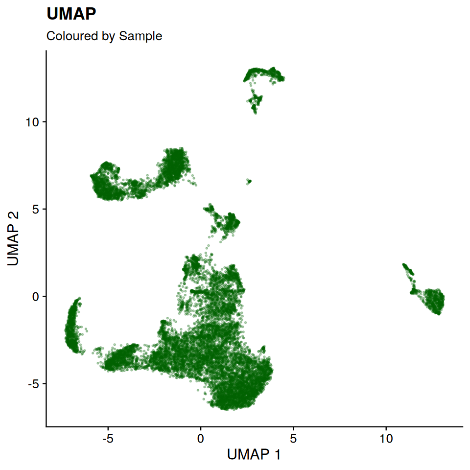
    


```R
# Print reducedDim name
reducedDimNames(cdScAnnot)
```


<style>
.list-inline {list-style: none; margin:0; padding: 0}
.list-inline>li {display: inline-block}
.list-inline>li:not(:last-child)::after {content: "\00b7"; padding: 0 .5ex}
</style>
<ol class=list-inline><li>'PCA'</li><li>'TSNE'</li><li>'UMAP'</li></ol>


# 8. Cell type annotation

<div class="alert alert-danger">
  Please only use automated cell type annotation as a guide. It is always necessary to annotate cluster <strong>manually</strong>.
</div>

## Using cell annotation from Cell Ranger

Cell Ranger v9.0 introduces support for automated cell type annotation as part of `cellranger multi` and `cellranger count` commands and as a standalone command called `cellranger annotate`. For more info, please [click here](https://www.10xgenomics.com/support/software/cell-ranger/latest/getting-started/cr-what-is-cell-annotation). If the per-cell cell type labels from Cell Ranger is available, we can load the `cell_types.csv` output file and add it to our data.

The CSV output contains four columns:
1. `barcode`: The cell barcode being annotated
2. `coarse_cell_type`: The high-level annotation of the cell type (e.g., T cell, B cell, monocyte, etc.). Those coarse cell types are the display nodes we manually curated.
3. `fine_cell_type`: The original annotation derived from the model based on the most common cell type amongst the 500 nearest-neighbors. Note: This may be the same as coarse_cell_type if the original reference was only annotated to that level of detail.
4. `cell_count_in_model`: The number of cells in the model that support the given fine_cell_type annotation, with a maximum of 500 cells.

For example:

```
barcode	coarse_cell_type	fine_cell_type	cell_count_in_model
AAACCAAAGGTGACGA-1	T cell	mature T cell	177
AAACCCTGTGACGAGT-1	T cell	mature T cell	432
AAACGAATCAGGCTAC-1	T cell	mature T cell	339
AAACGACAGATTGACT-1	monocyte	monocyte	470
AAACGATGTCTTGAAC-1	T cell	mature T cell	428
```


```R
#cell_type_file <- "cell_types/cell_types.csv"
#cell_anno <- read.csv(cell_type_file)
#dim(cell_anno)
#head(cell_anno)
```


```R
#coldata <- merge(colData(cdScAnnot), cell_anno, by.x = "Barcode", by.y = "barcode", all.x = TRUE)
#coldata$CellType <- coldata$coarse_cell_type # or coldata$fine_cell_type
#rownames(coldata) <- coldata$Barcode
#colData(cdScAnnot) <- coldata

#head(colData(cdScAnnot))
```

## Predict cell type using SingleR and celldex

If not, we can use of the `SingleR` method for cell type annotation. This method assigns labels to cells based on the reference samples with the highest Spearman rank correlations, using only the marker genes between pairs of labels to focus on the relevant differences between cell types. See [OSCA reference](https://bioconductor.org/books/3.20/OSCA.basic/cell-type-annotation.html#assigning-cell-labels-from-reference-data)

The `celldex` package contains a number of curated reference datasets (listed below), mostly assembled from bulk RNA-seq or microarray data of sorted cell types. 

**For Human**

Following human reference datasets are available: 

- **BlueprintEncodeData** - Blueprint Epigenomics contains 144 RNA-seq pure immune samples annotated to 28 cell types. ENCODE contains 115 RNA-seq pure stroma and immune samples annotated to 17 cell types. All together, this reference contains 259 samples with 43 cell types ("`label.fine`"), manually aggregated into 24 broad classes ("`label.main`"). 

- **DatabaseImmuneCellExpressionData** - The dataset contains 1561 human RNA-seq samples annotated to 5 main cell types ("`label.main`"). Samples were additionally annotated to 15 fine cell types ("`label.fine`").

- **HumanPrimaryCellAtlasData** - The dataset contains 713 microarray samples from the Human Primary Cell Atlas (HPCA) (Mabbott et al., 2013). Each sample has been assigned to one of 37 main cell types ("`label.main`") and 157 subtypes ("`label.fine`"). 

- **MonacoImmuneData** - The dataset contains 114 human RNA-seq samples annotated to 10 main cell types ("`label.main`"). Samples were additionally annotated to 29 fine cell types ("`label.fine`").

- **NovershternHematopoieticData** - The dataset contains 211 human microarray samples annotated to 16 main cell types ("`label.main`"). Samples were additionally annotated to 38 fine cell types ("`label.fine`").

For specific applications, smaller datasets can be applicable. *SingleR* is flexible to be used with any reference dataset.

**For Mouse**

Following mouse reference datasets are available: 

- **ImmGenData** - The dataset contains 830 microarray samples generated by ImmGen from pure populations of murine immune cells (<http://www.immgen.org/>). This dataset consists of 20 broad cell types ("`label.main`") and 253 finely resolved cell subtypes ("`label.fine`").

- **MouseRNAseqData** - The dataset contains 358 mouse RNA-seq samples annotated to 18 main cell types ("`label.main`"). These are split further into 28 subtypes ("`label.fine"`).

### Load `celldex` databases

<div class="alert alert-warning">
  <strong>Warning!</strong> Edits required to choose human or mouse datasets.
</div>


```R
# For Human
bpen <- celldex::BlueprintEncodeData()
hpca <- celldex::HumanPrimaryCellAtlasData()
# dice <- celldex::DatabaseImmuneCellExpressionData()
# mona <- celldex::MonacoImmuneData()
# dmap <- celldex::NovershternHematopoieticData()

# For mouse
# immg <- celldex::ImmGenData()
# mmrna <- celldex::MouseRNAseqData()
```

### Run `SingleR`

Use `de.method` to specify how DE genes should be detected between pairs of labels. The defaults is `"classic"`, which sorts genes by the log-fold changes and takes the top `de.n`. Setting this to `"wilcox"` or `"t"` will use Wilcoxon ranked sum test or Welch t-test between labels, respectively, and take the top `de.n` upregulated genes per comparison.

If `de.method="classic"`, the default `de.n` is set at `500 * (2/3) ^ log2(N)` where `N` is the number of unique labels. Otherwise, `de.n` is set at `10`. A larger number of markers increases the robustness of the annotation by ensuring that relevant genes are not omitted, especially if the reference dataset has study-specific effects that cause uninteresting genes to dominate the top set. However, this comes at the cost of increasing noise and computational time.

The default marker selection (i.e. `de.method="classic"`) is based on log-fold changes between the per-label medians and is very much designed with **bulk references** in mind. It may not be effective for single-cell reference data where it is not uncommon to have more than 50% zero counts for a given gene such that the median is also zero for each group. Users are recommended to either set `de.method` to another DE ranking method, or detect markers externally and pass a list of markers to genes.


```R
# Human Example

# BlueprintEncodeData
singler.bp <- SingleR(test = filt_l, de.method = "classic", ref = list(BP = bpen),
                      labels = list(bpen$label.main), num.threads = nthreads)

# HumanPrimaryCellAtlasData
singler.hpca <- SingleR(test = filt_l, de.method = "classic", ref = list(HPCA = hpca), 
                        labels = list(hpca$label.main), num.threads = nthreads)

# BlueprintEncodeData and HumanPrimaryCellAtlasData
singler <- SingleR(test = filt_l, de.method = "classic", ref = list(BP = bpen, HPCA = hpca), 
                   labels = list(bpen$label.main, hpca$label.main), num.threads = nthreads)
```


```R
# Mouse Example

# ImmGenData
#singler.immg <- SingleR(test = filt_l, de.method = "classic", ref = list(IMMG = immg), 
#                        labels = list(immg$label.main), num.threads = nthreads)

# MouseRNAseqData
#singler.mrna <- SingleR(test = filt_l, de.method = "classic", ref = list(MouseRNA = mmrna), 
#                        labels = list(mmrna$label.main), num.threads = nthreads)

# ImmGenData and MouseRNAseqData
#singler <- SingleR(test = filt_l, de.method = "classic", ref = list(MouseRNA = mmrna, IMMG = immg), 
#                   labels = list(mmrna$label.main, immg$label.main), num.threads = nthreads)
```

### Inspect predicted labels

<div class="alert alert-warning">
  <strong>Warning!</strong> Please adapt the following codes and change the object names to suit your choosen reference dataset(s).
</div>

#### Print cell type frequency


```R
table("BlueprintEncodeData" = singler.bp$labels)
```


    BlueprintEncodeData
         B-cells CD4+ T-cells CD8+ T-cells          HSC    Monocytes     NK cells 
             725         9324         4635            7          816         1661 


```R
fig(width = 9, height = 7)
plotProjection(cdScAnnot, singler.bp$labels, dimname = "TSNE", feat_desc = "BlueprintEncodeData", 
               feat_color = c40(), point_size = 1, guides_size = 4, title = "TSNE")
reset.fig()
```


    
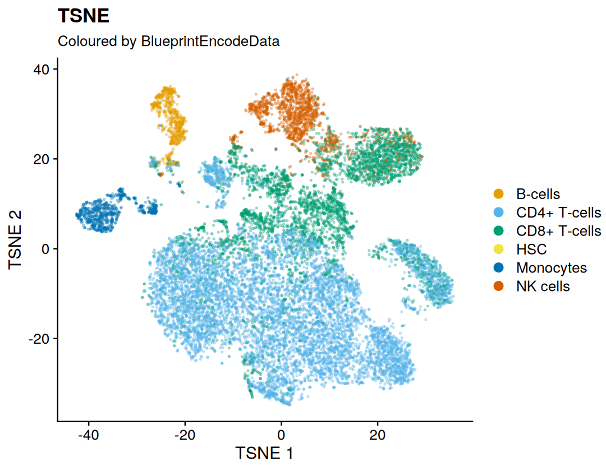
    


```R
table("HumanPrimaryCellAtlasData" = singler.hpca$labels)
```


    HumanPrimaryCellAtlasData
              B_cell              CMP              GMP              MEP         Monocyte      Neutrophils 
                 733                2                2                2              755               37 
             NK_cell        Platelets Pre-B_cell_CD34-          T_cells 
                2135                3                1            13498 


```R
fig(width = 9, height = 7)
plotProjection(cdScAnnot, singler.hpca$labels, dimname = "TSNE", feat_desc = "HumanPrimaryCellAtlasData", 
               feat_color = c40(), point_size = 1, guides_size = 4, title = "TSNE")
reset.fig()
```


    
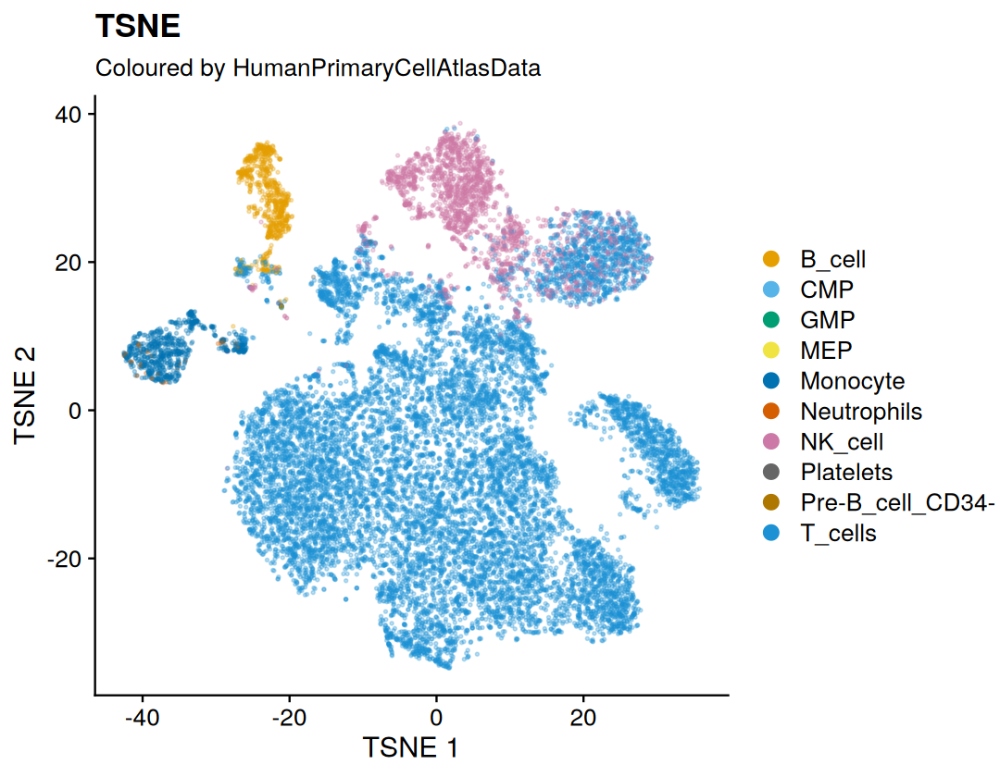
    


```R
table("BlueprintEncodeData + HumanPrimaryCellAtlasData" = singler$labels)
```


    BlueprintEncodeData + HumanPrimaryCellAtlasData
         B-cells CD4+ T-cells CD8+ T-cells          HSC    Monocytes     NK cells      NK_cell    Platelets 
             724         9318         4605            7          814         1679           16            1 
         T_cells 
               4 


```R
fig(width = 9, height = 7)
plotProjection(cdScAnnot, singler$labels, dimname = "TSNE", 
               feat_desc = "BlueprintEncodeData + HumanPrimaryCellAtlasData", 
               feat_color = c40(), point_size = 1, guides_size = 4, title = "TSNE")
reset.fig()
```


    
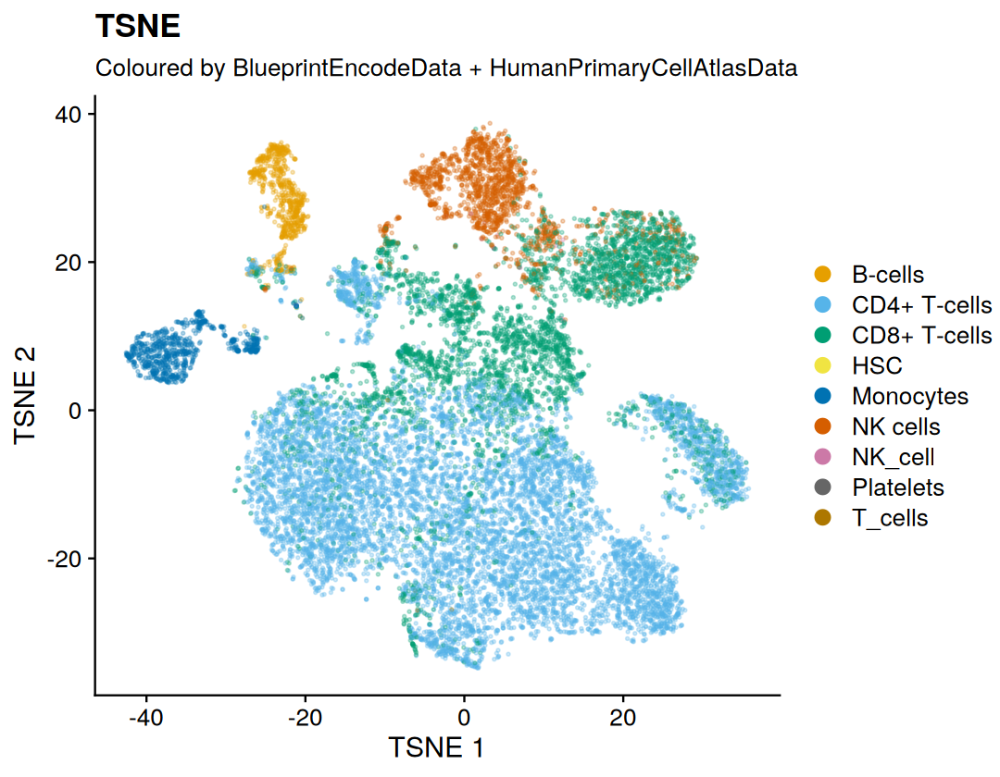
    


#### Rename combined prediction labels if using both HumanPrimaryCellAtlasData and BlueprintEncodeData


```R
# Re-label for consistency
HPCA_to_BP_labels <- function(pred = singler) {
    HPCA <- c("Astrocyte","B_cell","T_cells","Endothelial_cells","Epithelial_cells","Macrophage","Monocyte",
              "NK_cell","Smooth_muscle_cells")
    BP <- c("Astrocytes","B-cells","T-cells","Endothelial cells","Epithelial cells","Macrophages","Monocytes",
            "NK cells","Smooth muscle")

    for(i in 1:length(HPCA)) {
        if(sum(pred$labels == HPCA[i]) > 0) {
            pred$labels[pred$labels == HPCA[i]] <- BP[i]
        }
    }
    return(pred)
}

singler <- HPCA_to_BP_labels(singler)
```

#### Show prediction scores

We use `plotScoreHeatmap()` to display the scores for all cells across all reference labels, which allows us to inspect the confidence of the predicted labels across the dataset. 

Ideally, each cell (i.e., column of the heatmap) should have one score that is obviously larger than the rest, indicating that it is unambiguously assigned to a single label. A spread of similar scores for a given cell indicates that the assignment is uncertain, though this may be acceptable if the uncertainty is distributed across similar cell types that cannot be easily resolved.


```R
fig(width = 16, height = 7)
suppressWarnings(plotScoreHeatmap(singler.bp, grid.vars = list(ncol = 2), fontsize = 12, fontsize_row = 12))
reset.fig()
```


    
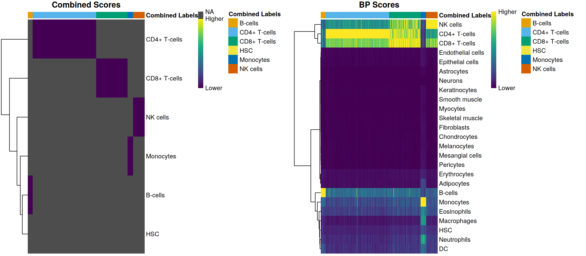
    


```R
fig(width = 16, height = 9)
suppressWarnings(plotScoreHeatmap(singler.hpca, grid.vars = list(ncol = 2), fontsize = 12, fontsize_row = 12))
reset.fig()
```


    
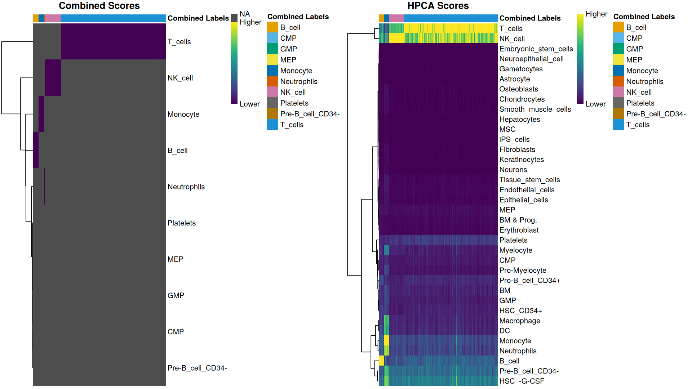
    


```R
fig(width = 16, height = 5)
# Show combine scores
suppressWarnings(plotScoreHeatmap(singler, scores.use = 0, fontsize = 12, fontsize_row = 12))
reset.fig()
```


    
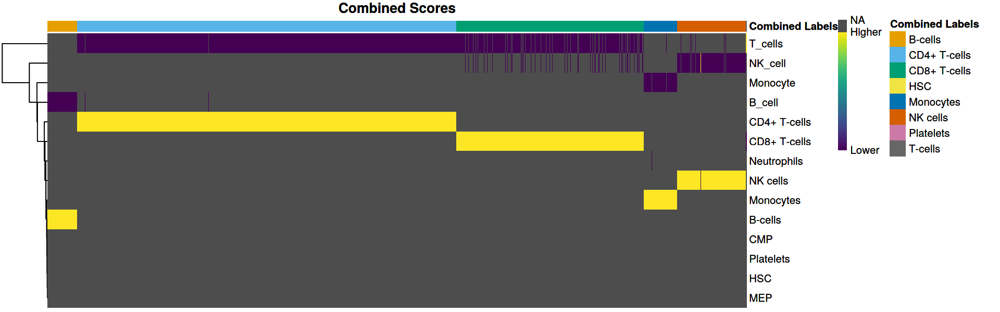
    


### Save cell type to `sce`


```R
# Here we use combined prediction from 'singler', change this where applicable
cdScAnnot$CellType <- factor(singler$labels)

table(CellType = cdScAnnot$CellType, Sample = cdScAnnot$Sample)
```


                  Sample
    CellType       KidneyCancer
      B-cells               724
      CD4+ T-cells         9318
      CD8+ T-cells         4605
      HSC                     7
      Monocytes             814
      NK cells             1695
      Platelets               1
      T-cells                 4


```R
# Set colours for cell types
c_celltype_col <- choosePalette(cdScAnnot$CellType, c40)
#c_celltype_col
```


```R
fig(width = 16, height = 7)
plotProjections(cdScAnnot, "CellType", dimnames = c("TSNE", "UMAP"), feat_desc = "Cell Type", 
                feat_color = c_celltype_col, guides_size = 4, guides_ncol = 1, rel_widths = c(6, 1))
reset.fig()
```


    
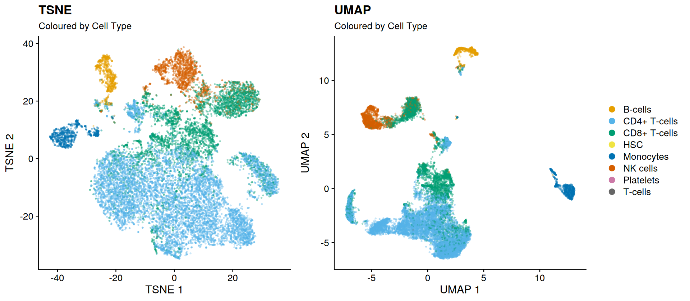
    


# 9. Cell clustering

The goal is to split the cells in the dataset into clusters, such that:

1. The gene expression profile in the same cluster are as similar as possible,
2. The gene expression profile in different clusters are highly distinct

**Assessing cluster separation**

We can perform silhouette analysis to measures how well cells are clustered and it estimates the average distance between clusters. The silhouette plot displays a measure of how close each cell in one cluster is to cells in the neighboring clusters. Ideally, each cluster would contain large positive silhouette widths $s_i$, indicating that it is well-separated from other clusters.

For each observation $i$, the silhouette width $s_i$ is calculated as follows:

1. For each observation $i$, calculate the average dissimalirty $\alpha_i$ between $i$ and all other points of the cluster which $i$ belongs.
2. For all other clusters $C$, to which $i$ does not belong, calculate the average dissimilarity $d(i,C)$ of $i$ to all observations of $C$. The smallest of these $d(i,C)$ is defined as $b_i = min_C d(i,C)$. The value of $b_i$ can be seen as the dissimilarity between i and its __neighbour__ cluster, i.e. the nearest one to which it does not belong.
3. Finally the silhouette width of the observation $i$ is defined by the formula: $S_i = \frac{(b_i - a_i)}{max(a_i,b_i)}$

Silhouette width $s_i$ can be interpreted as follows:

- Cells with a large $s_i$ (almost 1) are very well clustered.
- A small $s_i$ (around 0) means that the observation lies between two clusters.
- Cells with a negative $s_i$ are probably placed in the wrong cluster. (so cluster is less stable and trustworthy)


```R
# Stores clustering labels
my.clusters <- vector(mode = "list")
communities <- vector(mode = "list") # walktrap, louvain
```

## Use graph-based clustering

Popularized by its use in Seurat, graph-based clustering is a flexible and scalable technique for clustering large scRNA-seq datasets. The major advantage of graph-based clustering lies in its scalability. It only requires a  
k-nearest neighbor search that can be done in log-linear time on average. Graph construction avoids making strong assumptions about the shape of the clusters or the distribution of cells within each cluster.

From a practical perspective, each cell is forcibly connected to a minimum number of neighboring cells, which reduces the risk of generating many uninformative clusters consisting of one or two outlier cells. The main drawback of graph-based methods is that, after graph construction, no information is retained about relationships beyond the neighboring cells. See [OSCA reference](https://bioconductor.org/books/3.20/OSCA.basic/clustering.html#clustering-graph)

#### About `k`

Set `k` to specify the number of nearest neighbors to consider during graph construction. The choice of `k` controls the connectivity of the graph and the resolution of community detection algorithms. Smaller values of `k` will generally yield smaller, finer clusters, while increasing `k` will increase the connectivity of the graph and make it more difficult to resolve different communities. The value of `k` can be roughly interpreted as the anticipated size of the smallest subpopulation. 

#### Different methods for finding communities in `igraph`

In this notebook, we use the **Walktrap**, **Louvain** and **Leiden** algorithms to detect community structure. This is also the method demonstrated in [OSCA](https://bioconductor.org/books/3.20/OSCA.basic/clustering.html#implementation). There are other methods in `igraph` ([doc](https://igraph.org/r/doc/communities.html)): 

- cluster_edge_betweenness: Community structure detection based on edge betweenness.
- cluster_fast_greedy: Community structure via greedy optimization of modularity.
- cluster_label_prop: Finding communities based on propagating labels.
- cluster_leading_eigen: Community structure detecting based on the leading eigenvector of the community matrix.
- **cluster_louvain \***: Finding community structure by multi-level optimization of modularity
- **cluster_leiden (new)**: Finding community structure of a graph using the Leiden algorithm of Traag, van Eck & Waltman. 
- cluster_optimal: Optimal community structure
- cluster_spinglass: Finding communities in graphs based on statistical meachanics
- **cluster_walktrap \***: Community strucure via short random walks

### Using 'walktrap' algorithm

`is_hierarchical = TRUE`


```R
method <- "walktrap"
dimname <- "PCA"
n_dimred <- 20 # number of dimensions to use; default is 50
mat <- reducedDim(cdScAnnot, dimname)[, seq_len(n_dimred), drop = FALSE]
k <- 10

# Use multiple cores and annoy algorithm for approximate nearest-neighbor detection 
# to speed up graph-based clustering
set.seed(12345)
communities[[method]][[dimname]] <- clusterRows(mat, full = TRUE, 
                                                NNGraphParam(cluster.fun = method, k = k,
                                                             BNPARAM = AnnoyParam(), num.threads = nthreads))
my.clusters[[method]][[dimname]] <- factor(communities[[method]][[dimname]]$clusters)
```


```R
print(paste(stringr::str_to_title(method), "cluster assignments:"))
for(i in 1:length(my.clusters[[method]])) {
    tab <- table(cdScAnnot$Sample, my.clusters[[method]][[i]])
    names(dimnames(tab))[2] <- method
    print(tab)

    plotSilhouette(mat, my.clusters[[method]][[i]], printDiff = FALSE, plot = FALSE)
}
```

    [1] "Walktrap cluster assignments:"
                  walktrap
                      1    2    3    4    5    6    7    8    9   10   11   12   13   14   15   16   17   18
      KidneyCancer 2379 4122  347 1002  533  165 1356  194  298  136  270 3519  385 1412   70  919   26   35


    Silhouette width summary:


       Min. 1st Qu.  Median    Mean 3rd Qu.    Max. 
    -0.4466  0.0199  0.1492  0.1374  0.2688  0.5625 


#### Manually tuning walktrap clustering resolution

You can increase `k` to obtain less resolved clusters or descrease `k` to obtain more resolved clusters. However it will be increasingly slow with higher `k`. 

The `igraph`'s Walktrap community finding algorithm is a hierarchical algorithm. This implies that there is an underlying hierarchy in the communities object, and we can use the `cut_at` function to cut the merge tree at the desired place and returns a membership vector. The desired place can be expressed as the desired number of communities (e.g. `no=10`) or as the number of merge steps to make (e.g. `steps = 5`). The function gives an error message if called with a non-hierarchical method.


```R
# Use cut_at to set cluster size
n <- 16

my.clusters[[method]][[dimname]] <- igraph::cut_at(communities[[method]][[dimname]]$objects$communities, n = n)
my.clusters[[method]][[dimname]] <- as.factor(my.clusters[[method]][[dimname]])

print(paste(stringr::str_to_title(method), "cluster assignments:"))
for(i in 1:length(my.clusters[[method]])) {
    tab <- table(cdScAnnot$Sample, my.clusters[[method]][[i]])
    names(dimnames(tab))[2] <- method
    print(tab)

    plotSilhouette(mat, my.clusters[[method]][[i]], printDiff = FALSE, plot = FALSE)
}
```

    [1] "Walktrap cluster assignments:"
                  walktrap
                       1     2     3     4     5     6     7     8     9    10    11    12    13    14    15
      KidneyCancer 10020   347  1002   533   165  1356   194   298   136   270   385  1412    70   919    26
                  walktrap
                      16
      KidneyCancer    35


    Silhouette width summary:


        Min.  1st Qu.   Median     Mean  3rd Qu.     Max. 
    -0.47706  0.04917  0.16579  0.13693  0.24055  0.56246 


```R
fig(width = 16, height = 6)
plotSilhouette(mat, my.clusters[[method]][[dimname]])
reset.fig()
```

    Silhouette width summary:


        Min.  1st Qu.   Median     Mean  3rd Qu.     Max. 
    -0.47706  0.04917  0.16579  0.13693  0.24055  0.56246 
    # A tibble: 16 √ó 2
       cluster `% Different`
       <fct>           <dbl>
     1 1               27.3 
     2 2               12.1 
     3 3               14.9 
     4 4                4.5 
     5 5               20.6 
     6 6                6.71
     7 7               27.8 
     8 8                0   
     9 9                2.21
    10 10              13.3 
    11 11               5.45
    12 12               0.21
    13 13               0   
    14 14               0.44
    15 15               0   
    16 16               0   


    
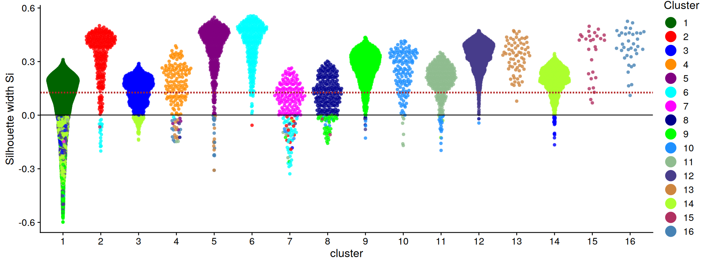
    


#### Show assigned walktrap clusters

We add the cluster assignments back into the `sce` object as a factor in the column metadata (`label`). This allows us to visualise the distribution of clusters in a t-SNE plot.


```R
p1 <- plotProjections(cdScAnnot, "CellType", dimnames = c("TSNE", "UMAP"), 
                      feat_desc = "Cell Type", feat_color = c_celltype_col, 
                      text_by = my.clusters[[method]][[dimname]], legend_pos = "none", add_void = TRUE)

p2 <- plotProjections(cdScAnnot, my.clusters[[method]][[dimname]], dimnames = c("TSNE", "UMAP"), 
                      feat_desc = method, feat_color = c30(), text_by = my.clusters[[method]][[dimname]], 
                      guides_size = 4, guides_ncol = 1)

fig(width = 16, height = 14)
plot_grid(p1, p2, ncol = 1)
reset.fig()
```


    
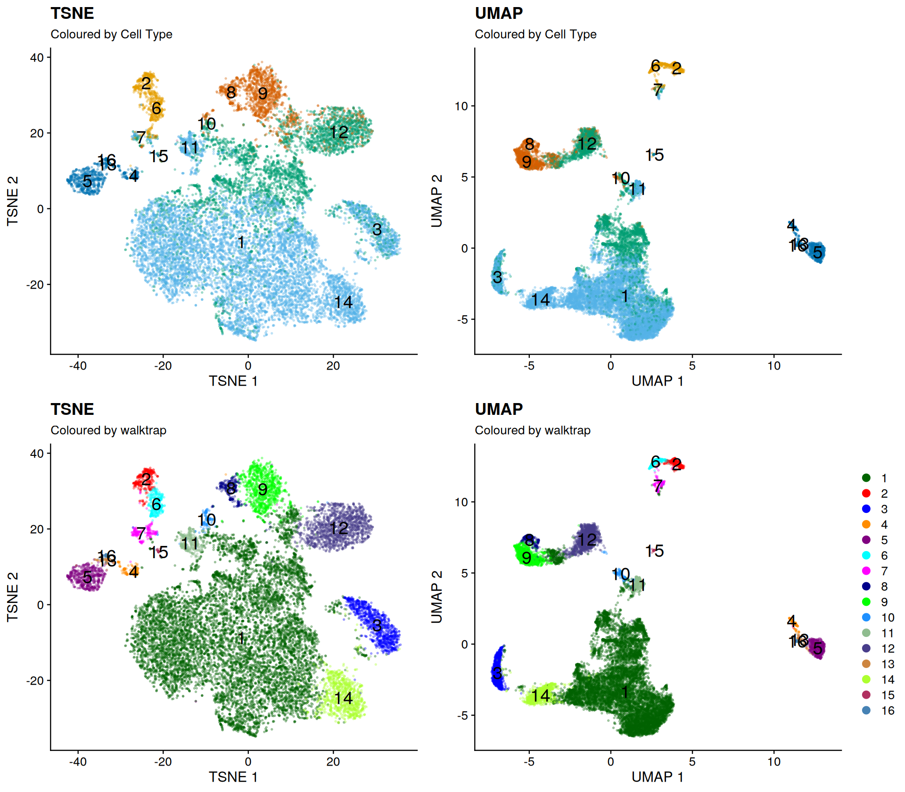
    


### Using 'louvain' algorithm

`is_hierarchical = FALSE`

The `resolution` is the resolution parameter for the Louvain algorithm. Lower values (less than 1) typically yield fewer clusters with more cells per cluster. Higher values (more than 1) yield more and smaller clusters. Default is 1.


```R
method <- "louvain"
dimname <- "PCA"
n_dimred <- 20 # number of dimensions to use; default is 50
mat <- reducedDim(cdScAnnot, dimname)[, seq_len(n_dimred), drop = FALSE]
k <- 10

set.seed(12345)
communities[[method]][[dimname]] <- clusterRows(mat, full = TRUE, 
                                                NNGraphParam(cluster.fun = method, k = k, type = "jaccard", 
                                                             cluster.args = list(resolution = 1), 
                                                             BNPARAM = AnnoyParam(), num.threads = nthreads))
my.clusters[[method]][[dimname]] <- factor(communities[[method]][[dimname]]$clusters)
```


```R
print(paste(stringr::str_to_title(method), "cluster assignments:"))
for(i in 1:length(my.clusters[[method]])) {
    tab <- table(cdScAnnot$Sample, my.clusters[[method]][[i]])
    names(dimnames(tab))[2] <- method
    print(tab)

    plotSilhouette(mat, my.clusters[[method]][[i]], printDiff = FALSE, plot = FALSE)
}
```

    [1] "Louvain cluster assignments:"
                  louvain
                      1    2    3    4    5    6    7    8    9   10   11   12   13   14   15
      KidneyCancer 1883  995 3305 1618 1903  232  406 1005  875 1460  646 1967  642  160   71


    Silhouette width summary:


        Min.  1st Qu.   Median     Mean  3rd Qu.     Max. 
    -0.40838  0.04485  0.15210  0.14607  0.25536  0.53401 


```R
fig(width = 16, height = 6)
plotSilhouette(mat, my.clusters[[method]][[dimname]])
reset.fig()
```

    Silhouette width summary:


        Min.  1st Qu.   Median     Mean  3rd Qu.     Max. 
    -0.40838  0.04485  0.15210  0.14607  0.25536  0.53401 
    # A tibble: 15 √ó 2
       cluster `% Different`
       <fct>           <dbl>
     1 1               28.7 
     2 2               13.5 
     3 3                2.54
     4 4               10.5 
     5 5               51.4 
     6 6               25.9 
     7 7                2.46
     8 8                0.6 
     9 9               40.9 
    10 10               0.21
    11 11               0.31
    12 12              29.4 
    13 13               3.27
    14 14               4.38
    15 15               1.41


    
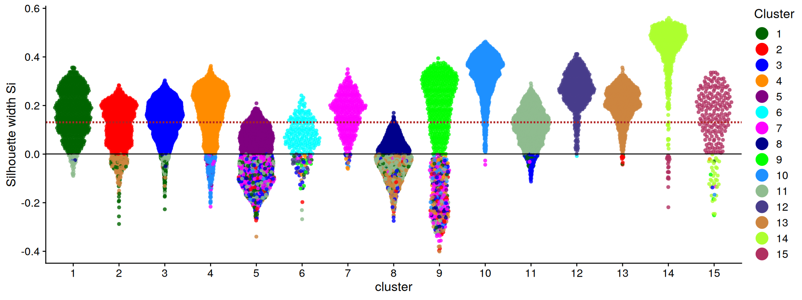
    


#### Show assigned louvain clusters


```R
p1 <- plotProjections(cdScAnnot, "CellType", dimnames = c("TSNE", "UMAP"), 
                      feat_desc = "Cell Type", feat_color = c_celltype_col, 
                      text_by = my.clusters[[method]][[dimname]], legend_pos = "none", add_void = TRUE)

p2 <- plotProjections(cdScAnnot, my.clusters[[method]][[dimname]], dimnames = c("TSNE", "UMAP"), 
                      feat_desc = method, feat_color = c30(), text_by = my.clusters[[method]][[dimname]], 
                      guides_size = 4, guides_ncol = 1)

fig(width = 16, height = 14)
plot_grid(p1, p2, ncol = 1)
reset.fig()
```


    
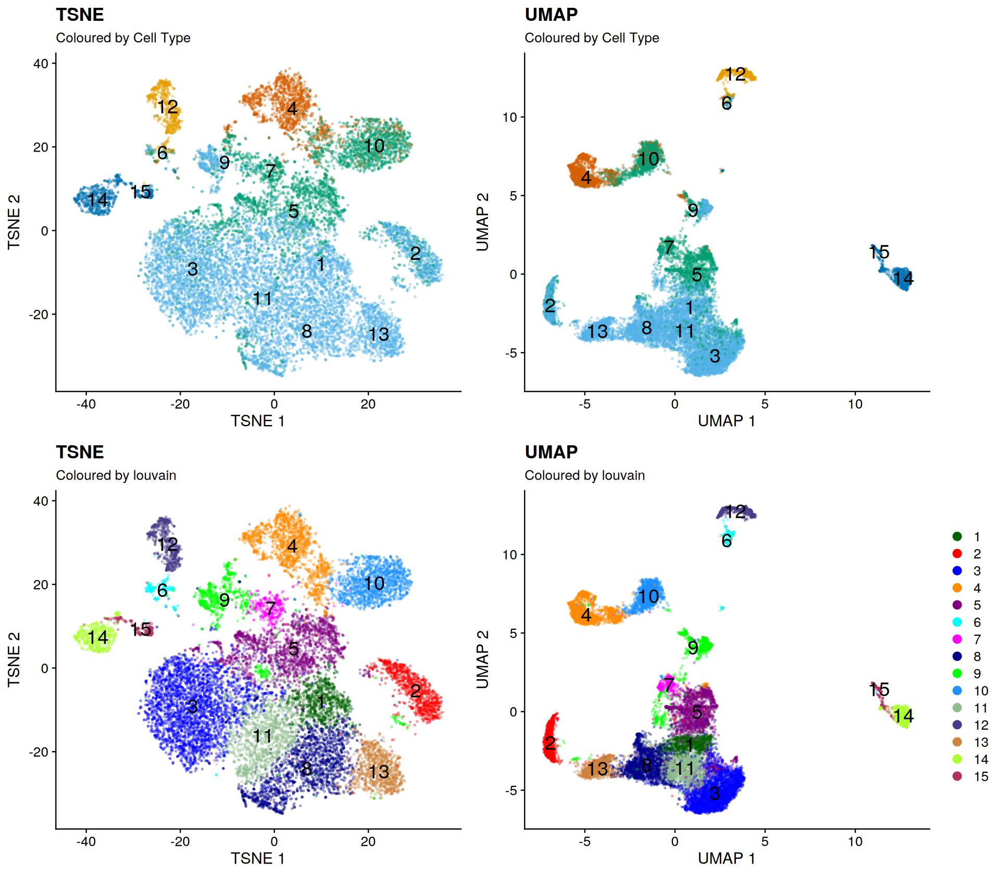
    


### Using 'leiden' algorithm

`is_hierarchical = FALSE`

The `resolution_parameter` is the resolution parameter for the Leiden algorithm. Lower values (less than 1) typically yield fewer clusters with more cells per cluster. Higher values (more than 1) yield more and smaller clusters. Default is 1.


```R
method <- "leiden"
dimname <- "PCA"
n_dimred <- 20 # number of dimensions to use; default is 50
mat <- reducedDim(cdScAnnot, dimname)[, seq_len(n_dimred), drop = FALSE]
k <- 25

set.seed(12345)
communities[[method]][[dimname]] <- clusterRows(mat, full = TRUE, 
                                                NNGraphParam(cluster.fun = method, k = k,
                                                             cluster.args = list(resolution_parameter = 0.45), 
                                                             BNPARAM = AnnoyParam(), num.threads = nthreads))
my.clusters[[method]][[dimname]] <- factor(communities[[method]][[dimname]]$clusters)
```


```R
print(paste(stringr::str_to_title(method), "cluster assignments:"))
for(i in 1:length(my.clusters[[method]])) {
    tab <- table(cdScAnnot$Sample, my.clusters[[method]][[i]])
    names(dimnames(tab))[2] <- method
    print(tab)

    plotSilhouette(mat, my.clusters[[method]][[i]], printDiff = FALSE, plot = FALSE)
}
```

    [1] "Leiden cluster assignments:"
                  leiden
                      1    2    3    4    5    6    7    8    9   10   11   12   13   14   15
      KidneyCancer 1903 1018 3366 1599 1808  216  439 1793  748 1453  366  655 1003  544  257


    Silhouette width summary:


        Min.  1st Qu.   Median     Mean  3rd Qu.     Max. 
    -0.35763  0.06173  0.15890  0.15682  0.25240  0.59302 


```R
fig(width = 16, height = 6)
plotSilhouette(mat, my.clusters[[method]][[dimname]])
reset.fig()
```

    Silhouette width summary:


        Min.  1st Qu.   Median     Mean  3rd Qu.     Max. 
    -0.35763  0.06173  0.15890  0.15682  0.25240  0.59302 
    # A tibble: 15 √ó 2
       cluster `% Different`
       <fct>           <dbl>
     1 1               24.0 
     2 2               13.5 
     3 3                2.41
     4 4                9.32
     5 5               49.4 
     6 6               19.9 
     7 7                2.96
     8 8               13.6 
     9 9               31.2 
    10 10               0.07
    11 11              12.0 
    12 12               0.76
    13 13               0.5 
    14 14               0   
    15 15              14.8 


    

    


#### Show assigned leiden clusters


```R
p1 <- plotProjections(cdScAnnot, "CellType", dimnames = c("TSNE", "UMAP"), 
                      feat_desc = "Cell Type", feat_color = c_celltype_col, 
                      text_by = my.clusters[[method]][[dimname]], legend_pos = "none", add_void = TRUE)

p2 <- plotProjections(cdScAnnot, my.clusters[[method]][[dimname]], dimnames = c("TSNE", "UMAP"), 
                      feat_desc = method, feat_color = c30(), text_by = my.clusters[[method]][[dimname]], 
                      guides_size = 4, guides_ncol = 1)

fig(width = 16, height = 14)
plot_grid(p1, p2, ncol = 1)
reset.fig()
```


    
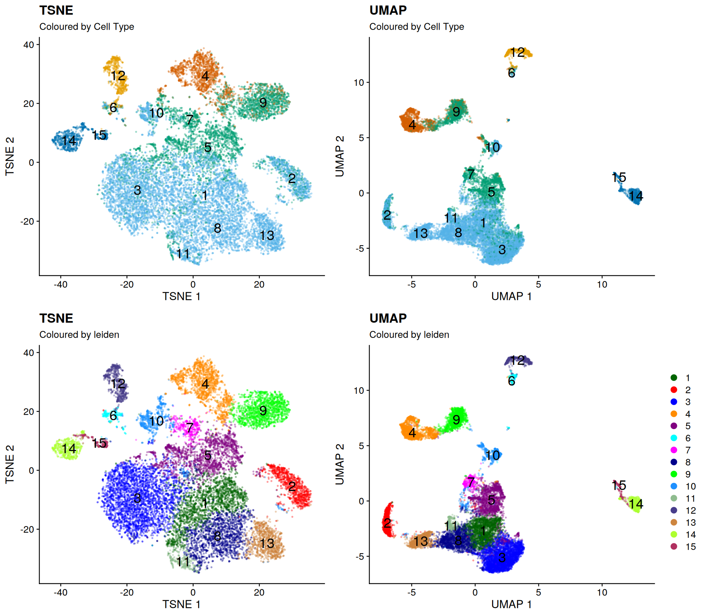
    


## Add assigned clusters to `sce` objects

Choose the desired clustering result and assign to the default "label" column using the `colLabels` function. We also add additional labels (`walktrap`, `louvain` and `leiden`) so that the BCF R Shiny app can find the clustering results by all methods.


```R
cdScAnnot$walktrap <- my.clusters[["walktrap"]][["PCA"]]
cdScAnnot$louvain <- my.clusters[["louvain"]][["PCA"]]
cdScAnnot$leiden <- my.clusters[["leiden"]][["PCA"]]
```

### Show cluster labels from different methods


```R
tab <- table(walktrap = paste0("W", cdScAnnot$walktrap), 
             louvain = paste0("V", cdScAnnot$louvain), 
             leiden = paste0("D", cdScAnnot$leiden))

tab <- gather_set_data(as.data.frame(tab), 1:3)
tab$x <- as.factor(tab$x)
levels(tab$x) <- c("walktrap","louvain","leiden")

tab$walktrap <- factor(tab$walktrap, levels = gtools::mixedsort(levels(tab$walktrap)))
tab$louvain <- factor(tab$louvain, levels = gtools::mixedsort(levels(tab$louvain)))
tab$leiden <- factor(tab$leiden, levels = gtools::mixedsort(levels(tab$leiden)))
tab$y <- factor(tab$y, levels = gtools::mixedsort(levels(tab$y)))
```


```R
# Coloured by leiden clustering
fig(width = 12, height = 12)
ggplot(tab, aes(x, id = id, split = y, value = Freq)) +
  geom_parallel_sets(aes(fill = leiden), alpha = 0.4, axis.width = 0.1) +
  geom_parallel_sets_axes(axis.width = 0.1) +
  geom_parallel_sets_labs(colour = "red", angle = 0, size = 6, nudge_x = 0.15) +
  theme_void(18) + scale_fill_manual(values = choosePalette(tab$leiden)) + 
  theme(legend.position = "none", axis.text.x = element_text(face = "bold", color = "black"))
reset.fig()
```


    
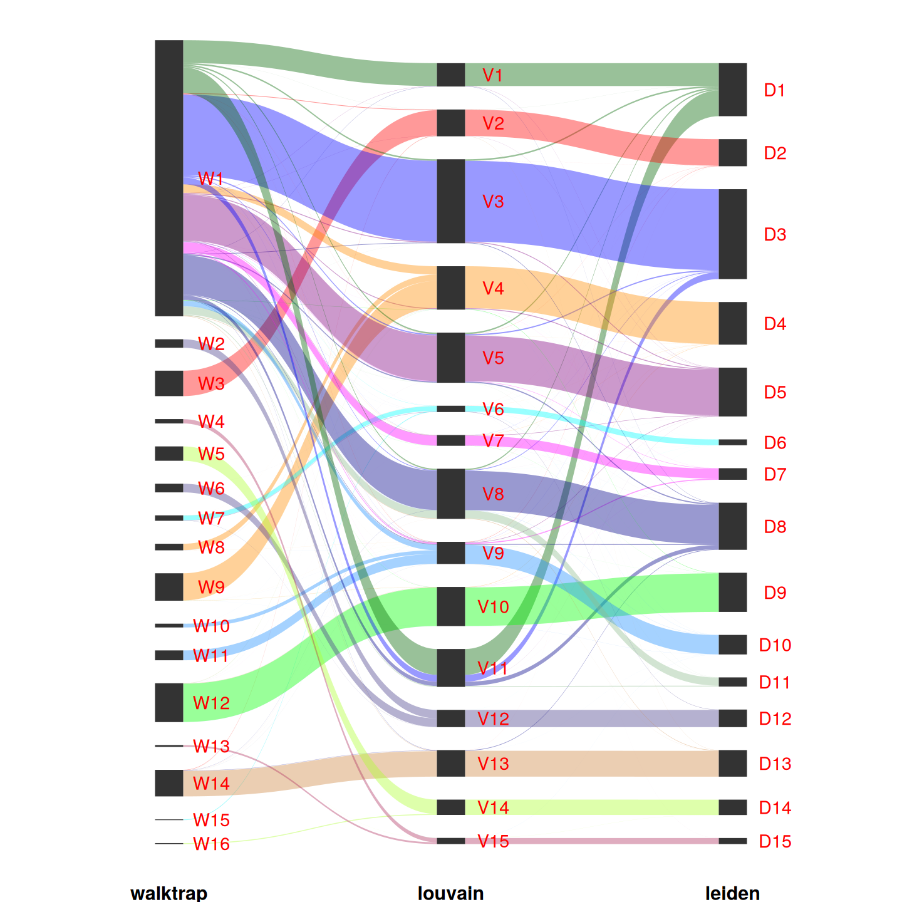
    


### Choose a cluster assignment to store in the default `label` column in `colData`

<div class="alert alert-info">
    <strong>Default method to saved to <code>colLabels</code>:</strong> (edits required)
    <ul>
        <li>louvain</li>
    </ul>
</div>


```R
colLabels(cdScAnnot) <- my.clusters[["louvain"]][["PCA"]]
colLabels(cdScFilt) <- my.clusters[["louvain"]][["PCA"]]

# Set colours for cell clusters
c_clust_col <- choosePalette(colLabels(cdScAnnot), c30)
#c_clust_col
```


```R
# How many cells from each sample are in each cluster?
table_samples_by_clusters <- table(Sample = cdScAnnot$Sample, Cluster = cdScAnnot$label)
table_samples_by_clusters
```


                  Cluster
    Sample            1    2    3    4    5    6    7    8    9   10   11   12   13   14   15
      KidneyCancer 1883  995 3305 1618 1903  232  406 1005  875 1460  646 1967  642  160   71


```R
# No. of cells 
fig(width = 16, height = 3)
ggplot(data.frame(table_samples_by_clusters), aes(Sample, Freq, fill = Cluster)) + 
    geom_bar(position = "stack", stat = "identity", linewidth = 0.2, color = "black") + coord_flip() +
    scale_y_continuous("Number of cells", labels = comma) + guides(fill = guide_legend(ncol = 3)) +
    scale_fill_manual(values = c_clust_col) + theme_cowplot(18)
reset.fig()
```


    
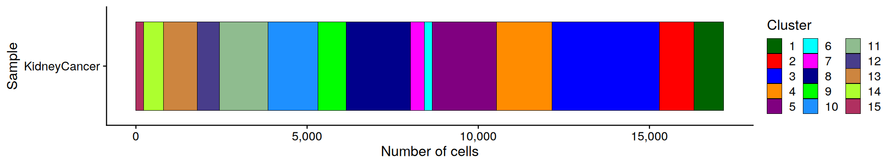
    


```R
# Percenatge cells
fig(width = 16, height = 3)
ggplot(data.frame(table_samples_by_clusters), aes(Sample, Freq, fill = Cluster)) +
    geom_bar(position = "fill", stat = "identity", linewidth = 0.2, color = "black") + coord_flip() +
    scale_y_continuous("Percentage", labels = percent_format()) + guides(fill = guide_legend(ncol = 3)) +
        scale_fill_manual(values = c_clust_col) + theme_cowplot(18)
reset.fig()
```


    
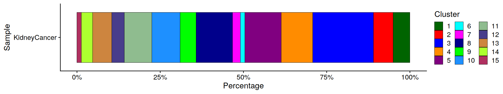
    


## t-SNE and UMAP plots

<div class="alert alert-warning">
    <strong>Warning!</strong> change the <code>dimnames</code> names to view plot in the corresponding reduced dimension results.
</div>


```R
fig(width = 16, height = 7)
plotProjections(cdScAnnot, "label", dimnames = c("TSNE", "UMAP"), feat_desc = "Cluster", 
                feat_color = c_clust_col, text_by = "label", guides_size = 4)
reset.fig()
```


    
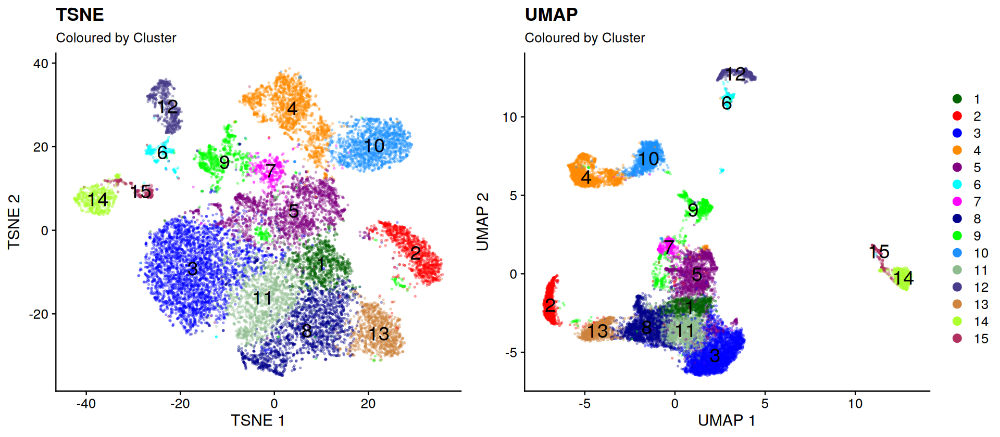
    


```R
fig(width = 16, height = 7)
plotProjections(cdScAnnot, "CellCycle", dimnames = c("TSNE", "UMAP"), feat_desc = "Cell Cycle Phases", 
                feat_color = c_phase_col, text_by = "label", guides_size = 4)
reset.fig()
```


    

    


```R
# Creat breaks
cdScAnnot$log10Sum <- log10(cdScAnnot$sum+1)

bk <- seq(min(cdScAnnot$log10Sum), max(cdScAnnot$log10Sum), max(cdScAnnot$log10Sum)/20)
bk <- round(bk, 2)

fig(width = 16, height = 7)
plotProjections(cdScAnnot, "log10Sum", dimnames = c("TSNE", "UMAP"), feat_desc = "log10(Sum)", 
                feat_color = rev(rainbow(5)), color_breaks = bk, text_by = "label", guides_barheight = 10, 
                rel_widths = c(8, 1))
reset.fig()
```


    
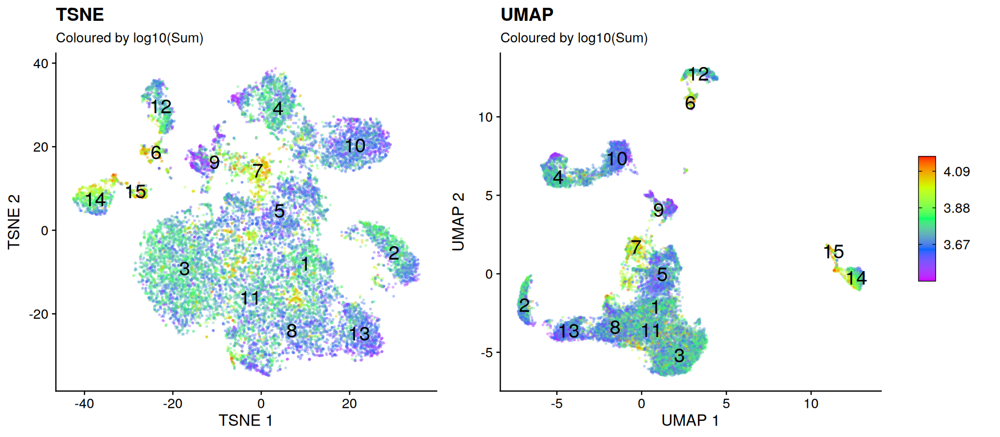
    


```R
fig(width = 16, height = 7)
plotProjections(cdScAnnot, "CellType", dimnames = c("TSNE", "UMAP"), feat_desc = "Cell Type", 
                feat_color = c_celltype_col, text_by = "label", guides_size = 4, guides_ncol = 1, 
                rel_widths = c(6, 1))
reset.fig()
```


    
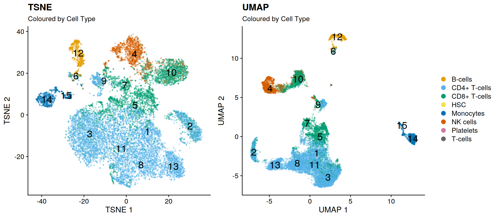
    


```R
fig(width = 16, height = 5)
ggplot(data.frame(table(CellType = cdScAnnot$CellType, Cluster = cdScAnnot$label)), 
       aes(Cluster, Freq, fill = CellType)) +
    geom_bar(position = "fill", stat = "identity", linewidth = 0.2, color = "black") + coord_flip() +
    scale_y_continuous("Percentage", labels = percent_format()) + guides(fill = guide_legend(ncol = 1)) +
    scale_fill_manual(values = c_celltype_col) + theme_cowplot(18)
reset.fig()
```


    

    


```R
fig(width = 16, height = 6)
ggplot(data.frame(table(CellType = cdScAnnot$CellType, Cluster = cdScAnnot$label)), 
       aes(CellType, Freq, fill = Cluster)) +
    geom_bar(position = "fill", stat = "identity", linewidth = 0.2, color = "black") + coord_flip() +
    scale_y_continuous("Percentage", labels = percent_format()) +
    scale_fill_manual(values = c_clust_col) + theme_cowplot(18)
reset.fig()
```


    
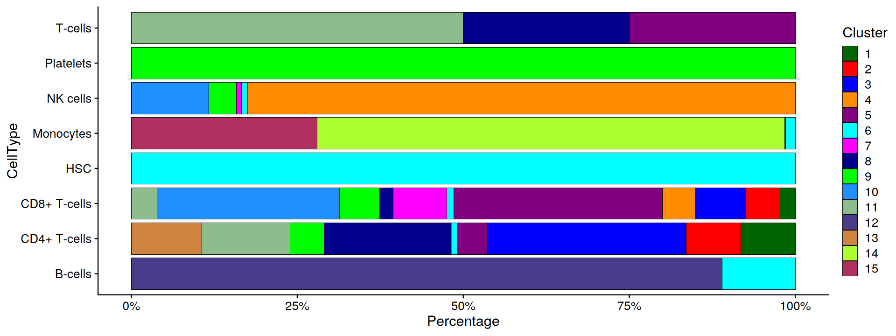
    


```R
table(CellType = cdScAnnot$CellType, Cluster = cdScAnnot$label)
```


                  Cluster
    CellType          1    2    3    4    5    6    7    8    9   10   11   12   13   14   15
      B-cells         0    0    0    0    0   79    0    0    0    0  645    0    0    0    0
      CD4+ T-cells 1639  763 2937    0  437   70   22 1005  500    0    0 1910    0    0   35
      CD8+ T-cells  242  232  368  215 1463   49  373    0  306 1264    0   56    0    1   36
      HSC             0    0    0    0    0    7    0    0    0    0    0    0    0    0    0
      Monocytes       0    0    0    0    0   12    0    0    1    0    1    0  642  158    0
      NK cells        0    0    0 1403    2   15   11    0   67  196    0    0    0    1    0
      Platelets       0    0    0    0    0    0    0    0    1    0    0    0    0    0    0
      T-cells         2    0    0    0    1    0    0    0    0    0    0    1    0    0    0


## Visualising gene expressions in cells

### Single gene expression

In the following plots we visualise the expression of `XIST` (expressed in female) and `DDX3Y` (expressed in male) in individual cells in human samples. The genes in mouse are `Xist` and `Ddx3y` respectively.

<div class="alert alert-warning">
    For <strong>Flex Gene Expression</strong> dataset, <code>XIST</code>/<code>Xist</code> is not available in the feature list, use other X-linked genes instead, such as <code>RLIM</code>/<code>Rlim</code>, <code>LAMP2</code>/<code>Lamp2</code>, and <code>ATRX</code>/<code>Atrx</code>.
</div>


```R
fig(width = 16, height = 7)
plotReducedDimLR(cdScAnnot, "TSNE", c("RLIM","DDX3Y"), lr_color = c("red", "blue"), lr_sep = " and ", 
                 lr_desc = c("Female-\nexpressing","Male-\nexpressing"), oneplot = FALSE)
reset.fig()
```


    

    


<div class="alert alert-info">
  <strong>About this dataset: </strong> (edits required)
  <ul>
    <li>Sample has a mixture of male and female cells.</li>
  </ul>
</div>

## Output average expression (logcounts) across clusters

Set outfile prefix


```R
# Set outfile ID
file_id <- paste0("160k_", sample_name)
file_id
```


'160k_KidneyCancer'


```R
# Use logcounts from cdScAnnot
ave.expr.label <- sumCountsAcrossCells(annot_l, ids = DataFrame(cluster = cdScAnnot$label), average = TRUE, 
                                       BPPARAM = bpp) %>% 
    `colnames<-`(paste0("Cluster", .$cluster)) %>% assay %>% as.data.frame %>% rownames_to_column("Symbol")
head(ave.expr.label)

outfile <- paste0(file_id, "_average_logcounts_in_clusters.tsv")
print(paste("Write to file:", outfile))
write.table(ave.expr.label, file = outfile, sep = "\t", quote = F, row.names = F, col.names = T)
```


<table class="dataframe">
<caption>A data.frame: 6 √ó 16</caption>
<thead>
	<tr><th></th><th scope=col>Symbol</th><th scope=col>Cluster1</th><th scope=col>Cluster2</th><th scope=col>Cluster3</th><th scope=col>Cluster4</th><th scope=col>Cluster5</th><th scope=col>Cluster6</th><th scope=col>Cluster7</th><th scope=col>Cluster8</th><th scope=col>Cluster9</th><th scope=col>Cluster10</th><th scope=col>Cluster11</th><th scope=col>Cluster12</th><th scope=col>Cluster13</th><th scope=col>Cluster14</th><th scope=col>Cluster15</th></tr>
	<tr><th></th><th scope=col>&lt;chr&gt;</th><th scope=col>&lt;dbl&gt;</th><th scope=col>&lt;dbl&gt;</th><th scope=col>&lt;dbl&gt;</th><th scope=col>&lt;dbl&gt;</th><th scope=col>&lt;dbl&gt;</th><th scope=col>&lt;dbl&gt;</th><th scope=col>&lt;dbl&gt;</th><th scope=col>&lt;dbl&gt;</th><th scope=col>&lt;dbl&gt;</th><th scope=col>&lt;dbl&gt;</th><th scope=col>&lt;dbl&gt;</th><th scope=col>&lt;dbl&gt;</th><th scope=col>&lt;dbl&gt;</th><th scope=col>&lt;dbl&gt;</th><th scope=col>&lt;dbl&gt;</th></tr>
</thead>
<tbody>
	<tr><th scope=row>1</th><td>SAMD11 </td><td>0.00000000</td><td>0.00000000</td><td>0.0002033744</td><td>0.00000000</td><td>0.0000000000</td><td>0.00000000</td><td>0.000000000</td><td>0.000000000</td><td>0.00000000</td><td>0.000000000</td><td>0.00000000</td><td>0.000000000</td><td>0.008301157</td><td>0.00000000</td><td>0.00000000</td></tr>
	<tr><th scope=row>2</th><td>NOC2L  </td><td>0.20167342</td><td>0.22491220</td><td>0.1698229005</td><td>0.24974033</td><td>0.1959460539</td><td>0.27349778</td><td>0.229201781</td><td>0.207210673</td><td>0.26167643</td><td>0.195664008</td><td>0.25311776</td><td>0.179858982</td><td>0.357604236</td><td>0.32868397</td><td>0.27599439</td></tr>
	<tr><th scope=row>3</th><td>KLHL17 </td><td>0.01908158</td><td>0.02475166</td><td>0.0199219813</td><td>0.04376829</td><td>0.0212929776</td><td>0.05202231</td><td>0.048346571</td><td>0.024137611</td><td>0.05861359</td><td>0.051585428</td><td>0.03047378</td><td>0.024923540</td><td>0.061018030</td><td>0.04577307</td><td>0.04751783</td></tr>
	<tr><th scope=row>4</th><td>PLEKHN1</td><td>0.01491592</td><td>0.00319319</td><td>0.0193455775</td><td>0.01054495</td><td>0.0114971039</td><td>0.01326478</td><td>0.018993777</td><td>0.005728309</td><td>0.02275638</td><td>0.008958993</td><td>0.00000000</td><td>0.006767170</td><td>0.055246557</td><td>0.05088428</td><td>0.02232967</td></tr>
	<tr><th scope=row>5</th><td>PERM1  </td><td>0.00000000</td><td>0.00000000</td><td>0.0003308256</td><td>0.00000000</td><td>0.0005844212</td><td>0.00000000</td><td>0.002770286</td><td>0.001539252</td><td>0.00000000</td><td>0.000000000</td><td>0.00000000</td><td>0.000000000</td><td>0.000000000</td><td>0.00000000</td><td>0.00000000</td></tr>
	<tr><th scope=row>6</th><td>HES4   </td><td>0.03139355</td><td>0.01045919</td><td>0.0195157252</td><td>0.03200257</td><td>0.0208915892</td><td>0.02966690</td><td>0.034217933</td><td>0.030563464</td><td>0.03798991</td><td>0.005511633</td><td>0.03206313</td><td>0.007730116</td><td>0.215530048</td><td>0.12129157</td><td>0.01716308</td></tr>
</tbody>
</table>


    [1] "Write to file: 160k_KidneyCancer_average_logcounts_in_clusters.tsv"


# 10. Marker gene detection

Potential marker genes are identified by taking the top set of DE genes from each pairwise comparison between clusters. The results are arranged into a single output table that allows a marker set to be easily defined for a user-specified size of the top set. For example, to construct a marker set from the top 10 genes of each comparison, one would filter `marker.set` to retain rows with Top less than or equal to 10.

<div class="alert alert-warning">
  <strong>Warning!</strong> Take note of any poor clusters in the silhouette plot and consider how trustworthy the marker genes actually are.
</div>

Here we are going to use `findMarkers` from `scran` package as this is much faster. 

## Decided the `pval.type` and `min.prop` settings

- Use `pval.type` to specify how p-values are to be combined across pairwise comparisons for a given group/cluster. Defaults `pval.type` is `"any"`.
- Use `min.prop` to specify the minimum proportion of significant comparisons per gene. Defaults `min.prop` is 0.5 when `pval.type="some"`, and zero for all other `pval.type` options.

The choice of `pval.type` determines whether the highly ranked genes are those that are DE between the current group and:

### 1. DE against any other cluster ("any")

If `pval.type="any"`, the null hypothesis is that the **gene is not DE in as least 1 contrasts**. This approach does not explicitly favour genes that are uniquely expressed in a cluster. Rather, it focuses on combinations of genes that - together - drive separation of a cluster from the others. This is more general and robust but tends to yield a less focused marker set compared to the other `pval.type` settings.

Using `pval.type="any"`, the result will contain a `Top` column that shows the minimum rank across all pairwise comparisons. For example, if we define a marker set with an `T` of 1 for a given cluster. The set of genes with `Top <= 1` will contain the top gene from each pairwise comparison to every other cluster. If `T` is `5`, the set will consist of the union of the top 5 genes from each pairwise comparison. This approach does not explicitly favour genes that are uniquely expressed in a cluster. Rather, it focuses on combinations of genes that - together - drive separation of a cluster from the others. This is more general and robust but tends to yield a less focused marker set compared to the other `pval.type` settings.

### 2. DE against all other clusters ("all")

If `pval.type="all"`, the null hypothesis is that the **gene is not DE in all contrasts**. This strategy is particularly effective when dealing with distinct clusters that have a unique expression profile. In such cases, it yields a highly focused marker set that concisely captures the differences between clusters. However, it can be too stringent if the cluster's separation is driven by combinations of gene expression. 

### 3. DE against some (50%) other clusters ("some")

The `pval.type="some"` setting serves as a compromise between "all" and "any". A combined p-value is calculated by taking the middlemost value of the Holm-corrected p-values for each gene. Here, the null hypothesis is that the **gene is not DE in at least half of the contrasts**.

### 4. DE against some other clusters (rank-style)

This is achieved by setting `pval.type="any"` with `min.prop` set to some positive value in (0, 1). Here, we are selecting high-ranked genes that are among the top-ranked (`Top`) genes in at least `min.prop` of the pairwise comparisons

For example, if `pval.type="any", min.prop=0.3`, any gene with a value of `Top` less than or equal to 5 will be in the top 5 DEGs of at least 30% of the comparisons. This method increases the stringency of the `"any"` setting in a safer manner than `pval.type="some"`.

More explanation can be found by `?findMarkers`, `?combineMarkers` and `?combinePValues`.

## Find marker genes for clusters

### Run `findMarkers` (both directions)

Considers both up- and downregulated genes to be potential markers.


```R
# Set pval.type (and min.prop if using "any")
pval.type <- "any"
min.prop <- 0.3

# Using logcounts from cdScFilt
marker.genes.cluster <- findMarkers(filt_l, groups = cdScFilt$label, pval.type = pval.type, 
                                    min.prop = min.prop, BPPARAM = bpp)
marker.genes.cluster
```


    List of length 15
    names(15): 1 2 3 4 5 6 7 8 9 10 11 12 13 14 15


Print the number of markers that passed the FDR or `Top` threshold.


```R
printMarkerStats(marker.genes.cluster, pval.type = pval.type, min.prop = min.prop)
```

    Number of selected markers (Top 200 genes of at least 30.0% comparisons):
    - Cluster1: 170; Up = 128; Down = 42; Max. P-value = 3.4e-133.
    - Cluster2: 173; Up = 74; Down = 99; Max. P-value = 2.1e-166.
    - Cluster3: 165; Up = 142; Down = 23; Max. P-value = 0.
    - Cluster4: 193; Up = 102; Down = 91; Max. P-value = 3.9e-189.
    - Cluster5: 163; Up = 104; Down = 59; Max. P-value = 5.2e-80.
    - Cluster6: 173; Up = 88; Down = 85; Max. P-value = 3.6e-34.
    - Cluster7: 162; Up = 110; Down = 52; Max. P-value = 2.2e-64.
    - Cluster8: 172; Up = 73; Down = 99; Max. P-value = 1.3e-215.
    - Cluster9: 169; Up = 29; Down = 140; Max. P-value = 1.7e-127.
    - Cluster10: 190; Up = 88; Down = 102; Max. P-value = 7.4e-129.
    - Cluster11: 206; Up = 74; Down = 132; Max. P-value = 2.7e-113.
    - Cluster12: 152; Up = 81; Down = 71; Max. P-value = 7.4e-80.
    - Cluster13: 219; Up = 141; Down = 78; Max. P-value = 1e-263.
    - Cluster14: 198; Up = 194; Down = 4; Max. P-value = 5.4e-35.
    - Cluster15: 174; Up = 56; Down = 118; Max. P-value = 7.7e-24.
    * Upregulated when logFC > 0.0 and downregulated when logFC < 0.0.


```R
# Append Ensembl ID and Symbol from rowData
for(ID in names(marker.genes.cluster)) {
    marker.genes.cluster[[ID]] <- cbind(rowData(cdScFilt)[rownames(marker.genes.cluster[[ID]]),][,1:2], 
                                        marker.genes.cluster[[ID]])
}

exportResList(marker.genes.cluster, col_anno = c("ID","Symbol"), prefix = file_id)
```

    Detecting findMarkers input.
    Creating file: 160k_KidneyCancer_findMarkers_Cluster1.tsv
    Creating file: 160k_KidneyCancer_findMarkers_Cluster2.tsv
    Creating file: 160k_KidneyCancer_findMarkers_Cluster3.tsv
    Creating file: 160k_KidneyCancer_findMarkers_Cluster4.tsv
    Creating file: 160k_KidneyCancer_findMarkers_Cluster5.tsv
    Creating file: 160k_KidneyCancer_findMarkers_Cluster6.tsv
    Creating file: 160k_KidneyCancer_findMarkers_Cluster7.tsv
    Creating file: 160k_KidneyCancer_findMarkers_Cluster8.tsv
    Creating file: 160k_KidneyCancer_findMarkers_Cluster9.tsv
    Creating file: 160k_KidneyCancer_findMarkers_Cluster10.tsv
    Creating file: 160k_KidneyCancer_findMarkers_Cluster11.tsv
    Creating file: 160k_KidneyCancer_findMarkers_Cluster12.tsv
    Creating file: 160k_KidneyCancer_findMarkers_Cluster13.tsv
    Creating file: 160k_KidneyCancer_findMarkers_Cluster14.tsv
    Creating file: 160k_KidneyCancer_findMarkers_Cluster15.tsv


### Run `findMarkers` (upregulated genes)

Set `direction='up'` to only consider upregulated genes as potential markers.


```R
# Set pval.type (and min.prop if using "any")
pval.type <- "any"
min.prop <- 0.3
direction <- "up"

# Using logcounts from cdScFilt
marker.genes.cluster.up <- findMarkers(filt_l, groups = cdScFilt$label, pval.type = pval.type, 
                                       min.prop = min.prop, lfc = 0.5, direction = direction, BPPARAM = bpp)
marker.genes.cluster.up
```


    List of length 15
    names(15): 1 2 3 4 5 6 7 8 9 10 11 12 13 14 15


Print the number of markers that passed the FDR or `Top` threshold. This will be the number of genes as inut for `enrichR`.


```R
printMarkerStats(marker.genes.cluster.up, pval.type = pval.type, min.prop = min.prop)
```

    Number of selected markers (Top 200 genes of at least 30.0% comparisons):
    - Cluster1: 255; Up = 255; Down = 0; Max. P-value = 0.73.
    - Cluster2: 247; Up = 247; Down = 0; Max. P-value = 0.14.
    - Cluster3: 238; Up = 238; Down = 0; Max. P-value = 1.2e-165.
    - Cluster4: 228; Up = 228; Down = 0; Max. P-value = 2.2e-18.
    - Cluster5: 242; Up = 242; Down = 0; Max. P-value = 2.9e-07.
    - Cluster6: 203; Up = 203; Down = 0; Max. P-value = 1.
    - Cluster7: 206; Up = 206; Down = 0; Max. P-value = 2.1e-36.
    - Cluster8: 247; Up = 247; Down = 0; Max. P-value = 7.7e-28.
    - Cluster9: 253; Up = 253; Down = 0; Max. P-value = 6.8e-45.
    - Cluster10: 233; Up = 233; Down = 0; Max. P-value = 1.1e-09.
    - Cluster11: 235; Up = 235; Down = 0; Max. P-value = 7.4e-106.
    - Cluster12: 233; Up = 233; Down = 0; Max. P-value = 2.8e-26.
    - Cluster13: 222; Up = 222; Down = 0; Max. P-value = 1.6e-213.
    - Cluster14: 221; Up = 221; Down = 0; Max. P-value = 9.8e-16.
    - Cluster15: 233; Up = 233; Down = 0; Max. P-value = 0.058.
    * Upregulated when logFC > 0.0 and downregulated when logFC < 0.0.


```R
# Append Ensembl ID and Symbol from rowData
for(ID in names(marker.genes.cluster.up)) {
    marker.genes.cluster.up[[ID]] <- cbind(rowData(cdScFilt)[rownames(marker.genes.cluster.up[[ID]]),][,1:2], 
                                           marker.genes.cluster.up[[ID]])
}

exportResList(marker.genes.cluster.up, col_anno = c("ID","Symbol"), prefix = file_id, direction = direction)
```

    Detecting findMarkers input.
    Creating file: 160k_KidneyCancer_findMarkers_upregulated_Cluster1.tsv
    Creating file: 160k_KidneyCancer_findMarkers_upregulated_Cluster2.tsv
    Creating file: 160k_KidneyCancer_findMarkers_upregulated_Cluster3.tsv
    Creating file: 160k_KidneyCancer_findMarkers_upregulated_Cluster4.tsv
    Creating file: 160k_KidneyCancer_findMarkers_upregulated_Cluster5.tsv
    Creating file: 160k_KidneyCancer_findMarkers_upregulated_Cluster6.tsv
    Creating file: 160k_KidneyCancer_findMarkers_upregulated_Cluster7.tsv
    Creating file: 160k_KidneyCancer_findMarkers_upregulated_Cluster8.tsv
    Creating file: 160k_KidneyCancer_findMarkers_upregulated_Cluster9.tsv
    Creating file: 160k_KidneyCancer_findMarkers_upregulated_Cluster10.tsv
    Creating file: 160k_KidneyCancer_findMarkers_upregulated_Cluster11.tsv
    Creating file: 160k_KidneyCancer_findMarkers_upregulated_Cluster12.tsv
    Creating file: 160k_KidneyCancer_findMarkers_upregulated_Cluster13.tsv
    Creating file: 160k_KidneyCancer_findMarkers_upregulated_Cluster14.tsv
    Creating file: 160k_KidneyCancer_findMarkers_upregulated_Cluster15.tsv


### Run `findMarkers` (downregulated genes)

Set `direction='down'` to only consider downregulated genes as potential markers.


```R
# Set pval.type (and min.prop if using "any")
pval.type <- "any"
min.prop <- 0.3
direction <- "down"

# Using logcounts from cdScFilt
marker.genes.cluster.dn <- findMarkers(filt_l, groups = cdScFilt$label, pval.type = pval.type, 
                                       min.prop = min.prop, lfc = 0.5, direction = direction, BPPARAM = bpp)
marker.genes.cluster.dn
```


    List of length 15
    names(15): 1 2 3 4 5 6 7 8 9 10 11 12 13 14 15


Print the number of markers that passed the FDR or `Top` threshold. This will be the number of genes as inut for `enrichR`.


```R
printMarkerStats(marker.genes.cluster.dn, pval.type = pval.type, min.prop = min.prop)
```

    Number of selected markers (Top 200 genes of at least 30.0% comparisons):
    - Cluster1: 116; Up = 0; Down = 116; Max. P-value = 0.0049.
    - Cluster2: 173; Up = 0; Down = 173; Max. P-value = 1.7e-14.
    - Cluster3: 123; Up = 0; Down = 123; Max. P-value = 7.1e-144.
    - Cluster4: 187; Up = 0; Down = 187; Max. P-value = 2.3e-237.
    - Cluster5: 106; Up = 0; Down = 106; Max. P-value = 3e-98.
    - Cluster6: 177; Up = 0; Down = 177; Max. P-value = 1.7e-06.
    - Cluster7: 74; Up = 0; Down = 74; Max. P-value = 5.2e-93.
    - Cluster8: 182; Up = 0; Down = 182; Max. P-value = 3.2e-05.
    - Cluster9: 180; Up = 0; Down = 180; Max. P-value = 3.8e-90.
    - Cluster10: 170; Up = 0; Down = 170; Max. P-value = 2.1e-73.
    - Cluster11: 213; Up = 0; Down = 213; Max. P-value = 4.2e-35.
    - Cluster12: 117; Up = 0; Down = 117; Max. P-value = 3.2e-05.
    - Cluster13: 215; Up = 0; Down = 215; Max. P-value = 2.6e-57.
    - Cluster14: 175; Up = 0; Down = 175; Max. P-value = 5.6e-07.
    - Cluster15: 189; Up = 0; Down = 189; Max. P-value = 2.2e-28.
    * Upregulated when logFC > 0.0 and downregulated when logFC < 0.0.


```R
# Append Ensembl ID and Symbol from rowData
for(ID in names(marker.genes.cluster.dn)) {
    marker.genes.cluster.dn[[ID]] <- cbind(rowData(cdScFilt)[rownames(marker.genes.cluster.dn[[ID]]),][,1:2], 
                                           marker.genes.cluster.dn[[ID]])
}

exportResList(marker.genes.cluster.dn, col_anno = c("ID","Symbol"), prefix = file_id, direction = direction)
```

    Detecting findMarkers input.
    Creating file: 160k_KidneyCancer_findMarkers_downregulated_Cluster1.tsv
    Creating file: 160k_KidneyCancer_findMarkers_downregulated_Cluster2.tsv
    Creating file: 160k_KidneyCancer_findMarkers_downregulated_Cluster3.tsv
    Creating file: 160k_KidneyCancer_findMarkers_downregulated_Cluster4.tsv
    Creating file: 160k_KidneyCancer_findMarkers_downregulated_Cluster5.tsv
    Creating file: 160k_KidneyCancer_findMarkers_downregulated_Cluster6.tsv
    Creating file: 160k_KidneyCancer_findMarkers_downregulated_Cluster7.tsv
    Creating file: 160k_KidneyCancer_findMarkers_downregulated_Cluster8.tsv
    Creating file: 160k_KidneyCancer_findMarkers_downregulated_Cluster9.tsv
    Creating file: 160k_KidneyCancer_findMarkers_downregulated_Cluster10.tsv
    Creating file: 160k_KidneyCancer_findMarkers_downregulated_Cluster11.tsv
    Creating file: 160k_KidneyCancer_findMarkers_downregulated_Cluster12.tsv
    Creating file: 160k_KidneyCancer_findMarkers_downregulated_Cluster13.tsv
    Creating file: 160k_KidneyCancer_findMarkers_downregulated_Cluster14.tsv
    Creating file: 160k_KidneyCancer_findMarkers_downregulated_Cluster15.tsv


## Save `findMarkers` results to `metadata`

<div class="alert alert-info">
    <strong>Tip!</strong> In the accompanied Shiny App, it will look for list(s) named with "findMarkers_" in the prefix in <code>metadata()</code> and show their content under the <u>Gene markers</u> section of the website. In the example below, the content of the 3 lists will be displayed in their respective sub-menus under the following titles: 
    <ul>
        <li>Cluster</li>
        <li>Cluster: up</li>
        <li>Cluster: dn</li>
    </ul>
</div>


```R
metadata(cdScAnnot)[['findMarkers_Cluster']] <- marker.genes.cluster
metadata(cdScAnnot)[['findMarkers_Cluster_up']] <- marker.genes.cluster.up
metadata(cdScAnnot)[['findMarkers_Cluster_dn']] <- marker.genes.cluster.dn
```

## Use cluster marker genes to show cluster similarities


```R
nGene <- 250
geneNames <- sapply(marker.genes.cluster, function(x) rownames(x[1:nGene,]))

geneNames <- unique(as.character(geneNames)) # Remove duplicated genes
print(paste("Number of genes to plot:", length(geneNames)))
```

    [1] "Number of genes to plot: 1183"


```R
fig(width = 16, height = 7)
plotGroupedHeatmap(cdScAnnot, features = geneNames, group = "label", clustering_method = "ward.D2", 
                   border_color = "black", color = c_heatmap_col2, fontsize = 14, angle_col = 0,
                   center = TRUE, scale = TRUE, zlim = c(-3, 3), 
                   main = "Row-scaled", show_rownames = FALSE)
reset.fig()
```


    
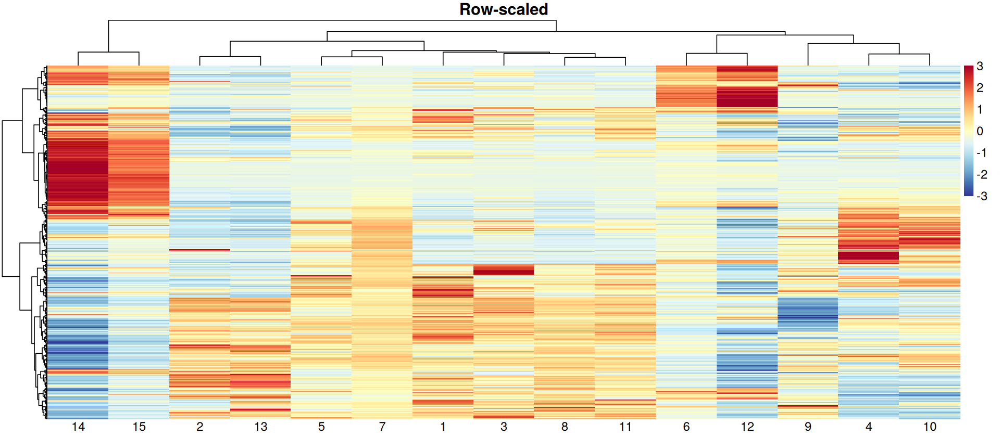
    


<div class="alert alert-warning">
  <strong>Doublet cluster!</strong> Without performing doublet detection (see Section 12), we can already tell from the heatmap above that some clusters potentially have doublet cells due to the <i>smearing</i> expression profile.
</div>

## Visualise first N cluster marker genes

Use `findMarkers` result from both directions. We aimed to present between 50 to 100 genes in the heatmap.


```R
nGene <- 7
geneNames <- sapply(marker.genes.cluster, function(x) rownames(x[1:nGene,]))
t(geneNames) # A matrix

geneNames <- unique(as.character(geneNames)) # Remove duplicated genes
print(paste("Number of genes to plot:", length(geneNames)))
```


<table class="dataframe">
<caption>A matrix: 15 √ó 7 of type chr</caption>
<tbody>
	<tr><th scope=row>1</th><td>CCR4  </td><td>METRNL </td><td>ZFP36L2</td><td>SRGN  </td><td>EFHD2 </td><td>VIM   </td><td>LGALS1  </td></tr>
	<tr><th scope=row>2</th><td>NELL2 </td><td>EFHD2  </td><td>BHLHE40</td><td>METRNL</td><td>ACTN1 </td><td>TGFBR2</td><td>ZEB2    </td></tr>
	<tr><th scope=row>3</th><td>LTB   </td><td>PDE4D  </td><td>FURIN  </td><td>S100A4</td><td>RORA  </td><td>CR1   </td><td>TOB1    </td></tr>
	<tr><th scope=row>4</th><td>NKG7  </td><td>GNLY   </td><td>CCL5   </td><td>EFHD2 </td><td>IL7R  </td><td>CD5   </td><td>KLRD1   </td></tr>
	<tr><th scope=row>5</th><td>CCL5  </td><td>METRNL </td><td>CXCR3  </td><td>ZEB2  </td><td>CST7  </td><td>CD8A  </td><td>NKG7    </td></tr>
	<tr><th scope=row>6</th><td>CD74  </td><td>SYNGR2 </td><td>LYN    </td><td>MKNK2 </td><td>CD83  </td><td>CD79A </td><td>TRAF4   </td></tr>
	<tr><th scope=row>7</th><td>CCL5  </td><td>NKG7   </td><td>GNLY   </td><td>EFHD2 </td><td>ZEB2  </td><td>SYNE1 </td><td>METRNL  </td></tr>
	<tr><th scope=row>8</th><td>FOSL2 </td><td>BHLHE40</td><td>METRNL </td><td>TCF7  </td><td>EFHD2 </td><td>FLNA  </td><td>TGFBR2  </td></tr>
	<tr><th scope=row>9</th><td>CD48  </td><td>UBA52  </td><td>PNRC1  </td><td>EEF1G </td><td>B2M   </td><td>LAPTM5</td><td>TOMM7   </td></tr>
	<tr><th scope=row>10</th><td>GNLY  </td><td>CCL5   </td><td>NKG7   </td><td>FGFBP2</td><td>ZEB2  </td><td>EFHD2 </td><td>RCAN3   </td></tr>
	<tr><th scope=row>11</th><td>CD74  </td><td>BCL11B </td><td>IL7R   </td><td>CD3E  </td><td>CD5   </td><td>CD6   </td><td>LEPROTL1</td></tr>
	<tr><th scope=row>12</th><td>FOSL2 </td><td>METRNL </td><td>EFHD2  </td><td>LEF1  </td><td>CD28  </td><td>LTB   </td><td>RCAN3   </td></tr>
	<tr><th scope=row>13</th><td>SPOCK2</td><td>SPI1   </td><td>PSAP   </td><td>ETS1  </td><td>IL7R  </td><td>FTH1  </td><td>SYNE2   </td></tr>
	<tr><th scope=row>14</th><td>ZEB2  </td><td>SPI1   </td><td>METRNL </td><td>ARRB2 </td><td>IFI30 </td><td>CLEC7A</td><td>IQSEC1  </td></tr>
	<tr><th scope=row>15</th><td>PDZD4 </td><td>ABCB1  </td><td>MYBL1  </td><td>PGGHG </td><td>ZNF516</td><td>MYO15B</td><td>CD52    </td></tr>
</tbody>
</table>


    [1] "Number of genes to plot: 71"


Alternatively, use genes identified from up- and downregulated `findMarkers` results.


```R
#nGene <- 5
#geneNames1 <- sapply(marker.genes.cluster.up, function(x) rownames(x[1:nGene,]))
#geneNames1 # A matrix

#geneNames2 <- sapply(marker.genes.cluster.dn, function(x) rownames(x[1:nGene,]))
#geneNames2 # A matrix

#geneNames <- unique(c(as.character(geneNames1), as.character(geneNames2))) # Remove duplicated genes
#print(paste("Number of genes to plot:", length(geneNames)))
```


```R
p1 <- plotGroupedHeatmap(cdScAnnot, features = geneNames, group = "label", clustering_method = "ward.D2", 
                         border_color = "black", color = c_heatmap_col1, fontsize = 11, angle_col = 0, 
                         main = "Unscaled", silent = T)

p2 <- plotGroupedHeatmap(cdScAnnot, features = geneNames, group = "label", clustering_method = "ward.D2", 
                         border_color = "black", color = c_heatmap_col2, fontsize = 11, angle_col = 0, 
                         center = TRUE, scale = TRUE, zlim = c(-3, 3), main = "Row-scaled", silent = T)

fig(width = 16, height = 18)
plot_grid(p1$gtable, p2$gtable, ncol = 2, align = "h")
reset.fig()
```


    
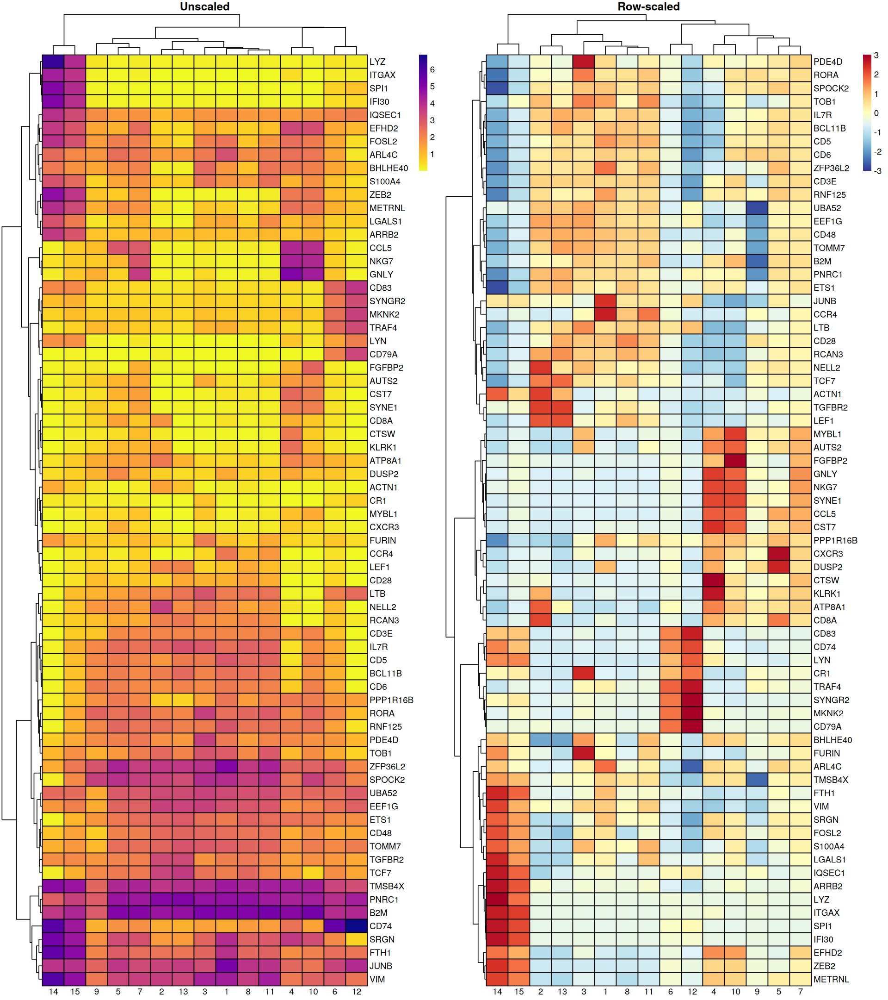
    


The `plotDots` function create a dot plot of expression values for a grouping of cells, where the size and colour of each dot represents the proportion of detected expression values and the average expression, respectively, for each feature in each group of cells.

The mean expression of each gene is centered at zero with `center = TRUE`. The expression of each gene is scaled to have unit variance with `scale = TRUE`.


```R
fig(width = 9, height = 20)
plotDots(cdScAnnot, features = geneNames[p2$tree_row$order], group = "label", zlim = c(-3, 3), 
         center = TRUE, scale = TRUE) + scale_size(limits = c(0, 1), range = c(0.1, 6)) + 
    scale_y_discrete(limits = geneNames[p2$tree_row$order]) + # order genes based on heatmap p2 above
    scale_x_discrete(limits = p2$tree_col$labels[p2$tree_col$order]) + # order clusters based on heatmap p2 above
    guides(colour = guide_colourbar(title = "Row (Gene) Z-Score", barwidth = 10), 
           size = guide_legend(title = "Proportion Detected")) + theme_cowplot(16) + #coord_flip() +
    theme(panel.grid.major = element_line(colour = "gray90"), 
          legend.position = "top", legend.justification = "center", legend.title.position = "top") + 
    labs(x = "Cluster", y = "Genes")
reset.fig()
```

    Scale for size is already present.
    Adding another scale for size, which will replace the existing scale.


    
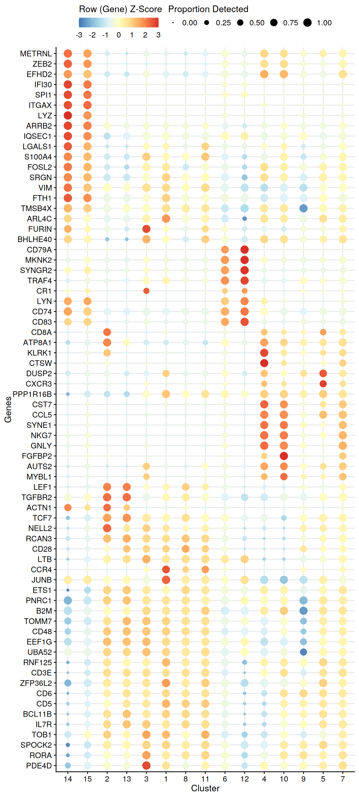
    


```R
# Prepare stacked violin plot
geneExprs <- logcounts(cdScAnnot)[geneNames,]
geneExprs <- as.data.frame(t(as.matrix(geneExprs)))

geneExprs$Cell <- rownames(geneExprs)
geneExprs$Cluster <- cdScAnnot$label

geneExprs <- pivot_longer(geneExprs, cols = -c(Cell, Cluster), names_to = "Gene", values_to = "Expression") %>% 
    mutate(Cluster = fct_rev(Cluster), Gene = factor(Gene, levels = geneNames))

# Plot
fig(width = 16, height = 8)
ggplot(geneExprs, aes(Gene, Expression, fill = Gene)) + 
    geom_violin(scale = "width", adjust = 1, trim = TRUE) +
    scale_y_continuous(expand = c(0, 0), position = "right", 
                       labels = function(x) c(rep(x = "", times = length(x)-2), x[length(x) - 1], "")) +
    facet_grid(rows = vars(Cluster), scales = "free", switch = "y") + theme_cowplot(font_size = 16) +
    theme(legend.position = "none", panel.spacing = unit(0, "lines"), 
          panel.background = element_rect(fill = NA, color = "black"), strip.background = element_blank(),
          strip.text = element_text(face = "bold"), strip.text.y.left = element_text(angle = 0),
          axis.text.x = element_text(size = 12, angle = 90, hjust = 1, vjust = 0.5)) +
    xlab("Genes") + ylab("Expression Level")
reset.fig()
```


    
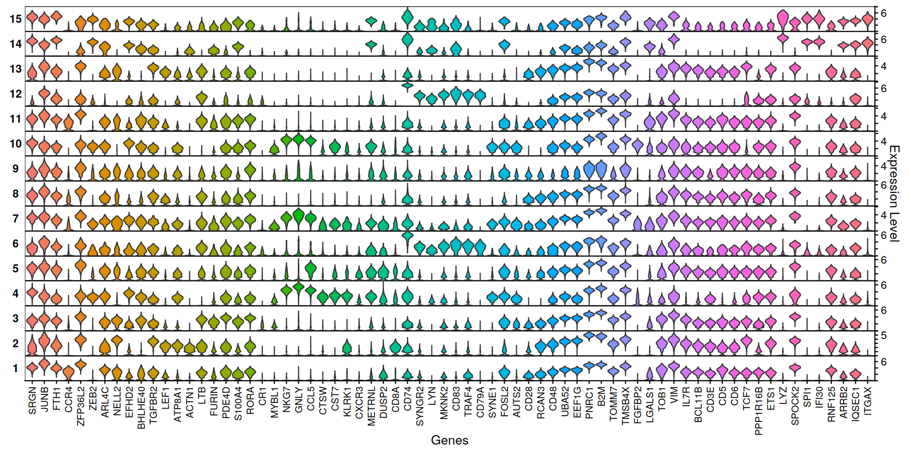
    


## Visualise first upregulated marker genes from each cluster


```R
geneNames <- sapply(marker.genes.cluster.up, function(x) rownames(x[1,]))
#geneNames

df <- data.frame(cluster = names(geneNames), gene = geneNames) %>% group_by(gene) %>% 
summarise(cluster = paste(cluster, collapse = ",")) %>% 
mutate(order = as.numeric(str_replace(cluster, ",.*", ""))) %>% arrange(order)
df

print(paste("Number of genes to plot:", nrow(df)))
```


<table class="dataframe">
<caption>A tibble: 12 √ó 3</caption>
<thead>
	<tr><th scope=col>gene</th><th scope=col>cluster</th><th scope=col>order</th></tr>
	<tr><th scope=col>&lt;chr&gt;</th><th scope=col>&lt;chr&gt;</th><th scope=col>&lt;dbl&gt;</th></tr>
</thead>
<tbody>
	<tr><td>CCR4 </td><td>1     </td><td> 1</td></tr>
	<tr><td>NELL2</td><td>2     </td><td> 2</td></tr>
	<tr><td>PDE4D</td><td>3     </td><td> 3</td></tr>
	<tr><td>NKG7 </td><td>4     </td><td> 4</td></tr>
	<tr><td>CCL5 </td><td>5,7,10</td><td> 5</td></tr>
	<tr><td>CD74 </td><td>6,11  </td><td> 6</td></tr>
	<tr><td>TCF7 </td><td>8     </td><td> 8</td></tr>
	<tr><td>ZAP70</td><td>9     </td><td> 9</td></tr>
	<tr><td>IL7R </td><td>12    </td><td>12</td></tr>
	<tr><td>SPI1 </td><td>13    </td><td>13</td></tr>
	<tr><td>ZEB2 </td><td>14    </td><td>14</td></tr>
	<tr><td>CD52 </td><td>15    </td><td>15</td></tr>
</tbody>
</table>


    [1] "Number of genes to plot: 12"


```R
p1 <- plotGroupedHeatmap(cdScAnnot, features = df$gene, group = "label", clustering_method = "ward.D2", 
                         border_color = "black", color = c_heatmap_col1, fontsize = 11, angle_col = 0, 
                         main = "Unscaled", silent = T)

p2 <- plotGroupedHeatmap(cdScAnnot, features = df$gene, group = "label", clustering_method = "ward.D2", 
                         border_color = "black", color = c_heatmap_col2, fontsize = 11, angle_col = 0, 
                         center = TRUE, scale = TRUE, zlim = c(-3, 3), main = "Row-scaled", silent = T)

fig(width = 16, height = 6)
plot_grid(p1$gtable, p2$gtable, ncol = 2, align = "h")
reset.fig()
```


    
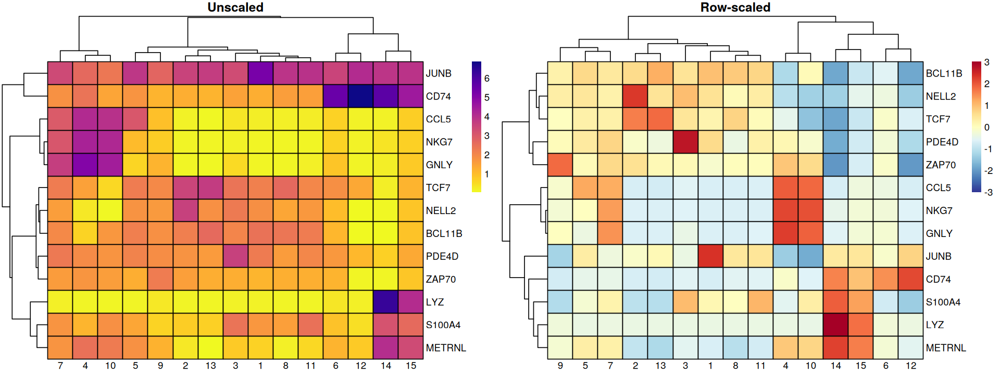
    


```R
fig(width = 9, height = 6)
plotDots(cdScAnnot, features = df$gene[p2$tree_row$order], group = "label", zlim = c(-3, 3), 
         center = TRUE, scale = TRUE) + scale_size(limits = c(0, 1), range = c(0.1, 6)) + 
    scale_y_discrete(limits = df$gene[p2$tree_row$order]) + # order genes based on heatmap p2 above
    scale_x_discrete(limits = p2$tree_col$labels[p2$tree_col$order]) + # order clusters based on heatmap p2 above
    guides(colour = guide_colourbar(title = "Row (Gene) Z-Score", barwidth = 10), 
           size = guide_legend(title = "Proportion Detected")) + theme_cowplot(16) + #coord_flip() +
    theme(panel.grid.major = element_line(colour = "gray90"), 
          legend.position = "top", legend.justification = "center", legend.title.position = "top") + 
    labs(x = "Cluster", y = "Genes")
reset.fig()
```

    Scale for size is already present.
    Adding another scale for size, which will replace the existing scale.


    
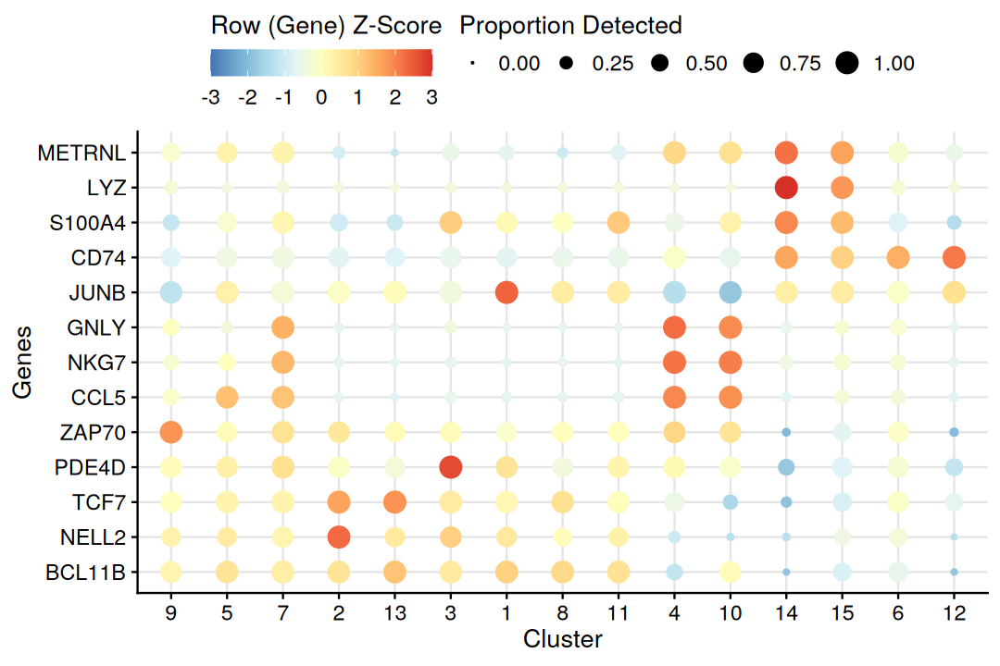
    


```R
fig(width = 16, height = 7)
plotExpression(cdScAnnot, x = "label", colour_by = "label", features = df$gene, point_size = 0.5, 
               theme_size = 16, ncol = 3) + scale_color_manual(values = c_clust_col) + 
    theme(legend.position = "none") + labs(x = "Cluster")
reset.fig()
```

    Scale for colour is already present.
    Adding another scale for colour, which will replace the existing scale.


    
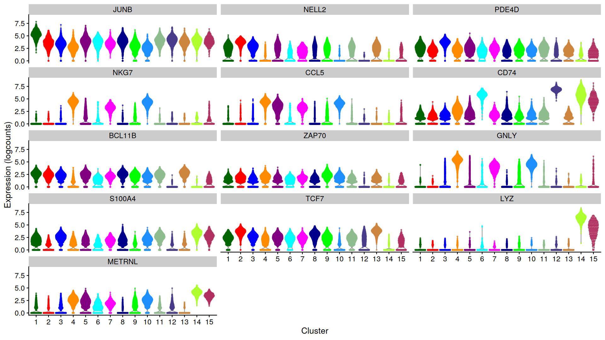
    


```R
dimname <- "TSNE"

fig(width = 16, height = 9)
as.data.frame(reducedDim(cdScAnnot, dimname)) %>% `colnames<-`(c("V1","V2")) %>%
    bind_cols(as_tibble(t(logcounts(cdScAnnot[df$gene,])))) %>%
    gather(., key = "Symbol", value = "Expression", -c(V1, V2) ) %>% 
    mutate_at(vars(Symbol), factor) %>% mutate(Symbol = factor(Symbol, levels = df$gene)) %>% 
    ggplot(aes(x = V1, y = V2, color = Expression)) + geom_point(size = 0.3, alpha = 0.3) + 
    facet_wrap(~ Symbol, ncol = 5, 
               labeller = as_labeller(function(x) paste0(df$cluster,": ", x))) + # add cluster id
    scale_color_viridis(option = "plasma", direction = -1) +
    theme_classic(base_size = 16) + labs(x = paste(dimname, "1"), y = paste(dimname, "2"))
reset.fig()
```


    
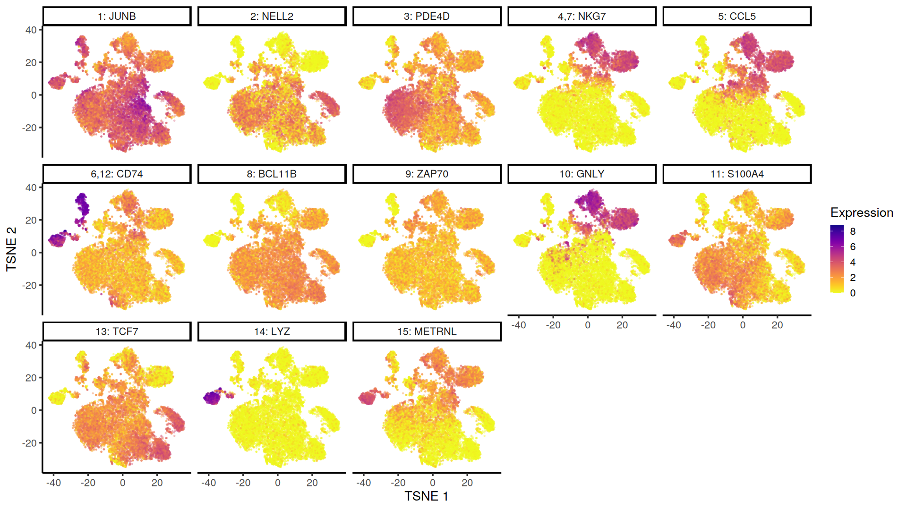
    


# 11. Functional analysis using `enrichR`

## Enriched pathways

We use the `enrichR` package to access the [Enrichr](https://maayanlab.cloud/Enrichr/) website to perform gene set enrichment analysis.

### Set up `enrichR`

All the available gene-set libraries are listed in `dbs`


```R
# This function generates the whole list of database for the enrichR. 
dbs <- listEnrichrDbs()
print(paste("Number of available databases from Enrichr:", nrow(dbs)))
#head(dbs)
```

    [1] "Number of available databases from Enrichr: 240"


Change `dbsSel` to remove or include more gene-set libraries in the enrichment analysis.


```R
# Human
dbsSel <- c("GO_Biological_Process_2023", # Ontologies
#            "GO_Molecular_Function_2023", # Ontologies
#            "GO_Cellular_Component_2023", # Ontologies
            "Reactome_Pathways_2024",     # Pathways
            "WikiPathways_2024_Human",    # Pathways
            "CellMarker_2024")            # Cell types

# Mouse
#dbsSel <- c("GO_Biological_Process_2023", # Ontologies
#            "GO_Molecular_Function_2023", # Ontologies
#            "GO_Cellular_Component_2023", # Ontologies
#            "Reactome_Pathways_2024",     # Pathways
#            "WikiPathways_2024_Mouse",    # Pathways
#            "CellMarker_2024")            # Cell types
```

### Run enrichR

**On upregulated 'Cluster' marker genes (from `findMarkers`)**


```R
input <- metadata(cdScAnnot)[['findMarkers_Cluster_up']]
metadata(cdScAnnot)[['enrichR_findMarkers_Cluster_up']] <- runEnrichR(input, dbs = dbsSel, direction = "up", 
                                                                      column_by = "Symbol")
```

    Detecting findMarkers input.
    Connection changed to https://maayanlab.cloud/Enrichr/
    
    Connection is Live!
    
    Running enrichR on 'Cluster1' with 255 up-regulated genes.


    Uploading data to Enrichr... Done.
      Querying GO_Biological_Process_2023... Done.
      Querying Reactome_Pathways_2024... Done.
      Querying WikiPathways_2024_Human... Done.
      Querying CellMarker_2024... Done.
    Parsing results... Done.


    Running enrichR on 'Cluster2' with 247 up-regulated genes.


    Uploading data to Enrichr... Done.
      Querying GO_Biological_Process_2023... Done.
      Querying Reactome_Pathways_2024... Done.
      Querying WikiPathways_2024_Human... Done.
      Querying CellMarker_2024... Done.
    Parsing results... Done.


    Running enrichR on 'Cluster3' with 238 up-regulated genes.


    Uploading data to Enrichr... Done.
      Querying GO_Biological_Process_2023... Done.
      Querying Reactome_Pathways_2024... Done.
      Querying WikiPathways_2024_Human... Done.
      Querying CellMarker_2024... Done.
    Parsing results... Done.


    Running enrichR on 'Cluster4' with 228 up-regulated genes.


    Uploading data to Enrichr... Done.
      Querying GO_Biological_Process_2023... Done.
      Querying Reactome_Pathways_2024... Done.
      Querying WikiPathways_2024_Human... Done.
      Querying CellMarker_2024... Done.
    Parsing results... Done.


    Running enrichR on 'Cluster5' with 242 up-regulated genes.


    Uploading data to Enrichr... Done.
      Querying GO_Biological_Process_2023... Done.
      Querying Reactome_Pathways_2024... Done.
      Querying WikiPathways_2024_Human... Done.
      Querying CellMarker_2024... Done.
    Parsing results... Done.


    Running enrichR on 'Cluster6' with 203 up-regulated genes.


    Uploading data to Enrichr... Done.
      Querying GO_Biological_Process_2023... Done.
      Querying Reactome_Pathways_2024... Done.
      Querying WikiPathways_2024_Human... Done.
      Querying CellMarker_2024... Done.
    Parsing results... Done.


    Running enrichR on 'Cluster7' with 206 up-regulated genes.


    Uploading data to Enrichr... Done.
      Querying GO_Biological_Process_2023... Done.
      Querying Reactome_Pathways_2024... Done.
      Querying WikiPathways_2024_Human... Done.
      Querying CellMarker_2024... Done.
    Parsing results... Done.


    Running enrichR on 'Cluster8' with 247 up-regulated genes.


    Uploading data to Enrichr... Done.
      Querying GO_Biological_Process_2023... Done.
      Querying Reactome_Pathways_2024... Done.
      Querying WikiPathways_2024_Human... Done.
      Querying CellMarker_2024... Done.
    Parsing results... Done.


    Running enrichR on 'Cluster9' with 253 up-regulated genes.


    Uploading data to Enrichr... Done.
      Querying GO_Biological_Process_2023... Done.
      Querying Reactome_Pathways_2024... Done.
      Querying WikiPathways_2024_Human... Done.
      Querying CellMarker_2024... Done.
    Parsing results... Done.


    Running enrichR on 'Cluster10' with 233 up-regulated genes.


    Uploading data to Enrichr... Done.
      Querying GO_Biological_Process_2023... Done.
      Querying Reactome_Pathways_2024... Done.
      Querying WikiPathways_2024_Human... Done.
      Querying CellMarker_2024... Done.
    Parsing results... Done.


    Running enrichR on 'Cluster11' with 235 up-regulated genes.


    Uploading data to Enrichr... Done.
      Querying GO_Biological_Process_2023... Done.
      Querying Reactome_Pathways_2024... Done.
      Querying WikiPathways_2024_Human... Done.
      Querying CellMarker_2024... Done.
    Parsing results... Done.


    Running enrichR on 'Cluster12' with 233 up-regulated genes.


    Uploading data to Enrichr... Done.
      Querying GO_Biological_Process_2023... Done.
      Querying Reactome_Pathways_2024... Done.
      Querying WikiPathways_2024_Human... Done.
      Querying CellMarker_2024... Done.
    Parsing results... Done.


    Running enrichR on 'Cluster13' with 222 up-regulated genes.


    Uploading data to Enrichr... Done.
      Querying GO_Biological_Process_2023... Done.
      Querying Reactome_Pathways_2024... Done.
      Querying WikiPathways_2024_Human... Done.
      Querying CellMarker_2024... Done.
    Parsing results... Done.


    Running enrichR on 'Cluster14' with 221 up-regulated genes.


    Uploading data to Enrichr... Done.
      Querying GO_Biological_Process_2023... Done.
      Querying Reactome_Pathways_2024... Done.
      Querying WikiPathways_2024_Human... Done.
      Querying CellMarker_2024... Done.
    Parsing results... Done.


    Running enrichR on 'Cluster15' with 233 up-regulated genes.


    Uploading data to Enrichr... Done.
      Querying GO_Biological_Process_2023... Done.
      Querying Reactome_Pathways_2024... Done.
      Querying WikiPathways_2024_Human... Done.
      Querying CellMarker_2024... Done.
    Parsing results... Done.


### Plot enrichR results

Using `GO_Biological_Process_2023` as example.

**On upregulated 'Cluster' marker genes**


```R
fig(width = 16, height = 5)
plotEnrichR(metadata(cdScAnnot)[['enrichR_findMarkers_Cluster_up']], db = "GO_Biological_Process_2023")
reset.fig()
```


    
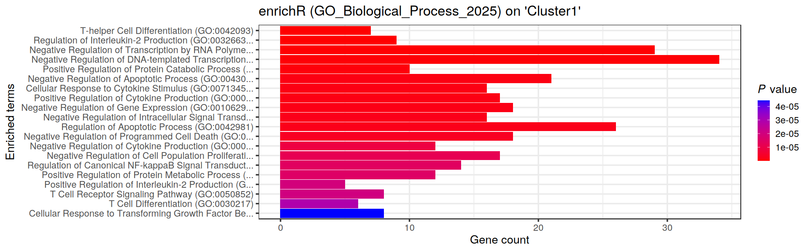
    


    
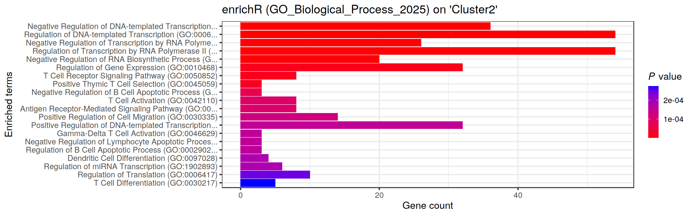
    


    
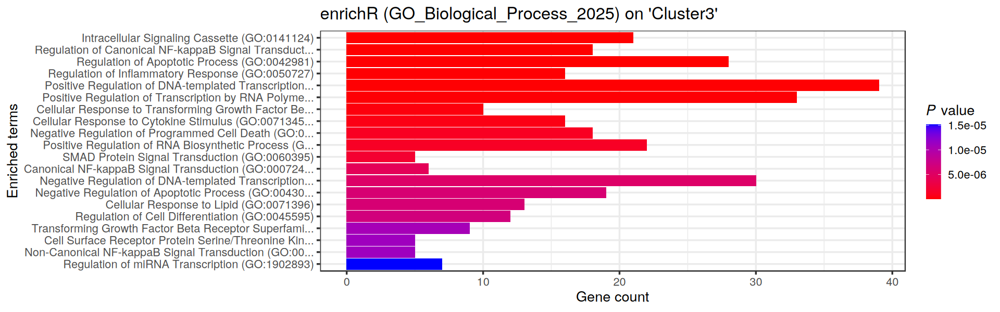
    


    
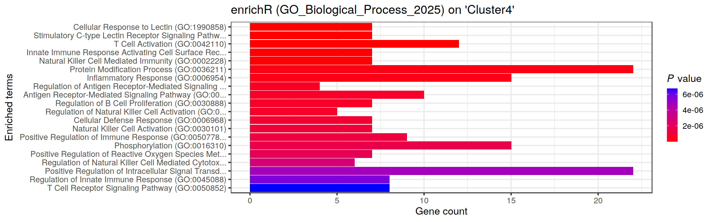
    


    
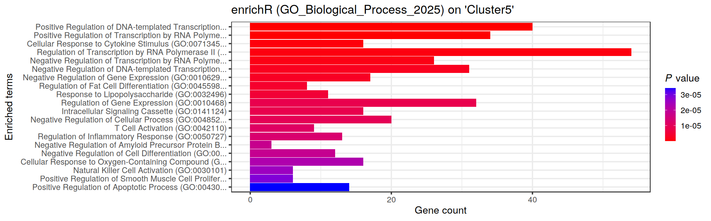
    


    

    


    
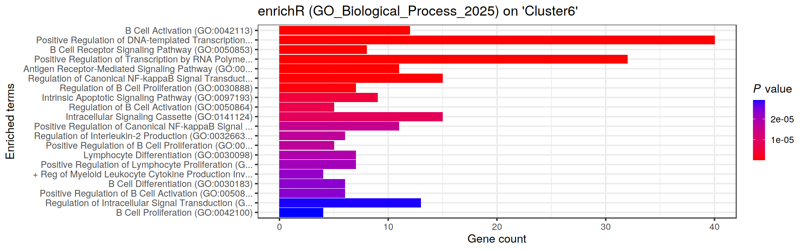
    


    
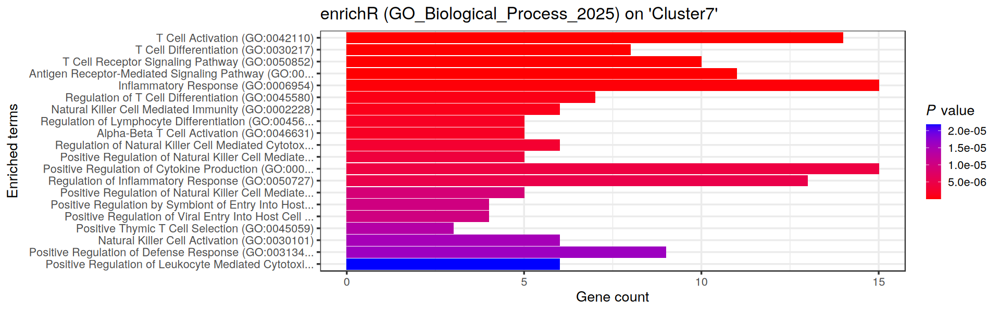
    


    
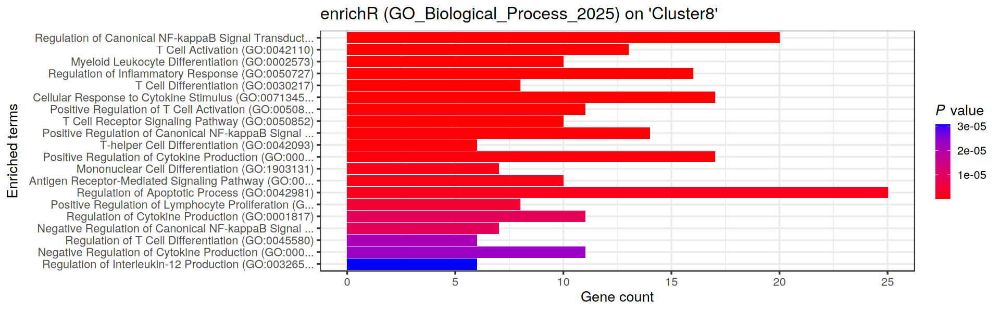
    


    
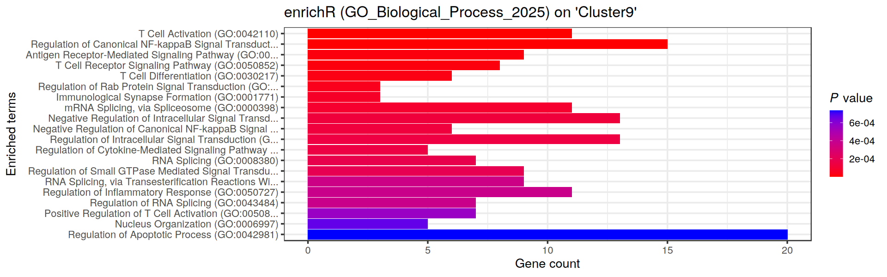
    


    
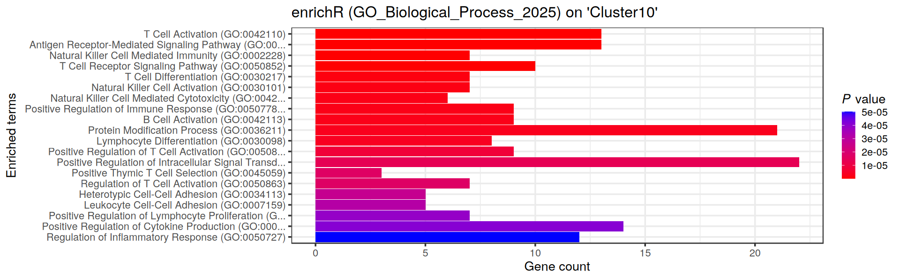
    


    
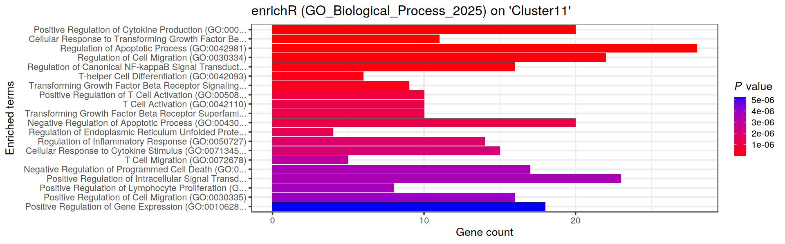
    


    
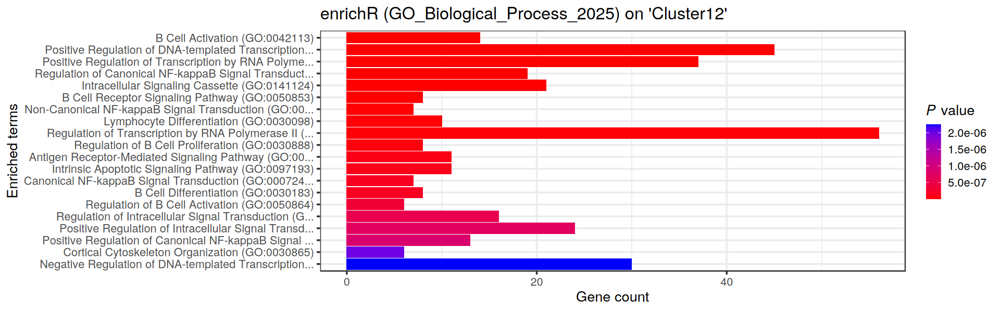
    


    
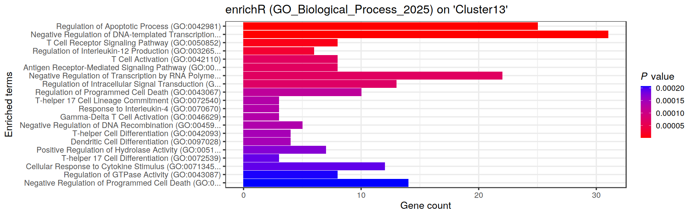
    


    
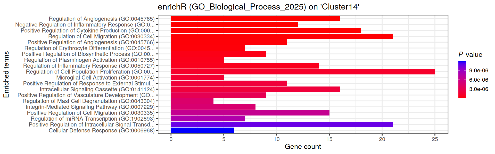
    


### Print enrichR results to files

#### Create a sub-folder `Enrichr` to store enrichR results


```R
dir.create(file.path("Enrichr"), showWarnings = FALSE)
```

**On upregulated 'Cluster' marker genes**


```R
printEnrichR(metadata(cdScAnnot)[["enrichR_findMarkers_Cluster_up"]], 
             prefix = file.path("Enrichr", paste0(file_id, "_findMarkers_upregulated")))
```

    Creating file: Enrichr/160k_KidneyCancer_findMarkers_upregulated_Cluster1_GO_Biological_Process_2023.tsv
    Creating file: Enrichr/160k_KidneyCancer_findMarkers_upregulated_Cluster1_Reactome_Pathways_2024.tsv
    Creating file: Enrichr/160k_KidneyCancer_findMarkers_upregulated_Cluster1_WikiPathways_2024_Human.tsv
    Creating file: Enrichr/160k_KidneyCancer_findMarkers_upregulated_Cluster1_CellMarker_2024.tsv
    Creating file: Enrichr/160k_KidneyCancer_findMarkers_upregulated_Cluster2_GO_Biological_Process_2023.tsv
    Creating file: Enrichr/160k_KidneyCancer_findMarkers_upregulated_Cluster2_Reactome_Pathways_2024.tsv
    Creating file: Enrichr/160k_KidneyCancer_findMarkers_upregulated_Cluster2_WikiPathways_2024_Human.tsv
    Creating file: Enrichr/160k_KidneyCancer_findMarkers_upregulated_Cluster2_CellMarker_2024.tsv
    Creating file: Enrichr/160k_KidneyCancer_findMarkers_upregulated_Cluster3_GO_Biological_Process_2023.tsv
    Creating file: Enrichr/160k_KidneyCancer_findMarkers_upregulated_Cluster3_Reactome_Pathways_2024.tsv
    Creating file: Enrichr/160k_KidneyCancer_findMarkers_upregulated_Cluster3_WikiPathways_2024_Human.tsv
    Creating file: Enrichr/160k_KidneyCancer_findMarkers_upregulated_Cluster3_CellMarker_2024.tsv
    Creating file: Enrichr/160k_KidneyCancer_findMarkers_upregulated_Cluster4_GO_Biological_Process_2023.tsv
    Creating file: Enrichr/160k_KidneyCancer_findMarkers_upregulated_Cluster4_Reactome_Pathways_2024.tsv
    Creating file: Enrichr/160k_KidneyCancer_findMarkers_upregulated_Cluster4_WikiPathways_2024_Human.tsv
    Creating file: Enrichr/160k_KidneyCancer_findMarkers_upregulated_Cluster4_CellMarker_2024.tsv
    Creating file: Enrichr/160k_KidneyCancer_findMarkers_upregulated_Cluster5_GO_Biological_Process_2023.tsv
    Creating file: Enrichr/160k_KidneyCancer_findMarkers_upregulated_Cluster5_Reactome_Pathways_2024.tsv
    Creating file: Enrichr/160k_KidneyCancer_findMarkers_upregulated_Cluster5_WikiPathways_2024_Human.tsv
    Creating file: Enrichr/160k_KidneyCancer_findMarkers_upregulated_Cluster5_CellMarker_2024.tsv
    Creating file: Enrichr/160k_KidneyCancer_findMarkers_upregulated_Cluster6_GO_Biological_Process_2023.tsv
    Creating file: Enrichr/160k_KidneyCancer_findMarkers_upregulated_Cluster6_Reactome_Pathways_2024.tsv
    Creating file: Enrichr/160k_KidneyCancer_findMarkers_upregulated_Cluster6_WikiPathways_2024_Human.tsv
    Creating file: Enrichr/160k_KidneyCancer_findMarkers_upregulated_Cluster6_CellMarker_2024.tsv
    Creating file: Enrichr/160k_KidneyCancer_findMarkers_upregulated_Cluster7_GO_Biological_Process_2023.tsv
    Creating file: Enrichr/160k_KidneyCancer_findMarkers_upregulated_Cluster7_Reactome_Pathways_2024.tsv
    Creating file: Enrichr/160k_KidneyCancer_findMarkers_upregulated_Cluster7_WikiPathways_2024_Human.tsv
    Creating file: Enrichr/160k_KidneyCancer_findMarkers_upregulated_Cluster7_CellMarker_2024.tsv
    Creating file: Enrichr/160k_KidneyCancer_findMarkers_upregulated_Cluster8_GO_Biological_Process_2023.tsv
    Creating file: Enrichr/160k_KidneyCancer_findMarkers_upregulated_Cluster8_Reactome_Pathways_2024.tsv
    Creating file: Enrichr/160k_KidneyCancer_findMarkers_upregulated_Cluster8_WikiPathways_2024_Human.tsv
    Creating file: Enrichr/160k_KidneyCancer_findMarkers_upregulated_Cluster8_CellMarker_2024.tsv
    Creating file: Enrichr/160k_KidneyCancer_findMarkers_upregulated_Cluster9_GO_Biological_Process_2023.tsv
    Creating file: Enrichr/160k_KidneyCancer_findMarkers_upregulated_Cluster9_Reactome_Pathways_2024.tsv
    Creating file: Enrichr/160k_KidneyCancer_findMarkers_upregulated_Cluster9_WikiPathways_2024_Human.tsv
    Creating file: Enrichr/160k_KidneyCancer_findMarkers_upregulated_Cluster9_CellMarker_2024.tsv
    Creating file: Enrichr/160k_KidneyCancer_findMarkers_upregulated_Cluster10_GO_Biological_Process_2023.tsv
    Creating file: Enrichr/160k_KidneyCancer_findMarkers_upregulated_Cluster10_Reactome_Pathways_2024.tsv
    Creating file: Enrichr/160k_KidneyCancer_findMarkers_upregulated_Cluster10_WikiPathways_2024_Human.tsv
    Creating file: Enrichr/160k_KidneyCancer_findMarkers_upregulated_Cluster10_CellMarker_2024.tsv
    Creating file: Enrichr/160k_KidneyCancer_findMarkers_upregulated_Cluster11_GO_Biological_Process_2023.tsv
    Creating file: Enrichr/160k_KidneyCancer_findMarkers_upregulated_Cluster11_Reactome_Pathways_2024.tsv
    Creating file: Enrichr/160k_KidneyCancer_findMarkers_upregulated_Cluster11_WikiPathways_2024_Human.tsv
    Creating file: Enrichr/160k_KidneyCancer_findMarkers_upregulated_Cluster11_CellMarker_2024.tsv
    Creating file: Enrichr/160k_KidneyCancer_findMarkers_upregulated_Cluster12_GO_Biological_Process_2023.tsv
    Creating file: Enrichr/160k_KidneyCancer_findMarkers_upregulated_Cluster12_Reactome_Pathways_2024.tsv
    Creating file: Enrichr/160k_KidneyCancer_findMarkers_upregulated_Cluster12_WikiPathways_2024_Human.tsv
    Creating file: Enrichr/160k_KidneyCancer_findMarkers_upregulated_Cluster12_CellMarker_2024.tsv
    Creating file: Enrichr/160k_KidneyCancer_findMarkers_upregulated_Cluster13_GO_Biological_Process_2023.tsv
    Creating file: Enrichr/160k_KidneyCancer_findMarkers_upregulated_Cluster13_Reactome_Pathways_2024.tsv
    Creating file: Enrichr/160k_KidneyCancer_findMarkers_upregulated_Cluster13_WikiPathways_2024_Human.tsv
    Creating file: Enrichr/160k_KidneyCancer_findMarkers_upregulated_Cluster13_CellMarker_2024.tsv
    Creating file: Enrichr/160k_KidneyCancer_findMarkers_upregulated_Cluster14_GO_Biological_Process_2023.tsv
    Creating file: Enrichr/160k_KidneyCancer_findMarkers_upregulated_Cluster14_Reactome_Pathways_2024.tsv
    Creating file: Enrichr/160k_KidneyCancer_findMarkers_upregulated_Cluster14_WikiPathways_2024_Human.tsv
    Creating file: Enrichr/160k_KidneyCancer_findMarkers_upregulated_Cluster14_CellMarker_2024.tsv
    Creating file: Enrichr/160k_KidneyCancer_findMarkers_upregulated_Cluster15_GO_Biological_Process_2023.tsv
    Creating file: Enrichr/160k_KidneyCancer_findMarkers_upregulated_Cluster15_Reactome_Pathways_2024.tsv
    Creating file: Enrichr/160k_KidneyCancer_findMarkers_upregulated_Cluster15_WikiPathways_2024_Human.tsv
    Creating file: Enrichr/160k_KidneyCancer_findMarkers_upregulated_Cluster15_CellMarker_2024.tsv


## Ingenuity Pathway Analysis (IPA)

Here we generate a file that can be imported directly into IPA for downstream analysis.

### Concatenate `findMarkers` 'Cluster' marker gene results


```R
exportResList(metadata(cdScAnnot)[['findMarkers_Cluster']], concatenate = TRUE, col_anno = c("ID","Symbol"), 
              prefix = file_id)
```

    Detecting findMarkers input.
    Creating a concatenated file: 160k_KidneyCancer_findMarkers_concatenated.tsv


# 12. Doublet detection

In single-cell RNA sequencing (scRNA-seq) experiments, doublets are artifactual libraries generated from two cells. They typically arise due to errors in cell sorting or capture, especially in droplet-based protocols involving thousands of cells. Doublets are obviously undesirable when the aim is to characterize populations at the single-cell level. In particular, doublets can be mistaken for intermediate populations or transitory states that do not actually exist. Thus, it is desirable to identify and remove doublet libraries so that they do not compromise interpretation of the results. See [OSCA reference](https://bioconductor.org/books/3.20/OSCA.advanced/doublet-detection.html#doublet-detection)

## Doublet detection by simulation

The `computeDoubletDensity()` function from the `scDblFinder` package performs *in silico* simulation of doublets from the single-cell expression profiles by:

1. Simulate thousands of doublets by adding together two randomly chosen single-cell profiles.
2. For each original cell, compute the density of simulated doublets in the surrounding neighborhood.
3. For each original cell, compute the density of other observed cells in the neighborhood.
4. Return the ratio between the two densities as a “doublet score” for each cell.


```R
set.seed(12345)
# Use counts from cdScAnnot
dbl.dens <- scDblFinder::computeDoubletDensity(annot_c, size.factors.norm = sizeFactors(cdScAnnot), 
                                               subset.row = hvg_genes)
summary(dbl.dens)

# Save detection results to metadata
metadata(cdScAnnot)[['DoubletDensity']] <- setNames(dbl.dens, colnames(cdScAnnot))
```


       Min. 1st Qu.  Median    Mean 3rd Qu.    Max. 
      0.000   0.060   0.200   1.034   0.680  19.700 


```R
fig(width = 16, height = 6)
plyr::ldply(split(log1p(dbl.dens), cdScAnnot$label), cbind, .id = c("Cluster")) %>% 
    rename_at(2, ~ "dbl") %>% ggplot(aes(Cluster, dbl, color = Cluster)) + 
    geom_violin(linewidth = 1, width = 1) +
    geom_boxplot(size = 0.5, width = 0.1, color = "black") + guides(color = guide_legend(ncol = 1)) +
    scale_color_manual(values = c_clust_col) + theme_cowplot(20) + ylab("log Score")
reset.fig()
```


    
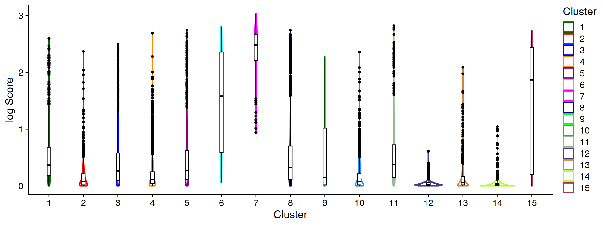
    


```R
fig(width = 16, height = 7)
plotProjections(cdScAnnot, log1p(dbl.dens), dimnames = c("TSNE", "UMAP"), 
                feat_desc = "Doublet Score (log1p)", feat_color = plasma(256, direction = -1), 
                text_by = "label")
reset.fig()
```


    
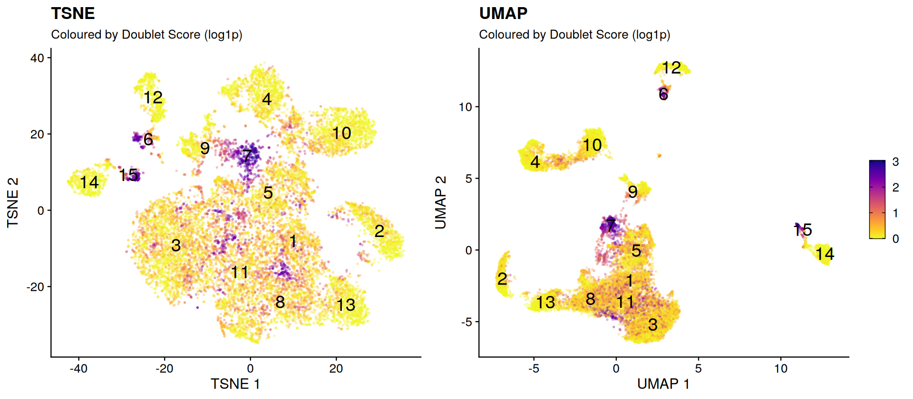
    


If cells with high scores are clustered in one or more clusters, we can choose to show the N `Top` upregulated marker genes from the selected cluster(s) to check if there are suspicious expression of marker genes.


```R
chosen.doublet <- c(7, 14)
nTop <- 25

fig(width = 16, height = 7)
for(ID in chosen.doublet) {
    dbl.markers <- marker.genes.cluster.up[[ID]]
    chosen <- rownames(dbl.markers)[dbl.markers$Top <= nTop]
    title <- paste0("Cluster: ", ID)

    p1 <- plotGroupedHeatmap(cdScAnnot, features = chosen, group = "label", clustering_method = "ward.D2", 
                             border_color = "black", color = c_heatmap_col1, fontsize = 11, angle_col = 0,
                             main = paste(title, "Unscaled"), silent = T)

    p2 <- plotGroupedHeatmap(cdScAnnot, features = chosen, group = "label", clustering_method = "ward.D2", 
                             border_color = "black", color = c_heatmap_col2, fontsize = 11, angle_col = 0,
                             center = TRUE, scale = TRUE, zlim = c(-3, 3),
                             main = paste(title, "Row-scaled"), silent = T)

    print(plot_grid(p1$gtable, p2$gtable, ncol = 2, align = "h"))
}
reset.fig()
```


    
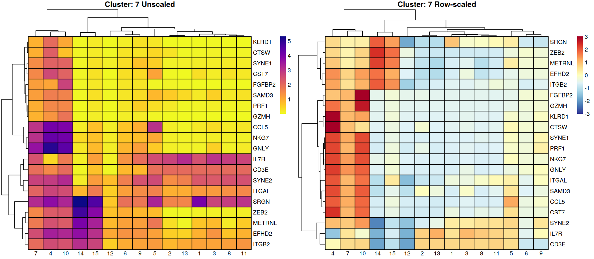
    


    
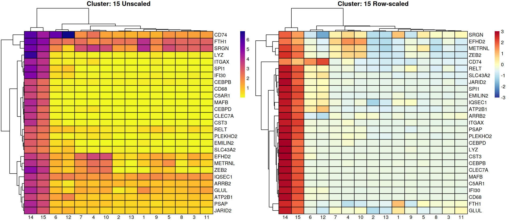
    


# Save `runInfo` to `metadata`

<div class="alert alert-info">
    <strong>Tip!</strong> In the accompanied Shiny App, the Run Information will be displayed under the <u>Overview</u>.
</div>


```R
metadata(cdScAnnot)[['runInfo']] <- runInfo
cdScAnnot
```


    class: SingleCellExperiment 
    dim: 18129 17168 
    metadata(8): Samples cyclone ... DoubletDensity runInfo
    assays(2): counts logcounts
    rownames(18129): SAMD11 NOC2L ... MT-ND6 MT-CYB
    rowData names(12): ID Symbol ... pct_dropout is_hvg
    colnames(17168): AAACAAGCAAATACCGATGTTGAC-1 AAACAAGCAACAGATTATGTTGAC-1 ...
      TTTGTGAGTGTCCTTCATGTTGAC-1 TTTGTGAGTTGGATGAATGTTGAC-1
    colData names(23): Sample Barcode ... label log10Sum
    reducedDimNames(3): PCA TSNE UMAP
    mainExpName: Gene Expression
    altExpNames(1): Antibody Capture


# Save objects


```R
# Remove unwanted information stored in the SingleCellExperiment before saving the object
# For example, this removed "PCA" from the reducedDims slot
# reducedDim(cdScAnnot, "PCA") <- NULL
```


```R
# For HDF5-based SummarizedExperiment object
HDF5Array::saveHDF5SummarizedExperiment(cdScAnnot, dir = paste0(sample_name, "_h5_sce"), replace = TRUE, verbose = FALSE)

# Print file size
paste("Folder:", paste0(sample_name, "_h5_sce"))
paste("Size:", utils:::format.object_size(file.info(paste0(sample_name, "_h5_sce", "/assays.h5"))$size + 
                                          file.info(paste0(sample_name, "_h5_sce", "/se.rds"))$size, "auto"))
```


'Folder: KidneyCancer_h5_sce'


'Size: 577.4 Mb'


# Session Info


```R
writeLines(capture.output(sessionInfo()), "sessionInfo.txt")
sessionInfo()
```


    R version 4.4.3 (2025-02-28)
    Platform: x86_64-conda-linux-gnu
    Running under: Ubuntu 20.04.6 LTS
    
    Matrix products: default
    BLAS/LAPACK: /home/ihsuan/miniconda3/envs/github_sc/lib/libopenblasp-r0.3.29.so;  LAPACK version 3.12.0
    
    locale:
     [1] LC_CTYPE=en_GB.UTF-8       LC_NUMERIC=C               LC_TIME=en_GB.UTF-8       
     [4] LC_COLLATE=en_GB.UTF-8     LC_MONETARY=en_GB.UTF-8    LC_MESSAGES=en_GB.UTF-8   
     [7] LC_PAPER=en_GB.UTF-8       LC_NAME=C                  LC_ADDRESS=C              
    [10] LC_TELEPHONE=C             LC_MEASUREMENT=en_GB.UTF-8 LC_IDENTIFICATION=C       
    
    time zone: Europe/London
    tzcode source: system (glibc)
    
    attached base packages:
    [1] grid      stats4    stats     graphics  grDevices utils     datasets  methods   base     
    
    other attached packages:
     [1] ensembldb_2.30.0            AnnotationFilter_1.30.0     GenomicFeatures_1.58.0     
     [4] AnnotationDbi_1.68.0        lubridate_1.9.4             forcats_1.0.0              
     [7] stringr_1.5.1               dplyr_1.1.4                 purrr_1.0.4                
    [10] readr_2.1.5                 tidyr_1.3.1                 tibble_3.2.1               
    [13] tidyverse_2.0.0             scRUtils_0.3.8              viridis_0.6.5              
    [16] viridisLite_0.4.2           SingleR_2.8.0               scran_1.34.0               
    [19] scater_1.34.1               scuttle_1.16.0              scales_1.3.0               
    [22] ggforce_0.4.2               ggplot2_3.5.2               enrichR_3.4                
    [25] DropletUtils_1.26.0         SingleCellExperiment_1.28.1 SummarizedExperiment_1.36.0
    [28] Biobase_2.66.0              GenomicRanges_1.58.0        GenomeInfoDb_1.42.3        
    [31] IRanges_2.40.1              S4Vectors_0.44.0            MatrixGenerics_1.18.1      
    [34] matrixStats_1.5.0           cowplot_1.1.3               bluster_1.16.0             
    [37] BiocParallel_1.40.2         BiocNeighbors_2.0.1         AnnotationHub_3.14.0       
    [40] BiocFileCache_2.14.0        dbplyr_2.5.0                BiocGenerics_0.52.0        
    [43] kableExtra_1.4.0           
    
    loaded via a namespace (and not attached):
      [1] RcppAnnoy_0.0.22          BiocIO_1.16.0             pbdZMQ_0.3-14             bitops_1.0-9             
      [5] filelock_1.0.3            R.oo_1.27.0               polyclip_1.10-7           XML_3.99-0.18            
      [9] httr2_1.1.2               lifecycle_1.0.4           scDblFinder_1.20.2        edgeR_4.4.2              
     [13] doParallel_1.0.17         lattice_0.22-7            MASS_7.3-65               alabaster.base_1.6.1     
     [17] magrittr_2.0.3            limma_3.62.2              rmarkdown_2.29            yaml_2.3.10              
     [21] metapod_1.14.0            DBI_1.2.3                 RColorBrewer_1.1-3        abind_1.4-8              
     [25] zlibbioc_1.52.0           Rtsne_0.17                R.utils_2.13.0            RCurl_1.98-1.17          
     [29] WriteXLS_6.7.0            tweenr_2.0.3              rappdirs_0.3.3            circlize_0.4.16          
     [33] GenomeInfoDbData_1.2.13   ggrepel_0.9.6             irlba_2.3.5.1             pheatmap_1.0.12          
     [37] dqrng_0.4.1               svglite_2.1.3             DelayedMatrixStats_1.28.1 codetools_0.2-20         
     [41] DelayedArray_0.32.0       xml2_1.3.8                tidyselect_1.2.1          shape_1.4.6.1            
     [45] UCSC.utils_1.2.0          farver_2.1.2              ScaledMatrix_1.14.0       base64enc_0.1-3          
     [49] GenomicAlignments_1.42.0  jsonlite_2.0.0            GetoptLong_1.0.5          iterators_1.0.14         
     [53] systemfonts_1.2.2         foreach_1.5.2             tools_4.4.3               ggnewscale_0.5.1         
     [57] Rcpp_1.0.14               glue_1.8.0                gridExtra_2.3             SparseArray_1.6.2        
     [61] xfun_0.52                 IRdisplay_1.1             gypsum_1.2.0              HDF5Array_1.34.0         
     [65] withr_3.0.2               BiocManager_1.30.25       fastmap_1.2.0             rhdf5filters_1.18.1      
     [69] digest_0.6.37             rsvd_1.0.5                timechange_0.3.0          R6_2.6.1                 
     [73] mime_0.13                 colorspace_2.1-1          Cairo_1.6-2               gtools_3.9.5             
     [77] RSQLite_2.3.9             R.methodsS3_1.8.2         celldex_1.16.0            utf8_1.2.4               
     [81] generics_0.1.3            data.table_1.17.0         rtracklayer_1.66.0        httr_1.4.7               
     [85] S4Arrays_1.6.0            uwot_0.2.3                pkgconfig_2.0.3           gtable_0.3.6             
     [89] blob_1.2.4                ComplexHeatmap_2.22.0     XVector_0.46.0            htmltools_0.5.8.1        
     [93] ProtGenerics_1.38.0       clue_0.3-66               alabaster.matrix_1.6.1    png_0.1-8                
     [97] knitr_1.50                rstudioapi_0.17.1         tzdb_0.5.0                rjson_0.2.23             
    [101] uuid_1.2-1                curl_6.2.2                repr_1.1.7                cachem_1.1.0             
    [105] rhdf5_2.50.2              GlobalOptions_0.1.2       BiocVersion_3.20.0        parallel_4.4.3           
    [109] vipor_0.4.7               restfulr_0.0.15           alabaster.schemas_1.6.0   pillar_1.10.2            
    [113] vctrs_0.6.5               BiocSingular_1.22.0       beachmat_2.22.0           cluster_2.1.8.1          
    [117] beeswarm_0.4.0            evaluate_1.0.3            Rsamtools_2.22.0          cli_3.6.4                
    [121] locfit_1.5-9.12           compiler_4.4.3            rlang_1.1.6               crayon_1.5.3             
    [125] labeling_0.4.3            plyr_1.8.9                ggbeeswarm_0.7.2          stringi_1.8.7            
    [129] alabaster.se_1.6.0        munsell_0.5.1             Biostrings_2.74.1         lazyeval_0.2.2           
    [133] Matrix_1.7-3              ExperimentHub_2.14.0      IRkernel_1.3.2            hms_1.1.3                
    [137] sparseMatrixStats_1.18.0  bit64_4.6.0-1             Rhdf5lib_1.28.0           KEGGREST_1.46.0          
    [141] statmod_1.5.0             alabaster.ranges_1.6.0    igraph_2.1.4              memoise_2.0.1            
    [145] xgboost_1.7.10.1          bit_4.6.0                


# References

1. Lun ATL, McCarthy DJ and Marioni JC. A step-by-step workflow for low-level analysis of single-cell RNA-seq data with Bioconductor. F1000Research (2016) 5:2122 (https://doi.org/10.12688/f1000research.9501.2)
2. Luecke MD and Theis FJ, Current best practices in single‚Äêcell RNA‚Äêseq analysis: a tutorial, Mol Syst Biol (2019) 15:e8746 https://doi.org/10.15252/msb.20188746)
3. Amezquita R, Lun ATL, Hicks S and Gottardo R. Orchestrating Single-Cell Analysis with Bioconductor. Version: 1.16.0; Compiled: 2024-10-30. (http://bioconductor.org/books/release/OSCA/)
4. Lun ATL. Aaron's single-cell thoughts (https://ltla.github.io/SingleCellThoughts/)
5. University of Cambridge Bioinformatics Training Unit. Analysis of single cell RNA-seq data. Compiled: 2022-08-08. (https://scrnaseq-course.cog.sanger.ac.uk/website/index.html)
6. Harvard Chan Bioinformatics Core. Introduction to Single-cell RNA-seq. (https://hbctraining.github.io/scRNA-seq/schedule/)
